15

在微服务架构中，从各个服务端获取数据最常见的是同步调用，如下图所示：

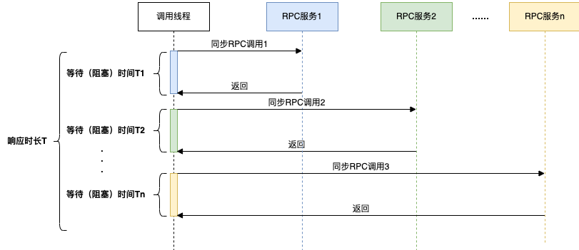

在同步调用的场景下，接口耗时长、性能差，接口响应时长`T > T1+T2+T3+……+Tn`，这时为了缩短接口的响应时间，一般会使用线程池的方式并行获取数据：

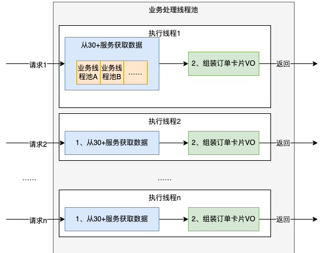

这种方式由于以下两个原因，导致资源利用率比较低：

* CPU资源大量浪费在阻塞等待上，导致CPU资源利用率低。在Java 8之前，一般会通过回调的方式来减少阻塞，但是大量使用回调，又引发臭名昭著的**回调地狱**问题，导致代码可读性和可维护性大大降低。
* 为了增加并发度，会引入更多额外的线程池，随着CPU调度线程数的增加，会导致更严重的资源争用，宝贵的CPU资源被损耗在上下文切换上，而且线程本身也会占用系统资源，且不能无限增加。

同步模型下，会导致硬件资源无法充分利用，系统吞吐量容易达到瓶颈。

在Java8之前我们一般通过**Future**实现异步。Future 用作对异步计算结果的引用，它提供了`isDone()`一种检查计算是否完成的`get()`方法，以及一种在计算完成时检索计算结果的方法。

Future API 是向 Java 异步编程迈出的一大步，但它缺乏一些重要且有用的特性，比如：

* 不支持设置回调方法，为了获取异步的计算结果，Future必须阻塞主线程，或者通过主线程轮询的方式
* Future无法很好的实现异步任务间的复杂编排（比如前后依赖、等待全部完成、任一任务完成得到通知等）
* 复杂的场景下 Future 代码不优雅，可读性很低

**CompletableFuture**是JDK 1.8开始提供的一个函数式异步编程工具，继承并改进了Future，可以通过回调函数的方式实现异步编程，并且提供了多种异步任务编排方式以及通用的异常处理机制。

Java 8之前若要设置回调一般会使用guava的`ListenableFuture`，下面将举例来说明，我们通过`ListenableFuture`、`CompletableFuture`来实现异步的差异。假设有三个操作step1、step2、step3存在依赖关系，其中step3的执行依赖step1和step2的结果。

Future(ListenableFuture)的实现（回调地狱）如下：

```java

ExecutorService executor = Executors.newFixedThreadPool(5);
ListeningExecutorService guavaExecutor = MoreExecutors.listeningDecorator(executor);
ListenableFuture<String> future1 = guavaExecutor.submit(() -> {
    //step 1
    System.out.println("执行step 1");
    return "step1 result";
});
ListenableFuture<String> future2 = guavaExecutor.submit(() -> {
    //step 2
    System.out.println("执行step 2");
    return "step2 result";
});
ListenableFuture<List<String>> future1And2 = Futures.allAsList(future1, future2);
Futures.addCallback(future1And2, new FutureCallback<List<String>>() {
    @Override
    public void onSuccess(List<String> result) {
        System.out.println(result);
        ListenableFuture<String> future3 = guavaExecutor.submit(() -> {
            System.out.println("执行step 3");
            return "step3 result";
        });
        Futures.addCallback(future3, new FutureCallback<String>() {
            @Override
            public void onSuccess(String result) {
                System.out.println(result);
            }        
            @Override
            public void onFailure(Throwable t) {
            }
        }, guavaExecutor);
    }

    @Override
    public void onFailure(Throwable t) {
    }}, guavaExecutor);


```


CompletableFuture的实现如下：

```java

ExecutorService executor = Executors.newFixedThreadPool(5);
CompletableFuture<String> cf1 = CompletableFuture.supplyAsync(() -> {
    System.out.println("执行step 1");
    return "step1 result";
}, executor);
CompletableFuture<String> cf2 = CompletableFuture.supplyAsync(() -> {
    System.out.println("执行step 2");
    return "step2 result";
});
cf1.thenCombine(cf2, (result1, result2) -> {
    System.out.println(result1 + " , " + result2);
    System.out.println("执行step 3");
    return "step3 result";
}).thenAccept(result3 -> System.out.println(result3));


```

显然，CompletableFuture的实现更为简洁，可读性更好。


# 2、CompletableFuture用法

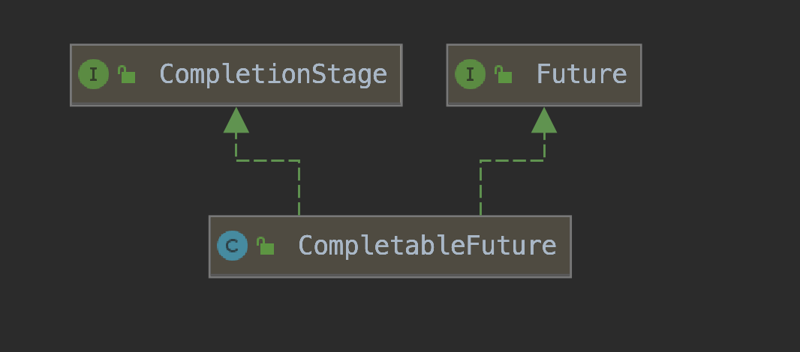

CompletableFuture实现了两个接口：`Future`、`CompletionStage`。

Future表示异步计算的结果，CompletionStage用于表示异步执行过程中的一个步骤（Stage），这个步骤可能是由另外一个CompletionStage触发的，随着当前步骤的完成，也可能会触发其他一系列CompletionStage的执行。从而我们可以根据实际业务对这些步骤进行多样化的编排组合，CompletionStage接口正是定义了这样的能力，我们可以通过其提供的`thenAppy`、`thenCompose`等函数式编程方法来组合编排这些步骤。

下面我们通过一个例子来讲解CompletableFuture如何使用，使用CompletableFuture也是构建依赖树的过程。一个CompletableFuture的完成会触发另外一系列依赖它的CompletableFuture的执行：

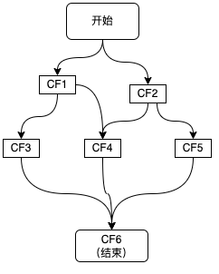

如上图所示，这里描绘的是一个业务接口的流程，其中包括CF1\CF2\CF3\CF4\CF5共5个步骤，并描绘了这些步骤之间的依赖关系，每个步骤可以是一次RPC调用、一次数据库操作或者是一次本地方法调用等，在使用CompletableFuture进行异步化编程时，图中的每个步骤都会产生一个CompletableFuture对象，最终结果也会用一个CompletableFuture来进行表示。

根据CompletableFuture依赖数量，可以分为以下几类：零依赖、一元依赖、二元依赖和多元依赖。

## 2.1 零依赖：CompletableFuture的创建


我们先看下如何不依赖其他CompletableFuture来创建新的CompletableFuture：

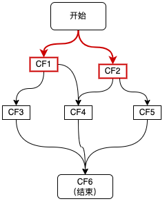

如上图红色链路所示，接口接收到请求后，首先发起两个异步调用CF1、CF2，主要有三种方式：

```java

ExecutorService executor = Executors.newFixedThreadPool(5);
//1、使用runAsync或supplyAsync发起异步调用
CompletableFuture<String> cf1 = CompletableFuture.supplyAsync(() -> {
  return "result1";
}, executor);
//2、CompletableFuture.completedFuture()直接创建一个已完成状态的CompletableFuture
CompletableFuture<String> cf2 = CompletableFuture.completedFuture("result2");
//3、先初始化一个未完成的CompletableFuture，然后通过complete()、completeExceptionally()，完成该CompletableFuture
CompletableFuture<String> cf = new CompletableFuture<>();
cf.complete("success");

```

第三种方式的一个典型使用场景，就是将回调方法转为CompletableFuture，然后再依赖CompletableFure的能力进行调用编排，示例如下：

```java

 /**
  * 该方法为rpc注册监听的封装，可以作为其他实现的参照
  * callback 自定义的回调方法
  * rpcCall 自定义函数，用来表示一次RPC调用
  */
  public static <T> CompletableFuture<T> toCompletableFuture(final Callback<?,T> callback , RpcCall rpcCall) {
   //新建一个未完成的CompletableFuture
   CompletableFuture<T> resultFuture = new CompletableFuture<>();
   //监听回调的完成，并且与CompletableFuture同步状态
   callback.addObserver(new Observer<T>() {
       @Override
       public void onSuccess(T t) {
           resultFuture.complete(t);
       }
       @Override
       public void onFailure(Throwable throwable) {
           resultFuture.completeExceptionally(throwable);
       }
   });
   
   if (rpcCall != null) {
       try {
           rpcCall.invoke();
       } catch (TException e) {
           resultFuture.completeExceptionally(e);
       }
   }
   return resultFuture;
  }
```

## 2.2 一元依赖：依赖一个CF

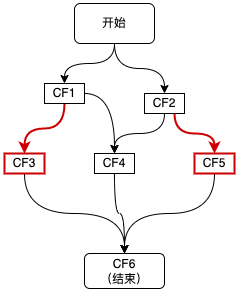

如上图红色链路所示，CF3，CF5分别依赖于CF1和CF2，这种对于单个CompletableFuture的依赖可以通过thenApply、thenAccept、thenCompose等方法来实现，代码如下所示：

```java

CompletableFuture<String> cf3 = cf1.thenApply(result1 -> {
  //result1为CF1的结果
  //......
  return "result3";
});
CompletableFuture<String> cf5 = cf2.thenApply(result2 -> {
  //result2为CF2的结果
  //......
  return "result5";
});

```

## 2.3 二元依赖：依赖两个CF

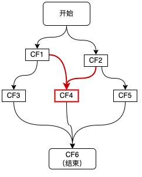

如上图红色链路所示，CF4同时依赖于两个CF1和CF2，这种二元依赖可以通过thenCombine等回调来实现，如下代码所示：


```java

CompletableFuture<String> cf4 = cf1.thenCombine(cf2, (result1, result2) -> {
  //result1和result2分别为cf1和cf2的结果
  return "result4";
});

```

## 2.4 多元依赖：依赖多个CF

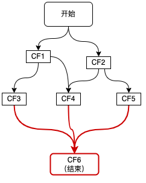

如上图红色链路所示，整个流程的结束依赖于三个步骤CF3、CF4、CF5，这种多元依赖可以通过`allOf`或`anyOf`方法来实现，区别是当需要多个依赖全部完成时使用`allOf`，当多个依赖中的任意一个完成即可时使用`anyOf`，如下代码所示：

```java
CompletableFuture<Void> cf6 = CompletableFuture.allOf(cf3, cf4, cf5);
CompletableFuture<String> result = cf6.thenApply(v -> {
  //这里的join并不会阻塞，因为传给thenApply的函数是在CF3、CF4、CF5全部完成时，才会执行 。
  result3 = cf3.join();
  result4 = cf4.join();
  result5 = cf5.join();
  //根据result3、result4、result5组装最终result;
  return "result";
});

```


# 3、CompletableFuture原理


## 3.1 设计思想
CompletableFuture中包含两个字段：`result`和`stack`。

result用于存储当前CF的结果，stack（Completion）表示当前CF完成后需要触发的依赖动作，去触发依赖它的CF的计算，依赖动作可以有多个（表示有多个依赖它的CF），以栈的形式存储，stack表示栈顶元素。


这种方式类似“观察者模式”，依赖动作都封装在一个单独`Completion`子类中。下面是Completion类关系结构图。CompletableFuture中的每个方法都对应了图中的一个Completion的子类，Completion本身是观察者的基类。

* `UniCompletion`继承了`Completion`，是一元依赖的基类，例如`thenApply`的实现类UniApply就继承自`UniCompletion`。
* `BiCompletion`继承了`UniCompletion`，是二元依赖的基类，同时也是多元依赖的基类。例如`thenCombine`的实现类BiRelay就继承自BiCompletion。

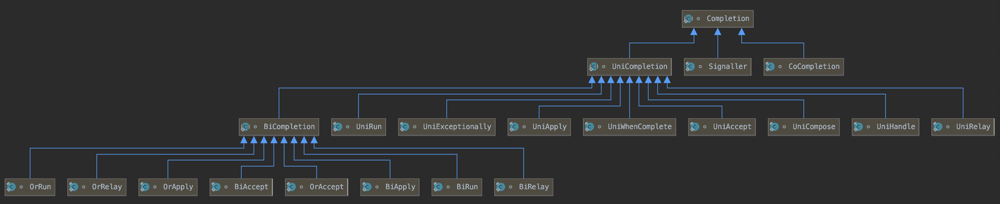


按照类似“观察者模式”的设计思想，原理分析可以从“观察者”和“被观察者”两个方面着手。由于回调种类多，但结构差异不大，所以这里单以一元依赖中的thenApply为例。如下图所示：

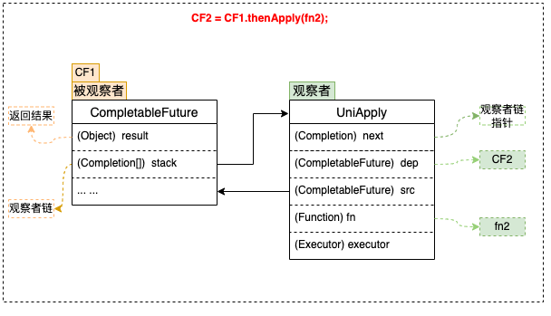

### 3.1.1 被观察者

1. 每个CompletableFuture都可以被看作一个被观察者，其内部有一个Completion类型的链表成员变量stack，用来存储注册到其中的所有观察者。当被观察者执行完成后会弹栈stack属性，依次通知注册到其中的观察者。上面例子中步骤`fn2`就是作为观察者被封装在UniApply中。
2. 被观察者CF中的result属性，用来存储返回结果数据。这里可能是一次RPC调用的返回值，也可能是任意对象，在上面的例子中对应步骤`fn1`的执行结果。

### 3.1.2 观察者

CompletableFuture支持很多回调方法，例如`thenAccept`、`thenApply`、`exceptionally`等，这些方法接收一个函数类型的参数`f`，生成一个Completion类型的对象（即观察者），并将入参函数`f`赋值给Completion的成员变量`fn`，然后检查当前CF是否已处于完成状态（即`result != null`），如果已完成直接触发fn，否则将观察者Completion加入到CF的观察者链stack中，再次尝试触发，如果被观察者未执行完则其执行完毕之后通知触发。

1. 观察者中的`dep`属性：指向其对应的CompletableFuture，在上面的例子中`dep`指向CF2。
2. 观察者中的`src`属性：指向其依赖的CompletableFuture，在上面的例子中`src`指向CF1。
3. 观察者Completion中的fn属性：用来存储具体的等待被回调的函数。这里需要注意的是不同的回调方法（`thenAccept`、`thenApply`、`exceptionally`等）接收的函数类型也不同，即`fn`的类型有很多种，在上面的例子中`fn`指向`fn2`。


## 3.2 流程分析

### 3.2.1 一元依赖

这里仍然以thenApply为例来说明一元依赖的流程：

1. 将观察者Completion注册到CF1，此时CF1将Completion压栈。
2. 当CF1的操作运行完成时，会将结果赋值给CF1中的result属性。
3. 依次弹栈，通知观察者尝试运行。

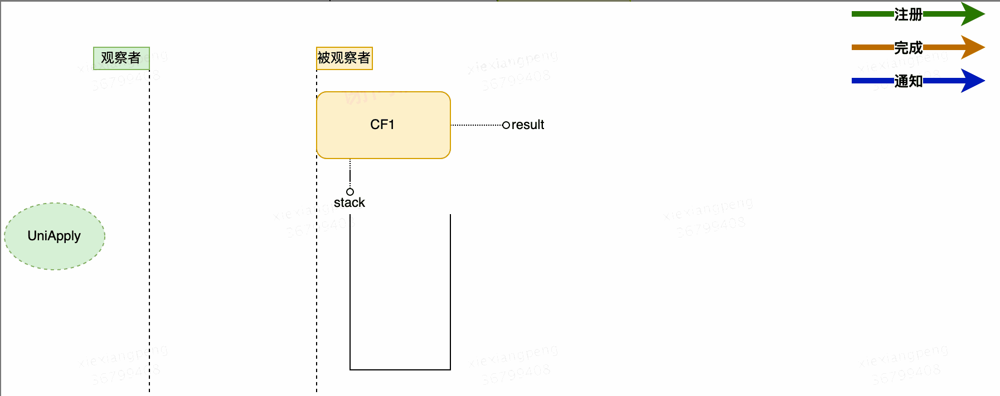


初步流程设计如上图所示，这里有几个关于注册与通知的并发问题：

**问题1**：在观察者注册之前，如果CF已经执行完成，并且已经发出通知，那么这时观察者由于错过了通知是不是将永远不会被触发呢 ？ 

**答案2**：不会。在注册时检查依赖的CF是否已经完成。如果未完成（即`result == null`）则将观察者入栈，如果已完成（`result != null`）则直接触发观察者操作。

**问题2**：在”入栈“前会有`result == null`的判断，这两个操作为非原子操作，CompletableFufure的实现也没有对两个操作进行加锁，完成时间在这两个操作之间，观察者仍然得不到通知，是不是仍然无法触发？

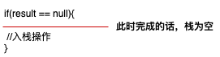

**答案2**：不会。入栈之后再次检查CF是否完成，如果完成则触发。


**问题3**：当依赖多个CF时，观察者会被压入所有依赖的CF的栈中，每个CF完成的时候都会进行，那么会不会导致一个操作被多次执行呢 ？如下图所示，即当CF1、CF2同时完成时，如何避免CF3被多次触发。
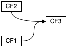

**答案3**：CompletableFuture的实现是这样解决该问题的：观察者在执行之前会先通过CAS操作设置一个状态位，将status由0改为1。如果观察14者已经执行过了，那么CAS操作将会失败，取消执行。


通过对以上3个问题的分析可以看出，**CompletableFuture在处理并行问题时，全程无加锁操作**，极大地提高了程序的执行效率。我们将并行问题考虑纳入之后，可以得到完善的整体流程图如下所示：

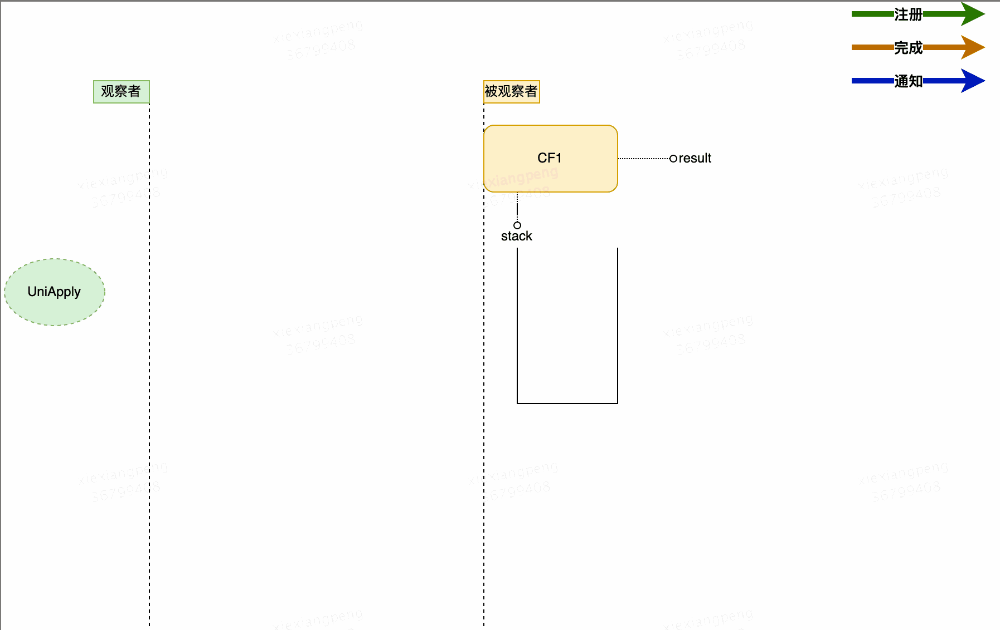


### 3.2.2 多元依赖

依赖多个CompletableFuture的回调方法包括`allOf`、`anyOf`，区别在于`allOf`观察者实现类为`BiRelay`，需要所有被依赖的CF完成后才会执行回调；而`anyOf`观察者实现类为`OrRelay`，任意一个被依赖的CF完成后就会触发。二者的实现方式都是将多个被依赖的CF构建成一棵**平衡二叉树**，执行结果层层通知，直到根节点，触发回调监听。

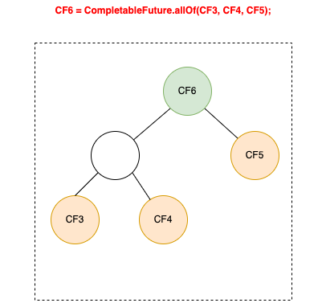


# 4、CompletableFuture实践


## 4.1 CompletableFuture与线程池

要合理治理线程资源，最基本的前提条件就是要在写代码时，清楚地知道每一行代码都将执行在哪个线程上。下面我们看一下CompletableFuture的执行线程情况。

CompletableFuture实现了CompletionStage接口，通过丰富的回调方法，支持各种组合操作，每种组合场景都有同步和异步两种方法。

同步方法（即不带Async后缀的方法）有两种情况。

* 如果注册时被依赖的操作已经执行完成，则直接由当前线程执行。
* 如果注册时被依赖的操作还未执行完，则由回调线程执行。

异步方法（即带Async后缀的方法）：可以选择是否传递线程池参数Executor运行在指定线程池中；当不传递Executor时，会使用ForkJoinPool中的共用线程池CommonPool（CommonPool的大小是CPU核数-1，如果是IO密集的应用，线程数可能成为瓶颈）。

例如：

```java

ExecutorService threadPool1 = new ThreadPoolExecutor(10, 10, 0L, TimeUnit.MILLISECONDS, new ArrayBlockingQueue<>(100));
CompletableFuture<String> future1 = CompletableFuture.supplyAsync(() -> {
    System.out.println("supplyAsync 执行线程：" + Thread.currentThread().getName());
    //业务操作
    return "";
}, threadPool1);
//此时，如果future1中的业务操作已经执行完毕并返回，则该thenApply直接由当前main线程执行；否则，将会由执行以上业务操作的threadPool1中的线程执行。
future1.thenApply(value -> {
    System.out.println("thenApply 执行线程：" + Thread.currentThread().getName());
    return value + "1";
});
//使用ForkJoinPool中的共用线程池CommonPool
future1.thenApplyAsync(value -> {
//do something
  return value + "1";
});
//使用指定线程池
future1.thenApplyAsync(value -> {
//do something
  return value + "1";
}, threadPool1);

```


前面提到，异步回调方法可以选择是否传递线程池参数Executor，这里我们**建议强制传线程池，且根据实际情况做线程池隔离**。

当不传递线程池时，会使用ForkJoinPool中的公共线程池CommonPool，这里所有调用将共用该线程池，`核心线程数=处理器数量-1（单核核心线程数为1）`，所有异步回调都会共用该CommonPool，核心与非核心业务都竞争同一个池中的线程，很容易成为系统瓶颈。手动传递线程池参数可以更方便的调节参数，并且可以给不同的业务分配不同的线程池，以求资源隔离，减少不同业务之间的相互干扰。

## 4.2 Dubbo中的CompletableFuture

我们知道Dubbo在服务调用时既可以同步调用，也可以异步调用。

但是在Dubbo2.6版本之前，异步调用时存在一定的缺点。下面一个早期版本下的异步案例：

```java
// 此方法应该返回Foo，但异步后会立刻返回NULL
fooService.findFoo(fooId);
// 立刻得到当前调用的Future实例，当发生新的调用时这个东西将会被覆盖
Future<Foo> fooFuture = RpcContext.getContext().getFuture();

// 调用另一个服务的方法
barService.findBar(barId);
// 立刻得到当前调用的Future
Future<Bar> barFuture = RpcContext.getContext().getFuture();
 
// 此时，两个服务的方法在并发执行
// 等待第一个调用完成，线程会进入Sleep状态，当调用完成后被唤醒。
Foo foo = fooFuture.get();
// 同上
Bar bar = barFuture.get();
// 假如第一个调用需要等待5秒，第二个等待6秒，则整个调用过程完成的时间是6秒。

```

当调用服务方法后，Dubbo会创建一个`DefaultFuture`，并将该Future存放到`RpcContext`中，在用户线程中，如果用户想获取调用结果时，会从`RpcContext`中获取该Future，并调用`get`方法，但是如果此时该服务仍没有处理完毕，则会出现阻塞，直到结果返回或调用超时为止。发生阻塞时，该方法的后续步骤则得不到执行。对于异步来说，这显然是不合理的。理想中的异步是如果服务没有处理好，会继续执行用户线程的后续方法，不会阻塞等待。

之前的异步方式存在以下问题：
* Future获取方式不够直接，只能在RpcContext中进行获取；
* Future只支持阻塞式的get()接口获取结果。
* Future接口无法实现自动回调，而自定义ResponseFuture虽支持callback回调但支持的异步场景有限，如不支持Future间的相互协调或组合等；
* 不支持Provider端异步

从Dubbo 2.7开始，Dubbo的异步调用开始以CompletableFuture为基础进行实现。

在Dubbo2.6的远程调用中，关键代码如下：

```java

DubboInvoker类
protected Result doInvoke(final Invocation invocation) throws Throwable {
        RpcInvocation inv = (RpcInvocation) invocation;
        //忽略部分代码
        boolean isAsync = RpcUtils.isAsync(getUrl(), invocation);
        boolean isOneway = RpcUtils.isOneway(getUrl(), invocation);
        //忽略部分代码
        //单向调用，无返回值
        if (isOneway) {
           boolean isSent = getUrl().getMethodParameter(methodName, Constants.SENT_KEY, false);
           currentClient.send(inv, isSent);
           RpcContext.getContext().setFuture(null);
           return new RpcResult();
        // 异步调用
        } else if (isAsync) {
           ResponseFuture future = currentClient.request(inv, timeout);
           RpcContext.getContext().setFuture(new FutureAdapter<Object>(future));
           return new RpcResult();
        // 同步调用
        } else {
           RpcContext.getContext().setFuture(null);
           return (Result) currentClient.request(inv, timeout).get();
        }     
}


```

在Dubbo2.6版本及之前的版本中，不管同步调用还是异步调用，都会调用`HeaderExchangeClient.request`方法，返回一个`DefaultFuture`对象，不同的点是：异步调用会将该future存放到RpcContext中，并先返回一个空的RpcResult结果。而同步掉用不会将该future存放到`RpcContext`中，而是直接调用该future的`get`方法，阻塞等待调用结果。

```java

HeaderExchangeChannel类 
public ResponseFuture request(Object request, int timeout) throws RemotingException {
        Request req = new Request();
        req.setVersion(Version.getProtocolVersion());
        req.setTwoWay(true);
        req.setData(request);
        DefaultFuture future = new DefaultFuture(channel, req, timeout); 
        channel.send(req);
        //忽略了部分代码
        return future;
}


```


```java
DefaultFuture类（忽略了部分代码）
public Object get(int timeout) throws RemotingException {
        if (!isDone()) {
            long start = System.currentTimeMillis();
            lock.lock();
            try {
                while (!isDone()) {
                    done.await(timeout, TimeUnit.MILLISECONDS);
                    if (isDone() || System.currentTimeMillis() - start > timeout) {
                        break;
                    }
                }
            } catch (InterruptedException e) {
                throw new RuntimeException(e);
            } finally {
                lock.unlock();
            }
        }
        return returnFromResponse();
}


```

当服务端处理完信息后，`HeaderExchangeHandler`会处理发送过来的`Response`，根据`requestId`获取对应的`DefaultFuture`对象，最终调用`doReceived`方法对结果赋值。利用`AQS`的条件锁机制，唤醒阻塞线程。

在Dubbo2.7版本中，对异步调用进行了改良，使用了CompletableFuture。

Dubbo2.7异步调用的一个样例：

```java

// 此调用会立即返回null
asyncService.sayHello("world");
// 拿到调用的Future引用，当结果返回后，会被通知和设置到此Future
CompletableFuture<String> helloFuture = RpcContext.getContext().getCompletableFuture();
// 为Future添加回调
helloFuture.whenComplete((retValue, exception) -> {
    if (exception == null) {
        System.out.println(retValue);
    } else {
        exception.printStackTrace();
    }
});

```


同样是DubboInvoker发起远程调用，在doInvoke方法中进行了改进：


```java

DubboInvoker2.7.9版本
protected Result doInvoke(final Invocation invocation) throws Throwable {
     RpcInvocation inv = (RpcInvocation) invocation;
     final String methodName = RpcUtils.getMethodName(invocation);
     boolean isOneway = RpcUtils.isOneway(getUrl(), invocation);
     //单向调用
     if (isOneway) {
         boolean isSent = getUrl().getMethodParameter(methodName, Constants.SENT_KEY, false);
         currentClient.send(inv, isSent);
         return AsyncRpcResult.newDefaultAsyncResult(invocation);
      //同步调用和异步调用
      } else {
         ExecutorService executor = getCallbackExecutor(getUrl(), inv);
                CompletableFuture<AppResponse> appResponseFuture =
                        currentClient.request(inv, timeout, executor).thenApply(obj -> (AppResponse) obj);           FutureContext.getContext().setCompatibleFuture(appResponseFuture);
        AsyncRpcResult result = new AsyncRpcResult(appResponseFuture, inv);
        result.setExecutor(executor);
        return result;
    } 
}


```

在Dubbo2.7版本中，DubboInvolnvoker对同步调用和异步调用进行了统一处理，封装成CompletableFuture，并以 AsyncRpcResult返回。

Dubbo2.7版本下`HeaderExchangeChannel.request`方法与2.6版本相差不大，只是DeafultFuture对象有一点不同，即后续版本继承了 CompletableFuture类。

对于同步调用和异步调用的处理交给AsyncToSyncInvoker类处理。

```java

public Result invoke(Invocation invocation) throws RpcException {
        // 调用DubboInvoker等Invoker返回的调用结果
        Result asyncResult = invoker.invoke(invocation);
        try {
            // 如果是同步调用
            if (InvokeMode.SYNC == ((RpcInvocation) invocation).getInvokeMode()) {
                // 不能使用CompletableFuture#get()方法，否则性能会出现严重下降。
                asyncResult.get(Integer.MAX_VALUE, TimeUnit.MILLISECONDS);
            }
        }
        //忽略了部分代码
        return asyncResult;
    }

```


