# 1、ArrayBlockingQueue的局限性

队列是一种使用非常广泛的数据结构，JDK中提供了多种多样的队列实现。现在假如要选择一种队列，作为JVM线程间的异步通信框架，应该选择哪一种呢？

`java.util`包下汇集了众多元老级别的队列实现，可以说是JAVA编程的基石，如`ArrayList`，`LinkedList`等，其特点是无锁，拥有很高的读写性能，但是，由于只适用于单线程环境，首先被排除。

线程安全的队列实现集中在`java.util.concurrent`包下面，常见的有下列几种：
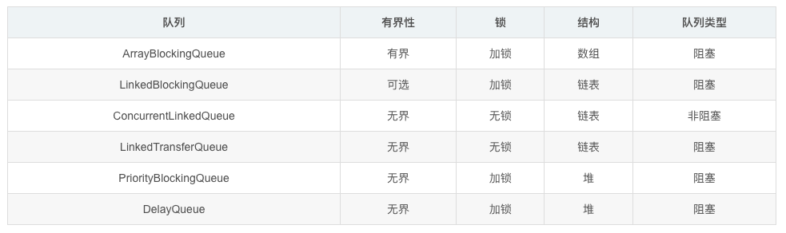

队列的底层一般分成三种：数组、链表和堆。其中，堆一般情况下是为了实现带有优先级特性的队列，暂且不考虑。

可以发现，通过不加锁的方式实现的队列都是无界的（无法保证队列的长度在确定的范围内）；而加锁的方式，可以实现有界队列。在稳定性和性能要求特别高的系统中，为了防止生产者速度过快，导致内存溢出，**只能选择有界队列**。

在队列中，一般获取这个某个元素之后紧接着会获取下一个元素，或者一次获取多个队列元素都有可能，而数组在内存中地址是连续的，在操作系统中会有缓存的优化，所以访问的速度会略胜一筹，同时，为了减少Java的垃圾回收对系统性能的影响，要求**尽量选择数组这样的数据结构**。

这样筛选下来，符合条件的队列就只有`ArrayBlockingQueue`。而事实证明在很多第三方的框架中，比如早期的log4j异步，都是选择的`ArrayBlockingQueue`。

但是，`ArrayBlockingQueue`在实际使用过程中，会因为**加锁**和**伪共享**等出现严重的性能问题，我们下面来分析一下。

## 1.1 加锁

保证线程安全一般分成两种方式
* **悲观锁**：`synchronized`、`ReentrantLock`等
* **乐观锁**：CAS

### 1.1.1 悲观锁
采取悲观锁的方式，默认线程会冲突，访问数据时，先加上锁再访问，访问之后再解锁。通过锁界定一个临界区，同时只有一个线程进入。

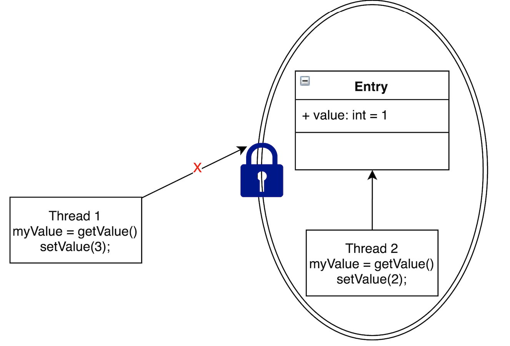

如上图所示，Thread2访问Entry的时候，加了锁，Thread1就不能再执行访问Entry的代码，从而保证线程安全。

下面是ArrayBlockingQueue通过加锁的方式实现的offer方法，保证线程安全。

```java
    public boolean offer(E e) {
        checkNotNull(e);
        final ReentrantLock lock = this.lock;
        lock.lock();
        try {
            if (count == items.length)
                return false;
            else {
                enqueue(e);
                return true;
            }
        } finally {
            lock.unlock();
        }
    }
```

正是由于`ArrayBlockingQueue`使用了重量级锁，严重拉低了队列的性能上限。线程会因为竞争不到锁而被挂起，等锁被释放的时候，线程又会被恢复，这个过程中存在着很大的开销，并且通常会有较长时间的中断，因为当一个线程正在等待锁时，它不能做任何其他事情。

### 1.1.2 CAS

而乐观锁的思路是：执行某个任务的时候，先假定不会有冲突，若不发生冲突，则直接执行成功；当发生冲突的时候，则执行失败，回滚再重新操作，直到不发生冲突。例如CAS操作，要么比较并交换成功，要么比较并交换失败。由CPU保证原子性。

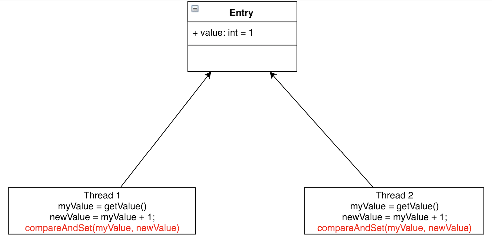

如图所示，Thread1和Thread2都要把Entry加1。若不加锁，也不使用CAS，有可能Thread1取到了myValue=1，Thread2也取到了myValue=1，然后相加，Entry中的value值为2。这与预期不相符，我们预期的是Entry的值经过两次相加后等于3。

CAS会先把Entry现在的value跟线程当初读出的值相比较，若相同，则赋值；若不相同，则赋值执行失败。一般会通过while/for循环来重新执行，直到赋值成功。

代码示例是`AtomicInteger`的`updateAndGet`方法。**CAS是CPU的一个指令，由CPU保证原子性**。

```java

    public final int updateAndGet(IntUnaryOperator updateFunction) {
        int prev, next;
        do {
            prev = get();
            next = updateFunction.applyAsInt(prev);
        } while (!compareAndSet(prev, next));
        return next;
    }
    
        /**
     * Atomically sets the value to the given updated value
     * if the current value {@code ==} the expected value.
     *
     * @param expect the expected value
     * @param update the new value
     * @return {@code true} if successful. False return indicates that
     * the actual value was not equal to the expected value.
     */
    public final boolean compareAndSet(int expect, int update) {
        return unsafe.compareAndSwapInt(this, valueOffset, expect, update);
    }

```

在高度竞争的情况下，锁的性能将超过CAS的性能，但是**更真实的竞争情况下，CAS的性能将超过锁的性能**，同时CAS不会有死锁等活跃性问题。

## 1.2 伪共享

### 1.2.1 CPU的多级缓存

缓存大小是CPU的重要指标之一，而且缓存的结构和大小对CPU速度的影响非常大，CPU内缓存的运行频率极高，一般是和处理器同频运作，工作效率远远大于系统内存和硬盘。实际工作时，CPU往往需要重复读取同样的数据块，而缓存容量的增大，可以大幅度提升CPU内部读取数据的命中率，而不用再到内存或者硬盘上寻找，以此提高系统性能。但是从CPU芯片面积和成本的因素来考虑，缓存都很小。

CPU缓存可以分为一级缓存，二级缓存，如今主流CPU还有三级缓存，甚至有些CPU还有四级缓存。每一级缓存中所储存的全部数据都是下一级缓存的一部分，这三种缓存的技术难度和制造成本是相对递减的，所以其容量也是相对递增的。

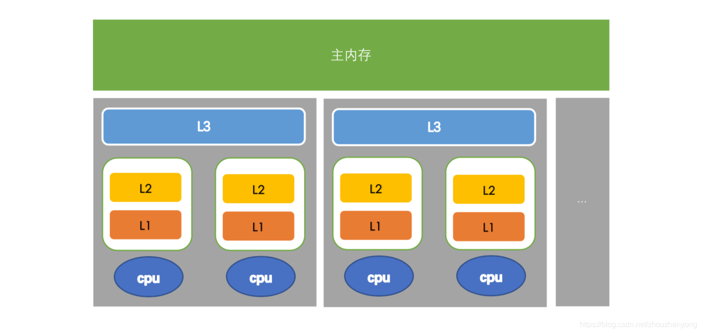

L1、L2、L3分别表示一级缓存、二级缓存、三级缓存，越靠近CPU的缓存，速度越快，容量也越小。所以L1缓存很小但很快，并且紧靠着在使用它的CPU内核；L2大一些，也慢一些，并且仍然只能被一个单独的CPU核使用；L3更大、更慢，并且被单个插槽上的所有CPU核共享；最后是主存，由全部插槽上的所有CPU核共享。

当CPU执行运算的时候，它先去L1查找所需的数据、再去L2、然后是L3，如果最后这些缓存中都没有，所需的数据就要去主内存拿。走得越远，运算耗费的时间就越长。所以如果你在做一些很频繁的事，你要尽量确保数据在L1缓存中。

下面是从CPU访问不同层级数据的时间概念:

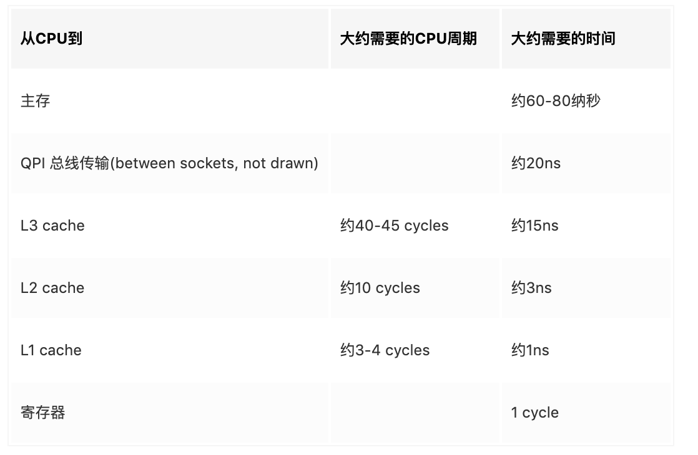

需要注意的是，**当线程之间进行共享数据的，需要将数据写回到主内存中，而另一个线程通过访问主内存获得新的数据**。

有人就会问了，多个线程之间不是会有一些非主内存的缓存进行共享么，那么另外一个线程会不会直接访问到修改之前的内存呢？

答案是会的，但是有一点，就是这种数据我们可以通过设置**缓存失效**来进行保证缓存的最新，这个方式其实在CPU这里进行设置的，叫**内存屏障**（memory barrier，其实就是在CPU这里设置一条指令，这个指令就是禁止cpu重排序，这个屏障之前的不能出现在屏障之后，屏障之后的处理不能出现屏障之前，也就是屏障之后获取到的数据是最新的），**对应到应用层面就是关键字——volatile**。

### 1.2.2 缓存行

刚刚说的缓存失效其实指的是Cache line的失效，也就是**缓存行**，Cache是由很多个Cache line 组成的，每个缓存行大小是32~128字节（通常是64字节）。我们这里假设缓存行是64字节，而java的一个Long类型是8字节，这样的话一个缓存行就可以存8个Long类型的变量，如下图所示：

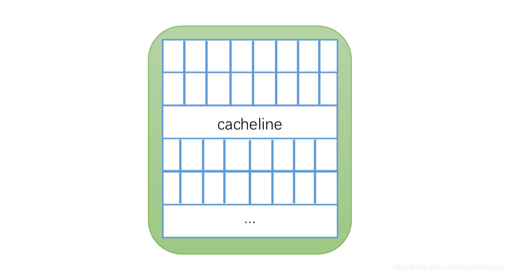

CPU 每次从主内存中获取数据的时候都**会将相邻的数据存入到同一个缓存行中**。假设我们访问一个Long内存对应的数组的时候，如果其中一个被加载到内存中，那么对应的后面的7个数据也会被加载到对应的缓存行中，这样就会非常快的访问数据。

举个例子，你访问一个long的变量的时候，他会把帮助再加载7个，我们上面说为什么选择数组不选择链表，也就是这个原因，在数组中可以依靠缓冲行得到很快的访问。

### 1.2.3 伪共享

依据**MESI协议**（缓存一致性协议），在一个缓存中的数据变化的时候会将其他所有存储该缓存的缓存（其实是**缓存行**）都失效。

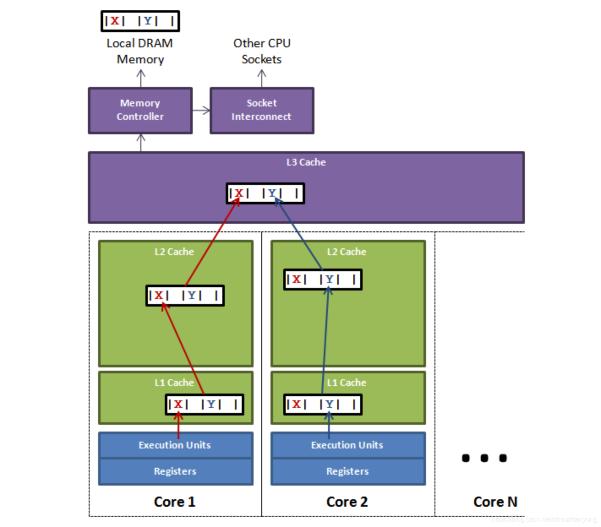

上图中显示的是一个槽的情况，里面是多个cpu， 如果cpu1上面的线程更新了变量X，根据MESI协议，那么变量X对应的所有缓存行都会失效（注意：虽然改的是X，但是X和Y被放到了一个缓存行，就一起失效了），这个时候如果cpu2中的线程进行读取变量Y，发现缓存行失效，想获取Y就会按照缓存查找策略，往上查找，如果期间cpu1对应的线程更新X后没有访问X（也就是没有刷新缓存行），cpu2的线程就只能从主内存中获取数据，对性能就会造成很大的影响，这就是**伪共享**。

表面上 X 和 Y 都是被独立线程操作的，而且两操作之间也没有任何关系。只不过它们共享了一个缓存行，但所有竞争冲突都是来源于共享。

那么ArrayBlockingQueue的这个伪共享问题存在于哪里呢？

ArrayBlockingQueue有三个成员变量： 

* **takeIndex**：需要被取走的元素下标 
* **putIndex**：可被元素插入的位置的下标 
* **count**：队列中元素的数量

这三个变量很容易放到一个缓存行中，但是之间修改没有太多的关联。所以每次修改，都会使之前缓存的数据失效，从而不能完全达到共享的效果。
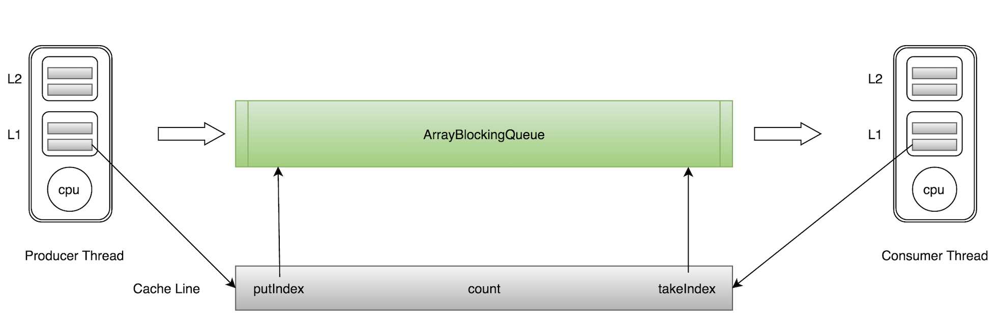

如上图所示，当生产者线程put一个元素到ArrayBlockingQueue时，`putIndex`会修改，从而导致消费者线程的缓存中的缓存行无效，需要从主存中重新读取。

# 2、Disruptor概述

有没有一种比ArrayBlockingQueue更完美的队列呢，需要满足以下条件：

* 线程安全
* 有界
* 无锁
* 性能强悍

案就是**Disruptor**。

> Disruptor是英国外汇交易公司`LMAX`开发的一个高性能队列，于2011年开源，其官网定义为：`High Performance Inter-Thread Messaging Library`，即：线程间的高性能消息框架。基于Disruptor开发的系统单线程能支撑每秒600万订单，2010年在QCon演讲后获得了业界关注，同年它还获得了Oracle官方的Duke大奖。同时，LMAX公司基于Disruptor构建的交易系统也多次斩获金融界大奖。

Disruptor研发的初衷是解决内存队列的延迟问题，与Kafka、RocketMQ等用于进程间的分布式消息队列不同，Disruptor一般用于线程间消息的传递。

Disruptor非常轻量，但性能却非常强悍，比JDK的ArrayBlockingQueue性能高近一个数量级。

Disruptor号称的每秒处理600W订单，但是需要注意的是，并非是消费者消费完600W的数据，而是说Disruptor能在1秒内将600W数据发送给消费者，换句话说，不是600W的TPS，而是每秒600W的派发。再有，其实600W是Disruptor刚发布时硬件的水平了，现在在个人PC上也能轻松突破2000W。

Disruptor到底有多快，可以通过测试数据有个直观印象。

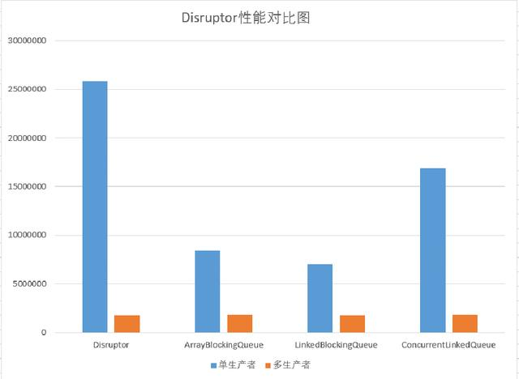

运行于普通PC上，Disruptor在单线程情况下吞吐量竟能达到2500W以上，远远超过其他队列。在多生产者的情况下，这几个队列的吞吐量却是一样的，这也说明队列在多线程环境下，性能瓶颈并不在其本身。

再看Log4j2官网的性能测试截图：

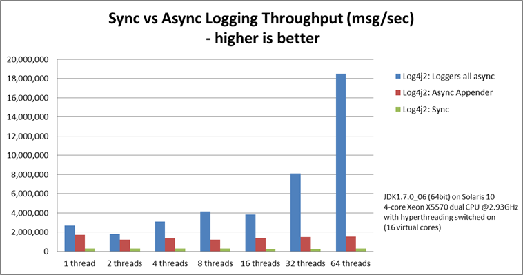

`loggers all async`采用的是Disruptor，而`Async Appender`采用的是ArrayBlockingQueue队列。

由图可见，单线程情况下，`loggers all async`与`Async Appender`吞吐量相差不大，但是在64个线程的时候，`loggers all async`的吞吐量比`Async Appender`增加了12倍，是Sync模式的68倍。

Disruptor惊人的性能表现使其得到了很多开源框架的青睐，如Apache Storm、Apache Camel、Log4j2等都在使用。

# 3、Disruptor原理

Disruptor之所以如此牛逼，是因为手握三大杀器：

* **环形数组RingBuffer**
* **CAS**
* **消除伪共享**

## 3.1 环形数组

环形数组结构是整个Disruptor的核心所在。
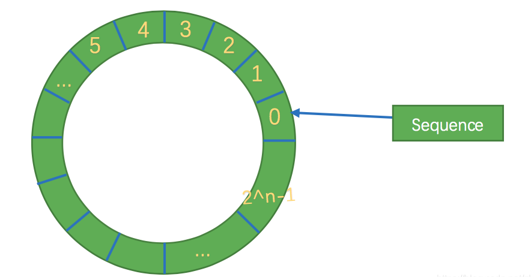

其实质就是一个普通的数组，只是当放置数据填充满队列（即到达2^n-1位置）之后，再填充数据，就会从0开始，覆盖之前的数据，于是就相当于一个环。

RingBuffer不会删除数据，也就是说这些**数据一直存放在buffer中，直到新的数据覆盖他们**。

RingBuffer没有头指针与尾指针，**只维护了一个指向下一个可用位置的序号**（Sequence）。随着不停地填充这个buffer（可能也会有相应的读取），这个序号会一直增长，直到绕过这个环。

要找到数组中当前序号指向的元素，可以通过`sequence & （array length－1） = array index`，比如一共有8槽，`3 &（8－1）= 3`，HashMap就是用这个方式来定位数组元素的，这种方式比取模的速度更快。

RingBuffer的数据结构有以下优势：

* 因为它是数组，所以要比链表快，数组内元素的内存地址的连续性存储的。这是对CPU缓存友好的——也就是说，在硬件级别，数组中的元素是会被**预加载**的，因此在RingBuffer当中，cpu无需时不时去主存加载数组中的下一个元素。因为只要一个元素被加载到缓存行，其他相邻的几个元素也会被加载进同一个缓存行。
* 可以为数组**预分配内存**，使得数组对象一直存在（除非程序终止）。这就意味着不需要花大量的时间用于垃圾回收。环形数组中的元素采用覆盖方式，避免了jvm的GC。
* 结构作为环形，数组的大小为2的n次方，这样**元素定位可以通过位运算**，效率会更高，这个跟一致性哈希中的环形策略有点像。

## 3.2 CAS

下面忽略数组的环形结构，介绍一下如何实现无锁设计，整个过程通过原子变量CAS，保证操作的线程安全。

在Disruptor中生产者分为单生产者和多生产者，而消费者并没有区分。

* 单生产者情况下，就是普通的生产者向RingBuffer中放置数据，消费者获取最大可消费的位置，并进行消费。

* 多生产者时候，又多出了一个跟RingBuffer同样大小的Buffer，称为**AvailableBuffer**。在多生产者中，每个生产者首先通过CAS竞争获取可以写的空间，然后再进行慢慢往里放数据，如果正好这个时候消费者要消费数据，那么每个消费者都需要获取最大可消费的下标，这个下标是在AvailableBuffer进行获取得到的最长连续的序列下标。

### 单生产者

生产者单线程写数据的流程比较简单：

1. 申请写入m个元素；
2. 若是有m个元素可以入，则返回最大的序列号。这儿主要判断是否会覆盖未读的元素；
3. 若是返回的正确，则生产者开始写入元素。

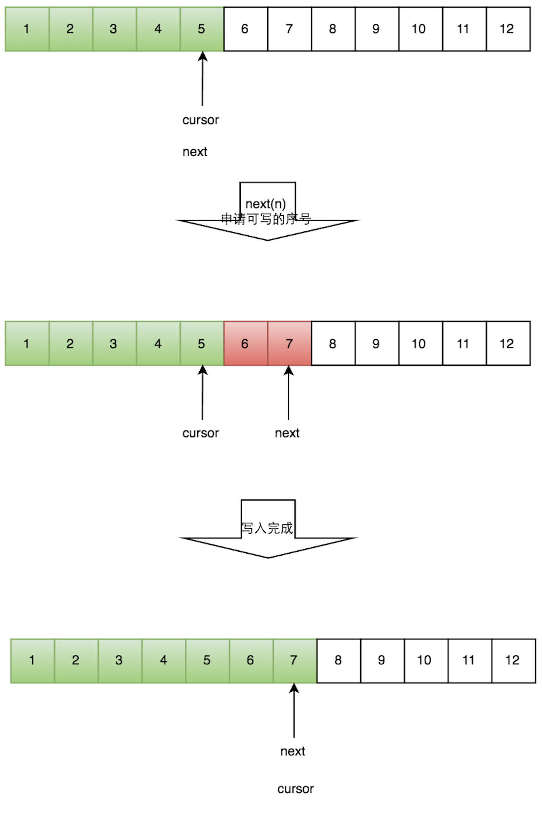


### 多生产者

多个生产者的情况下，会遇到“**如何防止多个线程重复写同一个元素**”的问题。Disruptor的解决方法是，每个线程获取不同的一段数组空间进行操作。这个通过CAS很容易达到。只需要在分配元素的时候，通过CAS判断一下这段空间是否已经分配出去即可。

多个生产者写入的时候：

1. 申请写入m个元素；
2. 若是有m个元素可以写入，则返回最大的序列号。每个生产者会被分配一段独享的空间；
3. 生产者写入元素，写入元素的同时设置available Buffer里面相应的位置，以标记自己哪些位置是已经写入成功的。

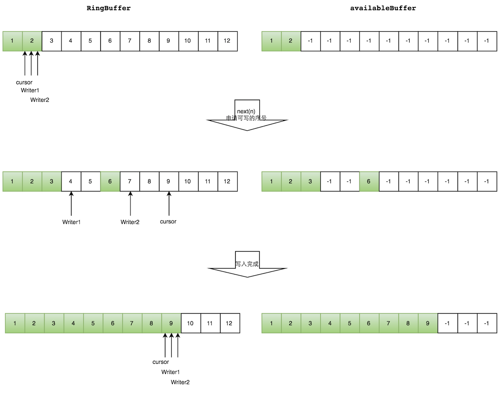

如上图所示，`Writer1`和`Writer2`两个线程写入数组，都申请可写的数组空间。`Writer1`被分配了下标3到下表5的空间，`Writer2`被分配了下标6到下标9的空间。

`Writer1`写入下标3位置的元素，同时把`available Buffer`相应位置置位，标记已经写入成功，往后移一位，开始写下标4位置的元素。`Writer2`同样的方式。最终都写入完成。

防止不同生产者对同一段空间写入的代码，如下所示：

```java
public long tryNext(int n) throws InsufficientCapacityException
{
    if (n < 1)
    {
        throw new IllegalArgumentException("n must be > 0");
    }
 
    long current;
    long next;
 
    do
    {
        current = cursor.get();
        next = current + n;
 
        if (!hasAvailableCapacity(gatingSequences, n, current))
        {
            throw InsufficientCapacityException.INSTANCE;
        }
    }
    while (!cursor.compareAndSet(current, next));
 
    return next;
}

```
通过do/while循环的条件`cursor.compareAndSet(current, next)`，来判断每次申请的空间是否已经被其他生产者占据。假如已经被占据，该函数会返回失败，While循环重新执行，申请写入空间。消费者的流程与生产者非常类似。

消费者需要面对的问题是：**如何防止读取的时候，读到还未写的元素**。

答案是借助available Buffer。当某个位置写入成功的时候，生产者便把availble Buffer相应的位置置位，标记为写入成功。读取的时候，会遍历available Buffer，来判断元素是否已经就绪。

1. 申请读取到序号n；
2. 若writer cursor >= n，这时仍然无法确定连续可读的最大下标。从reader cursor开始读取available Buffer，一直查到第一个不可用的元素，然后返回最大连续可读元素的位置；
3. 消费者读取元素。

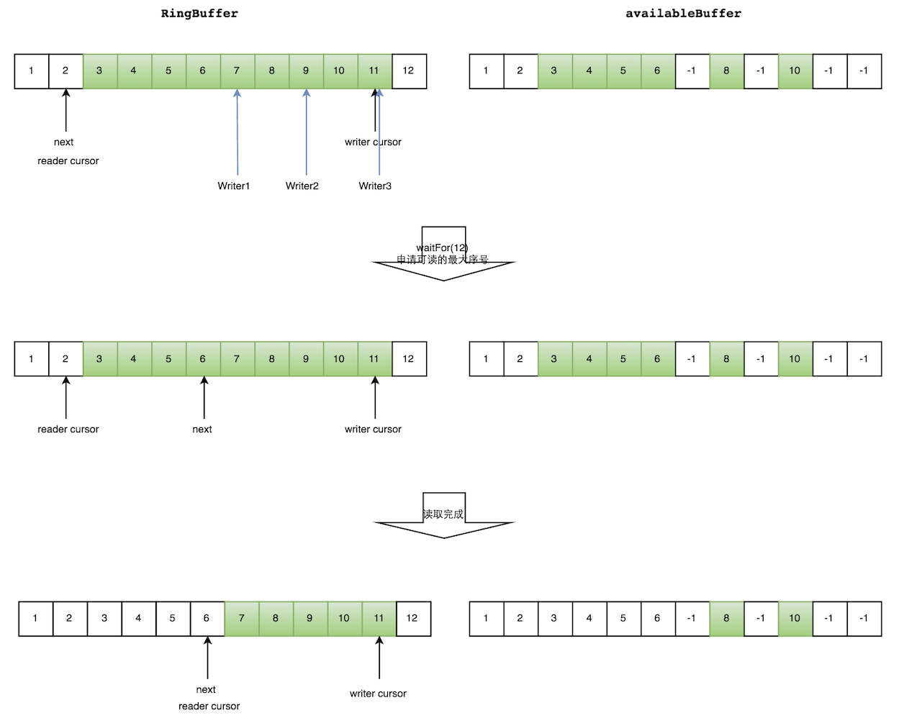

如上图所示，读线程读到下标为2的元素，三个线程`Writer1/Writer2/Writer3`正在向RingBuffer相应位置写数据，写线程被分配到的最大元素下标是11。

读线程申请读取到下标从3到11的元素，判断`writer cursor>=11`。然后开始读取availableBuffer，从3开始，往后读取，发现下标为7的元素没有生产成功，于是`WaitFor(11)`返回6。

然后，消费者读取下标从3到6共计4个元素。

## 3.3 消除伪共享

对于伪共享，一般的解决方案是，增大数组元素的间隔使得由不同线程存取的元素位于不同的缓存行上，以空间换时间。

在Disruptor中采用了Padding的方式，比如 `Sequence` 类用继承的`RhsPadding`、`Value`、`LhsPadding`三个类做缓存行填充，解决伪共享问题：

```java
class LhsPadding
{
    protected long p1, p2, p3, p4, p5, p6, p7;
}

class Value extends LhsPadding
{
    protected volatile long value;
}

class RhsPadding extends Value
{
    protected long p9, p10, p11, p12, p13, p14, p15;
}

public class Sequence extends RhsPadding
{
    static final long INITIAL_VALUE = -1L;
    private static final Unsafe UNSAFE;
    private static final long VALUE_OFFSET;
}

```

其中的`Value`就被其他一些无用的long变量给填充了。这样你修改Value的时候，就不会影响到其他变量的缓存行。

注意到上面的代码中，实际上一共使用了额外的14个long来填充，不是更多或更少，这是为什么呢？

java的lang类型占用8个字节。目前主流的缓冲行大小一般是64字节，也就是可以存放8个long。

缓冲行填充被设计成前面7个long, 后面7个long，是为了保证**有效数据和padding被任意分割的情况下都可以实现和其他无关数据不共享**，从而避免相互影响。如下图所示：
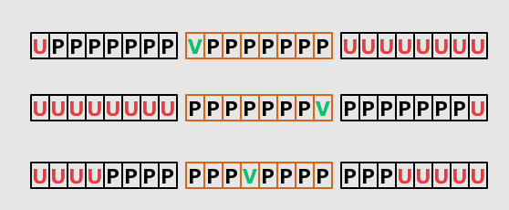

* V=Value=有效值
* P=Padding=填充
* U=Unstable=不稳定无关数据

**备注**：在jdk1.8中，有专门的注解`@Contended`来避免伪共享，更优雅地解决问题。


