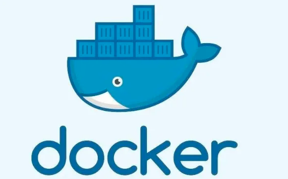
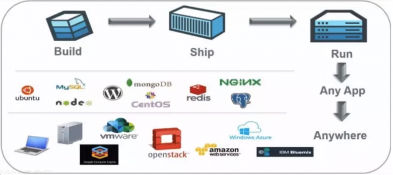
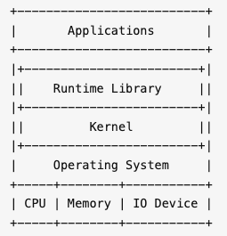
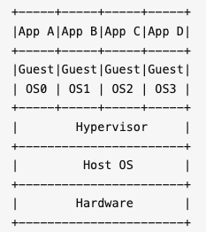
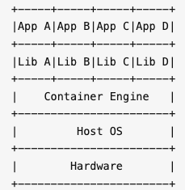
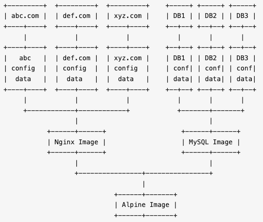

# 1、Docker是什么

**Docker** （英文本意是指码头工人）是一个开源的容器引擎，诞生于 2013 年初，最初是 *dotCloud* 公司（后由于 Docker 开源后大受欢迎就将公司改名为 *Docker Inc* ）内部的一个开源的 PAAS 服务 (Platform as a ServiceService )。它基于 Google 公司的 Go 语言实现，后来加入了 Linux 基金会，遵从 Apache 2.0 协议。

Docker本质上是宿主机上的一个进程，通过**namespace**实现资源隔离，通过**cgroup**实现资源限制，通过**写时复制技术**（copy-on-write）实现了高效的文件操作。由于隔离Docker的进程独立于宿主和其它的隔离的进程，因此也称其为**容器**。最初实现是基于 **LXC**（Linux Container），从 0.7 版本以后开始去除 LXC，转而使用自行开发的 libcontainer，从 1.11 开始，则进一步演进为使用 **runC** 和 **containerd**。

Docker的核心理念是：

> Build, Ship and Run Any App, Anywhere

即通过对应用组件的封装（Packaging）、分发（Distribution）、部署（Deployment）、运行（Runtime）等生命周期的管理，达到应用组件级别的“**一次封装，到处运行**”。这里的应用组件，既可以是一个Web应用，也可以是一套数据库服务，甚至是一个操作系统。将应用运行在Docker 容器上，可以实现跨平台，跨服务器，只需一次配置准备好相关的应用环境，即可实现到处运行，保证研发和生产环境的一致性，解决了应用和运行环境的兼容性问题，从而极大提升了部署效率，减少故障的可能性。

Docker实际上就相当于一个封闭的沙盒或者是集装箱，它可以把不同的应用全都放在它的集装箱里面，并且以后有需要的时候，可以直接把集装箱搬到其他平台或者服务器上，实现容器虚拟化技术，随用随搬。

再通俗点说，我们使用Docker，只需要配置一次Docker容器上面的应用，就可以跨平台，跨服务器，实现应用程序跨平台间的无缝衔接。

# 2、Docker的设计哲学

**Docker的思想来自于集装箱**。

集装箱解决了什么问题呢？答案是货物的标准化。

各种各样的货物被打包进集装箱，集装箱和集装箱之间不会互相影响。如此一来，我们就不需要专门运送水果的船和专门运送化学品的船了。只要这些货物在集装箱里封装的好好的，就可以用一艘大船把它们都运走。

现在云计算大行于世，云计算就好比大货轮，而Docker就是集装箱。

要解释清楚Docker，首先要说解释清楚**容器**（Container）的概念。要解释容器的话，需要从操作系统说起。

操作系统就是管理计算机的硬件软件和资源，并且为软件运行提供通用服务的系统软件。硬件、操作系统、应用程序之间的关系可以简单的用下图表示：

随着硬件的性能提升以及软件种类的丰富，有两种情况变得很常见：

1. **硬件性能过剩**：很多计算机的硬件配置，即使不能完全满足峰值性能的要求，也往往会有大量时间处于硬件资源闲置的状态。例如一般家用电脑，已经是四核、六核的配置了，除了3A游戏、视频制作、3D渲染、高性能计算等特殊应用外，通常有90%以上时间CPU是闲置的。
2. **软件冲突**：因为业务需要，两个或者多个软件之间冲突，或者需要同一个软件的不同版本。例如早几年做web前端的，要测试网页在不同版本的IE上是否能正常显示，然而Windows只能装一个版本的IE。

为了解决软件冲突，只能配置多台计算机，或者很麻烦的在同一台电脑上安装多个操作系统，通过重启来进行切换。显然这两个方案都有其缺点：多台计算机成本太高，多操作系统的安装、切换都很麻烦。在硬件性能过剩的时候，硬件虚拟化的普及就很自然而然的提出来了。

所谓**硬件虚拟化**，就是借助某个特殊的软件，仿真出一台或者多台计算机的各种硬件，用户可以在这一台虚拟机上安装、运行操作系统和各种应用。对于上面的应用程序来说，这台虚拟机和普通的物理计算机是完全一样没有任何区别的——除了性能可能差一点。虚拟机技术的代表，就是**VMWare**和**OpenStack**。

虚拟机的一个缺点在于Guest OS通常会占用不少硬件资源。例如Windows安装开机不运行任何运用，就需要占用2 ~ 3G内存，20 ~ 30G硬盘空间。即使是没有图形界面的Linux，根据发行版以及安装软件的不同也会占用100M ~ 1G内存，1G ~ 4G硬盘空间。而且为了应用系统运行的性能，往往还要给每台虚拟机留出更多的内存容量。

通常来说，其中相当大部分甚至全部Guest OS都是相同的。能不能所有的应用使用同一个的操作系统减少硬件资源的浪费，但是又能避免包括运行库运行库在内的软件冲突呢？**操作系统层虚拟化**——容器概念的提出，就是为了解决这个问题。在Linux可以通过**控制组**（Control Group，通常简写为**cgroup**）隔离，并把应用和运行库打包在一起，来实现这个目的。

**虚拟机是硬件层面的隔离，而容器是APP层面的隔离**。

上图中，每一个App和Lib的组合，就是一个容器，也就是Docker图标里面的一个集装箱。和虚拟机相比，容器有以下优点：

* **迅速启动**：没有虚拟机硬件的初始化，没有Guest OS的启动过程，可以节约很多启动时间，这就是容器的“开箱即用”。
* **占用资源少**：没有运行Guest OS所需的内存开销，无需为虚拟机预留运行内存，无需安装、运行App不需要的运行库/操作系统服务，内存占用、存储空间占用都小的多。相同配置的服务器，如果运行虚拟机只能运行十多台的，通常可以运行上百个容器毫无压力——当然前提是单个容器应用本身不会消耗太多资源。

Docker把App和Lib的文件打包成为一个**镜像**，并且采用类似多次快照的存储技术，优势如下：

1. 多个App可以共用相同的底层镜像（初始的操作系统镜像）
2. App运行时的IO操作和镜像文件隔离
3. 通过挂载包含不同配置/数据文件的目录或者卷（Volume），单个App镜像可以同时用来运行无数个不同业务的容器。

上图是基于一个Alpine Linux的镜像，分别建立了Nginx和MySQL的镜像，并且挂载不同的配置/数据同时运行3个网站应用3个数据库应用的示意图。

此外，Docker公司提供公共的**镜像仓库**（Docker称之为**Repository**），Github connect，自动构建镜像，大大简化了应用分发、部署、升级流程。加上Docker可以非常方便的建立各种自定义的镜像文件，这些都是Docker成为最流行的容器技术的重要因素。

通过以上这些技术的组合，最后的结果就是，绝大部分应用，开发者都可以通过`docker build`创建镜像，通过`docker push`上传镜像，用户通过`docker pull`下载镜像，用`docker run`运行应用。用户不需要再去关心如何搭建环境，如何安装，如何解决不同发行版的库冲突——而且通常不会需要消耗更多的硬件资源，不会明显降低性能。这就是上文将Docker类比为集装箱的原因所在。

# 3、Docker的优势

作为一种新兴的虚拟化方式，Docker 跟传统的虚拟化方式相比具有众多的优势。

## （1）更高效的利用系统资源。

由于容器不需要进行硬件虚拟以及运行完整操作系统等额外开销，Docker 对系统资源的利用率更高。无论是应用执行速度、内存损耗或者文件存储速度，都要比传统虚拟机技术更高效。因此，相比虚拟机技术，一个相同配置的主机，往往可以运行更多数量的应用。

## （2）更快速的启动时间

传统的虚拟机技术启动应用服务往往需要数分钟，而 Docker 容器应用，由于直接运行于宿主内核，无需启动完整的操作系统，因此可以做到秒级、甚至毫秒级的启动时间。大大的节约了开发、测试、部署的时间。

## （3）一致的运行环境

开发过程中一个常见的问题是环境一致性问题。由于开发环境、测试环境、生产环境不一致，导致有些 bug 并未在开发过程中被发现。而 Docker 的镜像提供了除内核外完整的运行时环境，确保了应用运行环境一致性，从而不会再出现 「这段代码在我机器上没问题啊」 这类问题。

## （4）持续交付和部署

对开发和运维（DevOps）人员来说，最希望的就是一次创建或配置，可以在任意地方正常运行。

使用 Docker 可以通过定制应用镜像来实现持续集成、持续交付、部署。开发人员可以通过 Dockerfile 来进行镜像构建，并结合 持续集成(Continuous Integration) 系统进行集成测试，而运维人员则可以直接在生产环境中快速部署该镜像，甚至结合 持续部署(Continuous Delivery/Deployment) 系统进行自动部署。

而且使用 Dockerfile 使镜像构建透明化，不仅仅开发团队可以理解应用运行环境，也方便运维团队理解应用运行所需条件，帮助更好的生产环境中部署该镜像。

## （5）更轻松的迁移

由于 Docker 确保了执行环境的一致性，使得应用的迁移更加容易。Docker 可以在很多平台上运行，无论是物理机、虚拟机、公有云、私有云，甚至是笔记本，其运行结果是一致的。因此用户可以很轻易的将在一个平台上运行的应用，迁移到另一个平台上，而不用担心运行环境的变化导致应用无法正常运行的情况。

## （6）更轻松的维护和扩展

Docker 使用的分层存储以及镜像的技术，使得应用重复部分的复用更为容易，也使得应用的维护更新更加简单，基于基础镜像进一步扩展镜像也变得非常简单。此外，Docker 团队同各个开源项目团队一起维护了一大批高质量的 官方镜像，既可以直接在生产环境使用，又可以作为基础进一步定制，大大的降低了应用服务的镜像制作成本。