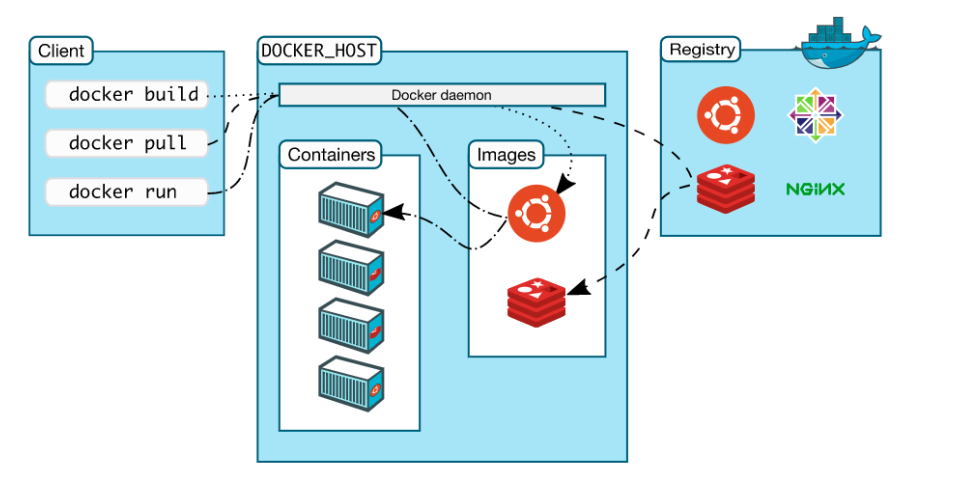
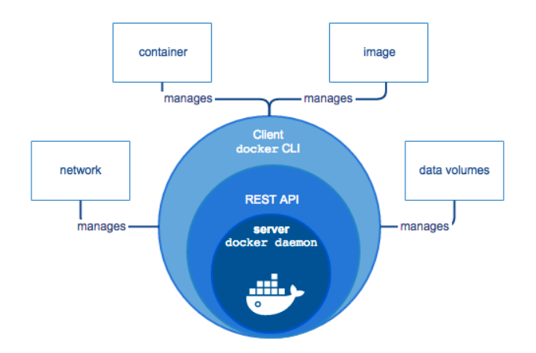
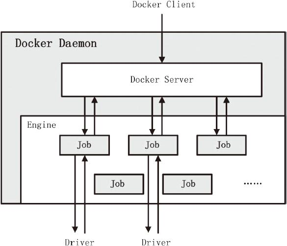
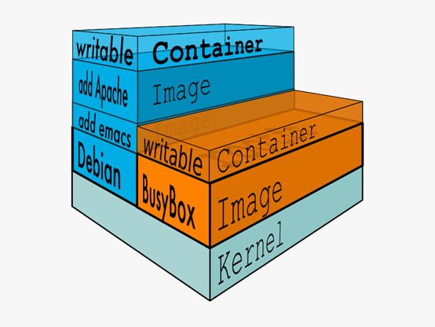
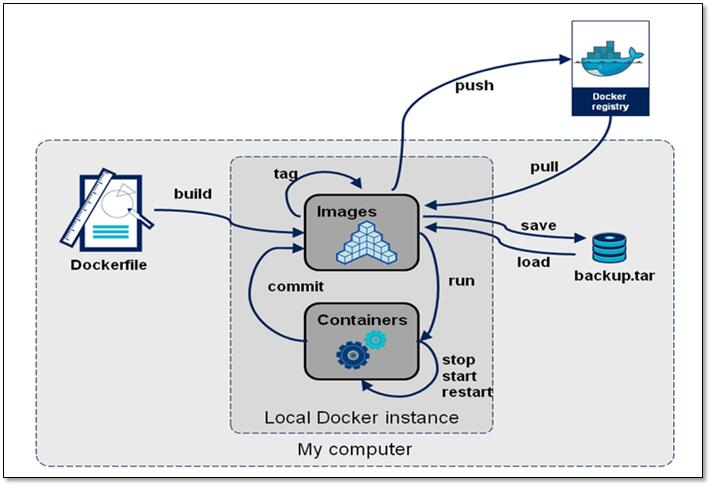
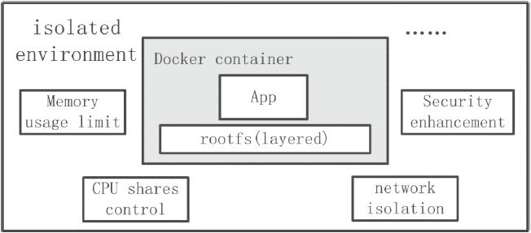

# 1、C/S架构

由上图可知，**Docker 使用C/S架构模式**， 核心组件如下：

* **Client**：提供用户跟Docker交互的入口，可以通过client跟docker发送各种API
* **Docker Deamon**：用于监听并处理docker client发送的api请求并且管理docker镜像(images), 容器(container)以及文件结构。同时也用于跟其它docker daemon进行交互
* **Registry**：存储镜像的仓库。Docker Hub是一个公共仓库，类似与maven的中心仓库，默认情况下docker会从该公共仓库获取镜像。当然docker也可以像maven一样有自己的私有registry
* **Images**：定义docker容器执行指令的模板。可以把docker image比作是java的类，docker container比作的java的对象，docker的镜像通常都是在另一个image基础上构建的
* **Containers**：docker镜像的运行实例，用户可以通过docker api对docker容器进行`start/stop/create/move/delete`等操作

# 2、客户端

Docker 提供了一个命令行工具Docker 以及一整套 RESTful API。我们日常使用各种 docker 命令，其实就是在使用客户端工具 与 Docker 引擎进行交互。

# 3、服务端

Docker Daemon是Docker架构中一个常驻在后台的系统进程。所谓的“运行Docker”，即代表运行Docker Daemon。Docker Daemon的作用主要有以下两方面：

* 接收并处理Docker Client发送的请求
* 管理所有的Docker容器

Docker Daemon运行时，会在后台启动一个Server，Server负责接收Docker Client发送的请求；接收请求后，Server通过路由与分发调度，找到相应的Handler来处理请求。

Engine是Docker架构中的运行引擎，同时也是Docker运行的核心模块。Engine存储着大量的容器信息，同时管理着Docker大部分Job的执行。换言之，Docker中大部分任务的执行都需要Engine协助，并通过Engine匹配相应的Job完成Job的执行。

**Job可以认为是Docker架构中Engine内部最基本的工作执行单元**。Docker Daemon可以完成的每一项工作都会呈现为一个Job。例如，在Docker容器内部运行一个进程，这是一个Job；创建一个新的容器，这是一个Job；在网络上下载一个文档，这是一个Job；包括之前在Docker Server部分谈及的，创建Server服务于HTTP协议的API，这也是一个Job，等等。

# 4、注册中心

Docker Registry是一个存储容器镜像（Docker Image）的仓库。容器镜像（Docker Image）是容器创建时用来初始化容器rootfs的文件系统内容。Docker Registry将大量的容器镜像汇集在一起，并为分散的Docker Daemon提供镜像服务。

Docker的运行过程中，有三种情况可能与Docker Registry通信，分别为**搜索镜像**、**下载镜像**、**上传镜像**。这三种情况所对应的Job名称分别为`search`、`pull`和`push`。

不同场景下，Docker Daemon可以使用不同的Docker Registry。公有Registry与私有Regsitry就是两种场景模式不同的Docker Registry。其中，大家熟知的Docker Hub，就是全球范围内最大的公有Registry。Docker可以通过互联网访问Docker Hub，并下载容器镜像；同时Docker也允许用户构建本地私有Registry，使容器镜像的获取在内网完成。

通常，一个仓库会包含同一个软件不同版本的镜像，而标签对应该软件的各个版本。我们可以通过<仓库名>:<标签> 的格式来指定具体是这个软件哪个版本的镜像。如果不给出标签，将以 latest 作为默认标签。

# 5、镜像

镜像，即创建容器的模版，含有启动容器所需要的文件系统及所需要的内容。

Docker 把 App 文件打包成为一个镜像，并且采用类似多次快照的存储技术，可以实现：

* 多个 App 可以共用相同的底层镜像（初始的操作系统镜像）
* App 运行时的 IO 操作和镜像文件隔离
* 通过挂载包含不同配置/数据文件的目录或者卷（Volume），单个 App 镜像可以用来运行多个不同业务的容器

## 5.1 镜像分层
Docker 镜像包含一层层的文件系统，叫做 **Union FS**（联合文件系统），联合文件系统可以将几层目录挂载到一起，就像俄罗斯套娃一样，形成一个虚拟文件系统。虚拟文件系统的目录结构就像普通 linux 的目录结构一样，镜像通过这些文件再加上宿主机的内核共同提供了一个 linux 的虚拟环境。

**镜像中每一层文件系统都是只读的**，构建镜像的时候，从一个最基本的操作系统开始，每个构建提交的操作都相当于做一层的修改，增加了一层文件系统，一层层往上叠加，上层的修改会覆盖底层该位置的可见性，这也很容易理解，就像上层把底层遮住了一样，当使用镜像的时候，我们只会看到一个完全的整体，不知道里面有几层也不需要知道里面有几层，结构如下：

镜像分层最大的一个好处就是共享资源。比如说有多个镜像都从相同的 base 镜像构建而来，那么Docker Host 只需在磁盘上保存一份 base 镜像；同时内存中也只需加载一份 base 镜像，就可以为所有容器服务了。而且镜像的每一层都可以被共享。

## 5.2 容器层

当容器启动时，一个新的可写层被加载到镜像的顶部。这一层通常被称作“容器层”，“容器层”之下的都叫“镜像层”。

所有对容器的改动——无论添加、删除、还是修改文件都只会发生在容器层中。**只有容器层是可写的，容器层下面的所有镜像层都是只读的**。

镜像层数量可能会很多，所有镜像层会联合在一起组成一个统一的文件系统。如果不同层中有一个相同路径的文件，比如 /a，上层的 /a 会覆盖下层的 /a，也就是说用户只能访问到上层中的文件 /a。在容器层中，用户看到的是一个叠加之后的文件系统。

如果多个容器共享一份基础镜像，当某个容器修改了基础镜像的内容，比如 `/etc` 下的文件，这时其他容器的 `/etc` 是不会被修改的，修改只会被限制在单个容器内。这就是容器 Copy-on-Write 特性。可见，**容器层保存的是镜像变化的部分**，不会对镜像本身进行任何修改。

## 5.3 DockerFile

Dockerfile 是一个用来构建镜像的文本文件，由一条条的命令组成的，每条命令对应linux下面的一条命令，Docker程序将这些DockerFile指令再翻译成真正的linux命令，其有自己的书写方式和支持的命令，Docker程序读取DockerFile并根据指令生成Docker镜像，相比手动制作镜像的方式，DockerFile更能直观的展示镜像是怎么产生的，有了DockerFile，当后期有额外的需求时，只要在之前的DockerFile添加或者修改响应的命令即可重新生成新的Docke镜像，避免了重复手动制作镜像的麻烦，类似与shell脚本一样，可以方便高效的制作镜像。

# 6、容器

Docker Container（Docker容器）是Docker架构中**服务交付的最终体现形式**。Docker通过Docker Daemon的管理，libcontainer的执行，最终创建Docker容器。Docker容器作为一个交付单位，功能类似于传统意义上的虚拟机（Virtual Machine），具备资源受限、环境与外界隔离的特点。然而，实现手段却与KVM、Xen等传统虚拟化技术大相径庭。

Docker容器的从无到有，涉及Docker利用到的很多技术。总而言之，用户可以根据自己的需求，通过Docker Client向Docker Daemon发送容器的创建与启动请求，请求中将携带容器的配置信息，从而达到定制相应Docker容器的目的。用户对Docker容器的配置有以下4个基本方面：

* 通过指定容器镜像，使得Docker容器可以自定义rootfs等文件系统。
* 通过指定物理资源的配额，如CPU、内存等，使得Docker容器使用受限的物理资源。
* 通过配置容器网络及其安全策略，使得Docker容器拥有独立且安全的网络环境。
* 通过指定容器的运行命令，使得Docker容器执行指定的任务。

实际上我们的容器就好像是一个简易版的操作系统，只不过系统中只安装了我们的程序运行所需要的环境，前边说到我们的容器是可以删除的，那如果删除了，容器中的程序产生的需要持久化的数据怎么办呢？容器运行的时候我们可以进容器去查看，容器一旦删除就什么都没有了。

**数据卷**就是来解决这个问题的，是用来将数据持久化到我们宿主机上，与容器间实现数据共享，简单的说就是将宿主机的目录映射到容器中的目录，应用程序在容器中的目录读写数据会同步到宿主机上，这样容器产生的数据就可以持久化了，比如我们的数据库容器，就可以把数据存储到我们宿主机上的真实磁盘中。

