# 1、Kubenetes是什么

尽管 Docker 为容器化的应用程序提供了开放标准，但随着容器越来越多出现了一系列新问题：

* 单机不足以支持更多的容器
* 分布式环境下容器如何通信
* 如何协调和调度这些容器
* 如何在升级应用程序时不会中断服务
* 如何监视应用程序的运行状况
* 如何批量重新启动容器里的程序
* ...

Google 利用在容器管理多年的经验和专业知识在2014年推出了 Kubenetes。Kubernetes 实际上是 Google 一个久负盛名的内部使用的大规模集群管理系统——**Borg** 的开源版本，其目的是实现资源管理的自动化以及跨数据中心的资源利用率最大化，凝聚了Google十几年来大规模应用容器技术的经验积累。
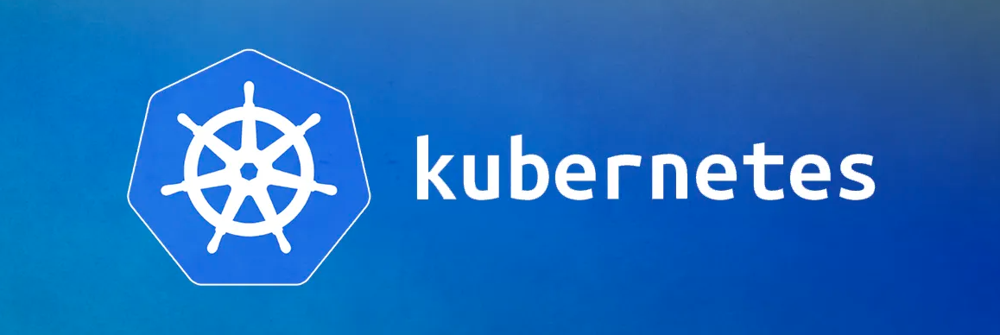

目前，Kubenetes 是容器编排市场的领导者，开源并公布了一系列标准化方法，主流的公有云平台都宣布支持。

**Kubernetes** 源于希腊语，它的中文翻译是“舵手”或者“飞行员”。在一些常见的资料中也会看到“k8s”这个词，它是通过将8个字母“ubernete”替换为“8”而导致的一个缩写。

在学习Docker的文章中介绍过一个概念叫做 Container，Container 这个英文单词除了容器还有另外的一个意思就是“集装箱”。Kubernetes 也就借着这个寓意，希望成为运送集装箱的一个轮船，来帮助我们管理这些集装箱，也就是管理这些容器。

更具体一点地来说：**Kubernetes 是一个自动化的容器编排平台，它负责应用的部署、应用的弹性以及应用的管理，这些都是基于容器的**。

# 2、Kubernetes有什么用

Kubernetes 有如下几个核心的功能：

* 服务的发现与负载的均衡；
* 容器的自动装箱，我们也会把它叫做 **scheduling**，就是“调度”，把一个容器放到一个集群的某一个机器上，Kubernetes 会帮助我们去做存储的编排，让存储的生命周期与容器的生命周期能有一个连接；
* Kubernetes 会帮助我们去做自动化的容器的恢复。在一个集群中，经常会出现宿主机的问题或者说是 OS 的问题，导致容器本身的不可用，Kubernetes 会自动地对这些不可用的容器进行恢复；
* Kubernetes 会帮助我们去做应用的自动发布与应用的回滚，以及与应用相关的配置密文的管理；
* 对于 job 类型任务，Kubernetes 可以去做批量的执行；
* 为了让这个集群、这个应用更富有弹性，Kubernetes 也支持水平的伸缩。

下面，我们希望以三个例子跟更切实地介绍一下 Kubernetes 的能力

## 2.1 调度

Kubernetes 可以把用户提交的容器放到 Kubernetes 管理的集群的某一台节点上去。Kubernetes 的调度器是执行这项能力的组件，它会观察正在被调度的这个容器的大小、规格。

比如说它所需要的 CPU以及它所需要的内存，然后在集群中找一台相对比较空闲的机器来进行一次 **placement**，也就是一次放置的操作。在这个例子中，它可能会把红颜色的这个容器放置到第二个空闲的机器上，来完成一次调度的工作。

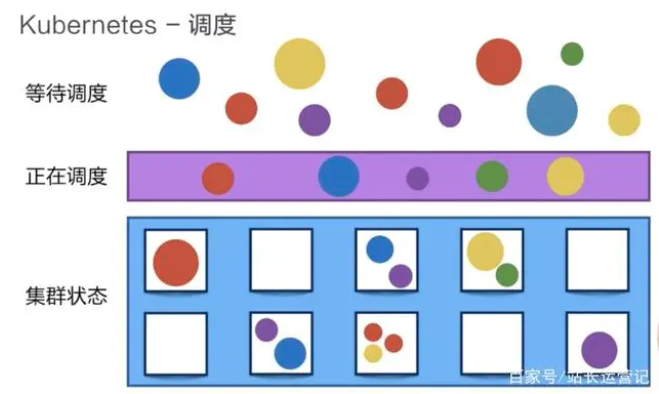
## 2.2 自动修复

Kubernetes 有一个节点健康检查的功能，它会监测这个集群中所有的宿主机，当宿主机本身出现故障，或者软件出现故障的时候，这个节点健康检查会自动对它进行发现。下面 Kubernetes 会把运行在这些失败节点上的容器进行自动迁移，迁移到一个正在健康运行的宿主机上，来完成集群内容器的一个自动恢复。

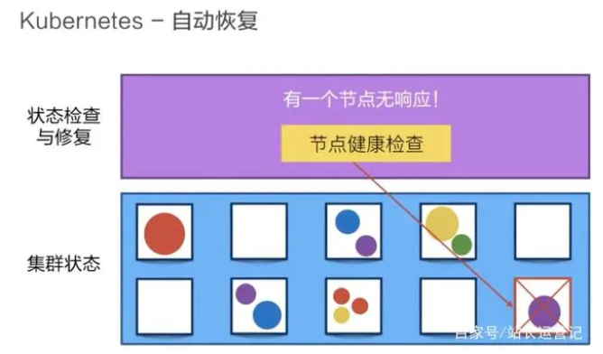

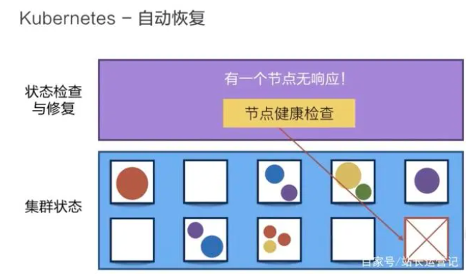

## 2.3 水平伸缩

Kubernetes 有业务负载检查的能力，它会监测业务上所承担的负载，如果这个业务本身的 CPU 利用率过高，或者响应时间过长，它可以对这个业务进行一次扩容。

比如说在下面的例子中，黄颜色的过度忙碌，Kubernetes 就可以把黄颜色负载从一份变为三份。接下来，它就可以通过负载均衡把原来打到第一个黄颜色上的负载平均分到三个黄颜色的负载上去，以此来提高响应的时间。

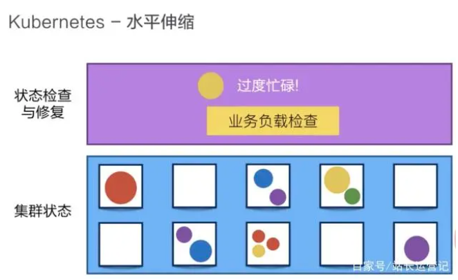


# 3、架构

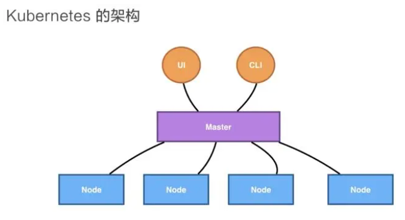

Kubernetes 架构是一个比较典型的 server-client 架构。

Master 作为中央的管控节点，会去与 Node 进行一个连接。所有 UI 的、clients、这些 user 侧的组件，只会和 Master 进行连接，把希望的状态或者想执行的命令下发给 Master，Master 会把这些命令或者状态下发给相应的节点，进行最终的执行。

## 3.1 Master
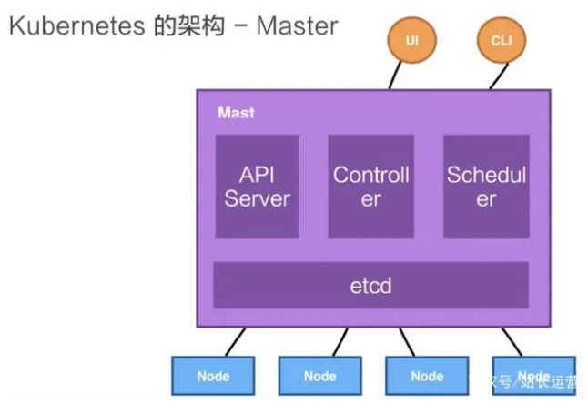


Kubernetes 的 Master 包含四个主要的组件：

* **API Server**：整个集群的控制中枢，提供集群中各个模块之间的数据交换，并将集群状态和信息存储到分布式键－值（key-value）存储系统Etcd集群中。同时它也是集群管理、资源配额、提供完备的集群安全机制的入口，为集群各类资源对象提供增删改查以及watch的REST API接口。
* **Controller**：集群状态管理器，以保证Pod或其他资源达到期望值。当集群中某个Pod的副本数或其他资源因故障和错误导致无法正常运行，没有达到设定的值时，Controller Manager会尝试自动修复并使其达到期望状态。
* **Scheduler**：集群Pod的调度中心，主要是通过调度算法将Pod分配到最佳的节点（Node），它通过APIServer监听所有Pod的状态，一旦发现新的未被调度到任何Node节点的Pod（PodSpec.NodeName为空），就会根据一系列策略选择最佳节点进行调度，对每一个Pod创建一个绑定（binding），然后被调度的节点上的Kubelet负责启动该Pod。
* **etcd**：由CoreOS开发，用于可靠地存储集群的配置数据，是一种持久性、轻量型、分布式的键－值（key-value）数据存储组件。Etcd作为Kubernetes集群的持久化存储系统，集群的灾难恢复和状态信息存储都与其密不可分，所以在Kubernetes高可用集群中，Etcd的高可用是至关重要。

我们刚刚提到的 API Server，它本身在部署结构上是一个可以水平扩展的一个部署组件；Controller 是一个可以进行热备的一个部署组件，它只有一个 active，它的调度器也是相应的，虽然只有一个 active，但是可以进行热备。

## 3.2 Node

Kubernetes 的 Node 是真正运行业务负载的，每个业务负载会以 **Pod** 的形式运行。一个 Pod 中运行的一个或者多个容器，真正去运行这些 Pod 的组件的是叫做 **kubelet**，也就是 Node 上最为关键的组件，它通过 API Server 接收到所需要 Pod 运行的状态，然后提交到 Container Runtime 组件中。

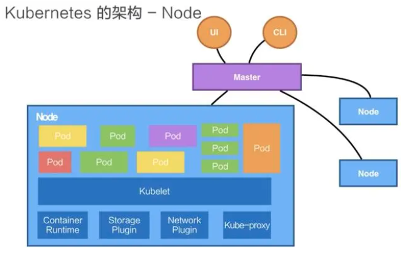

* **Kubelet**：Master 在 Node 节点上的 Agent，管理本机运行容器的生命周期，比如创建容器、Pod挂载数据卷、下载secret、获取容器和节点状态等工作。kubelet 将每个Pod 转换成一组容器。负责维护容器的生命周期。
* **Kube-proxy**：负责为Service提供cluster内部的服务发现和负载均衡；在 Node 节点上实现 Pod 网络代理，维护网络规则和四层负载均衡工作。
* **Container runtime**： 负责镜像管理以及Pod和容器的真正运行。
* **Storage Plugin**与**Network Plugin**：在 OS 上去创建容器所需要运行的环境，最终把容器或者 Pod 运行起来，也需要对存储跟网络进行管理。Kubernetes 并不会直接进行网络存储的操作，他们会靠 Storage Plugin 或者是 Network Plugin 来进行操作。用户自己或者云厂商都会去写相应的 Storage Plugin 或者 Network Plugin，去完成存储操作或网络操作。


下面我们以一个例子再去看一下 Kubernetes 架构中的这些组件，是如何互相进行交互的。

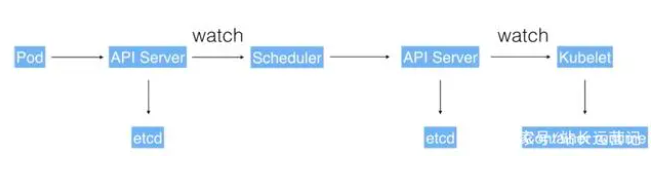

用户可以通过 UI 或者 CLI 提交一个 Pod 给 Kubernetes 进行部署，这个 Pod 请求首先会通过 CLI 或者 UI 提交给 Kubernetes API Server，下一步 API Server 会把这个信息写入到它的存储系统 etcd，之后 Scheduler 会通过 API Server 的 watch 或者叫做 notification 机制得到这个信息：有一个 Pod 需要被调度。

这个时候 Scheduler 会根据它的内存状态进行一次调度决策，在完成这次调度之后，它会向 API Server report 说：“OK！这个 Pod 需要被调度到某一个节点上。”

这个时候 API Server 接收到这次操作之后，会把这次的结果再次写到 etcd 中，然后 API Server 会通知相应的节点进行这次 Pod 真正的执行启动。相应节点的 kubelet 会得到这个通知，kubelet 就会去调 Container runtime 来真正去启动配置这个容器和这个容器的运行环境，去调度 Storage Plugin 来去配置存储，network Plugin 去配置网络。


# 4、核心概念

## 4.1 Pod

**Pod 是 Kubernetes 的一个最小调度以及资源单元**。

Pod 也是一个容器，这个容器中装的是 Docker 创建的容器。Pod 相当于独立主机，可以封装一个或者多个容器。Pod 有自己的 IP 地址、主机名，相当于一台独立沙箱环境。处于同一个Pod中的容器共享同样的存储空间（Volume，卷或存储卷）、网络命名空间IP地址和Port端口。

比如像下面的这幅图里面，它包含了两个容器，每个容器可以指定它所需要资源大小。比如说，一个核一个 G，或者说 0.5 个核，0.5 个 G。当然在这个 Pod 中也可以包含一些其他所需要的资源：比如说我们所看到的 Volume 卷这个存储资源；比如说我们需要 100 个 GB 的存储或者 20GB 的另外一个存储。

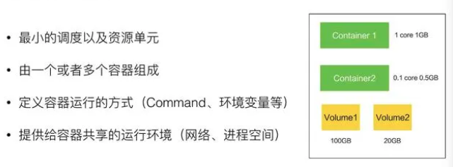

在 Pod 里面，我们也可以去定义容器所需要运行的方式。比如说运行容器的 Command，以及运行容器的环境变量等等。Pod 这个抽象也给这些容器提供了一个共享的运行环境，它们会共享同一个网络环境，这些容器可以用 localhost 来进行直接的连接。而 Pod 与 Pod 之间，是互相有 isolation 隔离的。

## 4.2 Deployment

Deployment 是在 **Pod 这个抽象上更为上层的一个抽象**，它可以定义一组 Pod 的副本数目、以及这个 Pod 的版本。一般大家用 Deployment 这个抽象来做应用的真正的管理，而 Pod 是组成 Deployment 最小的单元。

Kubernetes 是通过 Controller，也就是我们刚才提到的控制器去维护 Deployment 中 Pod 的数目，它也会去帮助 Deployment 自动恢复失败的 Pod。

比如说我可以定义一个 Deployment，这个 Deployment 里面需要两个 Pod，当一个 Pod 失败的时候，控制器就会监测到，它重新把 Deployment 中的 Pod 数目从一个恢复到两个，通过再去新生成一个 Pod。通过控制器，我们也会帮助完成发布的策略。比如说进行滚动升级，进行重新生成的升级，或者进行版本的回滚。

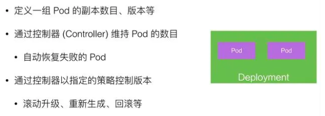

## 4.3 Volume

Volume 就是**卷**的概念，它是用来管理 Kubernetes 存储的，是用来声明在 Pod 中的容器可以访问文件目录的，一个卷可以被挂载在 Pod 中一个或者多个容器的指定路径下面。

而 Volume 本身是一个抽象的概念，一个 Volume 可以去支持多种的后端的存储。比如说 Kubernetes 的 Volume 就支持了很多存储插件，它可以支持本地的存储，可以支持分布式的存储，比如说像 ceph，GlusterFS ；它也可以支持云存储，比如说阿里云上的云盘、AWS 上的云盘、Google 上的云盘等等。

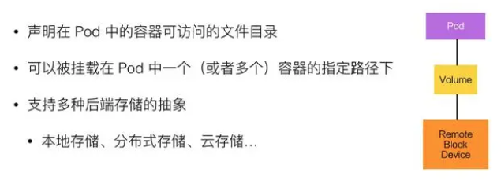

在使用虚拟机的情况下，我们通常会先定义一个网络存储，然后从中 划出一个“网盘”并挂接到虚拟机上。**Persistent Volume**(PV) 和与之相关联的 **Persistent Volume Claim**(PVC) 也起到了类似的作用。PV 可以被理解成 Kubernetes 集群中的某个网络存储对应的一块存储，它与 Volume 类似，但有以下区别:

* PV 只能是网络存储，不属于任何 Node，但可以在每个 Node 上访问。
* PV 并不是被定义在 Pod 上的，而是独立于 Pod 之外定义的。

## 4.4 Service

**Service 提供了一个或者多个 Pod 实例的稳定访问地址**。

Service 在 Kubernetes 中定义了一个服务的访问入口地址，前段的应用（Pod）通过这个入口地址访问其背后的一组由 Pod 副本组成的集群实例，Service 与其后端 Pod 副本集群之间则是通过 Label Selector 来实现无缝对接的。

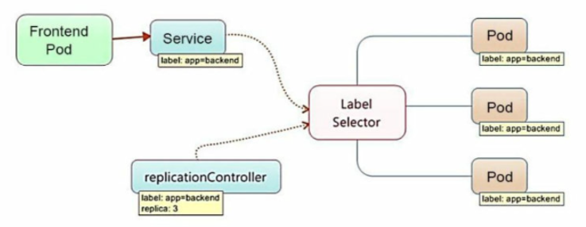

一个 Deployment 可能有两个甚至更多个完全相同的 Pod。对于一个外部的用户来讲，访问哪个 Pod 其实都是一样的，所以它希望做一次负载均衡，在做负载均衡的同时，我只想访问某一个固定的 VIP，也就是 **Virtual IP** 地址，而不希望得知每一个具体的 Pod 的 IP 地址。

对一个外部用户来讲，提供了多个具体的 Pod 地址，这个用户要不停地去更新 Pod 地址，当这个 Pod 再失败重启之后，我们希望有一个抽象，把所有 Pod 的访问能力抽象成一个第三方的一个 IP 地址，实现这个的 Kubernetes 的抽象就叫 Service。

**Kubernetes 通过给 Service 分配静态 IP 地址和域名来提供服务发现机制**，并且以轮询调度的方式将流量负载均衡到能与选择器匹配的 pod 的 IP 地址的网络连接上（即使是故障导致pod从一台机器移动到另一台机器）。

实现 Service 有多种方式，Kubernetes 支持 Cluster IP，上面我们讲过的 kuber-proxy 的组网，它也支持 nodePort、 LoadBalancer 等其他的一些访问的能力。

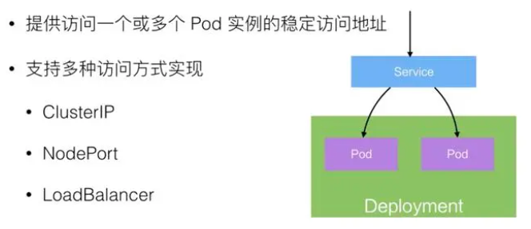

其主要类型有：
* **ClusterIP**：虚拟的服务IP地址，该地址用于Kubernetes集群内部的Pod访问，在Node上kube-proxy通过设置的iptables规则进行转发；
* **NodePort**：使用宿主机的端口，使能够访问各Node的外部客户端通过Node的IP地址和端口号就能访问服务；
* **LoadBalancer**：使用外接负载均衡器完成到服务的负载分发，需要在`spec.status.loadBalancer`字段指定外部负载均衡器的IP地址，通常用于公有云。


## 4.5 Replication Controller

Replication Controller，简称 **RC**，简单来说，它其实定义了一个期望的场景，即声明某种 Pod 的副本数量在任意时刻都符合某个预期值。

RC 的定义包括如下几个部分：

* Pod 期待的副本数量
* 用于筛选目标 Pod 的 Label Selector
* 当 Pod 的副本数小于预期数量时，用于创建新 Pod 的模版(template)


当提交这个 RC 在集群中后，Controller Manager 会定期巡检，确保目标 Pod 实例的数量等于 RC 的预期值，过多的数量会被停掉，少了则会创建补充。通过kubectl scale可以动态指定 RC 的预期副本数量。

目前，RC 已升级为新概念——**Replica Set**(RS)，两者当前唯一区别是，RS 支持了基于集合的 Label Selector，而 RC 只支持基于等式的 Label Selector。RS 很少单独使用，更多是被 Deployment 这个更高层的资源对象所使用，所以可以视作 RS+Deployment 将逐渐取代 RC 的作用。


## 4.6 Label

Label 是 Kubernetes 系统中的一个核心概念，**一个 Label 表示一个 key=value 的键值对**，key、value 的值由用户指定。Label 可以被附加到各种资源对象上，例如 Node、Pod、Service、RC 等，一个资源对象可以定义任意数量的 Label，同一个 Label 也可以被添加到任意数量的资源对象上。Label 通常在资源对象定义时确定，也可以在对象创建后动态添加或者删除。给一个资源对象定义了 Label 后，我们随后可以通过 **Label Selector** 查询和筛选拥有这个 Label 的资源对象，来实现多维度的资源分组管理功能，以便灵活、方便地进行资源分配、调 度、配置、部署等管理工作。

Label Selector 当前有两种表达式，基于等式的和基于集合的:

`name=redis-slave`: 匹配所有具有标签name=redis-slave的资源对象。
`env!=production`: 匹配所有不具有标签env=production的资源对象。
`name in(redis-master, redis-slave)`:`name=redis-master`或者`name=redis-slave`的资源对象。
`name not in(php-frontend)`:匹配所有不具有标签`name=php-frontend`的资源对象。

以 myWeb Pod 为例:

```YAML
apiVersion: v1  # 分组和版本
kind: Pod       # 资源类型
metadata:
  name: myWeb   # Pod名
  labels:
    app: myWeb # Pod的标签
```    

当一个 Service 的 selector 中指明了这个 Pod 时，该 Pod 就会与该 Service 绑定

```YAML
apiVersion: v1
kind: Service
metadata:
  name: myWeb
spec:
  selector:
    app: myWeb
  ports:
  - port: 8080
```

## 4.7 StatefulSet

在 Kubernetes 系统中，Pod 的管理对象 RC、Deployment、DaemonSet 和 Job 都面向无状态的服务。但现实中有很多服务是有状态的，特别是一些复杂的中间件集群，例如 MySQL 集群、MongoDB 集群、Kafka 集群、ZooKeeper 集群等，这些应用集群有 4 个共同点。

* 每个节点都有固定的身份 ID，通过这个 ID，集群中的成员可以相互发现并通信。
* 集群的规模是比较固定的，集群规模不能随意变动。
* 集群中的每个节点都是有状态的，通常会持久化数据到永久存储中。
* 如果磁盘损坏，则集群里的某个节点无法正常运行，集群功能受损。

StatefulSet 保证 Pod 重新建立后，Hostname 不会发生变化，Pod 就可以通过 Hostname 来关联数据。因此，StatefulSet 具有以下特点：

* StatefulSet 里的每个 Pod 都有稳定、唯一的网络标识，可以用来发现集群内的其他成员。假设 StatefulSet 的名称为 kafka，那么第 1 个 Pod 叫 kafka-0，第 2 个叫 kafka-1，以此类推。
* StatefulSet 控制的 Pod 副本的启停顺序是受控的，操作第 n 个 Pod 时，前 n-1 个 Pod 已经是运行且准备好的状态。
* StatefulSet 里的 Pod 采用稳定的持久化存储卷，通过 PV 或 PVC 来 实现，删除 Pod 时默认不会删除与 StatefulSet 相关的存储卷(为了保证数 据的安全)。
* StatefulSet 除了要与 PV 卷捆绑使用以存储 Pod 的状态数据，还要与 Headless Service 配合使用。

**Headless Service** 与普通 Service 的关键区别在于， 它没有 Cluster IP，如果解析 Headless Service 的 DNS 域名，则返回的是该 Service 对应的全部 Pod 的 Endpoint 列表。

## 4.8 Namespace

Namespace 是用来做一个集群内部的逻辑隔离的，它包括鉴权、资源管理等。Kubernetes 的每个资源，比如刚才讲的 Pod、Deployment、Service 都属于一个 Namespace，同一个 Namespace 中的资源需要命名的唯一性，不同的 Namespace 中的资源可以重名。

Namespace 一个用例，比如像在阿里巴巴，内部会有很多个 business units，在每一个 business units 之间，希望有一个视图上的隔离，并且在鉴权上也不一样，在 cuda 上面也不一样，我们就会用 Namespace 来去给每一个 BU 提供一个他所看到的这么一个看到的隔离的机制。

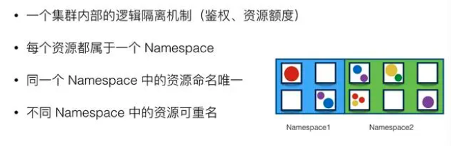


# 222


