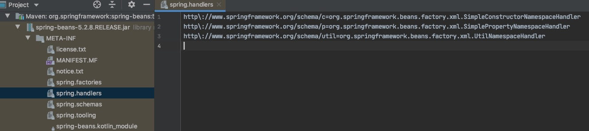
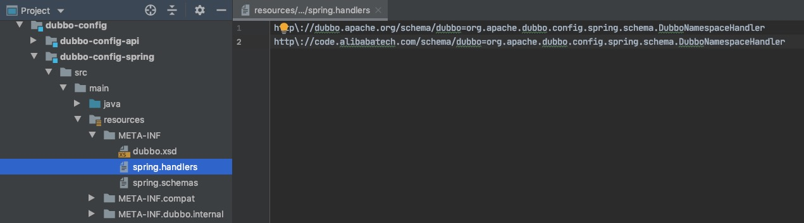
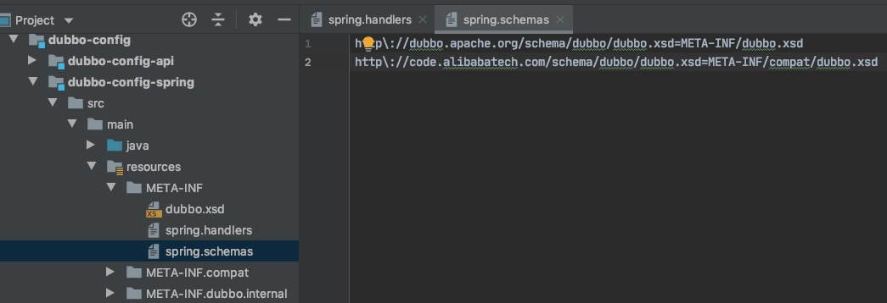

# 1、引言

> 源码之前，了无秘密。
>
> 本文源码基于Apache Dubbo 3.0.2。

- **本期主题**：*Dubbo的配置文件是如何转换为Spring bean的*？

# 2、DubboNamespaceHandler

以源码中的provider demo为例，配置文件如下：

```xml
<beans xmlns:xsi="http://www.w3.org/2001/XMLSchema-instance"
       xmlns:dubbo="http://dubbo.apache.org/schema/dubbo"
       xmlns="http://www.springframework.org/schema/beans"
       xsi:schemaLocation="http://www.springframework.org/schema/beans http://www.springframework.org/schema/beans/spring-beans-4.3.xsd
       http://dubbo.apache.org/schema/dubbo http://dubbo.apache.org/schema/dubbo/dubbo.xsd">

    <dubbo:application name="demo-provider"></dubbo:application>

    <dubbo:config-center address="zookeeper://127.0.0.1:2181"/>
    <dubbo:metadata-report address="zookeeper://127.0.0.1:2181"/>
    <dubbo:registry id="registry1" address="zookeeper://127.0.0.1:2181?registry-type=service"/>

    <dubbo:protocol name="dubbo" port="-1"/>
    <dubbo:protocol name="rest" port="-1"/>

    <bean id="demoService" class="org.apache.dubbo.demo.provider.DemoServiceImpl"/>
    <bean id="greetingService" class="org.apache.dubbo.demo.provider.GreetingServiceImpl"/>
    <bean id="restDemoService" class="org.apache.dubbo.demo.provider.RestDemoServiceImpl"/>

    <dubbo:service delay="5000" interface="org.apache.dubbo.demo.DemoService" timeout="3000" ref="demoService" registry="registry1" protocol="dubbo"/>
    <dubbo:service delay="5000" version="1.0.0" group="greeting" timeout="5000" interface="org.apache.dubbo.demo.GreetingService"
                   ref="greetingService" protocol="dubbo"/>
    <dubbo:service delay="5000" version="1.0.0" timeout="5000" interface="org.apache.dubbo.demo.RestDemoService"
                   ref="restDemoService" protocol="rest"/>

</beans>
```

Dubbo标签要想在Spring的地盘混下去而不被驱逐，第一步就要解决合法性的问题。我们看到XML最上面，有这么一行声明：

`xmlns:dubbo="http://dubbo.apache.org/schema/dubbo"`

它按照XML规范定义一个缩写为`dubbo`的命名空间，如此一来，在XML正文当中出现的`<dubbo:..>`标签就有了良民证，不过适用范围只限于`<dubbo:..>`这个带头大哥，但是罩不住他手下的一众小弟，比如`service`标签、`interface`属性等。所以还需要第二张良民证：

`http://dubbo.apache.org/schema/dubbo http://dubbo.apache.org/schema/dubbo/dubbo.xsd`

这一行代码指明了Dubbo管理手下的帮规，`dubbo.xsd`可以看作是Dubbo标签的校验器，规定了`<dubbo:..>`可以使用哪些子标签，拥有哪些属性，哪些是必须的，先后顺序如何等。

Spring容器启动时，读取配置文件，然后解析其中的每个元素。`<bean>`标签是Spring的自家人，熟人好办事，打起交道来自然轻车熟路，但是`<dubbo:...>`标签明显是外来户，看着还不太好惹，Spring连对方的脾气都摸不清，怎么敢贸然下手呢？

虽然Dubbo手握两个良民证，但是只能保证过得了XML的安检，也就是在XML的语法上不给你报错，要想进入Spring的地盘，还需要找个能与Spring搭得上话的人，送点厚礼，打点关系。Dubbo与Spring的中间人就是`DubboNamespaceHandler`。

```java
public class DubboNamespaceHandler extends NamespaceHandlerSupport implements ConfigurableSourceBeanMetadataElement {

    static {
        Version.checkDuplicate(DubboNamespaceHandler.class);
    }

    @Override
    public void init() {
        //注册Dubbo标签的解析器，负责解析XML中不同的节点，如<dubbo:application/>、<dubbo:module/>等
        registerBeanDefinitionParser("application", new DubboBeanDefinitionParser(ApplicationConfig.class));
        registerBeanDefinitionParser("module", new DubboBeanDefinitionParser(ModuleConfig.class));
        registerBeanDefinitionParser("registry", new DubboBeanDefinitionParser(RegistryConfig.class));
        registerBeanDefinitionParser("config-center", new DubboBeanDefinitionParser(ConfigCenterBean.class));
        registerBeanDefinitionParser("metadata-report", new DubboBeanDefinitionParser(MetadataReportConfig.class));
        registerBeanDefinitionParser("monitor", new DubboBeanDefinitionParser(MonitorConfig.class));
        registerBeanDefinitionParser("metrics", new DubboBeanDefinitionParser(MetricsConfig.class));
        registerBeanDefinitionParser("ssl", new DubboBeanDefinitionParser(SslConfig.class));
        registerBeanDefinitionParser("provider", new DubboBeanDefinitionParser(ProviderConfig.class));
        registerBeanDefinitionParser("consumer", new DubboBeanDefinitionParser(ConsumerConfig.class));
        registerBeanDefinitionParser("protocol", new DubboBeanDefinitionParser(ProtocolConfig.class));
        registerBeanDefinitionParser("service", new DubboBeanDefinitionParser(ServiceBean.class));
        registerBeanDefinitionParser("reference", new DubboBeanDefinitionParser(ReferenceBean.class));
        registerBeanDefinitionParser("annotation", new AnnotationBeanDefinitionParser());
    }

    @Override
    public BeanDefinition parse(Element element, ParserContext parserContext) {

        // 拿到Spring的BeanDefinition注册入口，一般就是DefaultListableBeanFactory实例
        BeanDefinitionRegistry registry = parserContext.getRegistry();

        // 注册与Spring注解相关的各种后置处理器，用于支持@Autowired、@Resource等特性，
        // Dubbo只是转掉了Spring的方法，将处理器的注册提前了点而已，并没有做其他改变
        registerAnnotationConfigProcessors(registry);

        // 注册Dubbo依赖的基础bean
        registerCommonBeans(registry);

        // 将XML元素解析为BeanDefinition，依赖于init方法中的各种DubboBeanDefinitionParser
        BeanDefinition beanDefinition = super.parse(element, parserContext);
        setSource(beanDefinition);

        return beanDefinition;
    }

    private void registerAnnotationConfigProcessors(BeanDefinitionRegistry registry) {
      	// Spring原生工具类
        AnnotationConfigUtils.registerAnnotationConfigProcessors(registry);
    }
```

`DubboNamespaceHandler`继承自`NamespaceHandlerSupport`，`NamespaceHandlerSupport`是Spring解析标签的扩展点，通过它可以解析Spring之外的自定义标签。


Spring遇到Dubbo标签时会交由`DubboNamespaceHandler`处理，`DubboNamespaceHandler`再根据具体的标签类型，指派给不同的`DubboBeanDefinitionParser`去解析。

一环扣一环，很完美。

但是有个问题还没搞清楚，Spring是怎么知道遇到`<dubbo:..>`就去找`DubboNamespaceHandler`帮忙呢？实际上，XML配置文件中大多情况下都是多种命名空间并存的，比Spring的`<bean>`标签、Spring MVC的`<mvc:...>`标签、切面相关的的`<aop:...>`标签，不难推测，**每种标签与处理器之间必然有一个映射关系存在**。

答案在`DefaultNamespaceHandlerResolver`中：

```java

public class DefaultNamespaceHandlerResolver implements NamespaceHandlerResolver {

    //存放XML处理器映射关系的默认路径
    public static final String DEFAULT_HANDLER_MAPPINGS_LOCATION = "META-INF/spring.handlers";

    //XML命名空间——》处理器
    private volatile Map<String, Object> handlerMappings;

    @Override
    @Nullable
    public NamespaceHandler resolve (String namespaceUri) {
        Map<String, Object> handlerMappings = getHandlerMappings(); //获取全部的处理器
        Object handlerOrClassName = handlerMappings.get(namespaceUri);
        if (handlerOrClassName == null) {
            return null;
        } else if (handlerOrClassName instanceof NamespaceHandler) {
            return (NamespaceHandler) handlerOrClassName;
        } else {
            String className = (String) handlerOrClassName;
            try { 
                //加载处理器
                Class<?> handlerClass = ClassUtils.forName(className, this.classLoader);
                if (!NamespaceHandler.class.isAssignableFrom(handlerClass)) {
                    //...
                }
                //触发初始化
                NamespaceHandler namespaceHandler = (NamespaceHandler) BeanUtils.instantiateClass(handlerClass);
                namespaceHandler.init();
                handlerMappings.put(namespaceUri, namespaceHandler);
                return namespaceHandler;
            } catch (ClassNotFoundException ex) {
                //...
        }
    }

    private Map<String, Object> getHandlerMappings () {
        Map<String, Object> handlerMappings = this.handlerMappings;
        if (handlerMappings == null) { //延迟加载
            synchronized (this) {
                handlerMappings = this.handlerMappings;
                if (handlerMappings == null) {
                    try {
                        //扫描全部jar包下的"META-INF/spring.handlers"文件
                        Properties mappings = PropertiesLoaderUtils.loadAllProperties(this.handlerMappingsLocation,
                            this.classLoader);
                        if (logger.isTraceEnabled()) {
                            logger.trace("Loaded NamespaceHandler mappings: " + mappings);
                        }
                        handlerMappings = new ConcurrentHashMap<>(mappings.size());
                        CollectionUtils.mergePropertiesIntoMap(mappings, handlerMappings);
                        this.handlerMappings = handlerMappings;
                    } catch (IOException ex) {
                        //...
                    }
                }
            }
        }
        return handlerMappings;
    }

}
```

例如，spring-beans包下可以找到`<bean>`标签的处理器：



同理，Dubbo标签处理器也在同样的路径下：



而另一个文件`META-INF/spring.schemas`，则用于指明XML的xsd文件路径：



Dubbo处理器被加载后，Spring会调用用`init()`方法，各种标签解析器就是在这个时候被注册进来的。

# 3、DubboBeanDefinitionParser

`DubboBeanDefinitionParser`继承自Spring的`BeanDefinitionParser`，重点看一下`parse`方法：

```java
    private static RootBeanDefinition parse(Element element, ParserContext parserContext, Class<?> beanClass, boolean registered) {
        RootBeanDefinition beanDefinition = new RootBeanDefinition();
        beanDefinition.setBeanClass(beanClass);
        beanDefinition.setLazyInit(false);
        //...
        //给配置项设置一个唯一的名称
        beanDefinition.setAttribute(BEAN_NAME, beanName);

        if (ServiceBean.class.equals(beanClass)) {
            //如果服务提供者是通过"class"属性来指定实现类的：<dubbo:service class="xxx.DemoServiceImpl"/>
            //将其转换成<dubbo:service ref="beanId"/> 的等价形式
            String className = resolveAttribute(element, "class", parserContext);
            if (StringUtils.isNotEmpty(className)) {
                RootBeanDefinition classDefinition = new RootBeanDefinition();
                classDefinition.setBeanClass(ReflectUtils.forName(className));
                classDefinition.setLazyInit(false);
                parseProperties(element.getChildNodes(), classDefinition, parserContext);
                beanDefinition.getPropertyValues().addPropertyValue("ref", new BeanDefinitionHolder(classDefinition, beanName + "Impl"));
            }
        }

        //这里缓存了每个配置项class中，属性——》属性类型的映射关系。
        // 一个配置项比如ServiceConfig，很可能有很多实例，后面再解析到同样的XML节点，就不用每次都去通过反射获取了
        Map<String, Class> beanPropTypeMap = beanPropsCache.get(beanClass.getName());
        if (beanPropTypeMap == null) {
            beanPropTypeMap = new HashMap<>();
            beanPropsCache.put(beanClass.getName(), beanPropTypeMap);
            if (ReferenceBean.class.equals(beanClass)) {
                //extract bean props from ReferenceConfig
                getPropertyMap(ReferenceConfig.class, beanPropTypeMap);
            } else {
                getPropertyMap(beanClass, beanPropTypeMap);
            }
        }

        ManagedMap parameters = null;
        Set<String> processedProps = new HashSet<>();
        for (Map.Entry<String, Class> entry : beanPropTypeMap.entrySet()) {
            String beanProperty = entry.getKey();
            Class type = entry.getValue();
            String property = StringUtils.camelToSplitName(beanProperty, "-");
            processedProps.add(property);

            //"parameters"、"methods"、"arguments"节点走特殊的处理分支
            if ("parameters".equals(property)) {
                parameters = parseParameters(element.getChildNodes(), beanDefinition, parserContext);
            } else if ("methods".equals(property)) {
                parseMethods(beanName, element.getChildNodes(), beanDefinition, parserContext);
            } else if ("arguments".equals(property)) {
                parseArguments(beanName, element.getChildNodes(), beanDefinition, parserContext);
            } else {
                //其余情况，通用的属性解析
                String value = resolveAttribute(element, property, parserContext);
                if (value != null) {
                    value = value.trim();
                    if (value.length() > 0) {
                        if ("registry".equals(property) && RegistryConfig.NO_AVAILABLE.equalsIgnoreCase(value)) {
                            RegistryConfig registryConfig = new RegistryConfig();
                            registryConfig.setAddress(RegistryConfig.NO_AVAILABLE);
                            beanDefinition.getPropertyValues().addPropertyValue(beanProperty, registryConfig);
                        } else if ("provider".equals(property) || "registry".equals(property) || ("protocol".equals(property) && AbstractServiceConfig.class.isAssignableFrom(beanClass))) {

                            //'provider' 'protocol' 'registry'的ID被以字符串的形式，转换为名为'registryIds' 'providerIds' protocolIds'的属性
                            // 用以从配置中心寻找配置详情
                            beanDefinition.getPropertyValues().addPropertyValue(beanProperty + "Ids", value);
                        } else {
                            Object reference;
                            if (isPrimitive(type)) {
                                //如果是原始类型，直接获取值，无特殊处理
                                value = getCompatibleDefaultValue(property, value);
                                reference = value;
                            } else if (ONRETURN.equals(property) || ONTHROW.equals(property) || ONINVOKE.equals(property)) {
                                //dubbo在调用之前，之后，出现异常时，会触发oninvoke,onreturn,onthrow三个事件，可配置当事件发生时，通知那个类的那个方法
                                // 如：<dubbo:method name="methodInvoke" onreturn="notify.onreturn" onthrow="notify.onthrow" />
                                int index = value.lastIndexOf(".");
                                String ref = value.substring(0, index);
                                String method = value.substring(index + 1);
                                reference = new RuntimeBeanReference(ref);
                                beanDefinition.getPropertyValues().addPropertyValue(property + METHOD, method);
                            } else {
                                //解析"ref"属性，可能对应的Bean还没有准备好，所以使用的是RuntimeBeanReference，
                                // 在Spring处理依赖关系时，最终会将该引用替换成实际生成的Bean对象。
                                if ("ref".equals(property) && parserContext.getRegistry().containsBeanDefinition(value)) {
                                    BeanDefinition refBean = parserContext.getRegistry().getBeanDefinition(value);
                                    if (!refBean.isSingleton()) {
                                        //...
                                    }
                                }
                                reference = new RuntimeBeanReference(value);
                            }
                            if (reference != null) {
                                beanDefinition.getPropertyValues().addPropertyValue(beanProperty, reference);
                            }
                        }
                    }
                }
            }
        }

        NamedNodeMap attributes = element.getAttributes();
        int len = attributes.getLength();
        for (int i = 0; i < len; i++) {
            Node node = attributes.item(i);
            String name = node.getLocalName();
            if (!processedProps.contains(name)) {
                if (parameters == null) {
                    parameters = new ManagedMap();
                }
                //其余没有被处理的属性，统一用字符串的形式存储
                String value = node.getNodeValue();
                parameters.put(name, new TypedStringValue(value, String.class));
            }
        }
        if (parameters != null) {
            beanDefinition.getPropertyValues().addPropertyValue("parameters", parameters);
        }

        // ...
        return beanDefinition;
    }
```

不得不吐槽一下，这段代码写的很不优雅，if-else满天飞，基本上是硬堆代码的节奏。

# 4、DubboBootstrapApplicationListener

Dubbo的配置文件解析后得到了`BeanDefinition`，实际上只是一份图纸，还没有生成bean的实例。

再回头看一下`DubboNamespaceHandler`的`parse`方法，在转调各个`DubboBeanDefinitionParser`之前，还有一个非常重要的步骤——通过`DubboBeanUtils.registerCommonBeans()`完成**解析前的准备工作**：

```java
static void registerCommonBeans(BeanDefinitionRegistry registry) {

  //ReferenceAnnotationBeanPostProcessor扫描到被@DubboService注解的接口会放进ServicePackagesHolder，以便后续作为容器类使用
  registerInfrastructureBean(registry, ServicePackagesHolder.BEAN_NAME, ServicePackagesHolder.class);

  //Dubbo消费者中，被<dubbo:reference ...>配置的接口，会被放入ReferenceBeanManager，以便后续作为容器类使用
  registerInfrastructureBean(registry, ReferenceBeanManager.BEAN_NAME, ReferenceBeanManager.class);

  // 注册后置处理器，扫描出@DubboService类，并注入到被依赖的其他Bean当中
  registerInfrastructureBean(registry, ReferenceAnnotationBeanPostProcessor.BEAN_NAME,
                             ReferenceAnnotationBeanPostProcessor.class);

  // 注册后置处理器，为Dubbod配置类注册别名
  registerInfrastructureBean(registry, DubboConfigAliasPostProcessor.BEAN_NAME,
                             DubboConfigAliasPostProcessor.class);

  // 监听Spring容器的启动与关闭，触发Dubbo的初始化与销毁
  registerInfrastructureBean(registry, DubboBootstrapApplicationListener.BEAN_NAME,
                             DubboBootstrapApplicationListener.class);

  // 注册后置处理器，为Dubbo的配置类注入默认值（比如ID）
  registerInfrastructureBean(registry, DubboConfigDefaultPropertyValueBeanPostProcessor.BEAN_NAME,
                             DubboConfigDefaultPropertyValueBeanPostProcessor.class);

  // 用于初始化Dubbo的配置类，比如ApplicationConfig、ProviderConfig、ConsumerConfig等
  registerInfrastructureBean(registry, DubboConfigBeanInitializer.BEAN_NAME, DubboConfigBeanInitializer.class);

  // 注册一些其他Dubbo依赖的基础bean
  registerInfrastructureBean(registry, DubboInfraBeanRegisterPostProcessor.BEAN_NAME, DubboInfraBeanRegisterPostProcessor.class);
}
```

其中注册了一个名为`DubboBootstrapApplicationListener`的监听器：

```java
public class DubboBootstrapApplicationListener implements ApplicationListener, ApplicationContextAware, Ordered {
  
  //...
  
  
  @Override
    public void onApplicationEvent(ApplicationEvent event) {
        if (isOriginalEventSource(event)) {
            if (event instanceof DubboAnnotationInitedEvent) {
                // This event will be notified at AbstractApplicationContext.registerListeners(),
                // init dubbo config beans before spring singleton beans
                applicationContext.getBean(DubboConfigBeanInitializer.BEAN_NAME, DubboConfigBeanInitializer.class);

                // All infrastructure config beans are loaded, initialize dubbo here
                DubboBootstrap.getInstance().initialize();
            } else if (event instanceof ApplicationContextEvent) {
                this.onApplicationContextEvent((ApplicationContextEvent) event);
            }
        }
    }

    private void onApplicationContextEvent(ApplicationContextEvent event) {
        if (DubboBootstrapStartStopListenerSpringAdapter.applicationContext == null) {
            DubboBootstrapStartStopListenerSpringAdapter.applicationContext = event.getApplicationContext();
        }
        if (event instanceof ContextRefreshedEvent) {
            //Spring容器启动，触发Dubbo启动
            onContextRefreshedEvent((ContextRefreshedEvent) event);
        } else if (event instanceof ContextClosedEvent) {
            //Spring容器关闭，触发Dubbo销毁前的钩子方法
            onContextClosedEvent((ContextClosedEvent) event);
        }
    }

    private void onContextRefreshedEvent(ContextRefreshedEvent event) {
        if (dubboBootstrap.getTakeoverMode() == BootstrapTakeoverMode.SPRING) {
            dubboBootstrap.start(); //dubbo启动
        }
    }

    private void onContextClosedEvent(ContextClosedEvent event) {
        if (dubboBootstrap.getTakeoverMode() == BootstrapTakeoverMode.SPRING) {
            DubboShutdownHook.getDubboShutdownHook().run(); //dubbo优雅下线
        }
    }
  
   //...
  
}
```

可见，Dubbo的启动是通过`DubboBootstrap`类来完成的：

```java
public class DubboBootstrap {
  
      public DubboBootstrap start() {
        if (started.compareAndSet(false, true)) { //只启动一次
            startup.set(false);
            shutdown.set(false);
            awaited.set(false);

            // 初始化准备
            initialize(); 
          
            // 将Provider暴露出去
            exportServices();

            // 获取Consumer配置
            referServices();
          
            //...

        }
        return this;
    }
  
    
      public void initialize() {
        if (!initialized.compareAndSet(false, true)) {
            return; //防止重复初始化
        }

        ApplicationModel.initFrameworkExts(); //初始化FrameworkExt扩展点

        startConfigCenter(); //启动配置中心
        loadConfigsFromProps(); //加载properties文件，如dubbo.applications.xxx等
				
        //启动元数据中心
        startMetadataCenter();
        initMetadataService();
				
        //...
    }
  
  
}

```

`DubboBootstrap`是Dubbo的启动引导类，主要功能主要有：

- 启动配置中心
- 启动元数据中心
- 检查各种配置的合法性
- 暴露服务提供者

服务的暴露过程也是很重要的一环，后面单独开篇详述。

