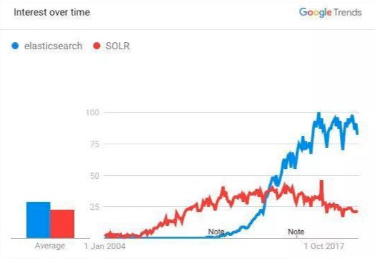
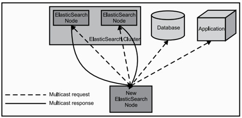
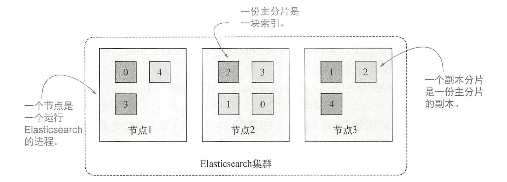
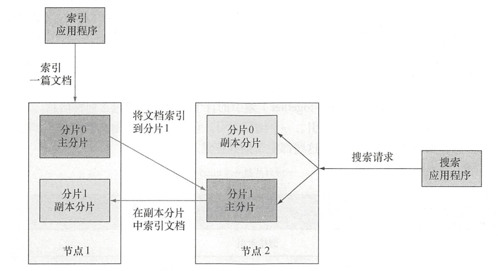

# 1、Elasticsearch是什么

Elasticsearch 是一个分布式的开源搜索和分析引擎，在 *Apache Lucene* 的基础上开发而成。

Lucene 是开源的搜索引擎工具包，Elasticsearch 充分利用Lucene，并对其进行了扩展，使存储、索引、搜索都变得更快、更容易， 而最重要的是， 正如名字中的“ elastic ”所示， 一切都是灵活、有弹性的。而且，应用代码也不是必须用Java 书写才可以和Elasticsearc兼容，完全可以通过JSON 格式的HTTP 请求来进行索引、搜索和管理Elasticsearch 集群。

如果你已经听说过Lucene ，那么可能你也听说了*Solr* ，它也是开源的基于Lucene 的分布式搜索引擎，跟Elasticsearch有很多相似之处。



但是Solr 诞生于2004 年，而Elasticsearch诞生于2010，Elasticsearch凭借后发优势和更活跃的社区、更完备的生态系统，迅速反超Solr，成为搜索市场的第二代霸主。

Elasticsearch具有以下优势：

- **Elasticsearch 很快。** 由于 Elasticsearch 是在 Lucene 基础上构建而成的，所以在全文本搜索方面表现十分出色。Elasticsearch 同时还是一个近实时的搜索平台，这意味着从文档索引操作到文档变为可搜索状态之间的延时很短，一般只有一秒。因此，Elasticsearch 非常适用于对时间有严苛要求的用例，例如安全分析和基础设施监测。
- **Elasticsearch 具有分布式的本质特征。** Elasticsearch 中存储的文档分布在不同的容器中，这些容器称为*分片*，可以进行复制以提供数据冗余副本，以防发生硬件故障。Elasticsearch 的分布式特性使得它可以扩展至数百台（甚至数千台）服务器，并处理 PB 量级的数据。
- **Elasticsearch 包含一系列广泛的功能。** 除了速度、可扩展性和弹性等优势以外，Elasticsearch 还有大量强大的内置功能（例如数据汇总和索引生命周期管理），可以方便用户更加高效地存储和搜索数据。
- **Elastic Stack 简化了数据采集、可视化和报告过程。** 人们通常将 Elastic Stack 称为 *ELK Stack*（代指*Elasticsearch*、*Logstash* 和 *Kibana*），目前 Elastic Stack 包括一系列丰富的轻量型数据采集代理，这些代理统称为 *Beats*，可用来向 Elasticsearch 发送数据。通过与 Beats 和 Logstash 进行集成，用户能够在向 Elasticsearch 中索引数据之前轻松地处理数据。同时，Kibana 不仅可针对 Elasticsearch 数据提供实时可视化，同时还提供 UI 以便用户快速访问应用程序性能监测 (APM)、日志和基础设施指标等数据。

# 2、逻辑结构

## 2.1 Document

Elasticsearch 是面向文档的，这意味着**索引和搜索数据的最小单位是文档**。

一个文档通常是以JSON 的数据格式来表示的。例如，一项技术大会的活动可以通过如下文档表达：

```json
{
    "name":"Elasticsearch技术峰会",
    "organizer":"冰河",
    "location ":"中国, 浙江，杭州"
}
```

一个Document中有很多**Field**，一个Field就是一个数据字段。

文档可以是包含若干取值的一行。但是这样的比较不够精准，它们还是有所差别。一个区别是，和行有所不同，文档可以是层次型的。例如，位置可以包含地址和邮编：

```json
{
    "name":"Elasticsearch技术峰会",
    "organizer":"冰河",
    "location ":{
        "address":"中国, 浙江，杭州",
        "postcode":"310000"
    }
}
```

一篇单独的文档也可以包含一组数值，例如：

```json
{
    "name":"Elasticsearch技术峰会",
    "organizer":"冰河",
    "member":[
        "洪七公",
        "黄药师",
        "欧阳锋",
        "一灯"
    ]
}
```


## 2.2 Type

类型，是文档的逻辑容器，类似于表格是行的容器。在不同的类型中，最好放入不同结构的文档。

每个类型中字段（Field）的定义称为**映射**（Mapping）。例如， 一个人的姓名可以映射为string，年龄可以映射为int。

映射包含某个类型中当前索引的所有文档的所有字段，但是不是所有的文档必须要有所有的宇段。同样，如果一篇新近索引的文档拥有一个映射中尚不存在的字段， Elasticsearch 会自动地将新字段加入映射。为了添加这个字段Elasticsearch 不得不确定它是什么类型，于是Elasticsearch 会进行猜测。例如， 如果值是7，Elasticsearch 会假设字段是长整型。

这种新字段的自动检测也有缺点，因为Elasticsearch 可能猜得不对。例如，在索引了值7之后，你可能想再索引hello world ，这时由于它是string 而不是long ，索引就会失败。对于线上环境，一般在索引数据之前，都会定义好所需的映射，不允许动态添加字段。

## 2.3 Index

索引，是类型的容器。一个Elasticsearch 索引非常像关系型世界的数据库，是独立的大量文档集合。每个索引存储在磁盘上的同组文件中，索引存储了所有映射类型的字段，还有一些设置。

## 2.4 与关系数据库的类比

| ES       | 关系数据库 |
| -------- | ---------- |
| Field    | Column     |
| Document | Row        |
| Type     | Table      |
| Mapping  | Schema     |
| Index    | Database   |


需要特别注意的是：ES 6以前每个Index可以有多个Type，**在ES 6中一个Index仅能包含一个Type，而在ES 7将完全移除Type**。

为什么要移除Type呢？

我们一直拿ES与关系数据库作类比，说"索引"和关系数据库的“库”是相似的，“类型”和“表”是对等的。实际上这是一个不太准确的对比。在关系型数据库里，"表"是相互独立的，一个“表”里的列和另外一个“表”的同名列没有关系，互不影响。但在ES的中不是这样的。

在同一个Index下，不管有多少个Type，底层共用一个Lucene实例，也就是说，所有Type的同名字段在内部使用的是同一个Lucene字段存储，这就要求同名字段必须属于同一种数据类型。这可能导致一些问题，例如同一个索引下，有两个结构不同的Type，都拥有一个名为"deleted"字段，但是如果期望的在一个Type里是存储日期值，在另外一个Type里存储布尔值，是做不到的。

还有一个更重要的原因，在同一个索引中，存储仅有小部分字段相同或者全部字段都不相同的文档，会导致数据稀疏，影响Lucene有效压缩数据的能力。

# 3、物理结构

## 3.1 Node

一个节点是一个ES的实例，在服务器上启动ES之后，就拥有了一个节点，如果在另一个服务器上启动ES，这就是另一个节点。甚至可以在一台服务器上启动多个ES进程，在一台服务器上拥有多个节点。多个节点可以加入同一个集群。

当ElasticSearch的节点启动后，它会利用多播(multicast)(或者单播，如果用户更改了配置)寻找集群中的其它节点，并与之建立连接。这个过程如下图所示：



节点主要有以下几种角色：

- **Mater-eligible Node**：负责管理集群范畴的变更，例如创建或删除索引，添加节点到集群或从集群删除节点，以及决定将哪些分片分配给哪些节点。每个节点都保存了集群的状态，但是只有 Master 节点才能修改集群的状态信息。
- **Data Node**：保存包含索引文档的分片数据，执行CRUD、搜索、聚合相关的操作，属于内存、CPU、IO密集型，对硬件资源要求高。
- **Coordinating Node**：搜索请求在两个阶段中执行（query 和 fetch），这两个阶段由接收客户端请求的节点——协调节点协调。在请求阶段，协调节点将请求转发到保存数据的数据节点。 每个数据节点在本地执行请求并将其结果返回给协调节点。在收集fetch阶段，协调节点将每个数据节点的结果汇集为单个全局结果集。
- **Ingest Node**：可以看作是数据前置处理转换的节点，支持 pipeline管道设置，可以使用 Ingest 对数据进行过滤、转换等操作，类似于 logstash 中 filter 的作用，功能相当强大。可以把Ingest节点的功能抽象为：大数据处理环节的“ETL”——抽取、转换、加载。

## 3.2 Shard

一个索引可以存储超出单个结点硬件限制的大量数据。比如，一个具有10亿文档的索引占据1TB的磁盘空间，而任一节点都没有这样大的磁盘空间；或者单个节点处理搜索请求，响应太慢。

为了解决这个问题，ES提供了将索引划分成多份的能力，这些份就叫做**分片**。当创建一个索引的时候，可以指定想要的分片的数量。每个分片本身也是一个功能完善并且独立的Lucene“索引”，这个“索引”可以被放置到集群中的任何节点上。

基于分片可以进行分布式的、并行的操作，进而提高性能/吞吐量。至于一个分片怎样分布，它的文档怎样聚合回搜索请求，是完全由ES管理的，对于用户来说这些都是透明的。

在一个网络/云的环境里，失败随时都可能发生，在某个分片/节点不知怎么的就处于离线状态，或者由于任何原因消失了。这种情况下，有一个故障转移机制是非常有用并且是强烈推荐的。

为此目的，ES允许创建分片的一份或多份拷贝。一旦有了拷贝，每个索引就有了**主分片**（Primary Shard）和**复制分片**（Replica Shard）之别。

复制之所以重要，主要有两方面的原因：

- 容灾：primary分片挂掉，replica分片就会被顶上去成为新的主分片，同时根据这个新的主分片创建新的replica，集群数据安然无恙。
- 提高查询性能：replica和primary分片的数据是相同的，所以对于一个query既可以查主分片也可以查备分片，在合适的范围内多个replica性能会更优，另外index request只能发生在主分片上，replica不能执行index request。

在索引创建之后，可以在任何时候动态地改变复制分片的数量，但是**不能改变主分片的数量**。

默认情况下，ES中的每个索引被分片5个主分片和1个复制，这意味着，如果集群中至少有两个节点，索引将会有5个主分片和另外5个复制分片，这样的话每个索引总共就有10个分片。一个索引的多个分片可以存放在集群中的一台主机上，也可以存放在多台主机上，这取决于集群机器数量。主分片和复制分片的具体位置是由ES内在的策略所决定的。

下图是一个有3 个节点的集群是示意图：



默认情况下，当索引一篇文档的时候，系统首先根据文档ID 的散列值选择一个主分片，并将文档发送到该主分片。这份主分片可能位于另一个节点，就像上图节点2 上的主分片，不过对于应用程序这一点是透明的。

然后文档被发送到该主分片的所有副本分片进行索引。这使得副本分片和主分片之间保持数据的同步。数据同步使得副本分片可以服务于搜索请求，并在原有主分片无法访问时自动升级为主分片。



当搜索一个索引时， Elasticsearch 需要在该索引的完整分片集合中进行查找。这些分片可以是主分片，也可以是副本分片，原因是对应的主分片和副本分片通常包含一样的文档。Elasticsearch 在索引的主分片和l副本分片中进行搜索请求的负载均衡，使得副本分片对于搜索性能和容错都有所帮助。

## 3.3 Cluster

集群由若干节点组成，这些节点在同一个网络内，cluster-name相同。

Elasticsearch 的集群监控信息中包含了许多的统计数据，其中最为重要的一项就是集群健康， 它在 `status` 字段中展示为 `green` 、 `yellow` 或者 `red` 。

- **Green**：所有主分片和备份分片都准备就绪（分配成功），即使有一台机器挂了（假设一台机器一个实例），数据都不会丢失，但会变成Yellow状态
- **Yellow**：：所有主分片准备就绪，但存在至少一个主分片（假设是A）对应的备份分片没有就绪，此时集群属于警告状态，意味着集群高可用和容灾能力下降，如果刚好A所在的机器挂了，并且你只设置了一个备份（已处于未就绪状态），那么A的数据就会丢失（查询结果不完整），此时集群进入Red状态
- **Red**：：至少有一个主分片没有就绪（直接原因是找不到对应的备份分片成为新的主分片），此时查询的结果会出现数据丢失（不完整）

