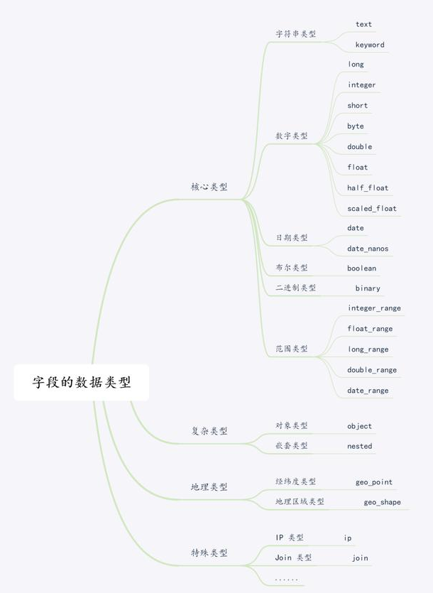

# 1、Mapping

## 1.1 Mapping的作用

ES中的Mapping 类似于数据库中的表结构定义 schema，它有以下几个作用：

- 定义索引中的字段的名称
- 定义字段的数据类型，比如字符串、数字、布尔等
- 定义字段的属性，比如设置某个字段为要不要被分词，要不要被索引等

在 ES 早期版本，一个索引下是可以有多个 Type ，从 7.0 开始，一个索引只有一个 Type，也就是说不需要在 Mapping 指定 type 信息。

一个简单的例子如下：

```json
{
    "mappings":{
        "type_name":{       					//type名称
            "dynamic": "strict",      //是否可以动态添加字段
            "properties":{						
                "name":{							//字段名
                    "type":"keyword"	//字段的数据类型
                },
                "message":{
                    "type":"text"
                },
                "age":{
                    "type":"integer"
                }
            }
        }
    }
}
```

mapping中**字段类型一旦设定后禁止直接修改**。因为Lucene实现的倒排索引生成后不允许修改，除非重建索引映射，然后做reindex操作。

## 1.2 Dynamic Mapping

Dynamic Mapping 机制使我们不需要手动定义 Mapping，ES 会自动根据文档信息来判断字段合适的类型，但是有时候也会推算的不对，比如地理位置信息有可能会判断为 Text，当类型如果设置不对时，会导致一些功能无法正常工作，比如 Range 查询。

ES 类型的自动识别是基于 JSON 的格式，如果输入的是 JSON 是字符串且格式为日期格式，ES 会自动设置成 Date 类型；当输入的字符串是数字的时候，ES 默认会当成字符串来处理，可以通过设置来转换成合适的类型；如果输入的是 Text 字段的时候，ES 会自动增加 keyword 子字段，还有一些自动识别如下表所示：

| JSON 类型 | Elasticsearch 类型                      |
| ------ | ---------------------------- |
| 字符串 | 匹配日期格式设置成 Date；设置数字设置为 float 或者 long，该选项默认关闭；设置为 Text, 并增加 keyword 子字  |
| 布尔值 | boolean                      |
| 浮点数 | float                        |
| 整数   | long                         |
| 对象   | Object                       |
| 数组   | 由第一个非空数值的类型所决定 |
| 空值   | 忽略                         |


```json
//写入文档
PUT mapping_test/_doc/1
{
  "firstName":"Lee",
  "lastName":"Crazy",
  "loginDate":"2020-08-26T21:08:48"
}

//查看Mapping 文件
GET mapping_test/_mapping
{
  "mapping_test" : {
    "mappings" : {
      "properties" : {
        "firstName" : {
          "type" : "text",
          "fields" : {
            "keyword" : {
              "type" : "keyword",
              "ignore_above" : 256
            }
          }
        },
        "lastName" : {
          "type" : "text",
          "fields" : {
            "keyword" : {
              "type" : "keyword",
              "ignore_above" : 256
            }
          }
        },
        "loginDate" : {
          "type" : "date"
        }
      }
    }
  }
}
```

```json
//dynamic mapping 推断字符的类型
PUT mapping_test/_doc/1
{
  "uid":"123",
  "isVip": false,
  "isAdmin":"true",
  "age": 18,
  "heigh" : 180
}

//返回结果
{
  "mapping_test" : {
    "mappings" : {
      "properties" : {
        "age" : {
          "type" : "long"
        },
        "heigh" : {
          "type" : "long"
        },
        "isAdmin" : {
          "type" : "text",
          "fields" : {
            "keyword" : {
              "type" : "keyword",
              "ignore_above" : 256
            }
          }
        },
        "isVip" : {
          "type" : "boolean"
        },
        "uid" : {
          "type" : "text",
          "fields" : {
            "keyword" : {
              "type" : "keyword",
              "ignore_above" : 256
            }
          }
        }
      }
    }
  }
}
```

Dynamic Mapping 机制由参数`dynamic`控制，的可选值有三个：

- true：允许自动将检测到的新字段加到映射中（默认的）
- false： 不允许自动新增字段，文档可以写入，但无法对字段进行搜索等操作，不会添加在映射中。
- strict：文档不能写入，写入会报错

## 1.3 字段控制参数

在字段层面也有很多可以设置的参数，下面只列举几个重要的，其余可以参考官网的说明。

### 1.3.1 index

控制当前字段是否被索引。默认为 true。如果设置成 false，该字段不可被搜索。

```json
{
  "mappings" : {
    "properties" : {
      "firstName" : {
        "type" : "text"
      },
      "lastName" : {
        "type" : "text"
      },
      "mobile" : {
        "type" : "text",
        "index": false
      }
    }
  }
}
```

### 1.3.2 Index Options

四种不同级别的 Index Options 配置，可以控制倒排索引记录的内容

- docs： 记录 doc id
- freqs： 记录 doc id 和 term frequencies
- positions： 记录 doc id /term frequencies /term position
- offsets： 记录doc id / term frequencies / term posistion / character offects

Text 类型默认记录 postions，其他默认为 docs。

记录内容越多，占用存储空间越大。

### 1.3.3 null_value

需要对 NULL 值实现搜索，**只有 Keyword 类型支持设定 Null_Value**。

```json
//设置Mapping
PUT users
{
  "mappings" : {
    "properties" : {
      "firstName" : {
        "type" : "text"
      },
      "lastName" : {
        "type" : "text"
      },
      "mobile" : {
        "type" : "keyword", //这个如果是text 无法设置为空
        "null_value": "NULL"
      }
    }
  }
}

//添加记录
PUT users/_doc/2
{
"firstName":"Li",
"lastName": "Sunke",
"mobile": null
}

//搜索空值
GET users/_search?q=mobile:NULL
"_source" : {
        "firstName" : "Li",
        "lastName" : "Sunke",
        "mobile" : null
      }
```

### 1.3.4 copy_to

`_all` 在ES 7 中已经被 `copy_to` 所替代。

copy_to 将字段的数值拷贝到目标字段，实现类似 _all 的作用，用于满足一些特定的搜索需求，类似于数据库 `title like "%a%" or title2 like "%a%"`。

```json
//设置Mapping
PUT users
{
"mappings": {
  "properties": {
    "firstName":{
      "type": "text",
      "copy_to": "fullName"
    },
    "lastName":{
      "type": "text",
      "copy_to": "fullName"
    }
  }
}
}

//添加记录
PUT users/_doc/1
{
"firstName":"Kobe",
"lastName": "Bryant"
}

//使用fullName查询
GET users/_search?q=fullName:(Kobe Bryant)

//_source中不会有fullName字段
{
"_index" : "users",
"_type" : "_doc",
"_id" : "1",
"_version" : 1,
"_seq_no" : 0,
"_primary_term" : 1,
"found" : true,
"_source" : {
  "firstName" : "Kobe",
  "lastName" : "Bryant"
}
}

```

# 2、数据类型

ES支持的数据类型可以做如下分类：




## 2.1 核心数据类型


### 2.1.1 字符串类型

#### 2.1.1.1 text

当一个字段需要用于全文搜索(会被分词)，比如产品名称、产品描述信息，就应该使用text类型。

text类型的字段不能用于排序, 也很少用于聚合。

```json
{
    "mappings":{
        "blog":{
            "properties":{
                "summary":{
                    "type":"text",
                    "index":"true"
                }
            }
        }
    }
}
```

#### 2.1.1.2 keyword

当一个字段需要按照精确值进行过滤、排序、聚合等操作时，就应该使用keyword类型。

keyword与text最大的区别就是**不会被分词**，而是当做一个整体来索引。

```json
{
    "mappings":{
        "blog":{
            "properties":{
                "tags":{
                    "type":"keyword",
                    "index":"true"
                }
            }
        }
    }
}
```

### 2.1.2 数字类型

| 类型         | 说明                                                         |
| ------------ | ------------------------------------------------------------ |
| byte         | 有符号的8位整数, 范围: [-128 ~ 127]                          |
| short        | 有符号的16位整数, 范围: [-32768 ~ 32767]                     |
| integer      | 有符号的32位整数, 范围: [−2^31 ~ 2^31-1]                     |
| long         | 有符号的64位整数, 范围: [−2^63 ~ 2^63-1]                     |
| float        | 32位单精度浮点数                                             |
| double       | 64位双精度浮点数                                             |
| half_float   | 16位半精度IEEE 754浮点类型                                   |
| scaled_float | 缩放类型的的浮点数, 比如price字段只需精确到分, 57.34缩放因子为100, 存储结果为5734 |

- 尽可能选择范围小的数据类型，字段的长度越短，索引和搜索的效率越高
- 优先考虑使用带缩放因子的浮点类型

```json
{
    "mappings": {
        "book": {
            "properties": {
                "name": {"type": "text"},
                "quantity": {"type": "integer"},  // integer类型
                "price": {
                    "type": "scaled_float",       // scaled_float类型
                    "scaling_factor": 100
                }
            }
        }
    }
}
```

### 2.1.3 日期类型

#### 2.1.3.1 date

JSON没有日期数据类型, 所以在ES中, 日期可以是:

- 包含格式化日期的字符串, "2020-08-26", 或"2020/08/26 12:00:00"
- 代表时间毫秒数的长整型数字
- 代表时间秒数的整数

```json
PUT my_index
{
  "mappings": {
    "_doc": {
      "properties": {
        "date": {
          "type": "date" 
        }
      }
    }
  }
}

PUT my_index/_doc/1
{ "date": "2015-01-01" } 

PUT my_index/_doc/2
{ "date": "2015-01-01T12:10:30Z" } 

PUT my_index/_doc/3
{ "date": 1420070400001 } 
```

同时ES的date类型允许我们规定格式：

```text
# 规定格式如下： || 表示或者
PUT my_index
{
  "mappings": {
    "_doc": {
      "properties": {
        "date": {
          "type":   "date",
          "format": "yyyy-MM-dd HH:mm:ss||yyyy-MM-dd||epoch_millis"
        }
      }
    }
  }
}
```

一旦我们规定了格式，如果新增数据不符合这个格式，ES将会报错。

#### 2.1.3.2 date_nanos

ES 7新增的时间类型，可精确到纳秒，用法类似date。

### 2.1.4 布尔类型

可以接受表示真、假的字符串或数字:

- 真值: true, "true", "on", "yes", "1"...
- 假值: false, "false", "off", "no", "0", ""(空字符串), 0.0, 0

### 2.1.5 二进制类型

二进制类型是Base64编码字符串的二进制值，不以默认的方式存储，且不能被搜索。

 有2个设置项:

- `doc_values`: 该字段是否需要存储到磁盘上，方便以后用来排序、聚合或脚本查询。接受`true`和`false`(默认)
- `store`: 该字段的值是否要和`_source`分开存储、检索，意思是除了`_source`中, 是否要单独再存储一份。接受`true`或`false`(默认).

使用示例:

```json
// 添加映射
PUT website
{
    "mappings": {
        "blog": {
            "properties": {
                "blob": {"type": "binary"}   // 二进制
            }
        }
    }
}

// 添加数据
PUT website/blog/1
{
    "title": "Some binary blog",
    "blob": "hED903KSrA084fRiD5JLgY=="
}
```

注意: Base64编码的二进制值不能嵌入换行符`\n`, 逗号(`0x2c`)等符号。

### 2.1.6 范围类型

range类型支持以下几种:

| 类型          | 范围                                           |
| ------------- | ---------------------------------------------- |
| integer_range | −2^31 ~ 2^31−1                                 |
| long_range    | −2^63 ~ 2^63−1                                 |
| float_range   | 32位单精度浮点型                               |
| double_range  | 64位双精度浮点型                               |
| date_range    | 64位整数, 毫秒计时                             |
| ip_range      | IP值的范围, 支持IPV4和IPV6, 或者这两种同时存在 |

添加映射：

```json
PUT company
{
    "mappings": {
        "department": {
            "properties": {
                "expected_number": {  // 预期员工数
                    "type": "integer_range"
                },
                "time_frame": {       // 发展时间线
                    "type": "date_range", 
                    "format": "yyyy-MM-dd HH:mm:ss"
                },
                "ip_whitelist": {     // ip白名单
                    "type": "ip_range"
                }
            }
        }
    }
}
```

添加数据：

```json
PUT company/department/1
{
    "expected_number" : {
        "gte" : 10,
        "lte" : 20
    },
    "time_frame" : { 
        "gte" : "2020-08-01 12:00:00", 
        "lte" : "2020-09-01 12:00:00"
    }, 
    "ip_whitelist": "192.168.0.0/16"
}
```

查询数据:

```json
GET company/department/_search
{
    "query": {
        "term": {
            "expected_number": {
                "value": 12
            }
        }
    }
}

GET company/department/_search
{
    "query": {
        "range": {
            "time_frame": {
                "gte": "2020-08-10 12:00:00",
                "lte": "2020-08-20 12:00:00",
                "relation": "within" 
            }
        }
    }
}
```

## 2.2 复杂数据类型

### 2.2.1 数组类型

在Elasticsearch中，数组不需要专用的字段数据类型。默认情况下，任何字段都可以包含零个或多个值。

**数组中所有的值必须是同一种数据类型, 不支持混合数据类型的数组**：

- 字符串数组: ["one", "two"]
- 整数数组: [1, 2]
- 由数组组成的数组: [1, [2, 3]], 等价于[1, 2, 3]
- 对象数组: [{"name": "Tom", "age": 20}, {"name": "Jerry", "age": 18}]

### 2.2.2 对象类型

JSON文档是分层的：文档可以包含内部对象，内部对象也可以包含内部对象。

添加示例:

```json
PUT employee/developer/1
{
    "name": "Winner",
    "address": {
        "region": "China",
        "location": {"province": "ZheJiang", "city": "HuangZhou"}
    }
}
```

存储方式:

```json
{
    "name":                       "Winner",
    "address.region":             "China",
    "address.location.province":  "ZheJiang", 
    "address.location.city":      "HuangZhou"
}
```

文档的映射结构类似为:

```json
PUT employee
{
    "mappings":{
        "developer":{
            "properties":{
                "name":{
                    "type":"text",
                    "index":"true"
                },
                "address":{
                    "properties":{
                        "region":{
                            "type":"keyword",
                            "index":"true"
                        },
                        "location":{
                            "properties":{
                                "province":{
                                    "type":"keyword",
                                    "index":"true"
                                },
                                "city":{
                                    "type":"keyword",
                                    "index":"true"
                                }
                            }
                        }
                    }
                }
            }
        }
    }
}
```

### 2.2.3 嵌套类型

嵌套类型是对象数据类型的一个特例，可以让array类型的对象被独立索引和搜索。

先来看下对象数据类型是怎么存储的。

添加数据:

```json
PUT game_of_thrones/role/1
{
    "group":"stark",
    "performer":[
        {
            "first":"John",
            "last":"Snow"
        },
        {
            "first":"Sansa",
            "last":"Stark"
        }
    ]
}
```

内部存储结构:

```json
{
    "group":"stark",
    "performer.first":[
        "john",
        "sansa"
    ],
    "performer.last":[
        "snow",
        "stark"
    ]
}
```

可以看出，`user.first`和`user.last`会被平铺为多值字段，这样一来，John和Snow之间的**关联性丢失**了，在查询时, 可能出现John Stark的结果。

嵌套数据类型可以解决关联性丢失的问题。嵌套对象实质是将每个对象分离出来，作为隐藏文档进行索引。

创建映射:

```json
PUT game_of_thrones
{
    "mappings":{
        "role":{
            "properties":{
                "performer":{
                    "type":"nested"
                }
            }
        }
    }
}
```

添加数据:

```json
PUT game_of_thrones/role/1
{
    "group":"stark",
    "performer":[
        {
            "first":"John",
            "last":"Snow"
        },
        {
            "first":"Sansa",
            "last":"Stark"
        }
    ]
}
```

检索数据:

```json
GET game_of_thrones/_search
{
    "query":{
        "nested":{
            "path":"performer",
            "query":{
                "bool":{
                    "must":[
                        {
                            "match":{
                                "performer.first":"John"
                            }
                        },
                        {
                            "match":{
                                "performer.last":"Snow"
                            }
                        }
                    ]
                }
            }
        }
    }
}
```

## 2.3 空间数据类型

### 2.3.1 地理点类型

地理点类型用于存储地理位置的经纬度对，可用于：

- 查找一定范围内的地理点;
- 通过地理位置或相对某个中心点的距离聚合文档;
- 将距离整合到文档的相关性评分中;
- 通过距离对文档进行排序.

添加映射:

```json
PUT employee
{
    "mappings": {
        "developer": {
            "properties": {
                "location": {"type": "geo_point"}
            }
        }
    }
}
```

存储地理位置:

```json
// 方式一: 纬度 + 经度键值对
PUT employee/developer/1
{
    "location": {
        "lat": 23.11, "lon": 113.33		// 纬度: latitude, 经度: longitude
    }
}

// 方式二: "纬度, 经度"的字符串参数
PUT employee/developer/2
{
  "location": "23.11, 113.33" 			// 纬度, 经度
}

// 方式三: ["经度, 纬度"] 数组地理点参数
PUT employee/developer/3
{
  "location": [ 113.33, 23.11 ] 		// 经度, 纬度
}
```

查询示例:

```json
GET employee/_search
{
    "query": { 
        "geo_bounding_box": { 
            "location": {
                "top_left": { "lat": 24, "lon": 113 },		// 地理盒子模型的上-左边
                "bottom_right": { "lat": 22, "lon": 114 }	// 地理盒子模型的下-右边
            }
        }
    }
}
```

除此之外，还用于多边形的`geo_shape`类型、用于笛卡尔点的`point`类型、用于笛卡尔几何的`shpe`类型，使用很少，这里省略。

## 2.4 专用数据类型

### 2.4.1 IP类型

IP类型的字段用于存储IPv4或IPv6的地址，本质上是一个长整型字段。

添加映射:

```json
PUT employee
{
    "mappings":{
        "customer":{
            "properties":{
                "ip_addr":{
                    "type":"ip"
                }
            }
        }
    }
}
```

添加数据:

```json
PUT employee/customer/1
{
    "ip_addr":"192.168.1.1"
}
```

查询数据:

```json
GET employee/customer/_search
{
    "query": {
        "term": { "ip_addr": "192.168.0.0/16" }
    }
}
```

### 2.4.2 计数数据类型

token_count类型用于统计字符串中的单词数量。

本质上是一个整数型字段，接受并分析字符串值，然后索引字符串中单词的个数。

添加映射:

```json
PUT employee
{
    "mappings":{
        "customer":{
            "properties":{
                "name":{
                    "type":"text",
                    "fields":{
                        "length":{
                            "type":"token_count",
                            "analyzer":"standard"
                        }
                    }
                }
            }
        }
    }
}
```

添加数据:

```json
PUT employee/customer/1
{ "name": "John Snow" }
PUT employee/customer/2
{ "name": "Tyrion Lannister" }
```

查询数据:

```json
GET employee/customer/_search
{
    "query":{
        "term":{
            "name.length":2
        }
    }
}
```

除此之外，还有十余种其他的专门数据类型，具体可以参考官方文档，此处不再一一列举。