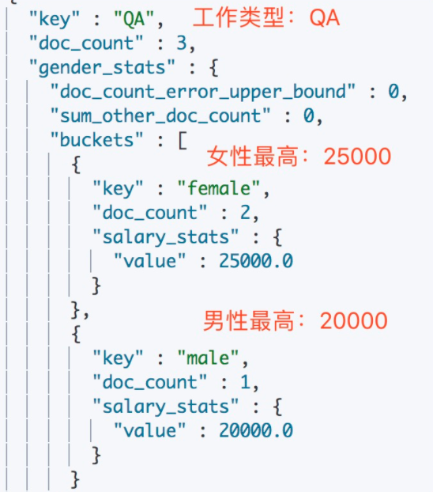
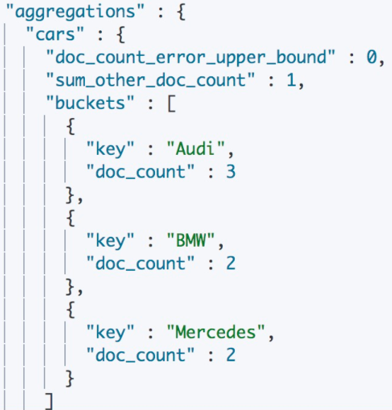
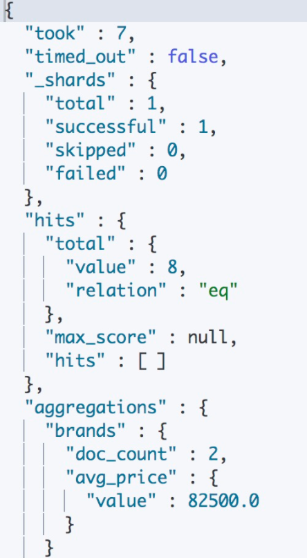
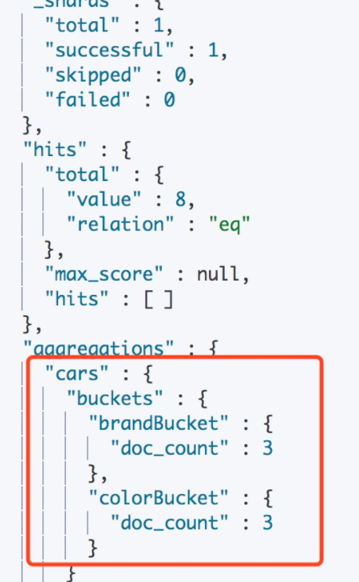
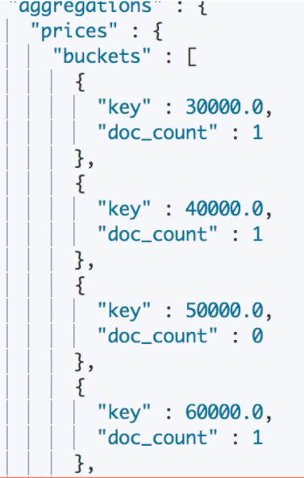
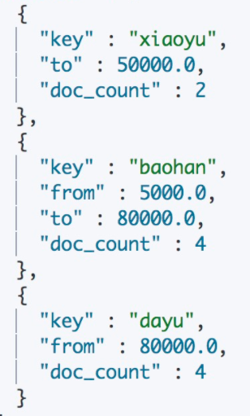

在数据库领域，借助SQL我们可以获取表中的最大值(Max)、最小值(Min)，还可以对数据进行分组(Group)。在ES中使用**聚合**（Aggregations）来实现类似的功能，而且比SQL更灵活、更强大。

ES 7中，将聚合分为四类：

- **指标聚合**（Metrics Aggregations）:   一些数学运算，可以对文档字段进行统计分析，如计算最大值、最小值、平均值等，类似于SQL中的`COUNT()` 、 `SUM()` 、 `MAX()` 等统计方法
- **桶聚合**（Bucket Aggregations）:     满足特定条件的文档分组，类似SQL中的`GROUP BY`
- **管道聚合**（Pipeline Aggregations）: 管道分析类型，基于上一级的聚合分析结果进行在分析，工作在其他聚合计算结果而不是文档集合的聚合
- **矩阵聚合**（Matrix Aggregations）:  操作多个字段并根据从请求的文档字段中提取的值生成矩阵结果

实际开发中，指标聚合和桶聚合用途很广泛，而管道聚合和矩阵聚合是带有实验性质的功能，很少使用。

# 1、指标聚合

按照输出结果的数量，指标聚合可以分为两类：

- **单值分析**，只输出一个分析结果：
  - **Min**：最小值
  - **Max**：最大值
  - **Avg**：平均值
  - **Sum**：累加值
  - **Cardinality**：不同数值的个数，相当于 SQL 中的 distinct
- **多值分析**，输出多个分析结果：
  - **Stats**：样的数据分析，可以一次性得到最大值、最小值、平均值、中值等数据
  - **Extended Stats**：是对 Stats 的扩展，包含了更多的统计数据，比如方差、标准差等
  - **Percentiles**：按从小到大累计每个值对应的文档数的占比，返回指定占比比例对应的值
  - **Percentile Ranks**：Percentiles是通过百分比求文档值，Percentile Ranks是通过文档值求百分比
  - **Top Hits**：一般用于分桶后获取桶内最匹配的顶部文档列表

计算最大值：

```json
{
    "aggs":{
        "max_price":{
            "max":{
                "field":"price"
            }
        }
    }
}
```

可以与query结合使用，比如先过滤，再求和：

```json
{
    "query":{
        "constant_score":{
            "filter":{
                "match":{
                    "type":"hat"
                }
            }
        }
    },
    "aggs":{
        "hat_prices":{
            "sum":{
                "field":"price"
            }
        }
    }
}
```

再来看一下Percentiles与Percentile Ranks的用法。假如有一批消费者数据，其中有一个字段记录了日均消费金额，现在想知道日均消费金额的分布占比情况：

```json
{
    "size":0,
    "aggs":{
        "money_stat":{
            "percentiles":{
                "field":"money"
            }
        }
    }
}
```

返回结果：

```json
{
    ...
   "aggregations": {
      "money_stat": {
         "values" : {
            "1.0": 5.0,
            "5.0": 25.0,
            "25.0": 165.0,
            "50.0": 445.0,
            "75.0": 725.0,
            "95.0": 945.0,
            "99.0": 985.0
         }
      }
   }
}
```

默认按照[ 1, 5, 25, 50, 75, 95, 99 ]来统计。

统计结果反映：1%的人消费金额在5元以内、5%的人消费金额在25元以内......95%的人消费金额在945元以内、99%的人消费金额在985元以内。

如果想知道日均消费金额在500以内以及600以内的人群占比是多少呢？可以使用Percentile Ranks来统计：

```json
{
    "size":0,
    "aggs":{
        "money_ranks":{
            "percentile_ranks":{
                "field":"money",
                "values":[
                    500,
                    600
                ]
            }
        }
    }
}
```

返回结果：

```json
{
    ...
   "aggregations": {
      "load_time_ranks": {
         "values" : {
            "500.0": 55.1,
            "600.0": 64.0
         }
      }
   }
}
```

统计结果反映：日均消费金额在500以内比为55.1%，日均消费金额在600以内的人群占比为64%。

结合桶聚合，还可以更复杂的统计，例如，根据工作类型分桶，然后按照性别分桶，计算每个桶中工资的最高的薪资：

```json
{
    "size":0,
    "aggs":{
        "Job_gender_stats":{
            "terms":{
                "field":"job.keyword"
            },
            "aggs":{
                "gender_stats":{
                    "terms":{
                        "field":"gender"
                    },
                    "aggs":{
                        "salary_stats":{
                            "max":{
                                "field":"salary"
                            }
                        }
                    }
                }
            }
        }
    }
}
```

返回结果：



# 2、桶聚合

准备一组汽车销售数据用于测试，包含汽车的价格、颜色、品牌、销售时间：

```json
POST /cars/_bulk
{ "index": {}}
{ "price" : 80000, "color" : "red", "brand" : "BMW", "sellTime" : "2014-01-28" }
{ "index": {}}
{ "price" : 85000, "color" : "green", "brand" : "BMW", "sellTime" : "2014-02-05" }
{ "index": {}}
{ "price" : 120000, "color" : "green", "brand" : "Mercedes", "sellTime" : "2014-03-18" }
{ "index": {}}
{ "price" : 105000, "color" : "blue", "brand" : "Mercedes", "sellTime" : "2014-04-02" }
{ "index": {}}
{ "price" : 72000, "color" : "green", "brand" : "Audi", "sellTime" : "2014-05-19" }
{ "index": {}}
{ "price" : 60000, "color" : "red", "brand" : "Audi", "sellTime" : "2014-06-05" }
{ "index": {}}
{ "price" : 40000, "color" : "red", "brand" : "Audi", "sellTime" : "2014-07-01" }
{ "index": {}}
{ "price" : 35000, "color" : "blue", "brand" : "Honda", "sellTime" : "2014-08-12" }
3、查看是否成功
```

## 2.1 Terms Aggregation

基于某个field，该 field 内的每一个唯一词元为一个桶，并计算每个桶内文档个数。默认返回顺序是按照文档个数多少排序。需要注意的是，生产环境中数据一般是分布在多个分片上，**当不返回所有 buckets 时（由size控制），文档个数可能不准确**。

按照汽车品牌聚合，按照数量排序，只返回前三名：

```json
{
    "aggs":{
        "genres":{
            "terms":{
                "field":"brand",
                "order":{
                    "_count":"asc"
                },
                "size":3
            }
        }
    }
}
```

返回结果：



## 2.2 Filter Aggregation

Terms Aggregation 的基础上进行了过滤，只对特定的值进行了聚合。

过滤获取品牌为BMW的桶，并求该桶平均值：

```json
{
    "aggs":{
        "brands":{
            "filter":{
                "term":{
                    "brand":"BMW"
                }
            },
            "aggs":{
                "avg_price":{
                    "avg":{
                        "field":"price"
                    }
                }
            }
        }
    }
}
```

返回结果：



如果想要指定多个过滤条件，可以使用Filters Aggreagation：

```json
{
    "size":0,
    "aggs":{
        "cars":{
            "filters":{
                "filters":{
                    "colorBucket":{
                        "match":{
                            "color":"red"
                        }
                    },
                    "brandBucket":{
                        "match":{
                            "brand":"Audi"
                        }
                    }
                }
            }
        }
    }
}
```

返回结果：



## 2.3 Histogram Aggreagtion

直方图聚合，与Terms聚合类似，都是数据分组，区别是Terms是按照Field的值分组，而Histogram可以按照指定的间隔对Field进行分组。

根据价格区间为10000分桶：

```json
{
    "aggs":{
        "prices":{
            "histogram":{
                "field":"price",
                "interval":10000
            }
        }
    }
}
```

返回结果：



## 2.4 Range Aggregation

范围聚合，根据用户传递的范围参数作为桶，进行相应的聚合。在同一个请求中，可以传递多组范围，每组范围作为一个桶。

根据价格区间分桶：

```json
{
    "aggs":{
        "price_ranges":{
            "range":{
                "field":"price",
                "ranges":[
                    {
                        "to":50000
                    },
                    {
                        "from":5000,
                        "to":80000
                    },
                    {
                        "from":80000
                    }
                ]
            }
        }
    }
}
```

返回结果：



## 2.5 Nested Aggregation

一个特殊的single bucket（单桶）聚合，可以聚合嵌套的文档
例如，假设我们有一个产品的索引，并且每个产品都包含一个分销商列表——每个产品都有自己的价格。映射可能是:

```json
{
    ...

    "product" : {
        "properties" : {
            "resellers" : { ＃1
                "type" : "nested",
                "properties" : {
                    "name" : { "type" : "text" },
                    "price" : { "type" : "double" }
                }
            }
        }
    }
}
```

> `resellers`是一个在`product`对象下保存嵌套文档的数组。

以下汇总将返回可以购买的最低价格产品：

```json
{
    "query" : {
        "match" : { "name" : "led tv" }
    },
    "aggs" : {
        "resellers" : {
            "nested" : {
                "path" : "resellers"
            },
            "aggs" : {
                "min_price" : { "min" : { "field" : "resellers.price" } }
            }
        }
    }
}
```

如上所述，嵌套聚合需要顶层文档中嵌套文档的路径。 然后可以在这些嵌套文档上定义任何类型的聚合。

响应结果：

```json
{
    "aggregations": {
        "resellers": {
            "min_price": {
                "value" : 350
            }
        }
    }
```
