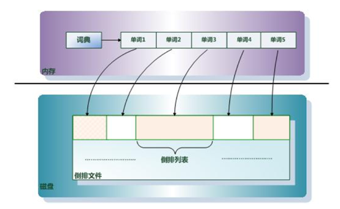
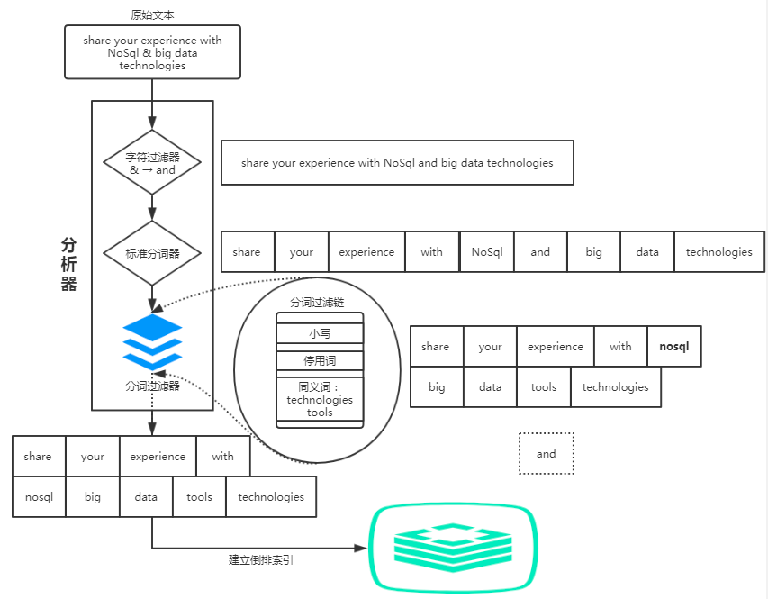
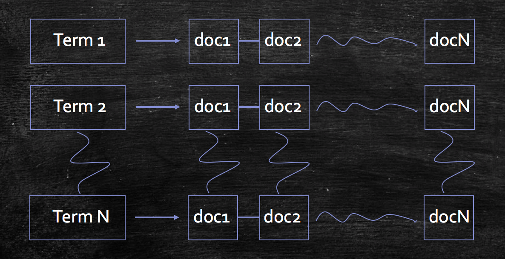
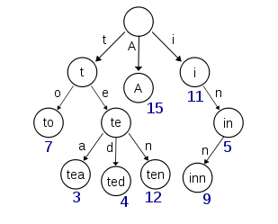
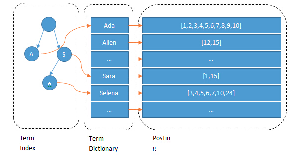
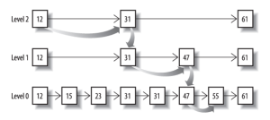

# 1、倒排索引

## 1.1 倒排索引是什么

索引，是为了加快信息查找过程，基于目标信息内容预先创建的一种储存结构。

例如：一本书没有目录理论上也是可读的，但是当你合上读到一半的内容，下次再翻开书本去查找的时候，就比较耗费时间了。如果增加几页目录，我们可以快速地了解书本的大体内容分布以及每一个章节页面位置的分布情况，这样我们查询内容的效率自然就会提高。书的目录，就是书本内容一种简单索引。

全文检索技术由来已久，绝大多数都基于倒排索引来做。**倒排索引**（Inverted Index），也叫反向索引，有反向索引必有正向索引。通俗地来讲，正向索引是通过key找value，反向索引则是通过value找key。

假设检索系统中只有一个商品——衣服A，基于该商品构建其倒排索引结构之后，会产生上图右表中的索引结构，这样用户可以通过搜“AAA”，“蓝色”，“M码”，“猴子”，均可找到该商品

## 1.2 倒排索引的组成

倒排索引主要由**单词词典**（Term Dictionary）和**倒排列表**（Posting List）及**倒排文件**(Inverted File)组成。
他们三者的关系如下图：

**单词词典（Term Dictionary）：**搜索引擎的通常索引单位是单词，单词词典是由文档集合中出现过的所有单词构成的字符串集合，单词词典内每条索引项记载单词本身的一些信息以及指向“倒排列表”的指针。

**倒排列表(Posting List)：**倒排列表记载了出现过某个单词的所有文档的文档列表及单词在该文档中出现的位置信息及频率（作关联性算分），每条记录称为一个倒排项(Posting)。根据倒排列表，即可获知哪些文档包含某个单词。

**倒排文件(Inverted File)：**所有单词的倒排列表往往顺序地存储在磁盘的某个文件里，这个文件即被称之为倒排文件，倒排文件是存储倒排索引的物理文件。

## 1.3 倒排索引的构建

构建倒排索引是搜索引擎里面至关重要的一个步骤。从技术层面去分析，对于构造一个倒排索引，主要分为两部分：

- 词项构造
- 倒排记录表的构建

### 1.3.1 term词项构造

词项构造是在构建索引过程中必不可或缺的一个步骤，词项构造效果的好坏往往会直接影响到用户的搜索体验，以及搜索结果的召回。该过程主要是利用分词系统将文档中的各项属性的文本信息拆分成一些表意较强且重要的词汇，便于用户查找。

在词项构造的过程中，利用分词系统对文本进行处理时往往涉及到很多方面的问题，而且对于不同语种，会有不同的处理机制。下面主要介绍在处理文本时涉及到的几个问题：

#### 1.3.1.1 文本词条化

一段文本信息，它本身是一个由语言组成的字符串系列，本项技术点的主要任务是将一段连续的文本序列信息拆分成多个子序列。它与语言本身相关，面对不同的语言，处理文本的方式往往会不一样。

对于中文，由于其语言多歧义且表意紧凑的特性，在实际应用中，一般需要借助NLP的相关技术对内容进行特征抽取，甚至人工标注等，生成对应的词典，随后再基于词典利用分词器进行分词，才能看到较好的文本词条效果。

而对于英文，普遍的英文句子，段落内容，它会以空格符作为单词之间的分隔符，所以一般情况下，以空格符对英文内容进行拆分，已经可以取得比较好的效果，不过英文中也会存在一些特殊模式，如带上撇号的格式——“Teacher’s office”，连字符格式——“English-speaking”,也需要进行对应的处理，把单词提取出来。

#### 1.3.1.2 停用词过滤

停用词是指在文档列表中出现的频数较高且价值不大的词。以英文为例，在英文文档中出现次数较多的停用词如：”is”、”the”、”I”、“and”、”me”等等；这一类词语在往往出现在所有文档中，若以此类词语为term进行索引构建，则会产生多个全量文档索引列表。

停用词过滤的使用往往依赖于实际使用场景，关键字查询使用得较为频繁的场景如某一个电商品牌的垂直型搜索引擎，一个合适的停用词表显得尤为重要；而对于Web搜索引擎如百度、Google等，该类型的搜索引擎面向的查询场景较多，通用性较强，往往不需要停用词过滤。

#### 1.3.1.3 词条归一化

基于上述两点，将文档内容转换成一个或多个term后，在查询时，最理想的情况是用户输入的关键字刚好与term完全匹配，实际上，很多时候用户输入的query与词条之间往往不会完全匹配，而用户们还是希望query能与词条进行匹配，比如用户在查询“color”时，用户肯定也希望能看到关于“colour”的返回结果。

词条归一化的任务就是将一些看起来不完全一致的词条划分为一个等价类，比如英式单词colour和美式单词color归为一类、Air-conditioner和airconditioner归为一类等等。这样，用户在查询时，只要对等价类中的任意单词进行搜索，都会返回包含等价类中的任意一个单词的文档。

#### 1.3.1.4 词干提取

这是词条规范化的两种重要方式，用于扩展检索范围。词干提取的主要思想是“缩减”，将词条转化为词干，如：将“beaches”处理成“beach”,将“bananas”处理成“banana”等；词形还原的主要思想是“转换”，如：将“doing”、“done”、“did”转化成原型“do”，将“given”、“gave”转化成原型“give”等；词干提取的实现方法一般是基于规则对词条后缀进行缩减，至于词形还原，其实现方法需要词典来进行词形变化的映射；基于在此结合词条归一化技术，对扩展检索范围会产生一定的正向作用。

### 1.3.2 倒排记录表的构建

倒排记录表的构建过程面向的是海量的文档数据集合，在大小规模上它比词项集合要大得多，无法完全存放在内存当中，需要写入磁盘。因此，**在构建倒排记录表时我们有必要为内存的使用做考虑**。

在无法全内存的情况下，倒排记录表的主要构建思想是“分割”，亦即基于一定的处理逻辑对全量文档集合进行等份的批量处理。

### 1.3.3 实例

搜索引擎的关键步骤就是建立倒排索引，倒排索引一般表示为一个关键词，然后是它的频度（出现的次数），位置（出现在哪一篇文章或网页中，及有关的日期，作者等信息），它相当于为互联网上几千亿页网页做了一个索引，好比一本书的目录、标签一般。读者想看哪一个主题相关的章节，直接根据目录即可找到相关的页面。不必再从书的第一页到最后一页，一页一页的查找。

假设现在有两篇文章：

文章1的内容为：`Tom lives in Guangzhou,I live in Guangzhou too.` 　　

文章2的内容为：`He once lived in Shanghai.`

经过分词以后，我们就可以建立“关键词”对“拥有该关键词的所有文章编号”的倒排索引：

通常仅知道关键词在哪些文章中出现还不够，我们还需要知道关键词在文章中出现次数和出现的位置，通常有两种位置：

- 字符位置，即记录该词是文章中第几个字符（优点是关键词亮显时定位快）

- 关键词位置，即记录该词是文章中第几个关键词（优点是节约索引空间、词组（phase）查询快）

加上“出现频率”和“出现位置”信息后，我们的索引结构变为： 

以live 这行为例我们说明一下该结构：live在文章1中出现了2次，文章2中出现了一次，它的出现位置为“2,5,2”这表示什么呢？我们需要结合文章号和出现频率来分析，文章1中出现了2次，那么“2,5”就表示live在文章1中出现的两个位置，文章2中出现了一次，剩下的“2”就表示live是文章2中第 2个关键字。 　　

以上就是lucene索引结构中最核心的部分。我们注意到关键字是按字符顺序排列的（lucene没有使用B树结构），因此lucene可以用二元搜索算法快速定位关键词。

# 2、快速检索的实现原理

Elasticsearch 是通过 Lucene 的倒排索引技术实现比关系型数据库更快的过滤。特别是它对多条件的过滤支持非常好，比如年龄在 18 和 30 之间，性别为女性这样的组合查询。倒排索引很多地方都有介绍，但是其比关系型数据库的 b-tree 索引快在哪里？到底为什么快呢？

笼统的来说，b-tree 索引是为写入优化的索引结构。当我们不需要支持快速的更新的时候，可以用预先排序等方式换取更小的存储空间，更快的检索速度等好处，其代价就是更新慢。

## 2.1 term index

假设我们有很多个 term，比如：

> Carla,Sara,Elin,Ada,Patty,Kate,Selena

如果按照这样的顺序排列，找出某个特定的 term 一定很慢，因为 term 没有排序，需要全部过滤一遍才能找出特定的 term。排序之后就变成了：

> Ada,Carla,Elin,Kate,Patty,Sara,Selena

这样我们可以用二分查找的方式，比全遍历更快地找出目标的 term。这个就是 term dictionary。有了 term dictionary 之后，可以用 logN 次磁盘查找得到目标。但是磁盘的随机读操作仍然是非常昂贵的（一次 random access 大概需要 10ms 的时间）。所以尽量少的读磁盘，有必要把一些数据缓存到内存里。但是整个 term dictionary 本身又太大了，无法完整地放到内存里。于是就有了 term index。term index 有点像一本字典的大的章节表。比如：

> A 开头的 term ……………. Xxx 页
>
> C 开头的 term ……………. Xxx 页
>
> E 开头的 term ……………. Xxx 页

如果所有的 term 都是英文字符的话，可能这个 term index 就真的是 26 个英文字符表构成的了。但是实际的情况是，term 未必都是英文字符，term 可以是任意的 byte 数组。而且 26 个英文字符也未必是每一个字符都有均等的 term，比如 x 字符开头的 term 可能一个都没有，而 s 开头的 term 又特别多。实际的 term index 是一棵 trie 树：

例子是一个包含 “A”, “to”, “tea”, “ted”, “ten”, “i”, “in”, 和 “inn” 的 trie 树。这棵树不会包含所有的 term，它包含的是 term 的一些前缀。通过 term index 可以快速地定位到 term dictionary 的某个 offset，然后从这个位置再往后顺序查找。再加上一些压缩技术（如FST） term index 的尺寸可以只有所有 term 的尺寸的几十分之一，使得用内存缓存整个 term index 变成可能。整体上来说就是这样的效果。

现在我们可以回答“为什么 Elasticsearch/Lucene 检索可以比 mysql 快了。Mysql 只有 term dictionary 这一层，是以 b-tree 排序的方式存储在磁盘上的。检索一个 term 需要若干次的 random access 的磁盘操作。而 Lucene 在 term dictionary 的基础上添加了 term index 来加速检索，term index 以树的形式缓存在内存中。从 term index 查到对应的 term dictionary 的 block 位置之后，再去磁盘上找 term，大大减少了磁盘的 random access 次数。

额外值得一提的两点是：

- term index 在内存中是以 **FST**（Finite State Transducers）的形式保存的，其特点是非常节省内存。
- Term dictionary 在磁盘上是以分 block 的方式保存的，一个 block 内部利用公共前缀压缩，比如都是 Ab 开头的单词就可以把 Ab 省去。这样 term dictionary 可以比 b-tree 更节约磁盘空间。

## 2.2 联合索引查询

对于“年龄为 18 岁，并且性别为女性”这样的组合查询，就需要对多个field进行过滤。

查询过滤条件 age=18 的过程就是先从 term index 找到 18 在 term dictionary 的大概位置，然后再从 term dictionary 里精确地找到 18 这个 term，然后得到一个 posting list 或者一个指向 posting list 位置的指针。

然后再查询 gender= 女 的过程也是类似的。

最后得出 age=18 AND gender= 女 就是把两个 posting list 做一个“与”的合并。

这个理论上的“与”合并的操作可不容易。对于 mysql 来说，如果你给 age 和 gender 两个字段都建立了索引，查询的时候只会选择其中最 selective 的来用，然后另外一个条件是在遍历行的过程中在内存中计算之后过滤掉。那么要如何才能联合使用两个索引呢？有两种办法：

- 使用 skip list 数据结构。同时遍历 gender 和 age 的 posting list，互相 skip；
- 使用 bitset 数据结构，对 gender 和 age 两个 filter 分别求出 bitset，对两个 bitset 做 AND 操作。

Elasticsearch 支持以上两种的联合索引方式：

- 如果查询的 filter 缓存到了内存中（以 bitset 的形式），那么合并就是两个 bitset 的 AND
- 如果查询的 filter 没有缓存，那么就用 skip list 的方式去遍历两个 on disk 的 posting list

先看看跳表的数据结构：

将一个有序链表level-0，挑出其中几个元素到level-1及level-2，每个level越往上，选出来的指针元素越少，查找时依次从高level往低查找，比如55，先找到level-2的31，再找到level-1的47，最后找到55，一共3次查找，查找效率和2叉树的效率相当。

上例中跳表只有三层，看起来节省不了多少性能，但是当面对PB级数据的时候，链表的分级将无限扩大，我们在查询结果时所"跳" 的跨度也会非常大，原先需要查找一百万次的结果，可能仅仅三次就查找到了，这个时候就会显得非常高效。

从Skip List的查找原理可以看出，**它的高效其实是牺牲了一定的空间冗余换来的**，所以在有些情况下还是使用bitset更加的直观，比如下面这种数据结构：

| 111  | 222  | 333  | 444  |      |      |      |      |
| ---- | ---- | ---- | ---- | ---- | ---- | ---- | ---- |
| 111  | 222  | 333  | 444  | 555  | 666  | 777  |      |
| 111  | 222  | 333  | 444  | 555  | 666  | 777  | 888  |

如果使用跳表，查找第一行数据在另外两行中查找看是否存在，为了得到最后得到交集的结果，操作就要繁琐的多。

如果使用bitset直接进行压缩，按位与，得到的结果就是最后的交集。
