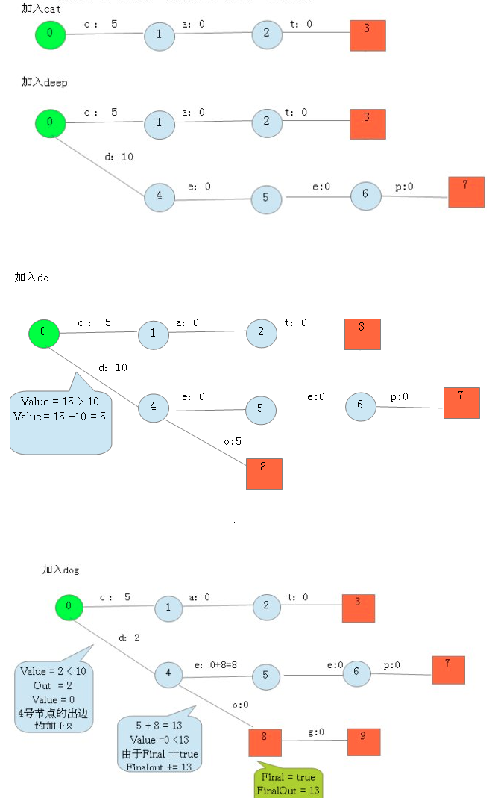
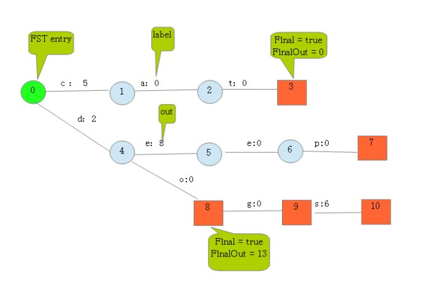
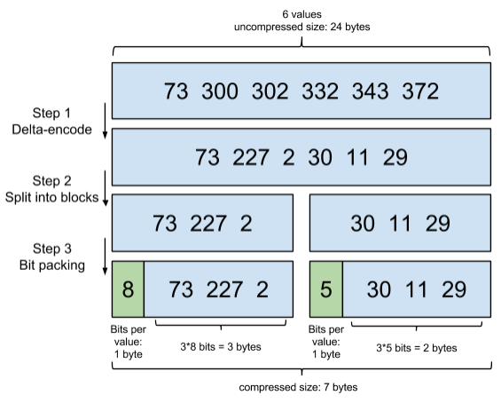
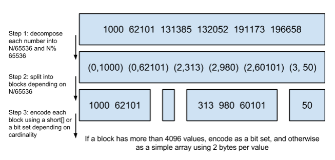
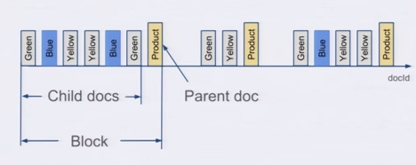

# 1、term index的压缩

Lucene使用FST算法以字节的方式来存储所有的Term，重复利用Term Index的前缀和后缀，使Term Index小到可以放进内存，减少存储空间，不过相对的也会占用更多的cpu资源。FST在Lucene4.0以后的版本中用于快速定位所查单词在字典中的位置。

Finite StateTransducers，简称 FST，通常中文译作**有穷状态转换器**，在语音识别和自然语言搜索、处理等方向被广泛应用。

FST的功能类似于字典，可以表示成FST<Key, Value>的形式。其最大的特点是，可以用`O(length(key))`的复杂度来找到key对应的value，也就是说查找复杂度仅取决于所查找的key长度。

假设我们现在要将以下term index映射到term dictionary的block序号：

>  “cat” —— > 5
>
> “deep” —— > 10
>
> “do” —— > 15
>
> “dog” —— > 2
>
> “dogs” —— > 8

最简单的做法就是定义个Map<string, integer="">，大家找到自己的位置对应入座就好了，但从内存占用少的角度想想，有没有更优的办法呢？答案就是FST。

对于经典FST算法来说，要求**Key必须按字典序从小到大加入到FST**中。上面的例子中key已经排好序了。

按照以下步骤建立FST：

> 1.建一个空节点，表示FST的入口，所有的Key都从这个入口开始。
>
> 2.如果还有未处理的Key，则枚举Key的每一个label。处理流程如下：
>
> ​	2.1如果当前节点存在含此label的边，则
>
> ​		2.1.1如果Value包含该边的out值，则
>
> ​				Value = Value – out
>
> ​		2.1.2否则
>
> ​                  令temp=out–Value；
>
> ​                  out =Value，并使下一个节点的所有边out都加上temp。
>
> ​                  如果下一节点是Final节点 则FinalOut += temp
>
> ​		2.1.3进入下一个节点
>
> ​	2.2否则： 新建一个节点另其out = Value， Value = 0。



最后加入`dogs`，得到最后的结果：



从上图可以看出，每条边有两条属性，一个表示label（key的元素），另一个表示Value(out)。注意Value不一定是数字，还可一是另一个字符串，但要求Value必须满足叠加性，如这里的正整数2 + 8 = 10。字符串的叠加行为： aa + b = aab。

建完这个图之后，我们就可以很容易的查找出任意一个key的Value了。例如：查找dog，我们查找的路径为：0 → 4 → 8 → 9。 其权值和为： 2 + 0 + 0 + 0 = 2。其中最后一个零表示 node[9].finalOut = 0。所以“dog”的Value为2。

# 2、posting list的压缩

## 2.1 **Frame Of Reference**

Lucene除了上面说到用FST压缩term index外，对posting list也会进行压缩。 

有人可能会有疑问：“posting list不是已经只存储文档id了吗？还需要压缩吗？”。设想这样一种情况，Lucene需要对一千万个同学的性别进行索引，而世界上只有男/女这样两个性别，每个posting list都会有数百万个文档id，这里显然有很大的压缩空间与价值，对于减少索引尺寸有非常重要的意义。

Lucene使用**Frame Of Reference**编码来实现对posting list压缩，其思路简单来说就是：**增量编码压缩，将大数变小数，按字节存储**。

示意图如下：



- step1：在对posting list进行压缩时进行了正序排序。
- step2：通过增量将73后面的大数变成小数存储增量值。
- step3: 转换成二进制，取占最大位的数，227占8位，前三个占八位，30占五位，后三个数每个占五位。

## 2.2 Roaring bitmaps

除此之外，Lucene在执行filter操作还会使用一种叫做**Roaring bitmaps**的数据结构来存储文档ID，同样可以达到压缩存储空间的目的。

说到Roaring bitmaps，就必须先从bitmap说起。bitmap是一种很直观的数据结构，假设有某个posting list：

> [1,3,4,7,10]

对应的bitmap就是：

> [1,0,1,1,0,0,1,0,0,1]

非常直观，用0/1表示某个值是否存在，比如10这个值就对应第10位，对应的bit值是1，这样用一个字节就可以代表8个文档id，旧版本(5.0之前)的Lucene就是用这样的方式来压缩的，但这样的压缩方式仍然不够高效，如果有1亿个文档，那么需要12.5MB的存储空间，这仅仅是对应一个索引字段(我们往往会有很多个索引字段)。于是有人想出了Roaring bitmaps这样更高效的数据结构。Roaring bitmaps压缩的原理可以理解为，与其保存100个0，占用100个bit，还不如保存0一次，然后声明这个0有100个。

Bitmap的缺点是存储空间随着文档个数线性增长，Roaring bitmaps需要打破这个魔咒就一定要用到某些指数特性：

将posting list按照65535为界限分块，比如第一块所包含的文档id范围在0~65535之间，第二块的id范围65536~131071，以此类推。再用<商，余数>的组合表示每一组id，这样每组里的id范围都在0~65535内了，剩下的就好办了，既然每组id不会变得无限大，那么我们就可以通过最有效的方式对这里的id存储。



- step1：从小到大进行排序。
- step2：将大数除以65536，用除得的结果和余数来表示这个大数。
- step3:：以65535为界进行分块。

为什么是以65535为界限呢？

程序员的世界里除了1024外，65535也是一个经典值，因为它=2^16-1，正好是用2个字节能表示的最大数，一个short的存储单位，注意到上图里的最后一行“If a block has more than 4096 values, encode as a bit set, and otherwise as a simple array using 2 bytes per value”，如果是大块，用节省点用bitset存，小块就豪爽点，2个字节我也不计较了，用一个short[]存着方便。

那为什么用4096来区分大块还是小块呢？

都说程序员的世界是二进制的，4096*2bytes ＝ 8192bytes < 1KB, 磁盘一次寻道可以顺序把一个小块的内容都读出来，再大一位就超过1KB了，需要两次读。

# 3、文档数量的压缩

一种常见的压缩存储时间序列的方式是把多个数据点合并成一行。Opentsdb支持海量数据的一个绝招就是定期把很多行数据合并成一行，这个过程叫compaction。类似的vivdcortext使用mysql存储的时候，也把一分钟的很多数据点合并存储到mysql的一行里以减少行数。

这个过程可以示例如下：

| 12:05:00 | 10   |
| -------- | ---- |
| 12:05:01 | 15   |
| 12:05:02 | 14   |
| 12:05:03 | 16   |

合并之后就变成了：

| 12:05 | 10   | 15   | 14   | 16   |
| ----- | ---- | ---- | ---- | ---- |
|       |      |      |      |      |

可以看到，行变成了列了。每一列可以代表这一分钟内一秒的数据。

Elasticsearch有一个功能可以实现类似的优化效果，那就是Nested Document。我们可以把一段时间的很多个数据点打包存储到一个父文档里，变成其嵌套的子文档。示例如下：

```json
{timestamp:12:05:01, idc:sz, value1:10,value2:11}
{timestamp:12:05:02, idc:sz, value1:9,value2:9}
{timestamp:12:05:02, idc:sz, value1:18,value:17}
```

可以打包成：

```json
{
max_timestamp:12:05:02, min_timestamp: 1205:01, idc:sz,
records: 
	[
    {timestamp:12:05:01, value1:10,value2:11}
    {timestamp:12:05:02, value1:9,value2:9}
    {timestamp:12:05:02, value1:18,value:17}
	]
}
```

这样可以把数据点公共的维度字段上移到父文档里，而不用在每个子文档里重复存储，从而减少索引的尺寸。



在存储的时候，无论父文档还是子文档，对于 Lucene 来说都是文档，都会有文档 Id。但是对于嵌套文档来说，可以保存起子文档和父文档的文档 id 是连续的，而且父文档总是最后一个。有这样一个排序性作为保障，那么有一个所有父文档的 posting list 就可以跟踪所有的父子关系。也可以很容易地在父子文档 id 之间做转换。把父子关系也理解为一个 filter，那么查询时检索的时候不过是又 AND 了另外一个 filter 而已。前面我们已经看到了 Elasticsearch 可以非常高效地处理多 filter 的情况，充分利用底层的索引。

使用了嵌套文档之后，对于 term 的 posting list 只需要保存父文档的 doc id 就可以了，可以比保存所有的数据点的 doc id 要少很多。如果我们可以在一个父文档里塞入 50 个嵌套文档，那么 posting list 可以变成之前的 1/50。