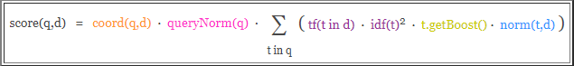
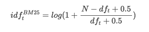
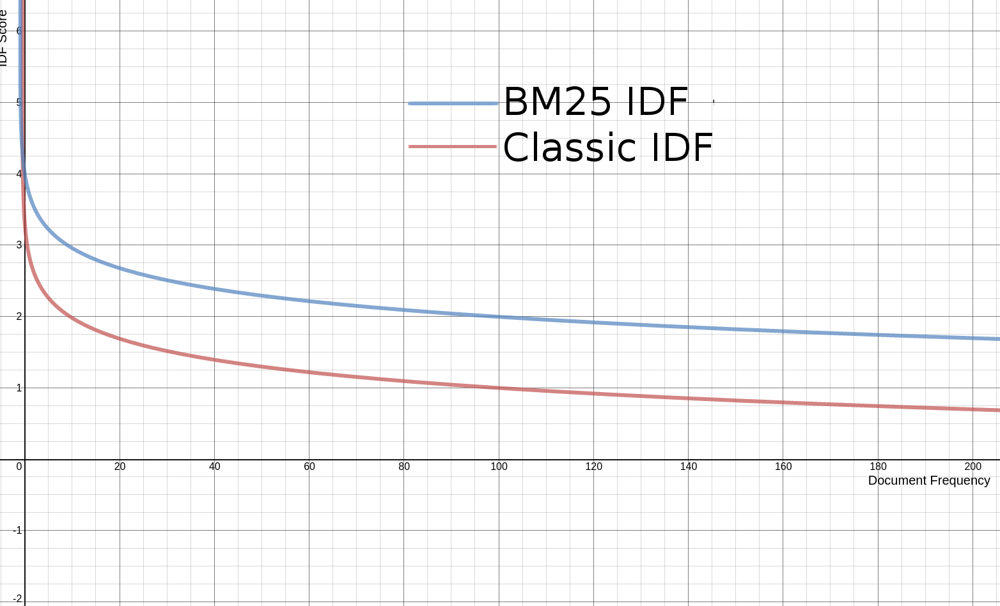
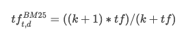
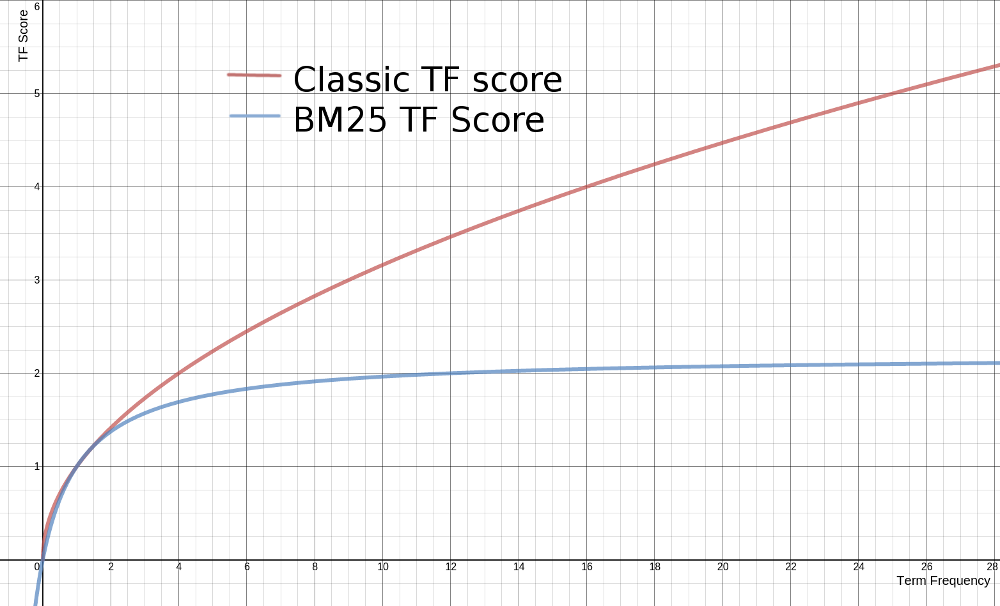
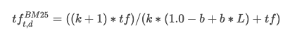
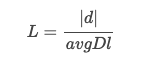

# 1、评分模型

将查询作为输入，将每一个因素最后通过公式综合起来，返回该文档的最终得分。这个综合考量的过程，就是将相关的文档被优先返回的考量过程。

Elasticsearch是基于Lucene的，所以它的评分机制也是基于Lucene的。在Lucene中把这种相关性称为**得分**（score），确定文档和查询有多大相关性的过程被称为**打分**（scoring）。

ES最常用的评分模型是 `TF/IDF`和`BM25`，**TF-IDF属于向量空间模型，而BM25属于概率模型**，但是他们的评分公式差别并不大，都使用IDF方法和TF方法的某种乘积来定义单个词项的权重，然后把和查询匹配的词项的权重相加作为整篇文档的分数。

在ES 5.0版本之前使用了TF/IDF算法实现，而在5.0之后默认使用BM25方法实现。

## 1.1 TF/IDF模型

- **TF**：TF(Term Frequency)，即**词频**，表示词条在文本中出现的频率。考虑一篇文档得分的首要方式，是查看一个词条在**当前文档**（注意IDF统计的范围是所有文档）中出现的次数，比如某篇文章围绕ES的打分展开的，那么文章中肯定会多次出现相关字眼，当查询时，我们认为该篇文档更符合，所以这篇文档的得分会更高。TF的值通常会被归一化，一般是词频除以文章总词数，以防止它偏向长的文件（同一个词语在长文件里可能会比短文件有更高的词频，而不管该词语重要与否）。
- **IDF**：IDF(Inverse Document Frequency)，即**逆文档频率**，反应了一个词在**所有文档**中出现的频率，如果一个词在很多的文本中出现，那么它的IDF值应该低。而反过来如果一个词在比较少的文本中出现，那么它的IDF值应该高。

TF/IDF算法简单来说就是：一个词语在某一篇文档中出现次数越多，同时在所有文档中出现次数越少，那么该文档越能与其它文章区分开来，评分就会越高。

Lucene中的评分公式如下：



- `coord(q,d)`：基于文档中包含查询关键词个数计算出来的调整因子。一般而言，如果一个文档中相比其它的文档出现了更多的查询关键词，那么其值越大
- `queryNorm(q)`：基于查询语句的归一化因子。其值为查询语句中每一个查询词权重的平方和。这个因子不影响文档的排名，只是为了使得比较不同查询语句的得分变得可行。
- `tf(t in d)`：即词频，term t 在当前算分的文档d中出现的次数。对一个给定的term，那些出现此term 的次数越多的文档将获得越高的分数。
- `idf(t)`：即逆文档词频，越不常出现的term 将为最后的总分贡献更多的分数。
- `t.getBoost()` ：在索引时给某个文档设置的权重值。
- `norm(t,d)`：长度归一化因子。其值由给定域中Term的个数决定(在索引文档的时候已经计算出来了，并且存储到了索引中)。域越的文本越长，因子的权重越低。这表明Lucene打分公式偏向于域包含Term少的文档。

## 1.2 BM25模型

BM25全称`Best Match 25`，其中“25”是指现在BM25中的计算公式是第25次迭代优化。该算法是几位大牛在1994年TREC-3（Third Text REtrieval Conference）会议上提出的，它将文本相似度问题转化为概率模型，可以看做是TF-IDF的改良版，我们看下它是如何进行改良的。

### 1.2.1 对IDF的改良

BM25中的IDF公式为：



原版BM25的log中是没有加1的，Lucene为了防止产生负值，做了一点小优化。虽然对公式进行了更改，但其实和原来的公式没有实质性的差异，下面是新旧函数曲线对比：




### 1.2.2 对TF的改良

BM25中TF的公式为：



其中`tf`是传统的词频值。先来看下改良前后的函数曲线对比（下图中k=1.2）：



可以看到，传统的tf计算公式中，词频越高，tf值就越大，没有上限。但BM中的tf，随着词频的增长，tf值会无限逼近`(k+1)`，相当于是有上限的。这就是二者的区别。一般 `k`取 1.2，Lucene中也使用1.2作为 k 的默认值。

在传统的计算公式中，还有一个`norm`。BM25将这个因素加到了TF的计算公式中，结合了`norm`因素的BM25中的TF计算公式为：



和之前相比，就是给分母上面的 `k` 加了一个乘数 `(1.0−b+b∗L)(1.0−b+b∗L)`。 其中的 `L` 的计算公式为：



其中，`|d|`是当前文档的长度，`avgDl` 是语料库中所有文档的平均长度。

`b` 是一个常数，用来控制 `L` 对最总评分影响的大小，一般取0~1之间的数（取0则代表完全忽略 `L` ）。Lucene中 `b` 的默认值为 0.75。

通过这些细节上的改良，BM25在很多实际场景中的表现都优于传统的TF-IDF，所以从Lucene 6.0.0版本开始，上位成为默认的相似度评分算法。

### 1.2.3 配置

```json
{
    "settings":{
        "index":{
            "analysis":{
                "analyzer":"ik_smart"
            }
        },
        "similarity":{
            "my_custom_similarity":{
                "type":"BM25",
                "k1":1.2,
                "b":0.75,
                "discount_overlaps":false
            }
        }
    },
    "mappings":{
        "doc":{
            "properties":{
                "title":{
                    "type":"text",
                    "similarity":"my_custom_similarity"
                }
            }
        }
    }
}
```

上例是通过`similarity`属性来指定打分模型，用到了以下三个参数：

- `k1`：控制对于得分而言词频（TF）的重要性，默认为1.2。
- `b`：是介于0 ~ 1之间的数值，控制文档篇幅对于得分的影响程度，默认为0.75。
- `discount_overlaps`：在某个字段中，多少个分词出现在同一位置，是否应该影响长度的标准化，默认值是true。

如果我们要使用某种特定的打分模型，并且希望应用到全局，那么就在`elasticsearch.yml`配置文件中加入：

`index.similarity.default.type: BM25`

# 2、评分中的boosting

通过boosting可以人为控制某个字段的在评分过程中的比重，有两种类型：

- 索引期间的boosting
- 查询期间的boosting

通过在mapping中设置`boost`参数，可以在索引期间改变字段的评分权重：

```json
{
    "mappings":{
        "doc":{
            "properties":{
                "name":{
                    "boost":2.0,
                    "type":"text"
                },
                "age":{
                    "type":"long"
                }
            }
        }
    }
}
```

需要注意的是：**在索引期间修改的文档boosting是存储在索引中的，要想修改boosting必须重新索引该篇文档**。

一旦映射建立完成，那么所有name字段都会自动拥有一个boost值，并且是以降低精度的数值存储在Lucene内部的索引结构中。只有一个字节用于存储浮点型数值（存不下就损失精度了），计算文档的最终得分时可能会损失精度。

另外，boost是应用与词条的。因此，再被boost的字段中如果匹配上了多个词条，就意味着计算多次的boost，这将会进一步增加字段的权重，可能会影响最终的文档得分。

查询期间的boosting可以避免上述问题。

几乎所有的查询类型都支持boost，例如：

```json
{
  "query": {
    "bool": {
      "should": [
        {
          "match": {
            "title":{
              "query": "elasticserach rocks",
              "boost": 2.5
            }
          }
        },
        {
          "match": {
            "content": "elasticserach rocks"
          }
        }
      ]
    }
  }
}
```

就对于最终得分而言，加了boost的title查询更有影响力。也只有在bool查询中，boost更有意义。

boost也可以用于multi_match查询。

```json
{
    "query":{
        "multi_match":{
            "query":"elasticserach rocks",
            "fields":[
                "title",
                "content"
            ],
            "boost":2.5
        }
    }
}
```

除此之外，我们还可以使用特殊的语法，只为特定的字段指定一个boost。通过在字段名称后添加一个`^`符号和boost的值。告诉ES只需对那个字段进行boost：

```json
{
    "query":{
        "multi_match":{
            "query":"elasticserach rocks",
            "fields":[
                "title^3",
                "content"
            ]
        }
    }
}
```

上例中，title字段被boost了3倍。

需要注意的是：在使用boost的时候，无论是字段或者词条，都是按照相对值来boost的，而不是乘以乘数。如果对于所有的待搜索词条boost了同样的值，那么就好像没有boost一样。因为Lucene会标准化boost的值。如果boost一个字段4倍，不是意味着该字段的得分就是乘以4的结果。

# 3、explain评分细节

ES背后的评分过程比我们想象的要复杂，有时候某个查询结果可能跟我们的预期不太一样，这时候可以通过`explain`让ES解释一下评分细节。

```json
{
  "query": {
    "match": {
      "title": "北京"
    }
  },
  "explain": true,
  "_source": "title", 
  "size": 1
}
```

由于结果太长，我们这里对结果进行了过滤（"size": 1返回一篇文档），只查看指定的字段（"_source": "title"只返回title字段）。

```json
{
  "took" : 1,
  "timed_out" : false,
  "_shards" : {
    "total" : 5,
    "successful" : 5,
    "skipped" : 0,
    "failed" : 0
  },
  "hits" : {
    "total" : 24,
    "max_score" : 4.9223156,
    "hits" : [
      {
        "_shard" : "[py1][1]",
        "_node" : "NRwiP9PLRFCTJA7w3H9eqA",
        "_index" : "py1",
        "_type" : "doc",
        "_id" : "NIjS1mkBuoj17MYtV-dX",
        "_score" : 4.9223156,
        "_source" : {
          "title" : "大写的尴尬 插混为啥在北京不受待见？"
        },
        "_explanation" : {
          "value" : 4.9223156,
          "description" : "weight(title:北京 in 36) [PerFieldSimilarity], result of:",
          "details" : [
            {
              "value" : 4.9223156,
              "description" : "score(doc=36,freq=1.0 = termFreq=1.0\n), product of:",
              "details" : [
                {
                  "value" : 4.562031,
                  "description" : "idf, computed as log(1 + (docCount - docFreq + 0.5) / (docFreq + 0.5)) from:",
                  "details" : [
                    {
                      "value" : 4.0,
                      "description" : "docFreq",
                      "details" : [ ]
                    },
                    {
                      "value" : 430.0,
                      "description" : "docCount",
                      "details" : [ ]
                    }
                  ]
                },
                {
                  "value" : 1.0789746,
                  "description" : "tfNorm, computed as (freq * (k1 + 1)) / (freq + k1 * (1 - b + b * fieldLength / avgFieldLength)) from:",
                  "details" : [
                    {
                      "value" : 1.0,
                      "description" : "termFreq=1.0",
                      "details" : [ ]
                    },
                    {
                      "value" : 1.2,
                      "description" : "parameter k1",
                      "details" : [ ]
                    },
                    {
                      "value" : 0.75,
                      "description" : "parameter b",
                      "details" : [ ]
                    },
                    {
                      "value" : 12.1790695,
                      "description" : "avgFieldLength",
                      "details" : [ ]
                    },
                    {
                      "value" : 10.0,
                      "description" : "fieldLength",
                      "details" : [ ]
                    }
                  ]
                }
              ]
            }
          ]
        }
      }
    ]
  }
}
```

在新增的`_explanation`字段中，可以看到`value`值是`4.9223156`，那么是怎么算出来的呢？

分词`北京`在描述字段（title）出现了`1`次，所以`TF`的综合得分经过`"description" : "tfNorm, computed as (freq * (k1 + 1)) / (freq + k1 * (1 - b + b * fieldLength / avgFieldLength)) from:"`计算，得分是`1.0789746`。

那么逆文档词频呢？根据`"description" : "idf, computed as log(1 + (docCount - docFreq + 0.5) / (docFreq + 0.5)) from:"`计算得分是`4.562031`。

所以最终得分是：`1.0789746 * 4.562031 = 4.9223155734126`，四舍五入后就是`4.9223156`。

需要注意的是，`explain`的特性会给ES带来额外的性能开销，一般只在调试时使用。

