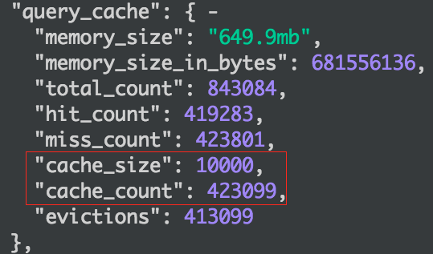
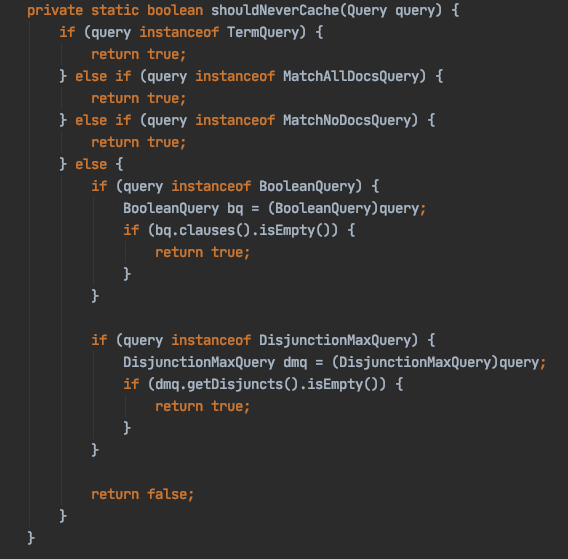
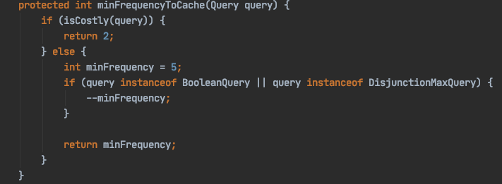
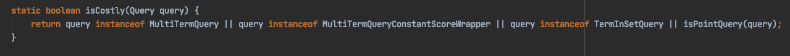
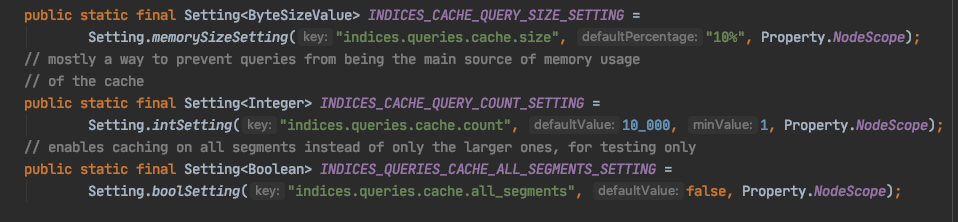
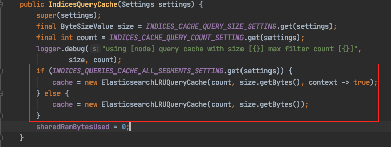
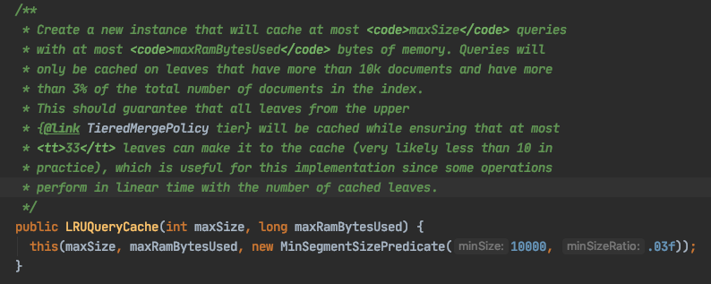

Elasticsearch 包含三个类型的缓存，分别为： `Node Query Cache` 、 `Shard Request Cache` 、 `Fielddata Cache`。

# 1、Node Query Cache

## 1.1 作用域

Query Cache是**Node级别的，被所有shard共享**。

早期版本也叫做为`Filter Cache`，顾名思义，它的作用是对**过滤器的执行结果进行缓存**。

Query Cache缓存的是压缩过的bitset，对应满足Query条件的docID列表。添加cache的时候，会注册一个回调，如果Segment被合并或者删除，那么就会被移除缓存

简单来看可以这样理解，一个ES的查询会先被parse 成一系列Lucene 的phrase，这些phrases 中的filter语句，如果对于查询条件是一样的时候，其实结果集是已定的，那么这些phrase 其实就是可以存放在一个地方当做cache用，这个就是 query cache。

## 1.2 配置参数

既然是缓存，肯定会对数量和内存有限制。通过`_nodes/stats/indices/query_cache`查看query cache的状态：

默认情况下，ES将会用10%的HEAP大小来存所有的Query Cache，可以通过参数`indices.queries.cache.size = 10%`控制。

从截图中可以发现一个非常醒目的整数，这个就是另外一个限制条件，缓存的最大个数，默认为10000。可以通过参数
 `indices.queries.cache.count=10000`控制。

有人可能会发现，为什么我配置了10000，但是还会有超过10000的情况？

前面我们提及，虽然我们cache一个子query，但其实因为这个query对应的segment是很多的，所以系统需要缓存多个segment查询后对应的bitset结果。于是我们有了公式:

> cacheSize = 当前符合cache条件的segment * 符合cache条件的子query数量

也就是一个子query会缓存多份数据，每份数据来源于相应的segment。 cacheCount 则是历史所有发生的cache行为。

缓存在ES的内部数据结构就是一个MAP，key就是一个具体的query，而value就是一个segment的 K/V, 而上面的10000的配置，只是Query 这个level，就是说真正的cache_size 是 `Query size * segment nums`， 如果你有2个segment，那么你看到的state数据很可能是`cache_size:20000`。

## 1.3 哪些Query 会被cache

这个问题可以拆分成2个子问题：

- 这个Query 会还是不会被cache
- 这个Query请求多少次后会被cache

可以从`UsageTrackingQueryCachingPolicy.java` 这个类里面找答案。

第一个问题：

很明了，filter中子查询包含以下子Query不能参与Cache： TermQuery/MatchAllDocsQuery/MatchNoDocsQuery/BooleanQuery/DisjunnctionMaxQuery。

**ES 从5.1.1开始取消了对TermQuery的cache**，官方的说法，因为Terms filter执行非常快，取消缓存多数情况下反而可以提高性能。

对于第二个问题，继续看代码：

- MultiTermQuery/MultiTermQueryConstantScoreWrapper/TermInSetQuery/Point*Query的Query查询，被认为是耗时的查询，超过2次就会被缓存
- 其它Query需要5次才会被缓存，如果其中出现BooleanQuery和DisjunnctionMaxQuery时会少去1次

## 1.4 哪些Segment会参与cache

继续从代码中寻找答案，`IndicesQueryCache.java`会从配置文件中拿到三个参数：

前两个参数已经介绍过，第三个参数`indices.queries.cache.all_segments`用于控制，是否全部的段都参与缓存，默认为fasle。

假如`indices.queries.cache.all_segments`为false，进入如下代码：

符合以下条件的段才会参与缓存：

- 段中的doc数大于10000
- 段中的doc数大于总doc数的3%

# 2、Shard Request Cache

## 2.1 作用域

Request Cache是**shard级别**的。

当一个查询发送到ES集群的某个节点上时，这个节点会把该查询扩散到其他节点并在相应分片上执行，我们姑且把在分片上执行的结果叫“本地结果集“，这些本地结果集最终会汇集到最初请求到达的那个协调节点，这些“分片级”的结果集会合并成“全局”结果集返回给调用端。

Request Cache就是为了缓存这些“分片级”的本地结果集，但是目前**只会缓存查询中参数size=0的请求**，所以就不会缓存hits 而是缓存 缓存hits total，以及aggs等信息。

对于Request Cache来说，它的Cache Key就是整个查询的DSL语句，所以如果要命中缓存查询生成的DSL一定要一样，这里的一样是指DSL这个字符串一样。只要有一个字符或者子查询的顺序变化都不会命中缓存。

## 2.2 缓存失效

Request Cache是非常智能的，它能够保证和在近实时搜索中的非缓存查询结果一致。这句话读起来很难懂，简单解释下。

我们都知道ES是一个“near real-time”（近实时）搜索引擎，为什么是近实时搜索呢，那是因为当我们向ES发送一个索引文档请求到这个文档变成Searchable（可搜索）默认的时间是1秒，我们可以通过`index.refresh_interval`参数来设置刷新时间间隔，也就是说我们在执行一个搜索请求时实际上数据是有延迟的。回到刚才的问题，刚才那句话其实指的就是：ES能保证在使用Request Cache的情况下的搜索结果和不使用Request Cache的近实时搜索结果相同，那ES是如何保证两者结果相同的呢？

Request Cache缓存失效是自动的，当索引refresh时就会失效，所以其**生命周期是一个refresh_interval**，也就是说在默认情况下Request Cache是每1秒钟失效一次（注意：分片在这段时间内确实有改变才会失效）。当一个文档被索引到该文档变成Searchable之前的这段时间内，不管是否有请求命中缓存该文档都不会被返回，正是是因为如此ES才能保证在使用Request Cache的情况下执行的搜索和在非缓存近实时搜索的结果一致。如果我们把索引刷新时间设置得越长那么缓存失效的时间越长，如果缓存被写满将采用LRU策略清除。当然我们也可以手动设置参数`indices.request.cache.expire`指定失效时间，但是基本上我们没必要去这样做，因为缓存在每次索引refresh时都会自动失效。

## 2.3 配置参数

`index.requests.cache.enable`：默认为true，启动RequestCache配置。

`indices.requests.cache.size`：RequestCache占用JVM的百分比，默认情况下是JVM堆的1%大小

`indices.requests.cache.expire`：配置过期时间，单位为分钟。

# 3、Fielddata Cache

## 3.1 作用域

Fielddata Cache是**Segment级别**的。

field data与doc_values作用一样，都是让我们在inverted index倒排索引的基础上做aggregation统计、sort排序。

当第一次在analyzed字段（只有analyzed字段使用fielddata，其余使用doc_values）上进行agg、sort或通过脚本访问时，就会触发该字段fielddata cache的加载，这种缓存的“segment”级别的，当有新的segment打开时，旧的缓存不会重新加载，而是直接把新的segment对应的fielddata cache加载到内存。一个fielddata被加载，那么在fielddata cache对应的segment生命周期范围内都会驻留在内存中。也即，当段合并时会触发合并后更大段的fielddata cache加载。

早期版本，ES没有doc values这样的数据结构，只有倒排索引。 做数据聚合和排序的时候，需要将倒排索引的数据读取出来，按列构造成docid->value的形式之后才能够高效的做排序和聚合计算。由于这个转换工作很耗资源，转换好的列表就会被缓存到fielddata cache，提升速度。 但是因为这个cache是在heap内部的，海量数据聚合的时候，生成的这些fielddata可能heap都放不下，很容易引起性能问题，甚至JVM OOM。 

从ES 2.0开始，提供了doc values特性，将field data的构建放在了index time，并且这些数据直接放到磁盘上，通过memory mapped file的方式来访问。 使得海量数据的聚合可以有效利用堆外内存，性能和稳定性都有提高。 因此支持doc values特性的字段类型，比如keyword, 数值型等等，不会再用到fielddata cache。 由于text字段没有doc values支持，所以对text类型字段做排序和聚合的时候，依然会构造field data，填充到cache里。

## 3.2 配置参数

- `indices.fielddata.cache.size`：此参数设置缓存大小（默认是不限制）。可设置百分数如30%，或者数字12GB
- `indices.breaker.fielddata.limit`：此参数设置Fielddata断路器限制大小（公式：预计算内存 + 现有内存 <= 断路器设置内存限制），默认是60%JVM堆内存，当查询尝试加载更多数据到内存时会抛异常（以此来阻止JVM OOM发生）
- `indices.breaker.fielddata.overhead`：一个常数表示内存预估值系数，默认1.03，比如预计算加载100M数据，那么100*1.03=103M会用103M作为参数计算是否超过断路器设置的最大值。
