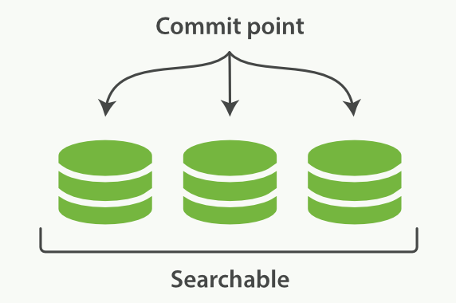
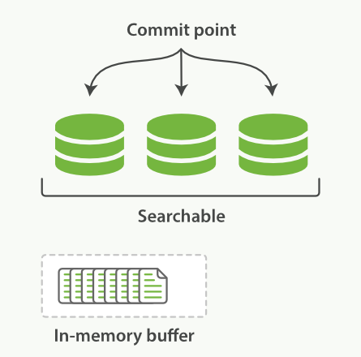
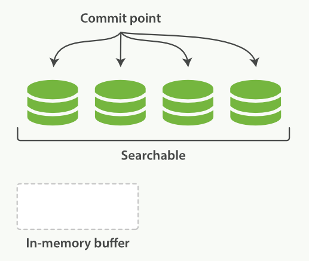
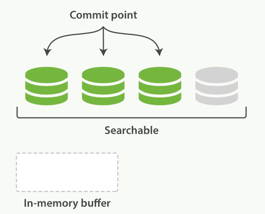
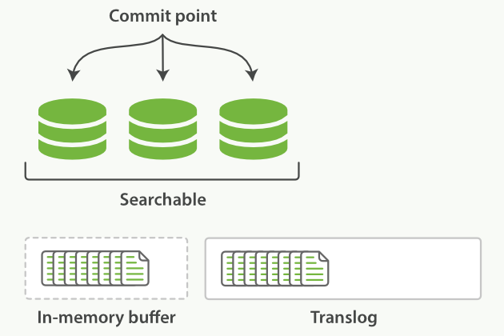
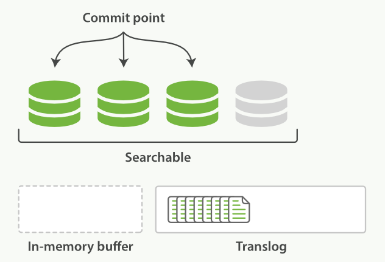
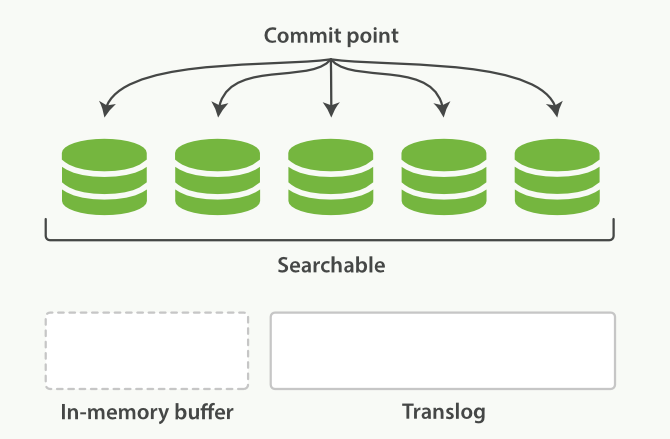
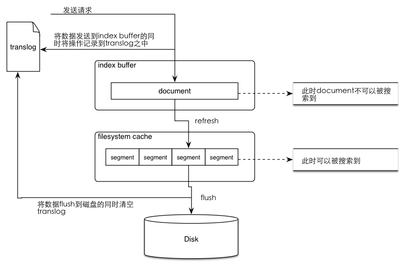
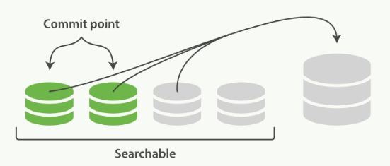

# 段

倒排索引被写入磁盘后是不可变的，ES解决不变性和更新索引的方式是使用多个索引，利用新增的索引来反映修改，在查询时从旧的到新的依次查询，最后来一个结果合并。

ES底层是基于Lucene，最核心的概念就是**Segment(段)**，每个段本身就是一个倒排索引。

ES中的Index由多个段的集合和**commit point(提交点)**文件组成。

提交点文件中有一个列表存放着所有已知的段，下面是一个带有1个提交点和3个段的Index示意图：



# 2、Doc写入

## 2.1 写入缓存

Doc会先被搜集到内存中的Buffer内，这个时候还无法被搜索到，如下图所示：



每隔一段时间，会将buffer提交，在flush磁盘后打开新段使得搜索可见，详细过程如下：

1. 创建一个新段，作为一个追加的倒排索引，写入到磁盘（文件系统缓存）
2. 将新的包含新段的Commit Point(提交点)写入磁盘（文件系统缓存）
3. 磁盘进行`fsync`，主要是将文件系统缓存中等待的写入操作全部物理写入到磁盘
4. 这个新的段被开启， 使得段内文档对搜索可见
5. 将内存中buffer清除，又可以把新的Doc写入buffer了

下面展示了这个过程完成后的段和提交点的状态：



通过这种方式，可以使得新文档从被索引到可被搜索间的时间间隔在数分钟，但是还不够快。因为磁盘需要`fsync`，这个就成为性能瓶颈。我们前面提到过Doc会先被从buffer刷入段写入文件系统缓存（很快），那么就自然想到在这个阶段就让文档对搜索可见，随后再被刷入磁盘（较慢）。

## 2.2 refresh

Lucene支持对新段写入和打开，可以使文档在没有完全刷入硬盘的状态下就能对搜索可见，而且是一个开销较小的操作，可以频繁进行。

下面是一个已经将Docs刷入段，但还没有完全提交的示意图：



我们可以看到，新段虽然还没有被完全提交，但是已经对搜索可见了。

引入refresh操作的目的是提高ES的实时性，使添加文档尽可能快的被搜索到，同时又避免频繁fsync带来性能开销，依靠的就是文件系统缓存OS cache里缓存的文件可以被打开(open/reopen)和读取，而这个os cache实际是一块内存区域，而非磁盘，所以操作是很快的，这就是ES被称为近实时搜索的原因。

refresh默认执行的间隔是1秒，可以使用`refreshAPI`进行手动操作，但一般不建议这么做。还可以通过合理设置`refresh_interval`在近实时搜索和索引速度间做权衡。

## 2.3 translog

 index segment刷入到os cache后就可以打开供查询，这个操作是有潜在风险的，因为os cache中的数据有可能在意外的故障中丢失，而此时数据必备并未刷入到os disk，此时数据丢失将是不可逆的，这个时候就需要一种机制，可以将对es的操作记录下来，来确保当出现故障的时候，已经落地到磁盘的数据不会丢失，并在重启的时候可以从操作记录中将数据恢复过来。elasticsearch提供了translog来记录这些操作，结合os cached segments数据定时落盘来实现数据可靠性保证（flush）。

文档被添加到buffer同时追加到translog：



进行`refresh`操作，清空buffer，文档可被搜索但尚未`flush`到磁盘。translog不会清空：



每隔一段时间（例如translog变得太大），index会被flush到磁盘，新的translog文件被创建，commit执行结束后，会发生以下事件：

- 所有内存中的buffer会被写入新段
- buffer被清空
- 一个提交点被写入磁盘
- 文件系统缓存通过`fsync` flush
- 之前的旧translog被删除

下面示意图展示了这个状态：



translog记录的是已经**在内存生成(segments)并存储到os cache但是还没写到磁盘的那些索引操作**（注意，有一种解释说，添加到buffer中但是没有被存入segment中的数据没有被记录到translog中，这依赖于写translog的时机，不同版本可能有变化，不影响理解），此时这些新写入的数据可以被搜索到，但是当节点挂掉后这些未来得及落入磁盘的数据就会丢失，可以通过trangslog恢复。

当然translog本身也是磁盘文件，频繁的写入磁盘会带来巨大的IO开销，因此对translog的追加写入操作的同样操作的是os cache，因此也需要定时落盘（fsync）。translog落盘的时间间隔直接决定了ES的可靠性，因为宕机可能导致这个时间间隔内所有的ES操作既没有生成segment磁盘文件，又没有记录到Translog磁盘文件中，导致这期间的所有操作都丢失且无法恢复。

translog的fsync是ES在后台自动执行的，默认是每5秒钟主动进行一次translog fsync，或者当translog文件大小大于512MB主动进行一次fsync，对应的配置是`index.translog.flush_threshold_period` 和 `index.translog.flush_threshold_size`。

当 Elasticsearch 启动的时候， 它会从磁盘中使用最后一个提交点去恢复已知的段，并且会重放 translog 中所有在最后一次提交后发生的变更操作。

translog 也被用来提供实时 CRUD 。当你试着通过ID来RUD一个Doc，它会在从相关的段检索之前先检查 translog 中最新的变更。

默认`translog`是每5秒或是每次请求完成后被`fsync`到磁盘（在主分片和副本分片都会）。也就是说，如果你发起一个index, delete, update, bulk请求写入translog并被fsync到主分片和副本分片的磁盘前不会反回200状态。

这样会带来一些性能损失，可以通过设为异步fsync，但是必须接受由此带来的丢失少量数据的风险：

```shell
PUT /my_index/_settings
{
    "index.translog.durability": "async",
    "index.translog.sync_interval": "5s"
}
```

## 2.4 flush

`flush`就是执行commit清空、干掉老translog的过程。默认每个分片30分钟或者是translog过于大的时候自动flush一次。可以通过flush API手动触发，但是只会在重启节点或关闭某个索引的时候这样做，因为这可以让未来ES恢复的速度更快(translog文件更小)。

满足下列条件之一就会触发冲刷操作：

- 内存缓冲区已满，相关参数： `indices.memory.index_buffer`

- 自上次冲刷后超过了一定的时间，相关参数：`index.translog.flush_threshold_period`

- 事物日志达到了一定的阔值，相关参数：`index.translog.flush_threshold_size`

## 2.5 总结



整体流程：

1. 数据写入buffer缓冲和translog日志文件中。
   当你写一条数据document的时候，一方面写入到mem buffer缓冲中，一方面同时写入到translog日志文件中。
2. buffer满了或者每隔1秒(可配)，refresh将mem buffer中的数据生成index segment文件并写入os cache，此时index segment可被打开以供search查询读取，这样文档就可以被搜索到了（注意，此时文档还没有写到磁盘上）；然后清空mem buffer供后续使用。可见，refresh实现的是文档从内存移到文件系统缓存的过程。
3. 重复上两个步骤，新的segment不断添加到os cache，mem buffer不断被清空，而translog的数据不断增加，随着时间的推移，translog文件会越来越大。
4. 当translog长度达到一定程度的时候，会触发flush操作，否则默认每隔30分钟也会定时flush，其主要过程：
    4.1. 执行refresh操作将mem buffer中的数据写入到新的segment并写入os cache，然后打开本segment以供search使用，最后再次清空mem buffer。
    4.2. 一个commit point被写入磁盘，这个commit point中标明所有的index segment。
    4.3. filesystem cache（os cache）中缓存的所有的index segment文件被fsync强制刷到磁盘os disk，当index segment被fsync强制刷到磁盘上以后，就会被打开，供查询使用。
    4.4. translog被清空和删除，创建一个新的translog。

# 3、Doc删除

删除一个ES文档不会立即从磁盘上移除，它只是被标记成已删除。因为段是不可变的，所以文档既不能从旧的段中移除，旧的段也不能更新以反映文档最新的版本。

ES的做法是，每一个提交点包括一个`.del`文件（还包括新段），包含了段上已经被标记为删除状态的文档。所以，当一个文档被做删除操作，实际上只是在`.del`文件中将该文档标记为删除，依然会在查询时被匹配到，只不过在最终返回结果之前会被从结果中删除。ES将会在用户之后添加更多索引的时候，在后台进行要删除内容的清理。

# 4、Doc更新

文档的更新操作和删除是类似的：当一个文档被更新，旧版本的文档被标记为删除，新版本的文档在新的段中索引。
该文档的不同版本都会匹配一个查询，但是较旧的版本会从结果中删除。

# 5、段合并

通过每秒自动刷新创建新的段，用不了多久段的数量就爆炸了，每个段消费大量文件句柄，内存，cpu资源。更重要的是，每次搜索请求都需要依次检查每个段。段越多，查询越慢。

ES通过后台合并段解决这个问题。ES利用段合并的时机来真正从文件系统删除那些version较老或者是被标记为删除的文档。被删除的文档（或者是version较老的）不会再被合并到新的更大的段中。

可见，段合并主要有两个目的：

- 第一个是将分段的总数量保持在受控的范围内（这用来保障查询的性能）。
- 第二个是真正地删除文挡。

ES对一个不断有数据写入的索引处理流程如下：

1. 索引过程中，refresh会不断创建新的段，并打开它们。
2. 合并过程会在后台选择一些小的段合并成大的段，这个过程不会中断索引和搜索。

合并过程如图：



从上图可以看到，段合并之前，旧有的Commit和没Commit的小段皆可被搜索。

段合并后的操作:

- 新的段flush到硬盘
- 编写一个包含新段的新提交点，并排除旧的较小段。
- 新的段打开供搜索
- 旧的段被删除

合并完成后新的段可被搜索，旧的段被删除，如下图所示：


**注意**：段合并过程虽然看起来很爽，但是大段的合并可能会占用大量的IO和CPU，如果不加以控制，可能会大大降低搜索性能。段合并的optimize API 不是非常特殊的情况下千万不要使用，默认策略已经足够好了。不恰当的使用可能会将你机器的资源全部耗尽在段合并上，导致无法搜索、无法响应。