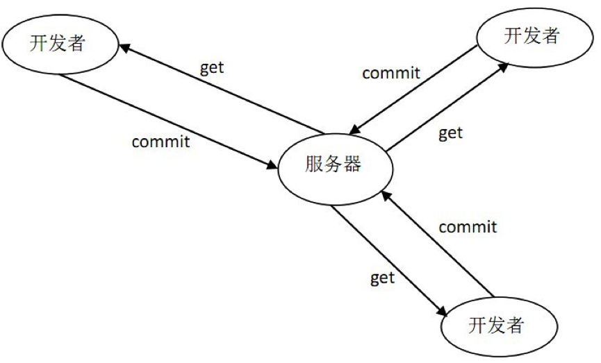
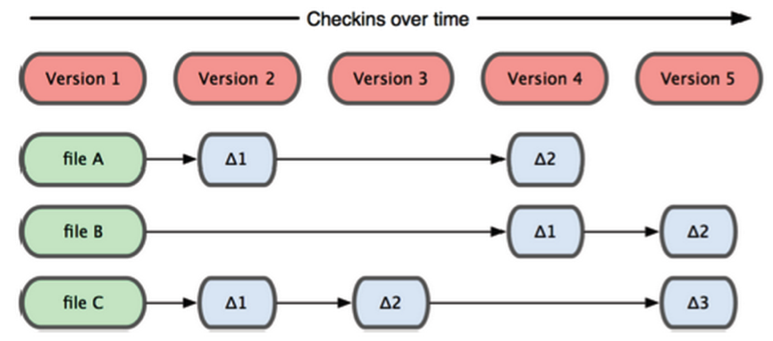
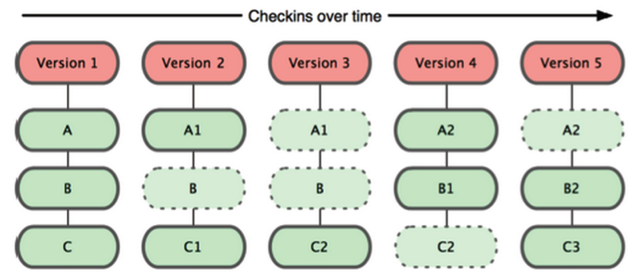

# 1、 为什么使用Git

孔子曾经曰过的，名正则言顺，言顺则事成。

我们在学习一项新技术之前，弄清楚为什么要学它至关重要，至于为什么要学习Git，我用一段if-else语句告诉你原因：

```java
if(你相信我){
	我推荐你学习;
} else if(诚然，我又不是什么大牛，你可以不相信我，但是你应该相信大多数人的选择){
	世界上越来越多的人、越来越多的项目在使用Git，大势所趋，势不可挡;
}else if(用的人多算什么，你可能认为真理掌握在少数人手中){
	你可以不相信大众，但是你应该相信Linus Torvalds，就是靠一己之力写出了Linux内核原型的大神; /
   //我说的是内核的原型，不是内核的全部，不要挑我毛病
	Git就是他创造的第二个作品;
}else{
	什么？！你没听过Linus Torvalds，更不知道Linux是个什么东西……
	throw new Exception(“好吧，你赢了，你可以不用学Git，我运行不下去了”);	
}
```

# 2、Git是什么

首先，Git是一个版本管理工具。

我们自己平时写个“Hello World”程序，或者写一个只有几百行代码的小项目，不需要专门的代码管理工具，依靠自己的记忆就能把代码捋顺。

但是，一旦涉及到代码量巨大的项目，往往需要经过很多人协同工作数周乃至数月才能完成。开发过程中，会面临着代码的修改、增删、恢复等工作，开发人员不可能清楚的记得每次变化，这时候就需要借助版本管理工具来跟踪代码的变化历程。

版本管理工具赋予每个文件一个版本号，每次修改之后，哪怕只改动了一个字母，版本管理工具都会精确地记录下来，并改变该文件的版本号。这样，每个版本号就对应着文件的一次变化，依此可以进行文件的对比、恢复等操作。

最早广泛应用的版本管理工具是**CVS**（Concurrent Versions System），后来逐渐被**SVN**（Subversion）替代，两者的工作原理类似，都是以一台服务器为核心进行集中式代码管理：




## 2.1 集中式 vs 分布式

SVN属于典型的集中式版本控制系统，集中式版本控制系统都有一个单一的集中管理的服务器，保存所有文件的修订版本，而协同工作的人们都通过客户端连到这台服务器，取出最新的文件或者提交更新。

这种做法带来了许多好处，特别是相较于老式的本地VCS 来说，每个人都可以一定程度上看到项目中的其他人正在做些什么，而管理员也可以轻松掌控每个开发者的权限。

事分两面，有好有坏。这么做最显而易见的缺点是中央服务器的单点故障。若是宕机一小时，那么在这一小时内，谁都无法提交更新、还原、对比等，也就无法协同工作。如果中央服务器的磁盘发生故障，并且没做过备份或者备份得不够及时的话，还会有丢失数据的风险。最坏的情况是彻底丢失整个项目的所有历史更改记录，被客户端提取出来的某些快照数据除外，但这样的话依然是个问题，不能保证所有的数据都已经有人提取出来。

SVN只关心文件内容的具体差异。每次记录有哪些文件作了更新，以及都更新了什么内容。如下图所示：



与SVN不同，Git记录版本历史只关心**文件数据的整体是否发生变化**。Git 并不保存文件内容前后变化的差异数据。实际上，Git 更像是把变化的文件作快照后，记录在一个微型的文件系统中。每次提交更新时，它会纵览一遍所有文件的指纹信息并对文件作一快照，然后保存一个指向这次快照的索引。为提高性能，若文件没有变化，Git 不会再次保存，而只对上次保存的快照作一连接。Git 的工作方式如下图所示：



在分布式版本控制系统中，客户端并不只提取最新版本的文件快照，而是把原始的代码仓库完整地镜像下来。这么一来，任何一处协同工作用的服务器发生故障，事后都可以用任何一个镜像出来的本地仓库恢复。这类系统都可以指定和若干不同的远端代码仓库进行交互。借此，就可以在同一个项目中，分别和不同工作小组的人相互协作。可以根据需要设定不同的协作流程。

另外，因为Git在本地磁盘上保存着所有有关当前项目的历史更新，并且Git中的绝大多数操作都只需要访问本地文件和资源，不用连网，所以处理起来速度飞快。用SVN的话，没有网络或者断开VPN就无法做任何事情。但用Git的话，就算你在飞机或者火车上，都可以非常愉快地频繁提交更新，等到了有网络的时候再上传到远程的镜像仓库。换作其他版本控制系统，这么做几乎不可能，抑或是非常麻烦。

简略的说，Git具有以下特点：

- Git中每个克隆(clone)的版本库都是平等的。可以从任何一个版本库的克隆来创建属于自己的版本库，同时你的版本库也可以作为源提供给他人，只要你愿意。
- Git的每一次提取操作，实际上都是一次对代码仓库的完整备份。
- 提交完全在本地完成，无须别人给你授权，你的版本库你作主，并且提交总是会成功。
- Git的提交不会被打断，直到你的工作完全满意了，PUSH给他人或者他人PULL你的版本库，合并会发生在PULL和PUSH过程中，不能自动解决的冲突会提示你手工完成。

## 2.2 全局版本号 vs 全球版本号

SVN的全局版本号和CVS的每个文件都独立维护一套版本号，在看似简单的全局版本号的背后，是SVN提供对于事物处理的支持，每一个事物处理（即一次提交）都具有整个版本库全局唯一的版本号。

Git的版本号则更进一步，版本号是全球唯一的。在保存到 Git 之前，所有数据都要进行内容的校验和（checksum）计算，并将此结果作为数据的唯一标识和索引。换句话说，不可能在你修改了文件或目录之后，Git 一无所知。这项特性作为 Git 的设计哲学，建在整体架构的最底层。所以如果文件在传输时变得不完整，或者磁盘损坏导致文件数据缺失，Git 都能立即察觉。

Git 使用 SHA-1 算法计算数据的校验和，通过对文件的内容或目录的结构计算出一个 SHA-1 哈希值，作为指纹字符串。该字串由 40 个十六进制字符（0-9 及 a-f）组成，看起来就像是这个样子：

`24b9da6552252987aa493b52f8696cd6d3b00373`

- 所有保存在Git 数据库中的东西都是用此哈希值来作索引的，而不是靠文件名。
- 使用哈希值作版本号的好处就是对于一个分布式的版本控制系统，每个人每次提交后形成的版本号都不会出现重复。另一好处是保证数据的完整性，因为哈希值是根据内容或目录结构计算出来的，所以我们还可以据此来判断数据内容是否被篡改。
- SVN 的版本号是连续的，可以预判下一个版本号，而 Git 的版本号则不是。因为 subversion 是集中式版本控制，很容易实现版本号的连续性。Git 是分布式的版本控制系统，而且 Git 采用 40 位长的哈希值作为版本号，每个人的提交都是各自独立完成的，没有先后之分（即使提交有先后之分，也由于PUSH/PULL的方向和时机而不同）。Git 的版本号虽然不连续，但是是有线索的，即每一个版本都有对应的父版本（一个或者两个），进而可以形成一个复杂的提交链。
- Git 的版本号简化：Git 可以使用从左面开始任意长度的字串作为简化版本号，只要该简化的版本号不产生歧义。一般采用7位的短版本号（只要不会出现重复的，你也可以使用更短的版本号）。

许多人可能会担心一个问题：在随机的偶然情况下，在他们的仓库里会出现两个具有相同 SHA-1 值的对象。那会怎么样呢？

如果你真的向仓库里提交了一个跟之前的某个对象具有相同 SHA-1 值的对象，Git 将会发现之前的那个对象已经存在在 Git 数据库中，并认为它已经被写入了。如果什么时候你想再次检出那个对象时，你会总是得到先前的那个对象的数据。
不过，你应该了解到，这种情况发生的概率是多么微小。SHA-1 摘要长度是 20 字节，也就是 160 位。为了保证有 50% 的概率出现一次冲突，需要 2^80 个随机哈希的对象（计算冲突机率的公式是p = (n(n-1)/2) * (1/2^160))。2^80 是 1.2 x 10^24，也就是一亿亿亿，那是地球上沙粒总数的 1200 倍。

现在举例说一下怎样才能产生一次 SHA-1 冲突。如果地球上 65 亿的人类都在编程，每人每秒都在产生等价于整个 Linux 内核历史（一百万个 Git 对象）的代码，并将之提交到一个巨大的 Git 仓库里面，那将花费 5 年的时间才会产生足够的对象，使其拥有 50% 的概率产生一次 SHA-1 对象冲突……

所以，你还担心会冲突吗？