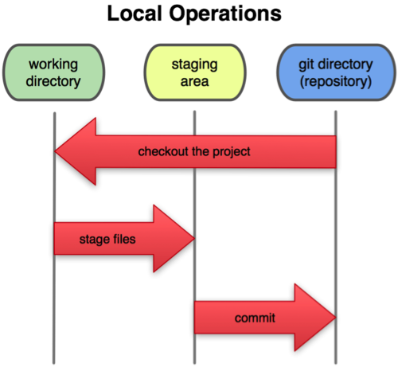
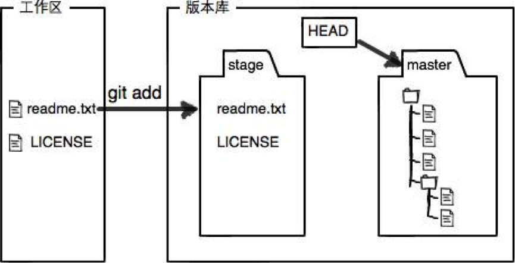
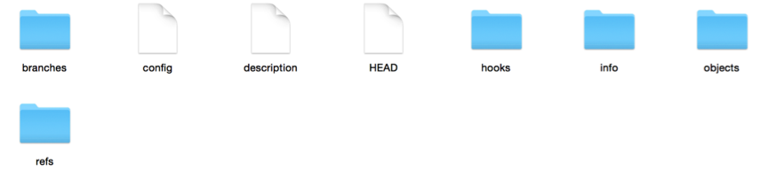
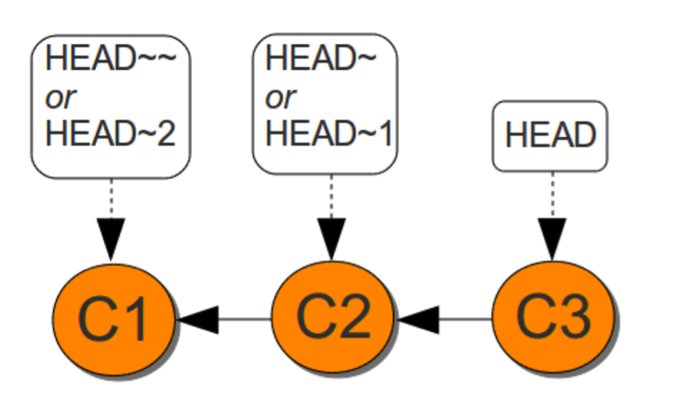
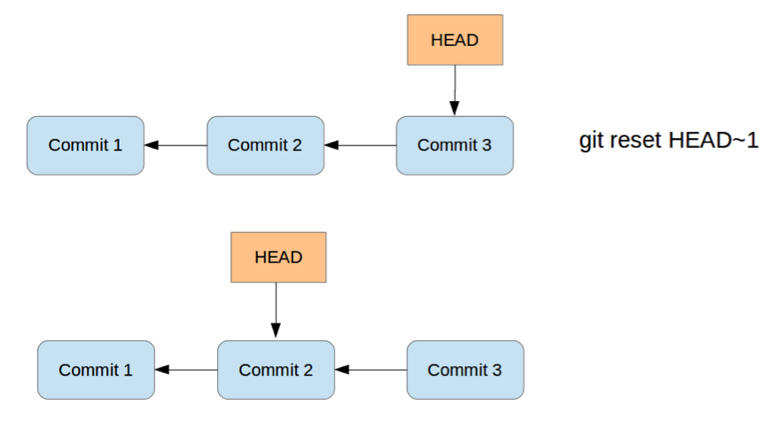
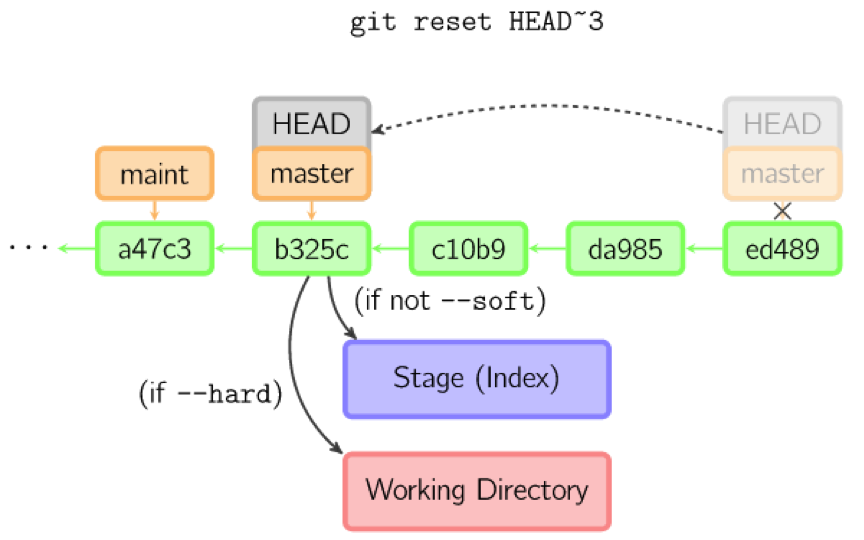
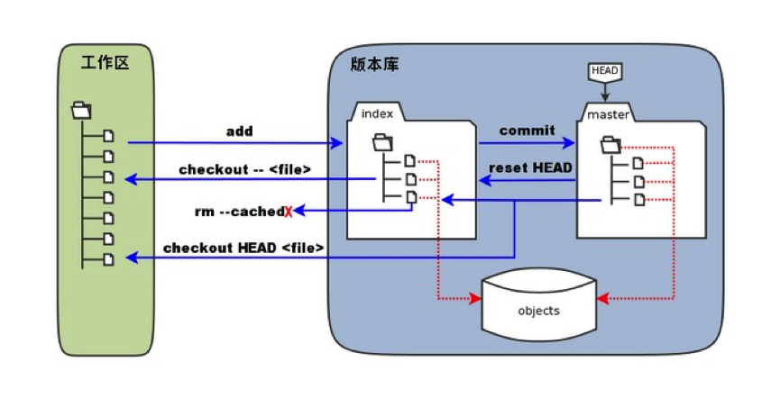

# 1、三个工作区域

使用Git之前，首先要弄清Git的三个管理区域，有助于理解Git的运行原理，以及每个Git命令对文件造成的影响。

对于任何一个文件，在本地的Git 内部都有三种状态：

- **已修改**（modified）：表示修改了某个文件，但还没有提交保存。包括新增、删除了一个文件，也属于已修改状态的一种。
- **已暂存**（staged）：表示把已修改的文件放到了暂存区，也就是放到了下次提交时的清单中。
- **已提交**（committed）：表示该文件已经被安全地保存在本地数据库中了。

三种状态对应着Git的三个区域：工作目录，暂存区域，以及本地仓库。



工作区域就是我们对文件进行增删改的地方，是唯一对Git用户可见的区域，暂存区与本地仓库是Git对文件系统跟踪记录的存储区，对用户是透明的。



Git管理项目的过程就是文件频繁地在三个区域中流转的过程。

有了上面的概念，就等于拿到了进入Git世界的通行证，可以与Git来一次亲密接触了。

# 2、基础命令

首先，需要给Git建立一个基地，在你的电脑里给Git安排大展身手的舞台。说的这么高大上，其实就是建立个文件夹而已……

## 2.1 git init

切换到合适的目录，新建一个文件夹，然后使用该命令将它初始化为一个Git仓库。

```shell
mkdir firstgit
cd firstgit/
git init
```

然后，Git会提示：

> Initialized empty git repository in /Users/winner/firstgit/.git/
>

Git告诉你，已经将文件夹初始化为一个Git的空仓库。进入该文件夹下面查看会发现，多了一个名为“.git”的隐藏文件夹。里面包含这几项内容：



.git文件夹是存储Git元信息的地方，Git就是靠它来管理仓库中的所有文件，所以对这个“闲人莫进”的禁地看看就行了，千万不要手贱。

## 2.2 git status

这个命令是会频繁使用的命令，可以查看当前工作目录下的Git仓库状态。会告诉你当前有哪些文件已经修改，哪些文件没有提交等信息。

比如，在新建的Git仓库中运行该命令，会提示：

> On branch master
> Initial commit
> nothing to commit (create/copy files and use "git add" to track)

就是说，在当前分支“master”上面（master是Git的默认主分支），初始化操作已提交，暂时没有任何待提交的东西。括号内还友善地告诉你，新建或者复制过来的文件，可以使用“git add”命令交给Git来追踪。

## 2.3 git add <file>

新建一个名为“readme.txt”的文件，使用`git status`查看状态：

```shell
touch readme.txt
git status
```

提示：

> On branch master
> Initial commit
> Untracked files:
>   (use "git add <file>..." to include in what will be committed)
> 	readme.txt
> nothing added to commit but untracked files present (use "git add" to track)

Git告诉你，现在有一个名为“readme.txt”的文件处于未追踪的状态。

使用`git add`命令之后再查看状态：

```shell
git add readme.txt
git status
```

提示：

> On branch master
> Initial commit
> Changes to be committed:
>   (use "git rm --cached <file>..." to unstage)
> 	new file:   readme.txt

Git告诉你，在master分支上，待提交的更改包括一个新建名为“readme.txt”的文件。`git add`命令是将文件放入暂存区，并没有提交到本地版本库。

然后Git又很友善地告诉你，使用`git rm --cached`命令可以将文件恢复到未追踪的状态。

## 2.4 git rm--cached <file>

运行命令：

```shell
git rm --cached readme.txt
```

提示：

> rm 'readme.txt'

`rm`是“remove”的缩写，移除的意思。

然后继续用`git status`命令查看状态，发现又回到了之前的状态：

> On branch master
> Initial commit
> Untracked files:
>   (use "git add <file>..." to include in what will be committed)
> 	readme.txt
> nothing added to commit but untracked files present (use "git add" to track)

可见，该命令会使文件脱离Git的追踪。

假如该文件在之前已经被commit到版本库，运行该命令，Git会提示：

> rm 'readme.txt'

使用`git status`查看：

> On branch master
> Changes to be committed:
>   (use "Git reset HEAD <file>..." to unstage)
> 	deleted:    readme.txt
> Untracked files:
>   (use "git add <file>..." to include in what will be committed)
> 	readme.txt

Git告诉你，readme.txt恢复到了未追踪的状态，但是删除文件的操作还没有提交（版本库还保留着该文件的信息）。可见，该命令不会直接将文件从版本库删除，而是将删除操作作为一个修改项放入暂存区，commit之后才会真正从版本库删除。

**注意**：这里所说的删除是从Git的追踪视野中删除，而不是在文件系统中删除。就算从Git的版本库中删除掉了该文件，它依然完好无损地存储在你的电脑里，只不过不会再被Git追踪罢了。如果想将该文件同时从Git版本库和文件系统中删除，去掉`--cached`参数即可。

## 2.5 git commit 

将readme.txt文件先放入暂存区，然后使用`git commit`命令提交到本地版本库。

```shell
git add readme.txt
git commit -m 'first commit'
```

参数`-m`后面跟着此次提交的备注，有助于后期的管理与对比。Git默认情况下是必须加上备注的。

提示：

> [master (root-commit) eec8c38] first commit
>  1 file changed, 0 insertions(+), 0 deletions(-)
>  create mode 100644 readme.txt

Git告诉你，此次提交都包含哪些内容，版本号是多少（eec8c38就是版本号的前七位）等信息。
再用`git status`命令查看：

> on branch master
> nothing to commit, working directory clean

Git告诉你，在master分支上，没有任何待提交的内容，当前工作区域是干净的。

## 2.6 git checkout -- <file>

现在readme.txt文件是空的，随便添加一行文字，然后使用`git status`命令查看：

> On branch master
> Changes not staged for commit:
>   (use "git add <file>..." to update what will be committed)
>   (use "git checkout -- <file>..." to discard changes in working directory)
> 	modified:   readme.txt
> no changes added to commit (use "git add" and/or "git commit -a")

Git告诉你，现在文件readme.txt已经发生了变化，使用“git add”命令可以将变化放入暂存区，使用`git checkout -- <file>`命令可以丢弃工作区的变化，将文件恢复到最近一次add时的状态。

假设现在工作区、暂存区、版本库中的read.txt文件处于一致状态，都只包含下面一行内容：

> this is my first Git project

现在我们对readme.txt增加一行文字：

> this is my first Git project
> second row will be added

使用“git add”命令将文件放到暂存区，然后对readme.txt再增加一行文字（不进行add操作）：

> this is my first Git project
> second row will be added
> third row will not be added

使用`git status`命令查看：

> On branch master
> Changes to be committed:
>   (use "git reset HEAD <file>..." to unstage)
> 	modified:   readme.txt
> Changes not staged for commit:
>   (use "git add <file>..." to update what will be committed)
>   (use "git checkout -- <file>..." to discard changes in working directory)
> 	modified:   readme.txt

现在readme.txt在三个区域的情况是：工作区有三行内容，暂存区有两行内容，本地版本库有一行内容。

运行`git checkout --readme.txt`，再使用`git status`命令查看，提示消息如下：

> On branch master
> Changes to be committed:
>   (use "git reset HEAD <file>..." to unstage)
> 	modified:   readme.txt

可见，工作区没有放入暂存区的修改被遗弃了，恢复到了两行内容的状态。

## 2.7 git reset 

回到同样的初始条件：readme.txt在工作区有三行内容，在暂存区有两行内容，在本地版本库有一行内容。

运行`git reset HEAD readme.txt`命令后，提示：

> Unstaged changes after reset:
> M	readme.txt

使用`git status`查看：

> On branch master
> Changes not staged for commit:
>   (use "git add <file>..." to update what will be committed)
>   (use "git checkout -- <file>..." to discard changes in working directory)
> 	modified:   readme.txt
> no changes added to commit (use "git add" and/or "git commit -a")

可见，该命令可以清空暂存区，但是不会影响工作区以及版本库。

命令中的`HEAD`参数指向当前工作分支的最新提交记录：



而`HEAD~`或者`HEAD~1`就代表上次的提交记录，`HEAD~~`或者`HEAD~2`就代表上上次的提交记录，以此类推。
例如执行命令`git reset HEAD~1`之后，会发生下面的变化：



HEAD指针回退到了上一次的提交记录。

除此之外，还可以使用“版本号”来替代“HEAD”参数，直接会退到某个版本。当然了，在实际工作中，我们脑子里怎么可能记得一个几千行的文件每次都改了什么内容，不然要版本控制系统干什么。版本控制系统肯定有某个命令可以告诉我们历史记录，在Git中，我们用`git log`命令查看每次提交的版本号、备注以及修改内容等信息。

例如。`git reset 7dd233c`，代表会退到版本号以“7dd233c”开头的版本，前面我们提到过，Git的版本号是对文件内容或目录结构计算出一个SHA-1 哈希值，得到一个40位的十六进制字符串。版本号没必要写全，一般来讲只写前七位就可以了，Git会自动去找，只要不产生歧义。否则，Git可能会找到多个版本号，就无法确定是哪一个了。

如果没有指定任何版本参数，如“git reset”，Git会默认按照“git reset HEAD”来处理，即恢复到最新提交的版本。
其实，`git reset`命令还有一个非常重要的可选参数：`--soft`、`--hard`与`--mixed`。

三个参数决定了回退操作的影响范围。

- `git reset --soft`：Git将重置HEAD到另外一个commit，但是工作区与版本库都不会做任何变化，所有的在original HEAD和你重置到的那个commit之间的所有变更集仍然在暂存区域中

  

- `git reset --hard`：
  Git将重置HEAD到另外一个commit，同时重置暂存区与工作区。这是一个比较危险的动作，具有破坏性，数据因此可能会丢失！如果真是发生了数据丢失又希望找回来，那么只有使用“git reflog”命令了

  

- `git reset --mixed`：顾名思义，该参数是“--soft”与“--hard”的混合体。Git 将重置HEAD到另外一个commit，同时重置暂存区而对工作区不做任何改动。所有从original HEAD到重置的那个commit之间的所有变更仍然保存在working copy中，被标示为已变更，但是并未staged的状态。

  

`--mixed`是reset的默认参数，也就是当你不指定任何参数的时候，Git将会按照`--mixed`方式处理。 
总体来说，三个参数的区别如下图所示：



# 3、三个区域的流转

熟练掌握了上面的命令，就可以操控文件在三个区域中的流转，一个更全面的流转图如下：



总结如下：

- 从未追踪状态转换为被追踪状态：`git add`
- 从被追踪状态转换为未追踪状态：`git rm --cache`
- 将工作区的更改提交到暂存区：`git add`
- 清空工作区的更改：`git checkout`
- 将暂存区的更改提交到版本库：`git cimmit`
- 清空暂存区的更改及版本回退：`git reset`

