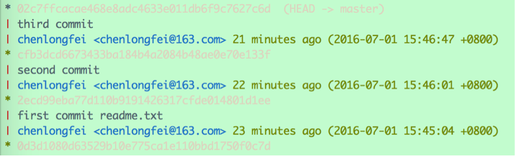

熟悉了Git的基本操作之后，再来研究一下Git为我们提供的基础设施服务。正如一个程序员，只会写代码是远远不够的，还得知道怎么吃饭，怎么睡觉，怎么谈恋爱，怎么耍流氓……会了这些才能写出更好的代码，这就是所谓的“基础设施服务”或者“外围服务”。

# 1、git config

一般在新的系统上，我们都需要先配置下自己的 Git 工作环境。配置工作只需一次，以后升级时还会沿用现在的配置。当然，如果需要，随时可以用相同的命令修改已有的配置。

Git 提供了一个叫做 `git config` 的工具，专门用来配置或读取相应的工作环境变量。而正是由这些环境变量，决定了 Git 在各个环节的具体工作方式和行为。这些变量可以存放在以下三个不同的地方：

- /etc/gitconfig 文件：系统中对所有用户都普遍适用的配置。若使用 `git config --system` 选项，读写的就是这个文件。
- ~/.gitconfig 文件：用户目录下的配置文件只适用于该用户。若使用 `git config --global` 选项，读写的就是这个文件。
- 工作目录中的 .git/config 文件：这里的配置仅仅针对当前项目有效。若使用 `git config --local` 选项，读写的就是这个文件

每一个级别的配置都会覆盖上层的相同配置。

首先需要配置的是用户名称和电子邮件地址。这两条配置很重要，每次 Git 提交时都会引用这两条信息，说明是谁提交了更新，所以会随更新内容一起被永久纳入历史记录。

比如，用“--local”参数仅作项目级别的修改：

```shell
git config --local user.name 'clf'
git config --local user.email 'clf@163.com'
```

上面的两条命名会改变工作目录中的 .git/config 配置，打开文件验证一下：

> name = clf
> email = clf@163.com

发现里面的用户配置已更改。本项目之后的commit会标注这两项用户信息。类似这样：

> commit b34fb46
> Author: clf <clf@163.com>
> Date:   Fri Jul 1 11:59:29 2016 +0800

还有一个很有用的配置，就是为Git命令配置别名，可以简化命令输入。例如我们想使用`git st`来作为`git status`的别名，在用户级别生效：

`git config --global alias.st status  `  

以后运行“git st”就相当于运行命令“git status”。

使用“git alias”命令可以查看所有的别名配置：

> a	 => !git add . && git status
> aa	 => !git add . && git add -u . && git status
> ac	 => !git add . && git commit
> acm	 => !git add . && git commit -m
> au	 => !git add -u . && git status
> c	 => commit
> ca	 => commit --amend
> cm	 => commit -m
> d	 => diff
> l	 => log --graph --all --pretty=format:'%C(yellow)%h%C(cyan)%d%Creset %s %C(white)- %an, %ar%Creset'
> lg	 => log --color --graph --pretty=format:'%C(bold white)%h%Creset -%C(bold green)%d%Creset %s %C(bold green)(%cr)%Creset %C(bold blue)<%an>%Creset' --abbrev-commit --date=relative
> ll	 => log --stat --abbrev-commit
> llg	 => log --color --graph --pretty=format:'%C(bold white)%H %d%Creset%n%s%n%+b%C(bold blue)%an <%ae>%Creset %C(bold green)%cr (%ci)' --abbrev-commit
> master	 => checkout master
> s	 => status

很奇怪，有很多别名我们并没有配置过。其实，这些都是Git默认设置的一些常用命令的别名，当然，可以根据自己的使用习惯来更改。

除了用户信息、别名等，还有很多可配置的信息，使用命令“git config --list”可以查看所有已配置的信息。有时候会看到重复的变量名，那就说明它们来自不同的配置文件（比如 /etc/gitconfig 和 ~/.gitconfig），不过最终 Git 实际采用的是最后一个。

# 2、git log

每次commit都会生成一个提交记录，`git log`”就是用来查看提交记录的。

如果不带任何参数，它会列出所有历史记录，最近的排在最上方，显示提交对象的哈希值，作者、提交日期、和提交说明。如果记录过多，则按Page Up、Page Down、↓、↑来控制显示；按q退出历史记录列表。

> commit 02c7ffcacae468e8adc4633e011db6f9c7627c6d --版本号
> Author: chenlongfei chenlongfei@163.com  --提交者信息
> Date:   Fri Jul 1 15:46:47 2016 +0800  --提交时间
>  third commit  --备注
> commit cfb3dcd6673433ba184b4a2084b48ae0e70e133f
> Author: chenlongfei <chenlongfei@163.com>
> Date:   Fri Jul 1 15:46:01 2016 +0800
>  second commit
> commit 2ecd99eba77d110b9191426317cfde014801d1ee
> Author: chenlongfei <chenlongfei@163.com>
> Date:   Fri Jul 1 15:45:04 2016 +0800
>  first commit readme.txt
> ……

携带`--stat`参数时，该命令会显示每次提交的更改概要；携带`--n`时，该命令会只显示最近n次的提交记录。

例如，运行命令`git log --stat --2`显示如下：

> commit 02c7ffcacae468e8adc4633e011db6f9c7627c6d
> Author: chenlongfei <chenlongfei@163.com>
> Date:   Fri Jul 1 15:46:47 2016 +0800
>  third commit
> readme.txt | 1 +
> 1 file changed, 1 insertion(+)
>
> commit cfb3dcd6673433ba184b4a2084b48ae0e70e133f
> Author: chenlongfei <chenlongfei@163.com>
> Date:   Fri Jul 1 15:46:01 2016 +0800
>  second commit
> readme.txt | 2 +-
> 1 file changed, 1 insertion(+), 1 deletion(-)

该命令还有很多可选参数，可以灵活的控制提交记录的显示方式，比如只显示某个日期之后的记录、只显示某个人提交的记录、以图形化的方式显示记录等等，具体可查看Git文档。

使用`git alias`查看Git的命令别名列表会发现，Git默认设置了四种`git log`的简化命令：

> l	 => log --graph --all --pretty=format:'%C(yellow)%h%C(cyan)%d%Creset %s %C(white)- %an, %ar%Creset'
> lg	 => log --color --graph --pretty=format:'%C(bold white)%h%Creset -%C(bold green)%d%Creset %s %C(bold green)(%cr)%Creset %C(bold blue)<%an>%Creset' --abbrev-commit --date=relative
> ll	 => log --stat --abbrev-commit
> llg	 => log --color --graph --pretty=format:'%C(bold white)%H %d%Creset%n%s%n%+b%C(bold blue)%an <%ae>%Creset %C(bold green)%cr (%ci)' --abbrev-commit

可以直接使用。例如，使用别名“git llg”会得到这样的显示结果：



关键字变色高亮，左侧还图形化地显示出提交节点（与分支），是不是有种秒变高富帅的感觉？

# 3、git diff

该命令用于比较来个文件的差别，显示的格式正是Linux通用的diff格式。

直接运行`git diff readme.txt`:

> diff --git a/readme.txt b/readme.txt
> index ebdd200..dab1993 100644
> --- a/readme.txt
> +++ b/readme.txt
> @@ -1,3 +1,4 @@
> this is my first git project.
> add one row
> add second row
> +add third row  --后者与前者相比，增加了该行内容

- `git diff`：比较的是工作区与暂存区之间的差别，即修改之后还没有暂存起来的变化内容
- `git diff --cached`：比较的是暂存区与版本库最新提交之间的差别。
- `git diff HEAD`：比较的是工作区与与版本库最新提交之间的差别。
- `git diff SHA_1 SHA_2`：比较的是版本号SHA_1与SHA_2之间的差别。

# 4、git help

Git提供了详细的帮助文档，借助“git help”可以查看每个命令的详细说明。

例如，我们想看看“git add”到底都有哪些隐藏技能，果然发现了几个必杀技：

> -u, --update
>         Update the index just where it already has an entry matching <pathspec>. This removes as well as modifies index entries to match the working
>         tree, but adds no new files.
> -A, --all, --no-ignore-removal
>         Update the index not only where the working tree has a file matching <pathspec> but also where the index already has an entry. This adds,
>         modifies, and removes index entries to match the working tree.

可见，Git提供了批量add的方法：

`git add -u`（等效于`git add --update`）：把工作区内所有tracked文件中被修改过或已删除文件的信息添加到暂存区。但是它不会处理untracted的文件。还可以在后面加上路径限制，只提交某个路径下的所有更改。

`git add -A`（等效于`git add --all`）：把工作区内所有tracked文件中被修改过或已删除文件，包括所有untracted的文件信息添加到暂存区。该命令同样可以加上路径限制，只提交某个路径下的所有更改。

此外，还有一种简化地查看帮助文档的方法，即在Git命令后面加上“-h”参数，h代表help的首字母。

使用`git add -h`查看add命令的使用方法：

> usage: git add [<options>] [--] <pathspec>...
>
> ​    -n, --dry-run         dry run
> ​    -v, --verbose         be verbose
>
> ​    -i, --interactive     interactive picking
> ​    -p, --patch           select hunks interactively
> ​    -e, --edit            edit current diff and apply
> ​    -f, --force           allow adding otherwise ignored files
> ​    -u, --update          update tracked files
> ​    -N, --intent-to-add   record only the fact that the path will be added later
> ​    -A, --all             add changes from all tracked and untracked files
> ​    --ignore-removal      ignore paths removed in the working tree (same as --no-all)
> ​    --refresh             don't add, only refresh the index
> ​    --ignore-errors       just skip files which cannot be added because of errors
> ​    --ignore-missing      check if - even missing - files are ignored in dry run

# 5、git mv

初看该命令，很容易认为这是一个移动文件的操作，事实上，**该命令一般用于文件的重命名**。

不像其他的版本管理系统，Git 并不跟踪文件移动操作。如果在 Git 中重命名了某个文件，仓库中存储的元数据并不会体现出这是一次改名操作。不过 Git 非常聪明，它会推断出究竟发生了什么。

比如，运行命令：

`git mv readme.txt readmeCopy.txt`

然后查看状态，恰如预期般那样，明白无误地看到关于重命名操作的说明：

> On branch master
> Changes to be committed:
> (use "git reset HEAD <file>..." to unstage)
> 	renamed:    readme.txt -> readmeCopy.txt

其实，运行 “git mv” 就相当于运行了下面三条命令：

```shell
mv readme.txt readmeCopy.txt  #Linux命令，在文件系统中将readme.txt移动到readmeCopy.txt
git rm readme.txt  #将旧文件readme.txt从Git版本库删除
git add readmeCopy.txt  #将新文件readmeCopy.txt交给Git追踪管理
```

即便如此分开操作，Git 也会意识到这是一次改名，所以不管何种方式都一样。当然，直接用 `git mv` 轻便得多。

# 6、git ignore

一般我们总会有些文件无需纳入 Git 的管理，也不希望它们总出现在未跟踪文件列表。通常都是些自动生成的文件，比如日志文件，或者编译过程中创建的临时文件等。

设置忽略文件的方式有三种。

(1) 在Git工作目录下创建*.gitignore*文件

文件 *.gitignore* 的格式规范如下：

- 所有空行或者以注释符号 ＃ 开头的行都会被 Git 忽略。
- 可以使用标准的 glob 模式匹配。 匹配模式最后跟反斜杠（/）说明要忽略的是目录。 要忽略指定模式以外的文件或目录，可以在模式前加上惊叹号（!）取反。

所谓的 glob 模式是指 shell 所使用的简化了的正则表达式。

- 星号（*）匹配零个或多个任意字符；
- [abc] 匹配任何一个列在方括号中的字符（要么匹配一个 a，要么匹配一个 b，要么匹配一个 c）；
- 问号（?）只匹配一个任意字符；
- 如果在方括号中使用短划线分隔两个字符，表示所有在这两个字符范围内的都可以匹配（比如[0-9] 表示匹配所有 0 到 9 的数字）。

我们再看一个 .gitignore 文件的例子：

>  -# 此为注释 – 将被 Git 忽略
>  *.a       # 忽略所有 .a 结尾的文件
>  !lib.a    # 但 lib.a 除外
>  /TODO     # 仅仅忽略项目根目录下的 TODO 文件，不包括 subdir/TODO
>  build/    # 忽略 build/ 目录下的所有文件
>  doc/*.txt # 会忽略 doc/notes.txt 但不包括 doc/server/arch.txt

(2) )通过配置*.git/info/exclude*文件来忽略文件，规范与*.gitignore*类似。这种方式只能对自己本地仓库有作用，其他人没办法通过这种方式来共享忽略规则，除非他人也修改其本地仓库的该文件。

(3)) 通过*.git/config*配置文件的*core.Excludesfile*选项，指定一个忽略规则文件（完整路径）。

使用`git config --list`命令可以看到，Git的默认配置为：

> core.excludesfile=~/.gitignore

该配置项的意思是，用户目录下的*.gitignore*是忽略配置文件，Git会从该文件中读取哪些文件应该被忽略。如果将配置项改为：

> core.excludesfile=~/gitignore.txt

那么Git将会从名为“gitignore.txt”的文件中读取信息，而不是原来的*.gitignore*。不过除非特殊需要，尽量遵从Git的默认规则。