当我们初始化Git仓库的时候，Git会默认创建一个名为master的主分支。在实际工作中，**主分支要求是一个稳定、健壮、安全的主线**，一般不允许在主分支上直接进行开发，而是拉取一个新的分支，开发、测试完成后，再将分支合并到主分支上。

使用分支意味着你可以从开发主线上分离开来，然后在不影响主线的同时继续工作。在很多版本控制系统中，这是个昂贵的过程，常常需要创建一个源代码目录的完整副本，对大型项目来说会花费很长时间。

 Git 的分支模型可称为“必杀技特性”，而正是因为该特性将 Git 从版本控制系统家族里区分出来，鹤立鸡群。其他版本控制系统如SVN等都有分支管理，但是用过之后你会发现，这些版本控制系统创建和切换分支比蜗牛还慢，简直让人无法忍受，结果分支功能成了摆设，大家都不去用。但Git的分支是与众不同的，无论创建、切换和删除分支，Git能在瞬间完成，无论你的版本库是1个文件还是1万个文件。

Git 鼓励在工作流程中频繁使用分支与合并，哪怕一天之内进行许多次都没有关系。在实际工作中，往往修复一个bug都会使用一个分支来完成。

理解分支的概念并熟练运用后，你才会意识到为什么 Git 是一个如此强大而独特的工具，并从此真正改变你的开发方式。

# 1、分支实现原理

在前面提到过，Git 保存的不是文件差异或者变化量，而只是一系列文件快照。

在 Git 中提交时，会保存一个提交（commit）对象，该对象包含一个指向暂存内容快照的指针，包含本次提交的作者等相关附属信息，包含零个或多个指向该提交对象的父对象指针：首次提交是没有直接祖先的，普通提交有一个祖先，由两个或多个分支合并产生的提交则有多个祖先。

为直观起见，我们假设在工作目录中有三个文件，准备将它们暂存后提交。暂存操作会对每一个文件计算校验和（即SHA-1 哈希字串），然后把当前版本的文件快照保存到 Git 仓库中（Git 使用 blob 类型的对象存储这些快照），并将校验和加入暂存区域。

当使用 git commit新建一个提交对象前，Git 会先计算每一个子目录（本例中就是项目根目录）的校验和，然后在 Git 仓库中将这些目录保存为树（tree）对象。之后 Git 创建的提交对象，除了包含相关提交信息以外，还包含着指向这个树对象（项目根目录）的指针，如此它就可以在将来需要的时候，重现此次快照的内容了。

现在，Git 仓库中有五个对象：三个表示文件快照内容的 blob 对象；一个记录着目录树内容及其中各个文件对应 blob 对象索引的 tree 对象；以及一个包含指向 tree 对象（根目录）的索引和其他提交信息元数据的 commit 对象：

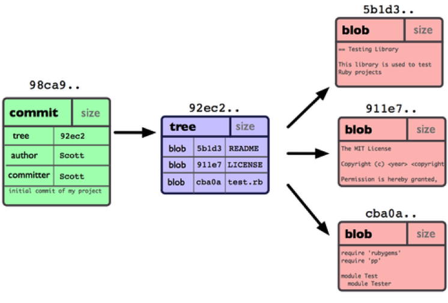

作些修改后再次提交，那么这次的提交对象会包含一个指向上次提交对象的指针（即下图中的 parent 对象）。两次提交后，仓库历史会这个样子：

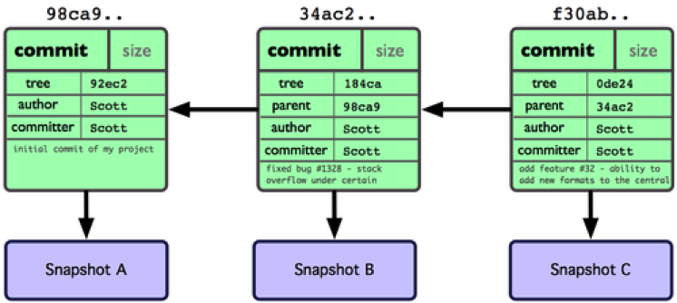

Git 中的分支，其实本质上仅仅是个指向 commit 对象的可变指针。Git 会使用 master 作为分支的默认名字。在若干次提交后，其实已经有了一个指向最后一次提交对象的 master 分支，它在每次提交的时候都会自动向前移动。

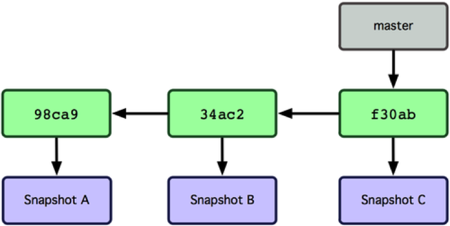

# 2、创建分支

创建一个新的名为“testing”分支，可以使用`git branch <branchName>`命令：

`git branch testing`

该命令会在当前 commit 对象上新建一个指针：

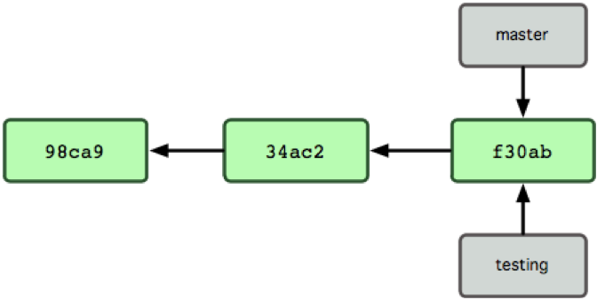

那么，Git 是如何知道你当前在哪个分支上工作的呢？其实答案也很简单，它保存着一个名为 **HEAD** 的特别指针。在 Git 中，它是一个指向正在工作中的本地分支的指针（可以将 HEAD 想象为当前分支的别名）。运行Git branch 命令，仅仅是建立了一个新的分支，但不会自动切换到这个分支中去，所以在这个例子中，我们依然还在 master 分支里工作。

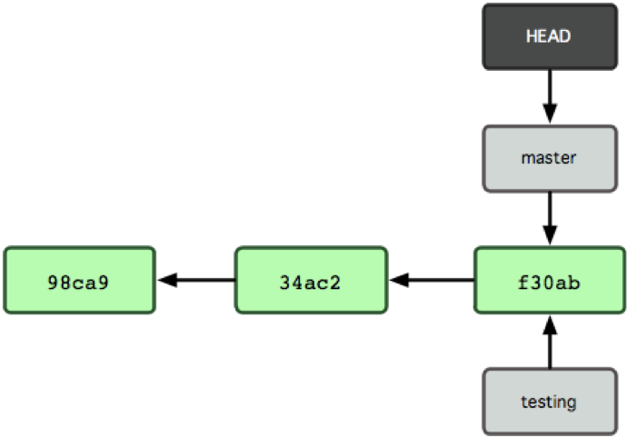

使用不带任何参数的`git branch`命令可以查看当前的分支情况：

> -* master
> testing

Git显示，共有两个分支，当前工作分支为master，分支列表中的星号“*”相当于HEAD指针，标注了当前工作分支。

# 3、切换分支

命令`git checkout <branchName>`可以将当前工作分支切换到名为branchName的分支。比如，运行命令：

`git checkout testing`

Git会提示：

> Switched to branch 'testing'

这样 HEAD 就指向了 testing 分支：

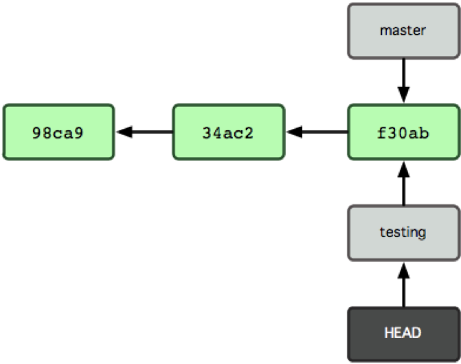

现在我们如果修改了工作区的文件，所有commit操作都是提交到testing分支，而非master。

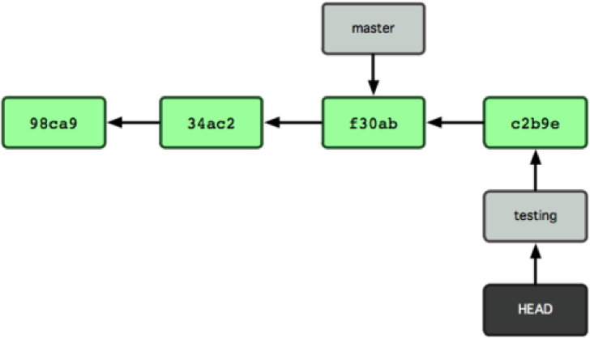

现在 testing 分支向前移动了一步，而 master 分支仍然指向原先 git checkout 时所在的 commit 对象。现在重新切换到master分支：

`git checkout master`

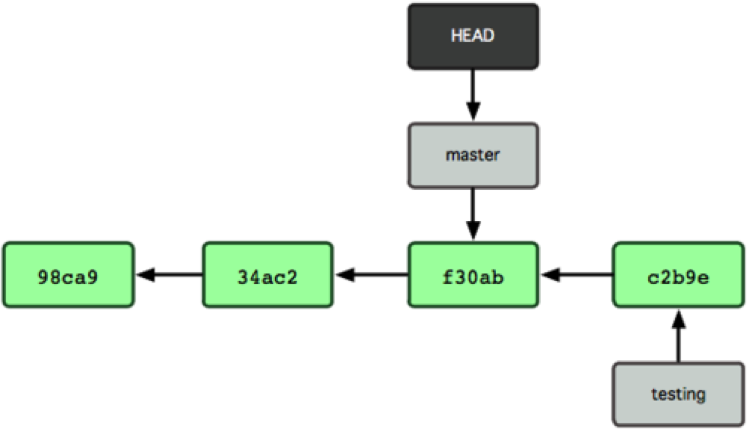

这条命令做了两件事。它把 HEAD 指针移回到 master 分支，并把工作目区的文件换成了 master 分支所指向的快照内容。也就是说，现在开始所做的改动，将始于本项目中一个较老的版本。它的主要作用是将 testing 分支里作出的修改暂时取消，这样你就可以向另一个方向进行开发。

在mast分支上再做些修改，然后提交。现在我们的项目提交历史产生了分叉，因为刚才我们创建了一个分支testing，转换到其中进行了一些工作，然后又回到原来的master主分支进行了另外一些工作。

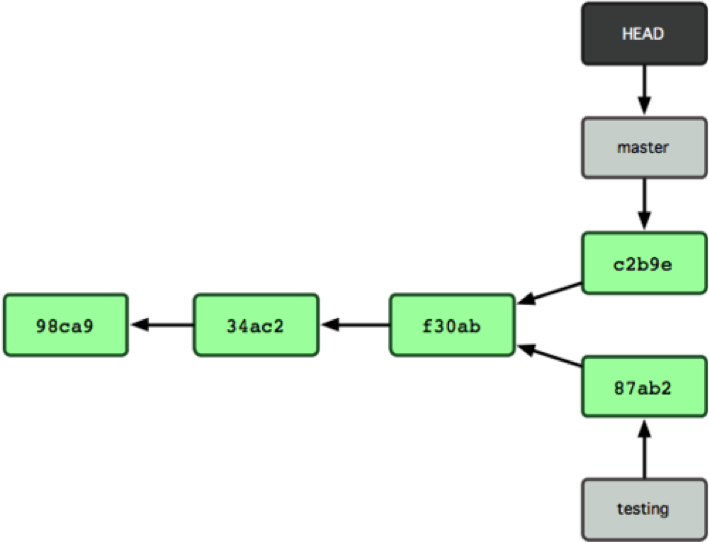

这些改变分别孤立在不同的分支里。我们可以在不同分支里反复切换，并在时机成熟时把它们合并到一起。
由于 Git 中的分支实际上仅是一个包含所指对象校验和（40 个字符长度 SHA-1 字串）的文件，所以创建和销毁一个分支就变得非常廉价。说白了，新建一个分支就是向一个文件写入 41 个字节（外加一个换行符）那么简单，当然也就很快。

# 4、合并分支

模拟这样的一个场景，早上到了公司接到新任务，新建一个名为“iss53”的分支来进行开发工作。要新建并切换到该分支，运行`git checkout` 并加上 `-b` 参数：

`git checkout -b iss53`

这相当于执行下面这两条命令：

```shell
git branch iss53
git checkout iss53
```

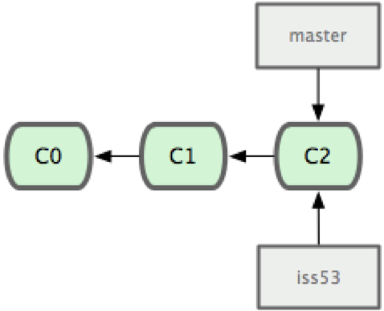

然后不断地写代码，提交代码：

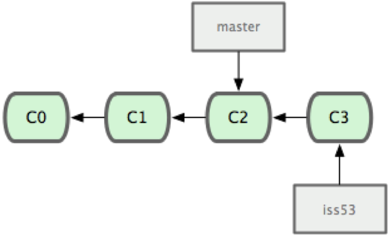

突然，接到通知，需要立即修复master分支上的一个严重bug。

第一步肯定需要切换到master。如果当前工作区与暂存区都是干净的，OK，直接切换回master即可。但是如果iss53分支上的开发还没有完成，并且不便于commit到版本库，怎么办？一旦切回到其他分支，工作区与暂存区就会被清空、覆盖。实际上，如果工作区或暂存区不是干净的，存在没有提交到版本库的更改，Git是不允许切换分支的，会提示：

> error: Your local changes to the following files would be overwritten by checkout:
> 	readme.txt
> Please, commit your changes or stash them before you can switch branches.

解决这个问题的办法就是`git stash`命令。

该命令可以获取工作目录的中间状态——也就是修改过的被追踪的文件和暂存的变更——并将它保存到一个未完结变更的堆栈中，随时可以重新应用。

运行“git stash”命令之后，iss53分支上未commit得变更就会被“储藏”起来，可以顺利地切换到master分支了。要查看现有的储藏，你可以使用 `git stash list`，会的到这样的一个列表：

> stash@{0}: WIP on testing: 049d078 …
> stash@{1}: WIP on testing: c264051 …
> stash@{2}: WIP on testing: 21d80a5 …

列出的是该分支上所有被stash过的编号，使用命令`git stash apply`即可恢复到最新stash过的场景。如果想应用更早的储藏，可以通过名字指定它，像这样：`git stash apply stash@{2}`。如果不指明编号，Git 默认使用最近的储藏并尝试应用它。

题归正转，我们切换到master分支，拉去一个名为“hotfix”的分支来紧急修复bug。

`git checkout -b 'hotfix'`

修复好之后，commit到版本库，则现在Git的分支结构如下图所示：

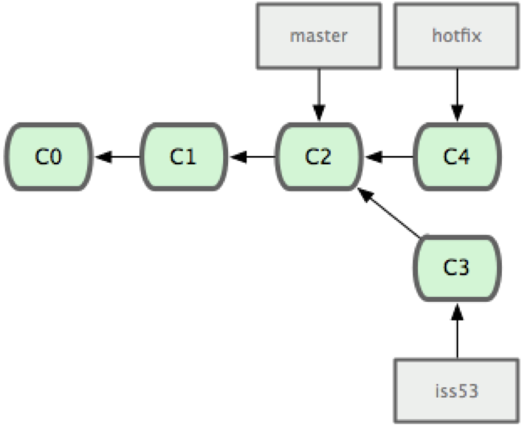

经测试之后，该bug成功修复，然后需要将该分支合并到master，首先依然要切换到master，然后使用命令`git merge`合并分支：

```shell
git checkout master
git merge hotfix
```

Git提示：

> Updating 771f6de..adea62a
> Fast-forward
>  …

请注意，合并时出现了“**Fast forward**”的提示。由于当前 master 分支所在的提交对象是要并入的 hotfix 分支的直接上游，Git 只需把master 分支指针直接右移。换句话说，如果顺着一个分支走下去可以到达另一个分支的话，那么 Git 在合并两者时，只会简单地把指针右移，因为这种单线的历史分支不存在任何需要解决的分歧，所以这种合并过程可以称为**快进**（Fast forward）。

现在最新的修改已经在当前 master 分支所指向的提交对象中了：

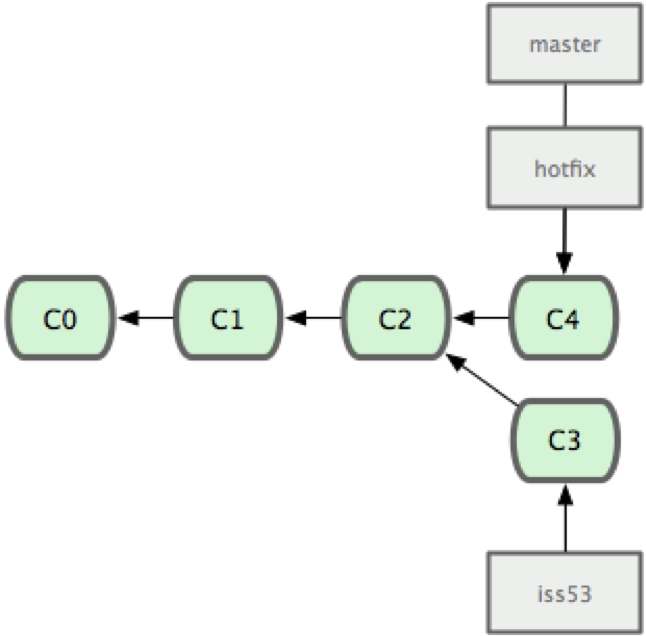

在那个超级重要的修补发布以后，就可以回继续之前未完成的工作。由于当前 hotfix 分支和 master 都指向相同的提交对象，所以hotfix 已经完成了历史使命，可以删掉了。使用 `git branch -d` 选项执行删除操作：

`git branch -d hotfix`

不用担心之前 hotfix 分支的修改内容尚未包含到 iss53 中来。如果确实需要纳入此次修补，可以用git merge master 把 master 分支合并到 iss53；或者等 iss53 完成之后，再将iss53 分支中的更新并入 master。

现在回到之前未完成的 iss53分支上继续工作，完成后commit到版本库。

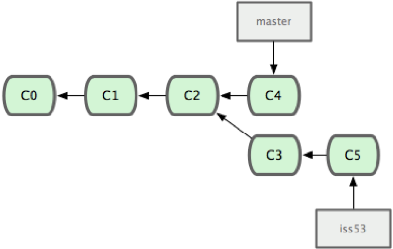

在问iss53 分支上的工作完成之后，可以合并回 master 分支。实际操作同前面合并 hotfix 分支差不多，只需回到master分支，运行 git merge 命令指定要合并进来的分支。

请注意，这次合并操作的底层实现，并不同于之前 hotfix 的并入方式。因为这次开发历史是从更早的地方开始分叉的。由于当前 master 分支所指向的提交对象（C4）并不是 iss53 分支的直接祖先，Git 不得不进行一些额外处理。就此例而言，Git 会用两个分支的末端（C4 和 C5）以及它们的共同祖先（C2）进行一次简单的三方合并计算。下图用红框标出了 Git 用于合并的三个提交对象：

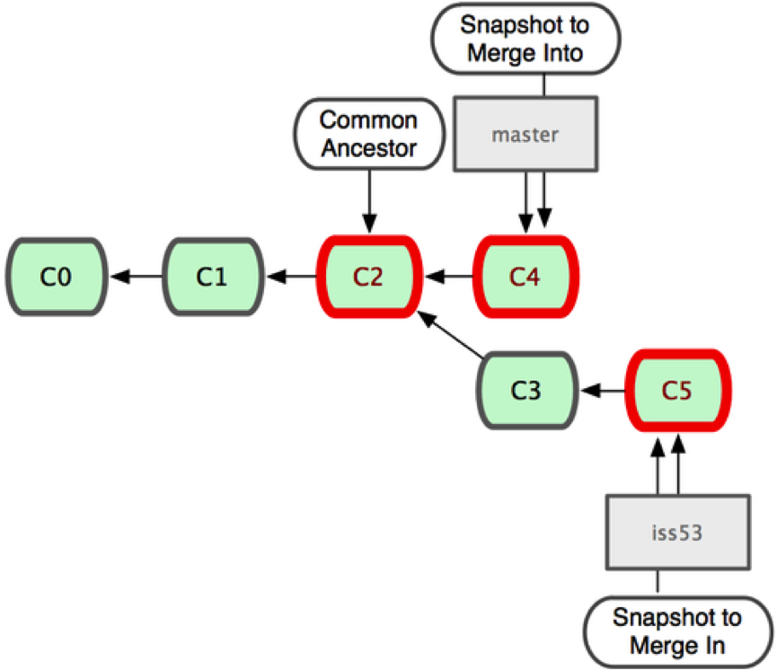

这次，Git 没有简单地把分支指针右移，而是对三方合并后的结果重新做一个新的快照，并自动创建一个指向它的提交对象（C6）。这个提交对象比较特殊，它有两个祖先（C4 和 C5）。

值得一提的是 Git 可以自己裁决哪个共同祖先才是最佳合并基础，不需要开发者手工指定合并基础。此特性让 Git 的合并操作比其他系统都要简单不少。

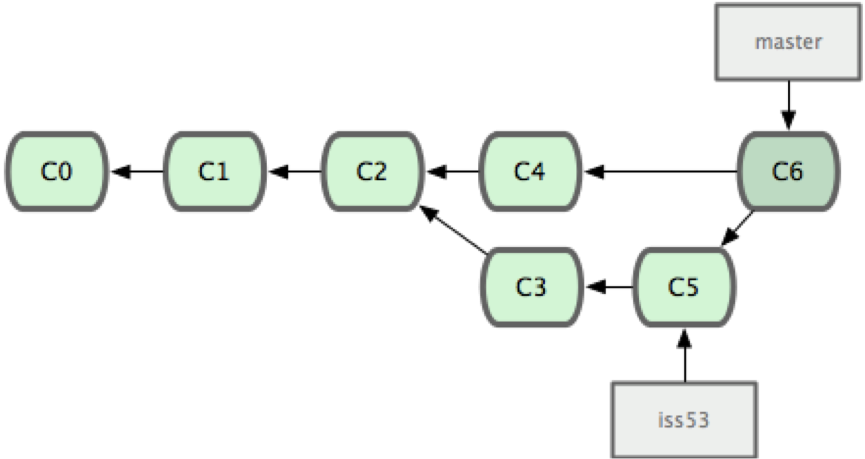

# 5、解决冲突

有时候合并操作并不会如此顺利。如果在不同的分支中都修改了同一个文件的同一部分，Git 就无法干净地把两者合到一起，逻辑上说，这种问题只能由人来裁决。这时候如果合并分支就会出现下面的结果：

> Auto-merging readme.txt
> CONFLICT (content): Merge conflict in readme.txt
> Automatic merge failed; fix conflicts and then commit the result.

Git 作了合并，但没有提交，它会停下来等你解决冲突。要看看哪些文件在合并时发生冲突，可以用 `git status` 查阅：

> On branch master
> You have unmerged paths.
>   (fix conflicts and run "git commit")
>
> Unmerged paths:
>   (use "git add <file>..." to mark resolution)
> 	both modified:   readme.txt
> no changes added to commit (use "git add" and/or "git commit -a")

任何包含未解决冲突的文件都会以**未合并**（unmerged）的状态列出。Git 会在有冲突的文件里加入标准的冲突解决标记，可以通过它们来手工定位并解决这些冲突。可以看到此文件包含类似下面这样的部分：

```shell
this is my first git project
<<<<<<< HEAD
add row on master branch

add annother row on master branch
=======
add row on testing branch
add another row on testing branch
>>>>>>> testing
```

可以看到 ======= 隔开的上半部分，是 HEAD（即 master 分支，在运行merge 命令时所切换到的分支）中的内容，下半部分是在 iss53 分支中的内容。解决冲突的办法无非是二者选其一或者由你亲自整合到一起。当然，Git插入的额外标记行也需要删除。

在解决了所有文件里的所有冲突后，运行 git add将把它们标记为已解决状态（实际上就是来一次快照保存到暂存区域）。因为一旦暂存，就表示冲突已经解决。

# 6、删除分支

分支合并到master之后，如果无特殊用途，应该及时删除分支。

要从该清单中筛选出已经（或尚未）与当前分支合并的分支，可以用 `--merged`和`--no-merged` 选项。

比如用`git branch --merged` 查看哪些分支已被并入当前分支，也就是说哪些分支是当前分支的直接上游：

> -* master
> testing

证明testing分支已经合并到master分支当中了，可以删除：

`git branch –d testing`

使用`git branch --no-merge`查看还没有合并的分支：

>   newTesting

如果使用命令`git branch –d newTesting`删除该分支，Git会提示：

> error: The branch 'newTesting' is not fully merged.
> If you are sure you want to delete it, run 'git branch -D newTesting'.

由于这些分支中还包含着尚未合并进来的工作成果，所以简单地用 Git branch -d 删除该分支会提示错误，因为那样做会丢失数据。

不过，如果你确实想要删除该分支上的改动，可以用大写的删除选项 -D 强制执行，就像上面提示信息中给出的那样。

