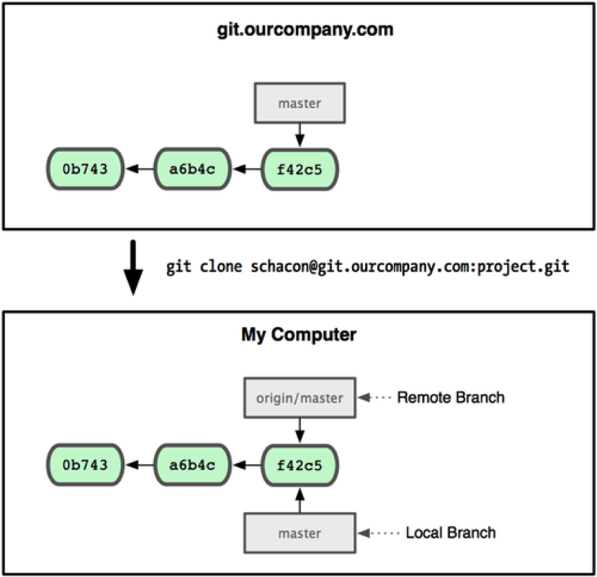
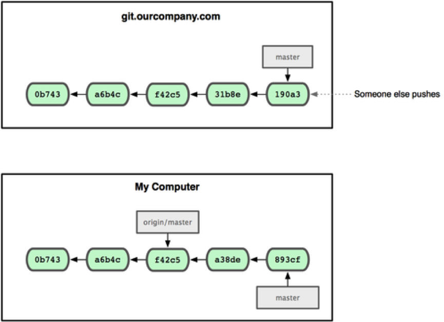
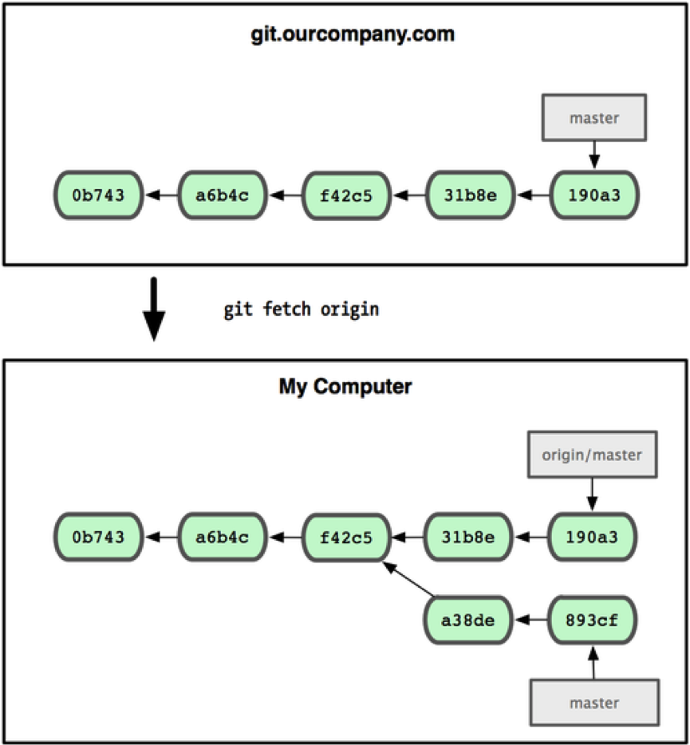

开篇就提到过，Git是一个分布式版本管理系统。但是到现在为止，所有的演练都是在本地Git仓库。如果想与他人合作，还需要一个远程的 Git 仓库。尽管技术上可以从个人的仓库里推送和拉取修改内容，但不鼓励这样做，因为一不留心就很容易弄混其他人的进度。另外，你也一定希望合作者们即使在自己不开机的时候也能从仓库获取数据——拥有一个更稳定的公共仓库十分有用。因此，更好的合作方式是建立一个大家都可以访问的共享仓库，从那里推送和拉取数据。我们将把这个仓库称为“Git 服务器”。

# 1、传输协议

理论上来说，Git 可以使用四种协议来传输数据：本地传输协议，SSH 协议，Git 协议和HTTP 协议。

## 1.1 本地传输协议

本地传输，其实就是在使用本地的某个Git仓库当做远程仓库。这常见于团队每一个成员都对一个共享的文件系统（例如NFS）拥有访问权。基于文件仓库的优点在于它的简单，同时保留了现存文件的权限和网络访问权限。如果团队已经有一个全体共享的文件系统，建立仓库就十分容易。

这种方法的缺点是，与基本的网络连接访问相比，难以控制从不同位置来的访问权限。

## 2.2 Git 协议

Git 协议是一个包含在 Git 软件包中的特殊守护进程； 它会监听一个提供类似于 SSH 服务的特定端口（9418），而无需任何授权。打算支持 Git 协议的仓库，需要先创建*git-export-daemon-ok* 文件——它是协议进程提供仓库服务的必要条件——但除此之外该服务没有什么安全措施。要么所有人都能克隆 Git 仓库，要么谁也不能。这也意味着该协议通常不能用来进行推送。你可以允许推送操作；然而由于没有授权机制，一旦允许该操作，网络上任何一个知道项目 URL 的人将都有推送权限。

Git 协议是现存最快的传输协议。如果在提供一个有很大访问量的公共项目，或者一个不需要对读操作进行授权的庞大项目，架设一个 Git 守护进程来供应仓库是个不错的选择。它使用与 SSH 协议相同的数据传输机制，但省去了加密和授权的开销。

Git 协议消极的一面是**缺少授权机制**。用 Git 协议作为访问项目的唯一方法通常是不可取的。一般的做法是，同时提供 SSH 接口，让几个开发者拥有推送（写）权限，其他人通过git:// 拥有只读权限。Git 协议可能也是最难架设的协议。它要求有单独的守护进程，需要定制。该协议还要求防火墙开放 9418 端口，而企业级防火墙一般不允许对这个非标准端口的访问。大型企业级防火墙通常会封锁这个少见的端口。

## 2.3 SSH 协议

SSH 是建立在应用层和传输层基础上的安全协议，可以有效防止远程管理过程中的信息泄露问题。通过SSH，可以把所有传输的数据进行加密，这样“中间人”这种攻击方式就不可能实现了，而且也能够防止DNS欺骗和IP欺骗。使用SSH，还有一个额外的好处就是传输的数据是经过压缩的，所以可以加快传输的速度。

Git 使用的传输协议中最常见就是 SSH 。因为大多数环境已经支持通过 SSH 对服务器的访问——即便还没有，架设起来也很容易。

使用 SSH 的好处有很多。首先，如果想拥有对网络仓库的写权限，基本上不可能不使用 SSH。其次，SSH 架设相对比较简单，而且很多操作系统都自带了它或者相关的管理工具。再次，通过 SSH 进行访问是安全的——所有数据传输都是加密和授权的。最后，和 Git 及本地协议一样，SSH 也很高效，会在传输之前尽可能压缩数据。

SSH 的限制在于不能通过它实现仓库的匿名访问。即使仅为读取数据，人们也必须在能通过 SSH 访问主机的前提下才能访问仓库，这使得 SSH 不利于开源的项目。但是如果是在公司网络里使用，SSH 绝对是首选协议。

## 1.4 HTTP/S 协议

HTTP 或 HTTPS 协议的优美之处在于架设的简便性。基本上，只需要把 Git 的裸仓库文件放在 HTTP 的根目录下，配置一个特定的post-update 挂钩（hook）就可以搞定。

HTTP 协议不会占用过多服务器资源。因为它一般只用到静态的 HTTP 服务提供所有数据，普通的 Apache 服务器平均每秒都能支撑数千个文件的并发访问。

HTTP 协议的消极面在于，相对来说客户端效率更低。克隆或者下载仓库内容可能会花费更多时间，而且 HTTP 传输的体积和网络开销比其他任何一个协议都大。

以上四个协议中，**本地传输协议与Git协议只会在实验中使用，企业级应用中普遍以SSH与HTTP为主**。

在与远程仓库进行信息交换之前，我们先要获得访问权限，对Git服务器上的某个项目，自己是否可读、是否可写。这就需要确立一个Git服务器有相互识别的手段，最常用、最可靠的就是公钥私钥认证，github上使用的就是这种手段，如何设置官网有详细的教程，不再赘述。

# 2、add操作

命令：

`git remote add [shortname] [url]`

可以将一个远程仓库与本地Git仓库关联起来。

比如，我在github上有一个名为“MyProject”的项目，在本地的Git仓库目录下运行：

`git remote add gitHubProject git@github.com:Winner2015/MyProject.git`

然后使用`git remote`查看现有的远程仓库列表：

> gitHubProject

`git@github.com:Winner2015/MyProject.git`是我的项目在github上的地址，“gitHubProject”是我给远程仓库起的别名，以后就可以用gitHubProject来代指这个远程仓库。

**注意**：该命令只是建立了本地Git仓库与一个URL地址（其实本质上就是一个字符串）的关联关系，但是这个URL存不存在（比如，你有可能输错了一个字母）、你有没有权限访问，Git暂时并不知道。

# 3、fetch操作

命令：

`git fetch [remote-name]`

可以从远程仓库抓取数据到本地。

例如，将刚添加的远程仓库拉取到本地：

`git fetch gitHubProject`

Git提示：

> warning: no common commits
> remote: Counting objects: 13, done.
> remote: Total 13 (delta 0), reused 0 (delta 0), pack-reused 13
> Unpacking objects: 100% (13/13), done.
> From github.com:Winner2015/MyProject
>
> -* [new branch]      master     -> gitHubProject/master

现在github上的项目MyProject已经抓取到本地了，`gitHubProject/master`代表该项目的master分支。

使用命令`git checkout gitHubProject/master`命令切换到该项目的master分支，Git会提示：

> Note: checking out 'gitHubProject/master'.
>
> You are in 'detached HEAD' state. You can look around, make experimental
> changes and commit them, and you can discard any commits you make in this state without impacting any branches by performing another checkout.
>
> If you want to create a new branch to retain commits you create, you may
> do so (now or later) by using -b with the checkout command again. Example:
>
>   git checkout -b <new-branch-name>

远程仓库虽然已经抓取到本地，但是并没有与本地的任何分支关联，所以Git警告，远程分支处于“detached HEAD”状态，游离于所有已知分支之外。

fetch 命令只是将远端的数据拉到本地仓库，并不自动合并到当前工作分支。 

实际上，如果我们想将自己的修改提交到远程仓库，首先必须提交到本地，然后再push到远程仓库。所以，应该将抓取下来的数据手工merge到某个现有分支或者新建的一个分支当中。

该命令在实际应用中很少使用，常用的是更高级的pull命令。

# 4、pull操作

如果设置了本地某个分支用于跟踪某个远端仓库的分支，可以使用 `git pull` 命令自动抓取数据下来，并将远端分支自动合并到本地仓库中当前分支（前提是该远程分支已经与本地的某个分支建立了关联）。在日常工作中我们经常这么用，既快且好。

命令格式如下：

`git pull [remote-name]`

pull之后，我们的本地分支很可能与远程分支出现冲突，同样需要解决之后才能顺利合并、提交。

# 5、push操作

项目进行到一个阶段，要同别人分享目前的成果，可以将本地仓库中的数据推送到远程仓库。实现这个任务的命令很简单： 

`git push [remote-name] [branch-name]`

某种情况下，初次运行git pull或者git push的时候，Git会提示说“no tracking information”，无法完成操作，则说明本地分支和远程分支之间的关联没有创建。用命令：

`git branch --set-upstream [branch-name] [origin/branch-name]`

可以将某个远程分支设置为本地分支的“上游”。

在版本较新的Git中，该命令已经不推荐使用，而是使用`--track`参数或`--set-upstream-to`参数。

创建本地分支并追踪远程某个分支，可以用一个命令搞定：

`git branch --track local_branchname origin/remote_branchname`

手动设置本地分支的上游时，推荐使用命令：

`git branch --set-upstream-to=origin/ remote_branchname`

取消对某个分支的跟踪，使用命令：

`git branch --unset-upstream local_branchname`

6、clone操作

使用clone命令可以将Git服务器上的数据克隆到本地，例如：

`git clone git@github.com:Winner2015/MyProject.git`

默认情况下`git clone` 命令自动创建本地的 master 分支用于跟踪远程仓库中的 master 分支，并且将远程仓库命名为“origin”。

使用命令`git remote show origin`可以查看名为“origin”的远程仓库的信息：

> -* remote origin
>   Fetch URL: git@github.com:Winner2015/MyProject.git
>   Push  URL: git@github.com:Winner2015/MyProject.git
>   HEAD branch: master
>   Remote branches:
>     master       tracked
>   Local branch configured for 'git pull':
>     master merges with remote master
>   Local ref configured for 'git push':
>     master pushes to master (up to date)

Git友好地告诉你，pull操作会将远程仓库的master分支自动与本地的master分支合并；类似地，push操作会自动将本地的master合并到远程的master分支。

# 6、删除和重命名

重命名命令：`git remote rename [newName]`

删除命令：`git remote rm [remoteName]`

注意：该命令只是将本地分支与远程分支之间的关联删除，而不是将远程仓库对应的分支删除。

# 7、实现原理

远程分支是对远程仓库中的分支的索引。它们是一些无法移动的本地分支；只有在 Git 进行网络交互时才会更新。远程分支就像是书签，提醒着上次连接远程仓库时上面各分支的位置。

我们用“远程仓库名/分支名”这样的形式表示远程分支。比如我们想看看上次同 origin 仓库通讯时master 的样子，就应该查看 origin/master 分支。

假设Git服务器地址为 git.ourcompany.com，如果从这里克隆，Git 会自动将此远程仓库命名为origin，并下载其中所有的数据，同时建立一个指向它的 master 分支的指针，在本地命名为origin/master，但你无法在本地更改其数据。接着，Git 建立一个属于你自己的本地master 分支，始于 origin 上 master分支相同的位置，你可以就此开始工作：

一次 Git 克隆会建立本地分支 master 和远程分支 origin/master，它们都指向 origin/master 分支的最后一次提交。

如果在本地 master 分支做了些改动，与此同时，其他人向 git.ourcompany.com 推送了他们的更新，那么服务器上的master 分支就会向前推进，而于此同时，在本地的提交历史正朝向不同方向发展。不过只要不和服务器通讯，你的 origin/master 指针仍然保持原位不会移动：

可以运行 `git fetch origin` 来同步远程服务器上的数据到本地。该命令首先找到 origin 是哪个服务器，从上面获取尚未拥有的数据，更新本地的数据库，然后把 origin/master 的指针移到它最新的位置上：

要想和其他人分享某个本地分支，需要把它push到一个拥有写权限的远程仓库。本地分支不会被自动同步到引入的远程服务器上，除非明确执行推送操作。换句话说，对于无意分享的分支，尽管保留为私人分支好了，而只推送那些协同工作要用到的特性分支。

如果有个叫 serverfix 的分支需要和他人一起开发，可以运行`git push origin serverfix`。也可以运行 ·git push origin serverfix:serferfix· 来实现相同的效果，它的意思是“上传我本地的 serverfix 分支到远程仓库中去，仍旧称它为 serverfix 分支”。通过此命令，可以把本地分支推送到某个命名不同的远程分支：若想把远程分支叫作awesomebranch，可以用 `git push origin serverfix:awesomebranch` 来推送数据。

接下来，当你的协作者再次从服务器上获取数据时，他们将得到一个新的远程分支 origin/serverfix。

值得注意的是，在 你的协作者fetch 好新的远程分支之后，仍然无法在本地编辑该远程仓库中的分支。换句话说，在本例中，不会有一个新的serverfix 分支，有的只是一个无法移动的 origin/serverfix 指针。

如果要把该内容合并到当前分支，可以运行 git merge origin/serverfix。如果想要一份自己的 serverfix 来开发，可以在远程分支的基础上分化出一个新的分支来：

`git checkout -b serverfix origin/serverfix`

这会切换到新建的 serverfix 本地分支，其内容同远程分支 origin/serverfix 一致，这样你就可以在里面继续开发了。

从远程分支 checkout 出来的本地分支，称为**跟踪分支**(tracking branch)。跟踪分支是一种和远程分支有直接联系的本地分支。在跟踪分支里输入`git push`，Git 会自行推断应该向哪个服务器的哪个分支推送数据。反过来，在这些分支里运行 git pull 会获取所有远程索引，并把它们的数据都合并到本地分支中来。

在克隆仓库时，Git 通常会自动创建一个名为 master 的分支来跟踪 origin/master。这正是`git push` 和 `git pull` 一开始就能正常工作的原因。当然，你可以随心所欲地设定为其它跟踪分支，比如origin 上除了 master 之外的其它分支：

`git checkout -b [分支名] [远程名]/[分支名]`

还可以“--track” 选项简化：

`git checkout --track origin/serverfix`

要为本地分支设定不同于远程分支的名字，只需在前个版本的命令里换个名字：

`git checkout -b sf origin/serverfix`

现在你的本地分支 sf 会自动向 origin/serverfix 推送和抓取数据了。

如果不再需要某个远程分支了，可以用这个非常无厘头的语法来删除它：

`git push [远程名]  :[分支名]`

如果想在服务器上删除serverfix 分支，运行下面的命令：

`git push origin :serverfix`

这个命令比较怪异，其实它与“git push [远程名] [本地分支]:[远程分支] ”的语法一样，只不过省略 [本地分支]，等于是在说“在这里提取空白然后把它变成[远程分支]”，也就是删除。

# 8、标签管理

发布一个版本时，我们通常先在版本库中打一个**标签**（tag），这样，就唯一确定了打标签时刻的版本。将来无论什么时候，取某个标签的版本，就是把那个打标签的时刻的历史版本取出来。所以，标签也是版本库的一个快照。

## 8.1 新建标签

Git 使用的标签有两种类型： 轻量级的（lightweight）和含附注的（annotated）。轻量级标签就像是个不会变化的分支，实际上它就是个指向特定提交对象的引用。而含附注标签，实际上是存储在仓库中的一个独立对象，它有自身的校验和信息，包含着标签的名字，电子邮件地址和日期，以及标签说明，标签本身也允许使用 GNU Privacy Guard (GPG) 来签署或验证。一般我们都建议使用含附注型的标签，以便保留相关信息；当然，如果只是临时性加注标签，或者不需要旁注额外信息，用轻量级标签也没问题。

创建一个含附注类型的标签非常简单，用 -a （取 annotated 的首字母）指定标签名字即可：

`git tag -a v1.1 -m 'My version 1.1'`

而 -m 选项则指定了对应的标签说明，Git 会将此说明一同保存在标签对象中。如果没有给出该选项，Git 会启动文本编辑软件供你输入标签说明。

轻量级标签实际上就是一个保存着对应提交对象的校验和信息的文件。要创建这样的标签，一个 -a，-s 或 -m 选项都不用，直接给出标签名字即可：

`git tag v1.1`

Git还支持对早先的某次提交加注标签。比如在下面展示的提交历史中，只要在打标签的时候跟上对应提交对象的校验和（或前几位字符）即可：
`git tag -a v1.2 9fceb02`

## 8.2 查看标签

列出现有标签的命令非常简单，直接运行：

`git tag`

显示的标签只是按字母顺序排列，并不表示重要程度的高低。

我们可以用特定的搜索模式列出符合条件的标签。在 Git 自身项目仓库中，有着超过 240 个标签，如果只对 1.4.2 系列的版本感兴趣，可以运行下面的命令：

`git tag -l 'v1.4.2.*' `

> v1.4.2.1 
> v1.4.2.2 
> v1.4.2.3 
> v1.4.2.4
> …

可以使用 git show 命令查看相应标签的版本信息，并连同显示打标签时的提交对象。

`git show v1.1`

> tag v1.1
> Tagger: chenlongfei <chenlongfei@163.com>
> Date:   Mon Jul 18 10:07:21 2016 +0800
> My version 1.1
> commit 91c233e97a5a88218b93bf1b57b9383377153587
> Author: chenlongfei <chenlongfei@163.com>
> Date:   Fri Jul 15 17:14:50 2016 +0800
> …

如果有自己的私钥，还可以用 GPG 来签署标签，只需要把之前的 -a 改为 -s （取signed 的首字母）即可。

## 8.3 推送标签

默认情况下，`git push` 并不会把标签传送到远端服务器上，只有通过显式命令才能分享标签到远端仓库。其命令格式如同推送分支，运行`git push origin [tagname]` 即可：

`git push origin v1.5`

如果要一次推送所有本地新增的标签上去，可以使用“--tags”选项。

## 8.4 删除标签

在本地删除标签很简单，加上“-d”参数：

`git tag -d v0.1`

如果标签已经推送到远程仓库，就要复杂一点，首先用上面的命令在本地删除，然后，将该操作cimmit之后push到远程仓库，push命令的格式如下：

`git push origin :refs/tags/v1.1`

与删除远程分支的语法类似。冒号前实际上是一个空对象，代表用一个空对象取代远程仓库的v1.1标签，其实就是删除操作。