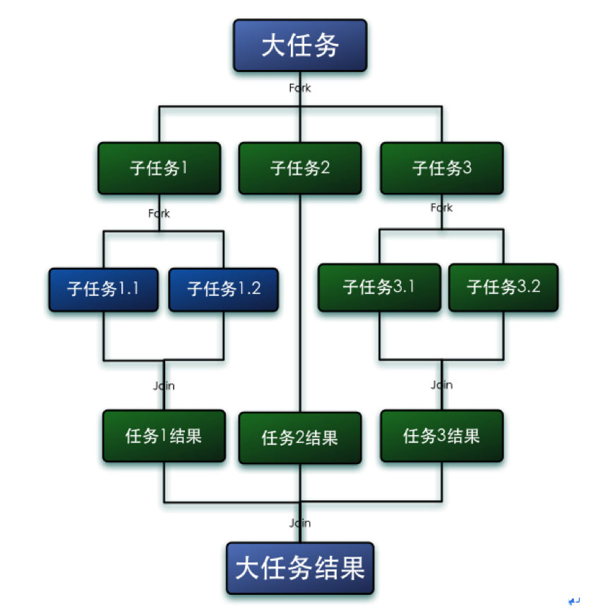
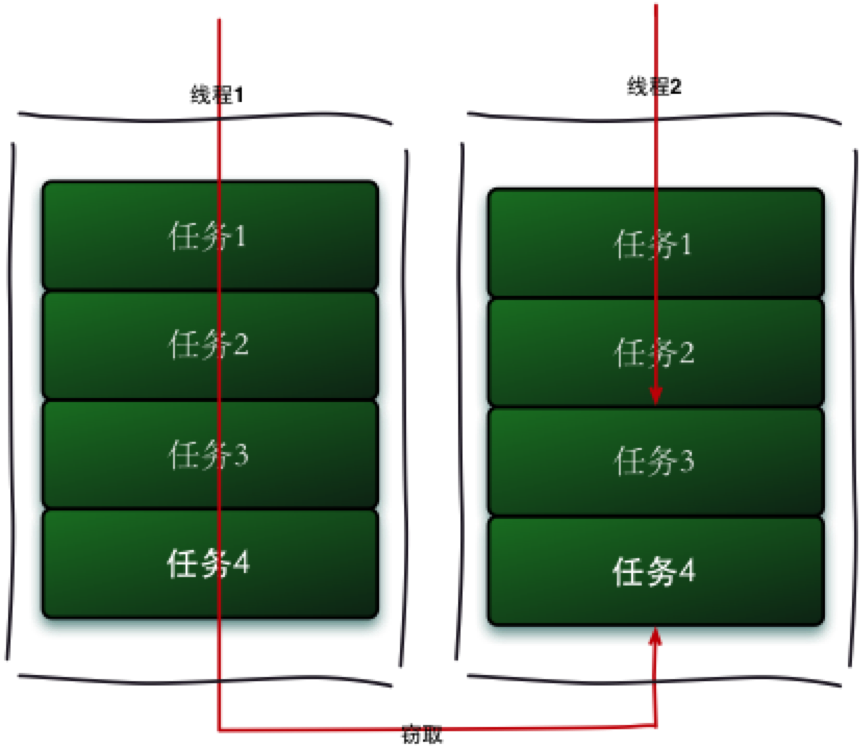
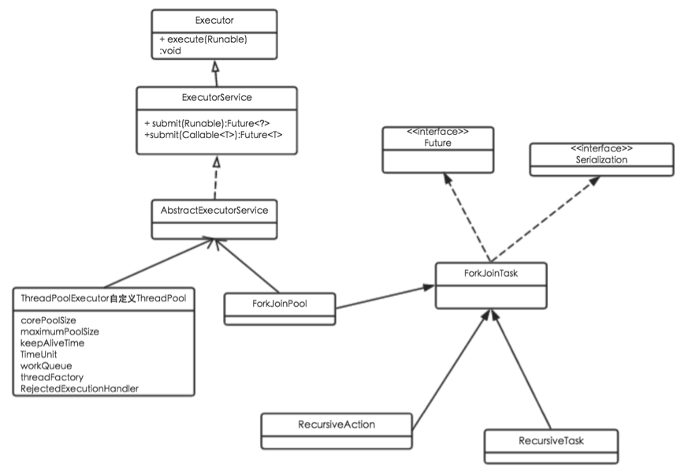

# 1、核心思想

Fork/Join框架是Java 7提供的一个用于并行执行任务的框架， 核心思想就是**把大任务分割成若干个小任务，最终汇总每个小任务结果后得到大任务结果**，其实现思想与MapReduce有异曲同工之妙。

Fork就是把一个大任务切分为若干子任务并行的执行，Join就是合并这些子任务的执行结果，最后得到这个大任务的结果。比如计算1+2+…＋10000，可以分割成10个子任务，每个子任务分别对1000个数进行求和，最终汇总这10个子任务的结果。Fork/Join的运行流程图如下：



Fork/Join框架使用一个巧妙的算法来平衡线程的负载，称为**工作窃取**（work-stealing）算法。工作窃取的运行流程图如下：



假如我们需要做一个比较大的任务，我们可以把这个任务分割为若干互不依赖的子任务，为了减少线程间的竞争，于是把这些子任务分别放到不同的队列里，并为每个队列创建一个单独的线程来执行队列里的任务，线程和队列一一对应，比如A线程负责处理A队列里的任务。但是有的线程会先把自己队列里的任务干完，而其他线程对应的队列里还有任务等待处理。干完活的线程与其等着，不如去帮其他线程干活，于是它就去其他线程的队列里窃取一个任务来执行。而在这时它们会访问同一个队列，所以为了减少窃取任务线程和被窃取任务线程之间的竞争，通常会使用双端队列，被窃取任务线程永远从双端队列的头部拿任务执行，而窃取任务的线程永远从双端队列的尾部拿任务执行。

工作窃取算法的优点是充分利用线程进行并行计算，并减少了线程间的竞争，其缺点是在某些情况下还是存在竞争，比如双端队列里只有一个任务时。并且消耗了更多的系统资源，比如创建多个线程和多个双端队列。

# 2、应用实例

Fork/Join框架主要由两部分组成：

- 分割任务。首先我们需要有一个fork类来把大任务分割成子任务，有可能子任务还是很大，所以还需要不停的分割，直到分割出的子任务足够小。
- 执行任务并合并结果。分割的子任务分别放在双端队列里，然后几个启动线程分别从双端队列里获取任务执行。子任务执行完的结果都统一放在一个队列里，启动一个线程从队列里拿数据，然后合并这些数据。

Fork/Join使用两个类来完成以上两件事情：

- **ForkJoinTask**
  我们要使用ForkJoin框架，必须首先创建一个ForkJoin任务。它提供在任务中执行`fork()`和`join()`操作的机制，通常情况下我们不需要直接继承`ForkJoinTask`类，而只需要继承它的子类，Fork/Join框架提供了以下两个子类：
  - **RecursiveAction**：用于没有返回结果的任务。
  - **RecursiveTask** ：用于有返回结果的任务。
- **ForkJoinPool** 
  `ForkJoinTask`需要通过`ForkJoinPool`来执行，任务分割出的子任务会添加到当前工作线程所维护的双端队列中，进入队列的头部。当一个工作线程的队列里暂时没有任务时，它会随机从其他工作线程的队列的尾部获取一个任务。

让我们通过一个简单的需求来使用下Fork／Join框架，需求是：计算1~8的累加结果。

使用Fork／Join框架首先要考虑到的是如何分割任务，如果我们希望每个子任务最多执行两个数的相加，那么设置分割的阈值是2，由于是8个数字相加，所以Fork／Join框架会把这个任务fork成两个子任务，子任务一负责计算1+2+3+4，子任务二负责计算3+4+5+6，然后子任务会继续分隔，直到累加的数字将为两个，最后逐层join子任务的结果。

```java
public class CountTask extends RecursiveTask<Integer> {

	private static final int THRESHHOLD = 2;
	private int start;
	private int end;

	public CountTask(int start, int end) {
		this.start = start;
		this.end = end;
	}

	@Override
	protected Integer compute() {
		System.out.println(start + " - " + end + " begin");
		int sum = 0;
		boolean canCompute = (end - start) <= THRESHHOLD;
		if (canCompute) { // 达到了计算条件，则直接执行
			for (int i = start; i <= end; i++) {
				sum += i;
			}
		} else { // 不满足计算条件，则分割任务
			int middle = (start + end) / 2;

			CountTask leftTask = new CountTask(start, middle);
			CountTask rightTask = new CountTask(middle + 1, end);

			leftTask.fork(); // 执行子任务
			rightTask.fork();
			int leftResult = leftTask.join(); // 等待子任务执行完毕
			int rightResult = rightTask.join();

			sum = leftResult + rightResult; // 合并子任务的计算结果
		}
		System.out.println(start + " - " + end + " end");
		return sum;
	}

	public static void main(String[] args) throws InterruptedException, ExecutionException {
		ForkJoinPool pool = new ForkJoinPool();
		CountTask task = new CountTask(1, 8);
		Future<Integer> future = pool.submit(task);
		if (task.isCompletedAbnormally()) {
			System.out.println(task.getException());
		} else {
			System.out.println("result: " + future.get());
		}

	}

}
```

打印结果：

> 1 - 8 begin
> 1 - 4 begin
> 5 - 8 begin
> 5 - 6 begin
> 5 - 6 end
> 1 - 2 begin
> 1 - 2 end
> 3 - 4 begin
> 3 - 4 end
> 7 - 8 begin
> 7 - 8 end
> 5 - 8 end
> 1 - 4 end
> 1 - 8 end
> result: 36

由于每个任务是由线程池执行的，每次的执行顺序会有不同，但是，父任务肯定在所有子任务之后完成，比如1-8的计算肯定在子任务1-4、5-8之后完成，但是1-4、5-8的完成顺序是不确定的。

`ForkJoinTask`在执行的时候可能会抛出异常，但是我们没办法在主线程里直接捕获异常，所以`ForkJoinTask`提供了`isCompletedAbnormally()`方法来检查任务是否已经抛出异常或已经被取消了，并且可以通过`ForkJoinTask`的`getException`方法获取异常。

`getException`方法返回`Throwable`对象，如果任务被取消了则返回`CancellationException`。如果任务没有完成或者没有抛出异常则返回null。

# 3、 源码解读



## 3.1 ForkJoinPool

`ForkJoinTask`代表一个需要执行的任务，真正执行这些任务的线程放在一个`ForkJoinPool`里面。`ForkJoinPool`是一个可以执行`ForkJoinTask`的`ExcuteService`，与`ExcuteService`不同的是它采用了`work-stealing`模式：所有在池中的空闲线程尝试去执行其他线程创建的子任务，这样就很少有线程处于空闲状态，非常高效。

池中维护着ForkJoinWorkerThread对象数组:

```java
    /**
     * Array holding all worker threads in the pool.  Initialized upon
     * construction. Array size must be a power of two.  Updates and
     * replacements are protected by scanGuard, but the array is
     * always kept in a consistent enough state to be randomly
     * accessed without locking by workers performing work-stealing,
     * as well as other traversal-based methods in this class, so long
     * as reads memory-acquire by first reading ctl. All readers must
     * tolerate that some array slots may be null.
          */
     ForkJoinWorkerThread[] workers;
```

`ForkJoinWorkerThread`为任务的执行线程，`workers`数组在构造方法中初始化，其大小必须为2的n次方（方便将取模转换为移位运算）。

ForkJoinPool初始化方法：

```java
// initialize workers array with room for 2*parallelism if possible
int n = parallelism << 1;
if (n >= MAX_ID)
  n = MAX_ID;
else { // See Hackers Delight, sec 3.2, where n < (1 << 16)
  n |= n >>> 1; n |= n >>> 2; n |= n >>> 4; n |= n >>> 8;
}
workers = new ForkJoinWorkerThread[n + 1];
```

可见，`workers`数组大小由`parallelism`属性决定，`parallelism`默认为处理器个数，`workers`数组**默认大小为处理器数量*2**，但是不能超过MAX_ID

`private static final int  MAX_ID     = 0x7fff;  // max poolIndex`

什么情况下需要添加线程呢？当新的任务到来，线程池会通知其他线程前去处理，如果这时没有处于等待的线程或者处于活动的线程非常少（这是通过ctl属性来判断的），就会往线程池中添加线程：

```java
/**
 * Tries to create and start a worker; minimally rolls back counts
 * on failure.
      */
    private void addWorker() {
    Throwable ex = null;
    ForkJoinWorkerThread t = null;
    try {
        t = factory.newThread(this);
    } catch (Throwable e) {
        ex = e;
    }
    if (t == null) {  // null or exceptional factory return
        long c;       // adjust counts
        do {} while (!UNSAFE.compareAndSwapLong
                     (this, ctlOffset, c = ctl,
                      (((c - AC_UNIT) & AC_MASK) |
                       ((c - TC_UNIT) & TC_MASK) |
                       (c & ~(AC_MASK|TC_MASK)))));
        // Propagate exception if originating from an external caller
        if (!tryTerminate(false) && ex != null &&
            !(Thread.currentThread() instanceof ForkJoinWorkerThread))
            UNSAFE.throwException(ex);
    }
    else
        t.start();
    }
```

增加线程通过`ForkJoinWorkerThreadFactory`来实现，底层实现方法为：

```java
    /**
     * Creates a ForkJoinWorkerThread operating in the given pool.
     *
     * @param pool the pool this thread works in
     * @throws NullPointerException if pool is null
     */
    protected ForkJoinWorkerThread(ForkJoinPool pool) {
        super(pool.nextWorkerName());
        this.pool = pool;
        int k = pool.registerWorker(this);
        poolIndex = k;
        eventCount = ~k & SMASK; // clear wait count
        locallyFifo = pool.locallyFifo;
        Thread.UncaughtExceptionHandler ueh = pool.ueh;
        if (ueh != null)
            setUncaughtExceptionHandler(ueh);
        setDaemon(true);
    }
```

可见，该线程生成后需要回调ForkJoinPool. registerWorker在线程池中完成注册：

```java
    /**
     * Callback from ForkJoinWorkerThread constructor to
     * determine its poolIndex and record in workers array.
     *
     * @param w the worker
     * @return the worker's pool index
     */
    final int registerWorker(ForkJoinWorkerThread w) {
        /*
         * In the typical case, a new worker acquires the lock, uses
         * next available index and returns quickly.  Since we should
         * not block callers (ultimately from signalWork or
         * tryPreBlock) waiting for the lock needed to do this, we
         * instead help release other workers while waiting for the
         * lock.
         */
        for (int g;;) {
            ForkJoinWorkerThread[] ws;
            if (((g = scanGuard) & SG_UNIT) == 0 &&
                UNSAFE.compareAndSwapInt(this, scanGuardOffset,
                                         g, g | SG_UNIT)) {
                int k = nextWorkerIndex;
                try {
                    if ((ws = workers) != null) { // ignore on shutdown
                        int n = ws.length;
                        if (k < 0 || k >= n || ws[k] != null) {
                            for (k = 0; k < n && ws[k] != null; ++k)
                                ;
                            if (k == n)
                                ws = workers = Arrays.copyOf(ws, n << 1);
                        }
                        ws[k] = w;
                        nextWorkerIndex = k + 1;
                        int m = g & SMASK;
                        g = (k > m) ? ((m << 1) + 1) & SMASK : g + (SG_UNIT<<1);
                    }
                } finally {
                    scanGuard = g;
                }
                return k;
            }
            else if ((ws = workers) != null) { // help release others
                for (ForkJoinWorkerThread u : ws) {
                    if (u != null && u.queueBase != u.queueTop) {
                        if (tryReleaseWaiter())
                            break;
                    }
                }
            }
        }
    }
```

整个框架大量采用顺序锁，好处是不用阻塞，不好的地方是会有额外的循环。这里也是通过循环来注册这个线程，在循环的过程中有两种情况发生：

- `compareAndSwapInt`操作成功，扫描`workers`数组，找到一个为空的项，并把新创建的线程放在这个位置；如果没有找到，表示数组大小不够，则将数组扩大2倍；
- `compareAndSwapInt`操作失败，需要循环重新尝试直接成功为止，从代码中可以看出，即使是失败了，也不忘做一些额外的事：通知其他线程去执行没有完成的任务

`ForkJoinPool`可以通过`execute`提交`ForkJoinTask`任务，然后通过`ForkJoinWorkerThread. pushTask`实现。

```java
	/**
	 * Unless terminating, forks task if within an ongoing FJ computation in the
	 * current pool, else submits as external task.
	 */
	private <T> void forkOrSubmit(ForkJoinTask<T> task) {
		ForkJoinWorkerThread w;
		Thread t = Thread.currentThread();
		if (shutdown)
			throw new RejectedExecutionException();
		if ((t instanceof ForkJoinWorkerThread) && (w = (ForkJoinWorkerThread) t).pool == this)
			w.pushTask(task);
		else
			addSubmission(task);
	}

	/**
	 * Arranges for (asynchronous) execution of the given task.
	 *
	 * @param task
	 *            the task
	 * @throws NullPointerException
	 *             if the task is null
	 * @throws RejectedExecutionException
	 *             if the task cannot be scheduled for execution
	 */
	public void execute(ForkJoinTask<?> task) {
		if (task == null)
			throw new NullPointerException();
		forkOrSubmit(task);
	}
```

除此之外，`ForkJoinPool`还覆盖并重载了从`ExecutorService`继承过来的`execute`和`submit`方法外，可以接受`Runnable``与Callable`类型的任务。

和`ExecutorService`一样，`ForkJoinPool`可以调用`shutdown()`和 `shutdownNow()`来终止线程，会先设置每个线程的任务状态为`CANCELLED`，然后调用`Thread`的`interrupt`方法来终止每个线程。

与`ExcuteService`不同的是，`ForkJoinPool`除了可以执行`Runnable`任务外，还可以执行`ForkJoinTask`任务； `ExcuteService`中处于后面的任务需要等待前面任务执行后才有机会执行，而`ForkJoinPool`会采用`work-stealing`模式帮助其他线程执行任务，即**`ExcuteService`解决的是并发问题，而`ForkJoinPool`解决的是并行问题**。

## 3.2 ForkJoinWorkerThread

`ForkJoinWorkerThread`继承自`Thread`，受`ForkJoinPool`支配用以执行`ForkJoinTask`。

该类中有几个重要的域：

```java
    /**
     * Capacity of work-stealing queue array upon initialization.
     * Must be a power of two. Initial size must be at least 4, but is
     * padded to minimize cache effects.
     */
    private static final int INITIAL_QUEUE_CAPACITY = 1 << 13;

    /**
     * Maximum size for queue array. Must be a power of two
     * less than or equal to 1 << (31 - width of array entry) to
     * ensure lack of index wraparound, but is capped at a lower
     * value to help users trap runaway computations.
     */
    private static final int MAXIMUM_QUEUE_CAPACITY = 1 << 24; // 16M

    /**
     * The work-stealing queue array. Size must be a power of two.
     * Initialized when started (as oposed to when constructed), to
     * improve memory locality.
     */
    ForkJoinTask<?>[] queue;

    /**
     * The pool this thread works in. Accessed directly by ForkJoinTask.
     */
    final ForkJoinPool pool;

    /**
     * Index (mod queue.length) of next queue slot to push to or pop
     * from. It is written only by owner thread, and accessed by other
     * threads only after reading (volatile) queueBase.  Both queueTop
     * and queueBase are allowed to wrap around on overflow, but
     * (queueTop - queueBase) still estimates size.
     */
    int queueTop;

    /**
     * Index (mod queue.length) of least valid queue slot, which is
     * always the next position to steal from if nonempty.
     */
    volatile int queueBase;
    /**
     * The index of most recent stealer, used as a hint to avoid
     * traversal in method helpJoinTask. This is only a hint because a
     * worker might have had multiple steals and this only holds one
     * of them (usually the most current). Declared non-volatile,
     * relying on other prevailing sync to keep reasonably current.
     */
    int stealHint;

```

`ForkJoinWorkerThread`使用数组实现双端队列，用来盛放`ForkJoinTask`，`queueTop`指向对头，`queueBase`指向队尾。本地线程插入任务、获取任务都在队头进行，其他线程“窃取”任务则在队尾进行。

`poolIndex`本线程在`ForkJoinPool`中工作线程数组中的下标，`stealHint`保存了最近的窃取者(来窃取任务的工作线程)的下标(poolIndex)。注意这个值不准确，因为可能同时有很多窃取者来窃取任务，这个值只能记录其中之一。

添加任务：

```java
    /**
     * Pushes a task. Call only from this thread.
     *
     * @param t the task. Caller must ensure non-null.
     */
    final void pushTask(ForkJoinTask<?> t) {
        ForkJoinTask<?>[] q; int s, m;
        if ((q = queue) != null) {    // ignore if queue removed
            long u = (((s = queueTop) & (m = q.length - 1)) << ASHIFT) + ABASE;
            UNSAFE.putOrderedObject(q, u, t);
            queueTop = s + 1;         // or use putOrderedInt
            if ((s -= queueBase) <= 2)
                pool.signalWork();
            else if (s == m)
                growQueue();
        }
    }

```

首先将任务放在`queueTop`指向的队列位置，再将`queueTop`加1。

然后分析队列容量情况，当数组元素比较少时（1或者2），就调用`signalWork()`方法。`signalWork()`方法做了两件事：

- 唤醒当前线程;
- 当没有活动线程时或者线程数较少时，添加新的线程。

`else if `部分表示队列已满（队头指针=队列长度减1），调用`growQueue()`扩容。

join任务:

```java
    /**
     * Possibly runs some tasks and/or blocks, until joinMe is done.
     *
     * @param joinMe the task to join
     * @return completion status on exit
     */
    final int joinTask(ForkJoinTask<?> joinMe) {
        ForkJoinTask<?> prevJoin = currentJoin;
        currentJoin = joinMe;
        for (int s, retries = MAX_HELP;;) {
            if ((s = joinMe.status) < 0) {
                currentJoin = prevJoin;
                return s;
            }
            if (retries > 0) {
                if (queueTop != queueBase) {
                    if (!localHelpJoinTask(joinMe))
                        retries = 0;           // cannot help
                }
                else if (retries == MAX_HELP >>> 1) {
                    --retries;                 // check uncommon case
                    if (tryDeqAndExec(joinMe) >= 0)
                        Thread.yield();        // for politeness
                }
                else
                    retries = helpJoinTask(joinMe) ? MAX_HELP : retries - 1;
            }
            else {
                retries = MAX_HELP;           // restart if not done
                pool.tryAwaitJoin(joinMe);
            }
        }
    }

```

`join`操作类似插队，确保入参`joinMe`执行完毕后再进行后续操作。

这里面有个变量`retries`，表示可以重试的次数，最大值为`MAX_HELP=16`。重试的过程如下：

- 判断`joinMe`是否已完成（`joinMe.status < 0`），如果是，则直接返回。
- 判断`retries`是否用完了，如果是，则调用`pool.tryAwaitJoin()`阻塞当前新城，等待`joinMe`完成
- `retries`大于0，首先判断当前线程的任务队列`queue`是否为空（`queueTop != queueBase`），如果不为空，调用`localHelpJoinTask()`方法，判断`joinMe`任务是否在自己的`queue`的队首位置，如果正好在，执行该任务；同时，由于`queue`不为空，则证明自己并不是没事干，无法帮助别的线程干活（工作窃取），`retries`置零
- 如果自己的`queue`为空了，调用`helpJoinTask()`方法进行工作窃取，帮助其他线程干活，反正闲着也是闲着。
- 帮别人干活也不是每次都能成功，如果连续8次都失败了（`retries == MAX_HELP >>> 1`），说明人品不行，自己还是歇会吧，调用`Thread.yield()`让权。不过，让权之前还会做最有一次努力，调用`tryDeqAndExec()`，看看自己在等的任务是否在某个线程的队尾，在的话偷过来执行掉。

## 3.3 ForkJoinTask

当我们调用`ForkJoinTask`的`fork`方法时，程序会调用`ForkJoinWorkerThread`的`pushTask`方法异步的执行这个任务，然后立即返回结果。

```java
    /**
     * Arranges to asynchronously execute this task.  While it is not
     * necessarily enforced, it is a usage error to fork a task more
     * than once unless it has completed and been reinitialized.
     * Subsequent modifications to the state of this task or any data
     * it operates on are not necessarily consistently observable by
     * any thread other than the one executing it unless preceded by a
     * call to {@link #join} or related methods, or a call to {@link
     * #isDone} returning {@code true}.
     *
     * <p>This method may be invoked only from within {@code
     * ForkJoinPool} computations (as may be determined using method
     * {@link #inForkJoinPool}).  Attempts to invoke in other contexts
     * result in exceptions or errors, possibly including {@code
     * ClassCastException}.
     *
     * @return {@code this}, to simplify usage
     */
    public final ForkJoinTask<V> fork() {
        ((ForkJoinWorkerThread) Thread.currentThread())
            .pushTask(this);
        return this;
    }

```

可见，fork()操作是通过调用`ForkJoinWorkerThread.pushTask()`实现的。该方法在上面已做分析，不再赘述。

`join`方法的主要作用是阻塞当前线程并等待获取结果。代码如下：

```java
    /**
     * Returns the result of the computation when it {@link #isDone is
     * done}.  This method differs from {@link #get()} in that
     * abnormal completion results in {@code RuntimeException} or
     * {@code Error}, not {@code ExecutionException}, and that
     * interrupts of the calling thread do <em>not</em> cause the
     * method to abruptly return by throwing {@code
     * InterruptedException}.
     *
     * @return the computed result
     */
    public final V join() {
        if (doJoin() != NORMAL)
            return reportResult();
        else
            return getRawResult();
    }

    /**
     * Report the result of invoke or join; called only upon
     * non-normal return of internal versions.
     */
    private V reportResult() {
        int s; Throwable ex;
        if ((s = status) == CANCELLED)
            throw new CancellationException();
        if (s == EXCEPTIONAL && (ex = getThrowableException()) != null)
            UNSAFE.throwException(ex);
        return getRawResult();
    }

```

首先，它调用了`doJoin()`方法，通过`doJoin()`方法得到当前任务的状态来判断返回什么结果，任务状态有四种：

```java
private static final int NORMAL      = -1;
private static final int CANCELLED   = -2;
private static final int EXCEPTIONAL = -3;
private static final int SIGNAL      =  1;
```

- 如果任务状态是已完成，则直接返回任务结果。
- 如果任务状态是被取消，则直接抛出`CancellationException`。
- 如果任务状态是抛出异常，则直接抛出对应的异常。

再来看doJoin方法：

```java
private int doJoin() {
    int s; Thread t; ForkJoinWorkerThread wt; ForkJoinPool.WorkQueue w;
    return (s = status) < 0 ? s :
            ((t = Thread.currentThread()) instanceof ForkJoinWorkerThread) ?
                    (w = (wt = (ForkJoinWorkerThread)t).workQueue).
                            // 执行任务
                            tryUnpush(this) && (s = doExec()) < 0 ? s :
                            wt.pool.awaitJoin(w, this, 0L) :
                    // 阻塞非工作线程，直到工作线程执行完毕
                    externalAwaitDone();
}

final int doExec() {
    int s; boolean completed;
    if ((s = status) >= 0) {
        try {
            completed = exec();
        } catch (Throwable rex) {
            return setExceptionalCompletion(rex);
        }
        if (completed)
            s = setCompletion(NORMAL);
    }
    return s;
}
```

在`doJoin()`方法里，首先通过查看任务的状态，看任务是否已经执行完成，如果执行完成， 则直接返回任务状态；如果没有执行完，则从任务数组里取出任务并执行。如果任务顺利执行完成，则设置任务状态为`NORMAL`，如果出现异常，则记录异常，并将任务状态设置为`EXCEPTIONAL`。

