# 1、Buffer

## 1.1 概述

Java NIO中的Buffer用于和NIO通道进行交互，**是将数据移进移出通道的唯一方式**。缓冲区本质上是一块可以写入数据，然后可以从中读取数据的内存。这块内存被包装成NIO Buffer对象，并提供了一组方法，用来方便的访问该块内存。

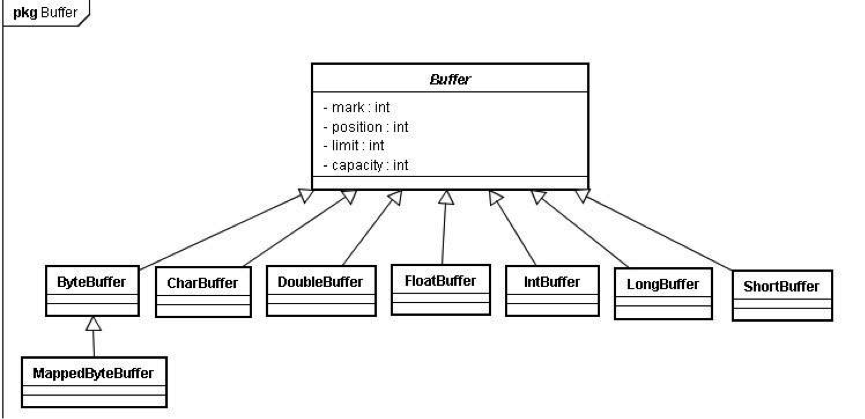

Java的NIO使用`ByteBuffer`、`CharBuffer`、`DoubleBuffer`、`FloatBuffer`、`IntBuffer`、`LongBuffer`、`ShortBuffer`覆盖了能通过IO发送的基本数据类型,还有个`Mappedyteuffer`用于表示内存映射文件。

## 1.2 实现原理

所有继承自`java.nio.Buffer`的缓冲区都有4个属性：`capacity`、`limit`、`position`、`mark`，并遵循：

> mark <= position <= limit <= capacity

- `capacity`：可以容纳的最大数据量，创建时被设定并且不能改变
- `limit`：能写入或者读取的数据上限 
- `position`：	当前正读到或者写到的位置，会随着读写操作而自增
- `mark`：一个标志量，可以暂存我们的读进度(读-写-读)

再来看看`Buffer`的操作方法，与上面列举的索引密切相关。

分配一个容量为12的缓冲区，初始化状态：


通过`put()`方法载入数据或从`Channel`中读取数据：

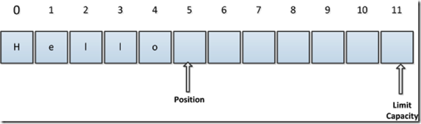

在上图的基础上进行`flip()`操作，由写模式转入读模式，则会进入下面的状态：

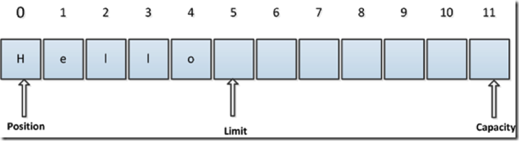

在上图基础上，进行`get()`操作或向Channel中写入数据，`position`会后移，直到`position=limit`，如下图：

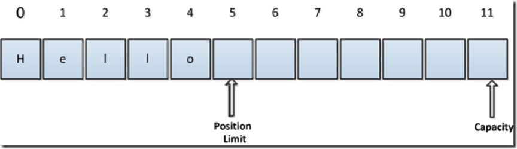


在上图基础上，进行`rewind()`的操作，`position`为0，`limit`不变，如下图，如需多次读取缓冲区数据，可以在两次读取之间使用`rewind()`。


假设新的状态如下图:

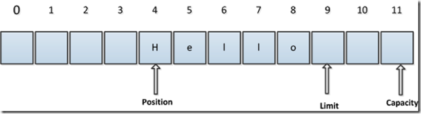

在新状态下进行`compact()`操作,进入下面状态：

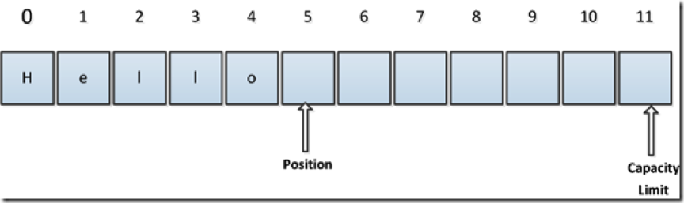

在新状态下进行`clear()`操作，返回到初始状态，即`position=0`，`limit=capacity`：

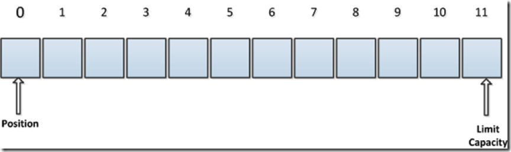

除此之外，Buffer还有两个特殊的方法：`mark()`与`reset()`方法，通过调用`mark()`方法，可以标记Buffer中的一个特定`position`，之后可以通过调用`reset()`方法恢复到这个`position`。

## 1.3 使用方法

这对`Buffer`的操作有两种模式：**读模式**与**写模式**。

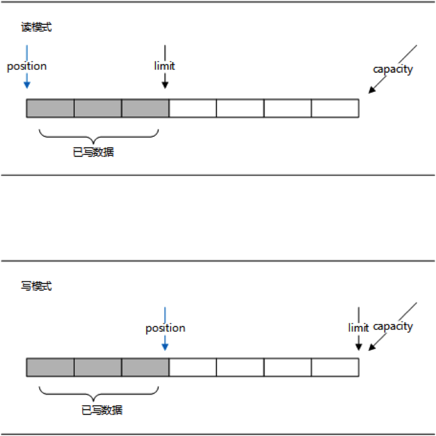

读模式的目标区域为数据填充区，`position`游标在数据填充区移动，`limit`为已写数据的边界；写模式的目标区域为数据空白区，`position`游标在数据空白区移动，`limit`为`Buffer`的容量边界。

当向`Buffer`写入数据时，`Buffer`会记录下写了多少数据。一旦要读取数据，需要通过`flip()`方法将Buffer从写模式切换到读模式。在读模式下，可以读取之前写入到buffer的所有数据。

一旦读完了所有的数据，就需要清空缓冲区，让它可以再次被写入。有两种方式能清空缓冲区：调用`clear()`或`compact()`方法。**`clear()`方法会清空整个缓冲区**；**`compact()`方法只会清除已经读过的数据**，任何未读的数据都被移到缓冲区的起始处，新写入的数据将放到缓冲区未读数据的后面。一个典型的例如如下：

```java
	Path file = Paths.get("test.txt");
	try (FileChannel fc = FileChannel.open(file, StandardOpenOption.WRITE, StandardOpenOption.READ)) {
		ByteBuffer buf = ByteBuffer.allocate(128); // 分配一个容量为128字节的Buffer
		while ((fc.read(buf)) != -1) { // 循环载入内容到Buffer
			buf.flip(); // 使Buffer由写模式转为读模式
			while (buf.hasRemaining()) {
				System.out.print((char) buf.get()); // 循环读取Buffer
			}
			buf.clear(); // 清理Buffer，为下一次写入做准备
		}
	} catch (Exception e) {
		e.printStackTrace();
	}
```

`clear()`这个方法命名给人的感觉就是将数据清空了，但是实际上却不是的，它并没有清空缓冲区中的数据，只是重置了对象中的三个索引值。因此，假设此次该Buffer中的数据是满的，下次读取的数据不足以填满缓冲区，那么就会存在上一次遗留下来的的数据，所以在判断缓冲区中是否还有可用数据时，使用`hasRemaining()`方法，在JDK中，这个方法的代码如下：

```java
	public final boolean hasRemaining() {
		return position < limit;
	}
```

在该方法中，比较了`position`和`limit`的值，用以判断是否还有可用数据，上次的遗留数据被隔离在`limit`之外，所以不会干扰本次的数据处理。

# 2、Channel

## 2.1 概述

Java NIO的通道类似流，但又有些不同：

- 既可以从通道中读取数据，又可以写数据到通道。但流的读写通常是单向的。
- 通道可以异步地读写。
- 通道中的数据总是要先读到一个Buffer，或者总是要从一个`Buffer`中写入。

这些是Java NIO中最重要的通道的实现：

- `FileChannel`：从文件中读写数据
- `DatagramChannel`：通过UDP读写网络中的数据
- `SocketChannel`：通过TCP读写网络中的数据
- `ServerSocketChannel`：可以监听新进来的TCP连接，像Web服务器那样。对每一个新进来的连接都会创建一个`SocketChannel`

Java NIO相对于旧的java.io库来说，并不是要取代，而是提出的三个新的设计思路：

- 对原始类型的读/写缓冲的封装
- 基于`Channel`的读写机制，对`Stream`的进一步抽象。
- 事件轮询/反应设计模式（即`Selector`机制）

按上述思路，而`Channel`机制是作为`Stream`的进一步抽象而产生的，那么`Channel`和`Stream`相比有什么不同呢？按字面理解实际上就可以获得信息：`Stream`作为流是有方向的，而`Channel`则只是通道，并没有指明方向。因此，读写操作都可以在同一个`Channel`里实现。`Channel`的命名强调了nio中数据输入输出对象的通用性，为非阻塞的实现提供基础。

在`Channel`的实现里，也存在只读通道和只写通道，这两种通道实际上抽象了`Channel`的读写行为。

至于`Channel`的IO阻塞状态读写，则和传统的java.io包类似。但多了一层缓冲而已。因此，按照原来的设计思路来用nio也是可行的，不过nio的设计本质上还是非阻塞输入输出控制，把控制权重新交给程序员。

因此，java.nio从设计角度看，就不是替代java.io包，而是为java.io提供更多的控制选择。

## 2.2 scatter/gather

Java NIO开始支持scatter/gather，scatter/gather用于描述从Channel中读取或者写入到`Channel`的操作。

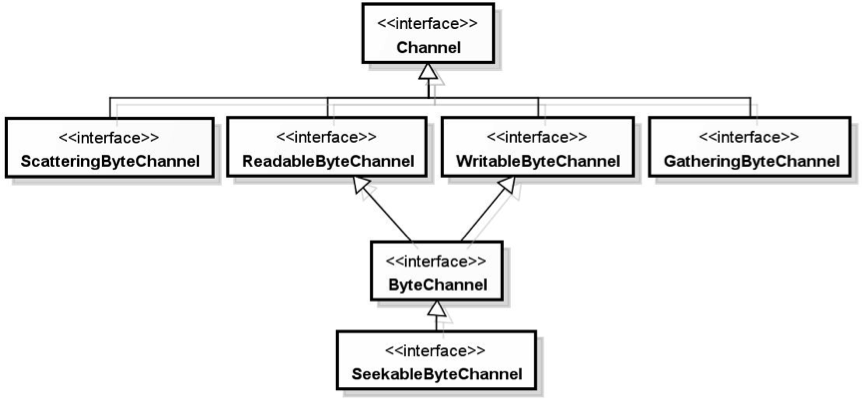

`ReadableByteChannel`、`WritableByteChannel`接口提供了通道的读写功能，而`ScatteringByteChannel`、`GatheringByteChannel`接口都新增了两个以缓冲区数组作为参数的相应方法。

scatter / gather经常用于需要将传输的数据分开处理的场合，例如传输一个由消息头和消息体组成的消息，你可能会将消息体和消息头分散到不同的`Buffer`中，这样你可以方便的处理消息头和消息体。

**分散（scatter）**：在读操作时将读取的数据写入多个buffer中。因此，`Channel`将从`Channel`中读取的数据“分散（scatter）”到多个`Buffer`中。如下图描述：

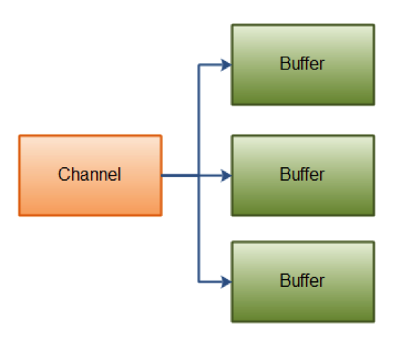

例如：

```java
	ByteBuffer header = ByteBuffer.allocate(128);
	ByteBuffer body = ByteBuffer.allocate(1024);

	ByteBuffer[] bufferArray = { header, body };

	channel.read(bufferArray);
```

注意`Buffer`首先被插入到数组，然后再将数组作为`channel.read()` 的输入参数。`read()`方法按照`Buffer`在数组中的顺序将从`Channel`中读取的数据写入到`Buffer`，当一个`Buffer`被写满后，`Channel`紧接着向另一个`Buffer`中写。

Scattering Reads在移动下一个`Buffer`前，必须填满当前的`Buffer`，这也意味着它不适用于动态消息（消息大小不固定)。换句话说，如果存在消息头和消息体，消息头必须完成填充（例如 128byte），Scattering Reads才能正常工作。

**聚集（gather）**：在写操作时将多个buffer的数据写入同一个`Channel`，因此，`Channel` 将多个`Buffer`中的数据“聚集（gather）”后发送到Channel。如下图描述：

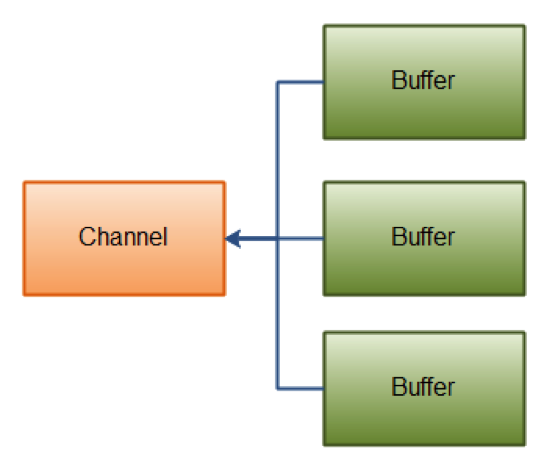

例如：

```java
	ByteBuffer header = ByteBuffer.allocate(128);
	ByteBuffer body = ByteBuffer.allocate(1024);

	ByteBuffer[] bufferArray = { header, body };

	channel.write(bufferArray);
```

`Buffer``数组是`write()`方法的入参，`write()`方法会按照`Buffer`在数组中的顺序，将数据写入到`Channel`，注意只有`position`和`limit`之间的数据才会被写入。因此，如果一个`Buffer`的容量为128byte，但是仅仅包含58byte的数据，那么这58byte的数据将被写入到`Channel`中。因此与Scattering Reads相反，Gathering Writes能较好的处理动态消息。

## 2.3 FileChannel

Java NIO中的`FileChannel`是一个连接到文件的通道。可以通过文件通道读写文件。

**FileChannel无法设置为非阻塞模式，它总是运行在阻塞模式下**。

在使用`FileChannel`之前，必须先打开它。有两种方法，一种是通过`File`，但是我们无法直接打开一个`FileChannel`，需要通过使用一个`InputStream`、`OutputStream`或`RandomAccessFile`来获取一个`FileChannel`实例。下面是通过`RandomAccessFile`打开FileChannel的示例：

```java
	RandomAccessFile aFile = new RandomAccessFile("data/nio-data.txt", "rw");
	FileChannel inChannel = aFile.getChannel();
```

`FileChannel`类的对象既可以通过直接打开文件的方式来创建，也可以从已有的流中得到。

`FileChannel`类的`open`方法用来打开一个新的文件通道。调用时的第一个参数是要打开的文件的路径，第二个参数是打开文件时的选项。不同的选项会对通道的能力产生影响。比如，当一个文件通道以只读的方式打开时，就不能通过write方法来写入数据。

```java
		Path file = Paths.get("my.txt");
		FileChannel channel = FileChannel.open(file, StandardOpenOption.CREATE, StandardOpenOption.WRITE);
```

在打开文件通道时可以选择的选项有很多，其中最常见的是读取和写入模式的选择，分别通过`java.nio.file.StandardOpenOption`枚举类型中的`READ`和`WRITE`来声明。

另外一种创建文件通道的方式是从已有的`FileInputStream`类、`FileOutputStream`类和`RandomAccessFile`类的对象中得到。这3个类都有一个`getChannel`方法来获取对应的`FileChannel`类的对象，所得到的`FileChannel`类的对象的能力取决于其来源流的特征。对`InputStream`类的对象来说，它所得到的`FileChannel`类的对象是只读的，而`FileOutputStream`类的对象所得到的通道是可写的，`RandomAccessFile`类的对象所得到的通道的能力则取决于文件打开时的选项。

```java
RandomAccessFile file = new RandomAccessFile("my.txt", "rw");
FileChannel inChannel = file.getChannel();
```

在Java NIO中，如果两个通道中有一个是`FileChannel`，那你可以直接将数据从一个`Channel`传输到另外一个`Channel`。
`FileChannel的transferFrom()`方法可以将数据从源通道传输到`FileChannel`中这个方法在JDK文档中的解释为将字节从给定的可读取字节通道传输到此通道的文件中。下面是一个简单的例子：

```java
	RandomAccessFile fromFile = new RandomAccessFile("fromFile.txt", "rw");
	FileChannel fromChannel = fromFile.getChannel();

	RandomAccessFile toFile = new RandomAccessFile("toFile.txt", "rw");
	FileChannel toChannel = toFile.getChannel();

	long position = 0;
	long count = fromChannel.size();

	toChannel.transferFrom(position, count, fromChannel);
```

方法的输入参数`position`表示从`position`处开始向目标文件写入数据，`count`表示最多传输的字节数。如果源通道的剩余空间小于 `count `个字节，则所传输的字节数要小于请求的字节数。

此外要注意，在`SoketChannel`的实现中，`SocketChannel`只会传输此刻准备好的数据（可能不足`count`字节）。因此，`SocketChannel`可能不会将请求的所有数据(`count`个字节)全部传输到FileChannel中。

`transferTo()`方法将数据从`FileChannel`传输到其他的`Channel`中。下面是一个简单的例子：

```java
	RandomAccessFile fromFile = new RandomAccessFile("fromFile.txt", "rw");
	FileChannel fromChannel = fromFile.getChannel();

	RandomAccessFile toFile = new RandomAccessFile("toFile.txt", "rw");
	FileChannel toChannel = toFile.getChannel();

	long position = 0;
	long count = fromChannel.size();

	fromChannel.transferTo(position, count, toChannel);
```

是不是发现这个例子和前面那个例子特别相似？除了调用方法的`FileChannel`对象不一样外，其他的都一样。

上面所说的关于`SocketChannel`的问题在t`ransferTo()`方法中同样存在。`SocketChannel`会一直传输数据直到目标buffer被填满。

有时可能需要在`FileChannel`的某个特定位置进行数据的读/写操作。可以通过调用`position()`方法获取`FileChannel`的当前位置。也可以通过调用`position(long pos)`方法设置FileChannel的当前位置。

如果将位置设置在文件结束符之后，然后试图从文件通道中读取数据，读方法将返回-1 —— 文件结束标志。

如果将位置设置在文件结束符之后，然后向通道中写数据，文件将撑大到当前位置并写入数据。这可能导致“文件空洞”，磁盘上物理文件中写入的数据间有空隙。

可以使用`FileChannel.truncate()`方法截取一个文件。截取文件时，文件将中指定长度后面的部分将被删除。如：

`channel.truncate(1024);`

这个例子截取文件的前1024个字节。

`FileChannel.force()`方法将通道里尚未写入磁盘的数据强制写到磁盘上。出于性能方面的考虑，操作系统会将数据缓存在内存中，所以无法保证写入到FileChannel里的数据一定会即时写到磁盘上。要保证这一点，需要调用`force()`方法。`force()`方法有一个boolean类型的参数，指明是否同时将文件元数据（权限信息等）写到磁盘上。

在对大文件进行操作时，性能问题一直比较难处理。通过操作系统的内存映射文件支持，可以比较快速地对大文件进行操作。内存映射文件的原理在于把系统的内存地址映射到要操作的文件上。读取这些内存地址就相当于读取文件的内容，而改变这些内存地址的值就相当于修改文件中的内容。被映射到内存地址上的文件在使用上类似于操作系统中使用的虚拟内存文件。通过内存映射的方式对文件进行操作时，不再需要通过I/O操作来完成，而是直接通过内存地址访问操作来完成，这就大大提高了操作文件的性能，因为访问内存地址比I/O操作要快得多。

`FileChannel`类的`map`方法可以把一个文件的全部或部分内容映射到内存中，所得到的是一个`ByteBuffer`类的子类`MappedByteBuffer`的对象，程序只需要对这个`MappedByteBuffer`类的对象进行操作即可。对这个`MappedByteBuffer`类的对象所做的修改会自动同步到文件内容中。

在进行内存映射时需要指定映射的模式，一共有3种可用的模式，由`FileChannel.MapMode`这个枚举类型来表示：

- `READ_ONLY`：表示只能对映射之后的MappedByteBuffer类的对象进行读取操作
- `READ_WRITE`：表示是可读可写的
- `PRIVATE`：通过MappedByteBuffer类的对象所做的修改不会被同步到文件中，而是被同步到一个私有的复本中。这些修改对其他同样映射了该文件的程序是不可见的。

内存映射文件的使用示例：

```java
	public void mapFile() throws IOException {
		try (FileChannel channel = FileChannel.open(Paths.get("src.data"), StandardOpenOption.READ,
				StandardOpenOption.WRITE)) {
			MappedByteBuffer buffer = channel.map(FileChannel.MapMode.READ_WRITE, 0, channel.size());
			byte b = buffer.get(1024 * 1024);
			buffer.put(5 * 1024 * 1024, b);
			buffer.force();
		}
	}
```

如果希望更加高效地处理映射到内存中的文件，把文件的内容加载到物理内存中是一个好办法。通过`MappedByteBuffer`类的`load`方法可以把该缓冲区所对应的文件内容加载到物理内存中，以提高文件操作时的性能。由于物理内存的容量受限，不太可能直接把一个大文件的全部内容一次性地加载到物理内存中。可以每次只映射文件的部分内容，把这部分内容完全加载到物理内存中进行处理。完成处理之后，再映射其他部分的内容。

由于I/O操作一般比较耗时，出于性能考虑，很多操作在操作系统内部都是使用缓存的。在程序中通过文件通道API所做的修改不一定会立即同步到文件系统中。如果在没有同步之前发生了程序错误，可能导致所做的修改丢失。因此，在执行完某些重要文件内容的更新操作之后，应该调用`FileChannel`类的`force`方法来强制要求把这些更新同步到底层文件中。可以强制同步的更新有两类，一类是文件的数据本身的更新，另一类是文件的元数据的更新。在使用`force`方法时，可以通过参数来声明是否在同步数据的更新时也同步元数据的更新。

## 2.4 SocketChannel与ServerSocketChannel

Java NIO中的`SocketChannel`是一个连接到TCP网络套接字的通道。可以通过以下2种方式创建：

- 打开一个`SocketChannel`并连接到互联网上的某台服务器。
- 一个新连接到达ServerSocketChannel时，会创建一个`SocketChannel`

```java
SocketChannel socketChannel = SocketChannel.open();
socketChannel.connect(new InetSocketAddress("192.168.0.1", 80));
```

`SocketChannel`的`read()`与`write()`操作与`FileChannel`类似，不同的是可以设置 `SocketChanne` 为非阻塞模式。设置之后，就可以在异步模式下调用`connect(),` `read()` 和`write()`了。非阻塞模式与选择器搭配会工作的更好，通过将一或多个`SocketChannel`注册到`Selector`，可以询问选择器哪个通道已经准备好了读取，写入等。

而`ServerSocketChannel` 是一个可以监听新进来的TCP连接的通道, 就像标准IO中的`ServerSocket`一样。通过调用 `ServerSocketChannel.open()` 方法来打开`ServerSocketChannel`，通过 `ServerSocketChannel.accept()` 方法监听新进来的连接。

下面的代码使用`SocketChannel`与`ServerSocketChannel`以非阻塞的方式实现客户端向服务端发送消息：

```java
public class Server {

	ServerSocketChannel serverSocketChannel;

	private void initServer(int port) throws IOException {
		serverSocketChannel = ServerSocketChannel.open();
		serverSocketChannel.bind(new InetSocketAddress(port));
		serverSocketChannel.configureBlocking(false); // 设置成非阻塞模式
		System.out.println("Server初始化成功");
	}

	private void listen() throws IOException {
		while (true) {
			// 如果是阻塞模式，程序会阻塞在这里，直到有连接进来，
			// 现在为非阻塞模式，无论有没有连接都会返回，socketChannel可能为null
			SocketChannel socketChannel = serverSocketChannel.accept();
			if (socketChannel != null) {
				read(socketChannel);
			}
		}
	}

	private void read(SocketChannel socketChannel) throws IOException {
		ByteBuffer buf = ByteBuffer.allocate(1024);

		// 非阻塞模式下,read()方法可能在尚未读取到任何数据时就返回了，所以需要判断
		while (socketChannel.read(buf) != -1) {
			buf.flip();
			System.out.println("收到消息: " + Charset.forName("UTF-8").decode(buf));
			buf.clear();
		}
	}

	public static void main(String[] args) throws IOException {
		Server server = new Server();
		server.initServer(8000);
		server.listen();
	}
}
```


```java
public class Client {

	SocketChannel socketChannel;

	private void initClient(String ip, int port) throws IOException {
		socketChannel = SocketChannel.open();
		socketChannel.configureBlocking(false);
		socketChannel.connect(new InetSocketAddress(ip, port));
	}

	private void sendMsg(String msg) throws IOException {
		ByteBuffer buf = ByteBuffer.wrap(msg.getBytes(Charset.forName("UTF-8")));
		socketChannel.write(buf);
	}

	public static void main(String[] args) throws IOException {
		Client client = new Client();
		client.initClient("127.0.0.1", 8000);

		while (!client.socketChannel.finishConnect()) {
			System.out.println("等待连接...");
		}
		client.sendMsg("今晚暗号:");
		client.sendMsg("天王盖地虎");
		client.sendMsg("宝塔镇河妖");
	}
}
```


## 2.5 DatagramChannel

Java NIO中的`DatagramChannel`是一个能收发UDP包的通道。因为UDP是无连接的网络协议，所以不能像其它通道那样读取和写入。

下面是 `DatagramChannel` 的打开方式：

```java
DatagramChannel channel = DatagramChannel.open();
channel.socket().bind(new InetSocketAddress(9999));
```

这个例子打开的 `DatagramChannel`可以在UDP端口9999上接收数据包。

通过receive()方法从DatagramChannel接收数据，如：

```java
ByteBuffer buf = ByteBuffer.allocate(48);
buf.clear();
channel.receive(buf);
```

`receive()`方法会将接收到的数据包内容复制到指定的Buffer，如果Buffer容不下收到的数据，多出的数据将被丢弃。

通过`send()`方法从`DatagramChannel`发送数据，如:

```java
String newData = "New String to write to file..." + System.currentTimeMillis();
ByteBuffer buf = ByteBuffer.allocate(48);
buf.clear();
buf.put(newData.getBytes());
buf.flip();
int bytesSent = channel.send(buf, new InetSocketAddress("127.0.0.1", 80));
```


这个例子发送一串字符到“127.0.0.1”服务器的UDP端口80。 因为服务端并没有监控这个端口，所以什么也不会发生。也不会通知你发出的数据包是否已收到，因为UDP在数据传送方面没有任何保证。

可以将`DatagramChannel`“连接”到网络中的特定地址的。由于UDP是无连接的，连接到特定地址并不会像TCP通道那样创建一个真正的连接。而是锁住`DatagramChannel` ，让其只能从特定地址收发数据。比如：

`channel.connect(new InetSocketAddress("127.0.0.1", 80));`

当连接后，也可以使用`read()`和`write()`方法，就像在用传统的通道一样。只是在数据传送方面没有任何保证。

## 2.6 Pipe

管道的概念对于Unix和类Unix操作系统的用户来说早就很熟悉了。Unix系统中，管道被用来连接一个进程的输出和另一个进程的输入。Java NIO中的`Pipe`类实现一个管道范例，不过它所创建的管道是进程内（在Java虚拟机进程内部）而非进程间使用的，也就是说，Pipe通常用于两个线程之间的通信。 

`Pipe`类定义了两个嵌套的通道类来实现管路。这两个类是`Pipe.SourceChannel`（管道负责读的一端）和`Pipe.SinkChannel`（管道负责写的一端）。

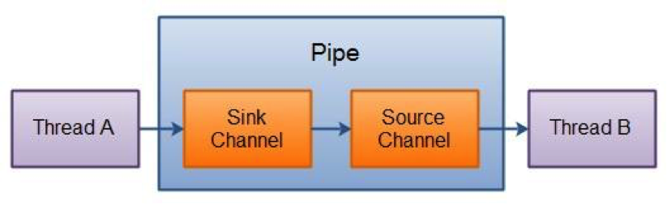

这两个通道实例是在Pipe对象创建的同时被创建的，可以通过在Pipe对象上分别调用source( )和sink( )方法来取回。
用法示例如下：

```java
public class PipeTest {
	public static void main(String[] args) throws IOException {
		Pipe pipe = Pipe.open();
		PipeWriter pipeWriter = new PipeWriter(pipe);
		PipeReader pipeReader = new PipeReader(pipe);

		ExecutorService exec = Executors.newFixedThreadPool(2);
		exec.submit(pipeWriter);
		exec.submit(pipeReader);
	}
}

class PipeWriter implements Callable<Boolean> {

	Pipe pipe;

	public PipeWriter(Pipe pipe) {
		this.pipe = pipe;
	}

	@Override
	public Boolean call() {
		try {
			SinkChannel sinkChannel = pipe.sink();
			for (int i = 10; i >= 0; i--) {
				String msg = "嫦娥6号飞船发射倒计时：" + i;
				ByteBuffer buf = ByteBuffer.wrap(msg.getBytes("UTF-8"));
				sinkChannel.write(buf);
				TimeUnit.SECONDS.sleep(1);
			}
			String msg = "嫦娥6号飞船发射成功！";
			ByteBuffer buf = ByteBuffer.wrap(msg.getBytes("UTF-8"));
			sinkChannel.write(buf);
		} catch (Exception e) {
			return false;
		}
		return true;
	}

}

class PipeReader implements Callable<Boolean> {

	Pipe pipe;

	public PipeReader(Pipe pipe) {
		this.pipe = pipe;
	}

	@Override
	public Boolean call() {
		try {
			SourceChannel sourceChannel = pipe.source();
			ByteBuffer buf = ByteBuffer.allocate(128);
			while ((sourceChannel.read(buf)) != -1) {
				buf.flip();
				System.out.println(Charset.forName("UTF-8").decode(buf));
				buf.clear();
			}
		} catch (Exception e) {
			return false;
		}
		return true;
	}

}
```

# 3、Selector

## 3.1 概述

Java NIO的选择器允许一个单独的线程来监视多个输入通道，多个通道可以共用一个选择器，然后使用一个单独的线程来“选择”通道：这些通道里已经有可以处理的输入，或者选择已准备写入的通道。这种选择机制，使得一个单独的线程很容易来管理多个通道。

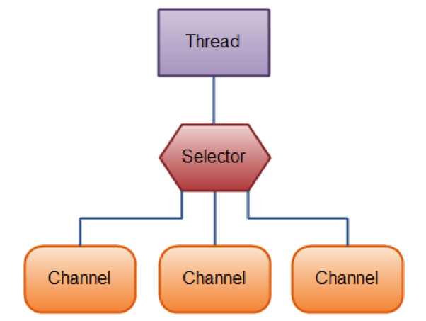

## 3.2 register

要使用`Selector`，得向`Selector`注册`Channel`，然后调用它的`select()`方法。这个方法会一直阻塞到某个注册的通道有事件就绪。一旦这个方法返回，线程就可以处理这些事件，事件的例子有如新连接进来，数据接收等。

在通道上可以注册我们感兴趣的事件。一共有以下四种事件：

- `SelectionKey.OP_ACCEPT`：服务端接收客户端连接事件
- `SelectionKey.OP_CONNECT`：客户端连接服务端事件
- `SelectionKey.OP_READ`：读事件
- `SelectionKey.OP_WRITE`：写事件

**与`Selector`一起使用时，`Channel`必须处于非阻塞模式下**。这意味着不能将`FileChannel`与`Selector`一起使用，因为`FileChannel`不能切换到非阻塞模式，而套接字通道都可以。

```java
	Selector selector = Selector.open();
	channel.configureBlocking(false);
	SelectionKey key = channel.register(selector, Selectionkey.OP_READ);
```

如果对不止一种事件感兴趣，那么可以用“位或”操作符将常量连接起来，如下：

```java
int interestSet = SelectionKey.OP_READ | SelectionKey.OP_WRITE;
SelectionKey key = channel.register(selector, interestSet);
```

可以将一个对象或者更多信息附着到`SelectionKey`上，这样就能方便的识别某个给定的通道。例如，可以附加与通道一起使用的`Buffer`，或是包含聚集数据的某个对象。使用方法如下：

```java
selectionKey.attach(theObject);
Object attachedObj = selectionKey.attachment()
```

还可以在用`register()`方法向`Selector`注册`Channel`的时候附加对象。如：

`SelectionKey key = channel.register(selector, SelectionKey.OP_READ, theObject);`

`SelectionKey`有四个方法连判断是否为某个事件，与上面的四种事件相对应：

```java
selectionKey.isAcceptable();
selectionKey.isConnectable();
selectionKey.isReadable();
selectionKey.isWritable();
```

## 3.3 select

一旦向`Selector`注册了一或多个通道，就可以调用`select()`方法返回你所感兴趣的事件（如连接、接受、读或写）已经准备就绪的那些通道。

`select()`阻塞到至少有一个通道在你注册的事件上就绪了。

`select(long timeout)`和`select()`一样，除了最长会阻塞`timeout`毫秒(参数)。

`selectNow()`不会阻塞，不管什么通道就绪都立刻返回；也可能没有任何通道就绪，则返回零。

`select()`方法返回的int值表示有多少通道已经就绪。亦即，自上次调用`select()`方法后有多少通道变成就绪状态。如果调用`select()`方法，因为有一个通道变成就绪状态，返回了1，若再次调用`select()`方法，如果另一个通道就绪了，它会再次返回1。如果对第一个就绪的channel没有做任何操作，现在就有两个就绪的通道，但在每次`select()`方法调用之间，只有一个通道就绪了。

调用`Selector`的`selectedKeys()`方法，可以访问“已选择键集（selected key set）”中的就绪通道：

```java
	Set selectedKeys = selector.selectedKeys();
	Iterator keyIterator = selectedKeys.iterator();
	while (keyIterator.hasNext()) {
		SelectionKey key = keyIterator.next();
		if (key.isAcceptable()) {
			// a connection was accepted by a ServerSocketChannel.
		} else if (key.isConnectable()) {
			// a connection was established with a remote server.
		} else if (key.isReadable()) {
			// a channel is ready for reading
		} else if (key.isWritable()) {
			// a channel is ready for writing
		}
		keyIterator.remove();
	}
```

注意每次迭代末尾的`keyIterator.remove()`调用。`Selector`不会自己从已选择键集中移除`SelectionKey`实例。必须在处理完通道时自己移除。下次该通道变成就绪时，`Selector`会再次将其放入已选择键集中。

`SelectionKey.channel()`方法返回的通道需要转型成要处理的类型，如`ServerSocketChannel`或`SocketChannel`等。

一个完整的例子：

```java
public class NIOServer {
	// 通道管理器
	private Selector selector;

	/**
	 * 获得一个ServerSocket通道，并对该通道做一些初始化的工作
	 * 
	 * @param port
	 *            绑定的端口号
	 * @throws IOException
	 */
	public void initServer(int port) throws IOException {
		// 获得一个ServerSocket通道
		ServerSocketChannel serverChannel = ServerSocketChannel.open();
		// 设置通道为非阻塞
		serverChannel.configureBlocking(false);
		// 将该通道对应的ServerSocket绑定到port端口
		serverChannel.socket().bind(new InetSocketAddress(port));
		// 获得一个通道管理器
		this.selector = Selector.open();
		// 将通道管理器和该通道绑定，并为该通道注册SelectionKey.OP_ACCEPT事件,注册该事件后，
		// 当该事件到达时，selector.select()会返回，如果该事件没到达selector.select()会一直阻塞。
		serverChannel.register(selector, SelectionKey.OP_ACCEPT);
	}

	/**
	 * 采用轮询的方式监听selector上是否有需要处理的事件，如果有，则进行处理
	 */
	public void listen() throws IOException {
		System.out.println("服务端启动成功！");
		// 轮询访问selector
		while (true) {
			// 当注册的事件到达时，方法返回；否则，该方法会一直阻塞
			selector.select();
			// 获得selector中选中的项的迭代器，选中的项为注册的事件
			Iterator ite = this.selector.selectedKeys().iterator();
			while (ite.hasNext()) {
				SelectionKey key = (SelectionKey) ite.next();
				// 删除已选的key，以防重复处理
				ite.remove();
				// 客户端请求连接事件
				if (key.isAcceptable()) {
					ServerSocketChannel server = (ServerSocketChannel) key.channel();
					// 获得和客户端连接的通道
					SocketChannel channel = server.accept();
					// 设置成非阻塞
					channel.configureBlocking(false);

					// 在这里可以给客户端发送信息
					channel.write(ByteBuffer.wrap(new String("向客户端发送了一条信息").getBytes()));
					// 在和客户端连接成功之后，为了可以接收到客户端的信息，需要给通道设置读的权限。
					channel.register(this.selector, SelectionKey.OP_READ);

					// 获得了可读的事件
				} else if (key.isReadable()) {
					read(key);
				}

			}

		}
	}

	/**
	 * 处理读取客户端发来的信息 的事件
	 * 
	 * @param key
	 * @throws IOException
	 */
	public void read(SelectionKey key) throws IOException {
		// 服务器可读取消息:得到事件发生的Socket通道
		SocketChannel channel = (SocketChannel) key.channel();
		// 创建读取的缓冲区
		ByteBuffer buffer = ByteBuffer.allocate(10);
		channel.read(buffer);
		byte[] data = buffer.array();
		String msg = new String(data).trim();
		System.out.println("服务端收到信息：" + msg);
		ByteBuffer outBuffer = ByteBuffer.wrap(msg.getBytes());
		channel.write(outBuffer);// 将消息回送给客户端
	}

	/**
	 * 启动服务端测试
	 * 
	 * @throws IOException
	 */
	public static void main(String[] args) throws IOException {
		NIOServer server = new NIOServer();
		server.initServer(8000);
		server.listen();
	}

}
```

# 4、AsynchronousChannel

NIO除了提供了非阻塞IO，还提供了异步IO。阻塞/非阻塞、同步/异步是两对比较容易混淆的概念，在此解释一下。

## 4.1 同步/异步

**同步/异步, 它们是消息的通知机制。**

所谓同步，就是在发出一个功能调用时，在没有得到结果之前，该调用就不返回。按照这个定义，其实绝大多数函数都是同步调用。但是一般而言，我们在说同步、异步的时候，特指那些需要其他部件协作或者需要一定时间完成的任务。

异步的概念和同步相对，当一个异步过程调用发出后，调用者不会立刻得到结果。实际处理这个调用的部件是在调用发出后，通过状态、消息、回调函数等来通知调用者来处理结果。

举个例子，小明他妈（调用方）派小明（被调用方）去车站迎接客人，小明一直在车站等到客人到达，把客人带回家，交给他妈。这就是同步调用。

小明嫌在车站等着无聊，改为每隔五分钟就出去看一次，立即回来告诉他妈客人到没到，这就是异步调用。

## 4.2阻塞/非阻塞

**阻塞/非阻塞, 它们是程序在等待消息(无所谓同步或者异步)时的状态。**

阻塞调用是指调用结果返回之前，当前线程会被挂起。有人也许会把阻塞调用和同步调用等同起来，实际上他是不同的。对于同步调用来说，很多时候当前线程还是激活的，只是从逻辑上当前函数没有返回而已。

非阻塞和阻塞的概念相对应，指在不能立刻得到结果之前，该函数不会阻塞当前线程，而会立刻返回。

还是小明他妈（调用方）派小明（被调用方）去车站迎接客人，在客人到来之前，小明他妈什么都不干，专心等待客人，这就是阻塞调用。

后来，小明他妈变聪明了，在客人到来之前，她可以洗菜、拖地、听听歌，客人来了之后再招待客人，这就是非阻塞调用

**同步大部分是阻塞的，异步大部分是非阻塞的，但是它们之间并没有必然的因果关系**。

## 4.3 异步通道

Java NIO中有三种异步通道：`AsynchronousFileChannel`、`AsynchronousServerSocketChannel`、`AsynchronousSocketChannel`。

异步调用主要有两种方式：**将来式**和**回调式**。

将来用式用`java.util.concurrent`包下的`Future`接口来保存异步操作的处理结果。这意味着当前线程不会因为比较慢的IO操作而停止，而是开启一个单独的线程发起IO操作，并在操作完成时返回结果。与此同时，主线程可以继续执行其他需要完成的任务。

从硬盘上的文件里读取100000字节，将来式可以这么做：

```java
	Path file = Paths.get("/Users/winner/Desktop/foobar.txt");
	try {
		AsynchronousFileChannel channel = AsynchronousFileChannel.open(file);
		ByteBuffer buffer = ByteBuffer.allocate(100_000);
		Future<Integer> result = channel.read(buffer, 0);
		while (!result.isDone()) {
			System.out.println("do someting else");
		}
		buffer.flip();
		System.out.println(Charset.forName("UTF-8").decode(buffer));
	} catch (Exception e) {

	}
```

`AsynchronousFileChannel`会关联线程池，可以在创建时指定，如果没有指定，JVM会为其分配一个系统默认的线程池（可能会与其他通道共享），默认线程池是由`AsynchronousChannelGroup`类定义的系统属性进行配置的。

回调式的基本思想是主线程会派一个`CompletionHandler`到独立的线程中执行IO操作，当IO操作完成后，会调用（或失败）`CompletionHandler的completed(failed)`方法。

异步事件一成功或失败就需要马上采取行动时，一般会采用回调式。

在异步IO活动结束后，接口`java.nio.channels.CompletionHandler<V,A>`会被调用，其中`V`是结果类型，`A`是提供结果的附着对象。

同样从硬盘上的文件里读取100000字节，回调式可以这么做：

```java
	try {
		AsynchronousFileChannel channel = AsynchronousFileChannel.open(file);
		ByteBuffer buffer = ByteBuffer.allocate(100_000);

		channel.read(buffer, 0, buffer, new CompletionHandler<Integer, ByteBuffer>() {

			@Override
			public void completed(Integer result, ByteBuffer attachment) {
				attachment.flip();
				System.out.println(Charset.forName("UTF-8").decode(attachment));
			}

			@Override
			public void failed(Throwable exc, ByteBuffer attachment) {
				System.out.println("Parse file failed:");
				exc.printStackTrace();
			}
		});

	} catch (Exception e) {
		e.printStackTrace();
	}
```

