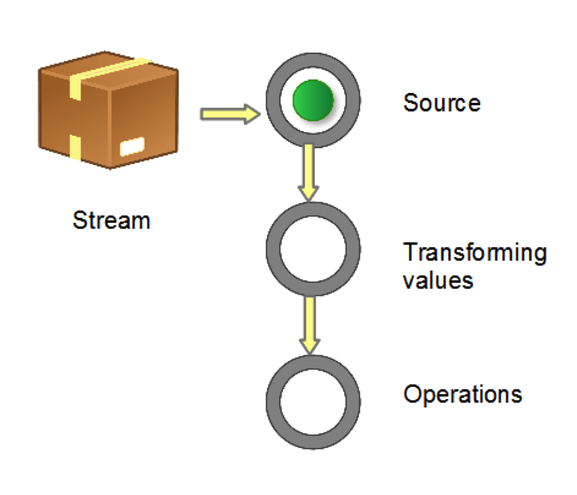

# 1、什么是Stream

Java 8之前的集合类库主要依赖于 **外部迭代**（external iteration）。 `Collection`实现 `Iterable`接口，从而使得用户可以依次遍历集合的元素。比如我们需要把一个集合中的形状都设置成红色，那么可以这么写：

```java
	for (Shape shape : shapes) {
		shape.setColor(RED);
	}
```

这个例子演示了外部迭代：for-each循环调用 `shapes`的 `iterator()`方法进行依次遍历。外部循环的代码非常直接，但它有如下问题：

- Java的for循环是串行的，而且必须按照集合中元素的顺序进行依次处理；
- 集合框架无法对控制流进行优化，例如通过排序、并行、短路（short-circuiting）求值以及惰性求值改善性能。

尽管有时for-each循环的这些特性（串行，依次）是我们所期待的，但它对改善性能造成了阻碍。

我们可以使用**内部迭代**（internal iteration）替代外部迭代，用户把对迭代的控制权交给类库，并向类库传递迭代时所需执行的代码，java 8中的内部迭代通过**访问者模式**(Visitor)实现。

下面是前例的内部迭代代码：

`shapes.forEach(s -> s.setColor(RED));`

尽管看起来只是一个小小的语法改动，但是它们的实际差别非常巨大。用户把对操作的控制权交还给类库，从而允许类库进行各种各样的优化（例如乱序执行、惰性求值和并行等等）。总的来说，内部迭代使得外部迭代中不可能实现的优化成为可能。

外部迭代同时承担了 *做什么*（把形状设为红色）和 *怎么做*（得到 Iterator实例然后依次遍历）两项职责，而内部迭代只负责 *做什么*，而把 *怎么做* 留给类库。通过这样的职责转变：用户的代码会变得更加清晰，而类库则可以进行各种优化，从而使所有用户都从中受益。

Java 8 API添加了一个新的抽象称为Stream，Stream 使用一种类似用 SQL 语句从数据库查询数据的直观方式来提供一种对 Java 集合运算和表达的高阶抽象。

这种风格将要处理的元素集合看作一种流， 流在管道中传输， 并且可以在管道的节点上进行处理， 比如筛选， 排序，聚合等。

Stream 不是集合元素，它不是数据结构并不保存数据，它是有关算法和计算的，它更像一个高级版本的 Iterator。原始版本的 Iterator，用户只能显式地一个一个遍历元素并对其执行某些操作；高级版本的 Stream，用户只要给出需要对其包含的元素执行什么操作，比如 “过滤掉长度大于 10 的字符串”、“获取每个字符串的首字母”等，Stream 会隐式地在内部进行遍历，做出相应的数据转换。

Stream 就如同一个迭代器（Iterator），单向，不可往复，数据只能遍历一次，遍历过一次后即用尽了，就好比流水从面前流过，一去不复返。

而和迭代器又不同的是，Stream 可以并行化操作，迭代器只能命令式地、串行化操作。顾名思义，当使用串行方式去遍历时，每个 item 读完后再读下一个 item。而使用并行去遍历时，数据会被分成多个段，其中每一个都在不同的线程中处理，然后将结果一起输出。Stream 的并行操作依赖于 Java7 中引入的 `Fork/Join` 框架来拆分任务和加速处理过程。

# 2、流的构成与转换

当我们使用一个流的时候，通常包括三个基本步骤：

- 获取一个数据源（source）
- 数据转换
- 执行操作获取想要的结果，

每次转换原有 Stream 对象不改变，返回一个新的 Stream 对象（可以有多次转换），这就允许对其操作可以像链条一样排列，变成一个管道，如下图所示：



流的操作类型分为两种：

- **Intermediate**：一个流可以后面跟随零个或多个 intermediate 操作。其目的主要是打开流，做出某种程度的数据映射/过滤，然后返回一个新的流，交给下一个操作使用。这类操作都是**惰性化的**（lazy），就是说，仅仅调用到这类方法，并没有真正开始流的遍历。
- **Terminal**：一个流只能有一个 terminal 操作，当这个操作执行后，流就被使用“光”了，无法再被操作。所以这必定是流的最后一个操作。Terminal 操作的执行，才会真正开始流的遍历，并且会生成一个结果，或者一个 side effect。
  在对于一个 Stream 进行多次转换操作 (Intermediate 操作)，每次都对 Stream 的每个元素进行转换，而且是执行多次，这样时间复杂度就是 N（转换次数）个 for 循环里把所有操作都做掉的总和吗？其实不是这样的，转换操作都是 lazy 的，多个转换操作只会在 Terminal 操作的时候融合起来，一次循环完成。我们可以这样简单的理解，Stream 里有个操作函数的集合，每次转换操作就是把转换函数放入这个集合中，在 Terminal 操作的时候循环 Stream 对应的集合，然后对每个元素执行所有的函数。

还有一种操作被称为 `short-circuiting`（短路）。用以指：

- 对于一个 intermediate 操作，如果它接受的是一个无限大（infinite/unbounded）的 Stream，但返回一个有限的新 Stream。
- 对于一个 terminal 操作，如果它接受的是一个无限大的 Stream，但能在有限的时间计算出结果。

当操作一个无限大的 Stream，而又希望在有限时间内完成操作，则在管道内拥有一个 `short-circuiting` 操作是必要非充分条件。

```java
int sum = widgets.stream().filter(w -> w.getColor() == RED).mapToInt(w -> w.getWeight()).sum();
```

`stream()` 获取source，`filter` 和 `mapToInt` 为 intermediate 操作，进行数据筛选和转换，最后一个 `sum()` 为 terminal 操作，对符合条件的作重量求和。

下面提供最常见的几种构造 Stream 的样例。

```java
		// 1. Individual values
		Stream stream = Stream.of("a", "b", "c");
		// 2. Arrays
		String[] strArray = new String[] { "a", "b", "c" };
		stream = Stream.of(strArray);
		stream = Arrays.stream(strArray);
		// 3. Collections
		List<String> list = Arrays.asList(strArray);
		stream = list.stream();
```

需要注意的是，对于基本数值型，目前有三种对应的包装类型 Stream：

`IntStream`、`LongStream`、`DoubleStream`。当然我们也可以用 `Stream<Integer>`、`Stream<Long>` 、

`Stream<Double>`，但是 boxing 和 unboxing 会很耗时，所以特别为这三种基本数值型提供了对应的 Stream。

Java 8 中还没有提供其它数值型 Stream，因为这将导致扩增的内容较多。而常规的数值型聚合运算可以通过上面三种 Stream 进行。

数值流的构造：

```java
	IntStream.of(new int[] { 1, 2, 3 }).forEach(System.out::println);
	IntStream.range(1, 3).forEach(System.out::println);
	IntStream.rangeClosed(1, 3).forEach(System.out::println);
```

流转换为其它数据结构：

```java
	// 1. Array
	String[] strArray1 = stream.toArray(String[]::new);
	// 2. Collection
	List<String> list1 = stream.collect(Collectors.toList());
	List<String> list2 = stream.collect(Collectors.toCollection(ArrayList::new));
	Set set1 = stream.collect(Collectors.toSet());
	Stack stack1 = stream.collect(Collectors.toCollection(Stack::new));
	// 3. String
	String str = stream.collect(Collectors.joining()).toString();
```

一个 Stream 只可以使用一次，上面的代码为了简洁而重复使用了数次。

# 3、流的操作

接下来，当把一个数据结构包装成 Stream 后，就要开始对里面的元素进行各类操作了。常见的操作可以归类如下。

- **Intermediate**： map (mapToInt, flatMap 等)、 filter、 distinct、 sorted、 peek、 limit、 skip、 parallel、 sequential、 unordered
- **Terminal**：forEach、 forEachOrdered、 toArray、 reduce、 collect、 min、 max、 count、 anyMatch、 allMatch、 noneMatch、 findFirst、 findAny、 iterator
- **Short-circuiting**：anyMatch、 allMatch、 noneMatch、 findFirst、 findAny、 limit

我们下面看一下 Stream 的比较典型用法。

## 3.1 map/flatMap

我们先来看 `map`。如果你熟悉 scala 这类函数式语言，对这个方法应该很了解，它的作用就是把 input Stream 的每一个元素，映射成 output Stream 的另外一个元素。

```java
	List<String> output = wordList.stream().map(String::toUpperCase).collect(Collectors.toList());
	// 这段代码把所有的单词转换为大写

	List<Integer> nums = Arrays.asList(1, 2, 3, 4);
	List<Integer> squareNums = nums.stream().map(n -> n * n).collect(Collectors.toList());
	// 这段代码生成一个整数 list 的平方数 {1, 4, 9, 16}
```

从上面例子可以看出，`map` 生成的是个 1:1 映射，每个输入元素，都按照规则转换成为另外一个元素。还有一些场景，是一对多映射关系的，这时需要 `flatMap`。

```java
	Stream<List<Integer>> inputStream = Stream.of(Arrays.asList(1), Arrays.asList(2, 3), Arrays.asList(4, 5, 6));
	Stream<Integer> outputStream = inputStream.flatMap((childList) -> childList.stream());
```

`flatMap` 把 input Stream 中的层级结构扁平化，就是将最底层元素抽出来放到一起，最终 output 的新 Stream 里面已经没有 List 了，都是直接的数字。

## 3.2 filter

`filter` 对原始 Stream 进行某项测试，通过测试的元素被留下来生成一个新 Stream。

```java
	Integer[] sixNums = { 1, 2, 3, 4, 5, 6 };
	Integer[] evens = Stream.of(sixNums).filter(n -> n % 2 == 0).toArray(Integer[]::new);
	// 经过条件“被 2 整除”的 filter，剩下的数字为 {2, 4, 6}

	List<String> output = reader.lines().flatMap(line -> Stream.of(line.split(REGEXP)))
			.filter(word -> word.length() > 0).collect(Collectors.toList());
```

这段代码首先把每行的单词用 `flatMap` 整理到新的 Stream，然后保留长度不为 0 的，就是整篇文章中的全部单词了。

## 3.3 forEach

`forEach` 方法接收一个 Lambda 表达式，然后在 Stream 的每一个元素上执行该表达式。

```java
	// Java 8
	roster.stream().filter(p -> p.getGender() == Person.Sex.MALE).forEach(p -> System.out.println(p.getName()));
	// Pre-Java 8
	for (Person p : roster) {
		if (p.getGender() == Person.Sex.MALE) {
			System.out.println(p.getName());
		}
	}
```

对一个人员集合遍历，找出男性并打印姓名。可以看出来，forEach 是为 Lambda 而设计的，保持了最紧凑的风格。而且 Lambda 表达式本身是可以重用的，非常方便。当需要为多核系统优化时，可以 `parallelStream().forEach()`，只是此时原有元素的次序没法保证，并行的情况下将改变串行时操作的行为，此时 forEach 本身的实现不需要调整，而 Java8 以前的 for 循环 code 可能需要加入额外的多线程逻辑。

但一般认为，`forEach` 和常规 for 循环的差异不涉及到性能，它们仅仅是函数式风格与传统 Java 风格的差别。

另外一点需要注意，**forEach 是 terminal 操作**，因此它执行后，Stream 的元素就被“消费”掉了，你无法对一个 Stream 进行两次 terminal 运算。下面的代码是错误的：

```java
	stream.forEach(element -> doOneThing(element));
	stream.forEach(element -> doAnotherThing(element));
```

相反，具有相似功能的 intermediate 操作 `peek` 可以达到上述目的。如下是出现在该 api javadoc 上的一个示例。

peek 对每个元素执行操作并返回一个新的 Stream：

```java
	Stream.of("one", "two", "three", "four").filter(e -> e.length() > 3)
			.peek(e -> System.out.println("Filtered value: " + e)).map(String::toUpperCase)
			.peek(e -> System.out.println("Mapped value: " + e)).collect(Collectors.toList());
```

`forEach` 不能修改自己包含的本地变量值，也不能用 break/return 之类的关键字提前结束循环。

## 3.4 findFirst

这是一个 termimal 兼 short-circuiting 操作，它总是返回 Stream 的第一个元素，或者空。

这里比较重点的是它的返回值类型：`Optional`。这也是一个模仿 Scala 语言中的概念，作为一个容器，它可能含有某值，或者不包含。使用它的目的是尽可能避免 NullPointerException。

`Optional` 的两个用例：

```java
	public static final void main(String[] args) {
		String strA = " abcd ", strB = null;
		print(strA);
		print("");
		print(strB);
		getLength(strA);
		getLength("");
		getLength(strB);

	}

	public static void print(String text) {
		// Java 8
		Optional.ofNullable(text).ifPresent(System.out::println);
		// Pre-Java 8
		if (text != null) {
			System.out.println(text);
		}
	}

	public static int getLength(String text) {
		// Java 8
		return Optional.ofNullable(text).map(String::length).orElse(-1);
		// Pre-Java 8
		// return if (text != null) ? text.length() : -1;
	};
```

在更复杂的 `if (xx != null)` 的情况中，使用 `Optional` 代码的可读性更好，而且它提供的是编译时检查，能极大的降低 NPE 这种 Runtime Exception 对程序的影响，或者迫使程序员更早的在编码阶段处理空值问题，而不是留到运行时再发现和调试。

Stream 中的 findAny、max/min、reduce 等方法等返回 `Optional` 值。还有例如 `IntStream.average()` 返回 `OptionalDouble` 等等。

## 3.5 reduce

这个方法的主要作用是把 Stream 元素组合起来。它提供一个起始值（种子），然后依照运算规则（BinaryOperator），和前面 Stream 的第一个、第二个、第 n 个元素组合。从这个意义上说，字符串拼接、数值的 sum、min、max、average 都是特殊的 `reduce`。例如 Stream 的 sum 就相当于

```java
	Integer sum = integers.reduce(0, (a, b) -> a + b);
	// or
	Integer sum = integers.reduce(0, Integer::sum);
```

也有没有起始值的情况，这时会把 Stream 的前面两个元素组合起来，返回的是 `Optional`。

`reduce` 的用例：

```java
	// 字符串连接，concat = "ABCD"
	String concat = Stream.of("A", "B", "C", "D").reduce("", String::concat);
	// 求最小值，minValue = -3.0
	double minValue = Stream.of(-1.5, 1.0, -3.0, -2.0).reduce(Double.MAX_VALUE, Double::min);
	// 求和，sumValue = 10, 有起始值
	int sumValue = Stream.of(1, 2, 3, 4).reduce(0, Integer::sum);
	// 求和，sumValue = 10, 无起始值
	sumValue = Stream.of(1, 2, 3, 4).reduce(Integer::sum).get();
	// 过滤，字符串连接，concat = "ace"
	concat = Stream.of("a", "B", "c", "D", "e", "F").filter(x -> x.compareTo("Z") > 0).reduce("", String::concat);
```

上面代码例如第一个示例的 `reduce()`，第一个参数（空白字符）即为起始值，第二个参数（`String::concat`）为 `BinaryOperator`。这类有起始值的 `reduce()` 都返回具体的对象。而对于第四个示例没有起始值的 `reduce()`，由于可能没有足够的元素，返回的是 `Optional`，请留意这个区别。

## 3.6 limit/skip

`limit` 返回 Stream 的前面 n 个元素；`skip` 则是扔掉前 n 个元素（它是由一个叫 subStream 的方法改名而来）。

`limit` 和 `skip` 对运行次数的影响

```java
	public void testLimitAndSkip() {
		List<Person> persons = new ArrayList();
		for (int i = 1; i <= 10000; i++) {
			Person person = new Person(i, "name" + i);
			persons.add(person);
		}
		List<String> personList2 = persons.stream().map(Person::getName).limit(10).skip(3).collect(Collectors.toList());
		System.out.println(personList2);
	}

	private class Person {
		public int no;
		private String name;

		public Person(int no, String name) {
			this.no = no;
			this.name = name;
		}

		public String getName() {
			System.out.println(name);
			return name;
		}
	}
```

输出结果为：

> name1
> name2
> name3
> name4
> name5
> name6
> name7
> name8
> name9
> name10
> [name4, name5, name6, name7, name8, name9, name10]

这是一个有 10，000 个元素的 Stream，但在 short-circuiting 操作 `limit` 和 `skip` 的作用下，管道中 `map` 操作指定的 `getName()` 方法的执行次数为 `limit `所限定的 10 次，而最终返回结果在跳过前 3 个元素后只有后面 7 个返回。

有一种情况是 limit/skip 无法达到 short-circuiting 目的的，就是把它们放在 Stream 的排序操作后，原因跟 `sorted` 这个 intermediate 操作有关：此时系统并不知道 Stream 排序后的次序如何，所以 `sorted` 中的操作看上去就像完全没有被 `limit`  或者 `skip` 一样。

limit 和 skip 对 sorted 后的运行次数无影响。

```java
	List<Person> persons = new ArrayList();for(
	int i = 1;i<=5;i++)
	{
		Person person = new Person(i, "name" + i);
		persons.add(person);
	}
	List<Person> personList2 = persons.stream().sorted((p1, p2) -> p1.getName().compareTo(p2.getName())).limit(2)
			.collect(Collectors.toList());System.out.println(personList2);
```

上面的代码首先对 5 个元素的 Stream 排序，然后进行 `limit` 操作。输出结果为：

> name2
> name1
> name3
> name2
> name4
> name3
> name5
> name4
> [stream.StreamDW$Person@816f27d, stream.StreamDW$Person@87aac27]

即虽然最后的返回元素数量是 2，但整个管道中的 `sorted` 表达式执行次数没有像前面例子相应减少。

最后有一点需要注意的是，对一个 parallel 的 Steam 管道来说，如果其元素是有序的，那么 `limit` 操作的成本会比较大，因为它的返回对象必须是前 n 个也有一样次序的元素。取而代之的策略是取消元素间的次序，或者不要用 parallel Stream。

## 3.7 sorted

对 Stream 的排序通过 `sorted` 进行，它比数组的排序更强之处在于可以首先对 Stream 进行各类 `map`、`filter`、`limit`、`skip` 甚至 distinct 来减少元素数量后，再排序，这能帮助程序明显缩短执行时间。

优化：排序前进行 `limit` 和 `skip`

```java
	List<Person> persons = new ArrayList();
	for (int i = 1; i <= 5; i++) {
		Person person = new Person(i, "name" + i);
		persons.add(person);
	}
	List<Person> personList2 = persons.stream().limit(2).sorted((p1, p2) -> p1.getName().compareTo(p2.getName()))
			.collect(Collectors.toList());
	System.out.println(personList2);
```

结果会简单很多：

> name2
> name1
> [stream.StreamDW$Person@6ce253f1, stream.StreamDW$Person@53d8d10a]

当然，这种优化是有 business logic 上的局限性的：即不要求排序后再取值。

## 3.8 min/max/distinct

`min` 和 `max` 的功能也可以通过对 Stream 元素先排序，再 `findFirst` 来实现，但前者的性能会更好，为 `O(n)`，而 `sorted` 的成本是 `O(n log n)`。同时它们作为特殊的 `reduce` 方法被独立出来也是因为求最大最小值是很常见的操作。

找出最长一行的长度：

```java
	BufferedReader br = new BufferedReader(new FileReader("c:\\SUService.log"));
	int longest = br.lines().mapToInt(String::length).max().getAsInt();
	br.close();
	System.out.println(longest);
```

下面的例子则使用 distinct 来找出不重复的单词。

找出全文的单词，转小写，并排序：

```java
	List<String> words = br.lines().flatMap(line -> Stream.of(line.split(" "))).filter(word -> word.length() > 0)
			.map(String::toLowerCase).distinct().sorted().collect(Collectors.toList());
	br.close();
	System.out.println(words);
```

## 3.9 match

Stream 有三个 match 方法，从语义上说：

- **allMatch**：Stream 中全部元素符合传入的 predicate，返回 true
- **anyMatch**：Stream 中只要有一个元素符合传入的 predicate，返回 true
- **noneMatch**：Stream 中没有一个元素符合传入的 predicate，返回 true

它们都不是要遍历全部元素才能返回结果。例如 `allMatch` 只要一个元素不满足条件，就 `skip` 剩下的所有元素，返回 false。

```java
	List<Person> persons = new ArrayList();
	persons.add(new Person(1, "name" + 1, 10));
	persons.add(new Person(2, "name" + 2, 21));
	persons.add(new Person(3, "name" + 3, 34));
	persons.add(new Person(4, "name" + 4, 6));
	persons.add(new Person(5, "name" + 5, 55));
	boolean isAllAdult = persons.stream().allMatch(p -> p.getAge() > 18);
	System.out.println("All are adult? " + isAllAdult);
	boolean isThereAnyChild = persons.stream().anyMatch(p -> p.getAge() < 12);
	System.out.println("Any child? " + isThereAnyChild);
```

输出结果：

> All are adult? false
> Any child? true

## 3.10 Stream.generate

通过实现 `Supplier` 接口，可以自己来控制流的生成。这种情形通常用于随机数、常量的 Stream，或者需要前后元素间维持着某种状态信息的 Stream。把 `Supplier` 实例传递给 `Stream.generate()` 生成的 Stream，默认是串行（相对 parallel 而言）但无序的（相对 `ordered` 而言）。由于它是无限的，在管道中，必须利用 `limit` 之类的操作限制 Stream 大小。

生成 10 个随机整数：

```java
	Random seed = new Random();
	Supplier<Integer> random = seed::nextInt;
	Stream.generate(random).limit(10).forEach(System.out::println);
	// Another way
	IntStream.generate(() -> (int) (System.nanoTime() % 100)).limit(10).forEach(System.out::println);
```

`Stream.generate()` 还接受自己实现的 `Supplier`。例如在构造海量测试数据的时候，用某种自动的规则给每一个变量赋值；或者依据公式计算 Stream 的每个元素值。这些都是维持状态信息的情形。

自实现 `Supplier`：

```java
	Stream.generate(new PersonSupplier()).limit(10)
			.forEach(p -> System.out.println(p.getName() + ", " + p.getAge()));
	private class PersonSupplier implements Supplier<Person> {
		private int index = 0;
		private Random random = new Random();

		@Override
		public Person get() {
			return new Person(index++, "StormTestUser" + index, random.nextInt(100));
		}
	}
```

输出结果：

> StormTestUser1, 9
> StormTestUser2, 12
> StormTestUser3, 88
> StormTestUser4, 51
> StormTestUser5, 22
> StormTestUser6, 28
> StormTestUser7, 81
> StormTestUser8, 51
> StormTestUser9, 4
> StormTestUser10, 76

## 3.11 Stream.iterate

`iterate` 跟 `reduce` 操作很像，接受一个种子值，和一个 `UnaryOperator`（例如 f）。然后种子值成为 Stream 的第一个元素，f(seed) 为第二个，f(f(seed)) 第三个，以此类推。

生成一个等差数列：

`Stream.iterate(0, n -> n + 3).limit(10). forEach(x -> System.out.print(x + " "));`

输出结果：

> 0 3 6 9 12 15 18 21 24 27

与 `Stream.generate` 相仿，在 `iterate` 时候管道必须有 `limit` 这样的操作来限制 Stream 大小。

# 4、并行处理

## 4.1 并行流

Stream接口可以通过收集源调用`parallelStream`方法来把集合转换为并行流。并行流就是把一个内容分成多个数据块，并用不同的线程分别处理每个数据块的流。

并行流内部使用了默认的`ForkJoinPool`，它默认的线程数量就是处理器数量，这个值是由

`Runtime.getRunTime().availableProcessors()`得到的。但是可以通过系统属性 `java.util.concurrent.ForkJoinPool.common.parallelism`来改变线程池大小。如下：

`System.setProperty("java.util.concurrent.ForkJoinPool.common.parallelism","12");`

使用正确的数据结构然后使其并行化工作能保证最佳的性能。特别注意原始类型的装箱和拆箱操作。

一些帮你决定某个特定情况下是否有必要使用并行流的建议：

- 有疑问，则亲自测试验证效果。把顺序流转化成并行流轻而易举，但却不一定是好事。**并行流并不总是比顺序流快**。
- 留意装箱。自动装箱和拆箱操作会大大降低性能。Java8中有原始类型流（`IntStream`,`LongStream`,`DoubleStream`）来避免这种操作，但凡有可能应该使用这些流。
- 有些操作本身在并行流上的性能就比顺序流差。特别是`limit`和`findFirst`等依赖于元素顺序的操作。
- 还要考虑流的操作流水线的总计算成本。
- 对于较小的数据量，选择并行几乎从来都不是一个好的决定。并行处理少数几个元素的好处还抵不上并行化造成的额外开销。
- 要考虑流背后的数据结构是否易于分解。如`ArrayList`的拆分效率比`LinkList`高得多，因为前者用不着遍历就可以平均拆分，而后者则必须遍历。另外，用`range`工厂方法创建的原始类型流也可以快速分解。

## 4.2 分支/合并框架

分支合并框架的目的是以递归方式将可以并行的任务拆分成更小的任务，然后将每个子任务的结果合并起来生成整体结果。这是`ExecutorService`接口的一个实现，它把子任务分配给线程池（称为`ForkJoinPool`）中的工作线程。

要把任务提交到这个池，必须创建`RecursiveTask<R>`的一个子类，其中`R`是并行化任务（以及所有子任务）产生的结果类型，或者如果任务不返回结果，则是`RecursiveAction`类型（当然它可能会更新其他非局部机构）。要定义`RecursiveTask`，只需要实现它唯一的抽象方法：

`protected abstract R compute();`

这个方法同时定义了将任务拆分成子任务的逻辑，以及无法再拆分或不方便再拆分时，生成单个子任务结果的逻辑。伪代码：

```
if(任务足够小或不可分){
    顺序计算该任务
}else{
    将任务分成两个子任务
    递归调用本方法，拆分每个子任务，等待所有子任务完成
    合并每个子任务的结果
}
```

选个例子为基础，让我们试着用这个框架为一个数字范围（这里用一个long[]数组表示）求和。需要先为`RecursiveTask`类做一个实现：

```java
public class ForkJoinSumCalculator extends java.util.concurrent.RecursiveTask<Long> {
	private final long[] numbers;
	private final int start;
	private final int end;
	public static final long THRESHOLD = 10_000;

	public ForkJoinSumCalculator(long[] numbers) {
		this(numbers, 0, numbers.length);
	}

	private ForkJoinSumCalculator(long[] numbers, int start, int end) {
		this.numbers = numbers;
		this.start = start;
		this.end = end;
	}

	@Override
	protected Long compute() {
		int length = end - start;
		if (length <= THRESHOLD) {
			return computeSequentially();
		}
		ForkJoinSumCalculator leftTask = new ForkJoinSumCalculator(numbers, start, start + length / 2);
		leftTask.fork();
		ForkJoinSumCalculator rightTask = new ForkJoinSumCalculator(numbers, start + length / 2, end);
		Long rightResult = rightTask.compute();
		Long leftResult = leftTask.join();
		return leftResult + rightResult;
	}

	private long computeSequentially() {
		long sum = 0;
		for (int i = start; i < end; i++) {
			{
				sum += numbers[i];
			}
			return sum;
		}
	}
}
```

测试方法：

```java
	public static long forkJoinSum(long n) {
		long[] numbers = LongStream.rangeClosed(1, n).toArray();
		ForkJoinTask<Long> task = new ForkJoinSumCalculator(numbers);
		return new ForkJoinPool().invoke(task);
	}
```

运行`ForkJoinSumCalculator` 当把`ForkJoinSumCalculator`任务传给`ForkJoinPool`时，这个任务就由池中的一个线程执行，这个线程会调用任务的`compute`方法。该方法会检查任务是否小到足以顺序执行，如果不够小则会把要求和的数组分成两半，分给两个新的`ForkJoinSumCalculator`，而它们也由`ForkJoinPool`安排执行。因此，这一过程可以递归重复，把原任务分为更小的任务，直到满足不方便或不可能再进一步拆分的条件。这时会顺序计算每个任务的结果，然后由分支过程创建的（隐含的）任务二叉树遍历回到它的根。接下来会合并每个子任务的部分结果，从而得到总任务的结果。

分支/合并框架工程使用了一种称为工作窃取的技术。在实际应用中，这意味着这些任务差不多被平均分配到`ForkJoinPool`中的所有线程上。每个线程都为分配给它的任务保存一个双向链式队列，每完成一个任务，就会从队列头上取出下一个任务开始执行。基于一些原因，某个线程可能早早完成了分配给它的任务，也就是它的队列已经空了，而其它的线程还很忙。这时，这个线程并没有闲下来，而是随机选了一个别的线程从队列的尾巴上‘偷走’一个任务。这个过程一直继续下去，直到所有的任务都执行完毕，所有的队列都清空。这就是为什么要划成许多小任务而不是少数几个大任务，这有助于更好地工作线程之间平衡负载。

## 4.3 Spliterator

`Spliterator`是Java 8中加入的另一个新接口；这个名字代表“可分迭代器”（splitable iterator）。和`Iterator`一样，`Spliterator`也用于遍历数据源中的元素，但它是为了并行执行而设计的。虽然在实践中可能用不着自己开发`Spliterator`，但了解一下它的实现方式会让你对并行流的工作原理有更深入的了解。Java8已经为集合框架中包含的所有数据结构提供了一个默认的`Spliterator`实现。集合实现了`Spliterator`接口，接口提供了一个`spliterator`方法。这个接口定义了若干方法，如下面的代码清单所示。

```java
	public interface Spliterator<T> {
		boolean tryAdvance(Consumer<? super T> action);

		Spliterator<T> trySplit();

		long estimateSize();

		int characteristics();
	}
```

与往常一样，T是`Spliterator`遍历的元素的类型。`tryAdvance`方法的行为类似于普通的因为它会按顺序一个一个使用`Spliterator`中的元素，并且如果还有其他元素要遍历就返回true。但`trySplit`是专为`Spliterator`接口设计的，因为它可以把一些元素划出去分给第二个`Spliterator`（由该方法返回），让它们两个并行处理。`Spliterator`还可通过`estimateSize`方法估计还剩下多少元素要遍历，因为即使不那么确切，能快速算出来是一个值也有助于让拆分均匀一点。

# 5、Collector

前面的代码中可以发现，stream里有一个`collect(Collector c)`方法，接收一个`Collector`实例， 其功能是把stream归约成一个value的操作，这里的value可以是一个Collection、Map等对象。

**归约**，就是对中间操作(过滤，转换等)的结果进行收集归一化的步骤，当然也可以对归约结果进行再归约，这就是归约的嵌套了。中间操作不消耗流，归约会消耗流，而且只能消费一次，就像把流都吃掉了。

## 5.1 转换成其他集合

`toList`示例：

```java
	List<Integer> collectList = Stream.of(1, 2, 3, 4).collect(Collectors.toList());
	System.out.println("collectList: " + collectList);
	// 打印结果
	// collectList: [1, 2, 3, 4]
```

`toSet`示例：

```java
	Set<Integer> collectSet = Stream.of(1, 2, 3, 4).collect(Collectors.toSet());
	System.out.println("collectSet: " + collectSet);
	// 打印结果
	// collectSet: [1, 2, 3, 4]
```

通常情况下，创建集合时需要调用适当的构造函数指明集合的具体类型：

`List<Artist> artists = new ArrayList<>();`

但是调用`toList`或者`toSet`方法时，不需要指定具体的类型，Stream类库会自动推断并生成合适的类型。当然，有时候我们对转换生成的集合有特定要求，比如，希望生成一个TreeSet，而不是由Stream类库自动指定的一种类型。此时使用`toCollection`，它接受一个函数作为参数， 来创建集合。

值得我们注意的是，Collectors的源码，因为其接受的函数参数必须继承于Collection，也就是意味着Collection并不能转换所有的继承类，最明显的就是不能通过`toCollection`转换成Map。

如果生成一个Map，我们需要调用`toMap`方法。由于Map中有Key和Value这两个值，故该方法与`toSet`、`toList`等的处理方式是不一样的。`toMap`最少应接受两个参数，一个用来生成key，另外一个用来生成value。

```java
	public Map<Long, Account> getIdAccountMap(List<Account> accounts) {
		return accounts.stream().collect(Collectors.toMap(Account::getId, account -> account));
	}
```

`account -> account`是一个返回本身的Lambda表达式，其实还可以使用Function接口中的一个默认方法代替，使整个方法更简洁优雅：

```java
	public Map<Long, Account> getIdAccountMap(List<Account> accounts) {
		return accounts.stream().collect(Collectors.toMap(Account::getId, Function.identity()));
	}
```

重复key的情况：

```java
	public Map<String, Account> getNameAccountMap(List<Account> accounts) {
		return accounts.stream().collect(Collectors.toMap(Account::getUsername, Function.identity()));
	}
```

这个方法可能报错（`java.lang.IllegalStateException: Duplicate key`），因为name是有可能重复的。`toMap`有个重载方法，可以传入一个合并的函数来解决key冲突问题：

```java
	public Map<String, Account> getNameAccountMap(List<Account> accounts) {
		return accounts.stream()
				.collect(Collectors.toMap(Account::getUsername, Function.identity(), (key1, key2) -> key2));
	}
```

这里只是简单的使用后者覆盖前者来解决key重复问题。

`toMap`还有另一个重载方法，可以指定一个Map的具体实现，来收集数据：

```java
	public Map<String, Account> getNameAccountMap(List<Account> accounts) {
		return accounts.stream().collect(
				Collectors.toMap(Account::getUsername, Function.identity(), (key1, key2) -> key2, LinkedHashMap::new));
	}
```

## 5.2 转成值

使用`collect`可以将Stream转换成值。例如，`maxBy`和`minBy`允许用户按照某个特定的顺序生成一个值。

```java
	Optional<Integer> collectMaxBy = Stream.of(1, 2, 3, 4)
			.collect(Collectors.maxBy(Comparator.comparingInt(o -> o)));
	System.out.println("collectMaxBy:" + collectMaxBy.get());
```

## 5.3 数据分组

`collect`的一个常用操作将Stream分解成两个集合。假如一个数字的Stream，我们可能希望将其分割成两个集合，一个是偶数集合，另外一个是奇数集合。我们首先想到的就是过滤操作，通过两次过滤操作，很简单的就完成了我们的需求。
但是这样操作起来有问题。首先，为了执行两次过滤操作，需要有两个流。其次，如果过滤操作复杂，每个流上都要执行这样的操作， 代码也会变得冗余。

这里我们就不得不说Collectors库中的`partitioningBy`方法，它接受一个流，并将其分成两部分：使用Predicate对象，指定条件并判断一个元素应该属于哪个部分，并根据布尔值返回一个Map到列表。因此对于key为true所对应的List中的元素，满足Predicate对象中指定的条件；同样，key为false所对应的List中的元素，不满足Predicate对象中指定的条件。

这样，使用·partitioningBy·，我们就可以将数字的Stream分解成奇数集合和偶数集合了。

```java
	Map<Boolean, List<Integer>> collectParti = Stream.of(1, 2, 3, 4, 5, 6, 7, 8, 9)
			.collect(Collectors.partitioningBy(it -> it % 2 == 0));
	System.out.println("collectParti : " + collectParti);
```

而`groupingBy`是一种更自然的分割数据操作，与将数据分成true和false两部分不同，`groupingBy`可以使用任意值对数据分组。`groupingBy`接受一个分类函数Function，用来对数据分组。 

根据数字除以3的余数进行分组：

```java
	Map<Integer, List<Integer>> collectParti2 = Stream.of(1, 2, 3, 4, 5, 6, 7, 8, 9)
			.collect(Collectors.groupingBy(t -> t % 3));
	System.out.println("collectParti2 : " + collectParti2);
```

## 5.4 字符串处理

有时候，我们将Stream的元素(String类型)最后生成一组字符串。比如在`Stream.of("1", "2", "3", "4")`中，将Stream格式化成“1，2，3，4”。

如果不使用Stream，我们可以通过for循环迭代实现。

```java
		ArrayList<Integer> list = new ArrayList<>();
		list.add(1);
		list.add(2);
		list.add(3);
		list.add(4);

		StringBuilder sb = new StringBuilder();

		for (Integer it : list) {
			if (sb.length() > 0) {
				sb.append(",");
			}
			sb.append(it);

		}
		System.out.println(sb.toString());
		// 打印结果
		// 1,2,3,4
```

在Java 1.8中，我们可以使用Stream来实现。这里我们将使用 `Collectors.joining` 收集Stream中的值，该方法可以方便地将Stream得到一个字符串。joining函数接受三个参数，分别表示允（用以分隔元素）、前缀和后缀。

```java
	String strJoin = Stream.of("1", "2", "3", "4").collect(Collectors.joining(",", "[", "]"));
	System.out.println("strJoin: " + strJoin);
	// 打印结果
	// strJoin: [1,2,3,4]
```

## 5.5 组合Collector

前面，我们已经了解到Collector的强大，而且非常的实用。如果将他们组合起来，是不是更厉害呢？看前面举过的例子，在数据分组时，我们是得到的分组后的数据列表 `collectGroup : {false=[1, 2, 3], true=[4]}`。如果我们的要求更高点，我们不需要分组后的列表，只要得到分组后列表的个数就好了。

这时候，很多人下意识的都会想到，便利Map就好了，然后使用`list.size()`,就可以轻松的得到各个分组的列表个数。

```java
	// 分割数据块
	Map<Boolean, List<Integer>> collectParti = Stream.of(1, 2, 3, 4)
			.collect(Collectors.partitioningBy(it -> it % 2 == 0));

	Map<Boolean, Integer> mapSize = new HashMap<>();
	collectParti.entrySet().forEach(entry -> mapSize.put(entry.getKey(), entry.getValue().size()));

	System.out.println("mapSize : " + mapSize);
	// 打印结果
	// mapSize : {false=2, true=2}
	// 在partitioningBy方法中，有这么一个变形：

	Map<Boolean, Long> partiCount = Stream.of(1, 2, 3, 4)
			.collect(Collectors.partitioningBy(it -> it.intValue() % 2 == 0, Collectors.counting()));
	System.out.println("partiCount: " + partiCount);
	// 打印结果
	// partiCount: {false=2, true=2}
```

在`partitioningBy`方法中，我们不仅传递了条件函数，同时传入了第二个收集器，用以收集最终结果的一个子集，这些收集器叫作下游收集器。收集器是生成最终结果的一剂配方，下游收集器则是生成部分结果的配方，主收集器中会用到下游收集器。这种组合使用收集器的方式， 使得它们在 Stream 类库中的作用更加强大。

那些为基本类型特殊定制的函数，如`averagingInt`、`summarizingLong`等，事实上和调用特殊Stream上的方法是等价的，加上它们是为了将它们当作下游收集器来使用的。

## 5.6 源码分析

`Collectors.toList` 工厂方法返回一个收集器，它会把流中的所有元素收集成一个 List。使用广泛而且写起来比较直观，通过仔细研究这个收集器是怎么实现的，可以很好地了解 Collector 接口是怎么定义的，以及它的方法所返回的函数在内部是如何为collect 方法所用的。

首先让我们在下面的列表中看看 Collector 接口的定义，它列出了接口的签名以及声明的五个方法。

```java
public interface Collector<T, A, R> {
	Supplier<A> supplier();

	BiConsumer<A, T> accumulator();

	Function<A, R> finisher();

	BinaryOperator<A> combiner();

	Set<Characteristics> characteristics();
}
```

`Collector<T, A, R>`接受三个泛型参数，对可变减少操作的数据类型作相应限制： 

- T：表示流中每个元素的类型。 

- A：表示中间结果容器的类型。

- R：表示最终返回的结果类型。


Collector接口声明了4个函数，这四个函数一起协调执行以将元素目累积到可变结果容器中，并且可以选择地对结果进行最终的变换.

- Supplier<A> supplier(): 创建新的结果结
- BiConsumer<A, T> accumulator(): 将元素添加到结果容器
- BinaryOperator<A> combiner(): 将两个结果容器合并为一个结果容器
- Function<A, R> finisher(): 对结果容器作相应的变换
- Set<Characteristics> characteristics():对Collector声明相关约束

Collector中定义了一个枚举类`Characteristics`，有三个枚举值，理解这三个值的含义对于我们自己编写正确的收集器也是至关重要的。

- Characteristics.CONCURRENT：表示中间结果只有一个，即使在并行流的情况下。所以只有在并行流且收集器不具备CONCURRENT特性时，combiner方法返回的Lambda表达式才会执行（中间结果容器只有一个就无需合并）。
- Characteristics.UNORDER：表示流中的元素无序。
- Characteristics.IDENTITY_FINISH：表示中间结果容器类型与最终结果类型一致，此时finiser方法不会被调用。

注：如果一个容器仅声明CONCURRENT属性，而不是UNORDERED属性，那么该容器仅仅支持无序的Stream在多线程中执行。

现在我们可以一个个来分析 Collector 接口声明的五个方法了。通过分析，你会注意到，前四个方法都会返回一个会被 `collect` 方法调用的函数，而第五个方法 `characteristics` 则提供了一系列特征，也就是一个提示列表，告诉 `collect` 方法在执行归约操作的时候可以应用哪些优化（比如并行化）。

### 5.6.1 建立新的结果容器： supplier 方法

`supplier` 方法必须返回一个结果为空的 Supplier ，也就是一个无参数函数，在调用时它会创建一个空的累加器实例，供数据收集过程使用。很明显，对于将累加器本身作为结果返回的收集器，比如 `ToListCollector` ，在对空流执行操作的时候，这个空的累加器也代表了收集过程的结果。在 `ToListCollector` 中， supplier 返回一个空的 List ，如下所示：

```java
	@Override
	public Supplier<List<T>> supplier() {
		return () -> new ArrayList<>();
	}
```

请注意你也可以只传递一个构造函数引用：

```java
	@Override
	public Supplier<List<T>> supplier() {
		return ArrayList::new;
	}
```

### 5.6.2 将元素添加到结果容器： accumulator 方法

`accumulator` 方法会返回执行归约操作的函数。当遍历到流中第n个元素时，这个函数执行时会有两个参数：保存归约结果的累加器（已收集了流中的前 n-1 个项目），还有第n个元素本身。该函数将返回void ，因为累加器是原位更新，即函数的执行改变了它的内部状态以体现遍历的元素的效果。对于`ToListCollector` ，这个函数仅仅会把当前项目添加至已经遍历过的项目的列表：

```java
	@Override
	public BiConsumer<List<T>, T> accumulator() {
		return (list, item) -> list.add(item);
	}
```

你也可以使用方法引用，这会更为简洁：

```java
@Override
public BiConsumer<List<T>, T> accumulator() {
    return List::add;
}
```

### 5.6.3 对结果容器应用最终转换： finisher 方法

在遍历完流后， `finisher` 方法必须返回在累积过程的最后要调用的一个函数，以便将累加器对象转换为整个集合操作的最终结果。通常，就像 `ToListCollector` 的情况一样，累加器对象恰好符合预期的最终结果，因此无需进行转换。所以 `finisher` 方法只需返回 `identity` 函数：

```java
	@Override
	public Function<List<T>, List<T>> finisher() {
		return Function.identity();
	}
```

这三个方法已经足以对流进行循序规约。实践中的实现细节可能还要复杂一点，一方面是应为流的延迟性质，可能在collect操作之前还需完成其他中间操作的流水线，另一方面则是理论上可能要进行并行规约。

### 5.6.4 合并两个结果容器： combiner 方法

四个方法中的最后一个——`combiner`方法会返回一个供归约操作的使用函数，它定义了对流的各个子部分进行并行处理时，各个子部分归约所得的累加器要如何合并。对于`toList`而言，这个方法的实现非常简单，只要把从流的第二个部分收集到的项目列表加到遍历第一部分时得到的列表后面就行了：

```java
@Override
public BinaryOperator<List<T>> combiner() {
    return (list1, list2) -> {
        list1.addAll(list2);
        return list1;
    };
}
```

有了这第四个方法，就可以对流进行并行归约了。它会用到Java7中引入的分支/合并框架和Spliterator抽象。

### 5.6.5 characteristics 方法

最后一个方法—— `characteristics` 会返回一个不可变的 Characteristics 集合，它定义了收集器的行为——尤其是关于流是否可以并行归约，以及可以使用哪些优化的提示。Characteristics 是一个包含三个项目的枚举。

- UNORDERED ——归约结果不受流中项目的遍历和累积顺序的影响。
- CONCURRENT —— `accumulator` 函数可以从多个线程同时调用，且该收集器可以并行归约流。如果收集器没有标为 UNORDERED ，那它仅在用于无序数据源时才可以并行归约。
- IDENTITY_FINISH ——这表明完成器方法返回的函数是一个恒等函数，可以跳过。这种情况下，累加器对象将会直接用作归约过程的最终结果。这也意味着，将累加器 A 不加检查地转换为结果 R 是安全的。

我们迄今开发的 `ToListCollector` 是 `IDENTITY_FINISH` 的，因为用来累积流中元素的List 已经是我们要的最终结果，用不着进一步转换了，但它并不是 `UNORDERED` ，因为用在有序流上的时候，我们还是希望顺序能够保留在得到的 List 中。最后，它是 `CONCURRENT` 的，但我们刚才说过了，仅仅在背后的数据源无序时才会并行处理。

### 5.6.6 融会贯通

前一小节中谈到的五个方法足够我们开发自己的 `ToListCollector` 了。你可以把它们都融合起来，如下面的代码清单所示。

```java
	public class ToListCollector<T> implements Collector<T, List<T>, List<T>> {
		@Override
		public Supplier<List<T>> supplier() {
			return ArrayList::new;
		}

		@Override
		public BiConsumer<List<T>, T> accumulator() {
			return List::add;
		}

		@Override
		public BinaryOperator<List<T>> combiner() {
			return (list1, list2) -> {
				list1.addAll(list2);
				return list1;
			};
		}

		@Override
		public Function<List<T>, List<T>> finisher() {
			return Function.identity();
		}

		@Override
		public Set<Characteristics> characteristics() {
			return Collections.unmodifiableSet(EnumSet.of(Characteristics.IDENTITY_FINISH, Characteristics.CONCURRENT));
		}
	}
```

请注意，这个是实现与`Collections.toList()`方法并不完全相同，但区别仅仅是一些小的优化。

对于 `IDENTITY_FINISH` 的收集操作，还有一种方法可以得到同样的结果而无需从头实现新的 `Collectors` 接口。 Stream 有一个重载的 `collect` 方法可以接受另外三个函数—— `supplier` 、`accumulator` 和 `combiner` ，其语义和 Collector 接口的相应方法返回的函数完全相同。所以比如说，我们可以像下面这样把菜肴流中的项目收集到一个 List 中：

```java
List<Dish> dishes = menuStream.collect(ArrayList::new, List::add, List::addAll);
```

我们认为，这第二种形式虽然比前一个写法更为紧凑和简洁，却不那么易读。此外，以恰当的类来实现自己的自定义收集器有助于重用并可避免代码重复。另外值得注意的是，这第二个`collect` 方法不能传递任何 `Characteristics` ，所以它永远都是一个 `IDENTITY_FINISH` 和`CONCURRENT` 但并非 `UNORDERED` 的收集器。

