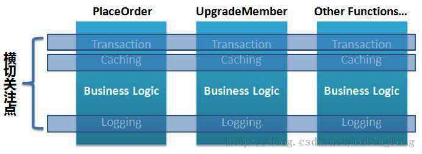

# 1、概念解析

**AOP**（Aspect Oriented Programming），即**面向切面编程**，可以说是OOP（Object Oriented Programming，面向对象编程）的补充和完善。OOP引入封装、继承、多态等概念来建立一种对象层次结构，用于模拟公共行为的一个集合。不过OOP允许开发者定义纵向的关系，但并不适合定义横向的关系，例如日志功能。日志代码往往横向地散布在所有对象层次中，而与它对应的对象的核心功能毫无关系对于其他类型的代码，如安全性、异常处理和透明的持续性也都是如此，在OOP设计中，它导致了大量代码的重复，而不利于各个模块的重用。

AOP技术恰恰相反，它利用一种称为"**横切**"的技术，剖解开封装的对象内部，并将那些影响了多个类的公共行为封装到一个可重用模块，并将其命名为"Aspect"，即"**切面**"。所谓切面，简单说就是那些与业务无关，却为业务模块所共同调用的逻辑或责任封装起来，便于减少系统的重复代码，降低模块之间的耦合度，并有利于未来的可操作性和可维护性。

                                

使用横切技术，AOP把软件系统分为两个部分：**核心关注点**和**横切关注点**。业务处理的主要流程是核心关注点，与之关系不大的部分是横切关注点。横切关注点的一个特点是，他们经常发生在核心关注点的多处，而各处基本相似，比如权限认证、日志、事物。AOP的作用在于分离系统中的各种关注点，将核心关注点和横切关注点分离开来。

 

首先让我们从一些重要的AOP概念和术语开始：

## 1.1 切面（Aspect）

一个关注点的模块化，这个关注点可能会横切多个对象。类是对物体特征的抽象，切面就是对横切关注点的抽象，事务管理是J2EE应用中一个关于横切关注点的很好的例子。

## 1.2 连接点（Joinpoint）

在程序执行过程中某个特定的点，比如某方法调用的时候或者处理异常的时候。因为**Spring****只支持方法类型的连接点，所以在Spring****中连接点指的就是被拦截到的方法**，实际上连接点还可以是字段或者构造器

## 1.3 通知（Advice）

在切面的某个特定的连接点上执行的动作。许多AOP框架（包括Spring）都是**以拦截器（****Interceptor****）做通知模型**，并维护一个以连接点为中心的拦截器链。

## 1.4 切入点（Pointcut）

匹配连接点的断言。通知和一个切入点表达式关联，并在满足这个切入点的连接点上运行，例如，当执行某个特定名称的方法时。切入点表达式如何和连接点匹配是AOP的核心：Spring缺省使用AspectJ切入点语法

## 1.5 引入（Introduction）

用来给一个类型声明额外的方法或属性（也被称为连接类型声明（inter-type declaration））。Spring允许引入新的接口（以及一个对应的实现）到任何被代理的对象。在不修改代码的前提下，引入可以在运行期为类动态地添加一些方法或字段

## 1.6 目标对象（Target Object）

被一个或者多个切面所通知的对象。也被称做被通知对象。 既然Spring AOP是通过运行时代理实现的，这个对象永远是一个被代理对象

## 1.7 AOP代理（AOP Proxy）

AOP框架创建的对象，用来实现切面契约（例如通知方法执行等等）。Spring默认使用JDK动态代理，在需要代理类而不是代理接口的时候，Spring会自动切换为使用CGLIB代理，不过现在的项目都是面向接口编程，所以JDK动态代理相对来说用的还是多一些

## 1.8 织入（weave）

把切面连接到其它的应用程序类型或者对象上，并创建一个被通知对象。根据不同的实现技术, AOP织入有三种方式:

（1）编译器织入, 需要有特殊的Java编译器

（2）类装载期织入, 需要有特殊的类装载器

（3）动态代理织入, 在运行期为目标类添加通知生成子类的方式

Spring 采用动态代理织入, 而AspectJ采用编译器织入和类装载期织入。

## 1.9 举个栗子

**在 Spring AOP** **中，所有的方法执行都是Joinpoint**。 而 Pointcut 是一个描述信息,，它修饰的是Joinpoint，通过Joinpoint，我们可以确定哪些Joinpoint可以被织入 Advice。

**Advice**是在**Joinpoin**上执行的，而**Pointcut**规定了哪些**Advice**可以在哪些**Jointpoint**上执。

以上概念比较抽象，不易理解，下面用一个生活中的例子描述Joinpoint、Pointcut、Advice、Aspect的作用：

杭州市区发生一起交通事故，肇事者驾车逃逸，据目击者称，肇事车辆是一辆车牌尾号为“110”的黑色轿车，现在警方已在高速公路的各个收费站设卡，拦截可疑车辆。

如果将该事件当做一个AOP处理流程，角色解释如下：

- Joinpoint：所有通过收费站的车辆。Joinpoint是所有可能被织入Advice的候选点，在 Spring AOP中，则可以认为所有方法执行点都是Joinpoint。在上例中，所有经过收费站的都可能是嫌疑车辆。
- Pointcut：车牌尾号为“110”、车身颜色为黑色。所有的Joinpoint都可以织入 Advice，但是我们并不希望在所有方法上都织入 Advice，而 Pointcut的作用就是提供一组规则来匹配Joinpoint，将满足规则的 Joinpoint织入 Advice。在上例中，警方不需要拦截所有车辆，只需要拦截符合特征的部分车辆
- Advice：拦截嫌疑车辆，审问司机。Advice 是一个动作，即一段 Java 代码， 这段 Java 代码是作用于Pointcut所限定的那些Joinpoint上的。在上例中，“拦截并审问”这个动作只会针对那些“车牌尾号为110、车身颜色为黑色”的嫌疑车辆而执行。
- Aspect：Pointcut 与 Advice 的组合。因此在这里我们就可以类比：凡是发现车牌尾号为“110”、车身颜色为黑色的车辆都要拦截并审问，这一系列的整体动作可以看做是一个Aspect。

# 2、AspectJ 引入

**@AspectJ**  是 Java语言的一个AOP实现，定义了AOP编程中的语法规范，并提供特殊的代码编译器、调试工具等来支持AspectJ语法。

在Spring中，通过java注解或XML配置都可以接入AspectJ。

注解方式支持@AspectJ：

```java
@Configuration
@EnableAspectJAutoProxy
public class AppConfig {
  
}
```

XML方式支持@AspectJ：

`<aop:aspectj-autoproxy/>` 

下面用@AspectJ来模拟客人去饭店吃饭的一个场景。

作为食客，他们应该只关注自己的事情，比如，怎么点菜、怎么吃饭。而点菜后怎么通知后厨，吃完后怎么收拾桌子，不是食客关注的重点，这些动作应该有另外一个角色——服务员来完成。在这个场景中，以AOP的视角来看，食客吃饭应该被看作核心关注点，而服务员提供的各种服务应该被看作横切关注点

食客实现类：

```java
@Service( "restaurantCustomer" )
public class RestaurantCustomer {
	/* 食客吃饭 */
	public void eat()
	{
		System.out.println( "客人开始吃饭" );
		try {
			Thread.sleep( 2000 );
		} catch ( InterruptedException e ) {
			e.printStackTrace();
		}
		System.out.println( "客人结束吃饭" );
	}
}
```

服务员切面实现类：

```java
@Component
@Aspect
public class WaiterAspect {
	@Pointcut( value = "execution( * clf.learning.winner.springbase.aspect.RestaurantCustomer.eat() )" )

  /* 该方法是一个pointcut标志：表示应用程序执行到CustomerImpl.eat()方法时织入advice */
	public void eatPointcut() {
	}

	@Before( value = "eatPointcut()" )
  /* 该方法是一个前置通知，在RestaurantCustomer.eat()之前执行 */
	public void beforeAdvice() {
		System.out.println( "---服务员引导客人入座、点菜" );
	}

	@AfterReturning( value = "eatPointcut()" )
  /* 该方法是一个后置通知，在RestaurantCustomer.eat()之后执行 */
	public void afterAdvice() {
		System.out.println( "---服务员收拾餐桌" );
	}
}
```

@Aspect 注解用于标明该类是一个切面实现类。

需要注意的是，被@Aspect 标注的类就不能作为其他切面的目标对象， 因为使用 @Aspect 后，这个类就会被排除在auto-proxying机制之外。

 

当*RestaurantCustomer.eat()*执行时，会得到以下的打印结果：

  

# 3、Aspect语法

## 3.1 类型匹配

所谓类型匹配就是匹配符合某些要求的类或者接口。语法规则为：

- 注解？类的全限定名字
- 注解：可选，代表类上持有的注解，如@Deprecated

- 类的全限定名：必填，可以是任何类全限定名


 

类型匹配可以使用的通配符：

- `*`——匹配任何数量字符；
- `..`——匹配任何数量字符的重复，如在类型模式中匹配任何数量子包；而在方法参数模式中匹配任何数量参数。
- `+`——匹配指定类型的子类型；仅能作为后缀放在类型模式后边。

例子：

- java.lang.String     匹配String类型；

- java.*.String       匹配java包下的任何一级子包下的String类型；如匹配java.lang.String，但不匹配java.lang.ss.String

- java..*      匹配java包及任何子包下的任何类型;             如匹配java.lang.String、java.lang.annotation.Annotation

- java.lang.*ing   匹配任何java.lang包下的以ing结尾的类型；

- java.lang.Number+ 匹配java.lang包下的任何Number的子类型；如匹配java.lang.Integer，也匹配java.math.BigInteger


## 3.2 方法匹配

语法规则为：

- 注解？ 修饰符? *返回值类型*  类型声明? 方法名(参数列表) 异常列表？ 
- 注解：可选，方法上持有的注解，如@Deprecated；

- 修饰符：可选，如public、protected；

- 返回值类型：必填，可以是任何类型模式；“*”表示所有类型；

- 类型声明：可选，可以是任何类型模式；

- 方法名：必填，可以使用“*”进行模式匹配；


参数列表：`()`表示方法没有任何参数；`(..)`表示匹配接受任意个参数的方法，`(..,java.lang.String)`表示匹配接受`java.lang.String`类型的参数结束，且其前边可以接受有任意个参数的方法；`(java.lang.String,..)` 表示匹配接受`java.lang.String`类型的参数开始，且其后边可以接受任意个参数的方法；`(*,java.lang.String)` 表示匹配接受`java.lang.String`类型的参数结束，且其前边接受有一个任意类型参数的方法；

异常列表：可选，以“throws 异常全限定名列表”声明，异常全限定名列表如有多个以“，”分割，如`throws java.lang.IllegalArgumentException, java.lang.ArrayIndexOutOfBoundsException`

## 3.3 组合表达式

AspectJ使用 且（&&）、或（||）、非（!）来组合切入点表达式。

在Schema风格下，由于在XML中使用“&&”需要使用转义字符“&amp;&amp;”来代替之，很不方便，因此Spring AOP 提供了and、or、not来代替&&、||、!

# 4、Pointcut声明

一个 Pointcut 声明由两部分组成:

- 一个方法签名，包括方法名和相关参数

- 一个切入点表达式，用来指定哪些方法执行是我们感兴趣的，即在哪里可以织入Advice


在@AspectJ 风格的 AOP 中，我们使用一个方法来描述 Pointcut，如上例中：

```java
@Pointcut( value = "execution( * clf.learning.winner.springbase.aspect.RestaurantCustomer.eat() )" )
public void eatPointcut() {
  
}
```

@Pointcut注解标明，该方式是一个切入点，该方法的返回类型必须为void

`execution( * clf.learning.winner.springbase.aspect.RestaurantCustomer.eat() )`是一个切入点表达式，切入点表达式由标志符和操作参数组成。`execution`就是一个标志符，而括号里的`*clf.learning.winner.springbase.aspect.RestaurantCustomer.eat()`就是操作参数。

切点表达式也可以在Advice声明中直接使用：

```java
@Pointcut( value = "execution( * clf.learning.winner.springbase.aspect.RestaurantCustomer.eat() )" )
public void eatPointcut()
{
	/* 该方法是一个pointcut标志：表示应用程序执行到CustomerImpl.eat()方法时织入advice */
}

@Before( value = "eatPointcut()" )
public void beforeAdvice()
{
	System.out.println( "---服务员引导客人入座、点菜" );
}   
```

等同于：

```java
   @Before(value = " execution( * clf.learning.winner.springbase.aspect.RestaurantCustomer.eat() )")
   public void beforeAdvice() { 
       System.out.println("---服务员引导客人入座、点菜");
   }
```

Spring AOP支持的切入点指示符有以下几种：

## 4.1 execution

匹配特定的方法执行。

- 任意公共方法的执行：`execution( public * * (..))`

- 任意公共的，只有一个参数且类型为java.util.Date的方法执行：`execution(public * *（java.util.Date)`

- 任何一个名字以”set”开始的方法的执行：`execution(* set*(..))`

- AccountService接口定义的任意方法的执行：`execution (* com.xyz.service.AccountService.* (..))`

- 在service包中定义的任意方法的执行：`execution (* com.xyz.service.*.*(..))`

- 在service包或其子包中定义的任意方法的执行：`execution (* com.xyz.service..*.*(..))`


## 4.2 within

匹配特定包下的方法执行。

- 在service包中的任意方法执行：`within (com.xyz.service.*)`

- 在service包或其子包中的任意方法执行：`within (com.xyz.service..*)`


## 4.3 this

匹配特定类或接口的代理对象的方法执行，**不支持通配符**。

- 实现了AccountService接口的代理对象的任意方法执行：`this (com.xyz.service.AccountService)` 


该指示符还可以将代理对象传入到Advice方法当中，如：

```java
@Before("before() && this(proxy)")
public void beforeAdvide(JoinPoint point, Object proxy){        

}
```


## 4.4 target

匹配特定类或接口的方法执行，**不支持通配符**。

- 实现AccountService接口的目标对象的任意方法执行：`target (com.xyz.service.AccountService)`


该指示符还可以将目标对象传入到Advice方法当中，如：

```java
@Before("before() && target(target)
public void beforeAdvide(JoinPoint point, Object target){ 

}
```

## 4.5 args

匹配参数是指定类型的方法执行。

- 任何一个只接受一个参数，并且运行时所传入的参数是Serializable 接口的方法执行：`args (java.io.Serializable)`


该指示符还可以将目标方法的入参传入到Advice方法当中。

```java
//匹配只有一个参数且类型为String的方法执行
@Before(value = " args(name)")
public void doSomething(String name) {

}
 
//匹配第一个参数为String类型的方法执行：
@Before(value = " args(name, ..)")
public void doSomething(String name) {

}

//匹配第二个参数为String类型的方法执行：
Before(value = " args(*, name, ..)")
public void doSomething(String name) {

}
```

注意，该标识符是匹配运行时传入的参数类型，不是匹配方法签名的参数类型；参数类型列表中的参数必须是类型全限定名，**不支持通配符**；args属于动态切入点，这种切入点开销比较大，非特殊情况最好不要使用

## 4.6 @target

匹配持有特定注解（类级别）的类的方法执行，与@within的功能类似，但必须要指定注解接口的保留策略为RUNTIME。**不支持通配符**。

- 目标对象中有一个 @Transactional 注解的任意方法执行：`@target (org.springframework.transaction.annotation.Transactional)`


## 4.7 @within

与@target类似

## 4.8 @args

匹配运行时入参持有特定注解的方法执行，**不支持通配符**。

- 任何一个只接受一个参数，并且运行时所传入的参数类型具有`@Classified` 注解的方法执行：`@args (com.xyz.security.Classified)`


## 4.9 @annotation

匹配持有特定注解（方法级别）的方法执行，**不支持通配符**。

- 任何一个被@Transactional 注解的方法执行：


`@annotation (org.springframework.transaction.annotation.Transactional)`

## 4.10 bean

Spring AOP扩展的，在AspectJ中无相应概念，匹配bean名字满足特定要求的方法执行。

- 匹配以 “Service” 或 “ServiceImpl” 结尾的 bean：`bean (*Service || *ServiceImpl)`


# 5、Advice声明

Advice 是和一个Pointcut 表达式关联在一起的，并且在切入点匹配的方法执行之前或者之后或者前后运行。Pointcut 表达式可以是简单的一个Pointcut名字的引用，也可以是完整的Pointcut表达式。

Spring AOP支持五中通知模型：**前置通知**（Before advice）、**后置通知**（After returning advice）、**异常通知**（After throwing advice）、**最终通知**（After (finally) advice）、**环绕通知**（Around Advice）。

 

## 5.1 前置通知

在某连接点之前执行的通知，但这个通知不能阻止连接点之前的执行流程（除非它抛出一个异常）。

使用 @Before 注解声明前置通知：

```java
//将 pointcut 和 advice 同时定义
@Before("within(com.xys.service..*)")
public void doSomethingk() { 

}
```

## 5.2 后置通知

在某连接点正常完成后执行的通知,例如，一个方法没有抛出任何异常，正常返回

使用 @AfterReturning 注解来声明：

```java
@AfterReturning (pointcut ="within(com.xys.service..*)", returning="retVal")
public void doSomethingk(Object retVal) {  

}
```

## 5.3 异常通知

抛出异常通知在一个方法抛出异常后执行。

使用@AfterThrowing注解来声明：

```java
@AfterThrowing(
pointcut="com.xyz.myapp.dataAccessOperation()", throwing="ex")
public void doRecoveryActions(DataAccessException ex) {
  // ...
 } 
```

`throwing`属性可以限制匹配的异常类型。

## 5.4 最终通知

当某连接点退出的时候执行的通知，即finally代码块执行后，不论是正常返回还是异常退出）执行的通知

```java
 @After（"com.xyz.myapp.dataAccessOperation ()"）
 public void doReleaseLock（） {
  // ...
 }
```

 

## 5.5 环绕通知

包围一个连接点的通知，如方法调用。这是最强大的一种通知类型。它使得通知有机会在一个方法执行之前和执行之后运行，而且它可以决定这个方法在什么时候执行，如何执行，甚至是否执行。

环绕通知使用@Around注解来声明。**通知的第一个参数必须是** **ProceedingJoinPoint**类型。在通知体内，调用 ProceedingJoinPoint的proceed()方法使得连接点方法执行。如果不调用proceed()方法，连接点方法则不会执行。

 ```java
@Around("com.xys..dataAccessOperation()")
public Object doAroundAccessCheck(ProceedingJoinPoint pjp) throws Throwable {

    StopWatch stopWatch = new StopWatch();
    stopWatch.start();

    // 开始
    Object retVal = pjp.proceed();
    stopWatch.stop();

   // 结束
    System.out.println("invoke method: " + pjp.getSignature().getName() + ", elapsed time: " + stopWatch.getTotalTimeMillis());

    return retVal;
  }
 ```


## 5.6 通知参数的获取

有很多场景下，我们需要获取连接点的方法参数，传递到Advice中以作判断、处理等。

通过切入点表达式可以将相应的参数自动传递给通知方法，例如上文中将返回值和异常传递给通知方法，以及通过切入点标识符的”arg”属性传递运行时参数。

需要注意的是，**在Spring AOP中，execution和bean指示符不支持自动传递参数**。不过，可以利用组合表达式达到目的：

```java
@Before(value="execution(* test(*)) && args(param)", argNames="param") 
public void before1(String param) { 
  System.out.println("param:" + param); 
}
```

首先`execution(* test(*))`匹配任何方法名为`test`，且有一个任何类型的参数；然后`args(param)`将查找通知方法上同名的参数，并在方法执行时（运行时）匹配传入的参数是使用该同名参数类型，即`java.lang.String`；如果匹配将把该被通知参数传递给通知方法上同名参数。

`argNames`用于指定参数名称，避免参数绑定的二义性，如：

```java
@Before(args(param) && target(bean) && @annotation(secure), argNames="jp,param,bean,secure") 
public void before(JoinPoint jp, String param, IPointcutService pointcutService, Secure secure) { 
	//…… 
} 
```

如果第一个参数类型是JoinPoint、ProceedingJoinPoint或JoinPoint.StaticPart类型，应该从`argNames`属性省略掉该参数名（可选，写上也对），这些类型对象会自动传入的，但必须作为第一个参数：

```java
@Before(value="args(param)", argNames="param") 
public void before(JoinPoint jp, String param) { 
  System.out.println("param:" + param); 
}
```

此外，Spring AOP提供使用`org.aspectj.lang.JoinPoint`类型获取连接点数据，任何通知方法的第一个参数都可以是JoinPoint(环绕通知是ProceedingJoinPoint，JoinPoint子类)，当然第一个参数位置也可以是`JoinPoint.StaticPart`类型，这个只返回连接点的静态部分。

- **JoinPoint**：提供访问当前被通知方法的目标对象、代理对象、方法参数等数据
- **ProceedingJoinPoint**：用于环绕通知，使用proceed()方法来执行目标方法
- **JoinPoint.StaticPart**：提供访问连接点的静态部分，如被通知方法签名、连接点类型等

 ```java
@Before( "execution(* com.abc.service.*.many*(..))" )
public void permissionCheck( JoinPoint point )
{
	System.out.println( "@Before：模拟权限检查..." );
	System.out.println( "@Before：目标方法为：" + point.getSignature().getDeclaringTypeName() +
										 "." + point.getSignature().getName() );
	System.out.println( "@Before：参数为：" + Arrays.toString( point.getArgs() ) );
	System.out.println( "@Before：被织入的目标对象为：" + point.getTarget() );
}

@Around( "execution(* com.abc.service.*.many*(..))" )
public Object process( ProceedingJoinPoint point ) throws Throwable
{
	System.out.println( "@Around：执行目标方法之前..." );
	
  /* 访问目标方法的参数： */
	Object[] args = point.getArgs();
	if ( args != null && args.length > 0 && args[0].getClass() == String.class )
	{
		args[0] = "改变后的参数1";
	}

	/* 用改变后的参数执行目标方法 */
	Object returnValue = point.proceed( args );
	System.out.println( "@Around：执行目标方法之后..." );
	System.out.println( "@Around：被织入的目标对象为：" + point.getTarget() );

	return("原返回值：" + returnValue + "，这是返回结果的后缀");
}
 ```