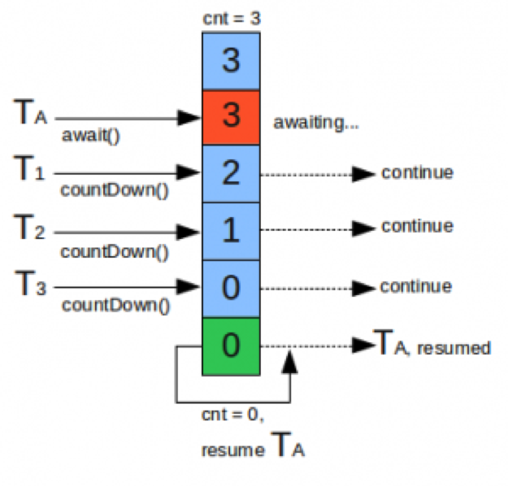

# 1、概述

Java5中对Java线程的类库做了大量的扩展，其中线程池就是Java5的新特征之一，除了线程池之外，还有很多多线程相关的内容，为多线程的编程带来了极大便利。为了编写高效稳定可靠的多线程程序，线程部分的新增内容显得尤为重要。
有关Java5线程新特征的内容全部在`java.util.concurrent`下面，里面包含数目众多的接口和类。

# 2、线程池

线程池的基本思想还是一种**对象池**的思想，开辟一块内存空间，里面存放了众多（未死亡）的线程，池中线程执行调度由池管理器来处理。当有线程任务时，从池中取一个，执行完成后线程对象归池，这样可以避免反复创建线程对象所带来的性能开销，节省了系统的资源。

Java5的线程池分好多种：固定尺寸的线程池、单任务线程池、可变尺寸连接池、延迟线程池等。

在使用线程池之前，必须知道如何去创建一个线程池，在Java5中，需要了解的是`java.util.concurrent.Executors`类的API，这个类提供大量创建连接池的静态方法，很有用。

## 2.1 固定大小的线程池

```java
public class Test {
	public static void main(String[] args) {
		// 创建一个可重用固定线程数的线程池
		ExecutorService pool = Executors.newFixedThreadPool(2);
		// 创建实现了Runnable接口对象，Thread对象当然也实现了Runnable接口
		Thread t1 = new Thread(new MyRunnable("ThreadA"));
		Thread t2 = new Thread(new MyRunnable("ThreadB"));
		Thread t3 = new Thread(new MyRunnable("ThreadC"));
		Thread t4 = new Thread(new MyRunnable("ThreadD"));
		Thread t5 = new Thread(new MyRunnable("ThreadE"));
		// 将线程放入池中进行执行
		pool.execute(t1);
		pool.execute(t2);
		pool.execute(t3);
		pool.execute(t4);
		pool.execute(t5);
		// 启动一次,顺序关闭，执行以前提交的任务，但不接受新任务。如果已经关闭，则调用没有其他作用。
		pool.shutdown();
	}
}

class MyRunnable implements Runnable {

	private String name;

	public MyRunnable(String name) {
		this.name = name;
	}

	@Override
	public void run() {
		System.out.println("正在执行的线程：" + name);
	}
}
```

打印结果：

> 正在执行的线程：ThreadA
> 正在执行的线程：ThreadB
> 正在执行的线程：ThreadC
> 正在执行的线程：ThreadE
> 正在执行的线程：ThreadD

可见，线程池并不保证按照线程加入池中的顺序来执行。

`Executors.newFixedThreadPool()`创建一个可重用固定线程数的线程池，以共享的无界队列方式来运行这些线程。在任意点，在大多数线程会处于处理任务的活动状态。如果在所有线程处于活动状态时提交附加任务，则在有可用线程之前，附加任务将在队列中等待。如果在关闭前的执行期间由于失败而导致任何线程终止，那么一个新线程将代替它执行后续的任务（如果需要）。在某个线程被显式地关闭之前，池中的线程将一直存在。

## 2.2 单任务线程池

如果在上例中使用

`ExecutorService pool = Executors.newSingleThreadExecutor()`

来创建线程池，即是为单任务线程池。

执行效果类似，不同的是，单任务线程池可保证顺序地执行各个任务，并且在任意给定的时间不会有多个线程是活动的。与其他等效的`newFixedThreadPool(1) `不同，可保证无需重新配置此方法所返回的执行程序即可使用其他的线程。

## 2.3 可变尺寸的线程池

如用

`ExecutorService pool = Executors.newCachedThreadPool()`

来创建线程池，即为可变尺寸的线程池。

该方法创建一个可根据需要创建新线程的线程池，但是在以前构造的线程可用时将重用它们。对于执行很多短期异步任务的程序而言，这些线程池通常可提高程序性能。调用 `execute` 将重用以前构造的线程（如果线程可用）。如果现有线程没有可用的，则创建一个新线程并添加到池中。终止并从缓存中移除那些已有 60 秒钟未被使用的线程。因此，长时间保持空闲的线程池不会使用任何资源。注意，可以使用 `ThreadPoolExecutor` 构造方法创建具有类似属性但细节不同（例如超时参数）的线程池。

## 2.4 可调度线程池

可调度线程池可安排线程在给定延迟后运行命令或者定期地执行。

```java
public class Test {
	public static void main(String[] args) {
		// 创建一个线程池，它可安排在给定延迟后运行命令或者定期地执行。
		// 注意，返回的事ScheduledExecutorService接口，而非ExecutorService，ScheduledExecutorService是ExecutorService的子接口
		ScheduledExecutorService pool = Executors.newScheduledThreadPool(2);
		// 创建实现了Runnable接口对象，Thread对象当然也实现了Runnable接口
		Thread t1 = new Thread(new MyRunnable("ThreadA"));
		Thread t2 = new Thread(new MyRunnable("ThreadB"));
		Thread t3 = new Thread(new MyRunnable("ThreadC"));
		Thread t4 = new Thread(new MyRunnable("ThreadD"));

		// 将线程放入池中进行执行
		pool.execute(t1);
		// 使用延迟执行的方法：使线程t2延迟2秒再执行
		pool.schedule(t2, 2000, TimeUnit.MILLISECONDS);
		// 使用周期执行的方法：使线程t3延迟两秒执行，然后每隔5秒执行一次
		pool.scheduleAtFixedRate(t3, 2000, 5000, TimeUnit.MILLISECONDS);
		// 使用周期延迟的方法：使线程t4延迟两秒执行，然后,在每一次执行终止和下一次执行开始之间都存在给定的5秒延迟
		pool.scheduleWithFixedDelay(t4, 2000, 5000, TimeUnit.MILLISECONDS);
		// 如关闭线程池，则周期性的方法只会执行一次
		// pool.shutdown();
	}
}

class MyRunnable implements Runnable {

	private String name;

	public MyRunnable(String name) {
		this.name = name;
	}

	@Override
	public void run() {
		System.out.println("正在执行的线程：" + name);
	}
}
```

打印结果如下：

> 正在执行的线程：ThreadA
> 正在执行的线程：ThreadB
> 正在执行的线程：ThreadC
> 正在执行的线程：ThreadD
> 正在执行的线程：ThreadC
> 正在执行的线程：ThreadD
> 正在执行的线程：ThreadD
> 正在执行的线程：ThreadC
> 正在执行的线程：ThreadC
> 正在执行的线程：ThreadD
> 正在执行的线程：ThreadC
> 正在执行的线程：ThreadD
> ……

## 2.5 可调度单任务线程池

`ScheduledExecutorService pool = Executors.newSingleThreadScheduledExecutor();`

创建的即为单任务可调度线程池。使用方法与上例类似。

## 2.6 自定义线程池

线程池类`java.util.concurrent.ThreadPoolExecutor`的常用构造方法为：

```java
ThreadPoolExecutor(
int corePoolSize, 
int maximumPoolSize,
long keepAliveTime, TimeUnit unit,
BlockingQueue<Runnable> workQueue,
RejectedExecutionHandler handler)
```

参数意义如下：

- `corePoolSize``： 线程池维护线程的最少数量
- `maximumPoolSize`：线程池维护线程的最大数量
- `keepAliveTime`： 线程池维护线程所允许的空闲时间
- `unit`： 线程池维护线程所允许的空闲时间的单位
- `workQueue`： 线程池所使用的缓冲队列
- `handler`： 线程池对拒绝任务的处理策略

一个任务通过 `execute(Runnable)`方法被添加到线程池，任务就是一个 `Runnable`类型的对象，任务的执行方法就是`Runnable`类型对象的`run()`方法。

当一个任务通过`execute(Runnable)`方法欲添加到线程池时：

- 如果此时线程池中的数量小于`corePoolSize`，即使线程池中的线程都处于空闲状态，也要创建新的线程来处理被添加的任务。
- 如果此时线程池中的数量等于 `corePoolSize`，但是缓冲队列 `workQueue`未满，那么任务被放入缓冲队列。
- 如果此时线程池中的数量大于`corePoolSize`，缓冲队列`workQueue`满，并且线程池中的数量小于`maximumPoolSize`，建新的线程来处理被添加的任务。
- 那么通过 `handler`所指定的策略来处理此任务。也就是：处理任务的优先级为：核心线程`corePoolSize`、任务队列`workQueue`、最大线程`maximumPoolSize`，如果三者都满了，使用`handler`处理被拒绝的任务。
- 当线程池中的线程数量大于 `corePoolSize`时，如果某线程空闲时间超过`keepAliveTime`，线程将被终止。这样，线程池可以动态的调整池中的线程数。

排队有三种通用策略：

- **直接提交**

  工作队列的默认选项是 `SynchronousQueue`，它将任务直接提交给线程而不保持它们。在此，如果不存在可用于立即运行任务的线程，则试图把任务加入队列将失败，因此会构造一个新的线程。此策略可以避免在处理可能具有内部依赖性的请求集合时出现锁定。直接提交通常要求无界 `maximumPoolSizes` 以避免拒绝新提交的任务。当命令以超过队列所能处理的平均数连续到达时，此策略允许无界线程具有增长的可能性。

- **无界队列**

  使用无界队列（例如，不具有预定义容量的 `LinkedBlockingQueue`）将导致在所有 `corePoolSize` 线程都忙的情况下将新任务加入队列。这样，创建的线程就不会超过 `corePoolSize`。（因此，`maximumPoolSize` 的值也就无效了。）当每个任务完全独立于其他任务，即任务执行互不影响时，适合于使用无界队列；例如，在 Web 页服务器中。这种排队可用于处理瞬态突发请求，当命令以超过队列所能处理的平均数连续到达时，此策略允许无界线程具有增长的可能性。

- **有界队列**

  当使用有限的 `maximumPoolSizes` 时，有界队列（如 `ArrayBlockingQueue`）有助于防止资源耗尽，但是可能较难调整和控制。队列大小和最大池大小可能需要相互折衷：使用大型队列和小型池可以最大限度地降低CPU 使用率、操作系统资源和上下文切换开销，但是可能导致人工降低吞吐量。如果任务频繁阻塞（例如，如果它们是 I/O 边界），则系统可能为超过您许可的更多线程安排时间。使用小型队列通常要求较大的池大小，CPU 使用率较高，但是可能遇到不可接受的调度开销，这样也会降低吞吐量。

unit可选的参数为`java.util.concurrent.TimeUnit`中的几个静态属性：

- NANOSECONDS：毫微妙，千分之一微妙
- MICROSECONDS：微妙，千分之一毫秒
- MILLISECONDS：毫秒，千分之一秒
- SECONDS：秒
- HOURS ：小时
- DAYS ：天

`workQueue`常用的是：`java.util.concurrent.ArrayBlockingQueue`

`handler`有四个选择：

- `ThreadPoolExecutor.AbortPolicy`
  用于被拒绝任务的处理程序，它将抛出 `RejectedExecutionException`。 
- `ThreadPoolExecutor.CallerRunsPolicy `
  用于被拒绝任务的处理程序，它直接在 `execute` 方法的调用线程中运行被拒绝的任务；如果执行程序已关闭，则会丢弃该任务。 
- `ThreadPoolExecutor.DiscardOldestPolicy` 
  用于被拒绝任务的处理程序，它放弃最旧的未处理请求，然后重试 `execute`；如果执行程序已关闭，则会丢弃该任务。 
- `ThreadPoolExecutor.DiscardPolicy` 
  用于被拒绝任务的处理程序，默认情况下它将丢弃被拒绝的任务。

此类提供 `protected` 可重写的 `beforeExecute(java.lang.Thread, java.lang.Runnable)` 和 `afterExecute(java.lang.Runnable, java.lang.Throwable)` 方法，这两种方法分别在执行每个任务之前和之后调用。它们可用于操纵执行环境；例如，重新初始化`ThreadLocal`、搜集统计信息或添加日志条目。此外，还可以重写方法 `terminated() `来执行 `Executor` 完全终止后需要完成的所有特殊处理。

`ThreadPoolExecutor`可以使我们根据实际需要创建合适的线程池，使程序员编写出更有弹性的代码。

实例：

```java
public class Test {

	private static int queueDeep = 4;

	public void createThreadPool() {
		/*
		 * 创建线程池，最小线程数为2，最大线程数为4，线程池维护线程的空闲时间为3秒，
		 * 使用队列深度为4的有界队列，如果执行程序尚未关闭，则位于工作队列头部的任务将被删除，
		 * 然后重试执行程序（如果再次失败，则重复此过程），里面已经根据队列深度对任务加载进行了控制。
		 */
		ThreadPoolExecutor tpe = new ThreadPoolExecutor(2, 4, 3, TimeUnit.SECONDS,
				new ArrayBlockingQueue<Runnable>(queueDeep), new ThreadPoolExecutor.DiscardOldestPolicy());

		// 向线程池中添加 10 个任务
		for (int i = 0; i < 10; i++) {
			try {
				Thread.sleep(1);
			} catch (InterruptedException e) {
				e.printStackTrace();
			}
			while (getQueueSize(tpe.getQueue()) >= queueDeep) {
				System.out.println("队列已满，等3秒再添加任务");
				try {
					Thread.sleep(3000);
				} catch (InterruptedException e) {
					e.printStackTrace();
				}
			}
			TaskThreadPool ttp = new TaskThreadPool(i);
			System.out.println("put i:" + i);
			tpe.execute(ttp);
		}

		tpe.shutdown();
	}

	private synchronized int getQueueSize(Queue queue) {
		return queue.size();
	}

	public static void main(String[] args) {
		Test test = new Test();
		test.createThreadPool();
	}

	class TaskThreadPool implements Runnable {
		private int index;

		public TaskThreadPool(int index) {
			this.index = index;
		}

		public void run() {
			System.out.println(Thread.currentThread() + " index:" + index);
			try {
				Thread.sleep(3000);
			} catch (InterruptedException e) {
				e.printStackTrace();
			}
		}
	}
}
```

打印结果如下：

> put i:0
> put i:1
> Thread[pool-1-thread-1,5,main] index:0
> Thread[pool-1-thread-2,5,main] index:1
> put i:2
> put i:3
> put i:4
> put i:5
> 队列已满，等3秒再添加任务
> Thread[pool-1-thread-1,5,main] index:2
> Thread[pool-1-thread-2,5,main] index:3
> put i:6
> put i:7
> 队列已满，等3秒再添加任务
> Thread[pool-1-thread-1,5,main] index:4
> Thread[pool-1-thread-2,5,main] index:5
> put i:8
> put i:9
> Thread[pool-1-thread-1,5,main] index:6
> Thread[pool-1-thread-2,5,main] index:7
> Thread[pool-1-thread-1,5,main] index:8
> Thread[pool-1-thread-2,5,main] index:9

## 2.7 ThreadFactory

以上创建线程池的构造方法都可以接受一个`ThreadFactory`接口，它可以根据需要创建新线程的对象，就无需再手工编写对 `new Thread` 的调用了，从而允许应用程序使用特殊的线程子类、属性等，也可能初始化属性、名称、守护程序状态、`ThreadGroup` 等等。

```java
public class Test {

	public static void main(String[] args) {
		ExecutorService pool = Executors.newCachedThreadPool();

		// 为线程实例命名
		Thread thread1 = new Thread(new MyRunnable(), "ThreadA");
		Thread thread2 = new Thread(new MyRunnable(), "ThreadB");
		pool.execute(thread1);
		pool.execute(thread2);
		pool.shutdown();

	}
}

class MyRunnable implements Runnable {

	@Override
	public void run() { // 打印当前线程的名字
		System.out.println("线程名字：" + Thread.currentThread().getName());

	}
}
```

打印结果：

> 线程名字：pool-1-thread-1
> 线程名字：pool-1-thread-2

可见，我们创建线程实例时给线程的命名并没有生效，这是为什么呢？实际上，如果我们没有传入一个`ThreadFactory`参数给线程池的构造方法，则会使用一个默认的`ThreadFactory`，它会给新建线程并设置线程的优先级，新线程具有可通过 `pool-N-thread-M`的名称，其中 `N` 是此工厂的序列号，`M` 是此工厂所创建线程的序列号。就是说，我们之前设置的线程名字被覆盖掉了。

下面我们传入自己写的`ThreadFactory`，在`newThread()`方法中可以设置新建线程的参数，也可以进行其他操作。

```java
public class Test {

	public static void main(String[] args) {
		// 传入自定义的ThreadFactory
		ExecutorService pool = Executors.newCachedThreadPool(new MyThreadFactory());
		Thread thread1 = new Thread(new MyRunnable(), "ThreadA");
		Thread thread2 = new Thread(new MyRunnable(), "ThreadB");
		pool.execute(thread1);
		pool.execute(thread2);
		pool.shutdown();

	}

}

class MyThreadFactory implements ThreadFactory {

	@Override
	public Thread newThread(Runnable r) {
		Thread thread = new Thread(r);
		// 再次设置线程的新名字
		thread.setName("newThreadName");
		return thread;
	}

}
```

打印结果：

> 线程名字：newThreadName
> 线程名字：newThreadName

现在，线程使用的是我们在`MyThreadFactory`中设定的新名称。

# 3、BlockingQueue

在上例中提到了`ArrayBlockingQueue`即是`BlockingQueue`接口的实现类。`java.util.concurrent.BlockingQueue`继承了`java.util.Queue`接口。

**阻塞队列**的概念是，一个指定长度的队列，如果队列满了，添加新元素的操作会被阻塞等待，直到有空位为止。同样，当队列为空时候，请求队列元素的操作同样会阻塞等待，直到有可用元素为止。

有了这样的功能，就为多线程的排队等候的模型实现开辟了便捷通道。 

```java
public class Test {
	public static void main(String[] args) throws InterruptedException {
		BlockingQueue<Integer> bqueue = new ArrayBlockingQueue<Integer>(10);
		for (int i = 0; i < 20; i++) {
			// 将指定元素添加到此队列中，如果没有可用空间，将一直等待（如果有必要）。
			bqueue.put(i);
			System.out.println("向阻塞队列中添加了元素:" + i);
		}

		System.out.println("程序到此运行结束，即将退出----");
	}
}
```

打印结果：

> 向阻塞队列中添加了元素:0
> 向阻塞队列中添加了元素:1
> 向阻塞队列中添加了元素:2
> 向阻塞队列中添加了元素:3
> 向阻塞队列中添加了元素:4
> 向阻塞队列中添加了元素:5
> 向阻塞队列中添加了元素:6
> 向阻塞队列中添加了元素:7
> 向阻塞队列中添加了元素:8
> 向阻塞队列中添加了元素:9

`BlockingQueue`的容量为10，存入第十个元素之后已满，所以会进入阻塞状态，等待有可用的空间。

除了阻塞队列，还有阻塞栈`java.util.concurrent.BlockingDeque`接口。不同点在于栈是“后入先出”的结构，每次操作的是栈顶，而队列是“先进先出”的结构，每次操作的是队列头。

# 4、Callable与Future

`Callable`与 `Future` 两功能是Java在后续版本中为了适应多并法才加入的，`Callable`是类似于`Runnable`的接口，实现`Callable`接口的类和实现`Runnable`的类都是可被其他线程执行的任务。

Callable的接口定义如下；

```java
public interface Callable<V> {

	V call() throws Exception;

}
```

`Callable`和`Runnable`的区别如下：

- `Callable`定义的方法是`call`，而`Runnable`定义的方法是`run`。
- `Callable`的`call`方法可以有返回值，而`Runnable`的`run`方法不能有返回值。
- `Callable`的`call`方法可抛出异常，而`Runnable`的`run`方法不能抛出异常。  

`Future`表示异步计算的结果，它提供了检查计算是否完成的方法，以等待计算的完成，并检索计算的结果。`Future`的`cancel`方法可以取消任务的执行，它有一布尔参数，参数为 `true` 表示立即中断任务的执行，参数为 `false` 表示允许正在运行的任务运行完成。`Future`的 `get` 方法等待计算完成，获取计算结果

```java
public class Test {

	public static class MyCallable implements Callable {

		private int flag = 0;

		public MyCallable(int flag) {

			this.flag = flag;

		}

		public String call() throws Exception {

			if (this.flag == 0) {

				return "flag = 0";

			}

			if (this.flag == 1) {

				try {

					while (true) {

						System.out.println("looping.");

						Thread.sleep(2000);

					}

				} catch (InterruptedException e) {

					System.out.println("Interrupted");

				}

				return "false";

			} else {

				throw new Exception("Bad flag value!");

			}

		}

	}

	public static void main(String[] args) {

		// 定义3个Callable类型的任务
		MyCallable task1 = new MyCallable(0);
		MyCallable task2 = new MyCallable(1);
		MyCallable task3 = new MyCallable(2);

		// 创建一个执行任务的服务
		ExecutorService es = Executors.newFixedThreadPool(3);

		try {

			// 提交并执行任务，任务启动时返回了一个Future对象，
			// 如果想得到任务执行的结果或者是异常可对这个Future对象进行操作
			Future future1 = es.submit(task1);

			// 获得第一个任务的结果，如果调用get方法，当前线程会等待任务执行完毕后才往下执行
			System.out.println("task1: " + future1.get());
			Future future2 = es.submit(task2);

			// 等待5秒后，再停止第二个任务。因为第二个任务进行的是无限循环
			Thread.sleep(5000);
			System.out.println("task2 cancel: " + future2.cancel(true));

			// 获取第三个任务的输出，因为执行第三个任务会引起异常
			// 所以下面的语句将引起异常的抛出
			Future future3 = es.submit(task3);

			System.out.println("task3: " + future3.get());

		} catch (Exception e) {

			System.out.println(e.toString());

		}

		// 停止任务执行服务
		es.shutdownNow();

	}

}
```

打印结果：

> task1: flag = 0
> looping.
> looping.
> looping.
> Interrupted
> task2 cancel: true
> java.util.concurrent.ExecutionException: java.lang.Exception: Bad flag value!

# 5、Lock

## 5.1 synchronized的不足

如果一个代码块被`synchronized`修饰了，当一个线程获取了对应的锁，并执行该代码块时，其他线程便只能一直等待，等待获取锁的线程释放锁，而这里获取锁的线程释放锁只会有两种情况：

- 获取锁的线程执行完了该代码块，然后线程释放对锁的占有；
- 线程执行发生异常，此时JVM会让线程自动释放锁。

那么如果这个获取锁的线程由于要等待IO或者其他原因（比如调用sleep方法）被阻塞了，但是又没有释放锁，其他线程便只能等待，很影响程序执行效率。

因此就需要有一种机制可以不让等待的线程一直无期限地等待下去（比如只等待一定的时间或者能够响应中断），通过`Lock`就可以办到。

再举个例子：当有多个线程读写文件时，读操作和写操作会发生冲突现象，写操作和写操作会发生冲突现象，但是读操作和读操作不会发生冲突现象。

但是采用`synchronized`关键字来实现同步的话，就会导致一个问题：如果多个线程都只是进行读操作，所以当一个线程在进行读操作时，其他线程只能等待无法进行读操作。

因此就需要一种机制来使得多个线程都只是进行读操作时，线程之间不会发生冲突，通过Lock就可以办到。

另外，通过`Lock`可以知道线程有没有成功获取到锁。这个是`synchronized`无法办到的。

也就是说`Lock`提供了比`synchronized`更多的功能。但是要注意以下几点：

- `Lock`不是Java语言内置的，`synchronized`是Java语言的关键字，因此是内置特性。`Lock`是一个类，通过这个类可以实现同步访问；
- `Lock`和`synchronized`有一点非常大的不同，采用`synchronized`不需要用户去手动释放锁，当`synchronized`方法或者`synchronized`代码块执行完之后，系统会自动让线程释放对锁的占用；而`Lock`则必须要用户去手动释放锁，如果没有主动释放锁，就有可能导致出现死锁现象。

Java中专门提供了锁对象，利用锁可以方便的实现资源的封锁，用来控制对竞争资源并发访问的控制，这些内容主要集中在`java.util.concurrent.locks`包下面，里面有三个重要的接口`Condition`、`Lock`、`ReadWriteLock`。

## 5.2 Lock接口

`Lock` 实现提供了比使用 `synchronized` 方法和语句可获得的更广泛的锁定操作。此实现允许更灵活的结构，可以具有差别很大的属性，可以支持多个相关的 `Condition` 对象。 

锁是控制多个线程对共享资源进行访问的工具。通常，锁提供了对共享资源的独占访问。一次只能有一个线程获得锁，对共享资源的所有访问都需要首先获得锁。不过，某些锁可能允许对共享资源并发访问，如 R`eadWriteLock` 的读取锁。

`synchronized` 方法或语句的使用提供了对与每个对象相关的隐式监视器锁的访问，但却强制所有锁获取和释放均要出现在一个块结构中：当获取了多个锁时，它们必须以相反的顺序释放，且必须在与所有锁被获取时相同的词法范围内释放所有锁。

虽然 `synchronized` 方法和语句的范围机制使得使用监视器锁编程方便了很多，而且还帮助避免了很多涉及到锁的常见编程错误，但有时也需要以更为灵活的方式使用锁。例如，某些遍历并发访问的数据结果的算法要求使用 "hand-over-hand" 或 "chain locking"：获取节点 A 的锁，然后再获取节点 B 的锁，然后释放 A 并获取 C，然后释放 B 并获取 D，依此类推。`Lock` 接口的实现允许锁在不同的作用范围内获取和释放，并允许以任何顺序获取和释放多个锁，从而支持使用这种技术。 

随着灵活性的增加，也带来了更多的责任。不使用块结构锁就失去了使用 `synchronized` 方法和语句时会出现的锁自动释放功能。在大多数情况下，应该使用以下语句： 

```java
Lock l = ...; 
l.lock();
try {
    // access the resource protected by this lock
} finally {
    l.unlock();
}
```

锁定和取消锁定出现在不同作用范围中时，必须谨慎地确保保持锁定时所执行的所有代码用 `try-finally` 或 `try-catch` 加以保护，以确保在必要时释放锁。 

`Lock` 实现提供了使用 `synchronized` 方法和语句所没有的其他功能，包括提供了一个非块结构的获取锁尝试 (`tryLock()`)、一个获取可中断锁的尝试 (`lockInterruptibly()`) 和一个获取超时失效锁的尝试 (`tryLock(long, TimeUnit)`)。 

`Lock` 类还可以提供与隐式监视器锁完全不同的行为和语义，如保证排序、非重入用法或死锁检测。如果某个实现提供了这样特殊的语义，则该实现必须对这些语义加以记录。 

注意，`Lock` 实例只是普通的对象，其本身可以在 `synchronized` 语句中作为目标使用。获取 `Lock` 实例的监视器锁与调用该实例的任何 `lock() `方法没有特别的关系。为了避免混淆，建议除了在其自身的实现中之外，决不要以这种方式使用 `Lock` 实例。 

```java
public class Test {

	// 锁为类变量，这一点很重要
	// ReentrantLock的意思是“可重入锁”，ReentrantLock是唯一实现了Lock接口的类
	private Lock lock = new ReentrantLock();
	private int counter = 0;

	public void add() {
		// 获取锁
		lock.lock();
		try {
			System.out.println(Thread.currentThread().getName() + "获取锁");
			for (int i = 0; i < 10; i++) {
				counter = counter + i;
			}
			System.out.println("counter:" + counter);
		} finally {
			// 释放锁
			lock.unlock();
			System.out.println(Thread.currentThread().getName() + "释放锁");
		}

	}

	public static void main(String[] args) {

		final Test test = new Test(); // 不加final关键字，在下面的run()方法内是不能引用该实例的

		Runnable r = new Runnable() {
			public void run() {
				test.add();
			}
		};

		Thread threadA = new Thread(r, "threadA");
		Thread threadB = new Thread(r, "threadB");
		threadA.start();
		threadB.start();
	}

}
```

打印结果：

> threadA获取锁
> counter:45
> threadA释放锁
> threadB获取锁
> counter:90
> threadB释放锁

`Lock`接口除了`lock()`方法，还有两种获取锁的方法：

- `tryLock()`方法
  表示用来尝试获取锁，如果获取成功，则返回true，如果获取失败（即锁已被其他线程获取），则返回false，也就说这个方法无论如何都会立即返回。在拿不到锁时不会一直在那等待。
- `tryLock(long time, TimeUnit unit)`方法
  和tryLock()方法是类似的，只不过区别在于这个方法在拿不到锁时会等待一定的时间，在时间期限之内如果还拿不到锁，就返回false。如果如果一开始拿到锁或者在等待期间内拿到了锁，则返回true。

## 5.3 ReadWriteLock

在上例中使用了`Lock`接口以及对象，使用它，很优雅的控制了竞争资源的安全访问，但是这种锁不区分读写，称这种锁为普通锁。为了提高性能，Java提供了读写锁，在读的地方使用读锁，在写的地方使用写锁，灵活控制，在一定程度上提高了程序的执行效率。

```java
public class Test {

	private ReadWriteLock lock = new ReentrantReadWriteLock();
	private int counter = 0;

	public void write() {
		// 获取写入锁
		lock.writeLock();

		System.out.println(Thread.currentThread().getName() + "获取写入锁");
		for (int i = 0; i < 10; i++) {
			counter = counter + 1;
			System.out.println(Thread.currentThread().getName() + "修改数据，counter:" + counter);
			try {
				Thread.sleep(500);
			} catch (InterruptedException e) {
				e.printStackTrace();
			}
		}

		System.out.println(Thread.currentThread().getName() + "写入完毕");
	}

	public void read() {
		// 获取读取锁
		lock.readLock();

		System.out.println(Thread.currentThread().getName() + "获取读出锁");
		for (int i = 0; i < 10; i++) {
			System.out.println(Thread.currentThread().getName() + "第" + (i + 1) + "次读数据，counter:" + counter);
			try {
				Thread.sleep(200);
			} catch (InterruptedException e) {
				// TODO Auto-generated catch block
				e.printStackTrace();
			}
		}
		System.out.println(Thread.currentThread().getName() + "读取数据完毕");
	}

	public static void main(String[] args) throws InterruptedException {

		final Test test = new Test(); // 不加final关键字，在下面的run()方法内是不能引用该实例的

		Runnable readRun = new Runnable() {
			public void run() {
				test.read();
			}
		};

		Runnable writeRun = new Runnable() {
			public void run() {
				test.write();
			}
		};

		Thread threadA = new Thread(writeRun, "threadA");
		Thread threadB = new Thread(readRun, "threadB");
		Thread threadC = new Thread(readRun, "threadC");

		// 读与写同时开始
		threadA.start();
		threadB.start();
		threadC.start();
	}

}
```

打印结果：

> threadA获取写入锁
> threadA修改数据，counter:1
> threadB获取读出锁
> threadC获取读出锁
> threadC第1次读数据，counter:1
> threadB第1次读数据，counter:1
> threadC第2次读数据，counter:1
> threadB第2次读数据，counter:1
> threadC第3次读数据，counter:1
> threadB第3次读数据，counter:1
> threadA修改数据，counter:2
> threadC第4次读数据，counter:2
> threadB第4次读数据，counter:2
> threadC第5次读数据，counter:2
> threadB第5次读数据，counter:2
> threadC第6次读数据，counter:2
> threadA修改数据，counter:3
> threadB第6次读数据，counter:3
> threadC第7次读数据，counter:3
> threadB第7次读数据，counter:3
> threadC第8次读数据，counter:3
> threadB第8次读数据，counter:3
> threadA修改数据，counter:4
> threadC第9次读数据，counter:4
> threadB第9次读数据，counter:4
> threadC第10次读数据，counter:4
> threadB第10次读数据，counter:4
> threadB读取数据完毕
> threadA修改数据，counter:5
> threadC读取数据完毕
> threadA修改数据，counter:6
> threadA修改数据，counter:7
> threadA修改数据，counter:8
> threadA修改数据，counter:9
> threadA修改数据，counter:10
> threadA写入完毕

# 6、Condition

`Condition` 将 `Object` 监视器方法（`wait`、`notify` 和 `notifyAll`）分解成截然不同的对象，以便通过将这些对象与任意 `Lock` 实现组合使用，为每个对象提供多个等待 set（wait-set）。其中，`Lock` 替代了 `synchronized`方法和语句的使用，`Condition` 替代了 `Object` 监视器方法的使用。 

条件（也称为条件队列 或条件变量）为线程提供了一个含义，以便在某个状态条件现在可能为 true 的另一个线程通知它之前，一直挂起该线程（即让其“等待”）。因为访问此共享状态信息发生在不同的线程中，所以它必须受保护，因此要将某种形式的锁与该条件相关联。等待提供一个条件的主要属性是：以原子方式释放相关的锁，并挂起当前线程，就像 `Object.wait` 做的那样。 

`Condition` 实例实质上被绑定到一个锁上。要为特定 `Lock` 实例获得 `Condition` 实例，使用其 `newCondition()` 方法。 

来看一下一个实例：

```java
public class Test {
	public static void main(String[] args) {
		// 创建并发访问的账户
		MyCount myCount = new MyCount("66666666666", 10000);
		// 创建一个线程池
		ExecutorService pool = Executors.newFixedThreadPool(3);
		Thread t1 = new SaveThread("洪七公", myCount, 2000);
		Thread t2 = new SaveThread("黄老邪", myCount, 3600);
		Thread t3 = new DrawThread("欧阳锋", myCount, 2700);
		Thread t4 = new SaveThread("老顽童", myCount, 600);
		Thread t5 = new DrawThread("郭靖", myCount, 1300);
		Thread t6 = new DrawThread("黄蓉", myCount, 800);
		// 执行各个线程
		pool.execute(t1);
		pool.execute(t2);
		pool.execute(t3);
		pool.execute(t4);
		pool.execute(t5);
		pool.execute(t6);
		// 关闭线程池
		pool.shutdown();
	}
}

/**
 * 
 * 存款线程类
 */
class SaveThread extends Thread {
	private String name; // 操作人
	private MyCount myCount; // 账户
	private int x; // 存款金额

	SaveThread(String name, MyCount myCount, int x) {
		this.name = name;
		this.myCount = myCount;
		this.x = x;
	}

	public void run() {
		myCount.saving(x, name);
	}
}

/**
 * 
 * 取款线程类
 */
class DrawThread extends Thread {
	private String name; // 操作人
	private MyCount myCount; // 账户
	private int x; // 存款金额

	DrawThread(String name, MyCount myCount, int x) {
		this.name = name;
		this.myCount = myCount;
		this.x = x;
	}

	public void run() {
		myCount.drawing(x, name);
	}
}

/**
 * 
 * 普通银行账户，不可透支
 */
class MyCount {
	private String oid; // 账号
	private int cash; // 账户余额
	private Lock lock = new ReentrantLock(); // 账户锁
	private Condition _save = lock.newCondition(); // 存款条件
	private Condition _draw = lock.newCondition(); // 取款条件

	MyCount(String oid, int cash) {
		this.oid = oid;
		this.cash = cash;
	}

	public void saving(int x, String name) {
		lock.lock(); // 获取锁
		if (x > 0) {
			cash += x; // 存款
			System.out.println(name + "存款" + x + "，当前余额为" + cash);
		}
		_draw.signalAll(); // 唤醒所有等待线程。
		lock.unlock(); // 释放锁
	}

	public void drawing(int x, String name) {
		lock.lock(); // 获取锁
		try {
			if (cash - x < 0) {
				_draw.await(); // 如果存款为零，阻塞取款操作
			} else {
				cash -= x; // 取款
				System.out.println(name + "取款" + x + "，当前余额为" + cash);
			}
			_save.signalAll(); // 唤醒所有存款操作
		} catch (InterruptedException e) {
			e.printStackTrace();
		} finally {
			lock.unlock(); // 释放锁
		}
	}
}
```

打印结果：

> 洪七公存款2000，当前余额为12000
> 欧阳锋取款2700，当前余额为9300
> 郭靖取款1300，当前余额为8000
> 黄蓉取款800，当前余额为7200
> 黄老邪存款3600，当前余额为10800
> 老顽童存款600，当前余额为11400

  # 7、原子量

所谓的原子量即操作变量的操作是“原子的”，该操作不可再分，因此是线程安全的。

多个线程对单个变量操作也会引起一些问题。如前面提到的类似`i++`这样的"读-改-写"复合操作(在一个操作序列中，后一个操作依赖前一次操作的结果)，在多线程并发处理的时候会出现问题，因为可能一个线程修改了变量，而另一个线程没有察觉到这样变化，当使用原子变量之后，则将一系列的复合操作合并为一个原子操作，从而避免这种问题（使用`i.incrementAndGet()`代替`i++`的操作）。

在`java.util.concurrent.atomic`包下提供了十几个原子类。常见的是 `AtomicInteger`，`AtomicLong`，`AtomicReference`以及它们的数组形式，还有`AtomicBoolean`和为了处理 ABA问题引入的`AtomicStampedReference`类，最后就是基于反射的对`volatile`变量进行更新的 实用工具类：`AtomicIntegerFieldUpdater`，`AtomicLongFieldUpdater`，`AtomicReferenceFieldUpdater`。

这些原子类理论上能够大幅的提升性能。并且`java.util.concurrent`内的并发集合，线程池，执行器，同步器的内部实现大量的依赖这些无锁原子类，从而争取性能的最大化。 

下面通过一个简单的例子看看：

```java
public class Test extends Thread {
	private AtomicCounter atomicCounter;

	public Test(AtomicCounter atomicCounter) {
		this.atomicCounter = atomicCounter;
	}

	@Override
	public void run() {
		long sleepTime = (long) (Math.random() * 100); // 睡眠时间为随机值
		try {
			Thread.sleep(sleepTime);
		} catch (InterruptedException e) {
			e.printStackTrace();
		}
		// 使计数器增1
		atomicCounter.counterIncrement();
	}

	public static void main(String[] args) throws Exception {
		AtomicCounter atomicCounter = new AtomicCounter();

		for (int i = 0; i < 5000; i++) { // 开启5000个线程，共用一个AtomicCounter对象
			new Test(atomicCounter).start();
		}

		Thread.sleep(3000);
		// 经过5000次的并发自增操作，打印结果应该为5000
		System.out.println("counter=" + atomicCounter.getCounter());
	}
}

class AtomicCounter {
	// 原子更新的整型计数器
	private AtomicInteger counter = new AtomicInteger(0);

	public int getCounter() {
		return counter.get();
	}

	public void counterIncrement() {
		for (;;) {
			// get()：获取当前值
			int current = counter.get();
			int next = current + 1;
			// compareAndSet():如果当前值 == 预期值，则以原子方式将该值设置为给定的更新值。
			// 如果成功，则返回 true。返回 False 指示实际值与预期值不相等。
			// 无限循环，直到取到预期值
			if (counter.compareAndSet(current, next))
				return;
		}
	}
}
```


打印结果：

> counter=5000

跟预期的一样。

`AtomicCounter`内的共享变量使用了`Integer`的原子类代替，在`get()`方法中不使用锁，也不用担心获取的过程中别的线程去改变`counter`的值，因为这些原子类可以看成`volatile`的范化扩展，可见性能够保证。

而在`counterIncrement()`方法中揭示了使用原子类的重要技巧：**循环 + CAS**（Compare-And-Swap：一种实现无锁（lock-free）的非阻塞算法。在大多数处理器架构，包括IA32、Space中采用的都是CAS指令，CAS的语义是“我认为V的值应该为A，如果是，那么将V的值更新为B，否则不修改并告诉V的值实际为多少”，CAS是项乐观锁技术，当多个线程尝试使用CAS同时更新同一个变量时，只有其中一个线程能更新变量的值，而其它线程都失败，失败的线程并不会被挂起，而是被告知这次竞争中失败，并可以再次尝试。CAS有3个操作数，内存值V，旧的预期值A，要修改的新值B。当且仅当预期值A和内存值V相同时，将内存值V修改为B，否则什么都不做）。这个技巧可以帮助我们实现复杂的非阻塞并发集合。

方法中的 `counter.compareAndSet(current, next)`就是原子类使用的精髓。

再看另一个版本：

```java
public class Test extends Thread {
	private AtomicCounter2 atomicCounter;

	public Test(AtomicCounter2 atomicCounter) {
		this.atomicCounter = atomicCounter;
	}

	@Override
	public void run() {
		long sleepTime = (long) (Math.random() * 100); // 睡眠时间为随机值
		try {
			Thread.sleep(sleepTime);
		} catch (InterruptedException e) {
			e.printStackTrace();
		}
		// 使计数器增1
		atomicCounter.counterIncrement();
	}

	public static void main(String[] args) throws Exception {
		AtomicCounter2 atomicCounter = new AtomicCounter2();

		for (int i = 0; i < 5000; i++) { // 开启5000个线程，共用一个AtomicCounter对象
			new Test(atomicCounter).start();
		}

		Thread.sleep(3000);
		// 经过5000次的并发自增操作，打印结果应该为5000
		System.out.println("counter=" + atomicCounter.getCounter());
	}
}

class AtomicCounter2 {
	// 计数器只是用volatile关键字修饰，没有使用原子量
	private volatile int counter;

	public int getCounter() {
		return counter;
	}

	public int counterIncrement() {
		// 自增操作在并发操作时会出现问题
		return counter++;
	}
}
```

第一次运行结果：

> counter=4970

第二次运行结果：

> counter=4968

可见，这次的计数器出现了并发问题。我们预期打印结果为5000，实际上却小于5000。

虽然是对同一个变量进行了修改，但是变量的自增操作不是原子的，依然会出现问题。虽然增量操作（x++）看上去类似一个单独操作，实际上它是一个由读取－修改－写入操作序列组成的组合操作，必须以原子方式执行，而 `volatile` 不能提供必须的原子特性。

比如，现在`counter`的值为2000，线程1对`counter`进行自增操作，执行第二步“修改”的时候，线程2也来取值并做修改，但是这时候线程1还没有把自增的结果存入`counter`变量，导致线程1与线程2取出的值都是2000，两个线程执行自增操作后，本应增至2002，但是实际上却只增加了1，变成2001。这就是为什么第二个例子打印的结果会小于5000。

下面我们使用原子量的概念对第二个例子进行修改，使之达到预期的效果。

```java
class AtomicCounter2 {

	private volatile int counter;
	// AtomicIntegerFieldUpdater：基于反射的实用工具，可以对指定类的指定 volatile int 字段进行原子更新。
	// 此类用于原子数据结构，该结构中同一节点的几个字段都独立受原子更新控制
	private static final AtomicIntegerFieldUpdater counterUpdater = AtomicIntegerFieldUpdater
			.newUpdater(AtomicCounter2.class, "counter");

	public int getCounter() {
		return counter;
	}

	public int counterIncrement() {
		// 以原子方式将此更新器管理的给定对象的当前值加 1。
		return counterUpdater.getAndIncrement(this);
	}
}
```

打印结果：

> counter=5000

修改后的计数器内有个`volatile`的共享变量`counter`，并且有个类变量`counterUpdater`作为 `counter`的更新器。而 `counterUpdater.getAndIncrement(this)`的内部实现其实和第一个例子中几乎一样。不同的是通过反射找到要原子操作更新的变量`counter`，但是“循环+CAS”的精髓是一样的。

特别需要注意：原子变量只能保证对一个变量的操作是原子的，如果有多个原子变量之间存在依赖的复合操作，也不可能是安全的。

另外一种情况是要将更多的复合操作作为一个原子操作，则需要使用`synchronized`将要作为原子操作的语句包围起来。因为涉及到可变的共享变量(类实例成员变量)才会涉及到同步，否则不必使用`synchronized`。

# 8、CountDownLatch

`CountDownLatch`是在java1.5被引入的，跟它一起被引入的并发工具类还有`CyclicBarrier`、Semaphore`、`ConcurrentHashMap`和`BlockingQueue`，它们都存在于`java.util.concurrent`包下。

`CountDownLatch`这个类能够使一个线程等待其他线程完成各自的工作后再执行。有时候会有这样的需求，多个线程同时工作，然后其中几个可以随意并发执行，但有一个线程需要等其他线程工作结束后，才能开始。举个例子，开启多个线程分块下载一个大文件，每个线程只下载固定的一截，最后由另外一个线程来拼接所有的分段，那么这时候我们可以考虑使用`CountDownLatch`来控制并发。

`CountDownLatch`是通过一个计数器来实现的，计数器的初始值为线程的数量。每当一个线程完成了自己的任务后，计数器的值就会减1。当计数器值到达0时，它表示所有的线程已经完成了任务，然后在闭锁上等待的线程就可以恢复执行任务。



上图中，TA线程调用了`CountDownLatch`的`wati()`方法，进入阻塞状态，等待计数器归零；线程T1、T2、T3在合适的场景下分别调用了`CountDownLatch`的`countDown()`方法，使计数器减1；当计数器归零后，TA线程解除阻塞，继续运行。

比如，模拟一个炒菜的场景（半夜，我真的有点饿了……），炒一份番茄鸡蛋，大酒店都是分工合作，流水线作业，假设需要四个人完成，三个配菜工，一个准备番茄，一个准备鸡蛋，一个准备调味品，还有一个主厨负责掌勺。巧妇难为无米炊，显然，主厨必须等配菜工把材料备好后才能动手。

```java
public class CountDownLatchTest {

	static class AssistantCook implements Runnable {
		private CountDownLatch countDownLatch;
		private String name;

		public AssistantCook(CountDownLatch countDownLatch, String name) {
			this.countDownLatch = countDownLatch;
			this.name = name;
		}

		@Override
		public void run() {
			try {
				Random random = new Random();
				Thread.sleep(random.nextInt(1000)); // 模拟工作耗时
				System.out.println(name + "工作完毕");
			} catch (InterruptedException e) {
				e.printStackTrace();
			} finally {
				countDownLatch.countDown(); // countDownLatch减1
			}
		}
	}

	static class ChiefCook implements Runnable {
		private CountDownLatch countDownLatch;
		private String name;

		public ChiefCook(CountDownLatch countDownLatch, String name) {
			this.countDownLatch = countDownLatch;
			this.name = name;
		}

		@Override
		public void run() {
			try {
				System.out.println(name + "等待中……");
				countDownLatch.await(); // 等待countDownLatch归零
				System.out.println(name + "开始炒菜");
				Random random = new Random();
				Thread.sleep(random.nextInt(1000)); // 模拟工作耗时
				System.out.println(name + "已将菜炒好！");
			} catch (InterruptedException e) {
				e.printStackTrace();
			}
		}
	}

	public static void main(String[] args) {

		CountDownLatch countDownLatch = new CountDownLatch(3); // 计数器初始值为3

		ChiefCook chiefCook = new ChiefCook(countDownLatch, "主厨");
		AssistantCook tomatoCook = new AssistantCook(countDownLatch, "西红柿配菜工");
		AssistantCook eggCook = new AssistantCook(countDownLatch, "西红柿配菜工");
		AssistantCook spicesCook = new AssistantCook(countDownLatch, "调料配菜工");

		ExecutorService pool = Executors.newFixedThreadPool(4);
		pool.submit(chiefCook);
		pool.submit(tomatoCook);
		pool.submit(eggCook);
		pool.submit(spicesCook);

		pool.shutdown();
	}
}
```

打印结果如下：

> 主厨等待中……
> 西红柿配菜工工作完毕
> 调料配菜工工作完毕
> 西红柿配菜工工作完毕
> 主厨开始炒菜
> 主厨已将菜炒好！

`CountDownLatch`的作用与`join`方法很像，都可以实现某个线程等待其他线程完成后再进行后续操作的场景。但是，`CountDownLatch`更加灵活，适用范围更广。比如，某个线程等待其他线程完成部分工作时即可继续运行，join方法就无法胜任，而`CountDownLatch`通过计数器提供了更灵活的控制。

# 9、CyclicBarrier

`CyclicBarrier` 的字面意思是可循环使用（Cyclic）的屏障（Barrier）。它要做的事情是，让一组线程到达一个屏障（也可以叫同步点）时被阻塞，直到最后一个线程到达屏障时，屏障才会开门，所有被屏障拦截的线程才会继续干活。

`CyclicBarrier`默认的构造方法是`CyclicBarrier(int parties)`，其参数表示屏障拦截的线程数量，每个线程调用`await`方法告诉`CyclicBarrier`我已经到达了屏障，然后当前线程被阻塞。`await()` 方法没被调用一次，计数便会减少1，并阻塞住当前线程。当计数减至0时，阻塞解除，所有在此 `CyclicBarrier` 上面阻塞的线程开始运行。在这之后，如果再次调用 `await()` 方法，计数就又会变成 N-1，新一轮重新开始，这便是 Cyclic 的含义所在。

`CyclicBarrier.await()` 方法带有返回值，用来表示当前线程是第几个到达这个 Barrier 的线程。和 `CountDownLatch` 一样，`CyclicBarrier` 同样可以可以在构造函数中设定总计数值。与 `CountDownLatch` 不同的是，`CyclicBarrier` 的构造函数还可以接受一个 `Runnable`，会在 `CyclicBarrier` 被释放时执行。

下面我们来模拟一个机场大巴发车的场景，每辆大巴载客10人，滚动发车，人满即走，每次发车后需要将本次发车的时间、乘客信息登记下来。

```java
public class CyclicBarrierTest {

	static int busCounter = 0;

	public static synchronized void departBus() {
		busCounter++;
	}

	private static String getTime() {
		DateFormat df = new SimpleDateFormat("YYYY-MM-dd hh:mm:ss");
		return df.format(new Date());
	}

	public static class Passenger implements Runnable {

		public Passenger(CyclicBarrier barrier) {
			this.barrier = barrier;
		}

		CyclicBarrier barrier;

		@Override
		public void run() {
			try {
				Random random = new Random();
				Thread.sleep(random.nextInt(10000)); // 到达时间随机
				String arriveTime = getTime();
				int index = barrier.await();
				System.out.println("第" + (10 - index) + "位乘客于" + arriveTime + "到达");
			} catch (BrokenBarrierException | InterruptedException e) {
				e.printStackTrace();
			}
		}
	}

	public static class BusManager implements Runnable {

		@Override
		public void run() {
			departBus();
			System.out.println("******************");
			System.out.println("第" + busCounter + "辆大巴于" + getTime() + "发车");
			System.out.println("乘客到达时间如下：");
		}
	}

	public static void main(String[] args) {

		CyclicBarrier barrier = new CyclicBarrier(10, new BusManager());

		ExecutorService pool = Executors.newFixedThreadPool(10);
		for (int i = 0; i < 50; i++) { // 共50名乘客
			pool.submit(new Passenger(barrier));
		}
		pool.shutdown();
	}

}
```

打印结果如下：


> ******************
> 第1辆大巴于2017-06-27 12:13:08发车
> 乘客到达时间如下：
> 第10位乘客于2017-06-27 12:13:08到达
> 第2位乘客于2017-06-27 12:13:00到达
> 第4位乘客于2017-06-27 12:13:03到达
> 第1位乘客于2017-06-27 12:12:58到达
> 第6位乘客于2017-06-27 12:13:04到达
> 第8位乘客于2017-06-27 12:13:07到达
> 第7位乘客于2017-06-27 12:13:06到达
> 第5位乘客于2017-06-27 12:13:03到达
> 第3位乘客于2017-06-27 12:13:02到达
> 第9位乘客于2017-06-27 12:13:07到达
>
> ******************
> 第2辆大巴于2017-06-27 12:13:17发车
> 乘客到达时间如下：
> 第10位乘客于2017-06-27 12:13:17到达
> 第2位乘客于2017-06-27 12:13:10到达
> 第4位乘客于2017-06-27 12:13:11到达
> 第6位乘客于2017-06-27 12:13:14到达
> 第8位乘客于2017-06-27 12:13:15到达
> 第1位乘客于2017-06-27 12:13:08到达
> 第9位乘客于2017-06-27 12:13:16到达
> 第7位乘客于2017-06-27 12:13:14到达
> 第5位乘客于2017-06-27 12:13:13到达
> 第3位乘客于2017-06-27 12:13:11到达
> ******************
> 第3辆大巴于2017-06-27 12:13:27发车
> 乘客到达时间如下：
> 第10位乘客于2017-06-27 12:13:27到达
> 第2位乘客于2017-06-27 12:13:20到达
> 第4位乘客于2017-06-27 12:13:21到达
> 第6位乘客于2017-06-27 12:13:24到达
> 第7位乘客于2017-06-27 12:13:25到达
> 第8位乘客于2017-06-27 12:13:25到达
> 第1位乘客于2017-06-27 12:13:18到达
> 第9位乘客于2017-06-27 12:13:25到达
> 第5位乘客于2017-06-27 12:13:22到达
> 第3位乘客于2017-06-27 12:13:21到达
> ******************
> 第4辆大巴于2017-06-27 12:13:36发车
> 乘客到达时间如下：
> 第10位乘客于2017-06-27 12:13:36到达
> 第2位乘客于2017-06-27 12:13:28到达
> 第4位乘客于2017-06-27 12:13:29到达
> 第3位乘客于2017-06-27 12:13:29到达
> 第7位乘客于2017-06-27 12:13:32到达
> 第1位乘客于2017-06-27 12:13:28到达
> 第9位乘客于2017-06-27 12:13:36到达
> 第8位乘客于2017-06-27 12:13:35到达
> 第6位乘客于2017-06-27 12:13:30到达
> 第5位乘客于2017-06-27 12:13:29到达
> ******************
> 第5辆大巴于2017-06-27 12:13:46发车
> 乘客到达时间如下：
> 第10位乘客于2017-06-27 12:13:46到达
> 第2位乘客于2017-06-27 12:13:37到达
> 第1位乘客于2017-06-27 12:13:37到达
> 第4位乘客于2017-06-27 12:13:40到达
> 第5位乘客于2017-06-27 12:13:40到达
> 第6位乘客于2017-06-27 12:13:40到达
> 第7位乘客于2017-06-27 12:13:41到达
> 第8位乘客于2017-06-27 12:13:43到达
> 第3位乘客于2017-06-27 12:13:39到达
> 第9位乘客于2017-06-27 12:13:45到达

在很多场景下，`CountDownLatch`与 `CyclicBarrier`可以互换，都能实现类似的功能，细微的差别在于：

- CountDownLatch 适用于一个主线程等待一组工作线程的任务完毕才能继续执行的场景；
- CyclicBarrier 适用于一组线程在一个时间点上达成一致才开始工作的场景

# 10、Semaphore

`Semaphore`是一种基于计数的信号量。它可以设定一个阈值，基于此，多个线程竞争获取许可信号，做完自己的事情后归还，超过阈值后，线程申请许可信号将会被阻塞。

可以把`Semaphore`比作控制流量的红绿灯，比如某条马路要限制流量，只允许同时有一百辆车在这条路上行使，其他的都必须在路口等待，所以前一百辆车会看到绿灯，可以开进这条马路，后面的车会看到红灯，不能驶入马路，但是如果前一百辆中有五辆车已经驶离马路，那么后面就允许有5辆车驶入马路。这个例子里说的车就是线程，驶入马路就表示线程在执行，离开马路就表示线程执行完成，看见红灯就表示线程被阻塞，不能执行。

`Semaphore`可以用于做流量控制，特别公用资源有限的应用场景，比如数据库连接池。假如有一个需求，要读取几万个文件的数据，因为都是IO密集型任务，我们可以启动几十个线程并发的读取，但是如果读到内存后，还需要存储到数据库中，而数据库的连接数只有10个，这时我们必须控制只有十个线程同时获取数据库连接保存数据，否则会报错无法获取数据库连接。这个时候，我们就可以使用Semaphore来做流控。

`Semaphore`可以看做是拥有多把锁的同步机制，而`synchronized`关键字是只有一把锁（互斥锁）的同步机制。

**互斥锁**（mutex）是一把钥匙，一个人拿了就可进入一个房间，出来的时候把钥匙交给队列的第一个。一般的用法是用于串行化对关键代码的访问，保证这段代码不会被并行的运行。

`Semaphore`是一件可以容纳N人的房间，如果人不满就可以进去，如果人满了，就要等待有人出来。当N=1的情况，称为**二元信号量**（binary semaphore），其功能类似于互斥锁。可见，互斥锁相当于一种特殊的`Semaphore`。

下面使用`Semaphore`实现这样一个场景：某个美食店共有共有20个座位，在用餐高峰期肯定应对不了蜂拥而至的吃货，后到的吃货只能去拿号排队，等有人吃完离场了才能进去。

```java
public class SemaphoreTest {

	static class Eater implements Runnable {

		int index;
		Semaphore semaphore;

		public Eater(int index, Semaphore semaphore) {
			this.index = index;
			this.semaphore = semaphore;
		}

		@Override
		public void run() {
			try {
				int waiterCount = semaphore.getQueueLength();
				System.out.println("第" + index + "个客人到达，当前等待者共有" + waiterCount + "人");
				semaphore.acquire(); // 获取许可，有可能被阻塞
				System.out.println("第" + index + "个客人开始吃饭");
				Random random = new Random();
				Thread.sleep(random.nextInt(10000));
				semaphore.release(); // 释放许可
				System.out.println("第" + index + "个客人吃完离场");
			} catch (InterruptedException e) {
				e.printStackTrace();
			}
		}

	}

	public static void main(String[] args) {
		// 构造函数中的第二个参数代表，是否为公平模式
		// 如果是，等待时间越长的线程优先获得许可
		// 如果否，会从等待的线程中随机选择，发放许可
		Semaphore semaphore = new Semaphore(20, true);

		ExecutorService pool = Executors.newCachedThreadPool();
		for (int i = 0; i < 100; i++) {
			pool.submit(new Eater(i + 1, semaphore));
		}
		pool.shutdown();
	}
}
```

打印结果如下：

> 第1个客人到达，当前等待者共有0人
> 第1个客人开始吃饭
> 第4个客人到达，当前等待者共有0人
> 第4个客人开始吃饭
> 第3个客人到达，当前等待者共有0人
> 第3个客人开始吃饭
> 第2个客人到达，当前等待者共有0人
> 第2个客人开始吃饭
> 第7个客人到达，当前等待者共有0人
> 第8个客人到达，当前等待者共有0人
> 第8个客人开始吃饭
> 第6个客人到达，当前等待者共有0人
> 第9个客人到达，当前等待者共有0人
> 第9个客人开始吃饭
> 第10个客人到达，当前等待者共有0人
> 第10个客人开始吃饭
> 第11个客人到达，当前等待者共有0人
> 第11个客人开始吃饭
> 第12个客人到达，当前等待者共有0人
> 第12个客人开始吃饭
> 第5个客人到达，当前等待者共有0人
> 第5个客人开始吃饭
> 第13个客人到达，当前等待者共有0人
> 第13个客人开始吃饭
> 第6个客人开始吃饭
> 第7个客人开始吃饭
> 第15个客人到达，当前等待者共有0人
> 第14个客人到达，当前等待者共有0人
> 第14个客人开始吃饭
> 第15个客人开始吃饭
> 第17个客人到达，当前等待者共有0人
> 第16个客人到达，当前等待者共有0人
> 第16个客人开始吃饭
> 第18个客人到达，当前等待者共有0人
> 第18个客人开始吃饭
> 第17个客人开始吃饭
> 第19个客人到达，当前等待者共有0人
> 第19个客人开始吃饭
> 第20个客人到达，当前等待者共有0人
> 第20个客人开始吃饭
> 第22个客人到达，当前等待者共有0人
> 第23个客人到达，当前等待者共有0人
> 第21个客人到达，当前等待者共有0人
> 第24个客人到达，当前等待者共有2人
> 第25个客人到达，当前等待者共有4人
> 第26个客人到达，当前等待者共有5人
> 第27个客人到达，当前等待者共有6人
> 第28个客人到达，当前等待者共有7人
> 第29个客人到达，当前等待者共有8人
> 第30个客人到达，当前等待者共有9人
> 第31个客人到达，当前等待者共有10人
> 第32个客人到达，当前等待者共有11人
> 第33个客人到达，当前等待者共有12人
> ……