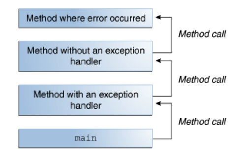
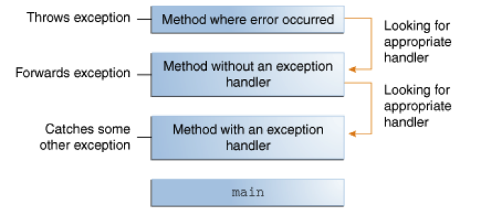
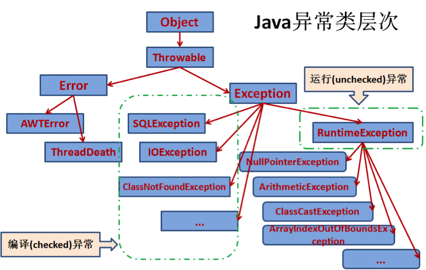

# 1、概述

当方法内部发生一项错误时，该方法会创建一个对象传递给运行时系统（runtime system），这个对象被称为异常对象，包含错误的类型、发生位置，程序状态等一系列信息。

当一个方法抛出异常时，运行时系统会沿着调用栈寻找该异常的处理方式 。

下图中，调用栈下面的方法调用了上面的方法，层层嵌套，一共四层：



调用第三个方法时抛出了一个异常，运行时系统就会沿着调用栈反向寻找该异常的处理程序，当该异常类型与某个异常处理程序声明的异常类型一致时，系统就将该异常交给它处理。



如果系统没能找到合适的异常处理程序，系统将会终止。

# 2、异常类型

java提供了两种处理异常的方式：

- 使用try语句捕获异常并处理；
- 使用throws关键字列出要抛出的异常类型，代表在本方法内不做处理，但是调用该方法的方法必须处理该异常或者继续抛出。

并不是所有异常都需要显式处理（这里的处理代表在程序内部捕获或者抛出），比如IOException、SQLException等是必须要处理的，而NullPointerException、ArithmeticException、IndexOutOfBoundsException等可以不作处理。

理解这一点，就要弄清异常的基本分类。

## 2.1 Checked Exception

这类异常是应用程序可以预见并能够恢复的错误，比如，应用程序需要用户输入一个文件名，然后程序将对这个文件进行读写操作。假如用户输入的文件名不存在，抛出`java.io.FileNotFoundException`，应用程序应该捕获这个异常并提醒用户。类似这种异常就属于checked exception。

**除了Error、RuntimeException以及两者的子类，所有异常都属于checked exception**。

Error与runtime exception合称为unchecked exception。

## 2.2 Error

Error一般来说是应用程序外部引起的异常，应用程序通常不能预见并恢复。比如，程序顺利打开了一个文件，但是由于硬件或者操作系统故障，不能够读取文件中的内容，程序就会抛出`java.io.IOError`。

Error类型的异常不是必须处理的异常，当然，你也可以选择处理它。

## 2.3 Runtime Exception

runtime exception一般来说是程序内部引起的异常，应用程序通常能够预见并恢复。这类异常的出现一般暗示程序存在bug。比如，还是文件操作的例子，由于逻辑错误，传入的文件名为空值，程序就会抛出一个NullPointerException。

虽然可以让程序捕获runtime exception，但更合适的做法是剔除引起这类异常的bug。

java的异常类层次图如下：



# 3、 异常的捕获

checked exception必须捕获，而unchecked exception的捕获不是必须的。例如：

```java
import java.io .*;
import java.util.List;
import java.util.ArrayList;

public class ListOfNumbers {
    private List<Integer> list;
    private static final int SIZE = 10;

    public ListOfNumbers() {
        list = new ArrayList<Integer>(SIZE);
        for (int i = 0; i < SIZE; i++) {
            list.add(new Integer(i));
        }
    }

    public void writeList() {
        try {
            // FileWriter的构造方法 throws IOException, checked exception类型，必须捕获
            PrintWriter out = new PrintWriter(new FileWriter("OutFile.txt"));

            for (int i = 0; i < SIZE; i++) {
             // get(int)方法throws IndexOutOfBoundsException，RuntimeException的子类，unchecked exception类型，不是必须要捕获的
                out.println("Value at: " + i + " = " + list.get(i));
            }
            out.close();
        } catch (IOException e) {  //捕获IOException
            //...
        }
    }
}
```

unchecked exception在一些特殊的情况下也可以选择捕获它，比如上面的程序，现在既要捕获IOException，也要捕获IndexOutOfBoundsException，改写如下：

```java
    public void writeList() {
        try {
            // FileWriter的构造方法 throws IOException, checked exception类型，必须捕获
            PrintWriter out = new PrintWriter(new FileWriter("OutFile.txt"));

            for (int i = 0; i < SIZE; i++) {
            // get(int)方法throws IndexOutOfBoundsException，RuntimeException的子类，unchecked exception类型，不是必须要捕获的
                out.println("Value at: " + i + " = " + list.get(i));
            }
            out.close();
        } catch (IndexOutOfBoundsException e) {  //捕获IndexOutOfBoundsException
            //...
        } catch (IOException e) {  //捕获IOException
            //...
        }

    }
```

如果要同时捕获的异常存在继承关系，即某个异常时另一个异常的子类，必须把父类异常写在子类异常后面，否则会报编译错误。但是，无论有几个捕获语句，最终至多会进入一个catch语句。

例如：

```java
    public class Example {

        public void test() throws IOException {
            throw new IOException();
        }

        public static void main(String args[]) {

            Example example = new Example();

            try {
                example.test();
            } catch (IOException e) {
                System.out.println("捕获了子类异常");
            } catch (Exception e) {
                System.out.println("捕获了父类异常");
            }

        }

    }
```

上例中，IOException是Exception的子类，如果方法抛出了IOException异常，会进入第一个catch子句，但不会进入第二个catch语句；如果抛出的是非IOException的其他Exception子类异常，则会直接进入第二个catch子句。也就是说，不会同时进入两个catch子句。

从Java SE 7以后，一个catch块可以捕获多个异常，上面的捕获语句可简写为：

```java
catch (IndexOutOfBoundsException | IOException ex) {
    ...
}
```

需要注意的是，这种情况下，catch的参数（上例中的“ex”）默认是final的，不能够在catch块中对它再次赋值。

无论异常是否发生，try代码块退出后，finally代码块都会执行，常常用于释放资源。例如：

```java
    public void writeList() {
        PrintWriter out = null;
        try {
            out = new PrintWriter(new FileWriter("OutFile.txt"));

            for (int i = 0; i < SIZE; i++) {
                out.println("Value at: " + i + " = " + list.get(i));
            }

        } catch (IOException e) {  
  		...
        } finally {  //释放资源
            if (out != null) {
                out.close();
            }
        }
    }
```

有三种情况可导致try代码块退出：

- `new FileWriter("OutFile.txt")`抛出IOException
- `list.get(i)`抛出IndexOutOfBoundsException
- 无异常抛出，代码执行完毕

无论发生了上面的那种情况，运行时系统都会保证finally代码块中的程序执行。

需要注意的是，如果在执行try-catch代码块的时候JVM退出了，或者执行try-catch代码块的线程被中断或者杀死，或者使用了System.exit()函数等，finally代码块有可能不被执行。

带有返回值的函数中使用了try-catch-finally块，且返回值与是否发生异常有关，则应该避免将返回值写在finally块中，因为无论是否会发生异常，都会按照finally块的返回值，而忽略try-catch任何地方的返回值。例如：

```java
   public int test() {
        InputStream in = null;
        try {
            File f = new File("F:\test.txt");
            in = new FileInputStream(f);
            return 1;
        } catch (IOException e) {
            e.printStackTrace();
            return 2;
        } finally {
            try {
                in.close();
            } catch (IOException e) {
                e.printStackTrace();
            }
            return 3;
        }
    }
```

上例中，无论是否会抛出IOException，都不会返回1或2，只会返回3。

在try中声明的一个或多个资源，在程序结束后应该关闭，通常我们是在finally代码块中完成这项工作。

从java 7开始，提供了一种更为简洁有效的写法： `try-with-resources`语句。

使用形式如下：

```java
   static String readFirstLineFromFile(String path) throws IOException {
        try (BufferedReader br =
                     new BufferedReader(new FileReader(path))) {
            return br.readLine();
        }
    }
```

`try-with-resources`确保{}内的程序执行完毕后自动关闭资源，所有实现了`java.lang.AutoCloseable`接口（java 7新增的接口，`java.lang.Closeable`的父接口，）的对象都可以当作资源。

# 4、throw与throws

捕获异常的前提是有方法抛出了异常。

throw关键字用于在方法体内部，发生错误的地方抛出异常。如：

```java
    public Object pop() {
        Object obj;

        if (size == 0) {  //栈为空，抛出异常
            throw new EmptyStackException();
        }

        obj = objectAt(size - 1);
        setObjectAt(size - 1, null);
        size--;
        return obj;
    }
```

该方法用于从栈中弹出栈顶元素，但是，如果栈为空就不能进行这项操作，所以就会抛出EmptyStackException异常。

当其他方法调用pop()方法时，就应该考虑到pop()可能会抛出的异常，如果如果pop()抛出的Unchecked Exception，可以不做额外的处理；如果pop()抛出的是checked Exception则必须进行处理，可以用try-catch捕获，也可以选择在本方法内不做捕获，继续用throws关键字抛出，如：

```java
public void callPop() throws EmptyStackException {
	//...
	pop();  //该方法可能会抛出EmptyStackException
	//...
}
```

实际上，一个异常很多时候是由于另一个cause异常引起的，因为 cause 自身也会有 cause，依此类推，就形成了链式异常(Chained Exceptions)。例如：

```java
try {
	//...
} catch (IOException e) {  //捕获到IOException时，抛出另一个异常
    throw new SampleException("Other IOException", e);
}
```

Throwable有一种构造函数可以接受Throwable类型的参数作为引起该异常的cause，Throwable类的initCause(Throwable)、getCause()可以设置cause信息、获取cause信息。