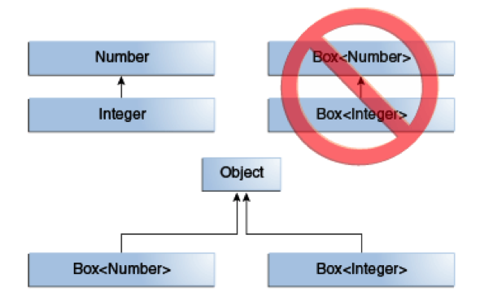
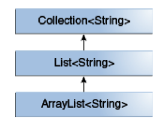
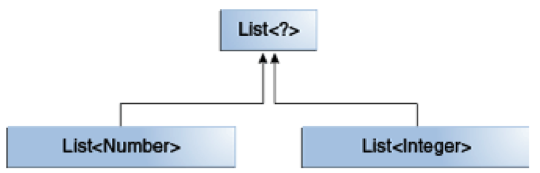
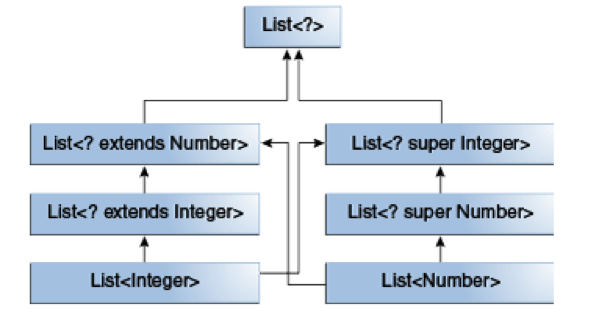

# 1、为什么引入泛型

bug是编程的一部分，我们只能尽自己最大的能力减少出现bug的几率，但是谁也不能保证自己写出的程序不出现任何问题。

错误可分为两种：**编译时错误**与**运行时错误**。编译时错误在编译时可以发现并排除，而运行时错误具有很大的不确定性，在程序运行时才能发现，造成的后果可能是灾难性的。

使用泛型可以使错误在编译时被探测到，从而增加程序的健壮性。

来看一个例子：

```java
    public class Box {
        private Object object;

        public void set(Object object) {
            this.object = object;
        }

        public Object get() {
            return object;
        }
    }
```

按照声明，其中的set()方法可以接受任何java对象作为参数（任何对象都是Object的子类），假如在某个地方使用该类，set()方法预期的输入对象为Integer类型，但是实际输入的却是String类型，就会抛出一个运行时错误，这个错误在编译阶段是无法检测的。例如：

```java
Box box = new Box;  
box.set("abc");  
Integer a = (Integer)box.get();  //编译时不会报错，但是运行时会报ClassCastException
```

运用泛型改造上面的代码：

```java
public class Box<T> {

    private T t;

    public void set(T t) {
        this.t = t;
    }

    public T get() {
        return t;
    }
}
```

当我们使用该类时会指定T的具体类型，该类型参数可以是类、接口、数组等，但是**不能是基本类型**。

比如：

```java
Box<Integer> box = new Box<Integer>;  //指定了类型类型为Integer
//box.set(“abc”);  该句在编译时就会报错
box.set(new Integer(2));
Integer a = box.get();  //不用转换类型
```

可以看到，使用泛型还免除转换操作。

在引入泛型机制之前，要在方法中支持多个数据类型，需要对方法进行重载，在引入范型后，可以更简洁地解决此问题，更进一步可以定义多个参数以及返回值之间的关系。

例如

```java
public void write(Integer i, Integer[] ia);
public void write(Double  d, Double[] da);
public void write(Long l, Long[] la);
```

范型版本为：

```java
public <T> void write(T t, T[] ta);
```

总体来说，泛型机制能够在定义类、接口、方法时把“类型”当做参数使用，有点类似于方法声明中的形式参数，如此我们就能通过不同的输入参数来实现程序的重用。不同的是，形式参数的输入是值，而泛型参数的输入是类型。

# 2、命名规则

类型参数的命名有一套默认规则，为了提高代码的维护性和可读性，强烈建议遵循这些规则。JDK中，随处可见这些命名规则的应用。

- E - Element (通常代表集合类中的元素)
- K - Key
- N - Number
- T - Type
- V - Value
- S,U,V etc. – 第二个，第三个，第四个类型参数……

注意，**父类定义的类型参数不能被子类继承**。

也可以同时声明多个类型变量，用逗号分割，例如：

```java
public interface Pair<K, V> {
    public K getKey();
    public V getValue();
}

public class OrderedPair<K, V> implements Pair<K, V> {

    private K key;
    private V value;

    public OrderedPair(K key, V value) {
        this.key = key;
        this.value = value;
    }

    public K getKey() {
        return key;
    }
  
    public V getValue() {
        return value;
    }
}
```

下面的两行代码创建了`OrderedPair`对象的两个实例。

```java
Pair<String, Integer> p1 = new OrderedPair<String, Integer>("Even", 8);
Pair<String, String>  p2 = new OrderedPair<String, String>("hello", "world");

//也可以将new后面的类型参数省略，简写为：
//Pair<String, Integer> p1 = new OrderedPair<>("Even", 8);

//也可以在尖括号内使用带有类型变量的类型变量，例如：
OrderedPair<String, Box<Integer>> p = new OrderedPair<>("primes", new Box<Integer>(...));
```

泛型是JDK 5.0之后才引入的，为了兼容性，允许不指定泛型参数，但是如此一来，编译器就无法进行类型检查，在编程时，最好明确指定泛型参数。

同样，在方法中也可是使用泛型参数，并且该参数的使用范围仅限于方法体内。例如：

```java
public class Util {
		//该方法用于比较两个Pair对象是否相等。
		//泛型参数必须写在方法返回类型boolean之前
    public static <K, V> boolean compare(Pair<K, V> p1, Pair<K, V> p2) {
        return p1.getKey().equals(p2.getKey()) &&
               p1.getValue().equals(p2.getValue());
    }
}

Pair<Integer, String> p1 = new Pair<>(1, "apple");
Pair<Integer, String> p2 = new Pair<>(2, "pear");
boolean same = Util.<Integer, String>compare(p1, p2);
//实际上，编译器可以通过Pair当中的类型来推断compare需要使用的类型，所以可以简写为：
// boolean same = Util. compare(p1, p2);
```

有时候我们想让类型参数限定在某个范围之内，就需要用到`extends`关键字（`extends`后面可以跟一个接口，这里的`extends`既可以表示继承了某个类，也可以表示实现了某个接口），例如，我们想让参数是数字类型：

```java
    class Box<T extends Number> {  //类型参数限定为Number的子类

        private T t;

        public Box(T t) {
            this.t = t;
        }

        public void print() {
            System.out.println(t.getClass().getName());
        }

        public static void main(String[] args) {

            Box<Integer> box1 = new Box<Integer>(new Integer(2));
            box1.print();  //打印结果：java.lang.Integer
            Box<Double> box2 = new Box<Double>(new Double(1.2));
            box2.print();  //打印结果：java.lang.Double

            Box<String> box2 = new Box<String>(new String("abc"));  //报错，因为String类型不是Number的子类
            box2.print();
        }

    } 
```

如果加入多个限定，可以用“&”连接起来，但是由于java是单继承，多个限定中最多只能有一个类，而且必须放在第一个位置。例如：

```java
    class Box<T extends Number & Cloneable & Comparable> {

        //该类型必须为Number的子类并且实现了Cloneable接口和Comparable接口。
        //……
    }
```

# 3、泛型类的继承

java是面向对象的高级语言，在一个接受A类参数的地方传入一个A的子类是允许的，例如：

```java
Object someObject = new Object();
Integer someInteger = new Integer(10);
someObject = someInteger;   // 因为Integer是Object的子类
```

这种特性同样适用于类型参数，例如：

```java
Box<Number> box = new Box<Number>();
box.add(new Integer(10));   // Integer是Number的子类
box.add(new Double(10.1));  // Double同样是Number的子类
```

但是，有一种情况很容易引起混淆，例如：

```java
//该方法接受的参数类型为Box<Number>
public void boxTest(Box<Number> n) { 
	//……
}
//下面两种调用都会报错
boxTest(Box<Integer>);
boxTest(Box<Double>);
```

虽然Integer和Double都是Number的子类，但是Box<Integer>与Box<Double>并不是Box<Number>的子类，不存在继承关系。Box<Integer>与Box<Double>的共同父类是Object。



以JDK中的集合类为例，ArrayList<E> 实现了 List<E>接口，List<E>接口继承了 Collection<E>接口，所以，ArrayList<String>是List<String>的子类，而非List<Integer>的子类。三者的继承关系如下：



# 4、类型推断

先来看一个例子：

```java
    public class Demo {

        static <T> T pick(T a1, T a2) {
            return a2;
        }

    }
```

静态方法pick()在三个地方使用了泛型，分别限定了两个输入参数的类型与返回类型。调用该方法的代码如下：

`Integer ret = Demo.<Integer> pick(new Integer(1), new Integer(2));`

前文已经提到，上面的代码可以简写为：

`Integer ret = Demo.pick(new Integer(1), new Integer(2));`

因为java编译器会根据方法内的参数类型推断出该方法返回的类型应该为Integer，这种机制称为**类型推断**（Type Inference）。

那么问题来了，加入两个输入参数为不同的类型，应该返回什么类型呢？

例如：

`pick("d", new ArrayList<String>());`

第一个参数为String类型，第二个参数为ArrayList类型，java编译器就会根据这两个参数类型来推断，尽量使返回类型为最明确的一种。本例中，String与ArrayList都实现了同样的接口——Serializable，当然，他们也是Object的子类，Serializable类型显然比Object类型更加明确，因为它的范围更小更细分，所以最终的返回类型应该为Serializable：

`Serializable s = pick("d", new ArrayList<String>());`

在泛型类实例化的时候同样可以利用这种机制简化代码，需要注意的是，尖括号“<>”在此时是不能省略的。例如：

```java
Map<String, List<String>> myMap = new HashMap<String, List<String>>();
//编译器能推断出后面的类型，所以可以简化为：
Map<String, List<String>> myMap = new HashMap<>();
//但是，不能简化为：
Map<String, List<String>> myMap = new HashMap();
//因为HashMap()是HashMap原始类型（Raw Type）的构造函数，而非HashMap<String, List<String>>的构造函数，如果不加“<>”编译器不会进行类型检查
```

# 5、通配符

上文中我们提到过一个例子：

```java
public void boxTest(Box<Number> n){
		//……
}
```

该方法只能接受Box<Number>这一种类型的参数，当我们输入一个Box<Double>或者Box<Integer>时会报错，尽管Integer与Double是Number的子类。可是如果我们希望该方法可以接受Number以及它的任何子类，该怎么办呢？

这时候就要用到通配符了，改写如下：

```java
public void boxTest(Box<? extends Number> n){
		//……
}
```

`? extends Number`就代表可以接受Number以及它的子类作为参数。这种声明方式被称为**上限通配符**（upper bounded wildcard）。

相反地，如果我们希望该方法可以接受Integer，Number以及Object类型的参数怎么办呢？应该使用**下限通配符**（lower bounded wildcard）：

```java
public void boxTest(Box<? super Integer> n){
		//……
}
```

`? super Integer`代表可以接受Integer以及它的父类作为参数。

如果类型参数中既没有extends 关键字，也没有super关键字，只有一个?，代表**无限定通配符**（Unbounded Wildcards）。

通常在两种情况下会使用无限定通配符：

- 如果正在编写一个方法，可以使用Object类中提供的功能来实现
- 代码实现的功能与类型参数无关，比如`List.clear()`与`List.size()`方法，还有经常使用的Class<?>方法，其实现的功能都与类型参数无关。

来看一个例子：

```java
public static void printList(List<Object> list) {
    for (Object elem : list)
        System.out.println(elem + " ");
    System.out.println();
}
```

该方法只能接受List<Object>型的参数，不接受其他任何类型的参数。但是，该方法实现的功能与List之中参数类型没有关系，所以我们希望它可以接受包含任何类型的List参数。代码改动如下：

```java
public static void printList(List<?> list) {
    for (Object elem : list)
        System.out.println(elem + " ");
    System.out.println();
}
```

需要特别注意的是，List<?>与List<Object>并不相同，无论A是什么类型，List<A>是List<?>的子类，但是，List<A>不是List<Object>的子类。

例如：

```java
List<Number> lb = new ArrayList<>();
List<Integer> la = lb;   // 会报编译错误，尽管Integer是Number的子类，但是List<Integer>不是List<Number>的子类
```

List<Integer>与List<Number>的关系如下：



所以，下面的代码是正确的：

```java
List<? extends Integer> intList = new ArrayList<>();
List<? extends Number>  numList = intList;  // 不会报错， List<? extends Integer> 是 List<? extends Number>的子类
```

下面这张图介绍了上限通配符、下限通配符、无限定通配符之间的关系：



编译器可以通过类型推断机制来决定通配符的类型，这种情况被称为通配符捕获。大多时候我们不必担心通配符捕获，除非编译器报出了包含“capture of”的错误。例如：

```java
    public class WildcardError {

        void foo(List<?> i) {
            i.set(0, i.get(0));  //会报编译错误
        }
    }
```

上例中，调用`List.set(int,E)`方法的时候，编译器无法推断`i.get(0)`是什么类型，就会报错。

我们可以借助一个私有的可以捕获通配符的helper方法来解决这种错误：

```java
    public class WildcardFixed {
        void foo(List<?> i) {
            fooHelper(i);
        }


        // 该方法可以确保编译器通过通配符捕获来推断出参数类型
        private <T> void fooHelper(List<T> l) {
            l.set(0, l.get(0));
        }

    }
```

按照约定俗成的习惯，helper方法的命名方法为“原始方法”+“helper”，上例中，原始方法为“foo”，所以命名为“fooHelper”。

关于什么时候该使用上限通配符，什么时候该使用下限通配符，应该遵循一下几项指导规则。

首先将变量分为`in-变量`与`out-变量`：`in-变量`持有为当前代码服务的数据，`out-变量`持有其他地方需要使用的数据。

例如`copy(src, dest)`方法实现了从src源头将数据复制到dest目的地的功能，那么src就是`in-变量`，而dest就是`out-变量`。当然，在一些情况下，一个变量可能既是`in-变量`也是`out-变量`。

- in-变量使用上限通配符；
- out-变量使用下限通配符；
- 当in-变量可以被Object类中的方法访问时，使用无限定通配符；
- 一个变量既是in-变量也是out-变量时，不使用通配符

注意，上面的规则不适用于方法的返回类型。

# 6、类型擦除

java编译器在处理泛型的时候，会做下面几件事：

- 将没有限定的类型参数用Object替换，保证class文件中只含有正常的类、接口与方法；
- 在必要的时候进行类型转换，保证类型安全；
- 在泛型的继承上使用**桥接方法**（bridge methods）保持多态性。

这类操作被称为**类型擦除**（Type Erasure）。

例如：

```java
    public class Node<T> {

        private T data;
        private Node<T> next;

        public Node(T data, Node<T> next) {
            this.data = data;
            this.next = next;
        }

        public T getData() {
            return data;
        }
        // ...
    }
```

该类中的T没有被extends或者super限定，会被编译器替换成Object：

```java
    public class Node {

        private Object data;
        private Node next;

        public Node(Object data, Node next) {
            this.data = data;
            this.next = next;
        }

        public Object getData() {
            return data;
        }
        // ...
    }
```

如果T加了限定，编译器会将它替换成合适的类型：

```
public class Node<T extends Comparable<T>> {

    private T data;
    private Node<T> next;

    public Node(T data, Node<T> next) {
       this.data = data;
        this.next = next;
    }

    public T getData() { return data; }
    // ...
}
```

改造成：

```java
    public class Node {

        private Comparable data;
        private Node next;

        public Node(Comparable data, Node next) {
            this.data = data;
            this.next = next;
        }

        public Comparable getData() {
            return data;
        }
        // ...
    }
```

方法中的类型擦除与之类似。

有时候类型擦除会产生一些我们预想不到的情况，下面通过一个例子来分析它是如何产生的。

```java
   public class Node<T> {

        public T data;

        public Node(T data) {
            this.data = data;
        }

        public void setData(T data) {
            System.out.println("Node.setData");
            this.data = data;
        }
    }

    public class MyNode extends Node<Integer> {
        public MyNode(Integer data) {
            super(data);
        }

        public void setData(Integer data) {
            System.out.println("MyNode.setData");
            super.setData(data);
        }
    }
```

上面的代码定义了两个类，MyNode类继承了Node类，然后运行下面的代码：

```java
MyNode mn = new MyNode(5);
Node n = mn;            
n.setData("Hello");     
Integer x = mn.data;    // 抛出ClassCastException异常
```

上面的代码在类型擦除之后会转换成下面的形式：

```java
MyNode mn = new MyNode(5);
Node n = (MyNode)mn;         

n.setData("Hello");
Integer x = (String)mn.data;   // 抛出ClassCastException异常
```

我们来看看代码是怎么执行的：

- （1）`n.setData("Hello")`调用的其实是MyNode类的setData(Object)方法（从Node类继承的）；
- （2）n引用的对象中的data字段被赋值一个String变量；
- （3）mn引用的相同对象中的data预期为Integer类型（mn为Node<Integer>类型）；
- （4）第四行代码试图将一个String赋值给Integer类型的变量，所以引发了ClassCastException异常。

当编译一个继承了带有参数化泛型的类或借口时，编译器会根据需要创建被称为`bridge method`的桥接方法，这是类型擦除中的一部分。

上例中MyNode继承了Node<Integer>类，类型擦除之后，代码变为：

```java
    class MyNode extends Node {

        //编译器添加的桥接方法
        public void setData(Object data) {
            setData((Integer) data);
        }

        // MyNode的该方法并没有覆写父类的setData(Object data)方法，因为参数类型不一样
        public void setData(Integer data) {
            System.out.println("MyNode.setData");
            super.setData(data);
        }

        // ...
    }
```

# 7、注意事项

为了高效地使用泛型，应该注意下面几个方面：

## （1）不能用基本类型实例化类型参数

例如

```
   class Pair<K, V> {

        private K key;
        private V value;

        public Pair(K key, V value) {
            this.key = key;
            this.value = value;
        }

        // ...
    }
```

当创建一个Pair类时，不能用基本类型来替代K，V两个类型参数。

```java
Pair<int, char> p = new Pair<>(8, 'a');  // 编译错误
Pair<Integer, Character> p = new Pair<>(8, 'a');  //正确写法
```

## （2）不可实例化类型参数

例如：

```java
public static <E> void append(List<E> list) {
    E elem = new E();  // 编译错误
    list.add(elem);
}
```

但是，我们可以通过反射实例化带有类型参数的对象：

```java
public static <E> void append(List<E> list, Class<E> cls) throws Exception {
    E elem = cls.newInstance();   // 正确
    list.add(elem);
}

List<String> ls = new ArrayList<>();
append(ls, String.class);  //传入类型参数的Class对象
```

## （3）不能在静态字段上使用泛型

通过一个反例来说明：

```java
public class MobileDevice<T> {
    private static T os;  //假如我们定义了一个带泛型的静态字段

    // ...
}

MobileDevice<Smartphone> phone = new MobileDevice<>();
MobileDevice<Pager> pager = new MobileDevice<>();
MobileDevice<TabletPC> pc = new MobileDevice<>();
```

因为静态变量是类变量，被所有实例共享，此时，静态变量os的真实类型是什么呢？显然不能同时是Smartphone、Pager、TabletPC。

这就是为什么不能在静态字段上使用泛型的原因。

## （4）不能对带有参数化类型的类使用cast或instanceof方法

```java
public static <E> void rtti(List<E> list) {
    if (list instanceof ArrayList<Integer>) {  // 编译错误
        // ...
    }
}
```

传给盖该方法的参数化类型集合为：

`S = { ArrayList<Integer>, ArrayList<String> LinkedList<Character>, ... }`

运行环境并不会跟踪类型参数，所以分辨不出ArrayList<Integer>与ArrayList<String>，我们能做的至多是使用无限定通配符来验证list是否为ArrayList：

```java
public static void rtti(List<?> list) {
    if (list instanceof ArrayList<?>) {  // 正确
        // ...
    }
}
```

同样，不能将参数转换成一个带参数化类型的对象，除非它的参数化类型为无限定通配符（<?>）：

```java
List<Integer> li = new ArrayList<>();
List<Number>  ln = (List<Number>) li;  // 编译错误
```

当然，如果编译器知道参数化类型肯定有效，是允许这种转换的：

```java
List<String> l1 = ...;
ArrayList<String> l2 = (ArrayList<String>)l1;  // 允许转变，类型参数没变化
```

## （5）不能创建带有参数化类型的数组

例如：

`List<Integer>[] arrayOfLists = new List<Integer>[2];  // 编译错误`

下面通过两段代码来解释为什么不行。先来看一个正常的操作：

```java
Object[] strings = new String[2];
strings[0] = "hi";   // 插入正常
strings[1] = 100;    //报错，因为100不是String类型
```

同样的操作，如果使用的是泛型数组，就会出问题：

```java
Object[] stringLists = new List<String>[];  // 该句代码实际上会报错，但是我们先假定它可以执行
stringLists[0] = new ArrayList<String>();   // 插入正常
stringLists[1] = new ArrayList<Integer>();  // 该句代码应该报ArrayStoreException的异常，但是运行环境探测不到
```

## （6）不能创建、捕获泛型异常

泛型类不能直接或间接继承Throwable类

```java
class MathException<T> extends Exception { /* ... */ }    //编译错误

class QueueFullException<T> extends Throwable { /* ... */} // 编译错误
```

方法不能捕获泛型异常：

```java
public static <T extends Exception, J> void execute(List<J> jobs) {
    try {
        for (J job : jobs)
            // ...
    } catch (T e) {   // 编译错误
        // ...
    }
}
```

但是，我们可以在throw子句中使用类型参数：

```java
class Parser<T extends Exception> {
    public void parse(File file) throws T {     // 正确
        // ...
    }
}
```

## （7）不能重载经过类型擦除后形参转化为相同原始类型的方法

先来看一段代码：

```java
List<String> l1 = new ArrayList<String>();
List<Integer> l2 = new ArrayList<Integer>();
System.out.println(l1.getClass() == l2.getClass());
```

打印结果可能与我们猜测的不一样，打印出的是true，而非false，因为一个泛型类的所有实例在运行时具有相同的运行时类(class)，而不管他们的实际类型参数。

事实上，泛型之所以叫泛型，就是因为它对所有其可能的类型参数，有同样的行为；同样的类可以被当作许多不同的类型。

认识到了这一点，再来看下面的例子：

```java
public class Example { 
    public void print(Set<String> strSet) { }  //编译错误
    public void print(Set<Integer> intSet) { }  //编译错误
}
```

因为Set<String>与Set<Integer>本质上属于同一个运行时类，在经过类型擦出以后，上面的两个方法会共享一个方法签名，相当于一个方法，所以重载出错。