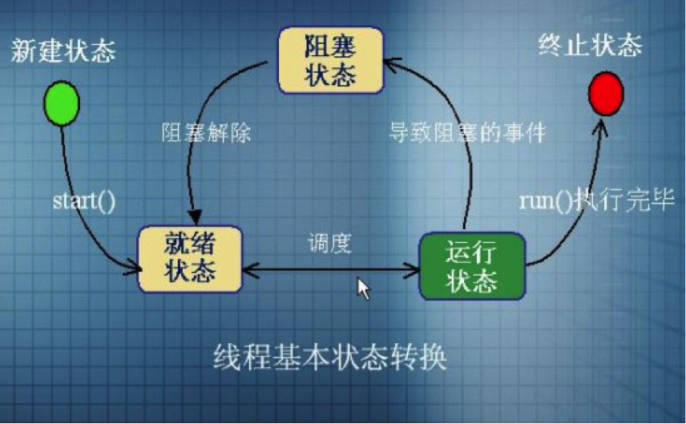
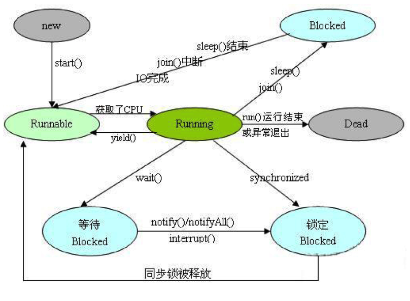
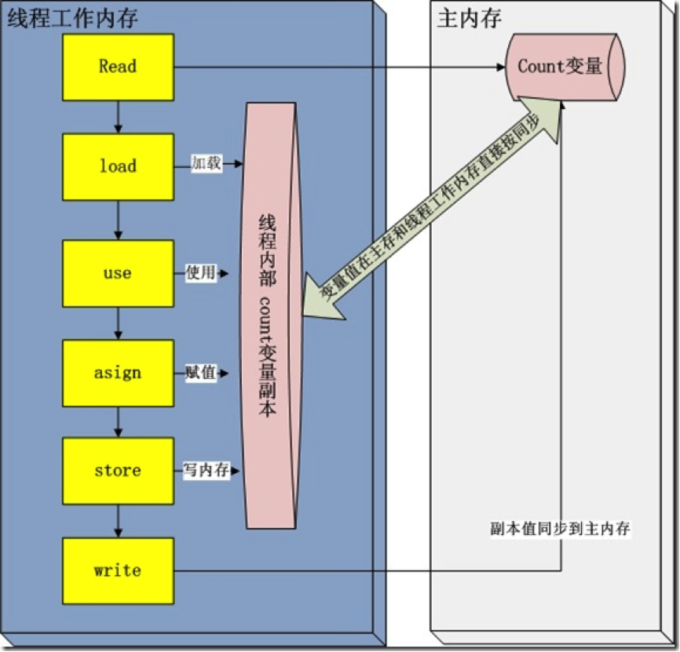

# 1、相关概念

进程是指一个内存中运行的应用程序，每个进程都有自己独立的一块内存空间，一个进程中可以启动多个线程。

一个进程是一个独立的运行环境，它可以被看作一个程序或者一个应用。而**线程是在进程中执行的一个任务**。Java运行环境是一个包含了不同的类和程序的单一进程。线程可以被称为**轻量级进程**。线程需要较少的资源来创建和驻留在进程中，并且可以共享进程中的资源。

多线程程序中，多个线程被并发的执行以提高程序的效率，CPU不会因为某个线程需要等待资源而进入空闲状态。多个线程共享堆内存(heap memory)，因此创建多个线程去执行一些任务会比创建多个进程更好。举个例子，Servlets比CGI更好，是因为Servlets支持多线程而CGI不支持。

这里所谓的多个线程“同时”执行是人的感觉，实际上，是多个线程轮换执行。

**线程调度器**（Thread Scheduler）是一个操作系统服务，它负责为Runnable状态的线程分配CPU时间。一旦我们创建一个线程并启动它，它的执行便依赖于线程调度器的实现。

**时间片**（Time Slicing）是指将可用的CPU时间分配给可用的Runnable线程的过程。分配CPU时间可以基于线程优先级或者线程等待的时间。线程调度并不受到Java虚拟机控制，所以由应用程序来控制它是更好的选择（也就是说不要让你的程序依赖于线程的优先级）。

# 2、线程的生命周期

线程的生命周期有五个状态。

- **新建**(New)：线程对象已经创建，还没有在其上调用start()方法；

- **就绪**(Runnable)：当线程有资格运行，但调度程序还没有把它选定为运行线程时线程所处的状态。当start()方法调用时，线程首先进入就绪状态。在线程运行之后或者从阻塞、等待或睡眠状态回来后，也返回到可运行状态。

- **运行**(Running)：线程调度程序从可运行池中选择一个线程作为当前线程时线程所处的状态。这也是线程进入运行状态的唯一一种方式。

- **阻塞**(Blocked)：这是线程有资格运行时它所处的状态，线程仍旧是活的，但是当前没有条件运行。换句话说，它是可运行的，但是如果某件事件出现，他可能返回到可运行状态。
  阻塞的情况分三种：
  1、等待阻塞：运行的线程执行wait()方法，JVM会把该线程放入等待池中。
  2、同步阻塞：运行的线程在获取对象的同步锁时，若该同步锁被别的线程占用，则JVM会把该线程放入锁池中。
  3、其他阻塞：运行的线程执行sleep()或join()方法，或者发出了I/O请求时，JVM会把该线程置为阻塞状态。当sleep()状态超时、join()等待线程终止或者超时、或者I/O处理完毕时，线程重新转入就绪状态。

- **终止**：当线程的run()方法完成时就认为它死去。这个线程对象也许是活的，但是，它已经不是一个单独执行的线程。线程一旦死亡，就不能复生。如果在一个死去的线程上调用start()方法，会抛出java.lang.IllegalThreadStateException异常。

如下图所示：



各状态间的转换条件如下图所示：



# 3、线程的创建

有两种方法可以创定义、创建线程：

## 3.1 继承java.lang.Thread类

一个`Thread`类实例只是一个对象，像Java中的任何其他对象一样，具有变量和方法，生死于堆上。

```java
public class ThreadInstance extends Thread {
	@Override
	public void run() {
		for (int i = 0; i < 5; i++) {
			System.out.println(name + ":" + "第" + i + "次执行");
		}
	}

	public ThreadInstance(String name) {
		this.name = name;
	}

	private String name;

}
```
测试类：

```java

	Thread threadA = new ThreadInstance("threadA");
	Thread threadB = new ThreadInstance("threadB");
	Thread threadC = new ThreadInstance("threadC");
	

	threadA.start();
	threadB.start();
	threadC.start();
```

打印结果：

> threadA:第0次执行
> threadC:第0次执行
> threadB:第0次执行
> threadC:第1次执行
> threadA:第1次执行
> threadC:第2次执行
> threadB:第1次执行
> threadB:第2次执行
> threadB:第3次执行
> threadB:第4次执行
> threadC:第3次执行
> threadA:第2次执行
> threadC:第4次执行
> threadA:第3次执行
> threadA:第4次执行

注意：由于程序运行当时，CPU状态不同，线程调度器的工作状态不同，每次的打印结果并不一致。

假如我们不调用`start()`方法，而是直接调用`run()`方法，会怎样呢？将测试代码作如下改动：

```java
		Thread threadA = new ThreadInstance("threadA");
		Thread threadB = new ThreadInstance("threadB");
		Thread threadC = new ThreadInstance("threadC");
		
		threadA.run();
		threadB.run();
		threadC.run();
```

打印结果：

> threadA:第0次执行
> threadA:第1次执行
> threadA:第2次执行
> threadA:第3次执行
> threadA:第4次执行
> threadB:第0次执行
> threadB:第1次执行
> threadB:第2次执行
> threadB:第3次执行
> threadB:第4次执行
> threadC:第0次执行
> threadC:第1次执行
> threadC:第2次执行
> threadC:第3次执行
> threadC:第4次执行

此次的打印结果是按照Thread实例的先后顺序执行的，这不是偶然的。从本质上讲，`run()`方法就是`Thread`实例的一个成员方法，如果我们直接调用，就跟调用其他成员方法一样，不会由于线程的的调度而产生阻塞、执行的状态，而会一直执行完毕，完毕之前后面的程序不会执行。先执行`threadA.run()`，完毕后再执行`threadB.run()`，完毕后再执行`threadC.run()`。所以它并不是一个多线程程序
虽然`start()`也是调用run()方法来执行相关任务的，但是start()方法只是让线程进入可执行状态（就绪状态），等待cpu分配给它时间片，并不一定会立刻执行。这时可能有多个线程处在可执行状态，线程调度器轮流分配给它们时间片。所以它是一个多线程程序。

## 3.2 实现java.lang.Runnable接口

必须实现`Runnable`接口中的`run()`方法，跟`Thread`类中的`run()`方法一样，线程执行的任务需要写在`run()`方法中。

```java
public class RunnableInstance implements Runnable {
	@Override
	public void run() {
		for (int i = 0; i < 5; i++) {
			System.out.println(Thread.currentThread().getName() + ":" + "第" + i + "次执行");
		}
	}
}
```

`Thread`的构造方法可接受一个`Runnable`的实例，用`Runnable`的`run()`方法覆盖掉`Thread`类的`run()`方法。

```java
RunnableInstance r1 = new RunnableInstance();
Thread threadA = new Thread(r1,"threadA");
RunnableInstance r2 = new RunnableInstance();
Thread threadB = new Thread(r2,"threadB");
RunnableInstance r3 = new RunnableInstance();
Thread threadC = new Thread(r3,"threadC");

threadA.start();
threadB.start();
threadC.start();
```

打印结果：

> threadA:第0次执行
> threadB:第0次执行
> threadA:第1次执行
> threadB:第1次执行
> threadA:第2次执行
> threadB:第2次执行
> threadC:第0次执行
> threadC:第1次执行
> threadC:第2次执行
> threadC:第3次执行
> threadC:第4次执行
> threadA:第3次执行
> threadA:第4次执行
> threadB:第3次执行
> threadB:第4次执行

执行效果与Thread的效果类似。

在测试程序中，每个`Thread`持有一个`Runnable`实例，互不干扰。试想，如果让`Thread`共享一个`Runnable`实例，会发生什么情况呢？

```java
RunnableInstance r1 = new RunnableInstance();
Thread threadA = new Thread(r1,"threadA");

//RunnableInstance r2 = new RunnableInstance();
Thread threadB = new Thread(r1,"threadB");

//RunnableInstance r3 = new RunnableInstance();
Thread threadC = new Thread(r1,"threadC");

threadA.start();
threadB.start();
threadC.start();
```

打印结果：

> threadA:第0次执行
> threadA:第1次执行
> threadC:第0次执行
> threadB:第0次执行
> threadC:第1次执行
> threadA:第2次执行
> threadC:第2次执行
> threadB:第1次执行
> threadC:第3次执行
> threadA:第3次执行
> threadC:第4次执行
> threadB:第2次执行
> threadB:第3次执行
> threadB:第4次执行
> threadA:第4次执行

可见，与原来的测试结果类似，并没有特别的地方。

这是因为没有出现多线程竞争同一个资源的情况。将Runnable接口改动如下：

```java
public class RunnableInstance implements Runnable {
	@Override
	public void run() {
		while (count > 0) {
			ount = count - 10;
			System.out.println(Thread.currentThread().getName() + "取出10元，余额：" + count);
		}
	}
}
```

在进行测试，打印结果如下：

> threadA取出10元，余额：80
> threadC取出10元，余额：70
> threadB取出10元，余额：80
> threadB取出10元，余额：40
> threadC取出10元，余额：50
> threadC取出10元，余额：20
> threadC取出10元，余额：10
> threadC取出10元，余额：0
> threadA取出10元，余额：60
> threadB取出10元，余额：30

结果显然不正常。

这是因为多个线程同时对同一实例中的统一数据进行了读取操作造成的。为了避免这种情况，使共享数据在同一时刻只能有一个线程进行读取，这就是线程的同步控制。

## 3.3 补充

- 一个运行中的线程总是有名字的，名字有两个来源，一个是虚拟机自己给的名字，一个是你自己的定的名字。在没有指定线程名字的情况下，虚拟机总会为线程指定名字，并且主线程的名字总是mian，非主线程的名字不确定。
- 线程都可以设置名字，也可以获取线程的名字，连主线程也不例外。
- 获取当前线程的对象的方法是：`Thread.currentThread()`；
- 在上面的代码中，只能保证：每个线程都将启动，每个线程都将运行直到完成。一系列线程以某种顺序启动并不意味着将按该顺序执行。对于任何一组启动的线程来说，调度程序不能保证其执行次序，持续时间也无法保证。
- 当线程目标`run()`方法结束时该线程完成。
- 一旦线程启动，它就永远不能再重新启动。只有一个新的线程可以被启动，并且只能一次。一个可运行的线程或死线程可以被重新启动。
- 线程的调度是JVM的一部分，在一个CPU的机器上上，实际上一次只能运行一个线程。一次只有一个线程栈执行。JVM线程调度程序决定实际运行哪个处于可运行状态的线程。众多可运行线程中的某一个会被选中做为当前线程。可运行线程被选择运行的顺序是没有保障的。
- 尽管通常采用队列形式，但这是没有保障的。队列形式是指当一个线程完成“一轮”时，它移到可运行队列的尾部等待，直到它最终排队到该队列的前端为止，它才能被再次选中。事实上，我们把它称为可运行池而不是一个可运行队列，目的是帮助认识线程并不都是以某种有保障的顺序排列成个一个队列的事实。
- 尽管我们没有无法控制线程调度程序，但可以通过别的方式来影响线程调度的方式，比如设置优先级，以及调用`Thread.sleep()`，`wait()`，`yield()`等方法。

# 4、线程的状态装换

## 4.1 sleep()方法

`Thread.sleep(long millis)`和`Thread.sleep(long millis, int nanos)`静态方法强制当前正在执行的线程休眠（暂停执行），以“减慢线程”。当线程睡眠时，它入睡在某个地方，在苏醒之前不会返回到可运行状态。当睡眠时间到期，则返回到可运行状态。但它并不释放对象锁。也就是说如果有`synchronized`同步快，其他线程仍然不能访问共享数据。
例如，在前面的例子中，模拟一个耗时的操作，以减慢线程的执行。可以这么写：

```java
public class ThreadInstance extends Thread {

	public static void main(String[] args) {
		Thread threadA = new ThreadInstance("threadA");
		Thread threadB = new ThreadInstance("threadB");
		Thread threadC = new ThreadInstance("threadC");

		threadA.start();
		threadB.start();
		threadC.start();

	}

	private String name;

	@Override
	public void run() {
		for (int i = 1; i < 9; i++) {

			if (i % 3 == 0) {
				try {
					System.out.println(name + "睡眠2秒");
					Thread.sleep(20);
				} catch (InterruptedException e) {
					e.printStackTrace();
				}
			}

			System.out.println(name + ":" + "第" + i + "次执行");
		}
	}

	public ThreadInstance(String name) {
		this.name = name;
	}
}
```


打印结果：

> threadA:第1次执行
> threadC:第1次执行
> threadB:第1次执行
> threadC:第2次执行
> threadA:第2次执行
> threadC睡眠2秒
> threadB:第2次执行
> threadA睡眠2秒
> threadB睡眠2秒
> threadC:第3次执行
> threadC:第4次执行
> threadC:第5次执行
> threadC睡眠2秒
> threadA:第3次执行
> threadB:第3次执行
> threadA:第4次执行
> threadB:第4次执行
> threadA:第5次执行
> threadB:第5次执行
> threadA睡眠2秒
> threadB睡眠2秒
> threadC:第6次执行
> threadC:第7次执行
> threadC:第8次执行
> threadA:第6次执行
> threadA:第7次执行
> threadA:第8次执行
> threadB:第6次执行
> threadB:第7次执行
> threadB:第8次执行

为了让其他线程有机会执行，将`Thread.sleep()`的调用放线程run()之内。这样才能保证该线程执行过程中会睡眠。

- 线程睡眠是帮助所有线程获得运行机会的最好方法。
- 线程睡眠到期自动苏醒，并返回到就绪状态，不是运行状态。`sleep()`中指定的时间是线程不会运行的最短时间。因此，`sleep()`方法不能保证该线程睡眠到期后就开始执行。
- `sleep()`是静态方法，只能控制当前正在运行的线程。

## 4.2 yield()方法

线程的让步是通过`Thread.yield()`来实现的。`yield()`方法的作用是：暂停当前正在执行的线程对象，并执行其他线程。

要理解`yield()`，必须了解线程的优先级的概念。线程总是存在优先级，优先级范围在1~10之间。JVM线程调度程序是基于优先级的抢先调度机制。在大多数情况下，当前运行的线程优先级将大于或等于线程池中任何线程的优先级。但这仅仅是大多数情况。

注意：当设计多线程应用程序的时候，一定不要依赖于线程的优先级。因为**线程调度优先级操作是没有保障的**，优先级越高只能代表它获取cpu资源的概率比较大。只能把线程优先级作用作为一种提高程序效率的方法，但是要保证程序不依赖这种操作。

当线程池中线程都具有相同的优先级，调度程序的JVM实现自由选择它喜欢的线程。这时候调度程序的操作有两种可能：

- 选择一个线程运行，直到它阻塞或者运行完成为止。
- 时间分片，为池内的每个线程提供均等的运行机会。

设置线程的优先级：线程默认的优先级是创建它的执行线程的优先级。可以通过`setPriority(int newPriority)`更改线程的优先级。例如：

```java
Thread t = new MyThread();
t.setPriority(8);
t.start();
```

线程优先级为1~10之间的正整数，JVM从不会改变一个线程的优先级。然而，1~10之间的值是没有保证的。一些JVM可能不能识别10个不同的值，而将这些优先级进行每两个或多个合并，变成少于10个的优先级，则两个或多个优先级的线程可能被映射为一个优先级。

**线程默认优先级是5**，Thread类中有三个常量，定义线程优先级范围：

- static int MAX_PRIORITY：线程可以具有的最高优先级。
- static int MIN_PRIORITY ：线程可以具有的最低优先级。
- static int NORM_PRIORITY ：分配给线程的默认优先级。

`yield()`应该做的是让当前运行线程回到可运行状态，以允许具有相同优先级的其他线程获得运行机会。因此，使用`yield()`的目的是让相同优先级的线程之间能适当的轮转执行。但是，实际中无法保证`yield()`达到让步目的，因为让步的线程还有可能被线程调度程序再次选中。

`yield()`从未导致线程转到等待/睡眠/阻塞状态。在大多数情况下，`yield()`将导致线程从运行状态转到就绪状态，但有可能没有效果。

## 4.3 join()方法

`join()` 方法主要是让调用该方法的`thread`完成`run`方法里面的东西后，再执行`join()`方法后面的代码。示例：

```java
public class ThreadInstance extends Thread {

	public static int count = 5;

	@Override
	public void run() {
		for (int i = 0; i < 5; i++) {
			count--;
			System.out.print(count + ",");
		}
	}

	public static void main(String[] args) {
		Thread threadA = new ThreadInstance();
		threadA.start();
		System.out.println(ThreadInstance.count);
	}
}
```

打印结果如下：

> 5
> 4,3,2,1,0,

就是说，`System.out.println(ThreadInstance.count)`这条语句打印出的结果为“5”，而不是“0”。

这是因为在上面的程序中存在两个线程，一个是主线程main，一个是子线程threadA。两个线程并发执行，`threadA.start()`只是让`threadA`进入就绪状态，并不一定会立即执行。同时main主线程不会等待`threadA`执行完毕，而是执行后面的语句，此时静态变量`count`还没有被`threadA`改变，打印出的结果是“5”。

如果想保证`threadA`执行完毕之后再执行后面的语句，就需要用到`join()`方法了。将程序修改如下：

```java
public class ThreadInstance extends Thread {

	public static int count = 5;

	@Override
	public void run() {
		for (int i = 0; i < 5; i++) {
			count--;
			System.out.print(count + ",");
		}
		System.out.println();
	}

	public static void main(String[] args) throws InterruptedException {
		Thread threadA = new ThreadInstance();
		threadA.start();
		threadA.join();
		System.out.println(ThreadInstance.count);
	}
}
```

打印结果如下：

> 4,3,2,1,0,
> 0

可见，`join()`方法保证了`threadA`执行完毕之后采取执行后面的语句。

在上例中，main线程是执行`threadA`的线程，`join`从字面上理解是“加入”的意思，就是表示把该线程加入到调用该线程的线程，保证其执行完毕再进行下一步的工作。

另外，`join()`方法还有带超时限制的重载版本。例如`threadA.join(5000);`则让线程等待5000毫秒，如果超过这个时间，则停止等待，变为可运行状态。

## 4.4 interrupt()方法

首先来说说java中的中断机制，Java中断机制是一种协作机制，也就是说通过中断并不能直接终止另一个线程，而需要被中断的线程自己处理中断。当调用`interrupt()`方法的时候，只是设置了要中断线程的中断状态，而此时被中断的线程的可以通过非静态方法`isInterrupted()`或者是静态方法`interrupted()`方法判断当前线程的中断状态是否标志为中断。

来看一个例子：

```java
class ATask implements Runnable {

	private double d = 0.0;

	public void run() {
		// 死循环执行打印"I am running!" 和做消耗时间的浮点计算
		while (true) {
			System.out.println("I am running!");

			for (int i = 0; i < 900000; i++) {
				d = d + (Math.PI + Math.E) / d;
			}

		}
	}
}

public class InterruptTaskTest {

	public static void main(String[] args) throws Exception {
		// 将任务交给一个线程执行
		Thread t = new Thread(new ATask());
		t.start();

		// 运行一断时间中断线程
		Thread.sleep(100);
		System.out.println("************************");
		System.out.println("Interrupted Thread!");
		System.out.println("************************");
		t.interrupt();
	}
}
```

运行这个程序，我们发现调用interrupt()后，程序仍在运行，如果不强制结束，程序将一直运行下去，如下所示:

> I am running! 
> I am running! 
> I am running! 
> I am running! 
>
> ************************
> Interrupted Thread! 
> ************************
> I am running! 
> I am running! 
> I am running! 
> I am running! 
> I am running! 
> .... 

`interrupt()`**只是改变中断状态而已**。

`interrupt()`不会中断一个正在运行的线程。这一方法实际上完成的是，给受阻塞的线程抛出一个中断信号，这样受阻线程就得以退出阻塞的状态。更确切地说，如果线程被`Object.wait`,` Thread.join`和`Thread.sleep`三种方法之一阻塞，那么，它将接收到一个中断异常，从而提早地终结被阻塞状态。

如果线程没有被阻塞，这时调用`interrupt()`将不起作用；否则，线程就将得到`InterruptedException`异常（该线程必须事先预备好处理此状况），接着逃离阻塞状态。

离开线程有两种常用的方法： 

- 抛出`InterruptedException`
- 用`Thread.interrupted()`检查是否发生中断

下面分别看一下这两种方法： 

在阻塞操作时如`Thread.sleep()`时被中断会抛出`InterruptedException`(注意，进行不能中断的IO操作而阻塞和要获得对象的锁调用对象的`synchronized`方法而阻塞时不会抛出`InterruptedException`)。 

```java
class ATask implements Runnable {

	private double d = 0.0;

	public void run() {
		// 死循环执行打印"I am running!" 和做消耗时间的浮点计算
		try {
			while (true) {
				System.out.println("I am running!");

				for (int i = 0; i < 900000; i++) {
					d = d + (Math.PI + Math.E) / d;
				}
				// 休眠一断时间，在休眠的过程中接收到中断信号，会抛出InterruptedException
				Thread.sleep(50);
			}
		} catch (InterruptedException e) {
			System.out.println("ATask.run() interrupted!");
		}
	}
}
```

打印结果：

> I am running! 
> I am running! 
>
> ************************
> Interrupted Thread! 
> ************************
> ATask.run() interrupted!
>

`Thread.interrupted()`检查是否发生中断。`Thread.interrupted()`能告诉你线程是否发生中断，并将清除中断状态标记，所以程序不会两次通知你线程发生了中断。

```java
class ATask implements Runnable {

	private double d = 0.0;

	public void run() {

		// 检查程序是否发生中断
		while (!Thread.interrupted()) {
			System.out.println("I am running!");

			for (int i = 0; i < 900000; i++) {

				d = d + (Math.PI + Math.E) / d;
			}
		}

		System.out.println("ATask.run() interrupted!");
	}
}
```

打印结果：

> I am running! 
> I am running! 
> I am running! 
> I am running! 
> I am running! 
> I am running! 
> I am running! 
>
> ************************
> Interrupted Thread! 
> ************************
> ATask.run() interrupted!
>

但这其实是在`sleep`、`wait`、`join`这些方法内部会不断检查中断状态的值，而自己抛出的`InterruptedException`。

当线程A终于执行到`sleep`、`wait`、`join`时，才马上会抛出 `InterruptedException`。

若没有调用`sleep`、`wait`、`join`这些方法,即没有在线程里自己检查中断状态自己抛出`InterruptedException`的话，那`InterruptedException`是不会被抛出来的。

我们可结合使用两种方法来达到可以通过`interrupt()`中断线程。请看下面例子：

```java
class ATask implements Runnable {

	private double d = 0.0;

	public void run() {

		try {
			// 检查程序是否发生中断
			while (!Thread.interrupted()) {
				System.out.println("I am running!");

				Thread.sleep(20);

				System.out.println("Calculating");
				for (int i = 0; i < 900000; i++) {

					d = d + (Math.PI + Math.E) / d;
				}
			}

		} catch (InterruptedException e) {
			System.out.println("Exiting by Exception");
		}

		System.out.println("ATask.run() interrupted!");
	}
}
```

还有一点需要特别注意，`Thread.stop()`也是让线程中断的静态方法，与`Thread.interrupt()` 最大的区别在于：`interrupt()`方法是设置线程的中断状态，让用户自己选择时间地点去结束线程；而`stop()`方法会在代码的运行处直接抛出一个`ThreadDeath`错误，这是一个`java.lang.Error`的子类。所以直接使用`stop()`方法就有可能造成对象的不一致性。

`Thread.stop()`**不推荐使用**。

## 4.5 其他方法

除了以上方法，`Thread`类中还有JDK旧版本的遗留方法。

`suspend() `/`resume()`方法对：`suspend()`是线程挂起，直到调用`resume()`方法使之恢复到就绪状态。因为这对方法具有死锁倾向，JDK只是为了兼容旧版本而保留，不推荐使用。

`stop()`方法：无论该线程在做些什么，它所代表的线程都被迫异常停止，并抛出一个新创建的 ThreadDeath 对象，作为异常。 该方法具有固有的不安全性。JDK只是为了兼容旧版本而保留，不推荐使用。

## 4.6 补充

到目前位置，介绍了线程离开运行状态的3种方法：

- 调用`Thread.sleep()`：使当前线程睡眠至少多少毫秒（尽管它可能在指定的时间之前被中断）。
- 调用`Thread.yield()`：不能保障太多事情，尽管通常它会让当前运行线程回到可运行性状态，使得有相同优先级的线程有机会执行。
- 调用`join()`方法：保证当前线程停止执行，直到该线程所加入的线程完成为止。然而，如果它加入的线程没有存活，则当前线程不需要停止。

这里要明确的一点，不管程序员怎么编写调度，只能最大限度的影响线程执行的次序，而不能做到精准控制。

除了以上三种方式外，还有下面几种特殊情况可能使线程离开运行状态：

- 线程的run()方法完成。
- 在对象上调用wait()方法（不是在线程上调用）。
- 线程不能在对象上获得锁定，它正试图运行该对象的方法代码。
- 线程调度程序可以决定将当前运行状态移动到可运行状态，以便让另一个线程获得运行机会，而不需要任何理由。

# 5、线程的同步

## 5.1 synchronized

由于同一进程的多个线程共享同一片存储空间，在带来方便的同时，也带来了访问冲突这个严重的问题。Java语言提供了专门机制以解决这种冲突，有效避免了同一个数据对象被多个线程同时访问。 

在具体的Java代码中需要完成一下两个操作：

- 把竞争访问的资源变量标识为private；
- 同步哪些修改变量的代码，使用`synchronized`关键字同步方法或代码。

当然这不是唯一控制并发安全的途径。

**Java中每个对象都有一个内置锁**。

当程序运行到非静态的`synchronized`同步方法上时，自动获得与正在执行代码类的当前实例（this实例）有关的锁。获得一个对象的锁也称为获取锁、锁定对象、在对象上锁定或在对象上同步。

当程序运行到`synchronized`同步方法或代码块时才该对象锁才起作用。

**一个对象只有一个锁**。所以，如果一个线程获得该锁，就没有其他线程可以获得锁，直到第一个线程释放（或返回）锁。这也意味着任何其他线程都不能进入该对象上的`synchronized`方法或代码块，直到该锁被释放。

释放锁是指持锁线程退出了`synchronized`同步方法或代码块。

在使用同步代码块时候，应该指定在哪个对象上同步，也就是说要获取哪个对象的锁。例如：

```java
	public int fix(int y) {
		synchronized (this) {
			x = x - y;
		}
		return x;
	}
```

当然，同步方法也可以改写为非同步方法，但功能完全一样的，例如：

```java
	public synchronized int getX() {
		return x++;
	}
```

与

```java
	public int getX() {
		synchronized (this) {
			return x;
		}
	}
```

效果是完全一样的。

要同步静态方法，需要一个用于整个类对象的锁，这个对象是就是这个类（XXX.class)。显而易见，因为静态方法、静态变量都是与类绑定的，而不是与某个特定的对象绑定。

例如：

```java
	public static synchronized int setName(String name) {
		Xxx.name = name;
	}
```

等价于

```java
	public static int setName(String name) {
		synchronized (Xxx.class) {
			Xxx.name = name;
		}
	}
```

如果线程试图进入同步方法，而其锁已经被占用，则线程在该对象上被阻塞。实质上，线程进入该对象的的一种**锁池**中，必须在那里等待，直到其锁被释放，该线程再次变为可运行或运行为止。

当考虑阻塞时，一定要注意哪个对象正被用于锁定：

- 调用同一个对象中非静态同步方法的线程将彼此阻塞。如果是不同对象，则每个线程有自己的对象的锁，线程间彼此互不干预。
- 调用同一个类中的静态同步方法的线程将彼此阻塞，它们都是锁定在相同的Class对象上。
- 静态同步方法和非静态同步方法将永远不会彼此阻塞，因为静态方法锁定在Class对象上，非静态方法锁定在该类的对象上。
- 对于同步代码块，要看清楚什么对象已经用于锁定（`synchronized`后面括号的内容）。在同一个对象上进行同步的线程将彼此阻塞，在不同对象上锁定的线程将永远不会彼此阻塞。

## 5.2 volatile关键字

在Java内存模型中，有main memory，每个线程也有自己的memory (例如寄存器)。为了性能，一个线程会在自己的memory中保持要访问的变量的副本。这样就会出现同一个变量在某个瞬间，在一个线程的memory中的值可能与另外一个线程memory中的值，或者main memory中的值不一致的情况。 

一个变量声明为`volatile`，就意味着这个变量是随时会被其他线程修改的，因此不能将它cache在线程memory中。

当我们使用volatile关键字去修饰变量的时候，所以线程都会直接读取该变量并且不缓存它。这就确保了线程读取到的变量是同内存中是一致的。

`volatile`可以用在任何变量前面，但**不能用于final变量前面**，因为final型的变量是禁止修改的。也不存在线程安全的问题。

Java 语言中的 `volatile` 变量可以被看作是一种 “程度较轻的 `synchronized`”；与 `synchronized` 块相比，`volatile` 变量所需的编码较少，并且运行时开销也较少，但是它所能实现的功能也仅是 `synchronized` 的一部分。

之所以要单独提出`volatile`这个不常用的关键字原因是这个关键字在高性能的多线程程序中也有很重要的用途，只是这个关键字用不好会出很多问题。

只能在有限的一些情形下使用 `volatile` 变量替代锁。要使 `volatile `变量提供理想的线程安全，必须同时满足下面两个条件：

- 对变量的写操作不依赖于当前值。
- 该变量没有包含在具有其他变量的不变式中。

实际上，这些条件表明，可以被写入 `volatile` 变量的这些有效值独立于任何程序的状态，包括变量的当前状态。

第一个条件的限制使 volatile 变量不能用作线程安全计数器。虽然增量操作（x++）看上去类似一个单独操作，实际上它是一个由`读取－修改－写入`操作序列组成的组合操作，必须以原子方式执行，而 **`volatile` 不能提供必须的原子特性**。实现正确的操作需要使 x 的值在操作期间保持不变，而 `volatile` 变量无法实现这点。（然而，如果将值调整为只从单个线程写入，那么可以忽略第一个条件。）

大多数编程情形都会与这两个条件的其中之一冲突，使得 `volatile` 变量不能像 `synchronized` 那样普遍适用于实现线程安全。

比如做了一个i++操作，计算机内部做了三次处理：`读取－修改－写入`。

同样，对于一个long型数据，做了个赋值操作，在32位系统下需要经过两步才能完成，先修改低32位，然后修改高32位。
假想一下，当将以上的操作放到一个多线程环境下操作时候，有可能出现的问题，是这些步骤执行了一部分，而另外一个线程就已经引用了变量值，这样就导致了读取脏数据的问题。

用`volatile`修饰的变量，线程在每次使用变量的时候，都会读取变量修改后的最的值。`volatile`很容易被误用，用来进行原子性操作。

下面看一个例子，我们实现一个计数器，每次线程启动的时候，会调用计数器inc方法，对计数器进行加一。

```java
public class Counter {

	public static int count = 0;

	public static void inc() {

		// 这里延迟1毫秒，使得结果明显
		try {
			Thread.sleep(1);
		} catch (InterruptedException e) {
		}

		count++;
	}

	public static void main(String[] args) {

		// 同时启动1000个线程，去进行i++计算，看看实际结果

		for (int i = 0; i < 1000; i++) {
			new Thread(new Runnable() {
				@Override
				public void run() {
					Counter.inc();
				}
			}).start();
		}

		// 这里每次运行的值都有可能不同,可能为1000
		System.out.println("运行结果:Counter.count=" + Counter.count);
	}
}
```

实际运算结果每次可能都不一样，本次的结果为：

> 运行结果:Counter.count=995

可以看出，在多线程的环境下，Counter.count并没有期望结果是1000

很多人以为，这个是多线程并发问题，只需要在变量count之前加上volatile就可以避免这个问题，那我们在修改代码看看，看看结果是不是符合我们的期望

```java
public class Counter {

	public volatile static int count = 0;

	public static void inc() {

		// 这里延迟1毫秒，使得结果明显
		try {
			Thread.sleep(1);
		} catch (InterruptedException e) {
		}

		count++;
	}

	public static void main(String[] args) {

		// 同时启动1000个线程，去进行i++计算，看看实际结果

		for (int i = 0; i < 1000; i++) {
			new Thread(new Runnable() {
				@Override
				public void run() {
					Counter.inc();
				}
			}).start();
		}

		// 这里每次运行的值都有可能不同,可能为1000
		System.out.println("运行结果:Counter.count=" + Counter.count);
	}
}
```

> 运行结果:Counter.count=992

运行结果还是没有我们期望的1000，下面我们分析一下原因。

jvm在运行时刻内存的分配，其中有一个内存区域是jvm虚拟机栈，每一个线程运行时都有一个线程栈，

线程栈保存了线程运行时候变量值信息。当线程访问某一个对象时候值的时候，首先通过对象的引用找到对应在堆内存的变量的值，然后把堆内存。

变量的具体值load到线程本地内存中，建立一个变量副本，之后线程就不再和对象在堆内存变量值有任何关系，而是直接修改副本变量的值，在修改完之后的某一个时刻（线程退出之前），自动把线程变量副本的值回写到对象在堆中变量。这样在堆中的对象的值就产生变化了。

下面一幅图描述这写交互：



- read and load：从主存复制变量到当前工作内存
- use and assign： 执行代码，改变共享变量值 
- store and write：用工作内存数据刷新主存相关内容

其中use and assign 可以多次出现。

但是这一些操作并不是原子性，也就是 在read load之后，如果主内存count变量发生修改之后，线程工作内存中的值由于已经加载，不会产生对应的变化，所以计算出来的结果会和预期不一样

对于`volatile`修饰的变量，jvm虚拟机只是保证**从主内存加载到线程工作内存的值是最新的**。

例如假如线程1，线程2 在进行read，load 操作中，发现主内存中count的值都是5，那么都会加载这个最新的值。

在线程1堆count进行修改之后，会write到主内存中，主内存中的count变量就会变为6。

线程2由于已经进行read，load操作，在进行运算之后，也会更新主内存count的变量值为6。

导致两个线程及时用`volatile`关键字修改之后，还是会存在并发的情况。

## 5.3 死锁

死锁对Java程序来说，是很复杂的，也很难发现问题。当两个线程被阻塞，每个线程在等待另一个线程时就发生死锁。

来看一个实例：

```java
public class DeadlockRisk{
	private static class Resource
	{
		public int value;
	}

	private Resource resourceA = new Resource();
	private Resource resourceB = new Resource();

	public int read() {
		synchronized (resourceA) {
			synchronized (resourceB) {
				return resourceB.value + resourceA.value;
			}
		}
	}

	public void write(int a, int b) {
		synchronized (resourceB) {
			synchronized (resourceA) {
				resourceA.value = a;
				resourceB.value = b;
			}
		}
	}
}
```

假设read()方法由一个线程启动，write()方法由另外一个线程启动。读线程将拥有resourceA锁，写线程将拥有resourceB锁，两者都坚持等待的话就出现死锁。

实际上，上面这个例子发生死锁的概率很小。因为在代码内的某个点，CPU必须从读线程切换到写线程，所以，死锁基本上不能发生。

就算我们费尽心机去写一个故意死锁的程序，也不见会发生死锁。但是，无论代码中发生死锁的概率有多小，一旦发生死锁，程序就死掉。

## 5.4 补充

- 对于同步，要时刻清醒在哪个对象上同步，这是关键。
- 每个对象只有一个锁；当提到同步时，应该清楚在什么上同步，也就是说在哪个对象上同步。
- 不必同步类中所有的方法，类可以同时拥有同步和非同步方法。
- 如果两个线程要执行一个类中的`synchronized`方法，并且两个线程使用相同的实例来调用方法，那么一次只能有一个线程能够执行方法，另一个需要等待，直到锁被释放。也就是说：如果一个线程在对象上获得一个锁，就没有任何其他线程可以进入（该对象的）类中的任何一个同步方法。
- 如果线程拥有同步和非同步方法，则非同步方法可以被多个线程自由访问而不受锁的限制。
- **线程睡眠时，它所持的任何锁都不会释放**。
- 线程可以获得多个锁。比如，在一个对象的同步方法里面调用另外一个对象的同步方法，则获取了两个对象的同步锁。
- 同步损害并发性，应该尽可能缩小同步范围。同步不但可以同步整个方法，还可以同步方法中一部分代码块。
- **`synchronized`关键字是不能继承的**，也就是说，基类的方法`synchronized f(){} `在继承类中并不自动是`synchronized f(){}`，而是变成了`f(){}`。继承类需要你显式的指定它的某个方法为`synchronized`方法。

# 6、线程的交互

## 6.1 wait与notify

这里所提到的交互指java.lang.Object的类的三个方法：

-  `void notify()`：唤醒在此对象监视器上等待的单个线程。
-  `void notifyAll()` ：唤醒在此对象监视器上等待的所有线程。
-  `void wait()` ：导致当前的线程等待，直到其他线程调用此对象的 notify()方法或 notifyAll()方法。

当然，`wait()`还有另外两个重载方法：

- `void wait(long timeout) `：导致当前的线程等待，直到其他线程调用此对象的 `notify()`方法或 `notifyAll()`方法，或者超过指定的时间量。 
- `void wait(long timeout, int nanos)` ：导致当前的线程等待，直到其他线程调用此对象的 `notify()`方法或 `notifyAll()`方法，或者其他某个线程中断当前线程，或者已超过某个实际时间量。

以上这些方法是帮助线程传递线程关心的状态。

来看一个实例：

```java
// 计算输出其他线程锁计算的数据
public class ThreadA {
	public static void main(String[] args) {
		ThreadB b = new ThreadB();
		// 启动计算线程
		b.start();
		// 线程A拥有b对象上的锁。线程为了调用wait()或notify()方法，该线程必须是那个对象锁的拥有者
		synchronized (b) {
			try {
				System.out.println("等待对象b完成计算...");
				// 当前线程A释放对象b的锁，放到对象b的等待队列中，直到收到对象b发出notify()或者notifyAll()的信号。
				// 注意，b.wait()并不是让b等待，而是让当前线程等待b
				b.wait();
			} catch (InterruptedException e) {
				e.printStackTrace();
			}
			System.out.println("b对象计算的总和是：" + b.total);
		}
	}
}

// 计算1+2+3 ... +100的和
public class ThreadB extends Thread {
	int total;

	public void run() {
		synchronized (this) {
			for (int i = 0; i < 101; i++) {
				total += i;
			}
			// （完成计算了）唤醒在此对象监视器上等待的单个线程，在本例中线程A被唤醒
			notify();
		}
	}
}
```

多个线程在等待一个对象锁时候使用`notifyAll()`。

在多数情况下，最好通知等待某个对象的所有线程。如果这样做，可以在对象上使用`notifyAll()`让所有在此对象上等待的线程冲出等待区，返回到可运行状态。

依照上面的例子再写一个实例：

```java
// 计算1+2+3 ... +100的和
public class Calculator extends Thread {
	int total;

	public void run() {
		synchronized (this) {
			for (int i = 0; i < 101; i++) {
				total += i;
			}
			try {
				Thread.sleep(1000);
			} catch (InterruptedException e) {
				e.printStackTrace();
			}

			notifyAll();
		}
	}
}

public class TestThread extends Thread {

	private Calculator calculator;

	public TestThread(Calculator c) {
		this.calculator = c;
	}

	public void run() {
		synchronized (calculator) {
			try {
				System.out.println(Thread.currentThread() + "等待计算结果...");
				calculator.wait();

			} catch (InterruptedException e) {
				e.printStackTrace();
			}
			System.out.println(Thread.currentThread() + "计算结果为：" + calculator.total);
		}
	}

	public static void main(String[] args) {
		Calculator c = new Calculator();

		TestThread threadA = new TestThread(c);
		TestThread threadB = new TestThread(c);
		TestThread threadC = new TestThread(c);

		threadA.start();
		threadB.start();
		threadC.start();
		c.start();

	}

}
```

运行程序，打印结果如下：

> Thread[Thread-1,5,main]等待计算结果...
> Thread[Thread-3,5,main]等待计算结果...
> Thread[Thread-2,5,main]等待计算结果...
> Thread[Thread-2,5,main]计算结果为：5050
> Thread[Thread-3,5,main]计算结果为：5050
> Thread[Thread-1,5,main]计算结果为：5050

虽然与我们预期的结果一样，但是这是一个有漏洞的程序，下面将做具体分析。

```java
threadA.start();
threadB.start();
threadC.start();
c.start();
```

这四行代码虽然有先后顺序，但是我们一再强调，**调用`start()`方法之后线程并不一定立刻执行**，而是进入到就绪状态，至于先执行哪个，后执行哪个，由线程调度器随机决定，是不可预测的。

假如线程c先执行完毕，这时候`threadA`（或者t`hreadB`、`threadC`）还没有执行，那么问题就出现了，`threadA`需要等待c发出的`notifyAll()`信号，但是c早已执行完毕，，不可能在第二次执行`notifyAll()`函数，`threadA`就会永远等下去。

因此，当等待的事件发生时，需要能够检查`notifyAll()`通知事件是否已经发生。

通常，解决上面问题的最佳方式是利用某种循环，该循环检查某个条件表达式，只有当正在等待的事情还没有发生的情况下，它才继续等待。

当在对象上调用`wait()`方法时，执行该代码的线程立即放弃它在对象上的锁。然而调用`notify()`时，并不意味着这时线程会放弃其锁。如果线程仍然在完成同步代码，则线程在移出之前不会放弃锁。因此，只要调用`notify()`并不意味着这时该锁变得可用。

必须从同步环境内调用`wait()`、`notify()`、`notifyAll()`方法。只有在线程拥有该对象的锁时，才能调用这三个方法。

`wait()`、`notify()`、`notifyAll()`都是`Object`的实例方法。与每个对象具有锁一样，每个对象可以有一个线程列表，他们等待来自该信号（通知）。线程通过执行对象上的`wait()`方法获得这个等待列表。从那时候起，它不再执行任何其他指令，直到调用对象的`notify()`方法为止。如果多个线程在同一个对象上等待，则将只选择一个线程（不保证以何种顺序）继续执行。如果没有线程等待，则不采取任何特殊操作。

## 6.2 与suspend和resume的对比

初看`wait()`与`notify()`方法与 `suspend()`和`resume()`方法对没有什么分别，但是事实上它们是截然不同的。区别的核心在于，前面叙述的所有方法，阻塞时都不会释放占用的锁（如果占用了的话），而这一对方法则相反。上述的核心区别导致了一系列的细节上的区别。 

首先，前面叙述的所有方法都隶属于 Thread 类，但是这一对却直接隶属于 `Object` 类，也就是说，所有对象都拥有这一对方法。初看起来这十分不可思议，但是实际上却是很自然的，因为这一对方法阻塞时要释放占用的锁，而锁是任何对象都具有的，调用任意对象的 `wait()` 方法导致线程阻塞，并且该对象上的锁被释放。而调用 任意对象的`notify()`方法则导致因调用该对象的 `wait()` 方法而阻塞的线程中随机选择的一个解除阻塞（但要等到获得锁后才真正可执行）。 

其次，前面叙述的所有方法都可在任何位置调用，但是这一对方法却必须在 `synchronized` 方法或块中调用，理由也很简单，只有在`synchronized` 方法或块中当前线程才占有锁，才有锁可以释放。同样的道理，调用这一对方法的对象上的锁必须为当前线程所拥有，这样才有锁可以释放。因此，这一对方法调用必须放置在这样的 `synchronized` 方法或块中，该方法或块的上锁对象就是调用这一对方法的对象。若不满足这一条件，则程序虽然仍能编译，但在运行时会出现`IllegalMonitorStateException` 异常。 

`wait()` 和 `notify()` 方法的上述特性决定了它们经常和`synchronized` 方法或块一起使用，将它们和操作系统的进程间通信机制作一个比较就会发现它们的相似性：`synchronized`方法或块提供了类似于操作系统原语的功能，它们的执行不会受到多线程机制的干扰，而这一对方法则相当于 `block` 和`wakeup` 原语（这一对方法均声明为 synchronized）。它们的结合使得我们可以实现操作系统上一系列精妙的进程间通信的算法（如信号量算法），并用于解决各种复杂的线程间通信问题。 

## 6.3 补充

- 调用 `notify() `方法导致解除阻塞的线程是从因调用该对象的 `wait()` 方法而阻塞的线程中随机选取的，我们无法预料哪一个线程将会被选择，所以编程时要特别小心，避免因这种不确定性而产生问题。 
- 除了 `notify()`，`notifyAll() `也可起到类似作用，唯一的区别在于，调用 `notifyAll() `方法将把因调用该对象的 `wait()` 方法而阻塞的所有线程一次性全部解除阻塞。当然，只有获得锁的那一个线程才能进入可执行状态。 

# 7、守护线程

守护线程是一类特殊的线程，它和普通线程的区别在于它并不是应用程序的核心部分，当一个应用程序的所有非守护线程终止运行时，即使仍然有守护线程在运行，应用程序也将终止，反之，只要有一个非守护线程在运行，应用程序就不会终止。守护线程一般被用于在后台为其它线程提供服务。 

可以通过调用方法 `isDaemon()` 来判断一个线程是否是守护线程，也可以调用方法 `setDaemon()` 来将一个线程设为守护线程。该方法必须在启动线程前调用。该方法首先调用该线程的 `checkAccess`方法，且不带任何参数。这可能抛出 `SecurityException`（在当前线程中）。
守护线程使用的情况较少，但并非无用，举例来说，JVM的垃圾回收、内存管理等线程都是守护线程。还有就是在做数据库应用时候，使用的数据库连接池，连接池本身也包含着很多后台线程，监控连接个数、超时时间、状态等等。

来看一个实例：

```java
public class Test{

	public static void main(String[] args) {
		Thread t1 = new MyCommon();
		Thread t2 = new Thread(new MyDaemon());
		t2.setDaemon(true); // 设置为守护线程

		t2.start();
		t1.start();
	}
}

class MyCommon extends Thread {
	public void run() {
		for (int i = 0; i < 5; i++) {
			System.out.println("线程1第" + i + "次执行！");
			try {
				Thread.sleep(7);
			} catch (InterruptedException e) {
				e.printStackTrace();
			}
		}
	}
}

class MyDaemon implements Runnable {
	public void run() {
		for (long i = 0; i < 9999999L; i++) {
			System.out.println("后台线程第" + i + "次执行！");
			try {
				Thread.sleep(7);
			} catch (InterruptedException e) {
				e.printStackTrace();
			}
		}
	}
}
```

打印结果：

> 后台线程第0次执行！
> 线程1第0次执行！
> 线程1第1次执行！
> 后台线程第1次执行！
> 后台线程第2次执行！
> 线程1第2次执行！
> 线程1第3次执行！
> 后台线程第3次执行！
> 线程1第4次执行！
> 后台线程第4次执行！
> 后台线程第5次执行！
> 后台线程第6次执行！
> 后台线程第7次执行！

从上面的执行结果可以看出，前台线程是保证执行完毕的，后台线程还没有执行完毕就退出了。

实际上，JRE判断程序是否执行结束的标准是所有的前台执线程行完毕了，而不管后台线程的状态，因此，在使用后台线程时候一定要注意这个问题。

# 8、线程组

线程组是一个 Java 特有的概念，在 Java 中，线程组是类`ThreadGroup` 的对象，每个线程都隶属于唯一一个线程组，这个线程组在线程创建时指定并在线程的整个生命期内都不能更改。

可以通过调用包含 `ThreadGroup` 类型参数的 `Thread` 类构造函数来指定线程属的线程组，若没有指定，则线程缺省地隶属于名为 `system`的系统线程组。 

在 Java 中，除了预建的系统线程组外，所有线程组都必须显式创建。在 Java 中，除系统线程组外的每个线程组又隶属于另一个线程组，可以在创建线程组时指定其所隶属的线程组，若没有指定，则缺省地隶属于系统线程组。这样，所有线程组组成了一棵以系统线程组为根的树。 

Java 允许我们对一个线程组中的所有线程同时进行操作，比如我们可以通过调用线程组的相应方法来设置其中所有线程的优先级，也可以启动或阻塞其中的所有线程。 

Java 的线程组机制的另一个重要作用是线程安全。线程组机制允许我们通过分组来区分有不同安全特性的线程，对不同组的线程进行不同的处理，还可以通过线程组的分层结构来支持不对等安全措施的采用。Java 的 `ThreadGroup` 类提供了大量的方法来方便我们对线程组树中的每一个线程组以及线程组中的每一个线程进行操作。