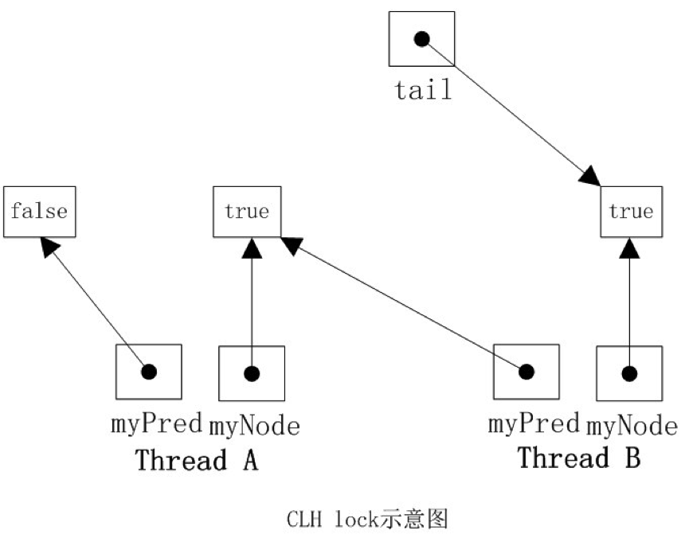
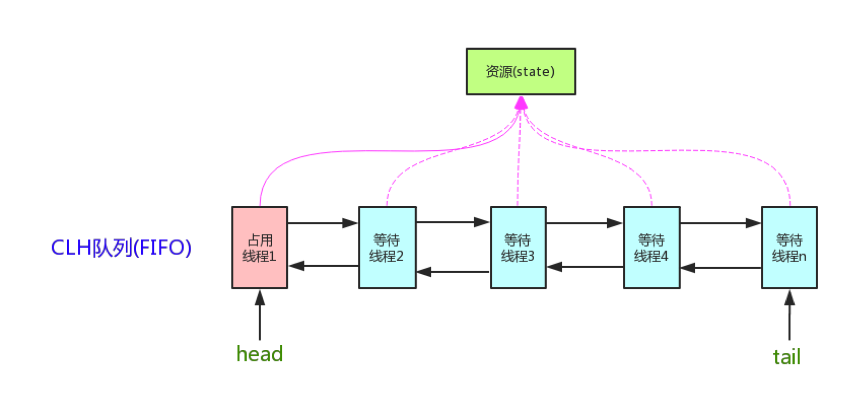
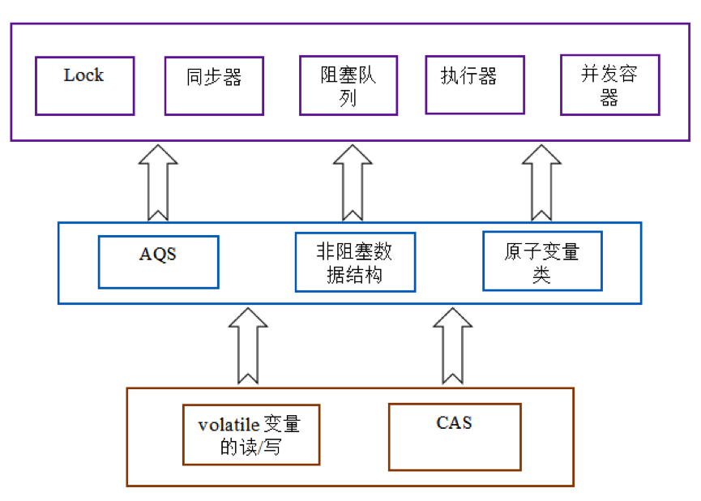

# 1、引言

在JDK1.5之前，一般是靠`synchronized`关键字来实现线程对共享变量的互斥访问。`synchronized`是在字节码上加指令，依赖于底层操作系统的`Mutex Lock`实现。

而从JDK1.5以后java界的一位大神—— *Doug Lea* 开发了`AbstractQueuedSynchronizer`(AQS)组件，使用原生java代码实现了`synchronized`语义。换句话说，*Doug Lea*没有使用更“高级”的机器指令，也不依靠JDK编译时的特殊处理，仅用一个普普通通的类就完成了代码块的并发访问控制，比那些费力不讨好的实现不知高到哪里去了。 

`java.util.concurrent`包有多重要无需多言，一言以蔽之，是Doug Lea大爷对天下所有Java程序员的怜悯。

AQS定义了一套多线程访问共享资源的同步器框架，是整个`java.util.concurrent`包的基石，`Lock`、`ReadWriteLock`、`CountDowndLatch`、`CyclicBarrier`、`Semaphore`、`ThreadPoolExecutor`等都是在AQS的基础上实现的。

# 2、实现原理

并发控制的核心是锁的获取与释放，锁的实现方式有很多种，AQS采用的是一种改进的**CLH锁**。

## 2.1 CLH锁

**CLH**(Craig, Landin, and Hagersten locks)是一种**自旋锁**，能确保无饥饿性，提供先来先服务的公平性。

何谓自旋锁？它是为实现保护共享资源而提出一种锁机制。其实，自旋锁与互斥锁比较类似，它们都是为了解决对某项资源的互斥使用。无论是互斥锁，还是自旋锁，在任何时刻，最多只能有一个保持者，也就是说，在任何时刻最多只能有一个执行单元获得锁。但是两者在调度机制上略有不同。对于互斥锁，如果资源已经被占用，资源申请者只能进入睡眠状态。但是自旋锁不会引起调用者睡眠，如果自旋锁已经被别的执行单元保持，调用者就一直循环在那里看是否该自旋锁的保持者已经释放了锁，“自旋”一词就是因此而得名。

CLH锁是一种基于链表的可扩展、高性能、公平的自旋锁，申请线程只在本地变量上自旋，它不断轮询前驱的状态，如果发现前驱释放了锁就结束自旋。

CLH队列中的节点`QNode`中含有一个`locked`字段，该字段若为true表示该线程需要获取锁，且不释放锁，为false表示线程释放了锁。节点之间是通过隐形的链表相连，之所以叫隐形的链表是因为这些节点之间没有明显的next指针，而是通过`myPred`所指向的节点的变化情况来影响`myNode`的行为。

CLHLock上还有一个尾指针，始终指向队列的最后一个节点。



当一个线程需要获取锁时，会创建一个新的`QNode`，将其中的`locked`设置为true表示需要获取锁，然后使自己成为队列的尾部，同时获取一个指向其前趋的引用`myPred`，然后该线程就在前趋节点的`locked`字段上旋转，直到前趋节点释放锁。当一个线程需要释放锁时，将当前节点的l`ocked`域设置为false，同时回收前趋节点。如上图所示，线程A需要获取锁，其`myNode`域为true，些时tail指向线程A的节点，然后线程B也加入到线程A后面，`tail`指向线程B的节点。然后线程A和B都在它的`myPred`域上旋转，一旦它的`myPred`节点的`locked`字段变为false，它就可以获取锁。

## 2.2 AQS数据模型

AQS维护了一个`volatile int state`（代表共享资源）和一个FIFO线程等待队列（多线程争用资源被阻塞时会进入此队列）。



AQS的内部队列是CLH同步锁的一种变形。其主要从以下方面进行了改造：

- 在结构上引入了头节点和尾节点，分别指向队列的头和尾，尝试获取锁、入队列、释放锁等实现都与头尾节点相关， 
- 为了可以处理timeout和cancel操作，每个node维护一个指向前驱的指针。如果一个node的前驱被cancel，这个node可以前向移动使用前驱的状态字段
- 在每个node里面使用一个状态字段来控制阻塞/唤醒，而不是自旋
- head节点使用的是傀儡节点

FIFO队列中的节点有AQS的静态内部类`Node`定义：

```java
static final class Node {

	// 共享模式
	static final Node SHARED = new Node();

	// 独占模式
	static final Node EXCLUSIVE = null;

	static final int CANCELLED = 1;
	static final int SIGNAL = -1;
	static final int CONDITION = -2;
	static final int PROPAGATE = -3;

	/**
	 * CANCELLED，值为1，表示当前的线程被取消 
	 * SIGNAL，值为-1，表示当前节点的后继节点包含的线程需要运行，也就是unpark；
	 * CONDITION，值为-2，表示当前节点在等待condition，也就是在condition队列中；
	 * PROPAGATE，值为-3，表示当前场景下后续的acquireShared能够得以执行； 
	 * 值为0，表示当前节点在sync队列中，等待着获取锁。
	 */
	volatile int waitStatus;

	// 前驱结点
	volatile Node prev;

	// 后继结点
	volatile Node next;

	// 与该结点绑定的线程
	volatile Thread thread;

	// 存储condition队列中的后继节点
	Node nextWaiter;

	// 是否为共享模式
	final boolean isShared() {
		return nextWaiter == SHARED;
	}

	// 获取前驱结点
	final Node predecessor() throws NullPointerException {
		Node p = prev;
		if (p == null)
			throw new NullPointerException();
		else
			return p;
	}

	Node() { // Used to establish initial head or SHARED marker
	}

	Node(Thread thread, Node mode) { // Used by addWaiter
		this.nextWaiter = mode;
		this.thread = thread;
	}

	Node(Thread thread, int waitStatus) { // Used by Condition
		this.waitStatus = waitStatus;
		this.thread = thread;
	}
}
```

`Node`类中有两个常量`SHARE`和`EXCLUSIVE`，顾名思义这两个常量用于表示这个节点支持共享模式还是独占模式，**共享模式**指的是允许多个线程获取同一个锁而且可能获取成功，**独占模式**指的是一个锁如果被一个线程持有，其他线程必须等待。多个线程读取一个文件可以采用共享模式，而当有一个线程在写文件时不会允许另一个线程写这个文件，这就是独占模式的应用场景。

## 2.3 CAS操作

AQS有三个重要的变量：

```java
	// 队头结点
	private transient volatile Node head;

	// 队尾结点
	private transient volatile Node tail;

	// 代表共享资源
	private volatile int state;

	protected final int getState() {
		return state;
	}

	protected final void setState(int newState) {
		state = newState;
	}

	protected final boolean compareAndSetState(int expect, int update) {
		return unsafe.compareAndSwapInt(this, stateOffset, expect, update);
	}
```

`compareAndSetState`方法是以乐观锁的方式更新共享资源。

独占锁是一种悲观锁，`synchronized`就是一种独占锁，会导致其它所有需要锁的线程挂起，等待持有锁的线程释放锁。而另一个更加有效的锁就是乐观锁。所谓乐观锁就是，每次不加锁而是假设没有冲突而去完成某项操作，如果因为冲突失败就重试，直到成功为止。乐观锁用到的机制就是**CAS**，即`Compare And Swap`。

CAS 指的是现代 CPU 广泛支持的一种对内存中的共享数据进行操作的一种特殊指令。这个指令会对内存中的共享数据做原子的读写操作。简单介绍一下这个指令的操作过程：

首先，CPU 会将内存中将要被更改的数据与期望的值做比较。然后，当这两个值相等时，CPU 才会将内存中的数值替换为新的值。否则便不做操作。最后，CPU 会将旧的数值返回。

这一系列的操作是原子的。它们虽然看似复杂，但却是 **Java 5 并发机制优于原有锁机制的根本**。简单来说，CAS 的含义是“我认为原有的值应该是什么，如果是，则将原有的值更新为新值，否则不做修改，并告诉我原来的值是多少”。

CAS通过调用JNI（Java Native Interface）调用实现的。JNI允许java调用其他语言，而CAS就是借助C语言来调用CPU底层指令实现的。`Unsafe`是CAS的核心类，它提供了硬件级别的原子操作。

*Doug Lea*大神在java同步器中大量使用了CAS技术，鬼斧神工的实现了多线程执行的安全性。CAS不仅在AQS的实现中随处可见，也是整个`java.util.concurrent`包的基石。

可以发现，`head`、`tail`、`state`三个变量都是`volatile`的。

`volatile`是轻量级的`synchronized`，它在多处理器开发中保证了共享变量的“可见性”。**可见性**的意思是当一个线程修改一个共享变量时，另外一个线程能读到这个修改的值。如果一个字段被声明成`volatile`，Java线程内存模型确保所有线程看到这个变量的值是一致的。

volatile变量也存在一些局限：不能用于构建原子的复合操作，因此当一个变量依赖旧值时就不能使用volatile变量。而CAS呢，恰恰可以提供对共享变量的原子的读写操作。

**volatile保证共享变量的可见性，CAS保证更新操作的原子性**，简直是绝配！把这些特性整合在一起，就形成了整个concurrent包得以实现的基石。如果仔细分析concurrent包的源代码实现，会发现一个通用化的实现模式：

- 首先，声明共享变量为volatile；
- 然后，使用CAS的原子条件更新来实现线程之间的同步；
- 同时，配合以volatile的读/写和CAS所具有的volatile读和写的内存语义来实现线程之间的通信。

AQS，非阻塞数据结构和原子变量类（java.util.concurrent.atomic包中的类），这些concurrent包中的基础类都是使用这种模式来实现的，而concurrent包中的高层类又是依赖于这些基础类来实现的。从整体来看，concurrent包的实现示意图如下：



# 3、源码解读

前面提到过，AQS定义两种资源共享方式：

- **Exclusive**：独占，只有一个线程能执行，如`ReentrantLock`
- **Share**：共享，多个线程可同时执行，如`Semaphore`/`CountDownLatch`

不同的自定义同步器争用共享资源的方式也不同。自定义同步器在实现时只需要实现共享资源`state`的获取与释放方式即可，至于具体线程等待队列的维护（如获取资源失败入队/唤醒出队等），AQS已经在顶层实现好了。自定义同步器实现时主要实现以下几种方法：

- `isHeldExclusively()`：该线程是否正在独占资源。只有用到`condition`才需要去实现它。
- `tryAcquire(int)`：独占方式。尝试获取资源，成功则返回true，失败则返回false。
- `tryRelease(int)`：独占方式。尝试释放资源，成功则返回true，失败则返回false。
- `tryAcquireShared(int)`：共享方式。尝试获取资源。负数表示失败；0表示成功，但没有剩余可用资源；正数表示成功，且有剩余资源。
- `tryReleaseShared(int)`：共享方式。尝试释放资源，成功则返回true，失败则返回false。

以`ReentrantLock`为例，`state`初始化为0，表示未锁定状态。A线程`lock()`时，会调用`tryAcquire()`独占该锁并将state+1。此后，其他线程再`tryAcquire()`时就会失败，直到A线程`unlock()`到state=0（即释放锁）为止，其它线程才有机会获取该锁。当然，释放锁之前，A线程自己是可以重复获取此锁的（state会累加），这就是可重入的概念。但要注意，获取多少次就要释放多么次，这样才能保证state是能回到零态的。

再以`CountDownLatch`以例，任务分为N个子线程去执行，`state`也初始化为N（注意N要与线程个数一致）。这N个子线程是并行执行的，每个子线程执行完后`countDown()`一次，`state`会CAS减1。等到所有子线程都执行完后(即state=0)，会`unpark()`主调用线程，然后主调用线程就会从`await()`函数返回，继续后余动作。

一般来说，自定义同步器要么是独占方法，要么是共享方式，他们也只需实现t`ryAcquire-tryRelease`、`tryAcquireShared-tryReleaseShared`中的一种即可。但AQS也支持自定义同步器同时实现独占和共享两种方式，如`ReentrantReadWriteLock`。

## 3.1 acquire(int)

```java
	public final void acquire(int arg) {
		if (!tryAcquire(arg) && acquireQueued(addWaiter(Node.EXCLUSIVE), arg))
			selfInterrupt();
	}
```

此方法是独占模式下线程获取共享资源的顶层入口。如果获取到资源，线程直接返回，否则进入等待队列，直到获取到资源为止，且整个过程忽略中断的影响。获取到资源后，线程就可以去执行其临界区代码了。

函数流程如下：

- `tryAcquire()`尝试直接去获取资源，如果成功则直接返回；
- `addWaiter()`将该线程加入等待队列的尾部，并标记为独占模式；
- `acquireQueued()`使线程在等待队列中获取资源，一直获取到资源后才返回。如果在整个等待过程中被中断过，则返回true，否则返回false。
- 如果线程在等待过程中被中断过，它是不响应的。只是获取资源后才再进行自我中断`selfInterrupt()`，将中断补上。

下面再来看看每个方法的实现代码。

### 3.1.1 tryAcquire(int)

```java
    protected boolean tryAcquire(int arg) {
        throw new UnsupportedOperationException();
    }
```

此方法尝试去获取独占资源。如果获取成功，则直接返回true，否则直接返回false。

AQS只是一个框架，在这里定义了一个接口，具体资源的获取交由自定义同步器去实现了（通过state的get/set/CAS），至于能不能重入，能不能加塞，那就看具体的自定义同步器怎么去设计了。当然，自定义同步器在进行资源访问时要考虑线程安全的影响。
这里之所以没有定义成`abstract`，是因为独占模式下只用实现t`ryAcquire-tryRelease`，而共享模式下只用实现`tryAcquireShared-tryReleaseShared`。如果都定义成`abstract`，那么每个模式也要去实现另一模式下的接口。说到底，*Doug Lea*还是站在咱们开发者的角度，尽量减少不必要的工作量。

### 3.1.2	addWaiter(Node)

```java
	private Node addWaiter(Node mode) {
		// 使用当前线程构造结点
		Node node = new Node(Thread.currentThread(), mode);

		Node pred = tail;
		if (pred != null) { // 如果队尾结点不为空，将当前节点插入队尾
			node.prev = pred;
			if (compareAndSetTail(pred, node)) {
				pred.next = node;
				return node;
			}
		}
		// 队尾结点为空（队列还没有初始化），则转调enq入队
		enq(node);
		return node;
	}
```

其中，compareAndSetTail方法也是调用Unsafe类实现CAS操作，更新队尾。

### 3.1.3 enq(Node)

```java
	private Node enq(final Node node) {
		for (;;) { // CAS自旋，直到插入成功
			Node t = tail;
			if (t == null) { // 队尾为空，则先初始化队列，new一个傀儡节点
				if (compareAndSetHead(new Node()))
					tail = head; // 头尾指针都指向傀儡节点
			} else { // 插入队尾
				node.prev = t;
				if (compareAndSetTail(t, node)) {
					t.next = node;
					return t;
				}
			}
		}
	}
```

这段代码的精髓就在于CAS自旋`volatile`变量，也是`AtomicInteger`、`AtomicBoolean`等原子量的灵魂。

### 3.1.4 acquireQueued(Node, int)

通过`tryAcquire()`和`addWaiter()`，如果线程获取资源失败，已经被放入等待队列尾部了。但是，后面还有一项重要的事没干，就是让线程进入阻塞状态，直到其他线程释放资源后唤醒自己。过程跟在银行办理业务时排队拿号有点相似，`acquireQueued()`就是干这件事：在等待队列中排队拿号（中间没其它事干可以休息），直到拿到号后再返回。

```java
	final boolean acquireQueued(final Node node, int arg) {
		boolean failed = true; // 是否获取到了资源
		try {
			boolean interrupted = false; // 等待过程中有没有被中断
			for (;;) { // 自旋，直到
				final Node p = node.predecessor();
				// 前驱是head，则有资格去尝试获取资源
				if (p == head && tryAcquire(arg)) {
					// 获取资源成功，将自己置为队头，并回收其前驱（旧的队头）
					setHead(node);
					p.next = null; // help GC
					failed = false;
					return interrupted;
				}
				// 获取资源失败，
				if (shouldParkAfterFailedAcquire(p, node) && parkAndCheckInterrupt())
					interrupted = true;
			}
		} finally {
			if (failed)
				cancelAcquire(node);
		}
	}
```

如果获取资源失败后，会调用两个函数，`shouldParkAfterFailedAcquire`和`parkAndCheckInterrupt`，下面来看看它俩是干什么的。

### 3.1.5 shouldParkAfterFailedAcquire(Node, Node)

从名字可以猜出来，该函数的作用是“在获取资源失败后是否需要阻塞”：

```java
	private static boolean shouldParkAfterFailedAcquire(Node pred, Node node) {
		int ws = pred.waitStatus; // 前驱状态
		if (ws == Node.SIGNAL)
			// Node.SIGNAL，代表前驱释放资源后会通知后继结点
			return true;
		if (ws > 0) { // 代表前驱已取消任务，相当于退出了等待队列
			do { // 一个个往前找，找到最近一个正常等待的前驱，排在它的后面
				node.prev = pred = pred.prev;
			} while (pred.waitStatus > 0);
			pred.next = node;
		} else {
			// 前驱状态正常，则将其状态置为SIGNAL，意为，释放资源后通知后继结点
			compareAndSetWaitStatus(pred, ws, Node.SIGNAL);
		}
		return false;
	}
```

整个流程中，如果前驱节点的状态不是`SIGNAL`，那么自己就不能安心去休息，需要去找个安心的休息点，同时可以再尝试下看有没有机会轮到自己拿号。

### 3.1.6 parkAndCheckInterrupt()

如果线程找好安全休息点后，那就可以安心去休息了。此方法就是让线程去休息，真正进入等待状态。

```java
	private final boolean parkAndCheckInterrupt() {
		LockSupport.park(this); // 使线程进入waiting状态
		return Thread.interrupted();
	}
```

`park()`会让当前线程进入`waiting`状态。在此状态下，有两种途径可以唤醒该线程：被`unpark()`或被`interrupt()`。

### 3.1.7 小结

总结下acquire的流程：

- 调用自定义同步器的`tryAcquire()`尝试直接去获取资源，如果成功则直接返回；
- 没成功，则`addWaiter()`将该线程加入等待队列的尾部，并标记为独占模式；
- `acquireQueued()`使线程在等待队列中休息，有机会时（轮到自己，会被`unpark()`）会去尝试获取资源。获取到资源后才返回。如果在整个等待过程中被中断过，则返回true，否则返回false。
- 如果线程在等待过程中被中断过，它是不响应的。只是获取资源后才再进行自我中断`selfInterrupt()`，将中断补上。

## 3.2 release(int)

release()是acquire()的逆操作，是独占模式下线程释放共享资源的顶层入口。它会释放指定量的资源，如果彻底释放了（即state=0）,它会唤醒等待队列里的其他线程来获取资源。

```java
	public final boolean release(int arg) {
		if (tryRelease(arg)) {
			Node h = head;
			if (h != null && h.waitStatus != 0) // 状态不为0，证明需要唤醒后继结点
				unparkSuccessor(h);
			return true;
		}
		return false;
	}
```

### 3.2.1 tryRelease(int)

```java
	protected boolean tryRelease(int arg) {
		throw new UnsupportedOperationException();
	}
```

跟`tryAcquire()`一样，这个方法是需要自定义同步器去实现的。正常来说，`tryRelease()`都会成功的，因为这是独占模式，该线程来释放资源，那么它肯定已经拿到独占资源了，直接减掉相应量的资源即可，也不需要考虑线程安全的问题。

### 3.2.2 unparkSuccessor(Node)

```java
	private void unparkSuccessor(Node node) {

		int ws = node.waitStatus;
		if (ws < 0) // 将当前结点状态置零
			compareAndSetWaitStatus(node, ws, 0);

		Node s = node.next;
		if (s == null || s.waitStatus > 0) { // 后继结点为空或者已取消
			s = null;
			// 从队尾开始向前寻找，找到第一个正常的后继结点
			for (Node t = tail; t != null && t != node; t = t.prev)
				if (t.waitStatus <= 0)
					s = t;
		}
		if (s != null)
			LockSupport.unpark(s.thread); // 唤醒该结点上的线程
	}
```

逻辑并不复杂，一句话概括：用`unpark()`唤醒等待队列中最前边的那个未放弃线程。

## 3.3	acquireShared(int)

此方法是共享模式下线程获取共享资源的顶层入口。它会获取指定量的资源，获取成功则直接返回，获取失败则进入等待队列，直到获取到资源为止，整个过程忽略中断。

```java
	public final void acquireShared(int arg) {
		if (tryAcquireShared(arg) < 0)
			doAcquireShared(arg);
	}

	protected int tryAcquireShared(int arg) { // 留给子类实现
		throw new UnsupportedOperationException();
	}
```

这里`tryAcquireShared()`依然需要自定义同步器去实现。但是AQS已经把其返回值的语义定义好了：负值代表获取失败；0代表获取成功，但没有剩余资源；正数表示获取成功，还有剩余资源，其他线程还可以去获取。

### 3.3.1 doAcquireShared(int)

```java
	private void doAcquireShared(int arg) {
		final Node node = addWaiter(Node.SHARED); // 以共享模式加入队尾
		boolean failed = true;
		try {
			boolean interrupted = false;
			for (;;) {
				final Node p = node.predecessor();
				if (p == head) { // 前驱是队头（队头肯定是已经拿到资源的结点）
					int r = tryAcquireShared(arg); // 尝试获取资源
					if (r >= 0) { // 获取资源成功
						setHeadAndPropagate(node, r); // 将自己置为队头，若还有剩余资源，向后传播
						p.next = null; // help GC
						if (interrupted)
							selfInterrupt(); // 如果等待过程中被打断过，此时将中断补上。
						failed = false;
						return;
					}
				}
				// 判断状态，寻找合适的前驱，进入waiting状态，等着被unpark()或interrupt()
				if (shouldParkAfterFailedAcquire(p, node) && parkAndCheckInterrupt())
					interrupted = true;
			}
		} finally {
			if (failed)
				cancelAcquire(node);
		}
	}
```

该函数的功能类似于独占模式下的`acquireQueued()`。

跟独占模式比，有一点需要注意的是，这里只有线程是`head.next`时（“老二”），才会去尝试获取资源，有剩余的话还会唤醒之后的队友。那么问题就来了，假如老大用完后释放了5个资源，而老二需要6个，老三需要1个，老四需要2个。因为老大先唤醒老二，老二一看资源不够自己用继续park()，也更不会去唤醒老三和老四了。独占模式，同一时刻只有一个线程去执行，这样做未尝不可；但共享模式下，多个线程是可以同时执行的，现在因为老二的资源需求量大，而把后面量小的老三和老四也都卡住了。

### 3.3.2	setHeadAndPropagate(Node, int)

 ```java
	private void setHeadAndPropagate(Node node, int propagate) {
		Node h = head;
		setHead(node); // 将自己置为队头

		if (propagate > 0 || h == null || h.waitStatus < 0) {
			Node s = node.next;
			if (s == null || s.isShared()) // 后继结点也为共享模式，则触发释放资源函数
				doReleaseShared();
		}
	}
 ```

此方法在`setHead()`的基础上多了一步，就是自己苏醒的同时，如果条件符合（比如还有剩余资源），还会去唤醒后继节点，毕竟是共享模式。

## 3.4 releaseShared(int)

此方法是共享模式下线程释放共享资源的顶层入口。它会释放指定量的资源，如果彻底释放了（即state=0）,它会唤醒等待队列里的其他线程来获取资源。

```java
	public final boolean releaseShared(int arg) {
		if (tryReleaseShared(arg)) { // 尝试释放资源
			doReleaseShared(); // 释放成功，继续唤醒后继结点
			return true;
		}
		return false;
	}

	protected boolean tryReleaseShared(int arg) { // 留给子类实现
		throw new UnsupportedOperationException();
	}
```

跟独占模式下的`release()`相似，但有一点稍微需要注意：独占模式下的`tryRelease()`在完全释放掉资源（state=0）后，才会返回true去唤醒其他线程，这主要是基于可重入的考量；而共享模式下的`releaseShared()`则没有这种要求，多线程可并发执行，不适用于可重入。

### 3.4.1 doReleaseShared()

```java
	private void doReleaseShared() {

		for (;;) {
			Node h = head;
			if (h != null && h != tail) { // 头结点不为空且有后继结点
				int ws = h.waitStatus;
				if (ws == Node.SIGNAL) {
					if (!compareAndSetWaitStatus(h, Node.SIGNAL, 0)) // 头结点状态，SIGNAL——>0
						continue; // 状态更新失败则循环进行，直到成功
					unparkSuccessor(h); // 唤醒后继结点
				} else if (ws == 0 && !compareAndSetWaitStatus(h, 0, Node.PROPAGATE)) 
          // 头结点状态，0——>PROPAGATE
					continue; // 持续循环，直到状态更新成功
			}
			if (h == head) // 头结点没变，则结束循环；否则继续
				break;
		}
	}
```

其余函数已经在上面分析过了。至此，AQS的独占模式与共享模式下的实现原理剖析的差不多了，代码是最好的老师。

除了上面分析的核心方法，AQS还有定义了附带超时功能的`tryAcquireNanos()`/`tryAcquireSharedNanos()`方法，以及响应中断的`acquireInterruptibly()`/`acquireSharedInterruptibly()`方法，其核心流程与通用方法大同小异，不再赘述。

# 4、应用实例

我们利用AQS来实现一个不可重入的互斥锁实现。锁资源（AQS里的state）只有两种状态：0表示未锁定，1表示锁定。下边是Mutex的核心源码：

```java
public class Mutex {

	/**
	 * 静态内部类，自定义同步器
	 */
	private static class Sync extends AbstractQueuedSynchronizer {

		@Override
		protected boolean isHeldExclusively() {
			return getState() == 1; // 是否有资源可用
		}

		@Override
		public boolean tryAcquire(int acquires) {
			assert acquires == 1;
			if (compareAndSetState(0, 1)) { // state:0——>1，代表获取锁
				setExclusiveOwnerThread(Thread.currentThread()); // 设置当前占用资源的线程
				return true;
			}
			return false;
		}

		@Override
		protected boolean tryRelease(int releases) {
			assert releases == 1;
			if (getState() == 0) {
				throw new IllegalMonitorStateException();
			}
			setExclusiveOwnerThread(null);
			setState(0); // state:1——>0，代表释放锁
			return true;
		}
	}

	private final Sync sync = new Sync();

	/**
	 * 获取锁，可能会阻塞
	 */
	public void lock() {
		sync.acquire(1);
	}

	/**
	 * 尝试获取锁，无论成功或失败，立即返回
	 */
	public boolean tryLock() {
		return sync.tryAcquire(1);
	}

	/**
	 * 释放锁
	 */
	public void unlock() {
		sync.release(1);
	}
}
```

同步类在实现时一般都将自定义同步器（`sync`）定义为内部类，供自己使用；而同步类自己（Mutex）则实现某个接口，对外服务。当然，接口的实现要直接依赖`sync`，它们在语义上也存在某种对应关系。而`sync`只用实现资源`state`的获取-释放方式`tryAcquire-tryRelelase`，至于线程的排队、等待、唤醒等，上层的AQS都已经实现好了，我们不用关心。

`ReentrantLock`/`CountDownLatch`/`Semphore`这些同步类的实现方式都差不多，不同的地方就在获取、释放资源的方式`tryAcquire-tryRelelase`。