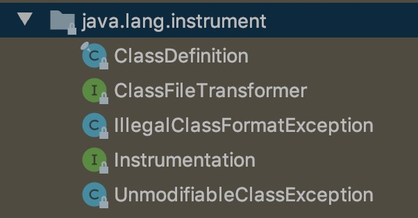
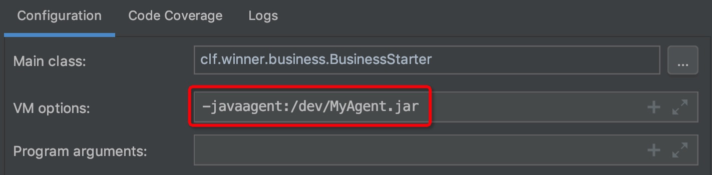
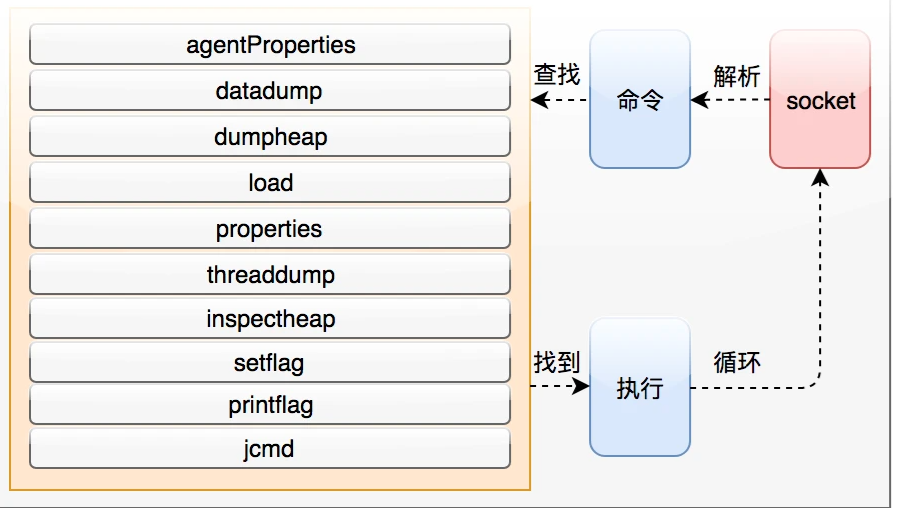
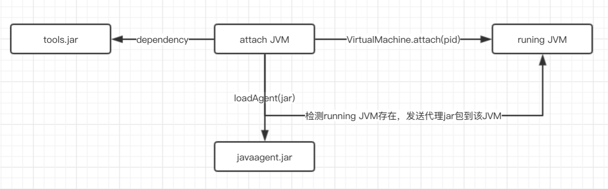

# 1、什么是 Java Agent

笼统地来讲，Java Agent 是一个统称，该功能是 Java 虚拟机提供的一整套后门，通过这套后门可以对虚拟机方方面面进行监控与分析，甚至干预虚拟机的运行。

> Java Agent 又叫做 **Java 探针**，是在 JDK1.5 引入的一种可以动态修改 Java 字节码的技术。Java 类编译之后形成字节码被 JVM 执行，在 JVM 在执行这些字节码之前获取这些字节码信息，并且通过字节码转换器对这些字节码进行修改，来完成一些额外的功能。

# 2、Instrumentation工具包

JDK 从5.0开始，提供了一个名为`java.lang.instrument`的工具包：



借助该包，开发者可以构建一个独立于应用程序的**代理**（Agent），用来监测和协助运行在 JVM 上的程序，甚至能够动态替换和修改某些类的定义。这样的特性实际上提供了一种**虚拟机级别的 AOP 实现**。

事实上，`java.lang.instrument` 包是基于**JVMTI**机制实现的：

> **JVMTI**（Java Virtual Machine Tool Interface）是一套由 Java 虚拟机提供的了一套代理程序机制，可以支持第三方工具程序以代理的方式连接和访问 JVM。JVMTI 的功能非常丰富，包括虚拟机中线程、内存/堆/栈，类/方法/变量，事件/定时器处理等等。使用 JVMTI 一个基本的方式就是设置回调函数，在某些事件发生的时候触发并作出相应的动作，这些事件包括虚拟机初始化、开始运行、结束，类的加载，方法出入，线程始末等等。

Instrument 就是一个基于 JVMTI 接口的，以代理方式连接和访问 JVM 的一个 Agent。

## 2.1 静态Instrument

在命令行输入 `java`可以看到相应的参数，其中有和 java agent相关的如下：

```bash
    -agentlib:<libname>[=<选项>]
                  加载本机代理库 <libname>, 例如 -agentlib:hprof
                  另请参阅 -agentlib:jdwp=help 和 -agentlib:hprof=help
    -agentpath:<pathname>[=<选项>]
                  按完整路径名加载本机代理库
    -javaagent:<jarpath>[=<选项>]
                  加载 Java 编程语言代理, 请参阅 java.lang.instrument
```

通过 `-javaagent` 参数可以指定一个特定的 jar 包来启动 Instrumentation 代理程序。

`-javaagent`命令要求指定的类中必须要有`premain()`方法，并且必须满足以下两种格式：

```java
public static void premain(String agentArgs, Instrumentation inst)
public static void premain(String agentArgs)
```

JVM 会优先加载带 `Instrumentation` 签名的方法，加载成功忽略第二种；如果第一种没有，则加载第二种方法。

- `agentArgs` 是 `premain` 函数得到的程序参数，随同 `-javaagent`一起传入。与 main 函数不同的是，这个参数是一个字符串而不是一个字符串数组，如果程序参数有多个，程序需要自行解析这个字符串。
- `Inst` 是一个 `java.lang.instrument.Instrumentation` 的实例，由 JVM 自动传入，接口中集中了几乎所有的功能方法，例如类定义的转换和操作等等。

JVM启动时 会先执行 `premain` 方法，大部分类加载都会通过该方法，注意：**是大部分，不是所有**。遗漏的主要是系统类，因为很多系统类先于 agent 执行，而用户类的加载肯定是会被拦截的。也就是说，**这个方法是在 main 方法启动前拦截大部分类的加载活动**，既然可以拦截类的加载，就可以结合第三方的字节码编译工具，比如ASM，javassist，cglib等等来改写实现类。

例如：

```java
public class PreMainAgent {

    public static void premain(String agentArgs, Instrumentation inst) {
        System.out.println("agentArgs : " + agentArgs);
         //加入自定义转换器
        inst.addTransformer(new MyTransformer(), true); 
    }

}

//通过ClassFileTransformer接口，可以在类加载之前，重写字节码
public class MyTransformer implements ClassFileTransformer {

    /**
     * 参数：
     * loader - 定义要转换的类加载器；如果是引导加载器，则为 null
     * className - 完全限定类内部形式的类名称和 The Java Virtual Machine Specification 中定义的接口名称。例如，"java/util/List"。
     * classBeingRedefined - 如果是被重定义或重转换触发，则为重定义或重转换的类；如果是类加载，则为 null
     * protectionDomain - 要定义或重定义的类的保护域
     * classfileBuffer - 类文件格式的输入字节缓冲区（不得修改）
     * 返回：
     * 一个格式良好的类文件缓冲区（转换的结果），如果未执行转换,则返回 null。
     * 抛出：
     * IllegalClassFormatException - 如果输入不表示一个格式良好的类文件
     */
    @Override
    public byte[] transform (ClassLoader loader, String className, Class<?> classBeingRedefined,
            ProtectionDomain protectionDomain, byte[] classfileBuffer) throws IllegalClassFormatException {

        if (!className.equals("clf/winner/business/BusinessService")) {
            return null; // 如果返回null则字节码不会被修改
        }

        try {
						//借助JavaAssist工具，进行字节码插桩
            ClassPool pool = ClassPool.getDefault();
            CtClass cc = pool.get("clf.winner.business.BusinessService");
            CtMethod personFly = cc.getDeclaredMethod("doBusiness");

            //在目标方法前后，插入代码
            personFly.insertBefore("System.out.println(\"--- before doBusiness ---\");");
            personFly.insertAfter("System.out.println(\"--- after doBusiness ---\");");

            return cc.toBytecode();

        } catch (Exception ex) {
            ex.printStackTrace();
        }

        return null;
    }
}
```

除此之外，还需要定义一个`MANIFEST.MF`文件，用于指明`premain`的入口在哪里：

```
Premain-Class: 包含 premain 方法的类（类的全路径名）
Agent-Class: 包含 agentmain 方法的类（类的全路径名）
Boot-Class-Path: 设置引导类加载器搜索的路径列表。查找类的特定于平台的机制失败后，引导类加载器会搜索这些路径。按列出的顺序搜索路径。列表中的路径由一个或多个空格分开。路径使用分层 URI 的路径组件语法。如果该路径以斜杠字符（“/”）开头，则为绝对路径，否则为相对路径。相对路径根据代理 JAR 文件的绝对路径解析。忽略格式不正确的路径和不存在的路径。如果代理是在 VM 启动之后某一时刻启动的，则忽略不表示 JAR 文件的路径。（可选）
Can-Redefine-Classes: true表示能重定义此代理所需的类，默认值为 false（可选）
Can-Retransform-Classes: true 表示能重转换此代理所需的类，默认值为 false （可选）
Can-Set-Native-Method-Prefix: true表示能设置此代理所需的本机方法前缀，默认值为 false（可选）

```

注意：最后一行是**空行，不能省略**。

如果不去手动指定，打包时也会默认生成一个`MANIFREST.MF`文件，包含当前的一些版本信息，当前工程的启动类等，JavaAgent的信息可以在maven插件中指定：

```xml
<plugin>
    <groupId>org.apache.maven.plugins</groupId>
    <artifactId>maven-jar-plugin</artifactId>
    <version>3.1.0</version>
    <configuration>
        <archive>
            <!--自动添加META-INF/MANIFEST.MF -->
            <manifest>
                <addClasspath>true</addClasspath>
            </manifest>
            <manifestEntries>
                <Premain-Class>clf.winner.java.agent.PreMainAgent</Premain-Class>
                <Agent-Class>clf.winner.java.agent.PreMainAgent</Agent-Class>
                <Can-Redefine-Classes>true</Can-Redefine-Classes>
                <Can-Retransform-Classes>true</Can-Retransform-Classes>
            </manifestEntries>
        </archive>
    </configuration>
</plugin>
```

Agent程序开发完毕，打成jar包，命名为"MyAgent.jar"待用。

然后写一个测试类来模拟应用实例：

```java
public class BusinessStarter {

    public static void main(String[] args) {
        BusinessService service = new BusinessService();
        while (true) {
            service.doBusiness();
        }
    }

}

public class BusinessService {

    public void doBusiness () {

        try {
            System.out.println("doing business"); //模拟业务操作
            Thread.sleep(1000L);
        } catch (InterruptedException e) {
            e.printStackTrace();
        }
    }
}
```

运行命令：`java -javaagent:MyAgent.jar  BusinessStarter`

或者在IDEA中指定VM 参数：



运行结果如下：

> agentArgs : null
> --- before doBusiness ---
> doing business
> --- after doBusiness ---
> --- before doBusiness ---
> doing business
> --- after doBusiness ---
> --- before doBusiness ---
> doing business
> --- after doBusiness ---
> --- before doBusiness ---
> doing business
> --- after doBusiness ---
> --- before doBusiness ---
> doing business

可见，在业务代码执行的前后，确实插入了额外代码。

## 2.2 动态Instrument

静态Instrument需要把Agent程序提前写好，与应用实例一并启动，所作的 Instrumentation 也仅限于 main 函数执行前，这样的方式存在一定的局限性。

在 Java SE 6 的 Instrumentation 当中，提供了一个新的代理操作方法：`agentmain`，可以在 main 函数开始运行之后再运行。

跟`premain`函数一样， 开发者可以编写一个含有`agentmain`函数的 Java 类：

```java
public static void agentmain (String agentArgs, Instrumentation inst);
public static void agentmain (String agentArgs);
```

同样，`agentmain` 方法中带`Instrumentation`参数的方法也比不带优先级更高。开发者必须在 manifest 文件里面设置`Agent-Class`来指定包含 `agentmain` 函数的类。

### 2.2.1 Attach 机制

跟 `premain` 不同的是，`agentmain` 需要在 main 函数开始运行后才启动，这样的时机应该如何确定，这样的功能又如何实现呢？

答案就是 Java SE 6 当中提供的 **Attach 机制**。

Attach API 不是 Java 的标准 API，而是 Sun 公司提供的一套扩展 API，用来向目标 JVM “附着”（Attach）代理工具程序的。有了它，开发者可以方便的监控一个 JVM，运行一个外加的代理程序。

首先，**Attach 机制对外提供了一种进程间的通信能力**，能让一个进程传递命令给 JVM；其次，Attach 机制内置一些重要功能，可供外部进程调用。比如大家最熟悉的 `jstack` 就是要依赖这个机制来工作。

Attach 机制的核心组件是 **Attach Listener**，顾名思义，Attach Listener 是 JVM 内部的一个线程，这个线程的主要工作是监听和接收客户端进程通过 Attach 提供的通信机制发起的命令，如下图所示：



Attach Listener 线程的主要工作是串流程，流程步骤包括：接收客户端命令、解析命令、查找命令执行器、执行命令等等。

Attach API 很简单，只有 2 个主要的类，都在 `com.sun.tools.attach` 包里面：

- **VirtualMachine类**： 代表一个 Java 虚拟机，也就是程序需要监控的目标虚拟机，提供了获取系统信息(比如内存dump、线程dump，类信息统计）、加载代理程序、Attach 和 Detach 等方法 。
- **VirtualMachineDescriptor**类： 一个描述虚拟机的容器类，配合 VirtualMachine 类完成各种功能。

通过VirtualMachine类的`attach(pid)`方法，便可以attach到一个运行中的java进程上，之后便可以通`loadAgent(agentJarPath)`来将agent的jar包注入到对应的进程，然后对应的进程会调用`agentmain`方法。



既然是两个进程之间通信那肯定的建立起连接，`VirtualMachine.attach`动作类似TCP创建连接的三次握手，目的就是搭建attach通信的连接。而后面执行的操作，例如`vm.loadAgent`，其实就是向这个socket写入数据流，接收方target VM会针对不同的传入数据来做不同的处理。

### 2.2.2 代码实例

与上面的premain的例子类似，编写agentmain入口类，然后使用maven插件打包生成MANIFEST.MF：

```java
public class AgentMainAgent {

    public static void agentmain(String agentArgs, Instrumentation instrumentation) {
        instrumentation.addTransformer(new MyTransformer(), true);
      	instrumentation.retransformClasses(BusinessService.class); //指明哪些类需要重新加载
    }
    
}
```

```xml
<plugin>
  <artifactId>maven-jar-plugin</artifactId>
  <version>3.1.0</version>
  <configuration>
    <archive>
      <!--自动添加META-INF/MANIFEST.MF -->
      <manifest>
        <addClasspath>true</addClasspath>
      </manifest>
      <manifestEntries>
        <Agent-Class>clf.winner.java.agent.AgentMainAgent</Agent-Class>
        <Can-Redefine-Classes>true</Can-Redefine-Classes>
        <Can-Retransform-Classes>true</Can-Retransform-Classes>
      </manifestEntries>
    </archive>
  </configuration>
</plugin>
```

将agent打包之后，就是编写测试main方法：从一个attach JVM去探测目标JVM，如果目标JVM存在则向它发送MyAgent2.jar。我测试写的简单了些，找到当前JVM并加载agent.jar。

```java
public static void main(String[] args) throws Exception {
  //获取当前系统中所有 运行中的 虚拟机
  List<VirtualMachineDescriptor> list = VirtualMachine.list();
  for (VirtualMachineDescriptor vmd : list) {
    //如果虚拟机的名称为 xxx 则 该虚拟机为目标虚拟机，获取该虚拟机的 pid
    //然后加载 agent.jar 发送给该虚拟机
    System.out.println(vmd.displayName());
    if (vmd.displayName().endsWith("clf.winner.business.BusinessStarter")) {
      VirtualMachine virtualMachine = VirtualMachine.attach(vmd.id());
      virtualMachine.loadAgent("/Users/winner/Desktop/MyAgent2.jar");
      Thread.sleep(10000L);
      virtualMachine.detach();
    }
  }
}
```

先运行模拟业务的main函数，然后在运行上面的测试类，打印结果如下：

> doing business
> doing business
> doing business
> doing business
> doing business
> doing business
> doing business
> doing business
> doing business
> --- before doBusiness ---
> doing business
> --- after doBusiness ---
> --- before doBusiness ---
> doing business
> --- after doBusiness ---

可见，在main函数刚启动时，没有attach外部的agent程序，执行的是原始代码，agent启动后，导致`BusinessService`类重新加载，插入的额外代码。

## 2.3 本地方法Instrument

在 JDK 1.5 版本的 instumentation 里，并没有对Java本地方法（Native Method）的处理方式，而且在 Java 标准的 JVMTI 之下，并没有办法改变 method signature， 这就使替换本地方法非常地困难。一个比较直接而简单的想法是，在**启动时替换本地代码所在的动态链接库**—— 但是这样，**本质上是一种静态的替换，而不是动态的 Instrumentation**。

在 Java SE 6 中，新的 Native Instrumentation 提出了一个新的 native code 的解析方式，作为原有的 native method 的解析方式的一个补充，来很好地解决了一些问。这就是在新版本的 `java.lang.instrument` 包里，我们拥有了对 native 代码的 instrument 方式 —— **设置 prefix**。

假设我们有了一个 native 函数，名字叫 `nativeMethod`，在运行过程中，我们需要将它指向另外一个函数（需要注意的是，在当前标准的 JVMTI 之下，除了 native 函数名，其他的 signature 需要一致）。比如我们的 Java 代码是：

```java
package nativeTester; 
class nativePrefixTester{ 
    …
     native int nativeMethod(int input); 
    …
}
```

那么我们已经实现的本地代码是 :

```java
jint Java_nativeTester_nativeMethod(jclass thiz, jobject thisObj, jint input);
```

现在我们需要在调用这个函数时，使之指向另外一个函数。那么按照 J2SE 的做法，我们可以按他的命名方式，加上一个 prefix 作为新的函数名。比如，我们以 `another_` 作为 prefix，那么我们新的函数是 :

```java
jint Java_nativeTester_another_nativePrefixTester(jclass thiz, jobject thisObj, jint input);
```

然后将之编入动态链接库之中。 现在我们已经有了新的本地函数，接下来就是做 instrument 的设置。正如以上所说的，我们可以使用 premain 方式，在虚拟机启动之时就载入 premain 完成 instrument 代理设置。也可以使用 agentmain 方式，去 attach 虚拟机来启动代理。而设置 native 函数的也是相当简单的 :

```java
premain(){  // 或者也可以在 agentmain 里
    …
    if (!isNativeMethodPrefixSupported()){ 
        return; // 如果无法设置，则返回
    } 
    setNativeMethodPrefix(transformer,"another_"); // 设置 native 函数的 prefix，注意这个下划线必须由用户自己规定
    …
}
```

不是在任何的情况下都是可以设置 native 函数的 prefix 的；首先，我们要注意到 agent 包之中的 Manifest 所设定的特性 :

```dart
Can-Set-Native-Method-Prefix
```

要注意，这一个参数都可以影响是否可以设置 native prefix，而且，在默认的设置之中，**这个参数是 false 的**，我们需要将之设置成 true。

当然，我们还需要确认虚拟机本身是否支持 setNativePrefix。在 Java API 里，Instrumentation 类提供了一个函数 `isNativePrefix`，通过这个函数我们可以知道该功能是否可以实行。

总之，新的 native 的 prefix-instrumentation 的方式，**改变了以前 Java 中 native 代码无法动态改变的缺点**。它的动态化意味着整个 Java 都可以动态改变了 —— 现在我们的代码可以利用加上 prefix 来动态改变 native 函数的指向。

# 3、应用场景

从上面提到的字节码转换器的两种执行方式来看，可以实现如下功能：

- Java Agent 能够在加载 Java 字节码之前进行拦截并对字节码进行修改;
- 在 Jvm 运行期间修改已经加载的字节码;

因此，通过以上两点即可实现在一些框架或是技术的采集点进行字节码修改，对应用进行监控（比如通过JVM CPU Profiler 从CPU、Memory、Thread、Classes、GC等多个方面对程序进行动态分析），或是对执行指定方法或接口时做一些额外操作，比如打印日志、打印方法执行时间、采集方法的入参和结果等；

基于前面对 Java Agent 大致机制的描述，我们不难猜到，能够干预 Java JVM 虚拟机的运行，那么就可以解决不限于如下的问题：

- **应用性能监控**(APM) ：在微服务大行其道的环境下，分布式系统的逻辑结构变得越来越复杂。这给系统性能分析和问题定位带来了非常大的挑战。基于JVMTI的APM能够解决分布式架构和微服务带来的监控和运维上的挑战。APM通过汇聚业务系统各处理环节的实时数据，分析业务系统各事务处理的交易路径和处理时间，实现对应用的全链路性能监测。开源的Skywalking、Pinpoint,、ZipKin、 Hawkular, 商业的 AppDynamics、OneAPM、Google Dapper等都是个中好手。
- **classPath动态增补**：我们知道，通过设置系统参数或者通过虚拟机启动参数，我们可以设置一个虚拟机运行时的 boot class 加载路径（`-Xbootclasspath`）和 system class（`-cp`）加载路径。然而，我们也许有时候要需要把某些 jar 加载到 bootclasspath 之中，而我们无法应用上述两个方法；或者我们需要**在虚拟机启动之后来加载某些 jar 进入 bootclasspath**。实现这几点很简单，首先，我们依然需要确认虚拟机已经支持这个功能，然后在 `premain`/`agantmain` 之中加上需要的 classpath。我们可以在`premain`/`agentmain`方法中使用 `appendToBootstrapClassLoaderSearch`/`appendToSystemClassLoaderSearch`来完成这个任务。
-  **class 文件加密**：有时一些涉及到关键技术的 class 文件或者 jar 包我们不希望对外暴露，因而需要进行加密。使用一些常规的手段（例如使用混淆器或者自定义类加载器）来对 class 文件进行加密很容易被反编译。反编译后的代码虽然增加了阅读的难度，但花费一些功夫也是可以读懂的。使用 JVMTI 我们可以将解密的代码封装成 .dll, 或 .so 文件。这些文件想要反编译就很麻烦了，另外还能加壳。解密代码不能被破解，从而也就保护了我们想要加密的 class 文件。

另外来看看 Github 上有哪些开源工具、项目使用到了 Agent 技术：

- 阿里巴巴开源的 **Arthas**：深受开发者喜爱的Java诊断工具。在线排查问题，无需重启；动态跟踪 Java 代码；实时监控 JVM 状态。
- 阿里巴巴开源的**JVM SandBox**：实时、无侵入、动态可插拔的字节码增强框架，可用于线上故障定位、系统流控、动态日志等场景
- 国内开源的 **Skywalking** ： 针对服务的调用链路、JVM 基础监控信息进行采集。
- Uber开源的**jvm-profiler**：通过 Java Agent 采集 JVM CPU、Memory、IO等指标并发送给 Kafka、Console 以及可以自定义的发送器。
- sun开源的**BTrace**：一款java 动态、安全追踪工具，可以不停机的情况下监控线上情况，并且做到最少的侵入，占用最少的系统资源。

# 4、局限性

大多数情况下，我们使用Instrumentation都是使用其**字节码插桩**的功能，或者笼统说就是**类重定义**(Class Redefine)的功能，但是有以下的局限性：

1. premain和agentmain两种方式修改字节码的时机都是类文件加载之后，也就是说必须要带有Class类型的参数，不能通过字节码文件和自定义的类名重新定义一个本来不存在的类。
2. 类的字节码修改称为类转换(Class Transform)，类转换其实最终都回归到类重定义Instrumentation#redefineClasses()方法，此方法有以下限制：
   1. 新类和老类的父类必须相同；
   2. 新类和老类实现的接口数也要相同，并且是相同的接口；
   3. 新类和老类访问符必须一致。 新类和老类字段数和字段名要一致；
   4. 新类和老类新增或删除的方法必须是private static/final修饰的；
   5. 可以修改方法体。

除了上面的方式，如果想要重新定义一个类，可以考虑基于类加载器隔离的方式：创建一个新的自定义类加载器去通过新的字节码去定义一个全新的类，不过也存在只能通过反射调用该全新类的局限性。


