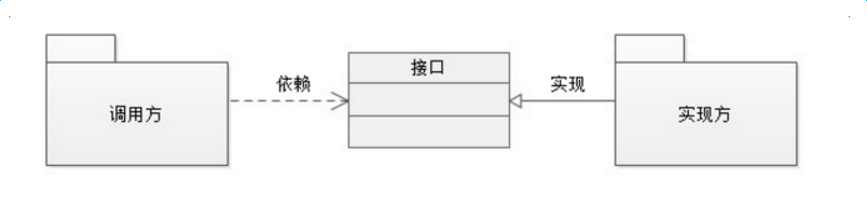
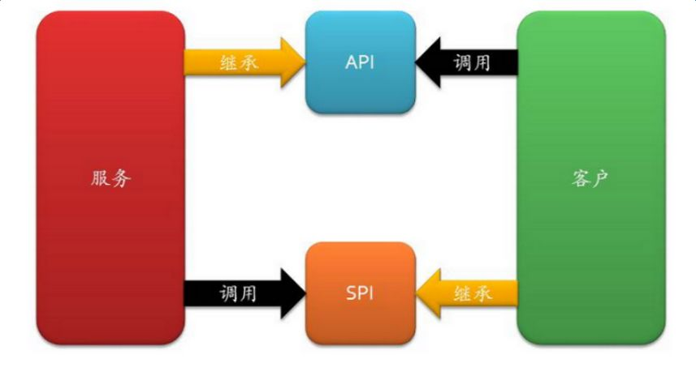

# 1、什么是SPI

面向的对象的设计里，我们一般推荐模块之间基于接口编程，模块之间不对实现类进行硬编码。一旦代码里涉及具体的实现类，就违反了可拔插的原则，如果需要替换一种实现，就需要修改代码。为了实现在模块装配的时候不用在程序里动态指明，这就需要一种服务发现机制。**Java SPI**就是提供这样的一个机制：**为某个接口寻找服务实现**。这有点类似IOC的思想，将装配的控制权移到了程序之外。



由上图为例，我们现在需要在“调用方”和“实现方”之间引入“接口”，可以思考一下什么情况应该把接口放入调用方，什么时候可以把接口归为实现方。

先来看看接口属于实现方的情况，这个很容易理解，实现方提供了接口和实现，我们可以引用接口来达到调用某实现类的功能，这就是我们经常说的 **API** （Application Programming Interface），具有以下特征：

1. 概念上更接近实现方
2. 组织上位于实现方所在的包中
3. 实现和接口在一个包中

当接口属于调用方时，我们就将其称为**SPI**（Aservice Provider Interface），具有以下特征：

1. 概念上更依赖调用方
2. 组织上位于调用方所在的包中
3. 实现位于独立的包中（也可认为在提供方中）



- API 在大多数情况下，都是实现方制定接口并完成对接口的实现，调用方仅仅依赖接口调用，且无权选择不同实现。 从使用人员上来说，**API 直接被应用开发人员使用**。
- SPI 是调用方来制定接口规范，提供给外部来实现，调用方在调用时则选择自己需要的外部实现。  从使用人员上来说，**SPI 一般为被框架扩展人员使用**。

# 2、代码实例

首先要定义一个接口：

```java
public interface Developer {
    String getProgram ();
}
```

假如该接口有两个实现：

```java
public class JavaDeveloper implements Developer{
    @Override
    public String getProgram () {
        return "Java";
    }
}

public class PhpDeveloper implements Developer{
    @Override
    public String getProgram () {
        return "PHP";
    }
}
```

然后根据Java SPI的规范，在resources目录下新建`META-INF/services`目录，并且在这个目录下新建一个**与接口的全限定名一致的文件**：`clf.winner.spi.Developer`，在这个文件中写入接口的**实现类的全限定名**：

> clf.winner.spi.JavaDeveloper

运行测试类：

```java
public static void main (String[] args) {
  ServiceLoader<Developer> services = ServiceLoader.load(Developer.class);
  for (Developer s : services) {
    System.out.println(s.getProgram());
  }
}
```

打印结果：

> Java

如果在`clf.winner.spi.Developer`文件里写上两个实现类，那最后的输出结果就是两行了。

因为`ServiceLoader.load(Search.class)`在加载某接口时，会去`META-INF/services`下找接口的全限定名文件，再根据里面的内容加载相应的实现类。


# 3、源码分析

通过上面的demo，可以看到最关键的实现就是`ServiceLoader`这个类：

```java
public final class ServiceLoader<S> implements Iterable<S>
    //配置文件的路径
    private static final String PREFIX = "META-INF/services/";
    //加载的服务类或接口
    private final Class<S> service;
    //已加载的服务类集合
    private LinkedHashMap<String,S> providers = new LinkedHashMap<>();
    //类加载器
    private final ClassLoader loader;
    //内部类，真正加载服务类
    private LazyIterator lookupIterator;
}
```

`load`方法创建了一些属性，重要的是实例化了内部类，`LazyIterator`。最后返回`ServiceLoader`的实例。

```dart
public final class ServiceLoader<S> implements Iterable<S>
    private ServiceLoader(Class<S> svc, ClassLoader cl) {
        //要加载的接口
        service = Objects.requireNonNull(svc, "Service interface cannot be null");
        //类加载器
        loader = (cl == null) ? ClassLoader.getSystemClassLoader() : cl;
        //访问控制器
        acc = (System.getSecurityManager() != null) ? AccessController.getContext() : null;
        //先清空
        providers.clear();
        //实例化内部类 
        LazyIterator lookupIterator = new LazyIterator(service, loader);
    }
}
```

查找实现类和创建实现类的过程，都在`LazyIterator`完成。当我们调用`iterator.hasNext`和`iterator.next`方法的时候，实际上调用的都是`LazyIterator`的相应方法：

```java
public Iterator<S> iterator() {
    return new Iterator<S>() {
        public boolean hasNext() {
            return lookupIterator.hasNext();
        }
        public S next() {
            return lookupIterator.next();
        }
        .......
    };
}
```

所以，我们重点关注`lookupIterator.hasNext()`方法，它最终会调用到`hasNextService`：

```dart
private class LazyIterator implements Iterator<S>{
    Class<S> service;
    ClassLoader loader;
    Enumeration<URL> configs = null;
    Iterator<String> pending = null;
    String nextName = null; 
    private boolean hasNextService() {
        //第二次调用的时候，已经解析完成了，直接返回
        if (nextName != null) {
            return true;
        }
        if (configs == null) {
            //META-INF/services/ 加上接口的全限定类名，就是文件服务类的文件
            //META-INF/services/com.viewscenes.netsupervisor.spi.SPIService
            String fullName = PREFIX + service.getName();
            //将文件路径转成URL对象
            configs = loader.getResources(fullName);
        }
        while ((pending == null) || !pending.hasNext()) {
            //解析URL文件对象，读取内容，最后返回
            pending = parse(service, configs.nextElement());
        }
        //拿到第一个实现类的类名
        nextName = pending.next();
        return true;
    }
}
```

当然，调用next方法的时候，实际调用到的是，`lookupIterator.nextService`。它通过反射的方式，创建实现类的实例并返回：

```java
private class LazyIterator implements Iterator<S>{
    private S nextService() {
        //全限定类名
        String cn = nextName;
        nextName = null;
        //创建类的Class对象
        Class<?> c = Class.forName(cn, false, loader);
        //通过newInstance实例化
        S p = service.cast(c.newInstance());
        //放入集合，返回实例
        providers.put(cn, p);
        return p; 
    }
}
```

# 4、应用场景

## 4.1 JDBC中的SPI

SPI机制为很多框架的扩展提供了可能，其实JDBC就应用到了这一机制。JDBC 4.0以前，开发人员还需要基于`Class.forName("xxx")`的方式来装载驱动，再通过DriverManager.getConnection获取一个Connection。类似这样：

```java
String url = "jdbc:mysql:///...";
String user = "root";
String password = "root";

Class.forName("com.mysql.jdbc.Driver");
Connection connection = DriverManager.getConnection(url, user, password);
```

到了JDBC 4.0，这一步骤就不再需要，那么它是怎么分辨是哪种数据库的呢？答案就在SPI。

我们把目光回到`DriverManager`类，它在静态代码块里面做了一件比较重要的事。很明显，它已经通过SPI机制， 把数据库驱动连接初始化了。

```swift
public class DriverManager {
    static {
        loadInitialDrivers();
        println("JDBC DriverManager initialized");
    }
}
```

具体过程还得看`loadInitialDrivers`，它在里面查找的是`Driver`接口的服务类，所以它的文件路径就是：`META-INF/services/java.sql.Driver`。

```java
public class DriverManager {
    private static void loadInitialDrivers() {
        AccessController.doPrivileged(new PrivilegedAction<Void>() {
            public Void run() {
                //很明显，它要加载Driver接口的服务类，Driver接口的包为:java.sql.Driver
                //所以它要找的就是META-INF/services/java.sql.Driver文件
                ServiceLoader<Driver> loadedDrivers = ServiceLoader.load(Driver.class);
                Iterator<Driver> driversIterator = loadedDrivers.iterator();
                try{
                    //查到之后创建对象
                    while(driversIterator.hasNext()) {
                        driversIterator.next();
                    }
                } catch(Throwable t) {
                    // Do nothing
                }
                return null;
            }
        });
    }
}
```

那么，这个文件哪里有呢？我们来看MySQL的jar包，就是这个文件：


文件内容为：`com.mysql.cj.jdbc.Driver`。

当调用next方法时，就会创建这个类的实例。它就完成了一件事，向DriverManager注册自身的实例。

```java
public class Driver extends NonRegisteringDriver implements java.sql.Driver {
    static {
        try {
            //注册
            //调用DriverManager类的注册方法
            //往registeredDrivers集合中加入实例
            java.sql.DriverManager.registerDriver(new Driver());
        } catch (SQLException E) {
            throw new RuntimeException("Can't register driver!");
        }
    }
    public Driver() throws SQLException {
        // Required for Class.forName().newInstance()
    }
}
```


与JDBS类似的还有common-logging，是Apache最早提供的日志门面接口。只有接口，没有实现。具体方案由各提供商实现，发现日志提供商是通过扫描 `META-INF/services/org.apache.commons.logging.LogFactory` 配置文件，通过读取该文件的内容找到日志提工商实现类。只要我们的日志实现里包含了这个文件，并在文件里制定  LogFactory工厂接口的实现类即可。

## 4.2 Dubbo中的SPI

Java 原生的SPI机制并不完善，有着如下的弊端：

- 只能遍历所有的实现，并全部实例化。
- 配置文件中只是简单的列出了所有的扩展实现，而没有给他们命名。导致在程序中很难去准确的引用它们。
- 扩展如果依赖其他的扩展，做不到自动注入和装配。
- 扩展很难和其他的框架集成，比如扩展里面依赖了一个Spring bean，原生的Java SPI不支持。

Dubbo也用了SPI思想，不过没有用JDK的SPI机制，是自己实现的一套SPI机制。

 Dubbo的SPI有如下几个概念：

- **扩展点**：一个接口。
- **扩展**：扩展（接口）的实现。
- **扩展自适应实例**：其实就是一个Extension的代理，它实现了扩展点接口。在调用扩展点的接口方法时，会根据实际的参数来决定要使用哪个扩展。Dubbo会根据接口中的参数，自动地决定选择哪个实现。
- **@SPI**：该注解作用于扩展点的接口上，表明该接口是一个扩展点。
- **@Adaptive**：该注解用在扩展接口的方法上。表示该方法是一个自适应方法。Dubbo在为扩展点生成自适应实例时，如果方法有`@Adaptive`注解，会为该方法生成对应的代码。

**SPI思想贯穿整个Dubbo的核心，很多组件都是保留一个接口和多个实现，然后在系统运行的时候动态的根据配置去找到对应的实现类。如果你没有配置，那就走默认的实现类**。


在Dubbo的源码中，很多地方会存在下面这样的三种代码，分别是**自适应扩展点**、**指定名称的扩展点**、**激活扩展点**。

```java
ExtensionLoader.getExtensionLoader(xxx.class).getAdaptiveExtension();
ExtensionLoader.getExtensionLoader(xxx.class).getExtension(name);
ExtensionLoader.getExtensionLoader(xxx.class).getActivateExtension(url, key);
```

以Protocol模块为例：

```java
@SPI("dubbo")  
public interface Protocol {  
      
    int getDefaultPort();  
  
    @Adaptive  
    <T> Exporter<T> export(Invoker<T> invoker) throws RpcException;  
  
    @Adaptive  
    <T> Invoker<T> refer(Class<T> type, URL url) throws RpcException;  

    void destroy();  
  
}
```

```java
Protocol protocol = ExtensionLoader.getExtensionLoader(Protocol.class).getAdaptiveExtension();
```

在运行的时候Dubbo会判断一下应该选用这个Protocol接口的哪个实现类。它会去找你配置的Protocol，将你配置的Protocol实现类加载到JVM中来，然后实例化对象，就用你配置的那个Protocol实现类就可以了。

配置文件位于`META-INF/dubbo/internal/org.apache.dubbo.rpc.Protocol`中：

```dart
filter=org.apache.dubbo.rpc.protocol.ProtocolFilterWrapper
listener=org.apache.dubbo.rpc.protocol.ProtocolListenerWrapper
mock=org.apache.dubbo.rpc.support.MockProtocol
dubbo=org.apache.dubbo.rpc.protocol.dubbo.DubboProtocol
injvm=org.apache.dubbo.rpc.protocol.injvm.InjvmProtocol
rmi=org.apache.dubbo.rpc.protocol.rmi.RmiProtocol
hessian=org.apache.dubbo.rpc.protocol.hessian.HessianProtocol
http=org.apache.dubbo.rpc.protocol.http.HttpProtocol

org.apache.dubbo.rpc.protocol.webservice.WebServiceProtocol
thrift=org.apache.dubbo.rpc.protocol.thrift.ThriftProtocol
native-thrift=org.apache.dubbo.rpc.protocol.nativethrift.ThriftProtocol
memcached=org.apache.dubbo.rpc.protocol.memcached.MemcachedProtocol
redis=org.apache.dubbo.rpc.protocol.redis.RedisProtocol
rest=org.apache.dubbo.rpc.protocol.rest.RestProtocol
xmlrpc=org.apache.dubbo.xml.rpc.protocol.xmlrpc.XmlRpcProtocol
registry=org.apache.dubbo.registry.integration.RegistryProtocol
qos=org.apache.dubbo.qos.protocol.QosProtocolWrapper
```

所以这就看到了dubbo的SPI机制默认是怎么玩的了。

`@SPI("dubbo") `说的是，通过 SPI 机制来提供实现类，实现类是通过 `dubbo` 作为默认 key 去配置文件里找到的，配置文件名称与接口全限定名一样的，通过 `dubbo` 作为 key 可以找到默认的实现类就是 `org.apache.dubbo.rpc.protocol.dubbo.DubboProtocol`。

如果想要动态替换掉默认的实现类，需要使用 `@Adaptive` 接口，Protocol 接口中，有两个方法加了 `@Adaptive` 注解，就是说那俩接口会被代理实现。

比如这个 Protocol 接口搞了俩 @Adaptive 注解标注了方法，在运行的时候会针对 Protocol 生成代理类，这个代理类的那俩方法里面会有代理代码，代理代码会在运行的时候动态根据 url 中的 protocol 来获取那个 key，默认是 `dubbo`，你也可以自己指定，你如果指定了别的 key，那么就会获取别的实现类的实例了。