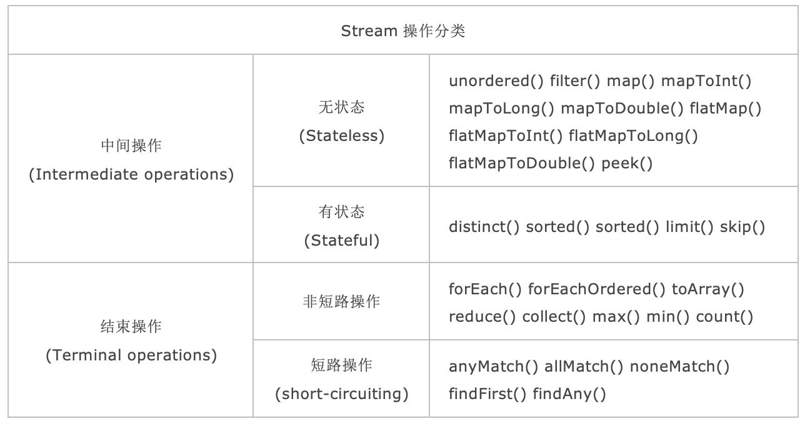
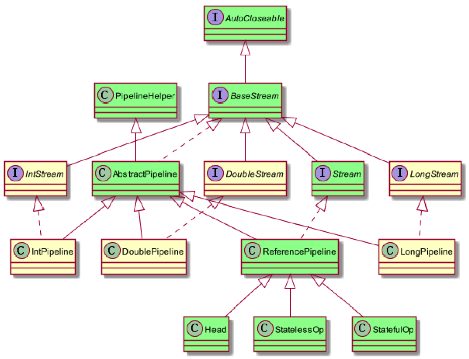
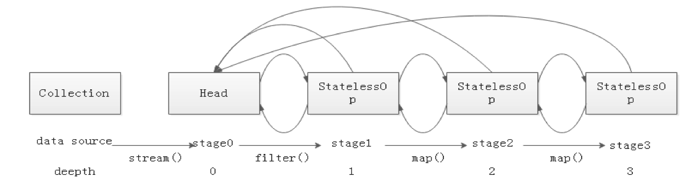
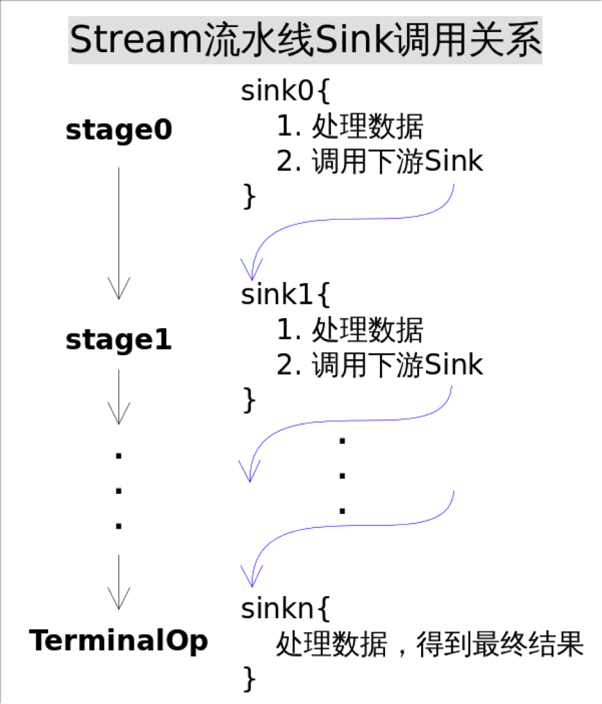
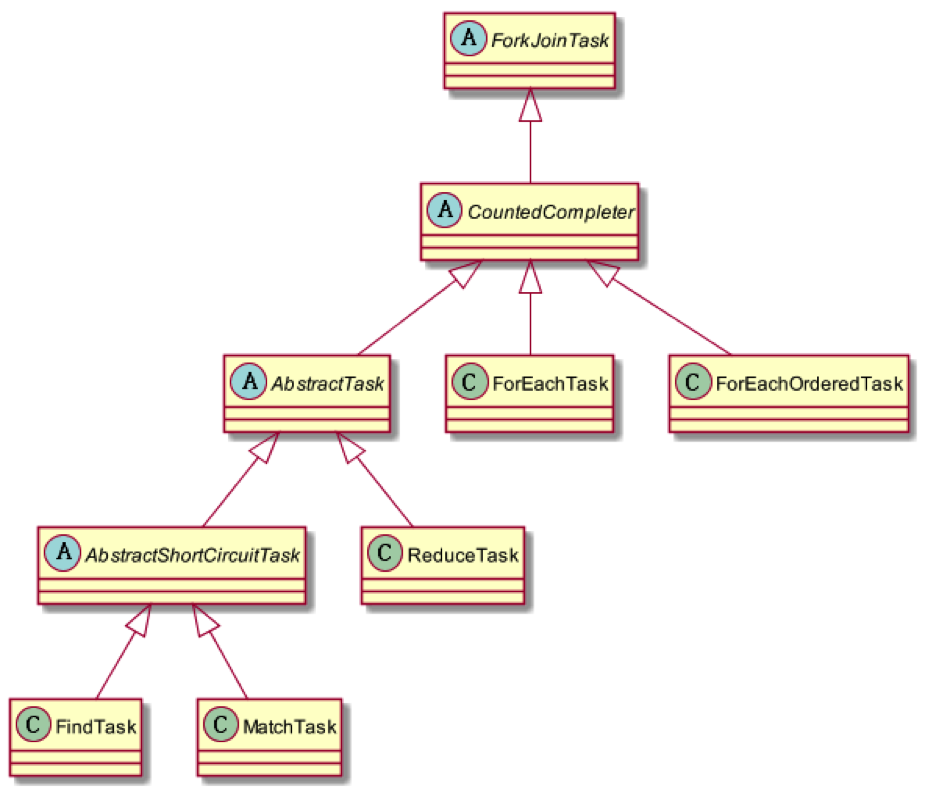
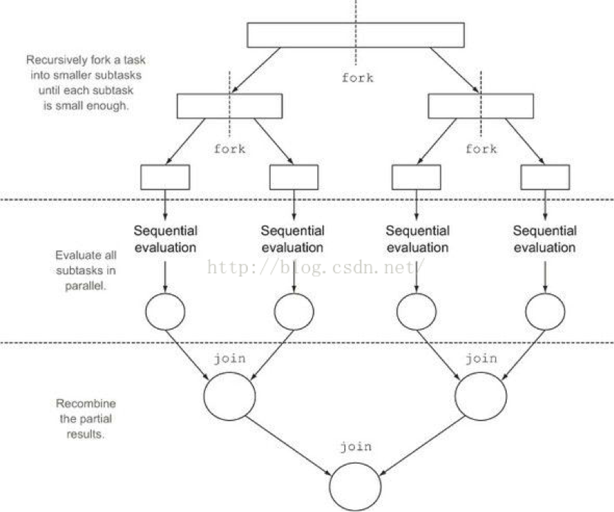

# 1、操作分类



Stream中的操作可以分为两大类：**中间操作**（Intermediate operations）与**结束操作**（Terminal operations），中间操作只是对操作进行了记录，只有结束操作才会触发实际的计算（即惰性求值），这也是Stream在迭代大集合时高效的原因之一。中间操作又可以分为**无状态**（Stateless）操作与**有状态**（Stateful）操作，前者是指元素的处理不受之前元素的影响；后者是指该操作只有拿到所有元素之后才能继续下去。结束操作又可以分为**短路**（short-circuiting）与**非短路**操作，这个应该很好理解，前者是指遇到某些符合条件的元素就可以得到最终结果；而后者是指必须处理所有元素才能得到最终结果。

之所以要进行如此精细的划分，是因为底层对每一种情况的处理方式不同。



- BaseStream定义了流的迭代、并行、串行等基本特性；
- Stream中定义了map、filter、flatmap等用户关注的常用操作；
- PipelineHelper用于执行管道流中的操作以及捕获输出类型、并行度等信息
- Head、StatelessOp、StatefulOp为ReferencePipeline中的内部子类，用于描述流的操作阶段。

# 2、源码分析

来看一个例子：

```java
	List<String> list = Arrays.asList("China", "America", "Russia", "Britain");
	List<String> result = list.stream().filter(e -> e.length() >= 4).map(e -> e.charAt(0))
			.map(e -> String.valueOf(e)).collect(Collectors.toList());
```

上面List首先生成了一个stream，然后经过`filter`、`map`、`map`三次无状态的中间操作，最后由最终操作`collect`收尾。

下面通过源码来一次庖丁解牛，看看一步步到底是怎么实现的。

生成流的操作是通过调用`StreamSupport`类下面的方法实现的：

## 2.1 Stream()

```java
	public static <T> Stream<T> stream(Spliterator<T> spliterator, boolean parallel) {
		Objects.requireNonNull(spliterator);
		return new ReferencePipeline.Head<>(spliterator, StreamOpFlag.fromCharacteristics(spliterator), parallel);
	}
```

方法很简单，直接`new`了一个`ReferencePipeline.Head`对象并返回。`Head`是`ReferencePipeline`的子类，而`ReferencePipeline`是`Stream`的子类。也就是说，返回了一个由`Head`实现的`Stream`。

追溯源码可以发现，`Head`最终通过调用父类`ReferencePipeline`的构造方法完成实例化：

```java
	public static <T> Stream<T> stream(Spliterator<T> spliterator, boolean parallel) {
		Objects.requireNonNull(spliterator);

		// 返回了一个由Head实现的Stream，三个参数分别代表流的数据源、特性组合、是否并行
		return new ReferencePipeline.Head<>(spliterator, StreamOpFlag.fromCharacteristics(spliterator), parallel);
	}

	AbstractPipeline(Spliterator<?> source, int sourceFlags, boolean parallel) {
		this.previousStage = null; // 上一个stage指向null
		this.sourceSpliterator = source;
		this.sourceStage = this; // 源头stage指向自己
		this.sourceOrOpFlags = sourceFlags & StreamOpFlag.STREAM_MASK;
		// The following is an optimization of:
		// StreamOpFlag.combineOpFlags(sourceOrOpFlags, StreamOpFlag.INITIAL_OPS_VALUE);
		this.combinedFlags = (~(sourceOrOpFlags << 1)) & StreamOpFlag.INITIAL_OPS_VALUE;
		this.depth = 0;
		this.parallel = parallel;
	}
```

`AbstractPipeline`类中定义了三个称为“stage”内部变量：

```java
	/**
	 * Backlink to the head of the pipeline chain (self if this is the source
	 * stage).
	 */
	@SuppressWarnings("rawtypes")
	private final AbstractPipeline sourceStage;

	/**
	 * The "upstream" pipeline, or null if this is the source stage.
	 */
	@SuppressWarnings("rawtypes")
	private final AbstractPipeline previousStage;


	/**
	 * The next stage in the pipeline, or null if this is the last stage.
	 * Effectively final at the point of linking to the next pipeline.
	 */
	@SuppressWarnings("rawtypes")
	private AbstractPipeline nextStage;
```

当前节点同时持有前一个节点与后一个节点的指针，并且保留了头结点的引用，这不是典型的双端链表吗？

基于此，分析上面的构造函数：

- 前一个节点为空
- 头结点指向自己
- 后一个节点暂时未指定

很显然，构造出的是一个双端列表的头结点。

综上所述，`stream`函数返回了一个由`ReferencePipeline`类实现的管道流，且该管道流为一个双端链表的头结点

## 2.2 filter()

再来看第二步，filter操作，具体实现在`ReferencePipeline`的如下方法：

```java
	public final Stream<P_OUT> filter(Predicate<? super P_OUT> predicate) {
		// 入参不能为空
		Objects.requireNonNull(predicate);

		// 构建了一个StatelessOp对象，即无状态的中间操作
		return new StatelessOp<P_OUT, P_OUT>(this, StreamShape.REFERENCE, StreamOpFlag.NOT_SIZED) {
			// 覆写了父类的一个方法opWrapSink
			@Override
			Sink<P_OUT> opWrapSink(int flags, Sink<P_OUT> sink) {
				return new Sink.ChainedReference<P_OUT, P_OUT>(sink) {
					@Override
					public void begin(long size) {
						downstream.begin(-1);
					}

					@Override
					public void accept(P_OUT u) {
						if (predicate.test(u))
							downstream.accept(u);
					}
				};
			}
		};
	}
```

`StatelessOp`与`Head`一样，也是`ReferencePipeline`的内部子类，同样通过调用父类`ReferencePipeline`的构造方法完成实例化，注意第一个参数，传入的是`this`，就是将上一步创建的`Head`对象传入，作为`StatelessOp`的`previousStage`。

```java
	AbstractPipeline(AbstractPipeline<?, E_IN, ?> previousStage, int opFlags) {
	    if (previousStage.linkedOrConsumed)
	        throw new IllegalStateException(MSG_STREAM_LINKED);
	    previousStage.linkedOrConsumed = true;
	    previousStage.nextStage = this; //前一个stage指向自己

	    this.previousStage = previousStage; //自己指向前一个stage
	    this.sourceOrOpFlags = opFlags & StreamOpFlag.OP_MASK;
	    this.combinedFlags = StreamOpFlag.combineOpFlags(opFlags, previousStage.combinedFlags);
	    this.sourceStage = previousStage.sourceStage; //也保留了头结点的引用
	    if (opIsStateful())
	        sourceStage.sourceAnyStateful = true;
	    this.depth = previousStage.depth + 1;
	}
```

`filter`操作成为了双端链表的第二环。

值得注意的是，构造`StatelessOp`时，覆写了父类的一个方法`opWrapSink`，返回了一个`Sink`对象，作用暂时未知，猜测后面的操作应该会用到。

## 2.3 map()

再来看接下来的map操作：

```java
	@Override
	@SuppressWarnings("unchecked")
	public final <R> Stream<R> map(Function<? super P_OUT, ? extends R> mapper) {
		Objects.requireNonNull(mapper);
		return new StatelessOp<P_OUT, R>(this, StreamShape.REFERENCE,
				StreamOpFlag.NOT_SORTED | StreamOpFlag.NOT_DISTINCT) {
			@Override
			Sink<P_OUT> opWrapSink(int flags, Sink<R> sink) {
				return new Sink.ChainedReference<P_OUT, R>(sink) {
					@Override
					public void accept(P_OUT u) {
						downstream.accept(mapper.apply(u));
					}
				};
			}
		};
	}
```

与`filter`类似，构造了一个`StatelessOp`对象，追加到双端列表中的末尾。

不同的地方在于`opWrapSink`方法的实现，继续猜测，通过覆写`opWrapSink`，应该可以影响管道流的流程，实现定制化的操作。

调用一系列操作后会形成如下所示的双链表结构：



## 2.4 collect()

最后来看`collect`操作，不同于`filter`与`map`，`collect`为结束操作，肯定有特殊之。

```java
	@Override
	@SuppressWarnings("unchecked")
	public final <R, A> R collect(Collector<? super P_OUT, A, R> collector) {
		A container;
		if (isParallel() && (collector.characteristics().contains(Collector.Characteristics.CONCURRENT))
				&& (!isOrdered() || collector.characteristics().contains(Collector.Characteristics.UNORDERED))) {
			container = collector.supplier().get();
			BiConsumer<A, ? super P_OUT> accumulator = collector.accumulator();
			forEach(u -> accumulator.accept(container, u));
		} else { // 串行模式
			container = evaluate(ReduceOps.makeRef(collector)); // evaluate触发
		}
		return collector.characteristics().contains(Collector.Characteristics.IDENTITY_FINISH) ? (R) container
				: collector.finisher().apply(container);
	}
```

`ReduceOps.makeRef(collector)` 会构造一个`TerminalOp`对象，传入`evaluate`方法，追溯源码，发现最终是调用`copyInto`方法来启动流水线：

```java
	@Override
	final <P_IN> void copyInto(Sink<P_IN> wrappedSink, Spliterator<P_IN> spliterator) {
		Objects.requireNonNull(wrappedSink);

		if (!StreamOpFlag.SHORT_CIRCUIT.isKnown(getStreamAndOpFlags())) { // 无短路操作
			wrappedSink.begin(spliterator.getExactSizeIfKnown());// 通知开始遍历
			spliterator.forEachRemaining(wrappedSink); // 依次处理每个元素
			wrappedSink.end();// 通知结束遍历
		} else { // 有短路操作
			copyIntoWithCancel(wrappedSink, spliterator);
		}
	}
```

该方法从数据源`Spliterator`获取的元素，推入Sink 进行处理，如果有短路操作，在每个元素处理后会通过`Sink.cancellationRequested()`判断是否立即返回。

前面的`filter`、`map`操作只是做了一系列的准备工作，并没有执行，真正的迭代是由结束操作`collect`来触发的。

## 2.5 Sink

Stream中使用Stage的概念来描述一个完整的操作，将具有先后顺序的各个Stage连到一起，就构成了整个流水线。

很多Stream操作会需要一个回调函数（Lambda表达式），因此一个完整的操作是`<数据来源，操作，回调函数>`构成的三元组。

stage只是解决了操作记录的问题，要想让流水线起到应有的作用我们需要一种将所有操作叠加到一起的方案。你可能会觉得这很简单，只需要从流水线的head开始依次执行每一步的操作（包括回调函数）就行了。这听起来似乎是可行的，但是你忽略了前面的Stage并不知道后面Stage到底执行了哪种操作，以及回调函数是哪种形式。换句话说，只有当前Stage本身才知道该如何执行自己包含的动作。这就需要有某种协议来协调相邻Stage之间的调用关系。

继续从源码找答案。

`filter`、`map`源码中，都覆写了一个名为`opWrapSink`的方法，该方法会返回一个 Sink 对象，而`collect`正是通过 Sink 来处理流中的数据。种种迹象表明，这个名为 Sink 的类在流的处理流程当中扮演了极其重要的角色。

```java
	interface Sink<T> extends Consumer<T> {
		
		//开始遍历元素之前调用该方法，通知Sink做好准备，size代表要处理的元素总数，如果传入-1代表总数未知或者无限
	    default void begin(long size) {}

	    //所有元素遍历完成之后调用，通知Sink没有更多的元素了。
	    default void end() {}

	    //如果返回true，代表这个Sink不再接收任何数据
	    default boolean cancellationRequested() {
	        return false;
	    }
	    
	    //还有一个继承自Consumer的方法，用于接收管道流中的数据
	    //void accept(T t);
	    
	    ...
	}
```

`collect`操作在调用`copyInto`方法时，传入了一个名为`wrappedSink`的参数，就是一个 Sink 对象，由`AbstractPipeline.wrapSink`方法构造：

```java
	@Override
	@SuppressWarnings("unchecked")
	final <P_IN> Sink<P_IN> wrapSink(Sink<E_OUT> sink) {
		Objects.requireNonNull(sink);

		for (@SuppressWarnings("rawtypes")
		AbstractPipeline p = AbstractPipeline.this; p.depth > 0; p = p.previousStage) {
			// 自本身stage开始，不断调用前一个stage的opWrapSink，直到头节点
			sink = p.opWrapSink(p.previousStage.combinedFlags, sink);
		}
		return (Sink<P_IN>) sink;
	}
```

`opWrapSink()`方法的作用是将当前操作与下游 Sink 结合成新 Sink ，试想，只要从流水线的最后一个Stage开始，不断调用上一个Stage的`opWrapSink()`方法直到头节点，就可以得到一个代表了流水线上所有操作的 Sink。

而这个`opWrapSink`方法不就是前面`filter`、`map`源码中一直很神秘的未知操作吗？

至此，任督二脉打通，豁然开朗！

有了上面的协议，相邻Stage之间调用就很方便了，每个Stage都会将自己的操作封装到一个Sink里，前一个Stage只需调用后一个Stage的`accept()`方法即可，并不需要知道其内部是如何处理的。当然对于有状态的操作，Sink的`begin()`和`end()`方法也是必须实现的。比如`Stream.sorted()`是一个有状态的中间操作，其对应的`Sink.begin()`方法可能会创建一个盛放结果的容器，而`accept()`方法负责将元素添加到该容器，最后`end()`负责对容器进行排序。对于短路操作，`Sink.cancellationRequested()`也是必须实现的，比如`Stream.findFirst()`是短路操作，只要找到一个元素，`cancellationRequested()`就应该返回true，以便调用者尽快结束查找。Sink的四个接口方法常常相互协作，共同完成计算任务。**实际上Stream API内部实现的的本质，就是如何重载Sink的这四个接口方法**。



有了Sink对操作的包装，Stage之间的调用问题就解决了，执行时只需要从流水线的head开始对数据源依次调用每个Stage对应的`Sink.{begin(), accept(), cancellationRequested(), end()}`方法就可以了。一种可能的`Sink.accept()`方法流程是这样的：

```java
void accept(U u){

      1. 使用当前Sink包装的回调函数处理u

      2. 将处理结果传递给流水线下游的Sink
}
```

Sink接口的其他几个方法也是按照这种[处理->转发]的模型实现。下面我们结合具体例子看看Stream的中间操作是如何将自身的操作包装成Sink以及Sink是如何将处理结果转发给下一个Sink的。先看`Stream.map()`方法：

```java
	// Stream.map()，调用该方法将产生一个新的Stream
	public final <R> Stream<R> map(Function<? super P_OUT, ? extends R> mapper) {
		// ...
		return new StatelessOp<P_OUT, R>(this, StreamShape.REFERENCE,
				StreamOpFlag.NOT_SORTED | StreamOpFlag.NOT_DISTINCT) {
			@Override /* opWripSink()方法返回由回调函数包装而成Sink */
			Sink<P_OUT> opWrapSink(int flags, Sink<R> downstream) {
				return new Sink.ChainedReference<P_OUT, R>(downstream) {
					@Override
					public void accept(P_OUT u) {
						R r = mapper.apply(u);// 1. 使用当前Sink包装的回调函数mapper处理u
						downstream.accept(r);// 2. 将处理结果传递给流水线下游的Sink
					}
				};
			}
		};
	}
```

上述代码看似复杂，其实逻辑很简单，就是将回调函数`mapper`包装到一个Sink当中。由于`Stream.map()`是一个无状态的中间操作，所以`map()`方法返回了一个`StatelessOp`内部类对象（一个新的Stream），调用这个新Stream的`opWripSink()`方法将得到一个包装了当前回调函数的Sink。

再来看一个复杂一点的例子。`Stream.sorted()`方法将对Stream中的元素进行排序，显然这是一个有状态的中间操作，因为读取所有元素之前是没法得到最终顺序的。抛开模板代码直接进入问题本质，`sorted()`方法是如何将操作封装成Sink的呢？`sorted()`一种可能封装的Sink代码如下：

```java
	// Stream.sort()方法用到的Sink实现
	class RefSortingSink<T> extends AbstractRefSortingSink<T> {
		private ArrayList<T> list;// 存放用于排序的元素

		RefSortingSink(Sink<? super T> downstream, Comparator<? super T> comparator) {
			super(downstream, comparator);
		}

		@Override
	    public void begin(long size) {
	        ...
	        // 创建一个存放排序元素的列表
	        list = (size >= 0) ? new ArrayList<T>((int) size) : new ArrayList<T>();
	    }

		@Override
		public void end() {
			list.sort(comparator);// 只有元素全部接收之后才能开始排序
			downstream.begin(list.size());
			if (!cancellationWasRequested) {// 下游Sink不包含短路操作
				list.forEach(downstream::accept);// 2. 将处理结果传递给流水线下游的Sink
			} else {// 下游Sink包含短路操作
				for (T t : list) {// 每次都调用cancellationRequested()询问是否可以结束处理。
					if (downstream.cancellationRequested())
						break;
					downstream.accept(t);// 2. 将处理结果传递给流水线下游的Sink
				}
			}
			downstream.end();
			list = null;
		}

		@Override
		public void accept(T t) {
			list.add(t);// 1. 使用当前Sink包装动作处理t，只是简单的将元素添加到中间列表当中
		}
	}
```

上述代码完美的展现了Sink的四个接口方法是如何协同工作的：

- 首先`beging()`方法告诉Sink参与排序的元素个数，方便确定中间结果容器的的大小；
- 之后通过`accept()`方法将元素添加到中间结果当中，最终执行时调用者会不断调用该方法，直到遍历所有元素；
- 最后`end()`方法告诉Sink所有元素遍历完毕，启动排序步骤，排序完成后将结果传递给下游的Sink；
- 如果下游的Sink是短路操作，将结果传递给下游时不断询问下游`cancellationRequested()`是否可以结束处理。

# 3、结果收集

最后一个问题是流水线上所有操作都执行后，用户所需要的结果（如果有）在哪里？首先要说明的是不是所有的Stream结束操作都需要返回结果，有些操作只是为了使用其副作用(Side-effects)，比如使用`Stream.forEach()`方法将结果打印出来就是常见的使用副作用的场景（事实上，除了打印之外其他场景都应避免使用副作用），对于真正需要返回结果的结束操作结果存在哪里呢？

特别说明：副作用不应该被滥用，也许你会觉得在`Stream.forEach()`里进行元素收集是个不错的选择，就像下面代码中那样，但遗憾的是这样使用的正确性和效率都无法保证，因为Stream可能会并行执行。大多数使用副作用的地方都可以使用归约操作更安全和有效的完成。

```
	// 错误的收集方式
	ArrayList<String> results = new ArrayList<>();
	stream.filter(s -> pattern.matcher(s).matches()).forEach(s -> results.add(s)); // Unnecessary use of
																					// side-effects!
	// 正确的收集方式
	List<String> results = stream.filter(s -> pattern.matcher(s).matches()).collect(Collectors.toList()); // No side-effects!
```

回到流水线执行结果的问题上来，需要返回结果的流水线结果存在哪里呢？这要分不同的情况讨论，下表给出了各种有返回结果的Stream结束操作。

| 返回类型 | 对应的结束操作                    |
| -------- | --------------------------------- |
| boolean  | anyMatch() allMatch() noneMatch() |
| Optional | findFirst() findAny()             |
| 归约结果 | reduce() collect()                |
| 数组     | toArray()                         |

- 对于表中返回`boolean`或者`Optional`的操作的操作，由于值返回一个值，只需要在对应的Sink中记录这个值，等到执行结束时返回就可以了。
- 对于归约操作，最终结果放在用户调用时指定的容器中（容器类型通过收集器指定）。`collect()`,` reduce(),` `max()`,` min()`都是归约操作，虽然`max()`和`min()`也是返回一个`Optional`，但事实上底层是通过调用`reduce()`方法实现的。
- 对于返回是数组的情况，在最终返回数组之前，结果其实是存储在一种叫做Node的数据结构中的。Node是一种多叉树结构，元素存储在树的叶子当中，并且一个叶子节点可以存放多个元素。这样做是为了并行执行方便。

# 4、并行流

如果将上面的例子改为如下形式，管道流将会以并行模式处理数据：

```java
	List<String> list = Arrays.asList("China", "America", "Russia", "Britain");
	List<String> result = list.stream().parallel().filter(e -> e.length() >= 4).map(e -> e.charAt(0))
			.map(e -> String.valueOf(e)).collect(Collectors.toList());
```

`parallel()`方法的实现很简单，只是将源stage的并行标记只为true：

```java
	@Override
	@SuppressWarnings("unchecked")
	public final S parallel() {
		sourceStage.parallel = true;
		return (S) this;
	}
```

在结束操作通过`evaluate`方法启动管道流时，会根据并行标记来判断：

```java
	final <R> R evaluate(TerminalOp<E_OUT, R> terminalOp) {
		assert getOutputShape() == terminalOp.inputShape();
		if (linkedOrConsumed)
			throw new IllegalStateException(MSG_STREAM_LINKED);
		linkedOrConsumed = true;

		return isParallel() ? terminalOp.evaluateParallel(this, sourceSpliterator(terminalOp.getOpFlags()))
				: terminalOp.evaluateSequential(this, sourceSpliterator(terminalOp.getOpFlags()));
	}
```

`collect`操作会通过`ReduceTask`来执行并发任务：

```java
	@Override
	public <P_IN> R evaluateParallel(PipelineHelper<T> helper, Spliterator<P_IN> spliterator) {
		return new ReduceTask<>(this, helper, spliterator).invoke().get();
	}
```

`ReduceTask`是`ForkJoinTask`的子类，其实Stream的并行处理都是基于Fork/Join框架的，相关类与接口的结构如下图所示：



fork/join框架是jdk1.7引入的，可以以递归方式将并行的任务拆分成更小的任务，然后将每个子任务的结果合并起来生成整体结果。它是`ExecutorService`接口的一个实现，它把子任务分配线程池（`ForkJoinPool`）中的工作线程。要把任务提交到这个线程池，必须创建`RecursiveTask<R>`的一个子类，如果任务不返回结果则是`RecursiveAction`的子类。



对于`ReduceTask`来说，任务分解的实现定义在其父类`AbstractTask`的`compute()`方法当中：

```java
	@Override
	public void compute() {
		Spliterator<P_IN> rs = spliterator, ls; // right, left spliterators
		long sizeEstimate = rs.estimateSize();
		long sizeThreshold = getTargetSize(sizeEstimate);
		boolean forkRight = false;
		@SuppressWarnings("unchecked")
		K task = (K) this;
		while (sizeEstimate > sizeThreshold && (ls = rs.trySplit()) != null) {
			K leftChild, rightChild, taskToFork;
			task.leftChild = leftChild = task.makeChild(ls);
			task.rightChild = rightChild = task.makeChild(rs);
			task.setPendingCount(1);
			if (forkRight) {
				forkRight = false;
				rs = ls;
				task = leftChild;
				taskToFork = rightChild;
			} else {
				forkRight = true;
				task = rightChild;
				taskToFork = leftChild;
			}
			taskToFork.fork();
			sizeEstimate = rs.estimateSize();
		}
		task.setLocalResult(task.doLeaf());
		task.tryComplete();
	}
```

主要逻辑如下：

先调用当前`splititerator` 方法的`estimateSize` 方法，预估这个分片中的数据量，根据预估的数据量获取最小处理单元的阈值，即当数据量已经小于这个阈值的时候进行计算，否则进行fork 将任务划分成更小的数据块，进行求解。

值得注意的是，这里面有个很重要的参数，用来判断是否需要继续分割成更小的子任务，默认为`parallelism*4`，`parallelism`是并发度的意思，默认值为`cpu 数 – 1`，可以通过`java.util.concurrent.ForkJoinPool.common.parallelism`设置，
如果当前分片大小仍然大于处理数据单元的阈值，且分片继续尝试切分成功，那么就继续切分，分别将左右分片的任务创建为新的Task，并且将当前的任务关联为两个新任务的父级任务（逻辑在`makeChild` 里面）。

先后对左右子节点的任务进行fork，对另外的分区进行分解。同时设定`pending` 为1，这代表一个task 实际上只会有一个等待的子节点（被fork）。

当任务已经分解到足够小的时候退出循环，尝试进行结束。调用子类实现的`doLeaf`方法，完成最小计算单元的计算任务，并设置到当前任务的`localResult`中。

然后调用`tryComplete `方法进行最终任务的扫尾工作，如果该任务`pending` 值不等于0，则原子的减1，如果已经等于0，说明任务都已经完成，则调用`onCompletion` 回调，如果该任务是叶子任务，则直接销毁中间数据结束；如果是中间节点会将左右子节点的结果进行合并。

最后检查这个任务是否还有父级任务了，如果没有则将该任务置为正常结束，如果还有则尝试递归的去调用父级节点的`onCompletion`回调，逐级进行任务的合并。

```java

	public final void tryComplete() {
		CountedCompleter<?> a = this, s = a;
		for (int c;;) {
			if ((c = a.pending) == 0) {
				a.onCompletion(s);
				if ((a = (s = a).completer) == null) {
					s.quietlyComplete();
					return;
				}
			} else if (U.compareAndSwapInt(a, PENDING, c, c - 1))
				return;
		}
	}
```

并行流的实现本质上就是在`ForkJoin`上进行了一层封装，将Stream 不断尝试分解成更小的split，然后使用fork/join 框架分而治之。