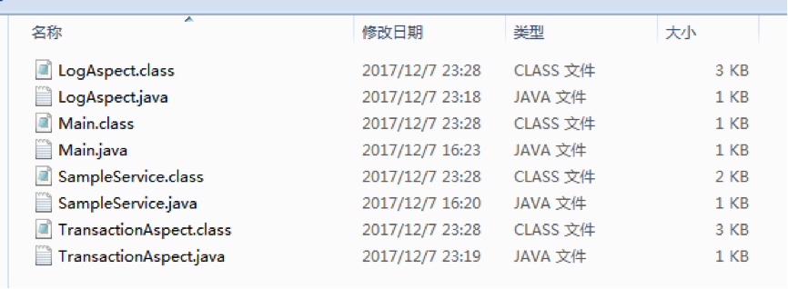
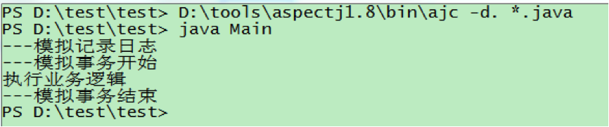
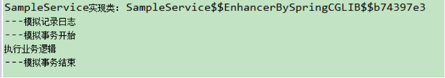
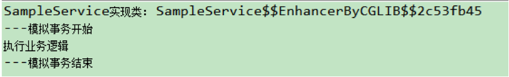
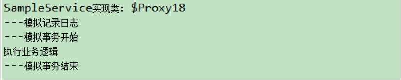
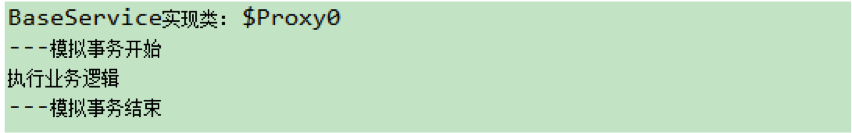

有人可能会奇怪，Spring不是有自己原生的AOP组件吗，为什么还要引入AspectJ呢？

同问，俄罗斯的军工那么牛逼，为什么普京还是要从法国订购西北风级两栖攻击舰呢？

无他，自己的东西不争气，最好的选择就是：恶心自己，成全别人

说起Spring原生的AOP组件，实在有点给Spring大家族丢人，因为使用它需要实现大量的接口，继承大量的类，不优雅而且难用，这与Spring一直秉承的无侵入、低耦合原则大相径庭。Spring 原生的AOP组件大多数也就是撑撑门面的东西，在实际的开发中很少有人用它来实现切面编程，AspectJ才是事实上的AOP标准。

好在Spring对开源的优秀框架向来是采用兼容包并的态度。所以，后来的Spring 就提供了对AspectJ支持，也就是我们后来所说的基于纯POJO的AOP。

不同的是，Spring AOP采用的**动态织入**，利用其强大的动态代理功能，在程序运行期间将Advice 织入到Jointpoint；而AspectJ采用的是**静态织入**，它有专门的编译器，将Advice以字节码的形式织入到class文件中。

# 1、AspectJ与静态织入

AspectJ的下载、安装很简单，在此不再赘述。

安装目录的bin文件夹下包含AspectJ支持的命令：


其中 `ajc` 命令最常用，它的作用类似于 `javac`，用于对普通 Java 类进行编译时增强。

事务管理与日志记录是开发中经常涉及的功能，而且很适合通过切面来实现。下面通过一个简单的例子来模拟这两个流程。

SampleService用于模拟一个业务组件：

```java
	public class SampleService {
		public void doBusiness() {
			System.out.println("执行业务逻辑");
		}
	}

	// 日志切面：
	public aspect LogAspect{
		   before():execution(void *.doBusiness()){
		      System.out.println("---模拟记录日志");
		   }
		}

	// 事务切面：
	public aspect TransactionAspect{

		void around():execution(void *.doBusiness()){
		       System.out.println("---模拟事务开始");
		       proceed(); //AspectJ的回调函数
		      System.out.println("---模拟事务结束");
		   }
		 
		}

	// 启动类
	public class Main {

		public static void main(String[] args) {
			SampleService sampleService = new SampleService();
			sampleService.doBusiness();
		}

	}
```

切面类当中，用到了AspectJ的特有语法，实际上跟切入点表达式没什么两样。日志用到的前置通知，事务用到的是环绕通知，两个通知都会织入到任何名为doBusiness()的方法当中。

将这四个类放在一个文件夹下面，运行命令：

`ajc -d. \*.java`

我们可以把 `ajc.exe` 理解成 `javac.exe` 命令，都用于编译 Java 程序，区别是 `ajc.exe` 命令可识别 AspectJ 的语法。

ajc命令会将以上四个类编译成.class文件：



此时，用”java Main” 命令启动程序：

  

可见，日志记录与实务管理已经织入到SampleService当中了。

使用反编译工具查看SampleService.class、TransactionAspect.class、LogAspect.class三个文件，一探究竟：

```java
import java.io.PrintStream;
import org.aspectj.runtime.internal.AroundClosure;

public class SampleService {

	   public void doBusiness() { //该方法只是保留了方法名，内部实现已经被AspectJ改造
	       LogAspect.aspectOf().ajc$before$LogAspect$1$a18068bd(); //执行日志切面逻辑
	       doBusiness_aroundBody1$advice(this, TransactionAspect.aspectOf(), null);
	   }
	   
	   //原来的doBusiness()逻辑被移到了这个方法当中
	   private static final void doBusiness_aroundBody0(SampleService ajc$this) { 
	       System.out.println("执行业务逻辑");
	   }


	   private static final void doBusiness_aroundBody1$advice(SampleService ajc$this,
	          TransactionAspect ajc$aspectInstance, AroundClosure ajc$aroundClosure) {

	       System.out.println("---模拟事务开始");
	       AroundClosure localAroundClosure = ajc$aroundClosure;
	       doBusiness_aroundBody0(ajc$this); //执行核心业务逻辑，语句前后加入了TransactionAspect的切面代码
	       System.out.println("---模拟事务结束");
	   }
	}

import java.io.PrintStream;
import org.aspectj.lang.NoAspectBoundException;
import org.aspectj.runtime.internal.AroundClosure;

public class TransactionAspect {

	   private static Throwable ajc$initFailureCause;
	   public static final TransactionAspect ajc$perSingletonInstance;

	   static {
	       try {
	          ajc$postClinit(); //事务切面类在静态代码块中被初始化，单例模式
	       } catch (Throwable localThrowable) {
	          ajc$initFailureCause = localThrowable;
	       }
	   }

	   public void ajc$around$TransactionAspect$1$a18068bd(AroundClosure ajc$aroundClosure) {

	       System.out.println("---模拟事务开始");
	       ajc$around$TransactionAspect$1$a18068bdproceed(ajc$aroundClosure); //调用被目标方法
	       System.out.println("---模拟事务结束");

	   }

	   static void ajc$around$TransactionAspect$1$a18068bdproceed(AroundClosure this) throws Throwable {

	   }


	   public static TransactionAspect aspectOf() { //获取单例
	       if (ajc$perSingletonInstance == null)
	          throw new NoAspectBoundException("TransactionAspect", ajc$initFailureCause);
	       return ajc$perSingletonInstance;
	   }

	   public static boolean hasAspect() {
	       return (ajc$perSingletonInstance != null);
	   }

	   private static void ajc$postClinit() {
	       ajc$perSingletonInstance = new TransactionAspect();
	   }
	}

import java.io.PrintStream;
import org.aspectj.lang.NoAspectBoundException;

public class LogAspect {
	private static Throwable ajc$initFailureCause;
	public static final LogAspect ajc$perSingletonInstance;

	static {
		try {
			ajc$postClinit(); // 日志切面类在静态代码块中被初始化，单例模式
		} catch (Throwable localThrowable) {
			ajc$initFailureCause = localThrowable;
		}
	}

	public void ajc$before$LogAspect$1$a18068bd() { // 执行切面逻辑
		System.out.println("---模拟记录日志");
	}

	public static LogAspect aspectOf() { // 获取单例
		if (ajc$perSingletonInstance == null)
			throw new NoAspectBoundException("LogAspect", ajc$initFailureCause);
		return ajc$perSingletonInstance;
	}

	public static boolean hasAspect() {
		return (ajc$perSingletonInstance != null);
	}

	private static void ajc$postClinit() {
		ajc$perSingletonInstance = new LogAspect();
	}

}
```

不出所料，AspectJ的编译器果然对代码动了手脚，相当于把TransactionAspect与LogAspect的代码整合到了SampleService当中，这就是所谓的静态织入。如此一来，虚拟机加载SampleService.class时，加载的就是改造后的class，运行时调用该服务，切面逻辑自然包括其中。

与 AspectJ 相对的还有另外一种 AOP 框架，它们不需要在编译时对目标类进行增强，而是运行时生成目标类的代理类，该代理类要么与目标类实现相同的接口，要么是目标类的子类——总之，代理类的实例可作为目标类的实例来使用。一般来说，编译时增强的 AOP 框架在性能上更有优势——因为运行时动态增强的 AOP 框架需要每次运行时都进行动态增强。

# 2、Spring AOP与动态织入

与 AspectJ 相同的是，Spring AOP 同样需要对目标类进行增强，也就是生成新的 AOP 代理类；与 AspectJ 不同的是，Spring AOP 无需使用任何特殊命令对 Java 源代码进行编译，它采用运行时动态地、在内存中临时生成“代理类”的方式来生成 AOP 代理。

Spring 允许使用 AspectJ Annotation 用于定义切面（Aspect）、切入点（Pointcut）和通知（Advice），Spring 框架则可识别并根据这些 Annotation 来生成 AOP 代理。Spring 只是使用了和 AspectJ 一样的注解，但并没有使用 AspectJ 的编译器或者织入器（Weaver），底层依然使用的是 Spring AOP，依然是在运行时动态生成 AOP 代理，并不依赖于 AspectJ 的编译器或者织入器。

简单地说，Spring 依然采用运行时生成动态代理的方式来增强目标对象，所以它不需要增加额外的编译，也不需要 AspectJ 的织入器支持；而 AspectJ 在采用编译时增强，所以 AspectJ 需要使用自己的编译器来编译 Java 文件，还需要织入器。

在Spring容器中对SampleService织入日志与事务管理逻辑，代码：

```java
import org.springframework.stereotype.Service;

// 核心业务类
@Service("sampleService")

	public class SampleService{
	   
	   public void doBusiness() {
	       System.out.println("执行业务逻辑");
	   }

	}

import org.aspectj.lang.annotation.Aspect;
import org.aspectj.lang.annotation.Before;
import org.springframework.stereotype.Component;

  // 日志切面
  @Component
  @Aspect
	public class LogAspect {
	   @Before(value = "execution(void *.doBusiness())")
	   public void log() {
	      System.out.println("---模拟记录日志");
	   }
	}

import org.aspectj.lang.ProceedingJoinPoint;
import org.aspectj.lang.annotation.Around;
import org.aspectj.lang.annotation.Aspect;
import org.springframework.stereotype.Component;

// 事务管理切面
@Component
@Aspect
public class TransactionAspect {

	@Around(value = "execution(void *.doBusiness())")
	public void doTransaction(ProceedingJoinPoint pjp) throws Throwable {

		System.out.println("---模拟事务开始");
		pjp.proceed();
		System.out.println("---模拟事务结束");

	}
}

// 启动类：
@ComponentScan(basePackages = { "clf.learning.winner.springbase" })
@EnableAspectJAutoProxy
public class SpringBaseApp {

	public static void main(String[] args) throws Exception {
		ApplicationContext context = new AnnotationConfigApplicationContext(SpringBaseApp.class);
		SampleService sampleService = context.getBean(SampleService.class);
		System.out.println("SampleService实现类： " + sampleService.getClass().getSimpleName());
		sampleService.doBusiness();
	}

}
```

运行程序，打印结果如下： 

 

可见，虽然调用的是SampleService类的doBusiness()方法，但实际执行操作的却是另外一个名为` SampleService$$EnhancerBySpringCGLIB$$b74397e3`的类，这个类也就是 Spring AOP 动态生成的 AOP 代理类，从类名可以看出是由 CGLIB来生成的。与AspectJ的静态织入不同，Spring AOP的动态织入过程不会对SampleService.class字节码做任何改动，而是将CGLIB生成的动态代理类置于内存当中。

## 2.1 CGLIB动态代理

**CGLIB**(Code Generation Library)底层使用了**ASM**（一个短小精悍的字节码操作框架）来操作字节码生成新的类。除了CGLIB库外，脚本语言（如Groovy和BeanShell）也使用ASM生成字节码。

下面通过CGLib来实现对SampleService的动态代理，模拟一下Spring AOP的底层实现。

```java
import java.lang.reflect.Method;
import net.sf.cglib.proxy.Enhancer;
import net.sf.cglib.proxy.MethodInterceptor;
import net.sf.cglib.proxy.MethodProxy;

public class TransactionInterceptor implements MethodInterceptor {

	@Override
	public Object intercept(Object obj, Method method, Object[] args, MethodProxy proxy) throws Throwable {
		// 入参分别代表：动态代理对象、被拦截的方法、方法入参、代理方法对象
		System.out.println("---模拟事务开始");
		Object result = proxy.invokeSuper(obj, args); // 调用被代理对象的方法
		System.out.println("---模拟事务结束");
		return result;
	}

	public static void main(String[] args) {
		Enhancer enhancer = new Enhancer();
		enhancer.setSuperclass(SampleService.class); // 设置被代理对象
		enhancer.setCallback(new TransactionInterceptor()); // 设置方法拦截器，等同于AOP中的Advice
		SampleService sampleService = (SampleService) enhancer.create(); // 生成动态代理
		sampleService.doBusiness();
	}
}
```

打印结果如下：

  

从上面输出结果来看，CGLIB 生成的代理完全可以作为 SampleService对象来使用，这个 CGLIB 代理其实就是 Spring AOP 所生成的 AOP 代理。

代理对象的生成过程由Enhancer类实现，大概步骤如下：

- 生成代理类Class的二进制字节码；
- 通过Class.forName加载二进制字节码，生成Class对象；
- 通过反射机制获取实例构造，并初始化代理类对象。

这就是 Spring AOP 的根本所在：Spring AOP 就是通过 CGLIB 来动态地生成代理对象，这个代理对象就是所谓的 AOP 代理，而 AOP 代理的方法则通过在目标对象的切入点动态地织入增强处理，从而完成了对目标方法的增强。

## 2.2 JDK动态代理

将上面程序程序稍作修改，让业务逻辑类 SampleService实现任意一个接口，看看有什么变化：

```java
	public interface BaseService {
		   void doBusiness();
	}


	import org.springframework.stereotype.Service;
	
	@Service("sampleService")
	public class SampleService implements BaseService {
	
		@Override
		public void doBusiness() {
			System.out.println("执行业务逻辑");
		}
	
	}
```

运行程序：

  

可见，此时的 AOP 代理并不是由 CGLIB 生成的，而是由 JDK 动态代理生成的。

下面通过JDK自带的工具来实现对SampleService的动态代理。

```java
import java.lang.reflect.InvocationHandler;
import java.lang.reflect.Method;
import java.lang.reflect.Proxy;

public class TransactionHandler implements InvocationHandler {

	private Object target; // 被代理的对象

	public TransactionHandler(Object target) {
      this.target = target;
   }

	@Override
  public Object invoke(Object proxy, Method method, Object[] args) throws Throwable {
      // 入参分别代表：动态代理对象、被拦截的方法、方法入参
      System.out.println("---模拟事务开始");
      Object result = method.invoke(target, args); // 调用被代理对象的方法
      System.out.println("---模拟事务结束");
      return result;
   }

	public static void main(String[] args) {
      BaseService sampleService = new SampleService();

      TransactionHandler transactionHandler = new TransactionHandler(sampleService);
      ClassLoader loader = sampleService.getClass().getClassLoader();
      Class[] interfaces = sampleService.getClass().getInterfaces();

      // 实例化代理类
      BaseService proxyService = (BaseService) Proxy.newProxyInstance(loader, interfaces, transactionHandler);
      System.out.println("BaseService实现类： " + proxyService.getClass().getSimpleName());
      proxyService.doBusiness();
   }
}
```

打印结果如下：

  

InvocationHandler是JDK动态代理的核心接口，可以看作CGLIB低配版的MethodInterceptor。Proxy是JDK提供的静态工具类，功能类似于CGLIB的Enhancer，用于实例化代理类。

Proxy.newProxyInstance方法会做如下几件事：

1、根据传入的第二个参数interfaces动态生成一个类，实现interfaces中的接口，该例中即BaseService接口的processBusiness方法。并且继承了Proxy类，重写了hashcode,toString,equals等三个方法。

2、通过传入的第一个参数classloder将刚生成的类（即$Proxy0类）加载到jvm中。

3、利用第三个参数，调用`$Proxy0的$Proxy0(InvocationHandler)`构造函数创建$Proxy0的对象，并且用interfaces参数遍历其所有接口方法，生成Method对象。

## 2.3 两中动态代理的区别

JDK动态代理与CGLIB动态代理有什么区别呢？

- JDK动态代理只能对实现了接口的类生成代理，而CGLIB则没有这项要求。
- JDK动态代理是通过接口中的方法名，在动态生成的代理类中调用业务实现类的同名方法。
- CGLIB动态代理是通过继承业务类，生成的动态代理类是业务类的子类，通过重写业务方法进行代理。但因为采用的是继承，所以CGLIB不能对final修饰的类或方法进行代理。

Spring AOP 框架对 AOP 代理类的处理原则是：如果目标对象的实现类实现了接口，Spring AOP 将会采用 JDK 动态代理来生成 AOP 代理类；如果目标对象的实现类没有实现接口，Spring AOP 将会采用 CGLIB 来生成 AOP 代理类——不过这个选择过程对开发者完全透明、开发者也无需关心。