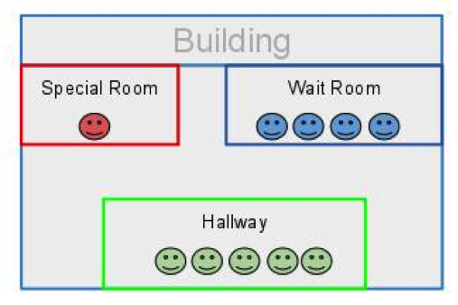
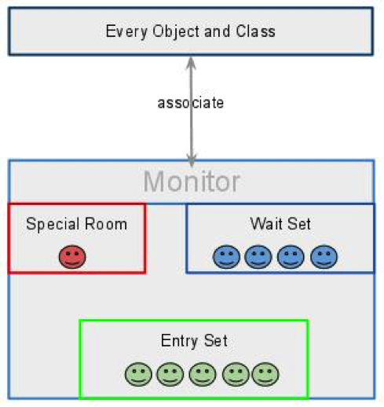
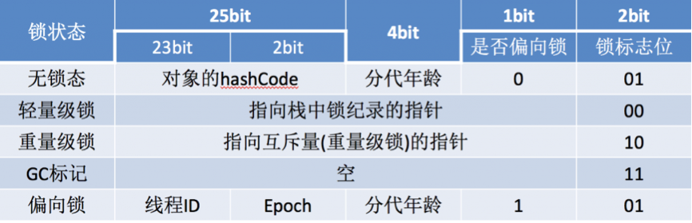
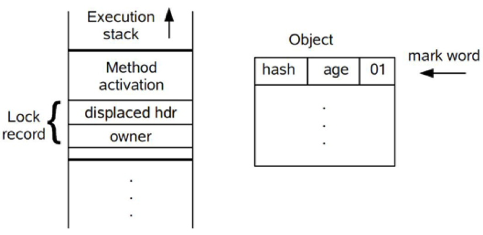
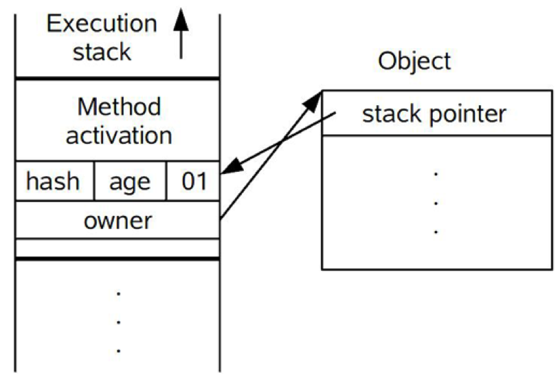
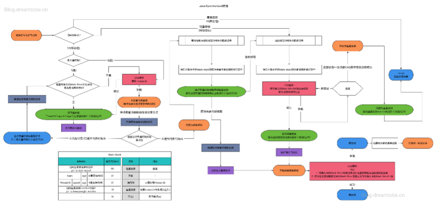
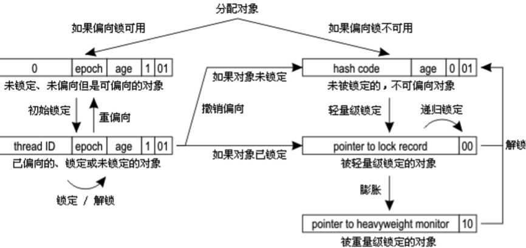

# 1、重量级锁

内置锁是JVM提供的最便捷的线程同步工具，利用`synchronized`关键字来修饰同步代码块，我们称这种锁为java的**内置锁**（intrinsic lock）或者**监视器锁**（monitor lock）。

## 1.1 监视器模型

首先要明确的一点是，监视器模型不是Java特有的，它是操作系统层次的概念，是为了实现线程同步而采取的技术手段，任何编程语言的并发设计中都可以出现这个概念。

JVM会为每个对象分配一个`monitor`，而同时只能有一个线程可以获得该对象`monitor`的所有权。在线程进入时通过`monitorenter`尝试取得对象`monitor`所有权，退出时通过monitorexit释放对象`monitor`所有权。
`monitorenter`与`monitorexit`在编译后对称插入代码。

- **monitorenter**: 被插入到同步代码块之前。
- **monitorexit**: 被插到同步代码块之后或异常处。

监视器可以看做是经过特殊布置的建筑，这个建筑有一个特殊的房间，该房间通常包含一些数据和代码，但是一次只能一个消费者使用此房间。



当一个消费者(线程)使用了这个房间，首先他必须到一个大厅(Entry Set)等待，调度程序将基于某些标准(e.g. FIFO)将从大厅中选择一个消费者(线程)，进入特殊房间，如果这个线程因为某些原因被“挂起”，它将被调度程序安排到“等待房间”，并且一段时间之后会被重新分配到特殊房间，按照上面的线路，这个建筑物包含三个房间，分别是“特殊房间”、“大厅”以及“等待房间”。



简单来说，监视器用来监视线程进入这个特别房间，它确保同一时间只能有一个线程可以访问特殊房间中的数据和代码。

那么，锁和监视器有什么区别？

一言以蔽之，**锁为实现监视器提供必要的支持的，监视器是比锁更高层次的抽象**。

锁是存在于对象内部的数据结构，监视器是一个独立的结构，但是和对象关联。另外，监视器是操控线程的，它会维持一个代码数据区和线程队列等，保证同一时刻只有一个线程访问代码数据区。

## 1.2 重量级锁的局限性

java的线程是映射到操作系统原生线程之上的，如果要阻塞或唤醒一个线程就需要操作系统介入，需要在户态与核心态之间切换，这种切换会消耗大量的系统资源，因为用户态与内核态都有各自专用的内存空间，专用的寄存器等，用户态切换至内核态需要传递给许多变量、参数给内核，内核也需要保护好用户态在切换时的一些寄存器值、变量等，以便内核态调用结束后切换回用户态继续工作。

如果线程状态切换是一个高频操作时，这将会消耗很多CPU处理时间；此外，获取锁挂起操作消耗的时间往往比用户代码执行的时间还要长，这种同步策略显然非常糟糕的。

`synchronized`会导致争用不到锁的线程进入阻塞状态，所以被称为“重量级锁”。

jvm的研究人员在花费了大量的精力去实现各种锁优化技术，如**适应性自旋**（Adaptive Spinning）、**锁削除**（Lock Elimination）、**锁粗化**（Lock Coarsening）、**轻量级锁**（Lightweight Locking）、**偏向锁**（Biased Locking）等，这些技术都是为了在线程之间更高效地共享数据，以及解决竞争问题，从而提高程序的执行效率。

# 2、自旋锁

## 2.1 实现原理

重量级锁的成本非常高，而且不容易优化。同时，虚拟机的开发团队也注意到在许多应用上，共享数据的锁定状态只会持续很短的一段时间，为了这段时间去挂起和恢复线程并不值得。如果物理机器有一个以上的处理器，能让两个或以上的线程同时并行执行，我们就可以让后面请求锁的那个线程“稍等一会”，但不放弃处理器的执行时间，看看持有锁的线程是否很快就会释放锁。为了让线程等待，我们只须让线程执行一个忙循环（自旋），这项技术就是所谓的**自旋锁**。

那么，对于竞争这些锁的而言，因为锁阻塞造成线程切换的时间与锁持有的时间相当，减少线程阻塞造成的线程切换，能得到较大的性能提升。具体如下：

- 当前线程竞争锁失败时，打算阻塞自己
- 不直接阻塞自己，而是自旋（空等待，比如一个空的有限for循环）一会
- 在自旋的同时重新竞争锁
- 如果自旋结束前获得了锁，那么锁获取成功；否则，自旋结束后阻塞自己

如果在自旋的时间内，锁就被旧owner释放了，那么当前线程就不需要阻塞自己（也不需要在未来锁释放时恢复），减少了一次线程切换。

“锁的持有时间比较短”这一条件可以放宽。实际上，只要锁竞争的时间比较短（比如线程1快释放锁的时候，线程2才会来竞争锁），就能够提高自旋获得锁的概率。这通常发生在锁持有时间长，但竞争不激烈的场景中。

## 2.2 自适应自旋

自旋锁在JDK 1.4.2中就已经引入，只不过默认是关闭的，可以使用`-XX:+UseSpinning`参数来开启，在JDK 1.6中就已经改为默认开启了。

但是，**自旋等待不能代替阻塞**。

首先，单核处理器上，不存在实际的并行，当前线程不阻塞自己的话，旧owner就不能执行，锁永远不会释放，此时不管自旋多久都是浪费；进而，如果线程多而处理器少，自旋也会造成不少无谓的浪费。

其次，自旋锁要占用CPU，如果是计算密集型任务，这一优化通常得不偿失，减少锁的使用是更好的选择。

如果锁竞争的时间比较长，那么自旋通常不能获得锁，白白浪费了自旋占用的CPU时间。因此自旋等待的时间必须要有一定的限度，如果自旋超过了限定的次数仍然没有成功获得锁，就应当使用传统的方式去挂起线程了。自旋次数的默认值是10次，用户可以使用参数`-XX:PreBlockSpin来更改`（JDK1.7后，去掉此参数，由jvm控制）；

在JDK 1.6中引入了自适应的自旋锁。自适应意味着自旋的时间不再固定了，而是由前一次在同一个锁上的自旋时间及锁的拥有者的状态来决定。如果在同一个锁对象上，自旋等待刚刚成功获得过锁，并且持有锁的线程正在运行中，那么虚拟机就会认为这次自旋也很有可能再次成功，进而它将允许自旋等待持续相对更长的时间，比如100个循环。另一方面，如果对于某个锁，自旋很少成功获得过，那在以后要获取这个锁时将可能省略掉自旋过程，以避免浪费处理器资源。

然而，自适应自旋也没能彻底解决该问题，如果默认的自旋次数设置不合理（过高或过低），那么自适应的过程将很难收敛到合适的值。

# 3、轻量级锁

自旋锁的目标是降低线程切换的成本。如果锁竞争激烈，我们不得不依赖于重量级锁，让竞争失败的线程阻塞；如果完全没有实际的锁竞争，那么申请重量级锁都是浪费的。轻量级锁的目标是，减少无实际竞争情况下，使用重量级锁产生的性能消耗，包括系统调用引起的内核态与用户态切换、线程阻塞造成的线程切换等。

顾名思义，轻量级锁是相对于重量级锁而言的。使用轻量级锁时，不需要申请互斥量，仅仅将Mark Word中的部分字节CAS更新指向线程栈中的Lock Record，如果更新成功，则轻量级锁获取成功，记录锁状态为轻量级锁；否则，说明已经有线程获得了轻量级锁，目前发生了锁竞争（不适合继续使用轻量级锁），接下来膨胀为重量级锁。

当然，由于轻量级锁天然瞄准不存在锁竞争的场景，如果存在锁竞争但不激烈，仍然可以用自旋锁优化，自旋失败后再膨胀为重量级锁。

# 4、偏向锁

在没有实际竞争的情况下，还能够针对部分场景继续优化。如果不仅仅没有实际竞争，自始至终，使用锁的线程都只有一个，那么，维护轻量级锁都是浪费的。偏向锁的目标是，减少无竞争且只有一个线程使用锁的情况下，使用轻量级锁产生的性能消耗。轻量级锁每次申请、释放锁都至少需要一次CAS，但偏向锁只有初始化时需要一次CAS。

“**偏向**”的意思是，偏向锁假定将来只有第一个申请锁的线程会使用锁（不会有任何线程再来申请锁），因此，只需要在Mark Word中CAS记录owner（本质上也是更新，但初始值为空），如果记录成功，则偏向锁获取成功，记录锁状态为偏向锁，以后当前线程等于owner就可以零成本的直接获得锁；否则，说明有其他线程竞争，膨胀为轻量级锁。需要注意的是，**撤销偏向锁的时候会会导致进入安全点，安全点会导致STW**，导致性能下降。

偏向锁无法使用自旋锁优化，因为一旦有其他线程申请锁，就破坏了偏向锁的假定。

偏向锁可以提高带有同步但无竞争的程序性能，但是它并不一定总是对程序运行有利，如果程序中大多数的锁都总是被多个不同的线程访问，那偏向模式就是多余的。在具体问题具体分析的前提下，有时候使用参数`-XX:-UseBiasedLocking`来禁止偏向锁优化反而可以提升性能。

# 5、锁剔除与锁粗化

**锁削除**是指虚拟机即时编译器在运行时，对一些代码上要求同步，但是被检测到不可能存在共享数据竞争的锁进行削除。锁削除的主要判定依据来源于逃逸分析的数据支持，如果判断到一段代码中，在堆上的所有数据都不会逃逸出去被其他线程访问到，那就可以把它们当作栈上数据对待，认为它们是线程私有的，同步加锁自然就无须进行。 

但是程序员自己应该是很清楚的，怎么会在明知道不存在数据争用的情况下要求同步呢？答案是有许多同步措施并不是程序员自己加入的，同步的代码在Java程序中的普遍程度也许超过了我们的想象。

我们来看看下面的例子，这段非常简单的代码仅仅是输出三个字符串相加的结果，无论是源码字面上还是程序语义上都没有同步。 

```java
	public String concatString(String s1, String s2, String s3) {

		return s1 + s2 + s3;

	}
```

我们也知道，由于`String`是一个不可变的类，对字符串的连接操作总是通过生成新的`String`对象来进行的，因此Javac编译器会对String连接做自动优化。在JDK 1.5之前，会转化为`StringBuffer`对象的连续`append()`操作，在JDK 1.5及以后的版本中，会转化为`StringBuilder`对象的连续`append()`操作。

```java
	public String concatString(String s1, String s2, String s3) {
		StringBuffer sb = new StringBuffer();
		sb.append(s1);
		sb.append(s2);
		sb.append(s3);
		return sb.toString();
	}
```

现在大家还认为这段代码没有涉及同步吗？每个`StringBuffer.append()`方法中都有一个同步块，锁就是`sb`对象。虚拟机观察变量`sb`，很快就会发现它的动态作用域被限制在`concatString()`方法内部。也就是`sb`的所有引用永远不会“逃逸”到`concatString()`方法之外，其他线程无法访问到它，所以这里虽然有锁，但是可以被安全地削除掉，在即时编译之后，这段代码就会忽略掉所有的同步而直接执行了。 

原则上，我们在编写代码的时候，总是推荐将同步块的作用范围限制得尽量小——只在共享数据的实际作用域中才进行同步，这样是为了使得需要同步的操作数量尽可能变小，如果存在锁竞争，那等待锁的线程也能尽快地拿到锁。 

大部分情况下，上面的原则都是正确的，但是如果一系列的连续操作都对同一个对象反复加锁和解锁，甚至加锁操作是出现在循环体中的，那即使没有线程竞争，频繁地进行互斥同步操作也会导致不必要的性能损耗。 

上面代码中连续的`append()`方法就属于这类情况。如果虚拟机探测到有这样一串零碎的操作都对同一个对象加锁，将会把加锁同步的范围扩展到整个操作序列的外部，就是扩展到第一个`append()`操作之前直至最后一个`append()`操作之后，这样只需要加锁一次就可以了。即为**锁粗化**。

# 6、锁的分配和膨胀过程

## 6.1 对象头

锁的实现与对象头密切相关。

HotSpot虚拟机中，对象在内存中存储的布局可以分为三块区域：

- 对象头（Header）
- 实例数据（Instance Data）
- 对齐填充（Padding）  

HotSpot虚拟机的对象头包括两部分信息。

第一部分用于存储对象自身的运行时数据， 如哈希码（HashCode）、GC分代年龄、锁状态标志、线程持有的锁、偏向线程ID、偏向时间戳等等，这部分数据的长度在32位和64位的虚拟机（暂不考虑开启压缩指针的场景）中分别为32个和64个Bits，官方称它为“**Mark Word**”。

对象需要存储的运行时数据很多，其实已经超出了32、64位Bitmap结构所能记录的限度，但是对象头信息是与对象自身定义的数据无关的额外存储成本，考虑到虚拟机的空间效率，`Mark Word`被设计成一个非固定的数据结构以便在极小的空间内存储尽量多的信息，它会根据对象的状态复用自己的存储空间。例如在32位的HotSpot虚拟机 中对象未被锁定的状态下，`Mark Word`的32个Bits空间中的25Bits用于存储对象哈希码（HashCode），4Bits用于存储对象分代年龄，2Bits用于存储锁标志 位，1Bit固定为0，在其他状态（轻量级锁定、重量级锁定、GC标记、可偏向）下对象的存储内容如下表所示。 




对象头的另外一部分是类型指针，即是对象指向它的类的元数据的指针，虚拟机通过这个指针来确定这个对象是哪个类的实例。并不是所有的虚拟机实现都必须在对象数据上保留类型指针，换句话说查找对象的元数据信息并不一定要经过对象本身。另外，如果对象是一个Java数组，那在对象头中还必须有一块用于记录数组长度的数据，因为虚拟机可以通过普通Java对象的元数据信息确定Java对象的大小，但是从数组的元数据中无法确定数组的大小。 

这里要特别关注的是锁标志位，**锁标志位与是否偏向锁对应到唯一的锁状态**。

锁的状态总共有四种：

- 无锁状态
- 偏向锁
- 轻量级锁
- 重量级锁

随着锁的竞争，锁可以从偏向锁升级到轻量级锁，再升级的重量级锁，但是锁的升级是单向的，也就是说**只能从低到高升级，不会出现锁的降级**。

## 6.2 偏向锁实现原理

偏向锁获取过程：

- 访问`Mark Word中`偏向锁的标识是否设置成1，锁标志位是否为01——确认为可偏向状态。
- 如果为可偏向状态，则测试线程ID是否指向当前线程，如果是，进入步骤（5），否则进入步骤（3）。
- 如果线程ID并未指向当前线程，则通过CAS操作竞争锁。如果竞争成功，则将`Mark Word`中线程ID设置为当前线程ID，然后执行（5）；如果竞争失败，执行（4）。
- 如果CAS获取偏向锁失败，则表示有竞争。当到达**全局安全点**（safepoint）时获得偏向锁的线程被挂起，偏向锁升级为轻量级锁，然后被阻塞在安全点的线程继续往下执行同步代码。
- 执行同步代码。

偏向锁的撤销在上述第四步骤中有提到。偏向锁只有遇到其他线程尝试竞争偏向锁时，持有偏向锁的线程才会释放锁，线程不会主动去释放偏向锁。偏向锁的撤销，需要等待全局安全点（在这个时间点上没有字节码正在执行），它会首先暂停拥有偏向锁的线程，判断锁对象是否处于被锁定状态，撤销偏向锁后恢复到未锁定（标志位为“01”）或轻量级锁（标志位为“00”）的状态。

## 6.3 轻量级锁实现原理

轻量级锁获取过程：

- 在代码进入同步块的时候，如果同步对象锁状态为无锁状态（锁标志位为“01”状态，是否为偏向锁为“0”），虚拟机首先将在当前线程的栈帧中建立一个名为**锁记录**（Lock Record）的空间，用于存储锁对象目前的Mark Word的拷贝，官方称之为 `Displaced Mark Word`。这时候线程堆栈与对象头的状态如下图所示。

  

- 拷贝对象头中的`Mark Word`复制到锁记录中。

- 拷贝成功后，虚拟机将使用CAS操作尝试将对象的`Mark Word`更新为指向`Lock Record`的指针，并将`Lock record`里的owner指针指向`object mark word`。如果更新成功，则执行步骤（4），否则执行步骤（5）。

- 如果这个更新动作成功了，那么这个线程就拥有了该对象的锁，并且对象Mark Word的锁标志位设置为“00”，即表示此对象处于轻量级锁定状态，这时候线程堆栈与对象头的状态如下图所示。

  

- 如果这个更新操作失败了，虚拟机首先会检查对象的`Mark Word`是否指向当前线程的栈帧，如果是就说明当前线程已经拥有了这个对象的锁，那就可以直接进入同步块继续执行。否则说明多个线程竞争锁，轻量级锁就要膨胀为重量级锁，锁标志的状态值变为“10”，`Mark Word`中存储的就是指向重量级锁（互斥量）的指针，后面等待锁的线程也要进入阻塞状态。 而当前线程便尝试使用自旋来获取锁，自旋就是为了不让线程阻塞，而采用循环去获取锁的过程。

上面描述的是轻量级锁的加锁过程，它的解锁过程也是通过CAS操作来进行的，如果对象的`Mark Word`仍然指向着线程的锁记录，那就用CAS操作把对象当前的`Mark Word`和线程中复制的`Displaced Mark Word`替换回来，如果替换成功，整个同步过程就完成了。如果替换失败，说明有其他线程尝试过获取该锁，那就要在释放锁的同时，唤醒被挂起的线程。 

轻量级锁能提升程序同步性能的依据是“**对于绝大部分的锁，在整个同步周期内都是不存在竞争的**”，这是一个经验数据。如果没有竞争，轻量级锁使用CAS操作避免了使用互斥量的开销，但如果存在锁竞争，除了互斥量的开销外，还额外发生了CAS操作，因此在有竞争的情况下，轻量级锁会比传统的重量级锁更慢。

## 6.4 重量级锁、轻量级锁和偏向锁之间转换

详细版：




简化版：

 