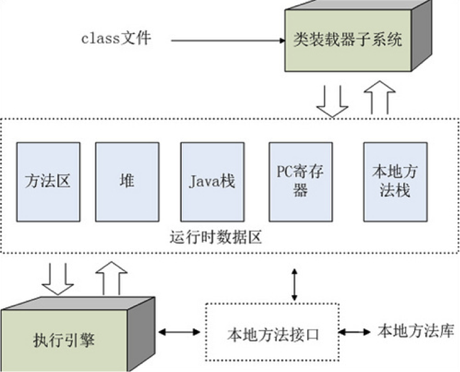

# 1、JVM是什么

JVM全称是**Java Virtual Machine**(java虚拟机)。它之所以被称之为是“虚拟”的，就是因为它仅仅是由一个规范来定义的抽象计算机。我们平时经常使用的Sun HotSpot虚拟机只是其中一个具体的实现(另外还有BEA JRockit、IBM J9等等虚拟机)。

JVM的设计目标是提供一个基于抽象规格描述的计算机模型，为解释程序开发人员提供很好的灵活性，同时也确保Java代码可在符合该规范的任何系统上运行。JVM对其实现的某些方面给出了具体的定义，特别是对Java可执行代码，即字节码（Bytecode）的格式给出了明确的规格。这一规格包括操作码和操作数的语法和数值、标识符的数值表示方式、以及Java类文件中的Java对象、常量缓冲池在JVM的存储映象。这些定义为JVM解释器开发人员提供了所需的信息和开发环境。Java的设计者希望给开发人员以随心所欲使用Java的自由。

JVM是java的核心和基础，在java编译器和os平台之间的虚拟处理器。它是一种基于下层的操作系统和硬件平台并利用软件方法来实现的抽象的计算机，可以在上面执行java的字节码程序。

# 2、JRE/JDK/JVM是什么关系

**JRE**(JavaRuntimeEnvironment，Java运行环境)，也就是Java平台。所有的Java 程序都要在JRE下才能运行。普通用户只需要运行已开发好的java程序，安装JRE即可。

**JDK**(Java Development Kit)是程序开发者用来来编译、调试java程序用的开发工具包。JDK的工具也是Java程序，也需要JRE才能运行。为了保持JDK的独立性和完整性，在JDK的安装过程中，JRE也是 安装的一部分。所以，在JDK的安装目录下有一个名为jre的目录，用于存放JRE文件。

**JVM**(JavaVirtualMachine，Java虚拟机)是JRE的一部分。它是一个虚构出来的计算机，是通过在实际的计算机上仿真模拟各种计算机功能来实现的。JVM有自己完善的硬件架构，如处理器、堆栈、寄存器等，还具有相应的指令系统。Java语言最重要的特点就是跨平台运行。使用JVM就是为了支持与操作系统无关，实现跨平台。

# 3、JVM的生命周期

当启动一个Java程序时，一个虚拟机实例也就诞生了。当该程序关闭退出，这个虚拟机实例也就随之消亡。如果在同一台计算机上同时运行三个Java程序，将得到三个Java虚拟机实例。每个Java程序都运行于它自己的Java虚拟机实例中。

**JVM**实例对应了一个独立运行的java程序，它是进程级别。

## 3.1、启动

启动一个Java程序时，一个JVM实例就产生了，任何一个拥有`public static void main(String[] args)`函数的class都可以作为JVM实例运行的起点

## 3.2、运行

main()作为该程序初始线程的起点，任何其他线程均由该线程启动。JVM内部有两种线程：守护线程和非守护线程，main()属于非守护线程，守护线程通常由JVM自己使用，java程序也可以标明自己创建的线程是守护线程

## 3.3、消亡

当程序中的所有非守护线程都终止时，JVM才退出；若安全管理器允许，程序也可以使用Runtime类或者`System.exit()`来退出

# 4、JVM运行原理

操作系统装入JVM是通过jdk中java.exe来完成，通过下面4步来完成JVM环境。 

## 4.1、JVM装入环境

JVM提供的方式是操作系统的动态连接文件。既然是文件那就存在一个装入路径的问题，Java是怎么找这个路径的呢？下面基于Windows的实现的分析。

首先查找jre路径，Java是通过GetApplicationHome api来获得当前的Java.exe绝对路径，c:\jdk1.7.0_45\bin\Java.exe，然后截取到绝对路径c:\jdk1.7.0_45\，判断c:\jdk1.7.0_45\bin\Java.dll文件是否存在，如果存在就把c:\jdk1.7.0_45\作为jre路径，如果不存在则判断c:\jdk1.7.0_45\jre\bin\Java.dll是否存在，如果存在这c:\jdk1.7.0_45\jre作为jre路径，如果不存在调用GetPublicJREHome查HKEY_LOCAL_MACHINE\Software\JavaSoft\Java Runtime Environment\“当前JRE版本号”\JavaHome的路径为jre路径。

然后装载JVM.cfg文件。在我们的jdk目录中jre\bin\server和jre\bin\client都有JVM.dll文件存在，而Java正是通过JVM.cfg配置文件来管理这些不同版本的JVM.dll的。 

最后获得JVM.dll的路径，JRE路径+\bin+\JVM类型字符串+\JVM.dll就是JVM的文件路径了，但是如果在调用Java程序时用-XXaltJVM=参数指定的路径path,就直接用path+\JVM.dll文件做为JVM.dll的文件路径。

## 4.2、装载JVM.dll

通过第一步已经找到了JVM的路径，Java通过LoadJavaVM来装入JVM.dll文件。装入工作很简单，就是调用Windows API函数：

LoadLibrary装载JVM.dll动态连接库．然后把JVM.dll中的导出函数JNI_CreateJavaVM和JNI_GetDefaultJavaVMInitArgs挂接到InvocationFunctions变量的CreateJavaVM和GetDefaultJavaVMInitArgs函数指针变量上。JVM.dll的装载工作宣告完成。 

## 4.3、初始化JVM

挂接到**JNIENV**(JNI调用接口)实例，获得本地调用接口，这样就可以在Java中调用JVM的函数了。调用InvocationFunctions－>CreateJavaVM也就是JVM中JNI_CreateJavaVM方法获得JNIEnv结构的实例。 

## 4.4、运行Java程序

Java程序有两种方式一种是jar包，一种是class。运行jar（Java -jar XXX.jar）的时候，Java.exe调用GetMainClassName函数，该函数先获得JNIEnv实例然后调用Java类Java.util.jar.JarFileJNIEnv中方法getManifest()并从返回的Manifest对象中取getAttributes("Main-Class")的值即jar包中文件：META-INF/MANIFEST.MF指定的Main-Class的主类名作为运行的主类。之后main函数会调用Java.c中LoadClass方法装载该主类（使用JNIEnv实例的FindClass）。main函数直接调用Java.c中LoadClass方法装载该类。如果是执行class方法。main函数直接调用Java.c中LoadClass方法装载该类。

然后main函数调用JNIEnv实例的GetStaticMethodID方法查找装载的class主类中“public static void main(String[] args)”方法，并判断该方法是否为public方法，然后调用JNIEnv实例的CallStaticVoidMethod方法调用该Java类的main方法。

# 5、JVM体系结构

JVM的体系结构图如下：

主要包括两个子系统和两个组件： Class loader(类装载器) 子系统，Execution engine(执行引擎) 子系统；Runtime data area (运行时数据区域)组件， Native interface(本地接口)组件。

- **Class loader**子系统：根据给定的全限定名类名(如 java.lang.Object)来装载class文件的内容到 Runtime data area中的method area(方法区域)。
- **Execution engine**子系统：执行classes中的指令。方法的字节码是由Java虚拟机的指令序列构成的。每一条指令包含一个单字节的操作码，后面跟随0个或多个操作数。执行引擎执行字节码时，首先取得一个操作码，如果操作码有操作数，取得它的操作数。它执行操作码和跟随的操作数规定的动作，然后再取得下一个操作码。这个执行字节码的过程在线程完成前将一直持续。任何JVM实现的核心是Execution engine， 换句话说：Sun 的JDK 和IBM的JDK好坏主要取决于他们各自实现的Execution engine的好坏。
- **Native interface**组件 ：与native libraries交互，是其它编程语言交互的接口。Java里声明为native的方法多数在jdk/src/<platform>/native里可以找到。其中<platform>可以是share，也就是平台中立的代码；也可以是某个具体平台。这个native目录里的结构跟Java源码结构一样是按包名来组织的。不过需要提醒的是，这些native方法不是“JVM”的，是“类库”的，不在JVM里面。
- **Runtime data area** 组件：虚拟机定义了若干种程序运行时使用到的运行时数据区，有一些是随虚拟机的启动而创建，随虚拟机的退出而销毁，如堆、方法区。第二种则是与线程一一对应，随线程的开始和结束而创建和销毁，如栈，寄存器。