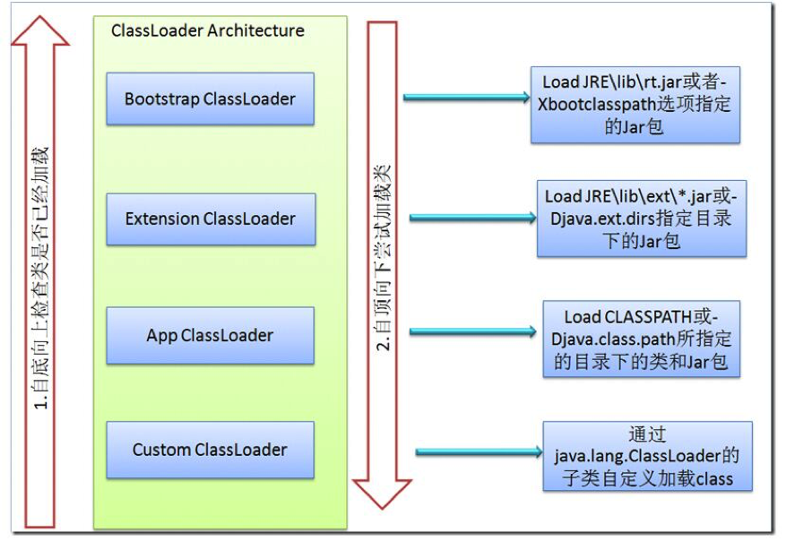

# 1、ClassLoader

Java程序并不是一个原生的可执行文件，而是由许多独立的类文件组成，每一个文件对应一个Java类。此外，这些类文件并非立即全部装入内存的，而是根据程序需要装入内存。ClassLoader专门负责类文件装入到内存。

**数组类的 Class** **对象不是由类加载器创建的**，而是由 Java 运行时根据需要自动创建。数组类的类加载器由 Class.getClassLoader() 返回，该加载器与其元素类型的类加载器是相同的；如果该元素类型是基本类型，则该数组类没有类加载器。

从上图我们就可以看出类加载器之间的父子关系(注意**不是类的集继承关系**)。

- **Bootstrap ClassLoader**：BootStrap 是最顶层的类加载器，它是由C++编写并且已经内嵌到JVM中了，主要用来读取Java的核心类库JRE/lib/rt.jar。
- **Extension ClassLoader**：负责加载java平台中扩展功能的一些jar包，包括$JAVA_HOME中jre/lib/*.jar或-Djava.ext.dirs指定目录下的jar包
- **App ClassLoader**（System ClassLoader）：负责记载classpath中指定的jar包及目录中class
- **Custom ClassLoader**：属于应用程序根据自身需要自定义的ClassLoader，如tomcat、jboss都会根据j2ee规范自行实现ClassLoader

 JVM有四种类型的类加载器，即java是如何区分一个类该由哪个类加载器来完成呢？

在这里java采用了**委托模型机制**，这个机制简单来讲，就是“类装载器有载入类的需求时，会先请示其Parent使用其搜索路径帮忙载入，如果Parent 找不到，那么才由自己依照自己的搜索路径搜索类”。具体流程如下：

- "A类加载器"加载类时，先判断该类是否已经加载过了；

- 如果还未被加载，则首先委托其"A类加载器"的"父类加载器"去加载该类，这是一个向上不断搜索的过程，当A类所有的"父类加载器"(包括bootstrap classloader)都没有加载该类，则回到发起者"A类加载器"去加载；

- 如果还加载不了，则抛出ClassNotFoundException。

  

ClassLoader抽象类的几个关键方法如下：

- **loadClass()**
  此方法负责加载指定名字的类，ClassLoader的实现方法为先从已经加载的类中寻找，如没有则继续从parent ClassLoader中寻找，如仍然没找到，则从System ClassLoader中寻找，最后再调用findClass方法来寻找，如要改变类的加载顺序，则可覆盖此方法
- **findLoadedClass()**
  此方法负责从当前ClassLoader实例对象的缓存中寻找已加载的类，调用的为native的方法。
- **findClass()**
  此方法直接抛出ClassNotFoundException，因此需要通过覆盖loadClass或此方法来以自定义的方式加载相应的类。
- **findSystemClass()**
  此方法负责从System ClassLoader中寻找类，如未找到，则继续从Bootstrap ClassLoader中寻找，如仍然为找到，则返回null。
- **defineClass()**
  此方法负责将二进制的字节码转换为Class对象
- **resolveClass()**
  此方法负责完成Class对象的链接，如已链接过，则会直接返回。

 

`Class.forName()`与`ClassLoader.loadClass()`都可以通过一个给定的类名去定位和加载这个类名对应的 java.long.Class 类对象，区别如下：

**Class.forName()会对类初始化，而loadClass()只会装载或链接**。ClassLoader.loadClass()加载的类对象是在第一次被调用时才进行初始化的。可以利用上述的差异。比如，要加载一个静态初始化开销很大的类，就可以选择提前加载该类(以确保它在classpath下)，但不进行初始化，直到第一次使用该类的域或方法时才进行初始化

`Class.forName(String) `方法(只有一个参数)，使用调用者的类加载器来加载, 也就是用加载了调用forName方法的代码的那个类加载器。当然，它也有个重载的方法，可以指定加载器。相应的，`ClassLoader.loadClass()`方法是一个实例方法(非静态方法)调用时需要自己指定类加载器, 那么这个类加载器就可能是也可能不是加载调用代码的类加载器（调用代码类加载器通getClassLoader0()获得）。

# 2、类的加载过程

类的加载要经过三步：**装载**（Load），**链接**（Link），**初始化**（Initializ）。其中链接又可分为**校验**（Verify），**准备**（Prepare），**解析**（Resolve）三步。

## 2.1 加载

ClassLoader就是用来装载的。通过指定的className，找到二进制码，生成Class实例，放到JVM中。

在加载阶段，虚拟机需要完成以下三件事（虚拟机规范对这三件事的要求并不具体，因此虚拟机实现与具体应用的灵活度相当大）：

- 通过一个类的全限定名获取定义这个类的二进制流。可以从jar包、ear包、war包中获取，可以从网络中获取（Applet），可以运行时生成（动态代理），可以通过其它文件生成（Jsp）等。

- 将这个字节流代表的静态存储结构转化为方法区的运行时数据结构。

- 在Java堆中生成一个代表这个类的java.lang.Class对象，作为方法区这些数据的访问入口。

## 2.2 链接

链接就是把load进来的class合并到JVM的运行时状态中。可以把它分成三个主要阶段：

**校验：**对二进制字节码的格式进行校验，以确保格式正确、行为正确。这一阶段主要是为了确保Class文件的字节流中包含的信息复合当前虚拟机的要求，并且不会危害虚拟机自身的安全。主要验证过程包括：

- 文件格式验证：验证字节流文件是否符合Class文件格式的规范，并且能被当前虚拟机正确的处理。

- 元数据验证：是对字节码描述的信息进行语义分析，以保证其描述的信息符合Java语言的规范。

- 字节码验证：主要是进行数据流和控制流的分析，保证被校验类的方法在运行时不会危害虚拟机。

- 符号引用验证：符号引用验证发生在虚拟机将符号引用转化为直接引用的时候，这个转化动作将在解析阶段中发生。

**准备：**准备类中定义的字段、方法和实现接口所必需的数据结构。比如会为类中的静态变量赋默认值(int等:0, reference:null, char:'\u0000')。

准备阶段正式为类变量分配内存并设置初始值。这里的初始值并不是初始化的值，而是数据类型的默认零值。这里提到的类变量是被static修饰的变量，而不是实例变量。关于准备阶段为类变量设置零值的唯一例外就是当这个类变量同时也被final修饰，那么在编译时，就会直接为这个常量赋上目标值。

如：

`pirvate static int size = 12;`

那么在这个阶段，size的值为0，而不是12。 final修饰的类变量将会赋值成真实的值。

**解析：**装入类所引用的其他所有类，虚拟机将常量池中的符号引用替换为直接引用。可以用许多方式引用类：超类、接口、字段、方法签名、方法中使用的本地变量。

## 2.3 初始化

在准备阶段，变量已经赋过一次系统要求的初始值，在初始化阶段，则是根据程序员通过程序的主观计划区初始化类变量和其他资源。

类初始化前，它的直接父类一定要先初始化（递归），但它实现的接口不需要先被初始化。类似的，接口在初始化前，父接口不需要先初始化。

有且只有4种情况必须立即对类进行初始化：

- 遇到new（使用new关键字实例化对象）、getstatic（获取一个类的静态字段，final修饰符修饰的静态字段除外）、putstatic（设置一个类的静态字段，final修饰符修饰的静态字段除外）和invokestatic（调用一个类的静态方法）这4条字节码指令时，如果类还没有初始化，则必须首先对其初始化

- 使用java.lang.reflect包中的方法对类进行反射调用时，如果类还没有初始化，则必须首先对其初始化

- 当初始化一个类时，如果其父类还没有初始化，则必须首先初始化其父类

- 当虚拟机启动时，需要指定一个主类（main方法所在的类），虚拟机会首选初始化这个主类

除了上面这4种方式，所有引用类的方式都不会触发初始化，称为被动引用。如：通过子类引用父类的静态字段，不会导致子类初始化；通过数组定义来引用类，不会触发此类的初始化；引用类的静态常量不会触发定义常量的类的初始化，因为常量在编译阶段已经被放到常量池中了。