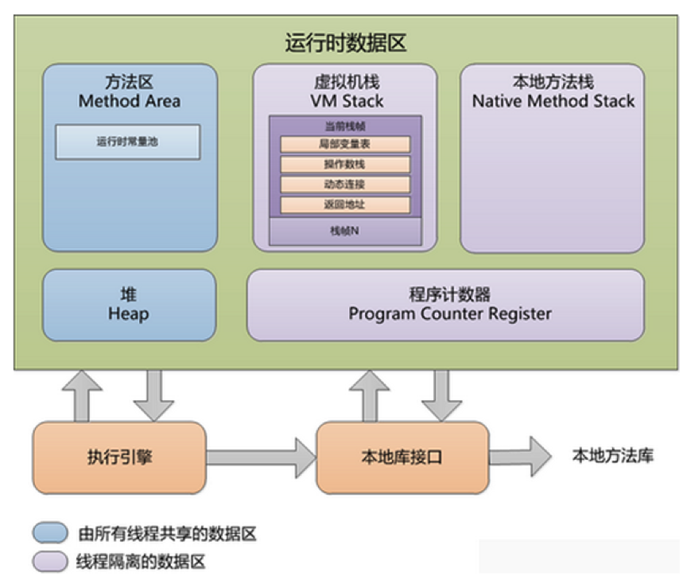
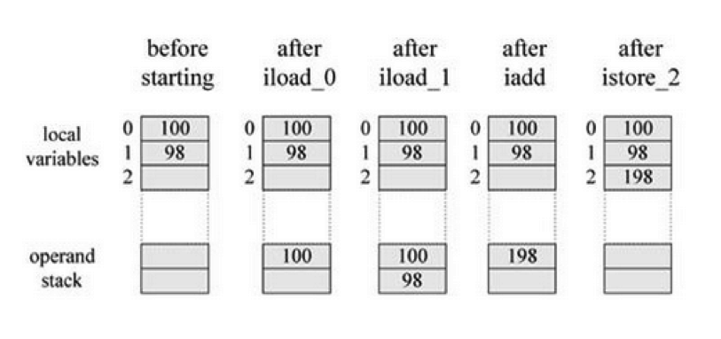
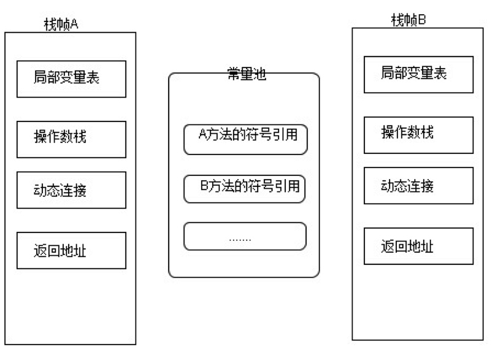
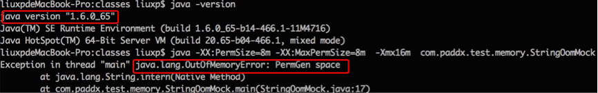
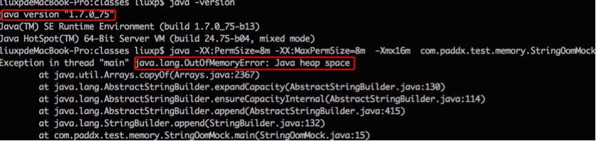
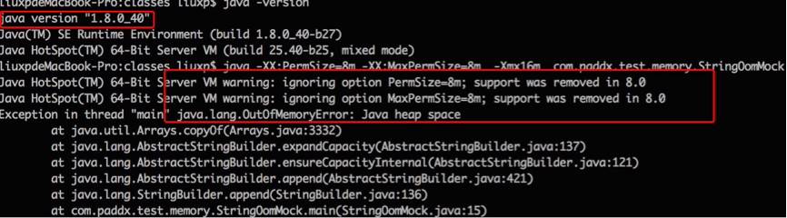
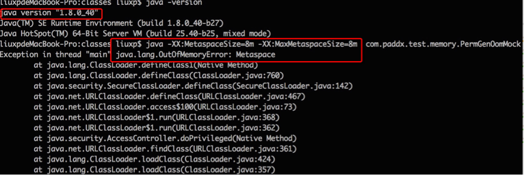

JVM定义了若干个程序执行期间使用的数据区域。这个区域里的一些数据在JVM启动的时候创建，在JVM退出的时候销毁。而其他的数据依赖于每一个线程，在线程创建时创建，在线程退出时销毁。



# 1、程序计数器

程序计数器是一块较小的内存空间，可以看作是当前线程所执行的字节码的行号指示器。分支、循环、跳转、异常处理、线程恢复等基础功能都需要依赖这个计数器来完成。

由于Java 虚拟机的多线程是通过线程轮流切换并分配处理器执行时间的方式来实现的，在任何一个确定的时刻，一个处理器（对于多核处理器来说是一个内核）只会执行一条线程中的指令。因此，为了线程切换后能恢复到正确的执行位置，每条线程都需要有一个独立的程序计数器，各条线程之间的计数器互不影响，独立存储，我们称这类内存区域为“**线程私有**”的内存。

如果线程正在执行的是一个Java 方法，这个计数器记录的是正在执行的虚拟机字节码指令的地址；如果正在执行的是Natvie 方法，这个计数器值则为空（Undefined）。

**此内存区域是唯一一个在Java** **虚拟机规范中没有规定任何OutOfMemoryError** **情况的区域。**

# 2、虚拟机栈

线程私有，它的生命周期与线程相同。虚拟机栈描述的是Java 方法执行的内存模型：**每个方法被执行的时候都会同时创建一个栈帧（****Stack Frame****）用于存储局部变量表、操作栈、动态链接、方法出口等信息**。

动画是由一帧一帧图片连续切换结果的结果而产生的，其实虚拟机的运行和动画也类似，每个在虚拟机中运行的程序也是由许多的帧的切换产生的结果，只是这些帧里面存放的是方法的局部变量，操作数栈，动态链接，方法返回地址和一些额外的附加信息组成。每一个方法被调用直至执行完成的过程，就对应着一个栈帧在虚拟机栈中从入栈到出栈的过程。

对于执行引擎来说，活动线程中，只有栈顶的栈帧是有效的，称为**当前栈帧**，这个栈帧所关联的方法称为**当前方法**。**执行引擎所运行的所有字节码指令都只针对当前栈帧进行操作**。

## 2.1 局部变量表

局部变量表是一组变量值存储空间，**用于存放方法参数和方法内部定义的局部变量**。在Java程序被编译成Class文件时，就在方法的Code属性的max_locals数据项中确定了该方法所需要分配的最大局部变量表的容量。

局部变量表的容量以**变量槽**（Slot）为最小单位，32位虚拟机中一个Slot可以存放一个32位以内的数据类型（boolean、byte、char、short、int、float、reference和returnAddress八种）。

reference类型虚拟机规范没有明确说明它的长度，但一般来说，虚拟机实现至少都应当能从此引用中直接或者间接地查找到对象在Java堆中的起始地址索引和方法区中的对象类型数据。

returnAddress类型是为字节码指令jsr、jsr_w和ret服务的，它指向了一条字节码指令的地址。

**虚拟机是使用局部变量表完成参数值到参数变量列表的传递过程的**，如果是实例方法（非static），那么局部变量表的第0位索引的Slot默认是用于传递方法所属对象实例的引用，在方法中通过this访问。

 Slot是可以重用的，当Slot中的变量超出了作用域，那么下一次分配Slot的时候，将会覆盖原来的数据。Slot对对象的引用会影响GC（要是被引用，将不会被回收）。

 **系统不会为局部变量赋予初始值（实例变量和类变量都会被赋予初始值）**。也就是说不存在类变量那样的准备阶段。

## 2.2 操作数栈

和局部变量区一样，操作数栈也是被组织成一个以字长为单位的数组。但是和前者不同的是，它不是通过索引来访问，而是通过标准的栈操作——压栈和出栈—来访问的。比如，如果某个指令把一个值压入到操作数栈中，稍后另一个指令就可以弹出这个值来使用。

虚拟机在操作数栈中存储数据的方式和在局部变量区中是一样的：如int、long、float、double、reference和returnType的存储。对于byte、short以及char类型的值在压入到操作数栈之前，也会被转换为int。

虚拟机把操作数栈作为它的工作区——大多数指令都要从这里弹出数据，执行运算，然后把结果压回操作数栈。比如，iadd指令就要从操作数栈中弹出两个整数，执行加法运算，其结果又压回到操作数栈中，看看下面的示例，它演示了虚拟机是如何把两个int类型的局部变量相加，再把结果保存到第三个局部变量的：

```java
begin

iload_0  // push the int in local variable 0 onto the stack

iload_1  // push the int in local variable 1 onto the stack

iadd    // pop two ints, add them, push result

istore_2  // pop int, store into local variable 2

end
```

在这个字节码序列里，前两个指令iload_0和iload_1将存储在局部变量中索引为0和1的整数压入操作数栈中，其后iadd指令从操作数栈中弹出那两个整数相加，再将结果压入操作数栈。第四条指令istore_2则从操作数栈中弹出结果，并把它存储到局部变量区索引为2的位置。下图详细表述了这个过程中局部变量和操作数栈的状态变化，图中没有使用的局部变量区和操作数栈区域以空白表示。



## 2.3 动态连接

虚拟机运行的时候,运行时常量池会保存大量的符号引用，这些符号引用可以看成是每个方法的间接引用。如果代表栈帧A的方法想调用代表栈帧B的方法，那么这个虚拟机的方法调用指令就会以B方法的符号引用作为参数，但是因为符号引用并不是直接指向代表B方法的内存位置，所以在调用之前还必须要将符号引用转换为直接引用，然后通过直接引用才可以访问到真正的方法。

如果符号引用是在类加载阶段或者第一次使用的时候转化为直接应用，那么这种转换成为**静态解析**，如果是在运行期间转换为直接引用，那么这种转换就成为**动态连接。**



## 2.4 返回地址

​    方法的返回分为两种情况，一种是正常退出，退出后会根据方法的定义来决定是否要传返回值给上层的调用者，一种是异常导致的方法结束，这种情况是不会传返回值给上层的调用方法。

不过无论是那种方式的方法结束，在退出当前方法时都会跳转到当前方法被调用的位置，如果方法是正常退出的，则调用者的PC计数器的值就可以作为返回地址,，果是因为异常退出的，则是需要通过异常处理表来确定。

方法的的一次调用就对应着栈帧在虚拟机栈中的一次入栈出栈操作，因此方法退出时可能做的事情包括：恢复上层方法的局部变量表以及操作数栈，如果有返回值的话，就把返回值压入到调用者栈帧的操作数栈中，还会把PC计数器的值调整为方法调用入口的下一条指令。 

## 2.5 异常

在Java 虚拟机规范中，对虚拟机栈规定了两种异常状况：如果线程请求的栈深度大于虚拟机所允许的深度，将抛出**StackOverflowError** 异常；如果虚拟机栈可以动态扩展（当前大部分的Java 虚拟机都可动态扩展，只不过Java 虚拟机规范中也允许固定长度的虚拟机栈），当扩展时无法申请到足够的内存时会抛出**OutOfMemoryError** 异常。

# 3、本地方法栈

本地方法栈（Native Method Stacks）与虚拟机栈所发挥的作用是非常相似的，其区别不过是虚拟机栈为虚拟机执行Java 方法（也就是字节码）服务，而本地方法栈则是为虚拟机使用到的Native 方法服务。虚拟机规范中对本地方法栈中的方法使用的语言、使用方式与数据结构并没有强制规定，因此具体的虚拟机可以自由实现它。甚至有的虚拟机（譬如**Sun HotSpot** **虚拟机）直接就把本地方法栈和虚拟机栈合二为一**。

与虚拟机栈一样，本地方法栈区域也会抛出StackOverflowError 和OutOfMemoryError异常。

# 4、堆

堆是Java 虚拟机所管理的内存中最大的一块。Java 堆是被所有线程共享的一块内存区域，在虚拟机启动时创建。此内存区域的唯一目的就是存放对象实例，几乎所有的对象实例都在这里分配内存。但是随着JIT 编译器的发展与逃逸分析技术的逐渐成熟，栈上分配、标量替换优化技术将会导致一些微妙的变化发生，所有的对象都分配在堆上也渐渐变得不是那么“绝对”了。

**堆是垃圾收集器管理的主要区域**，因此很多时候也被称做“**GC** **堆**”。

堆的大小可以通过**-Xms(**最小值)和**-Xmx**(最大值)参数设置，-Xms为JVM启动时申请的最小内存，默认为操作系统物理内存的1/64但小于1G，-Xmx为JVM可申请的最大内存，默认为物理内存的1/4但小于1G，默认当空余堆内存小于40%时，JVM会增大Heap到-Xmx指定的大小，可通过-XX:MinHeapFreeRation=来指定这个比列；当空余堆内存大于70%时，JVM会减小heap的大小到-Xms指定的大小，可通过XX:MaxHeapFreeRation=来指定这个比列，对于运行系统，为避免在运行时频繁调整Heap的大小，通常-Xms与-Xmx的值设成一样。

如果从内存回收的角度看，由于现在收集器基本都是采用的分代收集算法，所以Java 堆中还可以细分为：新生代和老年代；

**新生代**：**程序新创建的对象都是从新生代分配内存**，新生代由**Eden Space**和两块相同大小的**Survivor Space**(通常又称S0和S1或From和To)构成，可通过**-Xmn**参数来指定新生代的大小，也可以通过**-XX:SurvivorRation**来调整Eden Space及Survivor Space的大小。

**老年代**：用于存放经过多次新生代GC仍然存活的对象，例如缓存对象，新建的对象也有可能直接进入老年代，主要有两种情况：1、大对象，可通过启动参数设置**-XX:PretenureSizeThreshold**=1024(单位为字节，默 认为0)来代表超过多大时就不在新生代分配，而是直接在老年代分配。2、大的数组对象，且数组中无引用外部对象。

老年代所占的内存大小为-Xmx对应的值减去-Xmn对应的值。 

如果在堆中没有内存完成实例分配，并且堆也无法再扩展时，将会抛出OutOfMemoryError 异常。

# 5、方法区

方法区在一个jvm实例的内部，**类型信息**被存储在一个称为方法区的内存逻辑区中。类型信息是由类加载器在类加载时从类文件中提取出来的。类(静态)变量也存储在方法区中。

简单说方法区用来存储类型的元数据信息，一个.class文件是类被java虚拟机使用之前的表现形式，一旦这个类要被使用，java虚拟机就会对其进行装载、连接（验证、准备、解析）和初始化。而装载（后的结果就是由.class文件转变为方法区中的一段特定的数据结构。这个数据结构会存储如下信息：

 

- **类型信息**
  - 这个类型的全限定名
  - 这个类型的直接超类的全限定名
  - 这个类型是类类型还是接口类型
  - 这个类型的访问修饰符
  - 任何直接超接口的全限定名的有序列表
- **字段信息**
  - 字段名
  - 字段类型
  - 字段的修饰符
- **方法信息**
  - 方法名
  - 方法返回类型
  - 方法参数的数量和类型（按照顺序）
  - 方法的修饰符
- **其他信息**
  - 除了常量以外的所有类（静态）变量
  - 一个指向ClassLoader的指针
  -  一个指向Class对象的指针
  - 常量池（常量数据以及对其他类型的符号引用）

JVM为每个已加载的类型都维护一个**常量池**。常量池就是这个类型用到的常量的一个有序集合，包括实际的常量和对类型，域和方法的符号引用。池中的数据项象数组项一样，**是通过索引访问的**。

每个类的这些元数据，无论是在构建这个类的实例还是调用这个类某个对象的方法，都会访问方法区的这些元数据。

构建一个对象时，JVM会在堆中给对象分配空间，这些空间用来存储当前对象实例属性以及其父类的实例属性（而这些属性信息都是从方法区获得），注意，这里并不是仅仅为当前对象的实例属性分配空间，还需要给父类的实例属性分配，到此其实我们就可以回答第一个问题了，即实例化父类的某个子类时，JVM也会同时构建父类的一个对象。从另外一个角度也可以印证这个问题：调用当前类的构造方法时，首先会调用其父类的构造方法直到Object，而构造方法的调用意味着实例的创建，所以子类实例化时，父类肯定也会被实例化。

类变量被类的所有实例共享，即使没有类实例时你也可以访问它。**这些变量只与类相关，所以在方法区中**，它们成为类数据在逻辑上的一部分。在JVM使用一个类之前，它必须在方法区中为每个non-final类变量分配空间。

方法区主要有以下几个特点： 

- 方法区是线程安全的。由于所有的线程都共享方法区，所以，方法区里的数据访问必须被设计成线程安全的。例如，假如同时有两个线程都企图访问方法区中的同一个类，而这个类还没有被装入JVM，那么只允许一个线程去装载它，而其它线程必须等待 
- 方法区的大小不必是固定的，JVM可根据应用需要动态调整。同时，方法区也不一定是连续的，方法区可以在一个堆(甚至是JVM自己的堆)中自由分配。 
- 方法区也可被垃圾收集，当某个类不在被使用(不可触及)时，JVM将卸载这个类，进行垃圾收集

可以通过**-XX:PermSize** 和 **-XX:MaxPermSize** 参数限制方法区的大小。

对于习惯在HotSpot 虚拟机上开发和部署程序的开发者来说，很多人愿意把方法区称为“**永久代**”（Permanent Generation），本质上两者并不等价，仅仅是因为HotSpot 虚拟机的设计团队选择把GC 分代收集扩展至方法区，或者说使用永久代来实现方法区而已。对于其他虚拟机（如BEA JRockit、IBM J9 等）来说是不存在永久代的概念的。

相对而言，垃圾收集行为在这个区域是比较少出现的，但并非数据进入了方法区就如永久代的名字一样“永久”存在了。这个区域的内存回收目标主要是针对常量池的回收和对类型的卸载。

当方法区无法满足内存分配需求时，将抛出OutOfMemoryError 异常。

# 6、总结

| **名称**     | **特征**                                                 | **作用**                                                     | **配置参数**                             | **异常**                             |
| ------------ | -------------------------------------------------------- | ------------------------------------------------------------ | ---------------------------------------- | ------------------------------------ |
| 程序计数器   | 占用内存小，线程私有，  生命周期与线程相同               | 大致为字节码行号指示器                                       | 无                                       | 无                                   |
| 虚拟机栈     | 线程私有，生命周期与线程相同，使用连续的内存空间         | Java 方法执行的内存模型，存储局部变量表、操作栈、动态链接、方法出口等信息 | -Xss                                     | StackOverflowError  OutOfMemoryError |
| java堆       | 线程共享，生命周期与虚拟机相同，可以不使用连续的内存地址 | 保存对象实例，所有对象实例（包括数组）都要在堆上分配         | -Xms  -Xsx  -Xmn                         | OutOfMemoryError                     |
| 方法区       | 线程共享，生命周期与虚拟机相同，可以不使用连续的内存地址 | 存储已被虚拟机加载的类信息、常量、静态变量、即时编译器编译后的代码等数据 | -XX:PermSize:  16M  -XX:MaxPermSize  64M | OutOfMemoryError                     |
| 运行时常量池 | 方法区的一部分，具有动态性                               | 存放字面量及符号引用                                         |                                          |                                      |

# 7、扩展

## 7.1 直接内存

直接内存（Direct Memory）并不是虚拟机运行时数据区的一部分，也不是Java虚拟机规范中定义的内存区域，但是这部分内存也被频繁地使用，而且也可能导致OutOfMemoryError 异常出现。

在JDK 1.4 中新加入了NIO（New Input/Output）类，引入了一种基于通道（Channel）与缓冲区（Buffer）的I/O 方式，它可以使用Native 函数库直接分配堆外内存，然后通过一个存储在Java 堆里面的DirectByteBuffer 对象作为这块内存的引用进行操作。这样能在一些场景中显著提高性能，因为避免了在Java 堆和Native 堆中来回复制数据。

## 7.2 metaspace

绝大部分 Java 程序员应该都见过 "**java.lang.OutOfMemoryError: PermGen space** "这个异常。这里的 “PermGen space”其实指的就是方法区。不过方法区和“PermGen space”又有着本质的区别。前者是 JVM 的规范，而后者则是 JVM 规范的一种实现，并且只有 HotSpot 才有 “PermGen space”，而对于其他类型的虚拟机，如 JRockit（Oracle）、J9（IBM） 并没有“PermGen space”。由于方法区主要存储类的相关信息，所以对于动态生成类的情况比较容易出现永久代的内存溢出。一个典型的场景就是在 jsp 页面比较多的情况，容易出现永久代内存溢出。

在 JDK 1.8 中， HotSpot 已经没有 “PermGen space”这个区间了，取而代之是一个叫做 **Metaspace**（元空间） 的东西。下面我们就来看看 Metaspace 与 PermGen space 的区别。

其实，移除永久代的工作从JDK1.7就开始了。JDK1.7中，存储在永久代的部分数据就已经转移到了Java Heap或者是 Native Heap。但永久代仍存在于JDK1.7中，并没完全移除，譬如符号引用(Symbols)转移到了native heap；字面量(interned strings)转移到了java heap；类的静态变量(class statics)转移到了java heap。我们可以通过一段程序来比较 JDK 1.6 与 JDK 1.7及 JDK 1.8 的区别，以字符串常量为例：

```java
public class StringOomMock {

	static String base = "string";
	public static void main(String[] args) {
		List<String> list = new ArrayList<String>();
		for (int i = 0; i < Integer.MAX_VALUE; i++) {
			String str = base + base;
			base = str;
			list.add(str.intern());
		}
	}

}
```

这段程序以2的指数级不断的生成新的字符串，这样可以比较快速的消耗内存。我们通过 JDK 1.6、JDK 1.7 和 JDK 1.8 分别运行：

 

JDK 1.6 的运行结果：



JDK 1.7的运行结果：



JDK 1.8的运行结果：



从上述结果可以看出，JDK 1.6下，会出现“PermGen Space”的内存溢出，而在 JDK 1.7和 JDK 1.8 中，会出现堆内存溢出，并且 JDK 1.8中 PermSize 和 MaxPermGen 已经无效。因此，可以大致验证 JDK 1.7 和 1.8 将字符串常量由永久代转移到堆中，并且 JDK 1.8 中已经不存在永久代的结论。现在我们看看元空间到底是一个什么东西？

元空间的本质和永久代类似，都是对JVM规范中方法区的实现。不过元空间与永久代之间最大的区别在于：**元空间并不在虚拟机中，而是使用本地内存**。因此，默认情况下，元空间的大小仅受本地内存限制，但可以通过以下参数来指定元空间的大小：

***-X:MetaspaceSize**，初始空间大小，达到该值就会触发垃圾收集进行类型卸载，同时GC会对该值进行调整：如果释放了大量的空间，就适当降低该值；如果释放了很少的空间，那么在不超过MaxMetaspaceSize时，适当提高该值。

**-XX:MaxMetaspaceSize**，最大空间，默认是没有限制的。

 

除了上面两个指定大小的选项以外，还有两个与 GC 相关的属性：

**-XX:MinMetaspaceFreeRatio**，在GC之后，最小的Metaspace剩余空间容量的百分比，减少为分配空间所导致的垃圾收集

**-XX:MaxMetaspaceFreeRatio**，在GC之后，最大的Metaspace剩余空间容量的百分比，减少为释放空间所导致的垃圾收集

现在我们在 JDK 8下重新运行一下代码段 4，不过这次不再指定 PermSize 和 MaxPermSize。而是指定 MetaSpaceSize 和 MaxMetaSpaceSize的大小。输出结果如下：



从输出结果，我们可以看出，这次不再出现永久代溢出，而是出现了元空间的溢出。

通过上面分析，应该大致了解了 JVM 的内存划分，也清楚了 JDK 8 中永久代向元空间的转换。不过这里有一个疑问，就是为什么要做这个转换？大体上可以有以下几点原因：

- 字符串存在永久代中，容易出现性能问题和内存溢出。
- 类及方法的信息等比较难确定其大小，因此对于永久代的大小指定比较困难，太小容易出现永久代溢出，太大则容易导致老年代溢出。
- 永久代会为 GC 带来不必要的复杂度，并且回收效率偏低。