# 1、范围：要回收哪些区域

在JVM五种内存模型中，有三个是不需要进行垃圾回收的：程序计数器、JVM栈、本地方法栈。因为它们的生命周期是和线程同步的，随着线程的销毁，它们占用的内存会自动释放，**所以只有方法区和堆需要进行GC**。

# 2、前提：如何判断对象已死

所有的垃圾收集算法都面临同一个问题，那就是**找出应用程序不可到达的内存块**，将其释放，这里面得不可到达主要是指应用程序已经没有内存块的引用了， 在JAVA中，某个对象对应用程序是可到达的是指：这个对象被根（根主要是指类的静态变量，或者活跃在所有线程栈的对象的引用）引用或者对象被另一个可到达的对象引用。 

## 2.1 引用计数算法

引用计数是最简单直接的一种方式，这种方式在每一个对象中增加一个引用的计数，这个计数代表当前程序有多少个引用引用了此对象，如果此对象的引用计数变为0，那么此对象就可以作为垃圾收集器的目标对象来收集。

优点：简单，直接，不需要暂停整个应用

缺点：1.需要编译器的配合，编译器要生成特殊的指令来进行引用计数的操作；2.不能处理循环引用的问题

因此这种方法是垃圾收集的早期策略，现在很少使用。**Sun****的JVM****并没有采用引用计数算法来进行垃圾回收，是基于根搜索算法的**。

## 2.2 根搜索算法

通过一系列的名为“GC Root”的对象作为起点，从这些节点向下搜索，搜索所走过的路径称为引用链(Reference Chain)，当一个对象到GC Root没有任何引用链相连时，则该对象不可达，该对象是不可使用的，垃圾收集器将回收其所占的内存。

在java语言中，可作为GC Root的对象包括以下几种对象：

- java虚拟机栈(栈帧中的本地变量表)中的引用的对象。
- 方法区中的类静态属性引用的对象。
- 方法区中的常量引用的对象。
- 本地方法栈中JNI本地方法的引用对象。

 判断无用的类：

- 该类的所有实例都已经被回收，即java堆中不存在该类的实例对象。
- 加载该类的类加载器已经被回收。
- 该类所对应的java.lang.Class对象没有任何地方被引用，无法在任何地方通过反射机制访问该类的方法。

## 2.3 四种引用

GC在收集一个对象的时候会判断是否有引用指向对象，在JAVA中的引用主要有四种：

- **强引用（Strong Reference）**

强引用是使用最普遍的引用。如果一个对象具有强引用，那垃圾回收器绝不会回收它。当内存空间不足，Java虚拟机宁愿抛出OutOfMemoryError错误，使程序异常终止，也不会靠随意回收具有强引用的对象来解决内存不足的问题。

-  **软引用（Soft Reference）**

如果一个对象只具有软引用，则内存空间足够，垃圾回收器就不会回收它；**如果内存空间不足了，就会回收这些对象的内存**。只要垃圾回收器没有回收它，该对象就可以被程序使用。**软引用可用来实现内存敏感的高速缓存。**

下面举个例子，假如有一个应用需要读取大量的本地图片，如果每次读取图片都从硬盘读取，则会严重影响性能，但是如果全部加载到内存当中，又有可能造成内存溢出，此时使用软引用可以解决这个问题。

设计思路是：用一个HashMap来保存图片的路径和相应图片对象关联的软引用之间的映射关系，在内存不足时，JVM会自动回收这些缓存图片对象所占用的空间，从而有效地避免了内存溢出的问题。

软引用可以和一个引用队列（ReferenceQueue）联合使用，如果软引用所引用的对象被垃圾回收器回收，Java虚拟机就会把这个软引用加入到与之关联的引用队列中。

- **弱引用（Weak Reference）**

 弱引用与软引用的区别在于：只具有弱引用的对象拥有更短暂的生命周期。在垃圾回收器线程扫描它所管辖的内存区域的过程中，一旦发现了只具有弱引用的对象，**不管当前内存空间足够与否，都会回收它的内存**。不过，由于垃圾回收器是一个优先级很低的线程，因此不一定会很快发现那些只具有弱引用的对象。

弱引用可以和一个引用队列（ReferenceQueue）联合使用，如果弱引用所引用的对象被垃圾回收，Java虚拟机就会把这个弱引用加入到与之关联的引用队列中。

- **虚引用（Phantom Reference）**

“虚引用”顾名思义，就是形同虚设，与其他几种引用都不同，虚引用并不会决定对象的生命周期。如果一个对象仅持有虚引用，那么它就和没有任何引用一样，在任何时候都可能被垃圾回收器回收。

**虚引用主要用于检测对象是否已经从内存中删除，跟踪对象被垃圾回收器回收的活动**。虚引用与软引用和弱引用的一个区别在于：**虚引用必须和引用队列** **（ReferenceQueue****）联合使用**。当垃圾回收器准备回收一个对象时，如果发现它还有虚引用，就会在回收对象的内存之前，把这个虚引用加入到与之关联的引用队列中。

```java
ReferenceQueue queue = new ReferenceQueue ();
PhantomReference pr = new PhantomReference (object, queue);
```

# 3、策略：JVM中的垃圾收集策略

## 3.1 标记-清除算法

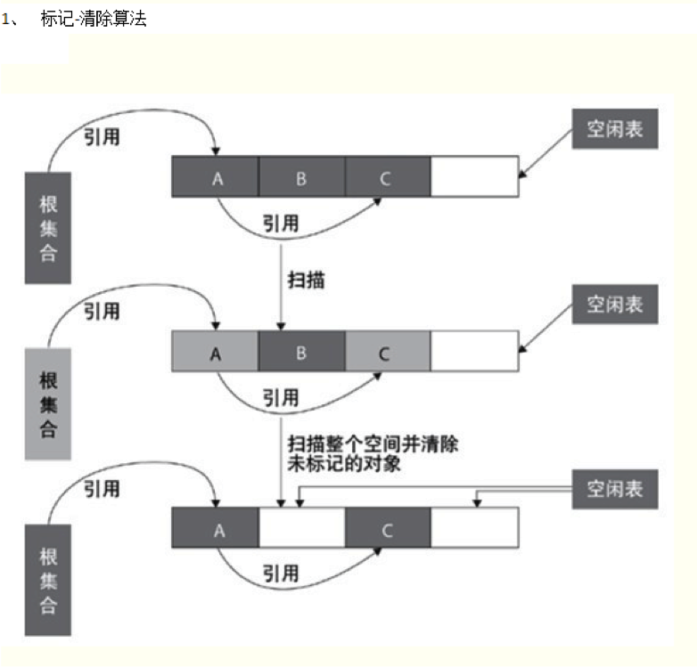

标记清除收集器**停止所有的工作**，从根扫描每个活跃的对象，然后标记扫描过的对象，标记完成以后，清除那些没有被标记的对象。

优点：

- 解决循环引用的问题
- 不需要编译器的配合，从而就不执行额外的指令

缺点：

- 每个活跃的对象都要进行扫描，收集暂停的时间比较长。
- 标记-清除算法采用从根集合进行扫描，对存活的对象对象标记，标记完毕后，再扫描整个空间中未被标记的对象，进行回收，如上图所示。

标记-清除算法不需要进行对象的移动，并且仅对不存活的对象进行处理，在存活对象比较多的情况下极为高效，但由于标记-清除算法直接回收不存活的对象，因此**会造成内存碎片**。

## 3.2 复制算法

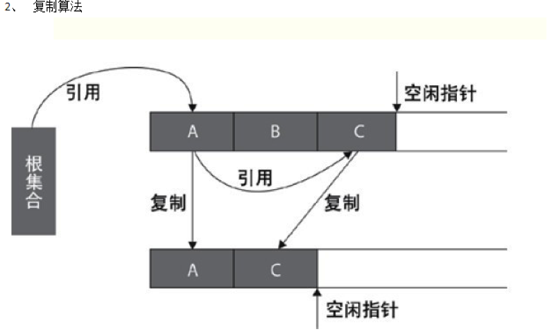

复制收集器将内存分为两块一样大小空间，某一个时刻，只有一个空间处于活跃的状态，当活跃的空间满的时候，GC就会将活跃的对象复制到未使用的空间中去，原来不活跃的空间就变为了活跃的空间。

优点：

1 只扫描可以到达的对象，不需要扫描所有的对象，从而减少了应用暂停的时间

缺点：

1．需要额外的空间消耗，某一个时刻，总是有一块内存处于未使用状态

2．复制对象需要一定的开销

 

复制算法采用从根集合扫描，并将存活对象复制到一块新的，没有使用过的空间中，这种算法当空间存活的对象比较少时，极为高效，但是带来的成本是需要一块内存交换空间用于进行对象的移动。

## 3.3 标记-整理算法

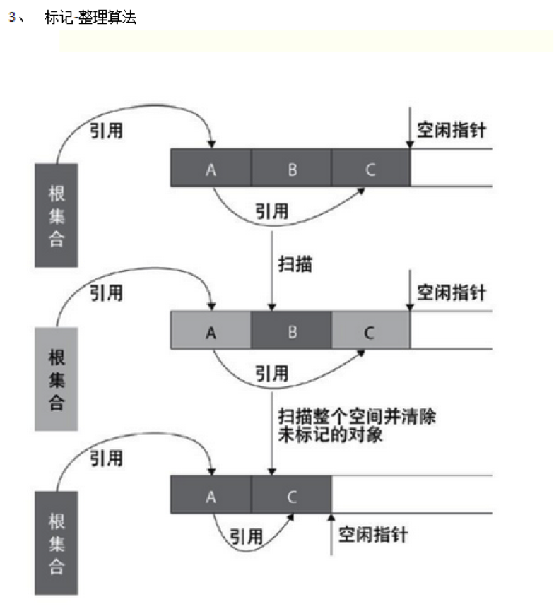

标记整理收集器汲取了标记清除和复制收集器的优点，它分两个阶段执行，在第一个阶段，首先扫描所有活跃的对象，并标记所有活跃的对象，第二个阶段首先清除未标记的对象，然后将活跃的的对象复制到堆得底部

该算法极大的减少了内存碎片，并且不需要像复制算法一样需要两倍的空间。

标记-整理算法采用标记-清除算法一样的方式进行对象的标记，但在清除时不同，在回收不存活的对象占用的空间后，会将所有的存活对象往左端空闲空间移动，并更新对应的指针。标记-整理算法是在标记-清除算法的基础上，又进行了对象的移动，因此成本更高，但是却解决了内存碎片的问题。

## 3.4 分代回收

垃圾分代回收（Generational Collecting） 基于对对象生命周期分析后得出的垃圾回收算法。

因为我们前面有介绍，内存主要被分为三块，新生代、旧生代、持久代。三代的特点不同，造就了他们所用的GC算法不同，新生代适合那些生命周期较短，频繁创建及销毁的对象，旧生代适合生命周期相对较长的对象，持久代在Sun HotSpot中就是指方法区（有些JVM中根本就没有持久代这中说法）。首先介绍下新生代、旧生代、持久代的概念及特点。

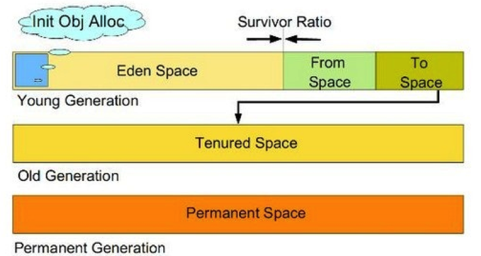

**Young**（年轻代、新生代）：JVM specification中的 Heap的一部份 年轻代分三个区。一个Eden区，两个Survivor区。大部分对象在Eden区中生成。当Eden区满时，还存活的对象将被复制到Survivor区（两个中的一个），当这个Survivor区满时，此区的存活对象将被复制到另外一个Survivor区，当这个Survivor去也满了的时候，从第一个Survivor区复制过来的并且此时还存活的对象，将被复制旧生代。需要注意，Survivor的两个区是对称的，没先后关系，所以同一个区中可能同时存在从Eden复制过来对象，和从前一个Survivor复制过来的对象，而复制到年老区的只有从第一个Survivor去过来的对象。而且，Survivor区总有一个是空的。 

**新生代使用复制算法和标记-清除垃圾收集算法**，新生代中98%的对象是朝生夕死的短生命周期对象，所以不需要将新生代划分为容量大小相等的两部分内存，而是将新生代分为Eden区，Survivor from(Survivor 0)和Survivor to(Survivor 1)三部分，其占新生代内存容量默认比例分别为8：1：1，其中Survivor from和Survivor to总有一个区域是空白，只有Eden和其中一个Survivor总共90%的新生代容量用于为新创建的对象分配内存，只有10%的Survivor内存浪费，当新生代内存空间不足需要进行垃圾回收时，仍然存活的对象被复制到空白的Survivor内存区域中，Eden和非空白的Survivor进行标记-清理回收，两个Survivor区域是轮换的。

如果空白Survivor空间无法存放下仍然存活的对象时，使用内存分配担保机制，直接将新生代依然存活的对象复制到年老代内存中，同时对于创建大对象时，如果新生代中无足够的连续内存时，也直接在年老代中分配内存空间。

Java虚拟机对新生代的垃圾回收称为**Minor GC**，次数比较频繁，每次回收时间也比较短。

使用java虚拟机**-Xmn**参数可以指定新生代内存大小。

 

**Tenured（年老代、旧生代）**：JVM specification中的 Heap的一部份 年老代存放从年轻代存活的对象。一般来说年老代存放的都是生命期较长的对象。 

年老代中的对象一般都是长生命周期对象，对象的存活率比较高，因此在**年老代中使用标记-整理垃圾回收算法**。

Java虚拟机对年老代的垃圾回收称为**MajorGC/Full GC**，次数相对比较少，每次回收的时间也比较长。

java虚拟机**-Xms**参数可以指定最小内存大小，**-Xmx**参数可以指定最大内存大小，这两个参数分别减去Xmn参数指定的新生代内存大小，可以计算出年老代最小和最大内存容量。

 

**Perm（持久代、永久代）**： JVM specification中的 Method area 用于存放静态文件，如今Java类、方法等。持久代对垃圾回收没有显著影响，但是有些应用可能动态生成或者调用一些class，例如Hibernate等，在这种时候需要设置一个比较大的持久代空间来存放这些运行过程中新增的类。 

java虚拟机内存中的方法区在Sun HotSpot虚拟机中被称为永久代，是被各个线程共享的内存区域，它用于存储已被虚拟机加载的类信息、常量、静态变量、即时编译后的代码等数据。**永久代垃圾回收比较少，效率也比较低，**但是也必须进行垃圾回收，否则会永久代内存不够用时仍然会抛出OutOfMemoryError异常。

**永久代也使用标记-整理算法进行垃圾回收**，java虚拟机参数**-XX:PermSize**和**-XX:MaxPermSize**可以设置永久代的初始大小和最大容量。

## 3.5 垃圾回收过程

上面我们看了JVM的内存分区管理，现在我们来看JVM的垃圾回收工作是怎样运作的。

首先当启动J2EE应用服务器时，JVM随之启动，并将JDK的类和接口，应用服务器运行时需要的类和接口以及J2EE应用的类和接口定义文件也及编译后的Class文件或JAR包中的Class文件装载到JVM的永久存储区。在伊甸园中创建JVM，应用服务器运行时必须的JAVA对象，创建J2EE应用启动时必须创建的JAVA对象；J2EE应用启动完毕，可对外提供服务。 

JVM在伊甸园区根据用户的每次请求创建相应的JAVA对象，当伊甸园的空间不足以用来创建新JAVA对象的时候，JVM的垃圾回收器执行对伊甸园区的垃圾回收工作，销毁那些不再被其他对象引用的JAVA对象（如果该对象仅仅被一个没有其他对象引用的对象引用的话，此对象也被归为没有存在的必要，依此类推），并将那些被其他对象所引用的JAVA对象移动到幸存者0区。 

如果幸存者0区有足够空间存放则直接放到幸存者0区；如果幸存者0区没有足够空间存放，则JVM的垃圾回收器执行对幸存者0区的垃圾回收工作，销毁那些不再被其他对象引用的JAVA对象，并将那些被其他对象所引用的JAVA对象移动到幸存者1区。 

如果幸存者1区有足够空间存放则直接放到幸存者1区；如果幸存者1区没有足够空间存放，则JVM的垃圾回收器执行对幸存者1区的垃圾回收工作，销毁那些不再被其他对象引用的JAVA对象，并将那些被其他对象所引用的JAVA对象移动到养老区。 

如果养老区有足够空间存放则直接放到养老区；如果养老区没有足够空间存放，则JVM的垃圾回收器执行对养老区区的垃圾回收工作，销毁那些不再被其他对象引用的JAVA对象，并保留那些被其他对象所引用的JAVA对象。

如果到最后养老区，幸存者1区，幸存者0区和伊甸园区都没有空间的话，则JVM会报告“JVM堆空间溢出（java.lang.OutOfMemoryError: Java heap space）”，也即是在堆空间没有空间来创建对象。 

这就是JVM的内存分区管理，相比不分区来说；一般情况下，垃圾回收的速度要快很多；因为在没有必要的时候不用扫描整片内存而节省了大量时间。

## 3.6 对象的空间分配和晋升

- 对象优先在Eden上分配
- 大对象直接进入老年代。虚拟机提供了-XX:PretenureSizeThreshold参数，大于这个参数值的对象将直接分配到老年代中。因为新生代采用的是标记-复制策略，在Eden中分配大对象将会导致Eden区和两个Survivor区之间大量的内存拷贝。
- 长期存活的对象将进入老年代。对象在Survivor区中每熬过一次Minor GC，年龄就增加1岁，当它的年龄增加到一定程度（默认为15岁）时，就会晋升到老年代中。

# 4、触发：何时开始GC

Minor GC（新生代回收）的触发条件比较简单，**Eden空间不足就开始进行Minor GC回收新生代**。

而Full GC（老年代回收，一般伴随一次Minor GC）则有几种触发条件：

- 老年代空间不足

- PermSpace空间不足

- 统计得到的Minor GC晋升到老年代的平均大小大于老年代的剩余空间


这里注意一点：PermSpace并不等同于方法区，只不过是Hotspot JVM用PermSpace来实现方法区而已，有些虚拟机没有PermSpace而用其他机制来实现方法区。

# 5、实现：JVM中的回收器类型

## 5.1 收集器概览

Oracle Hotspot JVM中实现了多种垃圾收集器，针对不同的年龄代内存中的对象的生存周期和应用程序的特点，实现了多款垃圾收集器。

单线程GC收集器包括**Serial**和**SerialOld**这两款收集器，分别用于年轻代和老年代的垃圾收集工作。后来，随着CPU多核的普及，为了更好了利用多核的优势，开发了**ParNew**收集器，这款收集器是Serial收集器的多线程版本。

多线程收集器还包括**Parallel Scavenge**和**ParallelOld**收集器，这两款也分别用于年轻代和老年代的垃圾收集工作，不同的是，它们是两款可以利用多核优势的多线程收集器。

相对来说更加复杂的还有**CMS**收集器。这款收集器，在运行的时候会分多个阶段进行垃圾收集，而且在一些阶段是可以和应用线程并行运行的，提高了这款收集器的收集效率。

其中最先进的收集器，要数**G1**这款收集器了。这款收集器是当前最新发布的收集器，是一款面向服务端垃圾收集器。

接下来，我们来分别介绍下上面提到的那些GC收集器以及它们各自的特点。

## 5.2 年轻代收集器

年轻代收集器包括Serial收集器、ParNew收集器以及Parallel Scavenge收集器。

### 5.2.1 Serial收集器

Serial收集器是一款年轻代的垃圾收集器，使用标记-复制垃圾收集算法。它是一款发展历史最悠久的垃圾收集器。Serial收集器只能使用一条线程进行垃圾收集工作，并且在进行垃圾收集的时候，**所有的工作线程都需要停止工作**，等待垃圾收集线程完成以后，其他线程才可以继续工作。工作过程可以简单的用下图来表示：

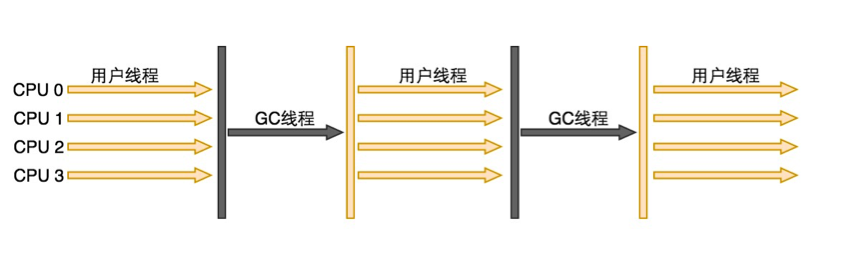

从图中可以看到，Serial收集器工作的时候，其他用户线程都停止下来，等到GC过程结束以后，它们才继续执行。而且处理GC过程的只有一条线程在执行。由于Serial收集器的这种工作机制，所以在进行垃圾收集过程中，会出现**STW**（**Stop The World**）的情况，应用程序会出现停顿的状况。如果垃圾收集的时间很长，那么停顿时间也会很长，这样会导致系统响应变的迟钝，影响系统的时候。

虽然这款年迈的垃圾收集器只能使用单核CPU，但是正是由于它不能利用多核，在一些场景下，减少了很多线程的上下文切换的开销，可以在进行垃圾收集过程中专心处理GC过程，而不会被打断，所以如果GC过程很短暂，那么这款收集器还是非常简单高效的。

由于Serial收集器只能使用单核CPU，在现代处理器基本都是多核多线程的情况下，为了充分利用多核的优势，出现了多线程版本的垃圾收集器，比如下面将要说到的ParNew收集器。

### 5.2.2 ParNew收集器

ParNew垃圾收集器是Serial收集器的多线程版本，使用标记-复制垃圾收集算法。为了利用CPU多核多线程的优势，ParNew收集器可以运行多个收集线程来进行垃圾收集工作。这样可以提高垃圾收集过程的效率。

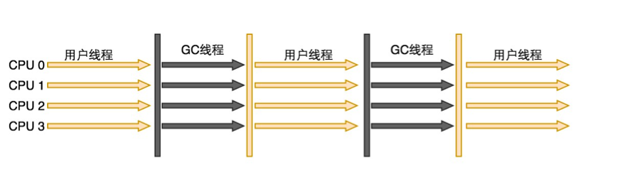

和上面的Serial收集器比较，可以明显看到，在垃圾收集过程中，GC线程是多线程执行的，而在Serial收集器中，只有一个GC线程在处理垃圾收集过程。ParNew收集器在很多时候都是作为服务端的年轻代收集器的选择，除了它具有比Serial收集器更好的性能外，还有一个原因是，多线程版本的年轻代收集器中，只有它可以和CMS这款优秀的老年代收集器一起搭配搭配使用。

作为一款多线程收集器，当它运行在单CPU的机器上的时候，由于不能利用多核的优势，在线程收集过程中可能会出现频繁上下文切换，导致额外的开销，所以在单CPU的机器上，ParNew收集器的性能不一定好于Serial这款单线程收集器。如果机器是多CPU的，那么ParNew还是可以很好的提高GC收集的效率的。

ParNew收集器默认开启的垃圾收集线程数是和当前机器的CPU数量相同的，为了控制GC收集线程的数量，可以通过参数***-XX:ParallelGCThreads***来控制垃圾收集线程的数量。

### 5.2.3 Parallel Scavenge收集器

Parallel Scavenge收集器是是一款年轻代的收集器，它使用标记-复制垃圾收集算法。和ParNew一样，它也会一款多线程的垃圾收集器，但是它又和ParNew有很大的不同点。

Parallel Scavenge收集器和其他收集器的关注点不同。其他收集器，比如ParNew和CMS这些收集器，它们主要关注的是如何缩短垃圾收集的时间。而Parallel Scavenge收集器关注的是如何控制系统运行的吞吐量。这里说的吞吐量，指的是CPU用于运行应用程序的时间和CPU总时间的占比：

> 吞吐量 = 代码运行时间 / (代码运行时间 +垃圾收集时间)
>

如果虚拟机运行的总的CPU时间是100分钟，而用于执行垃圾收集的时间为1分钟，那么吞吐量就是99%。

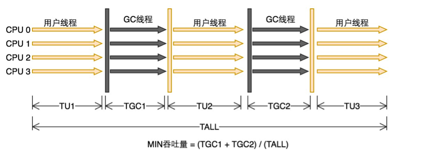

直观上，好像以缩短垃圾收集的停顿时间为目的和以控制吞吐量为目的差不多，但是适用的场景却不同。对于那些桌面应用程序，为了得到良好的用户体验，在交互过程中，需要得到快速的响应，所以系统的停顿时间要尽可能的快以避免影响到系统的响应速度，只要保证每次停顿的时间很短暂，假设每次停顿时间为10ms，那么即使发生很多次的垃圾收集过程，假设1000次，也不会影响到系统的响应速度，不会影响到用户的体验。对于一些后台计算任务，它不需要和用户进行交互，所以短暂的停顿时间对它而言并不需要，对于计算任务而言，更好的利用CPU时间，提高计算效率才是需要的，所以假设每次停顿时间相对很长，有100ms，而由于花费了很长的时间进行垃圾收集，那么垃圾收集的次数就会降下来，假设只有5次，那么显然，使用以吞吐量为目的的垃圾收集器，可以更加有效的利用CPU来完成计算任务。所以，在用户界面程序中，使用低延迟的垃圾收集器会有很好的效果，而对于后台计算任务的系统，高吞吐量的收集器才是首选。

 

Parallel Scavenge收集器提供了两个参数用于控制吞吐量。**-XX:MaxGCPauseMillis**用于控制最大垃圾收集停顿时间，**-XX:GCTimeRatio**用于直接控制吞吐量的大小。MaxGCPauseMillis参数的值允许是一个大于0的整数，表示毫秒数，收集器会尽可能的保证每次垃圾收集耗费的时间不超过这个设定值。但是如果这个这个值设定的过小，那么Parallel Scavenge收集器为了保证每次垃圾收集的时间不超过这个限定值，会导致垃圾收集的次数增加和增加年轻代的空间大小，垃圾收集的吞吐量也会随之下降。GCTimeRatio这个参数的值应该是一个0-100之间的整数，表示应用程序运行时间和垃圾收集时间的比值。如果把值设置为19，即系统运行时间 : GC收集时间 = 19 : 1，那么GC收集时间就占用了总时间的5%(1 / (19 + 1) = 5%)，该参数的默认值为99，即最大允许1%(1 / (1 + 99) = 1%)的垃圾收集时间。

Parallel Scavenge收集器还有一个参数：**-XX:UseAdaptiveSizePolicy**。这是一个开关参数，当开启这个参数以后，就不需要手动指定新生代的内存大小(-Xmn)、Eden区和Survivor区的比值(-XX:SurvivorRatio)以及晋升到老年代的对象的大小(-XX:PretenureSizeThreshold)等参数了，虚拟机会根据当前系统的运行情况动态调整合适的设置值来达到合适的停顿时间和合适的吞吐量，这种方式称为**GC自适应调节策略**。

Parallel Scavenge收集器也是一款多线程收集器，但是由于目的是为了控制系统的吞吐量，所以这款收集器也被称为吞吐量优先收集器。

## 5.3 老年代收集器

老年代收集包括：Serial Old收集器、Parallel Old收集器以及CMS收集器。

### 5.3.1 Serial Old收集器

Serial Old收集器是Serial收集器的老年代版本，它也是一款使用标记-整理算法的单线程的垃圾收集器。这款收集器主要用于客户端应用程序中作为老年代的垃圾收集器，也可以作为服务端应用程序的垃圾收集器，当它用于服务端应用系统中的时候，主要是在JDK1.5版本之前和Parallel Scavenge年轻代收集器配合使用，或者作为CMS收集器的后备收集器。


### 5.3.2 Parallel Old收集器

Parallel Old收集器是Parallel Scavenge收集器的老年代版本，使用标记-整理算法。这个收集器是在JDK1.6版本中出现的，所以在JDK1.6之前，新生代的Parallel Scavenge只能和Serial Old这款单线程的老年代收集器配合使用。Parallel Old垃圾收集器和Parallel Scavenge收集器一样，也是一款关注吞吐量的垃圾收集器，和Parallel Scavenge收集器一起配合，可以实现对Java堆内存的吞吐量优先的垃圾收集策略。

Parallel Old垃圾收集器的工作原理和Parallel Scavenge收集器类似。


### 5.3.3 CMS收集器

CMS收集器是目前老年代收集器中比较优秀的垃圾收集器。CMS是**Concurrent Mark Sweep**，从名字可以看出，这是一款使用标记-清除算法的并发收集器。CMS

垃圾收集器是一款**以获取最短停顿时间为目标**的收集器。由于现代互联网中的应用，比较重视服务的响应速度和系统的停顿时间，所以CMS收集器非常适合在这种场景下使用。

CMS收集器的运行过程相对上面提到的几款收集器要复杂一些。

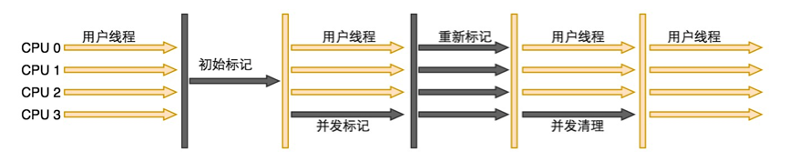

从图中可以看出，CMS收集器的工作过程可以分为4个阶段：

- 初始标记(CMS initial mark)阶段

- 并发标记(CMS concurrent mark)阶段

- 重新标记(CMS remark)阶段

- 并发清除(CMS concurrent sweep)阶段


从图中可以看出，在这4个阶段中，初始标记和重新标记这两个阶段都是只有GC线程在运行，用户线程会被停止，所以这两个阶段会发生STW(Stop The World)。初始标记阶段的工作是标记GC Roots可以直接关联到的对象，速度很快。并发标记阶段，会从GC Roots 出发，标记处所有可达的对象，这个过程可能会花费相对比较长的时间，但是由于在这个阶段，GC线程和用户线程是可以一起运行的，所以即使标记过程比较耗时，也不会影响到系统的运行。重新标记阶段，是对并发标记期间因用户程序运行而导致标记变动的那部分记录进行修正，重新标记阶段耗时一般比初始标记稍长，但是远小于并发标记阶段。最终，会进行并发清理阶段，和并发标记阶段类似，并发清理阶段不会停止系统的运行，所以即使相对耗时，也不会对系统运行产生大的影响。

由于并发标记和并发清理阶段是和应用系统一起执行的，而初始标记和重新标记相对来说耗时很短，所以可以认为CMS收集器在运行过程中，是和应用程序是并发执行的。由于CMS收集器是一款并发收集和低停顿的垃圾收集器，所以CMS收集器也被称为并发低停顿收集器。

虽然CMS收集器可以是实现低延迟并发收集，但是也存在一些不足。

首先，CMS收集器对CPU资源非常敏感。对于并发实现的收集器而言，虽然可以利用多核优势提高垃圾收集的效率，但是由于收集器在运行过程中会占用一部分的线程，这些线程会占用CPU资源，所以会影响到应用系统的运行，会导致系统总的吞吐量降低。CMS默认开始的回收线程数是(Ncpu + 3) / 4，其中Ncpu是机器的CPU数。所以，当机器的CPU数量为4个以上的时候，垃圾回收线程将占用不少于%25的CPU资源，并且随着CPU数量的增加，垃圾回收线程占用的CPU资源会减少。但是，当CPU资源少于4个的时候，垃圾回收线程占用的CPU资源的比例会增大，会影响到系统的运行，假设有2个CPU的情况下，垃圾回收线程将会占据超过50%的CPU资源。所以，在选用CMS收集器的时候，需要考虑，当前的应用系统，是否对CPU资源敏感。

其次，CMS收集器在处理垃圾收集的过程中，可能会产生浮动垃圾，由于它无法处理浮动垃圾，所以可能会出现**Concurrent Mode Failure**问题而导致触发一次Full GC。所谓的**浮动垃圾**，是由于CMS收集器的并发清理阶段，清理线程是和用户线程一起运行，如果在清理过程中，用户线程产生了垃圾对象，由于过了标记阶段，所以这些垃圾对象就成为了浮动垃圾，CMS无法在当前垃圾收集过程中集中处理这些垃圾对象。由于这个原因，CMS收集器不能像其他收集器那样等到完全填满了老年代以后才进行垃圾收集，需要预留一部分空间来保证当出现浮动垃圾的时候可以有空间存放这些垃圾对象。在JDK 1.5中，默认当老年代使用了68%的时候会激活垃圾收集，这是一个保守的设置，如果在应用中老年代增长不是很快，可以通过参数**-XX:CMSInitiatingOccupancyFraction**"控制触发的百分比，以便降低内存回收次数来提供性能。在JDK 1.6中，CMS收集器的激活阀值变成了92%。如果在CMS运行期间没有足够的内存来存放浮动垃圾，那么就会导致"Concurrent Mode Failure"失败，这个时候，虚拟机将启动后备预案，临时启动Serial Old收集器来对老年代重新进行垃圾收集，这样会导致垃圾收集的时间边长，特别是当老年代内存很大的时候。所以对参数"-XX:CMSInitiatingOccupancyFraction"的设置，过高，会导致发生Concurrent Mode Failure，过低，则浪费内存空间。

CMS的最后一个问题，就是它在进行垃圾收集时使用的标记-清除算法，会出现很多内存碎片，过多的内存碎片会影响大对象的分配，会导致即使老年代内存还有很多空闲，但是由于过多的内存碎片，不得不提前触发垃圾回收。为了解决这个问题，CMS收集器提供了一个"**-XX:+UseCMSCompactAtFullCollection**"参数，用于CMS收集器在必要的时候对内存碎片进行压缩整理。由于内存碎片整理过程不是并发的，所以会导致停顿时间变长。"-XX:+UseCMSCompactAtFullCollection"参数默认是开启的。虚拟机还提供了一个"**-XX:CMSFullGCsBeforeCompaction**"参数，来控制进行过多少次不压缩的Full GC以后，进行一次带压缩的Full GC，默认值是0，表示每次在进行Full GC前都进行碎片整理。

虽然CMS收集器存在上面提到的这些问题，但是毫无疑问，CMS当前仍然是非常优秀的垃圾收集器。

## 5.4 G1收集器

G1(**Garbage First**)垃圾收集器是当今垃圾回收技术最前沿的成果之一。早在JDK7就已加入JVM的收集器大家庭中，成为HotSpot重点发展的垃圾回收技术。同优秀的CMS垃圾回收器一样，G1也是关注最小时延的垃圾回收器，也同样适合大尺寸堆内存的垃圾收集，官方也推荐使用G1来代替选择CMS。G1最大的特点是引入分区的思路，弱化了分代的概念，合理利用垃圾收集各个周期的资源，解决了其他收集器甚至CMS的众多缺陷。

G1收集与前面介绍的收集器有很大不同：

- G1的设计原则是"**首先收集尽可能多的垃圾(Garbage First)**"。因此，G1并不会等内存耗尽(串行、并行)或者快耗尽(CMS)的时候开始垃圾收集，而是在内部采用了启发式算法，在老年代找出具有高收集收益的分区进行收集。同时G1可以根据用户设置的暂停时间目标自动调整年轻代和总堆大小，暂停目标越短年轻代空间越小、总空间就越大；

- G1采用内存**分区**(Region)的思路，将内存划分为一个个相等大小的内存分区，回收时则以分区为单位进行回收，存活的对象复制到另一个空闲分区中。由于都是以相等大小的分区为单位进行操作，因此G1天然就是一种压缩方案(局部压缩)；

- G1虽然也是分代收集器，但整个内存分区不存在物理上的年轻代与老年代的区别，也不需要完全独立的survivor(to space)堆做复制准备。G1只有逻辑上的分代概念，或者说每个分区都可能随G1的运行在不同代之间前后切换；

- G1的收集都是STW的，但年轻代和老年代的收集界限比较模糊，采用了**混合**(mixed)收集的方式。即每次收集既可能只收集年轻代分区(年轻代收集)，也可能在收集年轻代的同时，包含部分老年代分区(混合收集)，这样即使堆内存很大时，也可以限制收集范围，从而降低停顿。


Region区域划分与其他收集类似，不同的是单独将大对象分配到了单独的region中，会分配一组连续的Region区域（Humongous start 和 humonous Contoinue 组成），所以一共有四类Region（Eden，Survior，Humongous和Old）：

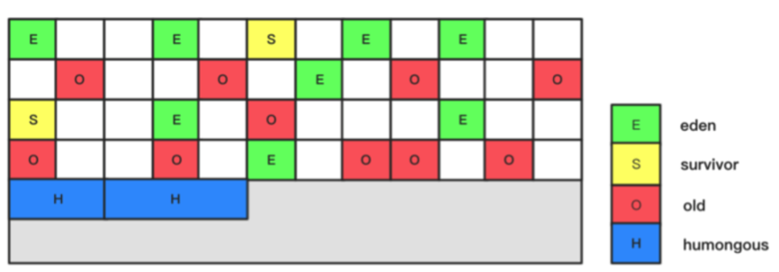

G1收集器之所以能建立可预测的停顿时间模型，是因为它可以有计划地避免在整个Java堆中进行全区域的垃圾收集。G1跟踪各个Region里面的垃圾堆积的价值大小（回收所获得的空间大小以及回收所需时间的经验值），在后台维护一个优先列表，每次根据允许的收集时间，优先回收价值最大的Region（这也就是Garbage-First名称的来由）。这种使用Region划分内存空间以及有优先级的区域回收方式，保证了G1收集器在有限的时间内可以获取尽可能高的收集效率。

G1收集器的运作大致可划分为以下几个步骤：

- 初始标记（Initial Marking）
  初始标记阶段仅仅只是标记一下GC Roots能直接关联到的对象，并且修改TAMS（Next Top at Mark Start）的值，让下一阶段用户程序并发运行时，能在正确可用的Region中创建新对象，这阶段需要停顿线程，但耗时很短。
- 并发标记（Concurrent Marking）
  并发标记阶段是从GC Root开始对堆中对象进行可达性分析，找出存活的对象，这阶段耗时较长，但可与用户程序并发执行。

- 最终标记（Final Marking）
  最终标记阶段是为了修正在并发标记期间因用户程序继续运作而导致标记产生变动的那一部分标记记录，虚拟机将这段时间对象变化记录在线程Remembered Set Logs里面，最终标记阶段需要把Remembered Set Logs的数据合并到Remembered Set中，这阶段需要停顿线程，但是可并行执行。

- 筛选回收（Live Data Counting and Evacuation）
  筛选回收阶段首先对各个Region的回收价值和成本进行排序，根据用户所期望的GC停顿时间来制定回收计划，这个阶段其实也可以做到与用户程序一起并发执行，但是因为只回收一部分价值高的Region区的垃圾对象，时间是用户可控制的，而且停顿用户线程将大幅提高收集效率。回收时，采用“复制”算法，从一个或多个Region复制存活对象到堆上的另一个空的Region，并且在此过程中压缩和释放内存。

G1部分设置参数如下：

- "**-XX:+UseG1GC**"：指定使用G1收集器；

- "**-XX:InitiatingHeapOccupancyPercent**"：当整个Java堆的占用率达到参数值时，开始并发标记阶段；默认为45；

- "**-XX:MaxGCPauseMillis**"：为G1设置暂停时间目标，默认值为200毫秒；

- "**-XX:G1HeapRegionSize**"：设置每个Region大小，范围1MB到32MB；目标是在最小Java堆时可以拥有约2048个


## 5.5 垃圾收集器总结

 

| GC组合                                    | Minor GC                       | Full GC                                                     | 描述                                                         |
| ----------------------------------------- | ------------------------------ | ----------------------------------------------------------- | ------------------------------------------------------------ |
| -XX:+UseSerialGC                          | Serial收集器串行回收           | Serial  Old收集器串行回收                                   | 该选项可以手动指定Serial收集器+Serial Old收集器组合执行内存回收 |
| -XX:+UseParNewGC                          | ParNew收集器并行回收           | Serial  Old收集器串行回收                                   | 该选项可以手动指定ParNew收集器+Serilal Old组合执行内存回收   |
| -XX:+UseParallelGC                        | Parallel收集器并行回收         | Serial  Old收集器串行回收                                   | 该选项可以手动指定Parallel收集器+Serial Old收集器组合执行内存回收 |
| -XX:+UseParallelOldGC                     | Parallel收集器并行回收         | Parallel  Old收集器并行回收                                 | 该选项可以手动指定Parallel收集器+Parallel Old收集器组合执行内存回收 |
| -XX:+UseConcMarkSweepGC                   | ParNew收集器并行回收           | 缺省使用CMS收集器并发回收，备用采用Serial Old收集器串行回收 | 该选项可以手动指定ParNew收集器+CMS收集器+Serial Old收集器组合执行内存回收。优先使用ParNew收集器+CMS收集器的组合，当出现ConcurrentMode Fail或者Promotion Failed时，则采用ParNew收集器+Serial Old收集器的组合 |
| -XX:+UseConcMarkSweepGC  -XX:-UseParNewGC | Serial收集器串行回收           |                                                             |                                                              |
| -XX:+UseG1GC                              | G1收集器并发、并行执行内存回收 | 暂无                                                        |                                                              |

 

# 6、GC日志分析

垃圾收集器在进行垃圾收集的过程中，可以输出日志，我们通过日志，可以看到当前垃圾收集器的运行情况。通过gc日志，我们可以观察垃圾收集器的行为，以及当前应用程序的GC情况和内存使用情况。学会查看和分析垃圾收集日志，一方面可以帮助我们学习垃圾收集器；另一方面，在必要的时候，可以帮助我们定位问题，解决问题，对JVM进行优化。

默认，JVM不会打印出GC日志信息，可以通过参数**-XX:+PrintGC**或**-verbose:gc**来设置JVM输出gc日志到终端中。

JVM参数：**-XX:+PrintGC -XX:+UseSerialGC -Xms10m -Xmx10m**

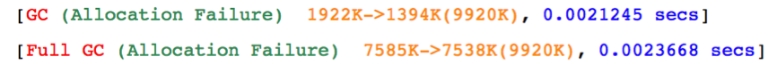

当设置了"-XX:+PrintGC"或者"-verbose:gc"以后就会输出类似输出上面的GC日志。这是最简单的GC日志，包含了垃圾收集过程中的信息。其中红色部分的"GC"和"Full GC"表示这次GC的类型，而绿色部分的"Allocation Failure"表示表示发生这次GC的原因，从上面的日志可以看出，是由于内存分配失败导致的GC。后面的黄色部分"1922K->1394K(9920K)"表示这次GC导致JVM中堆内存的使用量从1922K降低到了1394K，其中括号中表示当前整个JVM堆的大小。最后蓝色部分的"0.0021245 secs"表示这次GC持续的时间。

上面输出的是简单格式的GC日志，虽然提供了一些信息，但是通过这些信息，我们没法知道这次GC发生的时候，这次GC是发生在老年代还是在年轻代，是否有对象从年轻代被移动到了老年代等信息，所以我们希望可以看到更加详尽的信息。这个时候，我们需要设置**-XX:+PrintGCDetails**参数来输出更加详细的GC日志，下面我们结合不同的收集器组合，来分析下它们的输出日志。

## 6.1 Serial GC + Serial Old

Serial GC和Serial Old收集器是比较早的单线程收集器，工作原理我们在上面已经介绍过了。这里，我们来看下使用这两款收集器进行垃圾收集的时候，输出的日志格式是怎么样的。首先我们需要设置JVM参数：

 

JVM参数：***-XX:+PrintGC -XX:+PrintGCDetails -XX:+UseSerialGC -Xms10m -Xmx10m\***

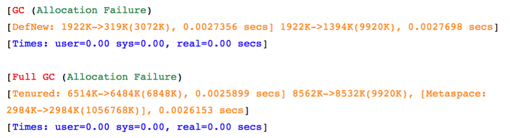

可以发现，通过设置了"-XX:+PrintGCDetails"以后，输出的GC日志信息多了很多。我们先来看第一条，红色部分"GC"表示这次发生的是Minor GC，绿色部分"Allocation Failure"表示导致这次GC的原因是内存分配失败。接下来，黄色部分的内容，则和前面的日志有些区别了，这里输出的内容相对比较详细。"DefNew: 1922K->319K(3072K), 0.0027356 secs] 1922K->1394K(9920K), 0.0027698 secs"，其中DefNew表示这次GC发生在年轻代（不同的收集器，日志的格式不一定相同）,接下来"1922K->319K"表示这次GC导致年轻代使用的内存从1922K降到319K，括号中的"3072K"表示年轻代中的堆内存大小为3072K。"0.0027356 secs"表示这次年轻代GC耗时0.0027356s。后面的"1922K->1393K"表示总的堆内存（年轻代 + 老年代）的使用情况的变化，从1922K降低到1394K, 括号中的"9920K"表示总的堆内存的大小。最后的"0.0027698 secs"表示这次GC总的消耗的时间。最后是这次GC消耗的时间的统计，其中user表示用户态CPU执行的时间，sys表示内核态CPU执行的时间，这两个时间不包括被挂起消耗的时间，而real表示的是实际的时间，可以认为是墙上时钟走过的时间。

下面的这条日志，"Full GC"表示这次GC是一次Major GC，后面的原因和上面一样。我们来看下黄色部分，"Tenured"表示这次GC发生在老年代，其中"6524K->6484K"表示老年代内存从6524K降低到6484K。后面的时间"0.0025899 secs"表示这次老年代GC耗时0.0025899s。接下来的"8562K -> 8532K"和上面提到的一样，表示整个堆内存的变化。最后的时间表示这次GC的总耗时为"0.0026153s"。

## 6.2 Parallel Scanvage + Parallel Old

不同的垃圾收集器，输出的日志信息也不是完全相同的，上面我们看到的日志，是使用Serial GC和Serial Old收集器输出的gc日志，而下面的日志信息，则是使用Parallel Scavenge收集器和Parallel Old收集器输出的日志。 

JVM参数：**-XX:+PrintGC -XX:+UseParallelOldGC -XX:+PrintGCDetails -Xms10m -Xmx10m**

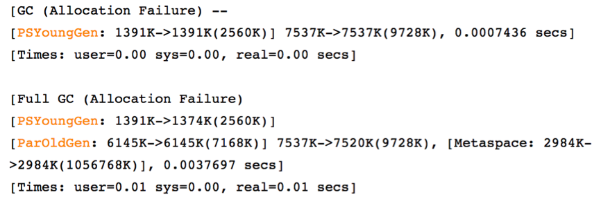

 可以看到，使用Parallel Scavenge 和 Parallel Old收集器输出的日志，会有一些不同，不过日志内容大体上差不多。最后，我们来看下CMS垃圾收集器的日志是怎么样的，相对上面几款收集器，CMS相对更加复杂，从它输出的日志也可以看出来。

## 6.3 ParNew + Concurrent Mark Sweep（CMS）

下面，我们来看下ParNew配合CMS收集器在进行垃圾收集的时候，输出的GC 日志信息。

JVM参数：**-XX:+PrintGC -XX:+UseConcMarkSweepGC -XX:+PrintGCDetails -Xms10m -Xmx10m**

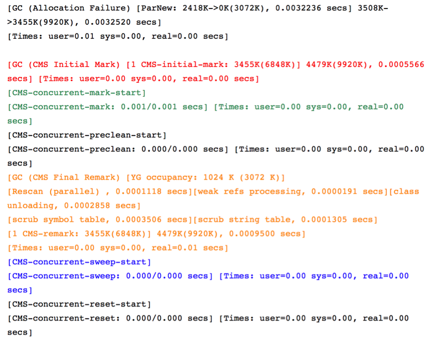

通过第一条日志，可以看出我们使用"-XX:+UseConcMarkSweepGC"指定CMS垃圾收集器的时候，使用的是ParNew + CMS收集器组合。下面输出的一堆日志，就是CMS收集器在进行垃圾收集过程中输出的信息。可以明显的看到，CMS在进行垃圾收集的过程中，经历了4个阶段，在日志中我用4中颜色标记出来了。需要注意的是黄色部分，这是CMS的重新标记的阶段，在上面我们介绍CMS收集器的时候说过，在这个阶段，是会出现Stop The World的，所以如果这个阶段消耗的时间比较长，则会影响应用的响应时间。

## 6.4 其他日志参数

有时候，我们需要在GC日志中输出时间值，这样我们就可以知道这次GC发生的具体时间点。我们可以通过JVM参数"**-XX:+PrintGCDateStamps**"来设置日志输出的时间。

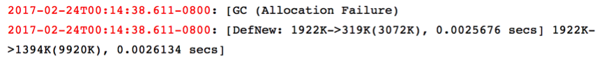

除了将日志输出到控制台，我们还可以将日志输出到日志文件中，这样就可以通过分析日志文件来分析系统的GCGCJVM"**-Xloggc:**"