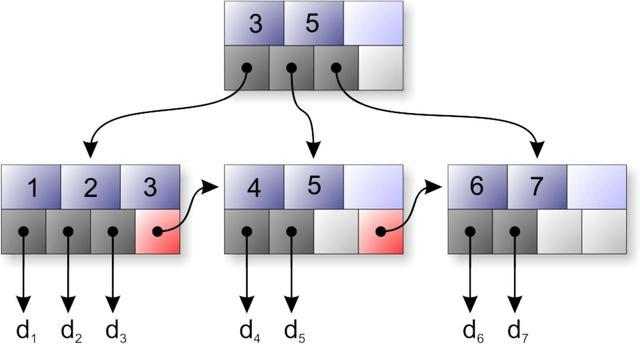
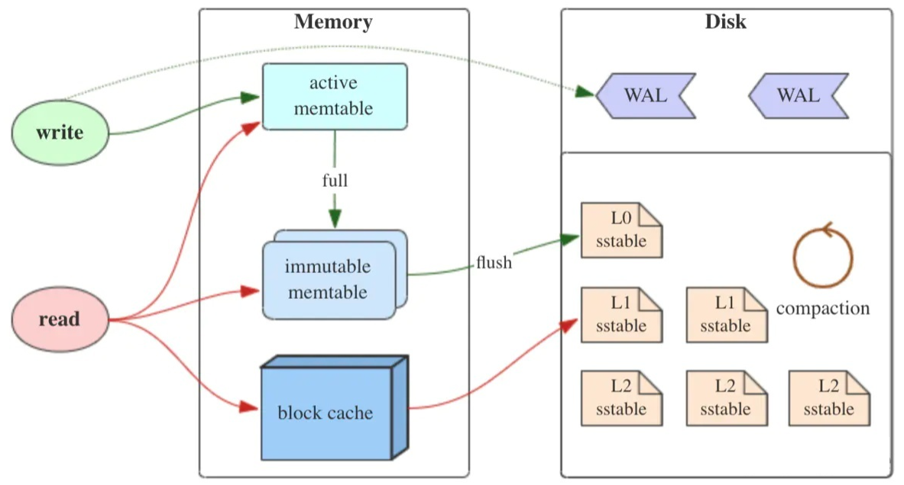
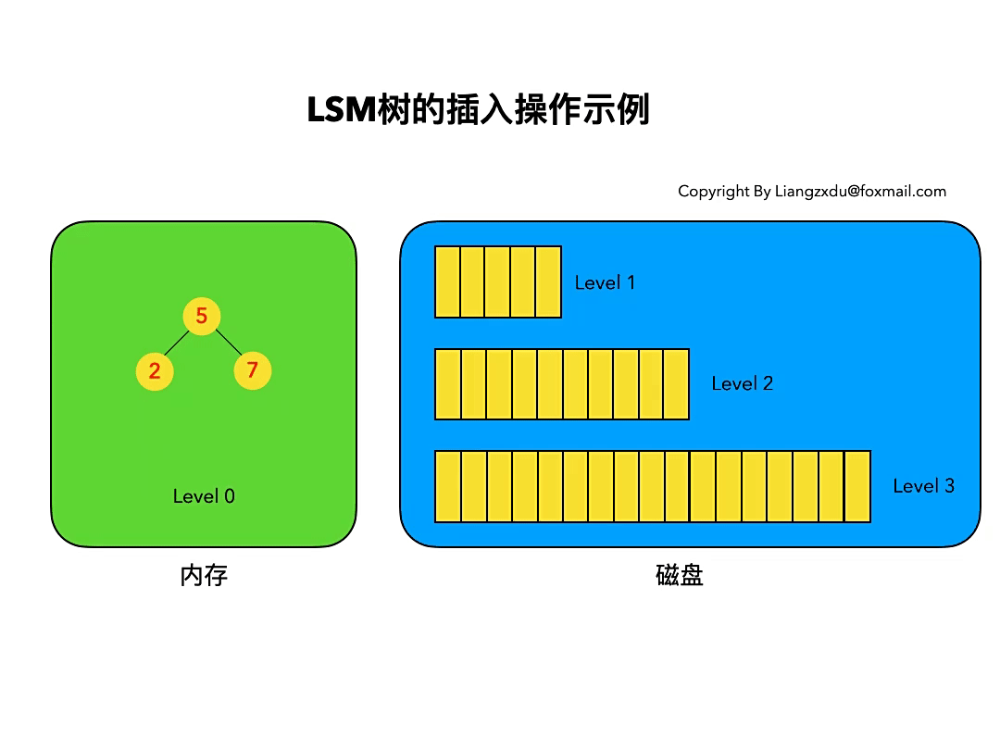
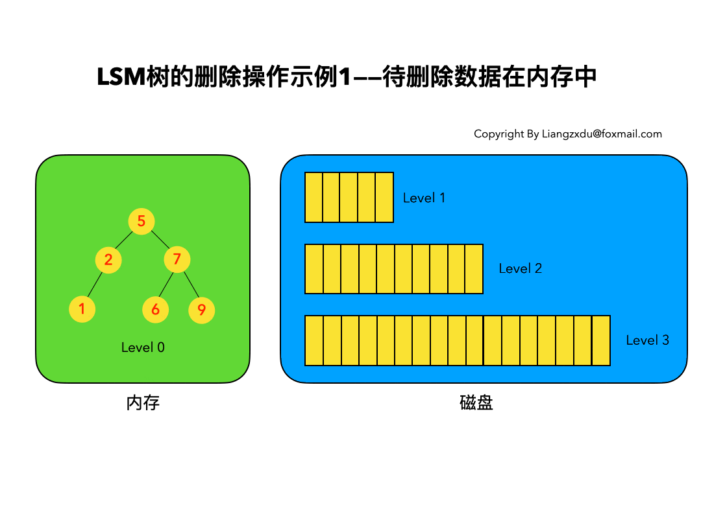
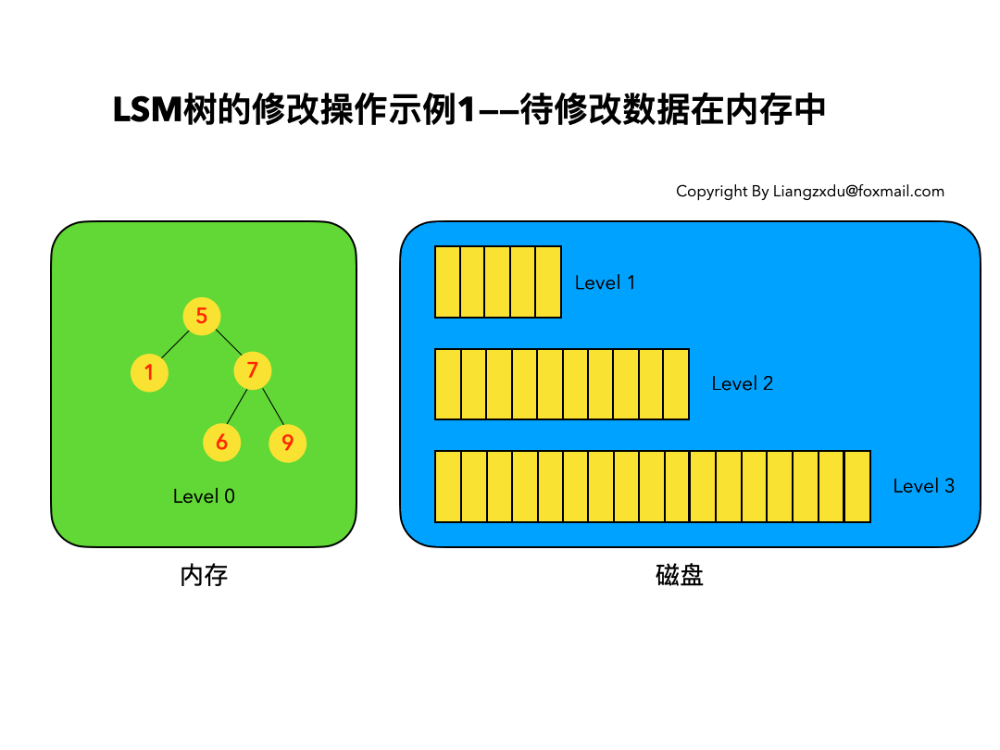
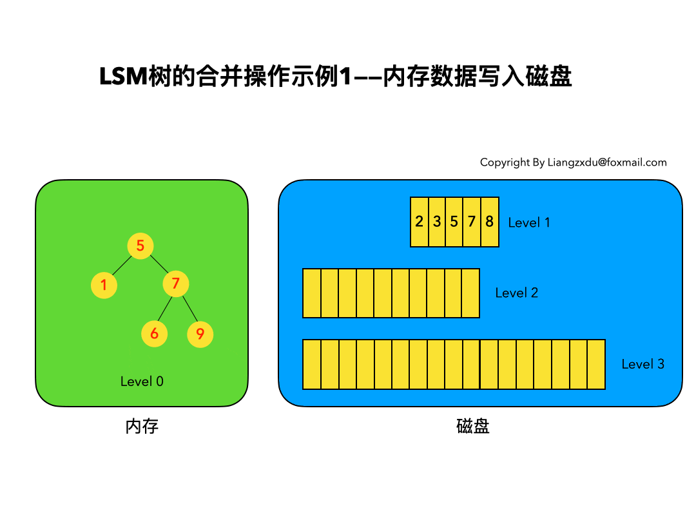

# 1、引言

对于一个数据库的性能来说，其数据的组织方式至关重要。众所周知，数据库的数据大多存储在磁盘上，而磁盘的访问相对内存的访问来说是一项很耗时的操作，对比如下。因此，**提高数据库数据的查找速度的关键点之一便是尽量减少磁盘的访问次数**。

为了加速数据库数据的访问，大多传统的关系型数据库都会使用特殊的数据结构来帮助查找数据，这种数据结构叫作**索引**( Index)。对于传统的关系型数据库，考虑到经常需要**范围查找**某一批数据，因此其索引一般不使用 Hash算法，而使用树( Tree)结构。

## 1.1 B+树

在传统的关系型数据库里， **B+树**及其衍生树是被用得比较多的索引树。

B+树的**非叶子节点只存放键值，不存放数值，而由叶子节点存放数值**。这样会使树节点的度比较大，而树的高度就比较低，从而有利于提高查询效率。**叶子节点存放数值，并按照值大小顺序排序，且带指向相邻节点的指针**，以便高效地进行区间数据查询；并且所有叶子节点与根节点的距离相同，因此任何查询的效率都很相似。

与二叉树不同， B+树的数据更新操作不从根节点开始，而从叶子节点开始，并且在更新过程中树能以比较小的代价实现自平衡。

正是由于 B+树的上述优点，它成了传统关系型数据库的宠儿。当然，它也并非无懈可击，它的主要缺点在于随着数据插入的不断发生，叶子节点会慢慢分裂——这可能会导致**逻辑上原本连续的数据实际上存放在不同的物理磁盘块位置上**，在做范围查询的时候会导致较高的磁盘 IO，以致严重影响到性能。

## 1.2 LSM树

众所周知，数据库的数据大多存储在磁盘上，而无论是传统的机械硬盘( HardDiskDrive, HDD)还是固态硬盘( Solid State Drive, SSD)，**对磁盘数据的顺序读写速度都远高于随机读写**。

然而，基于 B+树的索引结构是违背上述磁盘基本特点的——它会需要较多的磁盘随机读写。于是， 1992年，名为**日志结构**( Log-Structured)的新型索引结构方法便应运而生。日志结构方法的主要思想是将磁盘看作一个大的日志，每次都将新的数据及其索引结构添加到日志的最末端，以实现对磁盘的顺序操作，从而提高索引性能。不过，日志结构方法也有明显的缺点，随机读取数据时效率很低。

1996年，一篇名为 `The Log-Structured Merge-tree`(LSM-tree)的论文创造性地提出了**日志结构合并树**( Log-Structured Merge-Tree)的概念，该方法既吸收了日志结构方法的优点，又通过**将数据文件预排序克服了日志结构方法随机读性能较差的问题**。尽管当时 LSM-tree新颖且优势鲜明，但它真正声名鹊起却是在 10年之后的 2006年，那年谷歌的一篇使用了 LSM-tree技术的论文 `Bigtable: A Distributed Storage System for Structured Data`横空出世，在分布式数据处理领域掀起了一阵旋风，随后两个声名赫赫的大数据开源组件( 2007年的 HBase与 2008年的 Cassandra，目前两者同为 Apache顶级项目)直接在其思想基础上破茧而出，彻底改变了大数据基础组件的格局，同时也极大地推广了 LSM-tree技术。

事实上，LSM树并不像B+树、红黑树一样是一颗严格的树状数据结构，**它其实是一种存储结构**，目前HBase，LevelDB，RocksDB这些NoSQL存储都是采用的LSM树。

如上图所示，LSM树有以下三个重要组成部分：

**MemTable**：MemTable是在**内存中的数据结构**，用于保存最近更新的数据，会按照Key**有序**地组织这些数据。因为数据暂时保存在内存中，内存并不是可靠存储，如果断电会丢失数据，因此通常会通过**WAL**(Write-ahead logging，预写式日志)的方式来保证数据的可靠性。

**Immutable MemTable**：当 MemTable达到一定大小后，会转化成Immutable MemTable。Immutable MemTable是将转MemTable变为SSTable的一种中间状态。写操作由新的MemTable处理，在转存过程中不阻塞数据更新操作。

**SSTable**(Sorted String Table)：有序键值对集合，是LSM树组在磁盘中的数据结构，特点是**有序且不可被更改**。为了加快SSTable的读取，可以通过建立key的索引以及布隆过滤器来加快key的查找。

LSM-tree的这种结构非常有利于数据的快速写入(理论上可以接近磁盘顺序写速度)，但是不利于读——因为理论上读的时候可能需要同时从 memtable和所有硬盘上的 sstable中查询数据，这样显然会对性能造成较大的影响。为了解决这个问题， LSM-tree采取了以下主要的相关措施。

* 定期将硬盘上小的 sstable合并(通常叫作 **Merge**或 **Compaction**操作)成大的 sstable，以减少 sstable的数量。而且，平时的**数据更新、删除操作并不会更新原有的数据文件**，只会将更新删除操作加到当前的数据文件末端，只有在 sstable合并的时候才会真正将重复的操作或更新去重、合并。

* 对每个 sstable使用**布隆过滤器**( Bloom Filter)，以加速对数据在该 sstable的存在性进行判定，从而减少数据的总查询时间。

## 1.3 总结

LSM树和B+树的差异主要在于读性能和写性能进行权衡，在牺牲的同时寻找其余补救方案。

B+树存储引擎，不仅支持单条记录的增、删、读、改操作，还支持顺序扫描(B+树的叶子节点之间的指针)，对应的存储系统就是关系数据库。但随着写入操作增多，为了维护B+树结构，节点分裂，读磁盘的随机读写概率会变大，性能会逐渐减弱。

LSM树(Log-Structured MergeTree)存储引擎和B+树存储引擎一样，同样支持增、删、读、改、顺序扫描操作。而且通过批量存储技术规避磁盘随机写入问题。当然凡事有利有弊，LSM 的设计目标是提供比传统的 B+ 树更好的写性能。**LSM 通过将磁盘的随机写转化为顺序写来提高写性能**，而付出的代价就是牺牲部分读性能、写放大（B+树同样有写放大的问题）。

LSM 相比 B+ 树能提高写性能的本质原因是：外存——无论磁盘还是SSD，其**随机读写都要慢于顺序读写**。

# 2、基本操作

## 2.1 插入操作

LSM树的插入较简单，数据无脑往内存中的Level 0排序树丢即可，并不关心该数据是否已经在内存或磁盘中存在。（已经存在该数据的话，则场景转换成更新操作）

如上图所示，我们依次插入了key=9、1、6的数据，这三个数据均按照key的大小，插入内存里的Level 0排序树中。该操作复杂度为树高`log(n)`，n是Level 0树的数据量，以很低的代价实现了极高的写吞吐量。

## 2.2 删除操作

**LSM树的删除操作并不是直接删除数据**，而是通过一种叫“墓碑标记”的特殊数据来标识数据的删除。

删除操作分为：待删除数据在内存中、待删除数据在磁盘中和该数据根本不存在三种情况。

### 2.2.1 待删除数据在内存中

如下图所示，展示了待删除数据在内存中的删除过程。不能简单地将Level 0树中的黄色节点2删除，而是应该采用墓碑标记将其覆盖。

### 2.2.2 待删除数据在磁盘中

如下图所示，展示了待删除数据在磁盘上时的删除过程。我们并不去修改磁盘上的数据（理都不理它），而是直接向内存中的Level 0树中插入墓碑标记即可。

### 2.2.3 待删除数据根本不存在

这种情况等价于在内存的Level 0树中新增一条墓碑标记，场景转换为情况2.2.2的内存中插入墓碑标记操作。

综合看待上述三种情况，发现不论数据有没有、在哪里，删除操作都是等价于向Level 0树中写入墓碑标记。该操作复杂度为树高`log(n)`，代价很低。

## 2.3 修改操作

LSM树的修改操作和删除操作很像，也是分为三种情况：待修改数据在内存中、在磁盘中和该数据根本不存在。

### 2.3.1 待修改数据在内存中

如上图所示，展示了待修改数据在内存中的操作过程。新的蓝色的key=7的数据，直接定位到内存中Level 0树上黄色的老的key=7的位置，将其覆盖即可。

### 2.3.2 待修改数据在磁盘中

如上图所示，展示了待修改数据在磁盘中的操作过程。LSM树并不会去磁盘中的Level 1树上原地更新老的key=7的数据，而是直接将新的蓝色的节点7插入内存中的Level 0树中。

### 2.3.3 该数据根本不存在

此场景等价于情况2.3.2，直接向内存中的Level 0树插入新的数据即可。

通过以上三种情况可以看出，修改操作都是对内存中Level 0进行覆盖/新增操作。该操作复杂度为树高`log(n)`，代价依然很低。

我们会发现，**LSM树的增加、删除、修改都是在内存中操作，完全没涉及到磁盘操作**，所以速度飞快，写吞吐量极高。

## 2.4 查询操作

LSM树的查询操作会按顺序查找Level 0、Level 1、Level 2 ... Level n 每一颗树，一旦匹配便返回目标数据，不再继续查询。该策略**保证了查到的一定是目标key最新版本的数据**。

我们来分场景分析：依然分为待查询数据在内存中和待查询数据在磁盘中的两种情况。

### 2.4.1 待查询数据在内存中

沿着内存中已排好序的Level 0树递归向下比较查询，返回目标节点即可。我们注意到磁盘上的Level 1树中同样包括一个key=6的较老的数据。但LSM树查询的时候会按照Level 0、1、2 ... n的顺序查询，一旦查到第一个就返回，因此磁盘上老的key=6的数据没人理它，更不会作为结果被返回。

### 2.4.2 待查询数据在磁盘中

先查询内存中的Level 0树，没查到便查询磁盘中的Level 1树，还是没查到，于是查询磁盘中的Level 2树，匹配后返回key=6的数据。

综合上述两种情况，我们发现，**LSM树的查询操作相对来说代价比较高**，需要从Level 0到Level n一直顺序查下去。极端情况是LSM树中不存在该数据，则需要把整个库从Level 0到Level n给扫了一遍，然后返回查无此人（可以通过 布隆过滤器 + 建立稀疏索引 来优化查询操作）。代价大于以B/B+树为基本数据结构的传统RDB存储引擎。

## 2.5 合并操作

合并操作是LSM树的核心（毕竟LSM树的名字就叫: 日志结构合并树，直接点名了合并这一操作）。

之所以在增、删、改、查这四个基本操作之外还需要合并操作：

* 一是因为内存不是无限大，Level 0树达到阈值时，需要将数据从内存刷到磁盘中
* 二是需要对磁盘上达到阈值的顺序文件进行归并，并将归并结果写入下一层，归并过程中会清理重复的数据和被删除的数据(墓碑标记)。

我们分别对上述两个场景进行分析。

### 2.5.1 内存数据写入磁盘的场景

对内存中的Level 0树进行中序遍历，将数据顺序写入磁盘的Level 1层即可，我们可以看到因为Level 0树是已经排好序的，所以写入的Level 1中的新块也是有序的（有序性保证了查询和归并操作的高效）。此时磁盘的Level 1层有两个Block块。

### 2.5.2 磁盘中多个块的归并

我们注意到key=5和key=7的数据同时存在于较老的Block 1和较新的Block 2中。而归并的过程是保留较新的数据，于是我们看到结果中，key=5和7的数据都是红色的（来自于较新的Block2）。

综上我们可以看到，由于原始数据都是有序的，归并的过程只需要对数据集进行一次扫描即可，复杂度为`O(n)`。

## 2.6 总结

可以看到LSM树将增、删、改这三种操作都转化为内存insert + 磁盘顺序写(当Level 0满的时候)，通过这种方式得到了无与伦比的写吞吐量。

LSM树的查询能力则相对被弱化，相比于B+树的最多3~4次磁盘IO，LSM树则要从Level 0一路查询Level n，极端情况下等于做了全表扫描。（即便做了稀疏索引，也是`lg(N0)+lg(N1)+...+lg(Nn)`的复杂度，大于B+树的`lg(N0+N1+...+Nn)`的时间复杂度）。

另外，LSM还有以下局限性：

* **读放大**：读取数据时实际读取的数据量大于真正的数据量。例如在LSM树中需要先在MemTable查看当前key是否存在，不存在继续从SSTable中寻找。

* **写放大**：写入数据时实际写入的数据量大于真正的数据量。例如在LSM树中写入时可能触发Compact操作，导致实际写入的数据量远大于该key的数据量。

* **空间放大**：数据实际占用的磁盘空间比数据的真正大小更多。上面提到的冗余存储，对于一个key来说，只有最新的那条记录是有效的，而之前的记录都是可以被清理回收的。

