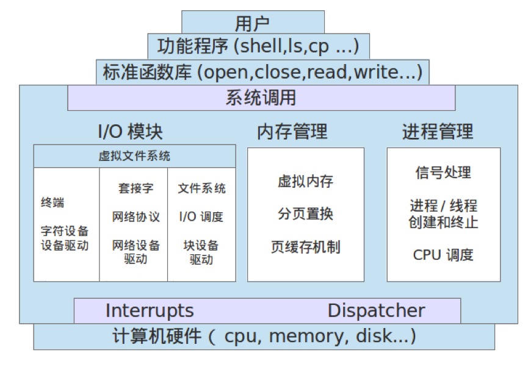
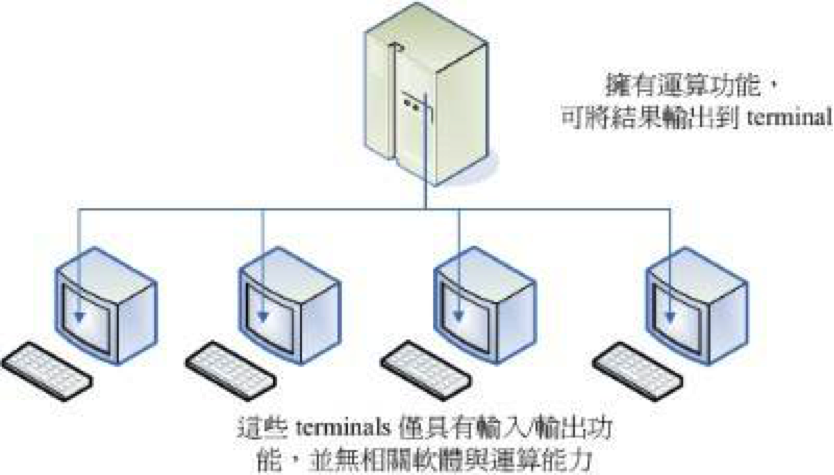
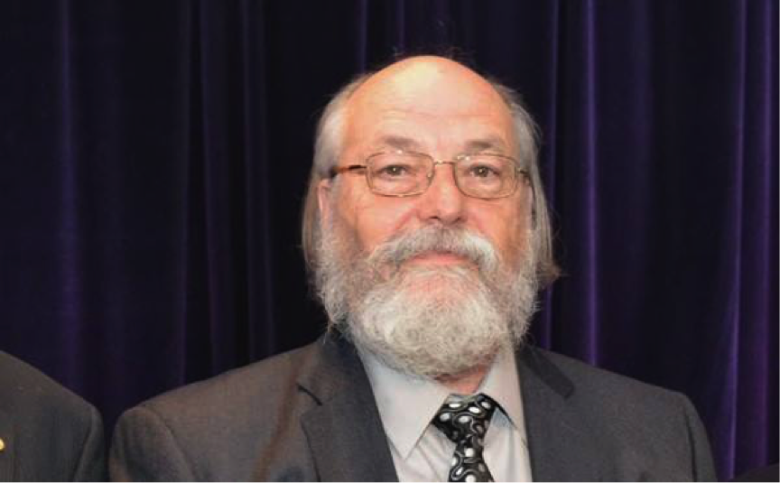
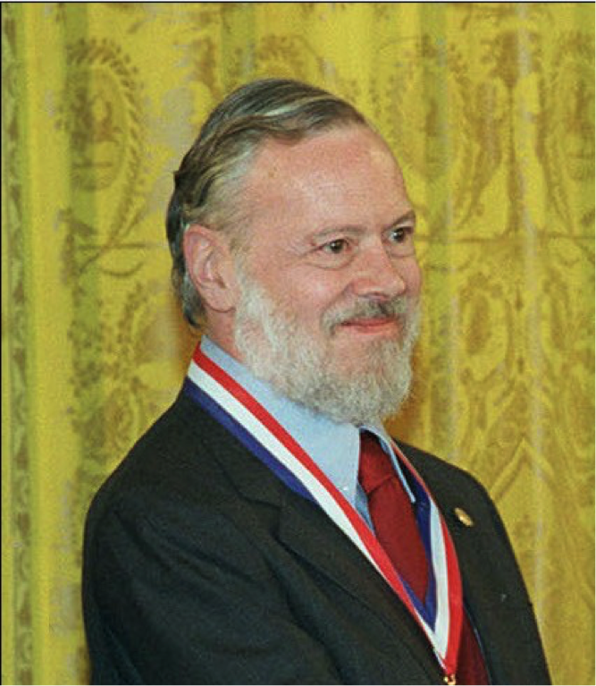
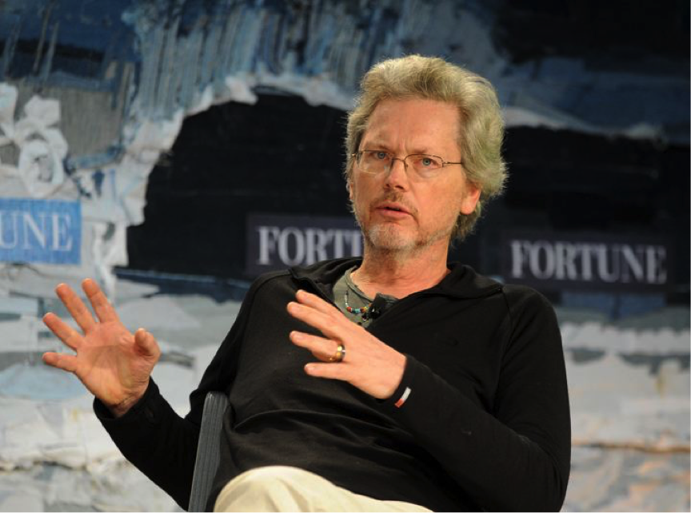
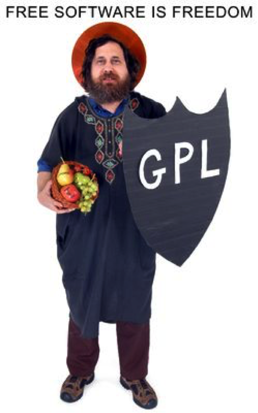
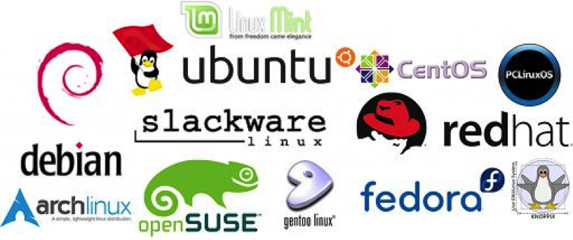

# 1、操作系统

计算机本质上是一堆半导体原件堆成的装置，没有程序控制的计算机约等于一堆废铁。在早期想要让计算机执行程序就得要参考一堆硬件功能函数，并且学习机器语言，其中有些是很多程序都会使用到的基本功能，比如让CPU执行判断逻辑与运算数值、让内存存取程序、让网卡传输数据、让打印机打印文件等，为了方便工程师开发软件，人们就将这些常用的硬件驱动程序汇集到一起，并提供一组标准的接口供工程师调用，这就是**操作系统**（Operating System，简称OS）的原型。

简而言之，操作系统是一个“大管家”，指挥CPU、内存、硬盘、键盘、鼠标、显示器等设备有条不紊地运行起来。

操作系统位于底层硬件与用户之间，是两者沟通的桥梁。用户可以通过操作系统的用户界面，输入命令。操作系统则对命令进行解释，驱动硬件设备，实现用户要求。

操作系统至少具有以下功能：

- **进程管理**
  进程是具有一定独立功能的程序关于某个数据集合上的一次运行活动，是系统进行资源分配和调度的一个独立单位。进程管理又称处理器管理，其主要任务是对处理器的时间进行合理分配、对处理器的运行实施有效的管理。
- **存储器管理**
  由于多道程序共享内存资源，所以存储器管理的主要任务是对存储器进行分配、保护和扩充。

- **设备管理**
  根据确定的设备分配原则对设备进行分配，使设备与主机能够并行工作，为用户提供良好的设备使用界面。

- **文件管理**
  文件管理主要涉及文件的逻辑组织和物理组织，目录的结构和管理。从系统角度来看，文件系统是对文件存储器的存储空间进行组织，分配和回收，负责文件的存储，检索，共享和保护。从用户角度来看，文件系统主要是实现“按名取存”，文件系统的用户只要知道所需文件的文件名，就可存取文件中的信息，而无需知道这些文件究竟存放在什么地方。
- **用户接口**
  用户操作计算机的界面称为**用户接口**（或用户界面），通过用户接口，用户只需进行简单操作，就能实现复杂的应用处理。用户接口有两种类型：
  - 命令接口：用户通过交互命令方式直接或间接地对计算机进行操作。
  - 程序接口：供用户以程序方式进行操作。程序接口也称为应用程序编程接口（Application Programming Interface，API），用户通过API可以调用系统提供的例行程序，实现既定的操作。

 Linux是一套风靡全球的操作系统，它的诞生颇具传奇色彩，有很多神一般存在的大牛都曾直接或间接的为它出力，就跟华山论剑一样，神人辈出，各领风骚，我等渣渣远观一下也就够了。

# 2、三巨头与Multics

早起的计算机不像现在这样普及，是一件花费巨大的奢侈品，一般只有财大气粗的军事单位、科研机构、高校才能买得起。那时候，由于一台主机同时只能供一人使用，使用者经常需要排队，使用率异常低下。

1960 年代初期麻省理工学院 (MIT) 发展了所谓的“**兼容分时系统**”( Compatible Time-Sharing System, CTSS )， 它可以让大型主机透过提供数个终端机以联机进入主机，来利用主机的资源进行运算工作。架构有点像这样：

为了更加强化大型主机的系统，以让主机的资源可以提供更多使用者来利用，在1965 年前后， 由三个贝尔实验室 (Bell)、麻省理工学院 (MIT) 及通用公司 (GE) 共同发起了 **Multics** 计划，Multics 目的是想要让大型主机可以达成提供 300 个以上的终端机联机使用的目标。 不过，到了 1969 年前后，计划进度落后，资金也短缺，所以该计划半路夭折了。

# 3、Ken Thompson与Unics

参与Multics计划当中有一位来自贝尔实验室的大神——**肯·汤普森**（Ken Thompson）：

 1969年8月份左右，汤普森的妻儿去探亲，他为了使一款名为“星际旅行”（star travel）的游戏可运行于Multics，经过四个星期的奋斗，用编译语言写出来一个核心程序，同时包括一些工具及档案系统。当时汤普森将Multics庞大的复杂系统简化了不少，于是同实验室的朋友都戏称这个系统为“Unics”，这就是Unix的原型。

也就是这一年，Linux之父Linus Torvalds在芬兰出生。

汤普森爷爷还有段佳话，他开发的操作系统最早被安装在贝尔实验室里供大家日常使用。很快大家就发现汤普森爷爷总能进入他们的帐户，获得最高权限。贝尔实验室里的科学家都心比天高，当然被搞得郁闷无比。于是有高手怒了，跳出来分析了他的代码，找到后门，修改代码，然后重新编译。就在大家都以为“这个世界清净了”的时候，他们发现汤普森爷爷还是轻而易举地拿到他们的帐户权限，百思不解后，只好继续郁闷。谁知道这一郁闷，就郁闷了14年，直到汤普森爷爷获得图灵奖之后，发表自己获奖感言时道出个其中缘由。原来，代码里的确有后门，但后门不在代码里，而在编译代码的C编译器里。

顺便提一下，汤普森爷爷在退休之后，离开贝尔实验室，成为一名飞行员。

大神就是大神，向来不走寻常路。

# 4、Dennis Ritchie与Unix

汤普森有一个好基友——**丹尼斯·里奇**（Dennis Ritchie），两人均是计算机历史上开天辟地的人物。

Unix 本来是以编译语言写成的，后来因为系统移植与效能的需求， 该系统被 B 语言所改写。不过，效能依旧不是很好。后来，丹尼斯·里奇将 B 语言重新改写成 C 语言，C 语言算是比较高阶的程序语言，可以在不同的机器上面运作， 因此丹尼斯·里奇被称为**C语言之父**。

汤普森与里奇成功地用C语言重写了Unix的第三版内核。至此，Unix这个操作系统修改、移植相当便利，为Unix日后的普及打下了坚实的基础。而Unix和C完美地结合成为一个统一体，C与Unix很快成为世界的主导。

# 5、Bill Joy与BSD

虽然贝尔实验室属于 AT&T 公司，但是 AT&T 此时对于 Unix 是采取开放的态度， 此外， Unix 是以高阶的C语言写成的，具有很好的可移植性。所以，只要取得 Unix 的原始码，并且针对大型主机的特性加以修改，就可以将 Unix 移植到另一部不同的主机上头了。所以在 1973 年以后， Unix 便得以与学术界合作开发。最重要的接触就是与加州伯克利 ( Berkeley ) 大学的合作了。伯克利大学的**比尔·乔伊**(Bill Joy) 在取得了 Unix 的核心原始码后，着手修改成适合自己机器的版本，并且同时增加了很多工具软件与编译程序，最终将他命名为 Berkeley Software Distribution (**BSD**)。

比尔·乔伊也是一位大神级别的人物，随便举个例子。TCP/IP协议出来以后，一直都没有人写出一个能用的TCP/IP栈，比尔•乔伊同学就写了一个放出来了，大家都很诧异，就问比尔•乔伊同学是怎么写的。比尔•乔伊回答说，我就是一边看着RFC，一边写就好了啊……其他人唯有吐血而已。直到很多年以后，BSD上的TCP/IP栈还都是网络世界的基石。

除此之外，他还是神器VI、CShell的作者，Sparc处理器设计者之一，后来创建了SUN（Stanford University Network）公司，90年代的SUN大约如现在的Google，该公司还是JAVA语言的诞生地。

不多说了，颤抖吧，无知的人类。

# 6、Richard Stallman与GNU

由于 Unix 的高度可移植性，加上当时并没有版权的纠纷，所以让很多商业公司开始了 Unix 操作系统的发展，例如 AT&T 自家的 System V、IBM 的 AIX 以及 HP 与 DEC 等公司，都有推出自家的主机搭配自己的 Unix 操作系统。

1979年 AT&T 出于商业的考虑将想 Unix 的版权收回去，造成 Unix 业界之间的紧张气氛，并且引爆了很多的商业纠纷。

AT&T的这种商业态度，让当时许许多的Unix的爱好者和软件开发者们感到相当的痛心和忧虑，他们认为商业化的种种限制并不利于产生的发展，相反还能导制产品出现诸多的问题。随着商业化Unix的版本的种种限制和诸多问题，引起了大众的不满和反对。于是，大家开始有组织地结成“反叛联盟”以此对抗欺行罢市的AT&T等商业化行为。这个新思潮对IT业产生了非常深远影响。为整个计算机世界带来了革命性的价值观。

此时，一个名叫**理查德·斯托曼**（Richard Stallman）的领袖出现了，他认为Unix是一个相当好的操作系统，如果大家都能够将自己所学贡献出来，那么这个系统将会更加的优异！他倡导的Open Source的概念，就是针对Unix这一事实反对实验室里的产品商业化、私有化。

为了这个理想，理查德•斯托曼于1984年创业了**GNU**（GNU's Not Unix的缩写），计划开发一套与Unix相互兼容的的软件。1985 年理查德•斯托曼又创立了**自由软件基金会**（Free Software Foundation，FSF）来为 GNU 计划提供技术、法律以及财政支持。

为了构建开放、自由的Unix环境，理查德•斯托曼开发出来一系列大名鼎鼎的软件，每个单独拿出来都够人骄傲一辈子：

- Emacs
- GNU C (gcc)

- GNU C Library (glibc)

- Bash shell

它们至今依然是Unix世界的中流砥柱。

到了 1985 年，为了避免 GNU 所开发的自由软件被其它人所利用而成为专利软件， 所以斯托曼与律师草拟了有名的**通用公共许可证** (General Public License, **GPL**)， 并且幽默地称呼它为 copyleft (相对于专利软件的 copyright)。

首先， 斯托曼对GPL一直是强调 Free 的，这个 Free 的意思是这样的：

>  **"Free software" is a matter of liberty, not price. To understand the concept, you should think of "free speech", not "free beer". "Free software" refers to the users freedom to run, copy, distribute, study, change, and improve the software** 
>

一个软件挂上了 GPL 版权宣告之后，他自然就成了自由软件！，这个软件就具有底下的特色：

- 取得软件与原始码：您可以根据自己的需求来执行这个自由软件；
- 复制：您可以自由的复制该软件；

- 修改：您可以将取得的原始码进行程序修改工作，使之适合您的工作；

- 再发行：您可以将您修改过的程序，再度的自由发行，而不会与原先的撰写者冲突；

- 回馈：您应该将您修改过的程序代码回馈于社群

从那时开始，许多程序员聚集起来开始开发一个自由的、高质量、易理解的软件，让这使得Unix社区生机勃勃，一派繁荣景象。

# 7、Linus Torvalds与Linux

GNU计划的最初构想是建立一个“自由的 Unix 操作系统”，但是当时并没有一款“自由的Unix 核心”存在……所以GNU软件只能在那些有专利的 Unix 平台上工作，一直到 Linux 的出现。

1990年，**林纳斯·托瓦兹**（Linus Torvalds）还是芬兰赫尔辛基大学的一名学生，最初是用汇编语言写了一个在80386保护模式下处理多任务切换的程序，后来从Minix（Andy Tanenbaum教授所写的很小 的Unix操作系统，主要用于操作系统教学）得到灵感，进一步产生了自认为狂妄的想法——写一个比Minix更好的系统，于是开始写了一些硬件的设备驱动程序，一个小的文件系统。这样0.0.1版本的Linux就出来了，但是它只具有操作系统内核的勉强的雏形，甚至不能运行，必须在有Minix的机器上编译以后才能玩。这时候托瓦兹已经完全着迷而不想停止，决定踢开Minix，使用GNU的bash操作接口与 gcc 编译器等自由软件来开发一套独立的操作系统核心。

开发完成后，他希望这个程序可以获得大家的一些修改建议，于是在1991年10 月5号他便将这个核心放置在网络上提供大家下载，同时在 BBS 上面贴了一则消息：

> **Hello everybody out there using minix-** 
>
> **I'm doing a (free) operation system (just a hobby,** 
>
> **won't be big and professional like gnu) for 386(486) AT clones.** 

因为托瓦兹放置核心的那个 FTP 网站的目录为： Linux ， 从此，大家便称这个核心为 Linux 了。

同时，为了让自己的 Linux 能够兼容于 Unix 系统，托瓦兹开始将一些能够在Unix上面运作的软件拿来在 Linux 上面跑。不过，他发现有很多的软件无法在 Linux 这个核心上运作，于是托瓦兹开始参考标准的**POSIX规范**。POSIX表示**可移植操作系统接口**（Portable Operating System Interface of UNIX），POSIX标准定义了操作系统应该为应用程序提供的接口标准，是IEEE为要在各种UNIX操作系统上运行的软件而定义的一系列API标准的总称。只要是依据这些标准规范来设计的核心与软件，理论上就可以搭配在一起运行了。 而 Linux 的发展就是依据这个 POSIX 的标准规范， Unix 上面的软件也是遵循这个规范来设计的， 如此一来，让 Linux 很容易就与 Unix 兼容共享互有的软件。

在自由软件之父理查德·斯托曼的精神感召下，托瓦兹很快以Linux的名字把这款类Unix的操作系统加入到了自由软件基金（FSF）的GNU计划中，并通过GPL的通用性授权。

无疑，正是托瓦兹的这一举措带给了Linux和他自己巨大的成功和极高的声誉。短短几年间，在Linux身边已经聚集了成千上万的狂热分子，大家不计得失的为Linux增补、修改，并随之将开源运动的自由主义精神传扬下去，人们几乎像看待神明一样对林纳斯顶礼膜拜。

# 8、Linux发行版

严格来讲，Linux这个词本身只表示Linux内核，但在实际上人们已经习惯了用Linux来形容整个基于Linux内核，并且使用GNU 工程各种工具和应用程序的操作系统(也被称为GNU/Linux)。很多的商业公司或非营利团体，将 Linux Kernel (含 tools ) 与可运行的软件整合起来，加上自己具有创意的工具程序，组装成一套可完整安装的系统，我们称之为**Linux发行版**（Linux distribution）。一般来讲，一个Linux发行套件包含大量的软件，比如软件开发工具，数据库，Web服务器（例如Apache），X Window，桌面环境（比如GNOME和KDE），办公套件（比如OpenOffice.org），等等。

不过，由于发展Linux distributions的公司实在太多了，例如有名的 Red Hat, Fedora,Mandriva, Debian,SuSE,Ubuntu,CentOS等等，所以很多人都很担心，如此一来每个 distribution 是否都不相同呢？这就无需担心了，因为每个 Linux distributions 使用的 kernel 都是http://www.kernel.org所释出的，而他们所选择的软件，几乎都是目前很知名的软件，重复性相当的高。此外，为了让所有的 Linux distributions 开发不致于差异太大，还有 Linux Standard Base (**LSB**) 来规范开发者，以及目录架构的 File system Hierarchy Standard (**FHS**) 规范。 唯一差别的，就是该开发者自家所开发出来的管理工具，以及套件管理的模式等。 所以说，基本上，每个 Linux distributions 除了架构的严谨度与选择的套件内容外， 其实差异并不太大。