同步IO和异步IO，阻塞IO和非阻塞IO分别是什么，到底有什么区别？不同的人在不同的上下文下给出的答案是不同的。所以先限定一下本文的上下文：本文讨论的背景是**Linux环境下的network IO**。

# 1、相关概念

## 1.1 用户空间与内核空间

现在操作系统都是采用虚拟存储器，那么对32位操作系统而言，它的寻址空间（虚拟存储空间）为4G（2的32次方）。操作系统的核心是内核，独立于普通的应用程序，可以访问受保护的内存空间，也有访问底层硬件设备的所有权限。为了保证用户进程不能直接操作内核（kernel），保证内核的安全，操心系统将虚拟空间划分为两部分，一部分为内核空间，一部分为用户空间。针对linux操作系统而言，将最高的1G字节（从虚拟地址`0xC0000000`到`0xFFFFFFFF`），供内核使用，称为**内核空间**，而将较低的3G字节（从虚拟地址`0x00000000`到`0xBFFFFFFF`），供各个进程使用，称为**用户空间**。

## 1.2 进程切换

为了控制进程的执行，内核必须有能力挂起正在CPU上运行的进程，并恢复以前挂起的某个进程的执行。这种行为被称为**进程切换**。因此可以说，任何进程都是在操作系统内核的支持下运行的，是与内核紧密相关的。

从一个进程的运行转到另一个进程上运行，要经过下面这些变化：

1. 保存处理机上下文，包括程序计数器和其他寄存器
2. 更新PCB信息
3. 把进程的PCB移入相应的队列，如就绪、在某事件阻塞等队列
4. 选择另一个进程执行，并更新其PCB
5. 更新内存管理的数据结构
6.  恢复处理机上下文

总而言之，就是很耗资源。

## 1.3 文件描述符fd

**文件描述符**（File descriptor）是计算机科学中的一个术语，是一个用于表述指向文件的引用的抽象化概念。

文件描述符在形式上是一个非负整数。实际上，它是一个索引值，指向内核为每一个进程所维护的该进程打开文件的记录表。当程序打开一个现有文件或者创建一个新文件时，内核向进程返回一个文件描述符。在程序设计中，一些涉及底层的程序编写往往会围绕着文件描述符展开。但是文件描述符这一概念往往只适用于UNIX、Linux这样的操作系统。

## 1.4 缓存 I/O

缓存 I/O 又被称作标准 I/O，大多数文件系统的默认 I/O 操作都是缓存 I/O。在 Linux 的缓存 I/O 机制中，操作系统会将 I/O 的数据缓存在文件系统的页缓存（ page cache ）中，也就是说，数据会先被拷贝到操作系统内核的缓冲区中，然后才会从操作系统内核的缓冲区拷贝到应用程序的地址空间。

**缓存 I/O 的缺点：**数据在传输过程中需要在应用程序地址空间和内核进行多次数据拷贝操作，这些数据拷贝操作所带来的 CPU 以及内存开销是非常大的。

## 1.5 阻塞调用与非阻塞调用

正在执行的进程，由于期待的某些事件未发生，如请求系统资源失败、等待某种操作的完成、新数据尚未到达或无新工作做等，则由系统自动执行**阻塞**原语(Block)，使自己由运行状态变为阻塞状态。可见，进程的阻塞是进程自身的一种主动行为，也因此只有处于运行态的进程（获得CPU），才可能将其转为阻塞状态。当进程进入阻塞状态，是不占用CPU资源的。

**阻塞调用**是指调用结果返回之前，当前线程会被挂起。调用线程只有在得到结果之后才会返回。 **非阻塞调用**指在不能立刻得到结果之前，该调用不会阻塞当前线程。

两者的最大区别在于被调用方在收到请求到返回结果之前的这段时间内，调用方是否一直在等待。

阻塞是指调用方一直在等待而且别的事情什么都不做；非阻塞是指调用方先去忙别的事情。

## 1.6 同步处理与异步处理

**同步处理**是指被调用方得到最终结果之后才返回给调用方；**异步处理**是指被调用方先返回应答，然后再计算调用结果，计算完最终结果后再通知并返回给调用方。

## 1.7 阻塞、非阻塞和同步、异步的区别

阻塞、非阻塞和同步、异步其实针对的对象是不一样的： 

- 阻塞、非阻塞的讨论对象是**调用者**
- 同步、异步的讨论对象是**被调用者**

# 2、IO模型

服务端处理网络请求的典型过程如下：

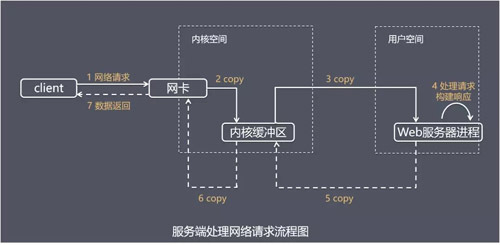

主要处理步骤包括：

- 获取请求数据，客户端与服务器建立连接发出请求，服务器接受请求（1-3）。 
- 构建响应，当服务器接收完请求，并在用户空间处理客户端的请求，直到构建响应完成（4）。 
- 返回数据，服务器将已构建好的响应再通过内核空间的网络 I/O 发还给客户端（5-7）。

设计服务端并发模型时，主要有如下两个关键点：

- 服务器如何管理连接，获取输入数据。 
- 服务器如何处理请求。

正式因为这两个阶段，Linux系统产生了下面五种网络模式的方案：

- 阻塞 I/O（blocking IO）
- 非阻塞 I/O（nonblocking IO）
- I/O 多路复用（ IO multiplexing）
- 信号驱动 I/O（ signal driven IO）
- 异步 I/O（asynchronous IO）

## 2.1 阻塞 I/O（blocking IO）

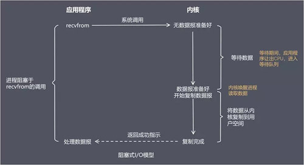

在阻塞式 I/O 模型中，应用程序在从调用 `recvfrom` 开始到它返回有数据报准备好这段时间是阻塞的，`recvfrom` 返回成功后，应用进程开始处理数据报。

**比喻**：一个人在钓鱼，当没鱼上钩时，就坐在岸边一直等。

**优点**：程序简单，在阻塞等待数据期间进程/线程挂起，基本不会占用 CPU 资源。

**缺点**：每个连接需要独立的进程/线程单独处理，当并发请求量大时为了维护程序，内存、线程切换开销较大，这种模型在实际生产中很少使用。

## 2.2 非阻塞 I/O（nonblocking IO）

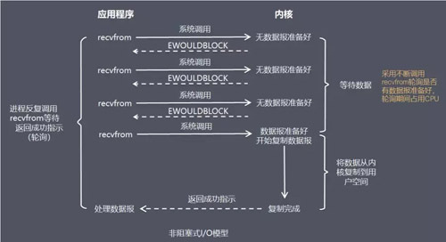

在非阻塞式 I/O 模型中，应用程序把一个套接口设置为非阻塞，就是告诉内核，当所请求的 I/O 操作无法完成时，不要将进程睡眠。而是返回一个错误，应用程序基于 I/O 操作函数将不断的轮询数据是否已经准备好，如果没有准备好，继续轮询，直到数据准备好为止。

**比喻**：边钓鱼边玩手机，隔会再看看有没有鱼上钩，有的话就迅速拉杆。

**优点**：不会阻塞在内核的等待数据过程，每次发起的 I/O 请求可以立即返回，不用阻塞等待，实时性较好。

**缺点**：轮询将会不断地询问内核，这将占用大量的 CPU 时间，系统资源利用率较低，所以一般 Web 服务器不使用这种 I/O 模型。

## 2.3 I/O 多路复用（ IO multiplexing）

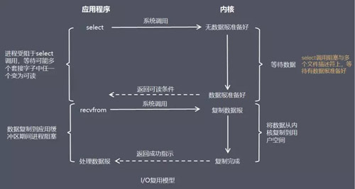

在 I/O 复用模型中，会用到 `Select` 或 `Poll` 函数或 `Epoll` 函数(Linux 2.6 以后的内核开始支持)，这两个函数也会使进程阻塞，但是和阻塞 I/O 有所不同。

这两个函数可以同时阻塞多个 I/O 操作，而且可以同时对多个读操作，多个写操作的 I/O 函数进行检测，直到有数据可读或可写时，才真正调用 I/O 操作函数。

**比喻**：放了一堆鱼竿，在岸边一直守着这堆鱼竿，没鱼上钩就玩手机。

**优点**：可以基于一个阻塞对象，同时在多个描述符上等待就绪，而不是使用多个线程(每个文件描述符一个线程)，这样可以大大节省系统资源。

**缺点**：当连接数较少时效率相比多线程+阻塞 I/O 模型效率较低，可能延迟更大，因为单个连接处理需要 2 次系统调用，占用时间会有增加。

#### select、poll与epoll

`select`，`poll`，`epoll`都是IO多路复用的机制。**I/O多路复用**就是通过一种机制，一个进程可以监视多个描述符，一旦某个描述符就绪（一般是读就绪或者写就绪），能够通知程序进行相应的读写操作。但`select`，`poll`，`epoll`本质上都是同步I/O，因为他们都需要在读写事件就绪后自己负责进行读写，也就是说这个读写过程是阻塞的，而异步I/O则无需自己负责进行读写，异步I/O的实现会负责把数据从内核拷贝到用户空间。

`select`目前几乎在所有的平台上支持，其良好跨平台支持也是它的一个优点。

`select`的一个缺点在于**单个进程能够监视的文件描述符的数量存在最大限制，在Linux上一般为1024**，可以通过修改宏定义甚至重新编译内核的方式提升这一限制，但是这样也会造成效率的降低。

从上面看，select和poll都需要在返回后，**通过遍历文件描述符来获取已经就绪的socket**。事实上，同时连接的大量客户端在一时刻可能只有很少的处于就绪状态，因此随着监视的描述符数量的增长，其效率也会线性下降。

`epoll`是在2.6内核中提出的，是之前的`select`和`poll`的增强版本。相对于`select`和`poll`来说，`epoll`更加灵活，没有描述符限制。`epoll`使用一个文件描述符管理多个描述符，将用户关系的文件描述符的事件存放到内核的一个事件表中，这样在用户空间和内核空间的copy只需一次。

在 `select/poll`中，进程只有在调用一定的方法后，内核才对所有监视的文件描述符进行扫描，而`epoll`事先通过`epoll_ctl()`来注册一个文件描述符，一旦基于某个文件描述符就绪时，内核会采用类似callback的回调机制，迅速激活这个文件描述符，当进程调用`epoll_wait()` 时便得到通知。

**`epoll`去掉了遍历文件描述符，而是通过监听回调的的机制**。这正是epoll的魅力所在。

`select`的最大缺点就是进程打开的`fd`是有数量限制的。这对于连接数量比较大的服务器来说根本不能满足。虽然也可以选择多进程的解决方案( Apache就是这样实现的)，不过虽然linux上面创建进程的代价比较小，但仍旧是不可忽视的，加上进程间数据同步远比不上线程间同步的高效，所以也不是一种完美的方案。而`epoll`监视的描述符数量不受限制，它所支持的`fd`上限是最大可以打开文件的数目，这个数字一般远大于2048，举个例子，在1GB内存的机器上大约是10万左右，具体数目可以`cat /proc/sys/fs/file-max`察看，一般来说这个数目和系统内存关系很大。

`epoll`不同于`select/poll`轮询的方式，而是通过每个`fd`定义的回调函数来实现的，只有就绪的fd才会执行回调函数。所以，IO的效率不会随着监视fd的数量的增长而下降。

如果没有大量的`idle -connection`或者`dead-connection`，`epoll`的效率并不会比`select/poll`高很多，但是当遇到大量的`idle- connection`，就会发现`epoll`的效率大大高于`select/poll`。

## 2.4 信号驱动 I/O（ signal driven IO）

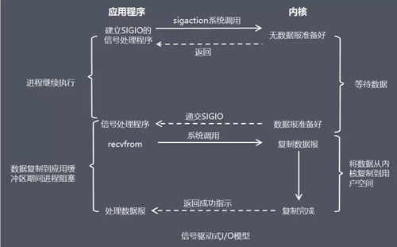

在信号驱动式 I/O 模型中，应用程序使用套接口进行信号驱动 I/O，并安装一个信号处理函数，进程继续运行并不阻塞。

当数据准备好时，进程会收到一个 SIGIO 信号，可以在信号处理函数中调用 I/O 操作函数处理数据。

**比喻**：鱼竿上系了个铃铛，当铃铛响，就知道鱼上钩，然后可以专心玩手机。

**优点**：线程并没有在等待数据时被阻塞，可以提高资源的利用率。

**缺点**：信号 I/O 在大量 IO 操作时可能会因为信号队列溢出导致没法通知。

信号驱动 I/O 尽管对于处理 UDP 套接字来说有用，即这种信号通知意味着到达一个数据报，或者返回一个异步错误。

但是，对于 TCP 而言，信号驱动的 I/O 方式近乎无用，因为导致这种通知的条件为数众多，每一个来进行判别会消耗很大资源，与前几种方式相比优势尽失。

## 2.5 异步 I/O（asynchronous IO）

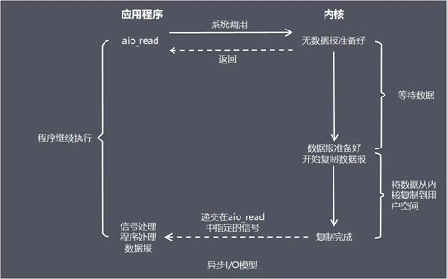

由 POSIX 规范定义，应用程序告知内核启动某个操作，并让内核在整个操作（包括将数据从内核拷贝到应用程序的缓冲区）完成后通知应用程序。

这种模型与信号驱动模型的主要区别在于：信号驱动 I/O 是由内核通知应用程序何时启动一个 I/O 操作，而异步 I/O 模型是由内核通知应用程序 I/O 操作何时完成。

**优点**：异步 I/O 能够充分利用 DMA 特性，让 I/O 操作与计算重叠。

**缺点**：要实现真正的异步 I/O，操作系统需要做大量的工作。目前 Windows 下通过 IOCP 实现了真正的异步 I/O。

而在 Linux 系统下，Linux 2.6才引入，目前 AIO 并不完善，因此在 Linux 下实现高并发网络编程时都是以 IO 复用模型模式为主。

## 2.6 总结

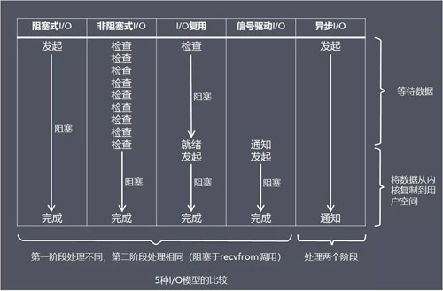

从上图中我们可以看出，越往后，阻塞越少，理论上效率也是最优。

这五种 I/O 模型中，前四种属于同步 I/O，因为其中真正的 I/O 操作(recvfrom)将阻塞进程/线程，只有异步 I/O 模型才与 POSIX 定义的异步 I/O 相匹配。

# 3、线程模型

介绍完服务器如何基于 I/O 模型管理连接，获取输入数据，下面介绍基于进程/线程模型，服务器如何处理请求。

值得说明的是，具体选择线程还是进程，更多是与平台及编程语言相关。

例如 C 语言使用线程和进程都可以(例如 Nginx 使用进程，Memcached 使用线程)，Java 语言一般使用线程(例如 Netty)，为了描述方便，下面都使用线程来进行描述。

## 3.1 传统阻塞 I/O 服务模型

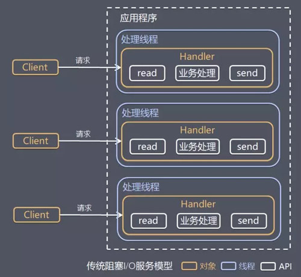

**特点**：采用阻塞式 I/O 模型获取输入数据。 每个连接都需要独立的线程完成数据输入，业务处理，数据返回的完整操作。

**存在问题**：当并发数较大时，需要创建大量线程来处理连接，系统资源占用较大。 连接建立后，如果当前线程暂时没有数据可读，则线程就阻塞在 Read 操作上，造成线程资源浪费。

## 3.2 Reactor 模式

针对传统阻塞 I/O 服务模型的 2 个缺点，比较常见的有如下解决方案：

- 基于 I/O 复用模型，多个连接共用一个阻塞对象，应用程序只需要在一个阻塞对象上等待，无需阻塞等待所有连接。当某条连接有新的数据可以处理时，操作系统通知应用程序，线程从阻塞状态返回，开始进行业务处理。
- 基于线程池复用线程资源，不必再为每个连接创建线程，将连接完成后的业务处理任务分配给线程进行处理，一个线程可以处理多个连接的业务。

I/O 复用结合线程池，这就是 Reactor 模式基本设计思想，如下图：

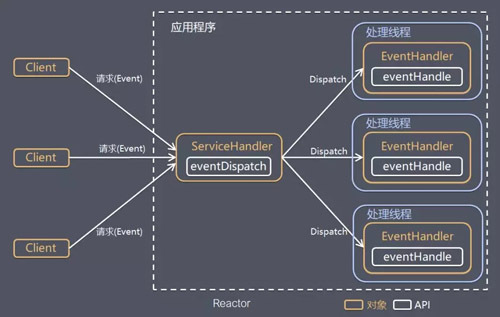

**Reactor 模式**，是指通过一个或多个输入同时传递给服务处理器的服务请求的事件驱动处理模式。

服务端程序处理传入多路请求，并将它们同步分派给请求对应的处理线程，Reactor 模式也叫 **Dispatcher 模式**。

即 I/O 多了复用统一监听事件，收到事件后分发(Dispatch 给某进程)，是编写高性能网络服务器的必备技术之一。

Reactor 模式中有 2 个关键组成：

- Reactor，Reactor 在一个单独的线程中运行，负责监听和分发事件，分发给适当的处理程序来对 IO 事件做出反应。 它就像公司的电话接线员，它接听来自客户的电话并将线路转移到适当的联系人。
-  Handlers，处理程序执行 I/O 事件要完成的实际事件，类似于客户想要与之交谈的公司中的实际官员。Reactor 通过调度适当的处理程序来响应 I/O 事件，处理程序执行非阻塞操作。

根据 Reactor 的数量和处理资源池线程的数量不同，有 3 种典型的实现。

### 3.2.1 单 Reactor 单线程

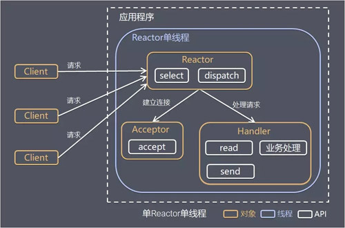

其中，Select 是前面 I/O 复用模型介绍的标准网络编程 API，可以实现应用程序通过一个阻塞对象监听多路连接请求，其他方案示意图类似。

Reactor 对象通过 Select 监控客户端请求事件，收到事件后通过 Dispatch 进行分发。

如果是建立连接请求事件，则由 Acceptor 通过 Accept 处理连接请求，然后创建一个 Handler 对象处理连接完成后的后续业务处理。 如果不是建立连接事件，则 Reactor 会分发调用连接对应的 Handler 来响应。 Handler 会完成 Read→业务处理→Send 的完整业务流程。

**优点**：模型简单，没有多线程、进程通信、竞争的问题，全部都在一个线程中完成。

**缺点**：性能问题，只有一个线程，无法完全发挥多核 CPU 的性能。Handler 在处理某个连接上的业务时，整个进程无法处理其他连接事件，很容易导致性能瓶颈。可靠性问题，线程意外跑飞，或者进入死循环，会导致整个系统通信模块不可用，不能接收和处理外部消息，造成节点故障。

**使用场景**：客户端的数量有限，业务处理非常快速，比如 Redis，业务处理的时间复杂度 O(1)。

### 3.2.2 单 Reactor 多线程

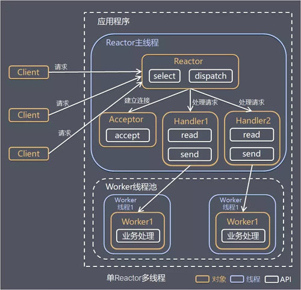

Reactor 对象通过 Select 监控客户端请求事件，收到事件后通过 Dispatch 进行分发。 如果是建立连接请求事件，则由 Acceptor 通过 Accept 处理连接请求，然后创建一个 Handler 对象处理连接完成后续的各种事件。 如果不是建立连接事件，则 Reactor 会分发调用连接对应的 Handler 来响应。 Handler 只负责响应事件，不做具体业务处理，通过 Read 读取数据后，会分发给后面的 Worker 线程池进行业务处理。 Worker 线程池会分配独立的线程完成真正的业务处理，如何将响应结果发给 Handler 进行处理。 Handler 收到响应结果后通过 Send 将响应结果返回给 Client。

**优点**：可以充分利用多核 CPU 的处理能力。

**缺点**：多线程数据共享和访问比较复杂；Reactor 承担所有事件的监听和响应，在单线程中运行，高并发场景下容易成为性能瓶颈。

### 3.2.3 主从 Reactor 多线程

针对单 Reactor 多线程模型中，Reactor 在单线程中运行，高并发场景下容易成为性能瓶颈，可以让 Reactor 在多线程中运行。

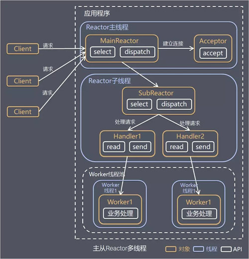

Reactor 主线程 MainReactor 对象通过 Select 监控建立连接事件，收到事件后通过 Acceptor 接收，处理建立连接事件。 Acceptor 处理建立连接事件后，MainReactor 将连接分配 Reactor 子线程给 SubReactor 进行处理。 SubReactor 将连接加入连接队列进行监听，并创建一个 Handler 用于处理各种连接事件。 当有新的事件发生时，SubReactor 会调用连接对应的 Handler 进行响应。 Handler 通过 Read 读取数据后，会分发给后面的 Worker 线程池进行业务处理。 Worker 线程池会分配独立的线程完成真正的业务处理，如何将响应结果发给 Handler 进行处理。 Handler 收到响应结果后通过 Send 将响应结果返回给 Client。

**优点**：父线程与子线程的数据交互简单职责明确，父线程只需要接收新连接，子线程完成后续的业务处理。父线程与子线程的数据交互简单，Reactor 主线程只需要把新连接传给子线程，子线程无需返回数据。

**使用场景**：这种模型在许多项目中广泛使用，包括 Nginx 主从 Reactor 多进程模型，Memcached 主从多线程，Netty 主从多线程模型的支持。

### 3.2.4 总结

3 种模式可以用个比喻来理解：餐厅常常雇佣接待员负责迎接顾客，当顾客入坐后，侍应生专门为这张桌子服务。

- 单 Reactor 单线程，接待员和侍应生是同一个人，全程为顾客服务。 
- 单 Reactor 多线程，1 个接待员，多个侍应生，接待员只负责接待。 
- 主从 Reactor 多线程，多个接待员，多个侍应生。

Reactor 模式具有如下的优点：

响应快，不必为单个同步时间所阻塞，虽然 Reactor 本身依然是同步的。 编程相对简单，可以最大程度的避免复杂的多线程及同步问题，并且避免了多线程/进程的切换开销。 可扩展性，可以方便的通过增加 Reactor 实例个数来充分利用 CPU 资源。 可复用性，Reactor 模型本身与具体事件处理逻辑无关，具有很高的复用性。

## 3.3 Proactor 模型

在 Reactor 模式中，Reactor 等待某个事件或者可应用或者操作的状态发生（比如文件描述符可读写，或者是 Socket 可读写）。

然后把这个事件传给事先注册的 Handler（事件处理函数或者回调函数），由后者来做实际的读写操作。

其中的读写操作都需要应用程序同步操作，所以 **Reactor 是非阻塞同步网络模型**。

如果把 I/O 操作改为异步，即交给操作系统来完成就能进一步提升性能，这就是**异步网络模型 Proactor**。

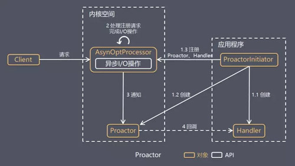

Proactor Initiator 创建 Proactor 和 Handler 对象，并将 Proactor 和 Handler 都通过 AsyOptProcessor（Asynchronous Operation Processor）注册到内核。 AsyOptProcessor 处理注册请求，并处理 I/O 操作。 AsyOptProcessor 完成 I/O 操作后通知 Proactor。 Proactor 根据不同的事件类型回调不同的 Handler 进行业务处理。 Handler 完成业务处理。

可以看出 Proactor 和 Reactor 的区别：Reactor 是在事件发生时就通知事先注册的事件（读写在应用程序线程中处理完成）。 Proactor 是在事件发生时基于异步 I/O 完成读写操作（由内核完成），待 I/O 操作完成后才回调应用程序的处理器来进行业务处理。

理论上 Proactor 比 Reactor 效率更高，异步 I/O 更加充分发挥 DMA(Direct Memory Access，直接内存存取)的优势，但是有如下缺点：

- 编程复杂性，由于异步操作流程的事件的初始化和事件完成在时间和空间上都是相互分离的，因此开发异步应用程序更加复杂。应用程序还可能因为反向的流控而变得更加难以 Debug。 
- 内存使用，缓冲区在读或写操作的时间段内必须保持住，可能造成持续的不确定性，并且每个并发操作都要求有独立的缓存，相比 Reactor 模式，在 Socket 已经准备好读或写前，是不要求开辟缓存的。 
- 操作系统支持，Windows 下通过 IOCP 实现了真正的异步 I/O，而在 Linux 系统下，Linux 2.6 才引入，目前异步 I/O 还不完善。

因此在 Linux 下实现高并发网络编程都是以 Reactor 模型为主。