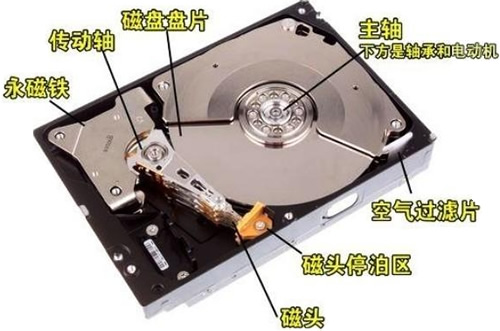
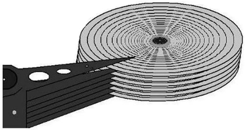
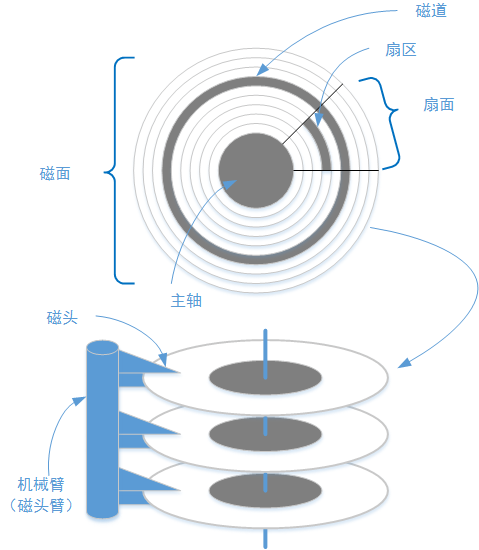
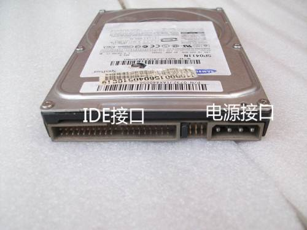
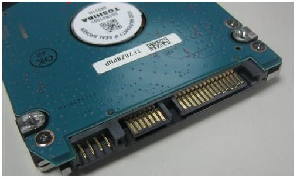
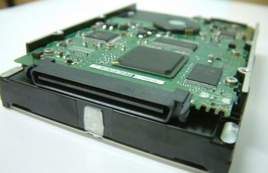
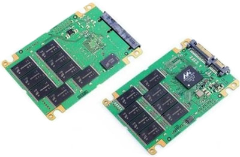

# 硬盘

在 Linux 系统中，文件系统是创建在硬盘上的，因此，要想彻底搞清楚文件系统的管理机制，就要从了解硬盘开始。

硬盘是计算机的主要外部存储设备。计算机中的存储设备种类非常多，常见的主要有光盘、硬盘、U 盘等，甚至还有网络存储设备 SAN、NAS 等，不过使用最多的还是硬盘。

如果从存储数据的介质上来区分，硬盘可分为**机械硬盘**（Hard Disk Drive, HDD）和**固态硬盘**（Solid State Disk, SSD），机械硬盘采用磁性碟片来存储数据，而固态硬盘通过闪存颗粒来存储数据。

## 硬盘结构

我们先来看看最常见的机械硬盘。机械硬盘的外观大家可能都见过，那么机械硬盘拆开后是什么样子的呢？

机械硬盘主要由磁盘盘片、磁头、主轴与传动轴等组成，数据就存放在磁盘盘片中。老式留声机上使用的唱片和我们的磁盘盘片非常相似，只不过留声机只有一个磁头，而硬盘是上下双磁头，盘片在两个磁头中间高速旋转。如下图所示：

也就是说，机械硬盘是上下盘面同时进数据读取的。而且机械硬盘的旋转速度要远高于唱片（目前机械硬盘的常见转速是 7200 r/min），所以机械硬盘在读取或写入数据时，非常害怕晃动和磕碰。另外，因为机械硬盘的超高转速，如果内部有灰尘，则会造成磁头或盘片的损坏，所以机械硬盘内部是封闭的，如果不是在无尘环境下，则禁止拆开机械硬盘。

我们已经知道数据是写入磁盘盘片的，那么数据是按照什么结构写入的呢？机械硬盘的逻辑结构主要分为**磁道**（track）、**扇区**（sector）和**拄面**（cynlinder）。

- **磁道**：每个盘片都在逻辑上有很多的同心圆，最外面的同心圆就是 0 磁道。我们将每个同心圆称作磁道。硬盘的磁道密度非常高，通常一面上就有上千个磁道。
- **扇区**：磁盘上每个同心圆是磁道，从圆心向外呈放射状地产生分割线，将每个磁道等分为若干弧段，每个弧段就是一个扇区。扇区的最小单位通常为512KB（由于磁盘大小不断增大，也有部分厂商设定每个扇区的大小是4096字节）。
- **柱面**：如果硬盘是由多个盘片组成的，每个盘面都被划分为数目相等的磁道，那么所有盘片都会从外向内进行磁道编号，最外侧的就是 0 磁道。具有相同编号的磁道会形成一个圆柱，这个圆柱就被称作磁盘的柱面。

硬盘的大小是使用“*磁头数 x 柱面数 x 扇区数 x 每个扇区的大小*”这样的公式来计算的。其中，磁头数表示硬盘共有几个磁头，也可以理解为硬盘有几个盘面，然后乘以 2；柱面数表示硬盘每面盘片有几条磁道；扇区数（Sectors）表示每条磁道上有几个扇区。

## 硬盘接口

机械硬盘通过接口与计算机主板进行连接，硬盘的读取和写入速度与接口有很大关系。

目前，常见的机械硬盘接口有以下几种：

### IDE 接口（Integrated Drive Eectronics）

也称作 "ATA硬盘" 或 "PATA硬盘"，是早期机械硬盘的主要接口，ATA133 硬盘的理论速度可以达到 133MB/s。

IDE接口现在已逐渐退出历史舞台，只有个别老式的电脑中还在使用。

### SATA 接口（Serial Advanced Technology Attachment）

SATA接口是一种电脑总线，由于采用串行方式传输数据而得名。SATA总线使用嵌入式时钟信号，具备了更强的纠错能力，与以往相比其最大的区别在于能对传输指令（不仅仅是数据）进行检查，如果发现错误会自动矫正，这在很大程度上提高了数据传输的可靠性。串行接口还具有结构简单、支持热插拔的优点。

SATA1.0的标准已经达到150M/s了，至于后续的2.0和3.0，则是可以达到300M/S和600M/S的速度。

### SCSI 接口（Small Computer System Interface）

使用50针接口，外观和普通硬盘接口有些相似。SCSI硬盘和普通IDE硬盘相比有很多优点，如性能也比较高，硬盘转速快，缓存容量大，CPU占用率低，扩展性远优于IDE硬盘，并且支持热插拔。

SCSI接口理论传输速度达到 320MB/s。但是由于它的价格昂贵，在普通PC上很少见到它的踪迹，主要用于服务器。

## 固态硬盘

传统的机械硬盘运行主要是靠机械驱动头，包括马达、盘片、磁头摇臂等必需的机械部件，它必须在快速旋转的磁盘上移动至访问位置，至少95%的时间都消耗在机械部件的动作上。SSD却不同机械构造，无需移动的部件，主要由主控与闪存芯片组成的SSD可以以更快速度和准确性访问驱动器到任何位置。传统机械硬盘必须得依靠主轴主机、磁头和磁头臂来找到位置，而SSD用集成的电路代替了物理旋转磁盘，访问数据的时间及延迟远远超过了机械硬盘。

固态硬盘的存储芯片主要分为两种：一种是采用**闪存**作为存储介质的；另一种是采用**DRAM**作为存储介质的。

目前使用较多的主要是采用闪存作为存储介质的固态硬盘，如下图所示：

固态硬盘和机械硬盘对比主要有以下一些特点：

| 对比项目  | 固态硬盘        | 机械硬盘 |
| --------- | --------------- | -------- |
| 容量      | 较小            | 大       |
| 读/写速度 | 极快            | —般      |
| 写入次数  | 5000〜100000 次 | 没有限制 |
| 工作噪声  | 极低            | 有       |
| 工作温度  | 极低            | 较高     |
| 防震      | 很好            | 怕震动   |
| 重量      | 低              | 高       |
| 价格      | 高              | 低       |

固态硬盘因为舍弃了机械硬盘的物理结构，所以相比机械硬盘具有了低能耗、无噪声、抗震动、低散热、体积小和速度快的优势；不过价格相比机械硬盘更高，而且使用寿命有限。

# 硬盘分区

## 分区方式

## MBR与GPT

早期硬盘的第一个扇区包含了已安装的操作系统系统信息，并用一小段代码来启动系统。这些重要信息我们称为**MBR**（*Master Boot Record*），即“主引导记录”。

如果你安装了Windows，Windows启动加载器的初始信息就放在这个区域里——如果MBR的信息被覆盖导致Windows不能启动，你就需要使用Windows的MBR修复功能来使其恢复正常。如果你安装了Linux，则位于MBR里的通常会是GRUB加载器。

但是由于MBR**最大支持2.2TB容量**，在容量方面存在着极大的瓶颈，GPT后来居上，慢慢地占据主导地位。

**GPT**的全称是*Globally Unique Identifier Partition Table*，意即GUID分区表，它的推出是和UEFI相辅相成的，鉴于MBR的磁盘容量和分区数量已经不能满足硬件发展的需求，GPT首要的任务就是突破了2.2T分区的限制，最大支持18EB的分区。

而在安全性方面，GPT分区表也进行了全方位改进。在早期的MBR磁盘上，分区和启动信息是保存在一起的。如果这部分数据被覆盖或破坏，事情就麻烦了。相对的，GPT在整个磁盘上保存多个这部分信息的副本，因此它更为健壮，并可以恢复被破坏的这部分信息。GPT还为这些信息保存了循环冗余校验码（CRC）以保证其完整和正确——如果数据被破坏，GPT会发觉这些破坏，并从磁盘上的其他地方进行恢复。

## BIOS与UEFI

**BIOS**是英文“*Basic Input Output System*”的缩略语，直译过来后中文名称就是“基本输入输出系统”。它的全称应该是**ROM－BIOS**，意思是只读存储器基本输入输出系统。其实，它是一组固化到计算机内主板上一个ROM芯片上的程序， 用于加载电脑最基本的程式码，担负着初始化硬件，检测硬件功能以及引导操作系统的任务。

**UEFI**，全称“*Unified Extensible Firmware Interface*”，即“统一的可扩展固件接口”，由UEFI联盟中的140多个技术公司共同创建，旨在提高软件互操作性和解决BIOS的局限性。这种接口用于操作系统自动从预启动的操作环境，加载到一种操作系统上，从而达到开机程序化繁为简节省时间的目的，传统BIOS技术正在逐步被UEFI取而代之。

UEFI和GPT是相辅相成的，二者缺一不可，**要想使用GPT分区表则必须是UEFI BIOS环境**。

早期的 Linux 系统为了兼容于 Windows 的磁盘，因此使用的是支持 Windows 的 MBR(Master Boot Record, 主要开机纪录区) 的方式来处理开机管理程序与分区表！而开机管理程序纪录区与分区表则通通放在磁盘的第一个扇区， 这个扇区通常是 512bytes 的大小 (旧的磁盘扇区都是 512bytes 喔！)，所以说，第一个扇区 512bytes 会有这两个数据：  主要启动记录区 (Master Boot Record, MBR)：可以安装开机管理程序的地方，有 446 byte s
 分区 表 (partition table)：记录整颗硬盘 分区 的状态，有 64 bytes
由于分区表所在区块仅有64 bytes容量，因此最多仅能有四组记录区，每组记录区记录了该区段的启始与结束的磁柱号码。 若将硬盘以长条形来看，然后将磁柱以柱形图来看，那么那64 bytes的记录区段有点像底下的图示：

## 为什么要分区

# 各硬件装置在 Linux 中的文件名

在 Linux 系统中磁盘设备文件的命名规则为： **主设备号 + 次设备号 + 磁盘分区号**

对于目前常见的磁盘，一般表示为： **sd[a-z]x** 主设备号代表设备的类型，相同的主设备号表示同类型的设备。

当前常见磁盘的主设备号为 sd。 次设备号代表同类设备中的序号，用 "a-z" 表示。

比如 /dev/sda 表示第一块磁盘，/dev/sdb 表示第二块磁盘。 x 表示磁盘分区编号。在每块磁盘上可能会划分多个分区，针对每个分区，Linux 用 /dev/sdbx 表示，这里的 x 表示第二块磁盘的第 x 个分区。

Linux下对SCSI和SATA设备是以sd命名的，第一个SCSI设备是sda,第二个是sdb....以此类推。一般主板上有两个SCSI接口，因此一共可以安装4个SCSI设备。主SCSI上的两个设备分别对应sda和sdb,第二个SCSI口上的设备对应sdc和sdd。一般硬盘安装在SCSI的主接口上，所以是sda和sdb，而光驱一般安装在第二个SCSI的主接口上，所以是sdc。IDE有两个口，第一个IDE口叫做适配器，可以接两块盘，主盘（hda）和从盘（hdb）.第二个IDE口主盘（hdc）从盘（hdd）

