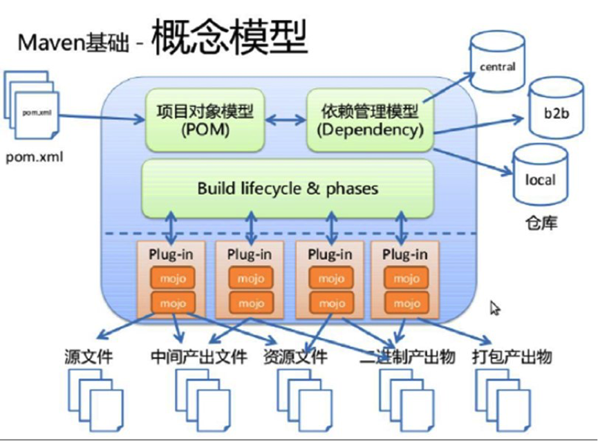
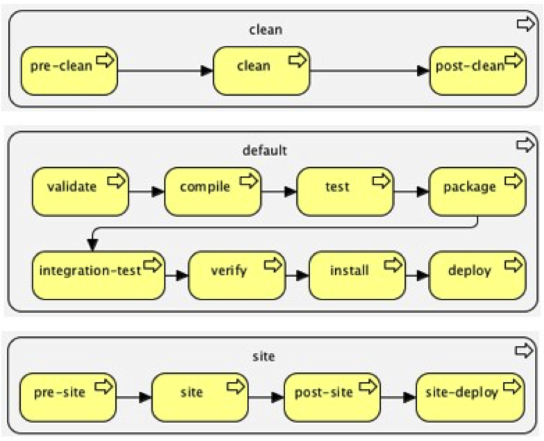

# 1、Maven是什么

首先，Maven的正确发音是`[ˈmeɪvn] `，而不是“马瘟”以及其他什么瘟。Maven在美国是一个口语化的词语，代表专家、内行的意思，约等于北京话中的“老炮儿”。

一个对Maven比较正式的定义是这么说的：

> Maven是一个项目管理工具，它包含了一个项目对象模型 (POM,Project Object Model)，一组标准集合，一个项目生命周期(Project Lifecycle)，一个依赖管理系统(Dependency Management System)，和用来运行定义在生命周期阶段(phase)中插件(plugin)目标(goal)的逻辑。
>

不过，这段话对于完全没有Maven实践经验的人来说，看了等于没看，并没有什么卵用。

Maven到底是什么，能做什么，可以用更通俗的方式来说明。我们知道，项目开发不仅仅是写写代码而已，期间会伴随着各种必不可少的事情要做，下面列举几个感受一下：

- 我们需要引用各种jar包，尤其是比较大的工程，引用的jar包往往有几十个乃至上百个， 每用到一种jar包，都需要手动引入工程目录，而且经常遇到各种让人抓狂的jar包冲突，版本冲突。
- 我们辛辛苦苦写好了Java文件，可是只懂0和1的白痴电脑却完全读不懂，需要将它编译成二进制字节码。好歹现在这项工作可以由各种集成开发工具帮我们完成，Eclipse、IDEA等都可以将代码即时编译。当然，如果你嫌生命漫长，何不铺张，也可以用记事本来敲代码，然后用javac命令一个个地去编译，逗电脑玩。
- 世界上没有不存在bug的代码，正如世界上没有不喜欢美女的男人一样。写完了代码，我们还要写一些单元测试，然后一个个的运行来检验代码质量。
- 再优雅的代码也是要出来卖的。我们后面还需要把代码与各种配置文件、资源整合到一起，定型打包，如果是web项目，还需要将之发布到服务器，供人蹂躏。

试想，如果现在有一种工具，可以把你从上面的繁琐工作中解放出来，能帮你构建工程，管理jar包，编译代码，还能帮你自动运行单元测试，打包，生成报表，甚至能帮你部署项目，生成Web站点，你会心动吗？傻子才不会。

负责任的告诉你，以上的一切Maven都可以办到。概括地说，Maven可以简化和标准化项目建设过程。处理编译，分配，文档，团队协作和其他任务的无缝连接。

# 2、生命周期

我们在开发项目的时候，不断地在编译、测试、打包、部署等过程，maven的生命周期就是对所有构建过程抽象与统一，生命周期包含项目的清理、初始化、编译、测试、打包、集成测试、验证、部署、站点生成等几乎所有的过程。 

Maven有三套相互独立的生命周期，请注意这里说的是“三套”，而且“相互独立”，初学者容易将Maven的生命周期看成一个整体，其实不然。这三套生命周期分别是：

- Clean Lifecycle：在进行真正的构建之前进行一些清理工作。
- Default Lifecycle：构建的核心部分，编译，测试，打包，部署等等。
- Site Lifecycle：生成项目报告，站点，发布站点。

再次强调一下它们是相互独立的，可以仅仅调用`clean`来清理工作目录，仅仅调用`site`来生成站点。当然也可以直接运行 `mvn clean install site` 运行所有这三套生命周期。

每套生命周期都由一组**阶段(Phase)**组成，我们平时在命令行输入的命令总会对应于一个特定的阶段。maven中所有的执行**动作(goal)**都需要指明自己在这个过程中的执行位置，然后maven执行的时候，就依照过程的发展依次调用这些goal进行各种处理。这个也是maven的一个基本调度机制。

## 2.1 Clean生命周期

| 阶段           | 动作                                  |
| -------------- | ------------------------------------- |
| **pre-clean**  | 执行一些需要在clean之前完成的工作     |
| **clean**      | 移除所有上一次构建生成的文件          |
| **post-clean** | 执行一些需要在clean之后立刻完成的工作 |

命令`mvn clean`中的就是代表执行上面的clean阶段，**在一个生命周期中，运行某个阶段的时候，它之前的所有阶段都会被运行**，也就是说，`mvn clean` 等同于 `mvn pre-clean clean` ，如果我们运行 `mvn post-clean` ，那么 `pre-clean`、`clean` 都会被运行。这是Maven很重要的一个规则，可以大大简化命令行的输入。

## 2.2 Default生命周期

Maven最重要就是的Default生命周期，也称构建生命周期，绝大部分工作都发生在这个生命周期中，每个阶段的名称与功能如下：

| 阶段                       | 动作                                                         |
| -------------------------- | ------------------------------------------------------------ |
| validate                   | 验证项目是否正确，以及所有为了完整构建必要的信息是否可用     |
| generate-sources           | 生成所有需要包含在编译过程中的源代码                         |
| process-sources            | 处理源代码，比如过滤一些值                                   |
| generate-resources         | 生成所有需要包含在打包过程中的资源文件                       |
| **process-resources**      | 复制并处理资源文件至目标目录，准备打包                       |
| **compile**                | 编译项目的源代码                                             |
| process-classes            | 后处理编译生成的文件，例如对Java类进行字节码增强（bytecode enhancement） |
| generate-test-sources      | 生成所有包含在测试编译过程中的测试源码                       |
| process-test-sources       | 处理测试源码，比如过滤一些值                                 |
| generate-test-resources    | 生成测试需要的资源文件                                       |
| **process-test-resources** | 复制并处理测试资源文件至测试目标目录                         |
| test-compile               | 编译测试源码至测试目标目录                                   |
| **test**                   | 使用合适的单元测试框架运行测试。这些测试应  该不需要代码被打包或发布 |
| prepare-package            | 在真正的打包之前，执行一些准备打包必要的操  作               |
| **package**                | 将编译好的代码打包成可分发的格式，如  JAR，WAR，或者EAR      |
| pre-integration-test       | 执行一些在集成测试运行之前需要的动作。如建  立集成测试需要的环境 |
| integration-test           | 如果有必要的话，处理包并发布至集成测试可以  运行的环境       |
| post-integration-test      | 执行一些在集成测试运行之后需要的动作。如清  理集成测试环境。 |
| verify                     | 执行所有检查，验证包是有效的，符合质量规范                   |
| **install**                | 安装包至本地仓库，以备本地的其它项目作为依  赖使用           |
| **deploy**                 | 复制最终的包至远程仓库，共享给其它开发人员  和项目（通常和一次正式的发布相关） |

可见，构建生命周期被细分成了22个阶段，但是我们没必要对每个阶段都了如指掌，经常关联使用的只有`test`、`package`、`install`、`deploy`等几个阶段而已。

一般来说，位置稍后的过程都会依赖于之前的过程。这也就是为什么我们运行`mvn install` 的时候，代码会被编译，测试，打包。当然，maven同样提供了配置文件，可以依照用户要求，跳过某些阶段。比如有时候希望跳过测试阶段而直接`install`，因为单元测试如果有任何一条没通过，maven就会终止后续的工作。

## 2.3 Site生命周期

| 阶段            | 动作                                                       |
| --------------- | ---------------------------------------------------------- |
| **pre-site**    | 执行一些需要在生成站点文档之前完成的工作                   |
| **site**        | 生成项目的站点文档                                         |
| **post-site**   | 执行一些需要在生成站点文档之后完成的工作，并且为部署做准备 |
| **site-deploy** | 将生成的站点文档部署到特定的服务器上                       |

这里经常用到的是site阶段和site-deploy阶段，用以生成和发布Maven站点，这是Maven相当强大的功能，但是，据我观察，业界内几乎没人使用。

