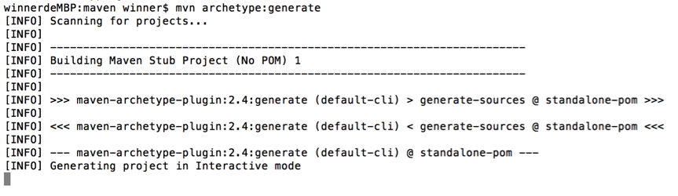
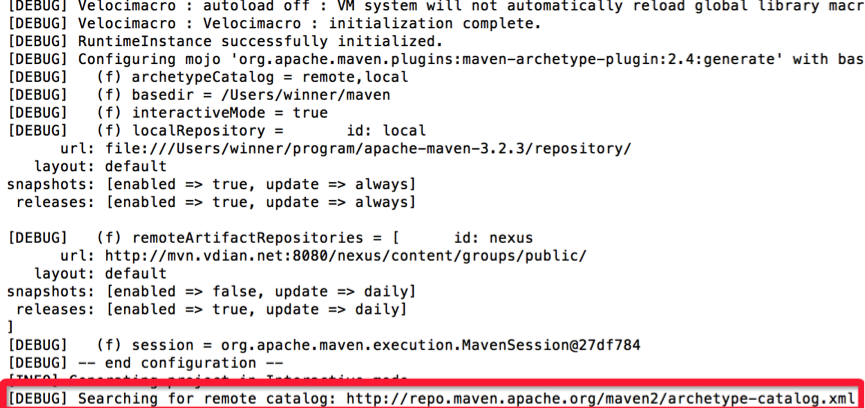
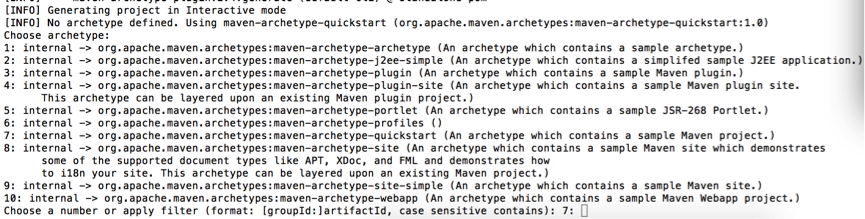
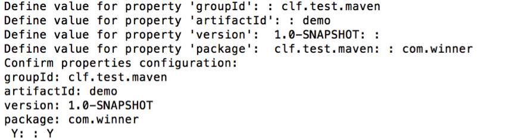
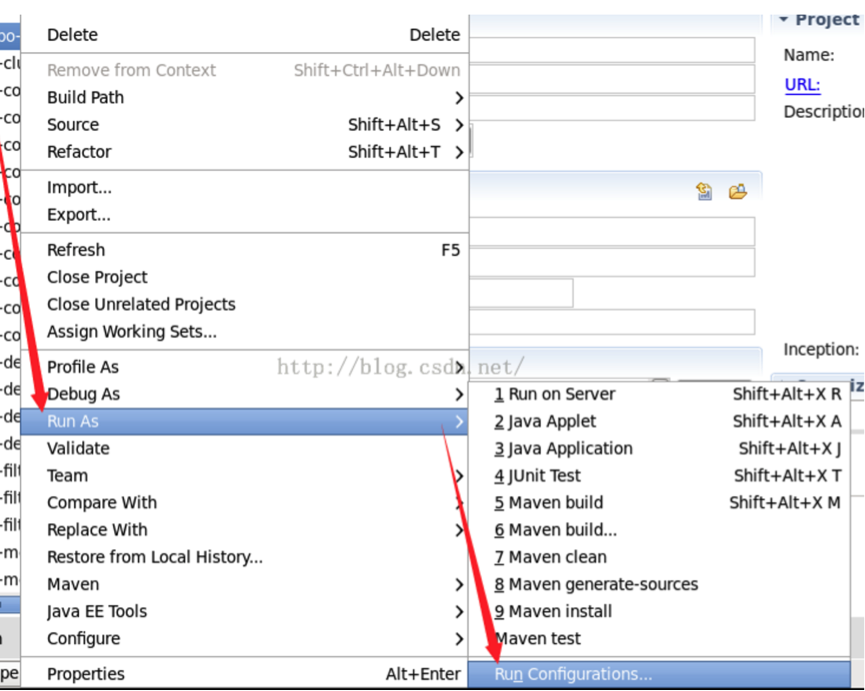
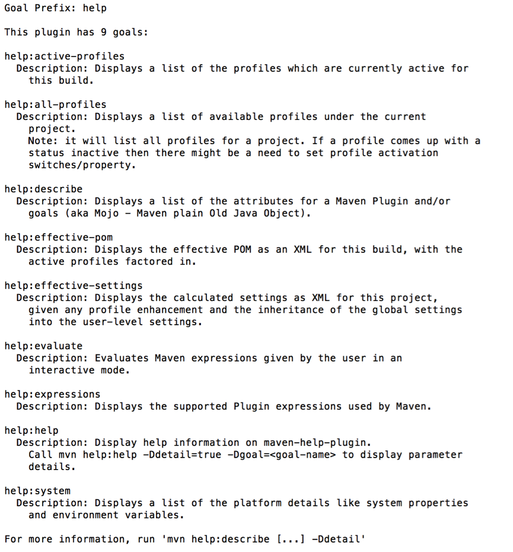
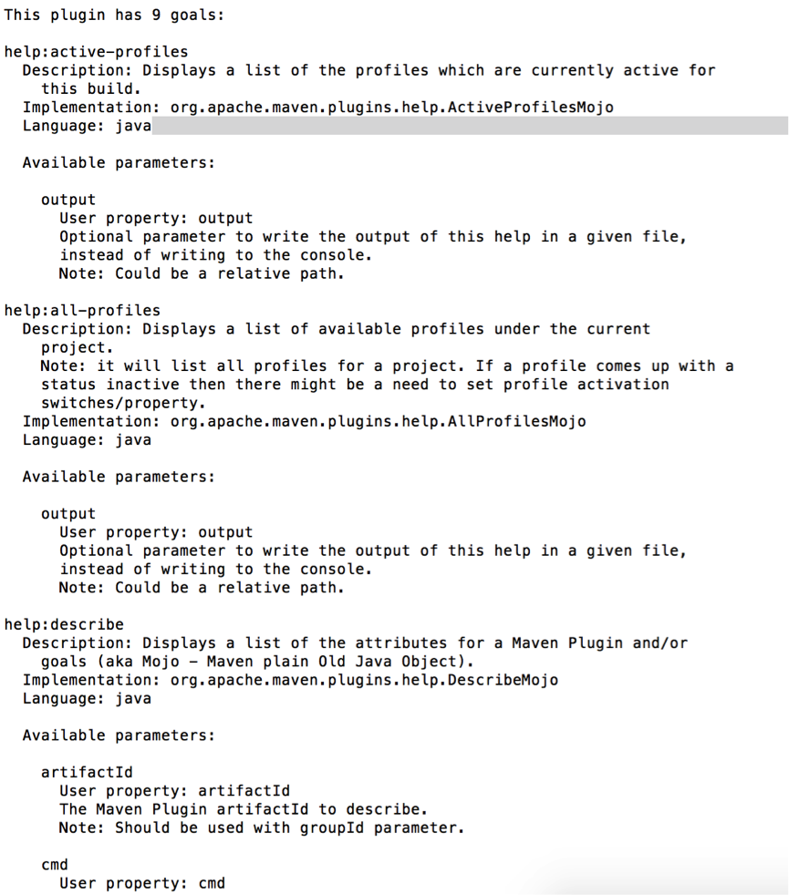

# 1、插件

Maven本质上是一个插件框架，它的核心并不执行任何具体的构建任务，所有这些任务都交给插件来完成，像编译是通过`maven-compile-plugin`实现的、测试是通过`maven-surefire-plugin`实现的，maven也内置了很多插件，所以我们在项目进行编译、测试、打包的过程是没有感觉到。

进一步说，每个任务对应了一个插件目标（goal），每个插件会有一个或者多个目标，例如`maven-compiler-plugin`的`compile`目标用来编译位于src/main/java/目录下的主源码，`testCompile`目标用来编译位于src/test/java/目录下的测试源码。

认识上述Maven插件的基本概念有助于理解Maven的工作机制，不过要想更高效率地使用Maven，了解一些常用的插件还是很有必要的，这可以帮助你避免一不小心重新发明轮子。多年来Maven社区积累了大量的经验，并随之形成了一个成熟的插件生态圈。Maven官方有两个插件列表：

- 第一个列表的GroupId为org.apache.maven.plugins，这里的插件最为成熟，具体地址为：http://maven.apache.org/plugins/index.html
- 第二个列表的GroupId为org.codehaus.mojo，这里的插件没有那么核心，但也有不少十分有用，其地址为：http://mojo.codehaus.org/plugins.html。

下面列举了一些常用的核心插件，每个插件的如何配置，官方网站都有详细的介绍。

一个插件通常提供了一组目标，可使用以下语法来执行：

`mvn [plugin-name]:[goal-name]`

例如，一个Java项目使用了编译器插件，通过运行以下命令编译

`mvn compiler:compile`

Maven提供以下两种类型的插件：

- 构建插件：在生成过程中执行，并应在pom.xml中的`<build/>`元素进行配置

- 报告插件：在网站生成期间执行的，应该在pom.xml中的`<reporting/>`元素进行配置


这里仅列举几个常用的插件，每个插件的如何进行个性化配置在官网都有详细的介绍。

```xml
<plugins> 
  
  <plugin> 
    <!-- 编译插件 -->  
    <groupId>org.apache.maven.plugins</groupId>  
    <artifactId>maven-compiler-plugin</artifactId>  
    <version>2.3.2</version>  
    <configuration> 
      <source>1.5</source>  
      <target>1.5</target> 
    </configuration> 
  </plugin>  
  
  <plugin> 
    <!-- 发布插件 -->  
    <groupId>org.apache.maven.plugins</groupId>  
    <artifactId>maven-deploy-plugin</artifactId>  
    <version>2.5</version> 
  </plugin> 
  
  <plugin> 
    <!-- 打包插件 -->  
    <groupId>org.apache.maven.plugins</groupId>  
    <artifactId>maven-jar-plugin</artifactId>  
    <version>2.3.1</version> 
  </plugin> 
  
  <plugin> 
    <!-- 安装插件 -->  
    <groupId>org.apache.maven.plugins</groupId>  
    <artifactId>maven-install-plugin</artifactId>  
    <version>2.3.1</version> 
  </plugin>  
  
  <plugin> 
    <!-- 单元测试插件 -->  
    <groupId>org.apache.maven.plugins</groupId>  
    <artifactId>maven-surefire-plugin</artifactId>  
    <version>2.7.2</version>  
    <configuration> 
      <skip>true</skip> 
    </configuration> 
  </plugin>  
  
  <plugin> 
    <!-- 源码插件 -->  
    <groupId>org.apache.maven.plugins</groupId>  
    <artifactId>maven-source-plugin</artifactId>  
    <version>2.1</version>  
    <!-- 发布时自动将源码同时发布的配置 -->  
    <executions> 
      <execution> 
        <id>attach-sources</id>  
        <goals> 
          <goal>jar</goal> 
        </goals> 
      </execution> 
    </executions> 
  </plugin> 
  
</plugins>

```

除了这些核心插件之外，还有很多优秀的第三方插件，可以帮助我们快捷、方便的构架项目。当使用到某些功能或者特性的时候多加搜索，往往得到让你惊喜的效果。

例如，项目中使用了Mybatis，就有一款神奇的maven插件，运行一个命令，就可以根据数据库的表，自动生成Mybatis的mapper配置文件以及DAO层接口模板。

在pom.xml中添加plugin：

```xml
<plugin> 
  <groupId>org.mybatis.generator</groupId>  
  <artifactId>mybatis-generator-maven-plugin</artifactId>  
  <version>1.3.2</version>  
  <configuration> 
    <configurationFile>src/main/resources/mybatis-generator/generatorConfig.xml</configurationFile>  
    <verbose>true</verbose>  
    <overwrite>true</overwrite> 
  </configuration>  
  <executions> 
    <execution> 
      <id>Generate MyBatis Artifacts</id>  
      <goals> 
        <goal>generate</goal> 
      </goals> 
    </execution> 
  </executions>  
  <dependencies> 
    <dependency> 
      <groupId>org.mybatis.generator</groupId>  
      <artifactId>mybatis-generator-core</artifactId>  
      <version>1.3.2</version> 
    </dependency> 
  </dependencies> 
</plugin>
```

定义generatorConfig.xml配置文件：

```xml
<generatorConfiguration> 
  <classPathEntry location="/Users/winner/mysql/mysql-connector-java-5.1.36.jar"/>  
  <context id="DB2Tables" targetRuntime="MyBatis3"> 
    <!-- 去掉自动生成的注解 -->  
    <commentGenerator> 
      <property name="suppressAllComments" value="true"/> 
    </commentGenerator>  
    <jdbcConnection driverClass="com.mysql.jdbc.Driver" connectionURL="jdbc:mysql://localhost:3344/db?characterEncoding=utf8" userId="id" password="password"></jdbcConnection>  
    <!-- 默认false，把JDBC DECIMAL 和 NUMERIC 类型解析为 Integer true，把JDBC DECIMAL 和
            NUMERIC 类型解析为java.math.BigDecimal -->  
    <javaTypeResolver> 
      <property name="forceBigDecimals" value="false"/> 
    </javaTypeResolver>  
    <!-- 生成映射类-->  
    <javaModelGenerator targetPackage="com.clf.model" targetProject="/Users/winner/Documents/workspace/project/src/main/java/"> 
      <!-- enableSubPackages:是否让schema作为包的后缀 -->  
      <property name="enableSubPackages" value="true"/>  
      <property name="trimStrings" value="true"/> 
    </javaModelGenerator>  
    <!-- 生成xml文件-->  
    <sqlMapGenerator targetPackage="com.clf.mapper" targetProject="/Users/winner/Documents/workspace/project/src/main/resources/"> 
      <property name="enableSubPackages" value="true"/>  
      <property name="trimStrings" value="true"/> 
    </sqlMapGenerator>  
    <!-- 生成mapper interface-->  
    <javaClientGenerator type="XMLMAPPER" targetPackage="com.clf.mapper" targetProject="/Users/winner/Documents/workspace/project/src/main/java/"> 
      <property name="enableSubPackages" value="true"/>  
      <property name="trimStrings" value="true"/> 
    </javaClientGenerator>  
    <table tableName="table_name" domainObjectName="object_name" enableCountByExample="false" enableUpdateByExample="false" enableDeleteByExample="false" enableSelectByExample="false" selectByExampleQueryId="false"/> 
  </context> 
</generatorConfiguration>
```

然后定位到pom.xml所在的路径下面，运行：

`mvn mybatis-generator:generate`

所有的文件就会自动生成，怎一个爽字了得。

# 2、命令

## 2.1 常用命令

从某种意义上来说，软件是帮助不懂程序的人来操作计算机的，图形化界面尤其如此。在上个世纪，比尔盖茨之所以成为世界首富，微软之所以IT界的巨鳄，就是因为Windows开图形化操作之先河，并抢先占领了全球市场，笑傲江湖数十年，至今依然宝刀未老。

诚然，现在几乎每种软件都有图形化界面，用鼠标点击几下就可以完成操作。Maven也不例外，在各类IDE中都有成熟的插件来简化操作。

但是作为开发人员，应该时刻保持着一种职业神圣感，我们拥有上帝之手，借助程序来操纵着计算机世界的一切。我们与计算机交流的正途是通过命令，而不是图形化界面。东汉末年分三国，为什么？很大一部分因素就是因为宦官集团隔断了皇权与士大夫之间的直接联系！图形化界面是人机交互的第三者，阻止着我们与计算机的亲密接触，长此以往，必生间隙。吾辈不可不慎也哉！

总而言之，图形化界面不是不能用，因为它确实有好处，可以提高开发效率，规避操作失误。我的观点是，用它，但是不要依赖它。

作为开发利器的maven，为我们提供了十分丰富的命令，了解maven的命令行操作并熟练运用常见的maven命令还是十分必要的。无论多先进多炫的图形化界面，底层都得靠maven命令来驱动。知其然，知其所以然，方能百战不殆。

在讲解插件的那一篇文章中已经说过，maven的所有任务都是通过插件来完成的，它本身只是一个空空如也的框架，不具备执行具体任务的能力。

maven的命令格式如下：

`mvn [plugin-name]:[goal-name]`

该命令的意思是：执行“plugin-name”插件的“goal-name”目标（或者称为动作）。

用户可以通过两种方式调用Maven插件目标。

第一种方式是将插件目标与生命周期阶段（lifecycle phase）绑定，这样用户在命令行只是输入生命周期阶段而已，例如Maven默认将maven-compiler-plugin的compile目标与compile生命周期阶段绑定，因此命令`mvn compile`实际上是先定位到compile这一生命周期阶段，然后再根据绑定关系调用maven-compiler-plugin的compile目标。

第二种方式是直接在命令行指定要执行的插件目标，例如`mvn archetype:generate` 就表示调用maven-archetype-plugin的generate目标，这种带冒号的调用方式与生命周期无关。

常用的maven命令如下：

| 命令                       | 动作                                                         |
| -------------------------- | ------------------------------------------------------------ |
| **mvn –version**           | 显示版本信息                                                 |
| **mvn clean**              | 清理项目生产的临时文件,一般是模块下的target目录              |
| **mvn compile**            | 编译源代码，一般编译模块下的src/main/java目录                |
| **mvn package**            | 项目打包工具,会在模块下的target目录生成jar或war等文件        |
| **mvn test**               | 测试命令,或执行src/test/java/下junit的测试用例.              |
| **mvn install**            | 将打包的jar/war文件复制到你的本地仓库中,供其他模块使用       |
| **mvn deploy**             | 将打包的文件发布到远程参考,提供其他人员进行下载依赖          |
| **mvn site**               | 生成项目相关信息的网站                                       |
| **mvn eclipse:eclipse**    | 将项目转化为Eclipse项目                                      |
| **mvn dependency:tree**    | 打印出项目的整个依赖树                                       |
| **mvn archetype:generate** | 创建Maven的普通java项目                                      |
| **mvn tomcat:run**         | 在tomcat容器中运行web应用                                    |
| **mvn jetty:run**          | 调用 Jetty 插件的 Run 目标在  Jetty Servlet 容器中启动 web 应用 |

**注意：**运行maven命令的时候，首先需要定位到maven项目的目录，也就是项目的pom.xml文件所在的目录。否则，必以通过参数来指定项目的目录。

## 2.2 命令参数

上面列举的只是比较通用的命令，其实很多命令都可以携带参数以执行更精准的任务。

Maven命令可携带的参数类型如下：

- `-D`：传入属性参数 

比如命令：

`mvn package -Dmaven.test.skip=true`

以`-D`开头，将maven.test.skip的值设为true，就是告诉maven打包的时候跳过单元测试。同理，`mvn deploy-Dmaven.test.skip=true`代表部署项目并跳过单元测试。

- `-P`： 使用指定的Profile配置 

比如项目开发需要有多个环境，一般为开发，测试，预发，正式4个环境，在pom.xml中的配置如下：

```xml
  <profiles> 
    
    <profile> 
      <id>dev</id>  
      <properties> 
        <env>dev</env> 
      </properties>  
      <activation> 
        <activeByDefault>true</activeByDefault> 
      </activation> 
    </profile>  
    
    <profile> 
      <id>qa</id>  
      <properties> 
        <env>qa</env> 
      </properties> 
    </profile> 
    
    <profile> 
      <id>pre</id>  
      <properties> 
        <env>pre</env> 
      </properties> 
    </profile>  
    
    <profile> 
      <id>prod</id>  
      <properties> 
        <env>prod</env> 
      </properties> 
    </profile> 
    
  </profiles>  


  <build> 
    <filters> 
      <filter>config/${env}.properties</filter> 
    </filters>  
    <resources> 
      <resource> 
        <directory>src/main/resources</directory>  
        <filtering>true</filtering> 
      </resource> 
    </resources> 
  </build> 

```

profiles定义了各个环境的变量id，filters中定义了变量配置文件的地址，其中地址中的环境变量就是上面profile中定义的值，resources中是定义哪些目录下的文件会被配置文件中定义的变量替换。 

通过maven可以实现按不同环境进行打包部署，命令为: 

`mvn package -P dev`

其中“dev“为环境的变量id,代表使用Id为“dev”的profile。

此外，常用的命令参数还有：

- `-e` ：显示maven运行出错的信息 
- `-o` ：离线执行命令,即不去远程仓库更新包 
- `-X` ：显示maven允许的debug信息 
- `-U`： 强制去远程更新snapshot的插件或依赖，默认每天只更新一次

## 2.3 实例

下面结合几个实例来看看maven命令的使用方法。

### 2.3.1 archetype:create & archetype:generate

“archetype”是“原型”的意思，maven可以根据各种原型来快速创建一个maven项目。

`archetype:create`是maven 3.0.5之前创建项目的命令，例如创建一个普通的Java项目：

`mvn archetype:create -DgroupId=packageName -DartifactId=projectName Dversion=1.0.0-SNAPSHOT`

后面的三个参数用于指定项目的groupId、artifactId以及version。

创建Maven的Web项目：   

`mvn archetype:create -DgroupId=packageName -DartifactId=projectName -DarchetypeArtifactId=maven-archetype-webapp`

archetypeArtifactId参数用于指定使用哪个maven原型，这里使用的是maven-archetype-webapp，maven会按照web应用的目录结构生成项目。

需要注意的是，在maven 3.0.5之后，`archetype:create`命令不在使用，取而代之的是`archetype:generate`命令。

该命令会以交互的模式创建maven项目，不需要像archetype:create那样在后面跟一堆参数，很容易出错。

但是，在命令行直接运行`archetype:generate`，往往会出现下面的结果：



程序卡在了“Generating project in Interactive mode”这一步，加入“-X”参数显示详细信息： 

`mvn -X archetype:generate`

运行结果如下：



可见，最终是卡到这一行，maven默认会从远程服务器上获取catalog，archetypeCatalog 表示插件使用的archetype元数据，默认值为remote,local，即中央仓库archetype元数据 （http://repo1.maven.org/maven2/archetype-catalog.xml）加上插件内置元数据，由于中央仓库的archetype太多（几千个）而造成程序的阻滞。实际上我们使用不了那么多的原型，加入-DarchetypeCatalog=internal参数就可以避免这种情况，只使用内置的原型就够了：

`mvn archetype:generate -DarchetypeCatalog=internal`

然后maven会告诉你，archetype没有指定，默认使用maven-archetype-quickstart，或者你从下面的列表中选择一个可用的原型：



列表中可用的内置原型共有10个，我们选择使用maven-archetype-quickstart原型（相当于一个“Hello World”模板）来创建项目，输入对应的序号“7”即可。

然后会依次提醒你输入groupId、artifactId、version(默认1.0-SNAPSHOT以及创建的第一个包名。



### 2.3.2 eclipse:eclipse

正式的开发环境中，代码一般是通过cvs、svn或者git来管理，我们从服务器下载下来源代码，然后执行mvn eclipse:eclipse生成ecllipse项目文件，然后导入到eclipse就行了。

### 2.3.3 tomcat:run

用了maven后，可以不需要用eclipse里的tomcat来运行web项目(实际工作中经常会发现用它会出现不同步更新的情况)，只需在对应目录里运行 `mvn tomat:run`命令，然后就可在浏览器里运行查看了。

首先来看一下maven tomcat插件的配置：

```xml
<plugin> 
  <groupId>org.apache.tomcat.maven</groupId>  
  <artifactId>tomcat7-maven-plugin</artifactId>  
  <version>2.2</version>  
  <configuration> 
    <port>8080</port>  
    <path>/dubbo-admin</path>  
    <uriEncoding>UTF-8</uriEncoding>  
    <finalName>dubbo-admin</finalName>  
    <server>tomcat7</server> 
  </configuration> 
</plugin>

```

然后配置jsp，servlet依赖等：

```xml
  <dependency> 
    <groupId>javax.servlet</groupId>  
    <artifactId>servlet-api</artifactId>  
    <version>2.5</version>  
    <scope>provided</scope> 
  </dependency>  
  <dependency> 
    <groupId>javax.servlet.jsp</groupId>  
    <artifactId>jsp-api</artifactId>  
    <version>2.2</version>  
    <scope>provided</scope> 
  </dependency>  
  <dependency> 
    <groupId>javax.servlet</groupId>  
    <artifactId>jstl</artifactId>  
    <version>1.2</version> 
  </dependency>  
  <dependency> 
    <groupId>jsptags</groupId>  
    <artifactId>pager-taglib</artifactId>  
    <version>2.0</version>  
    <scope>provided</scope> 
  </dependency> 
```

然后按照下面的方式运行：



还可以加入以下参数：

- 跳过测试：`-Dmaven.test.skip(=true)`
- 指定端口：`-Dmaven.tomcat.port=9090`
- 忽略测试失败：`-Dmaven.test.failure.ignore=true` 

当然，如果你的其它关联项目有过更新的话，一定要在项目根目录下运行`mvn clean install`来执行更新，再运行`mvn tomcat:run`使改动生效。

### 2.3.4 help:describe

maven有各种插件，插件又有各种目标。我们不可能记得每个插件命令。maven提供了查询各类插件参数的命令：`mvn help:describe`。

例如：`mvn help:describe -Dplugin=help`

代表查询help插件的命令规范，然后maven就会告诉你该命令有几个goal，各种参数的的意义以及配置方法：



下面的命令则代表插叙该插件的详细命令参数：

`mvn help:describe -Dplugin=help -Dfull`



maven会告诉你该命令有什么参数，怎么使用  


