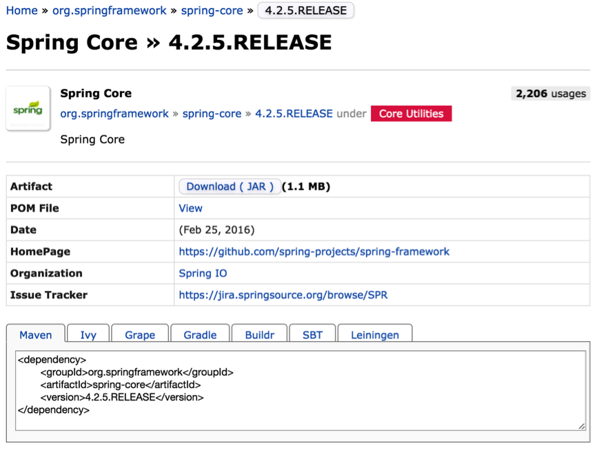
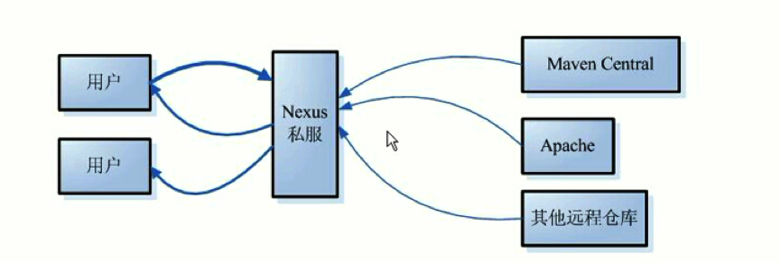
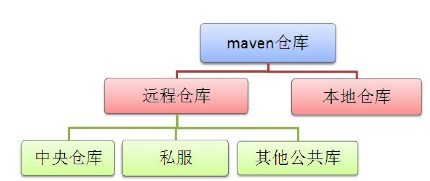
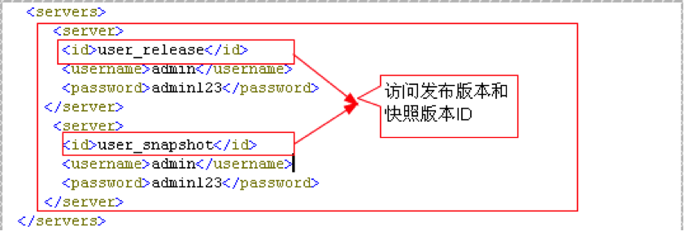
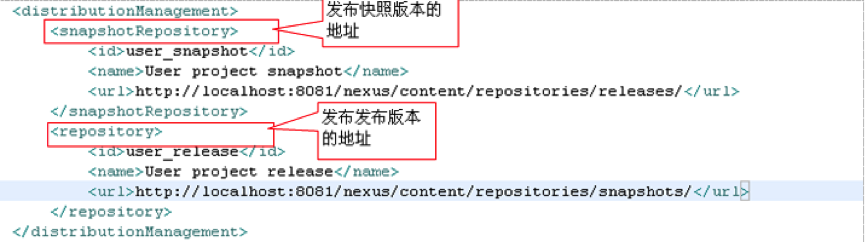

# 1、本地仓库

Maven一个很突出的功能就是jar包管理，一旦工程需要依赖哪些jar包，只需要在Maven的pom.xml配置一下，该jar包就会自动引入工程目录。初次听来会觉得很神奇，下面我们来探究一下它的实现原理。

首先，这些jar包肯定不是没爹没娘的孩子，它们有来处，也有去处。集中存储这些jar包（还有插件等）的地方被称之为**仓库**（Repository）。

不管这些jar包从哪里来的，必须存储在自己的电脑里之后，你的工程才能引用它们。类似于电脑里有个客栈，专门款待这些远道而来的客人，这个客栈就叫做本地仓库。

比如，工程中需要依赖spring-core这个jar包，在pom.xml中声明之后，maven会首先在本地仓库中找，如果找到了很好办，自动引入工程的依赖lib库即可。可是，万一找不到呢？实际上这种情况经常发生，尤其初次使用maven的时候，本地仓库肯定是空无一物的，这时候就要靠maven大展神通，去远程仓库去下载。

# 2、远程仓库

说到远程仓库，先从最核心的**中央仓库**开始，中央仓库是默认的远程仓库，maven在安装的时候，自带的默认中央仓库地址为http://repo1.maven.org/maven2/，此仓库由Maven社区管理，包含了绝大多数流行的开源Java构件，以及源码、作者信息、SCM、信息、许可证信息等。一般来说，简单的Java项目依赖的构件都可以在这里下载到。Maven社区提供了一个中央仓库的搜索地址:http://search.maven.org/#browse，可以查询到所有可用的库文件。

除了中央仓库，还有其它很多公共的远程仓库，如中央仓库的镜像仓库。全世界都从中央仓库请求资源，累死宝宝了，所以在世界各地还有很多中央仓库的镜像仓库。镜像仓库可以理解为仓库的副本，会从原仓库定期更新资源，以保持与原仓库的一致性。从仓库中可以找到的构件，从镜像仓库中也可以找到，直接访问镜像仓库，更快更稳定。

除此之外，还有很多各具特色的公共仓库，如果需要都可以在网上找到，比如Apache Snapshots仓库，包含了来自于Apache软件基金会的快照版本。

实际开发中，一般不会使用maven默认的中央仓库，现在使用很广泛的仓库地址为： http://mvnrepository.com/，比默认的中央仓库更快、更全、更稳定，谁用谁知道。

下面就是spring-core的最新版本在该仓库的信息：



一般来讲，公司都会通过自己的私有服务器在局域网内架设一个仓库代理。**私服可以看作一种特殊的远程仓库**，代理广域网上的远程仓库，供局域网内的Maven用户使用。当Maven需要下载构件的时候，先从私服请求，如果私服上不存在该构件，则从外部的远程仓库下载，缓存在私服上之后，再为Maven的下载请求提供服务。



Maven私服有很多好处：

- 可以把公司的私有jar包，以及无法从外部仓库下载到的构件上传到私服上，供公司内部使用；
- 节省自己的外网带宽：减少重复请求造成的外网带宽消耗；
- 加速Maven构建：如果项目配置了很多外部远程仓库的时候，构建速度就会大大降低；
- 提高稳定性，增强控制：Internet不稳定的时候，maven构建也会变的不稳定，一些私服软件还提供了其他的功能

当前主流的maven私服有Apache的Archiva、JFrog的Artifactory以及Sonatype的Nexus。

上面提到的中央仓库、中央仓库的镜像仓库、其他公共仓库、私服都属于远程仓库的范畴。



如果maven没有在本地仓库找到想要的东西，就会自动去配置文件中指定的远程仓库寻找，找到后将它下载到你的本地仓库。如果连远程仓库都找不到想要的东西，maven很生气，累老子跑了一圈都没找到，肯定是你配置写错了，报错给你看。

# 3、仓库的配置

仓库配置要做两件事，一是告诉maven你的本地仓库在哪里，二是你的远程仓库在哪里。

顾名思义，setting.xml的第一个节点`<localRepository>`就是配置本地仓库的地方，不用赘言。

远程仓库的配置有些复杂，因为会涉及很多附属特性。下面以一切从实际出发，看看使用私服的情况下如何配置远程仓库。稍微像样的公司都会建立自己的私服，如果一个公司连自己的私服都没有（别管是因为买不起服务器还是技术上做不到），你可以考虑一下跳槽的问题了。

现在最流行的maven仓库管理器就是大名鼎鼎的Nexus（发音[ˈnɛksəs]，英文中代表“中心、魔枢”的意思），它极大地简化了自己内部仓库的维护和外部仓库的访问。利用Nexus可以只在一个地方就能够完全控制访问和部署在你所维护仓库中的每个Artifact。Nexus是一套“开箱即用”的系统不需要数据库，它使用文件系统加Lucene来组织数据。

至于Nexus怎么部署，怎么维护仓库，作为开发人员是不需要关心的，只需要把Nexus私服的局域网地址写入maven的本地配置文件即可。具体的配置方法如下：

## 3.1 设置镜像

```xml
<mirrors>
    <mirror>
        <!--该镜像的唯一标识符。id用来区分不同的mirror元素。 -->
        <id>nexus</id>
        <!-- 镜像名，起注解作用，应做到见文知意。可以不配置  -->
        <name>Human Readable Name </name>
        <!--  所有仓库的构件都要从镜像下载  -->
        <mirrorOf>*</mirrorOf>
        <!-- 私服的局域网地址-->
        <url>http://192.168.0.1:8081/nexus/content/groups/public/</url>
    </mirror>
</mirrors>
```

节点`<mirrors>`下面可以配置多个镜像， `<mirrorOf>`用于指明是哪个仓库的镜像，上例中使用通配符“*”表明该私服是所有仓库的镜像，不管本地使用了多少种远程仓库，需要下载构件时都会从私服请求。

如果只想将私服设置成某一个远程仓库的镜像，使用`<mirrorOf>`指定该远程仓库的ID即可。

## 3.2 设置远程仓库

远程仓库的设置是在`<profile>`节点下面：

```xml
<repositories>
    <repository>
        <!--仓库唯一标识 -->
        <id> repoId </id>
        <!--远程仓库名称  -->
        <name>repoName</name>
        <!--远程仓库URL，如果该仓库配置了镜像，这里的URL就没有意义了，
			因为任何下载请求都会交由镜像仓库处理，
			前提是镜像（也就是设置好的私服）需要确保该远程仓库里的任何构件都能通过它下载到 -->
        <url>http://……</url>
        <!--如何处理远程仓库里发布版本的下载 -->
        <releases>
            <!--true或者false表示该仓库是否为下载某种类型构件（发布版，快照版）开启。   -->
            <enabled>false</enabled>
            <!--该元素指定更新发生的频率。Maven会比较本地POM和远程POM的时间戳。这里的选项是：
				always（一直），daily（默认，每日），interval：X（这里X是以分钟为单位的时间间隔），或者never（从不）-->
            <updatePolicy>always</updatePolicy>
            <!--当Maven验证构件校验文件失败时该怎么做:
				ignore（忽略），fail（失败），或者warn（警告）。 -->
            <checksumPolicy>warn</checksumPolicy>
        </releases>
        <!--如何处理远程仓库里快照版本的下载，与发布版的配置类似 -->
        <snapshots>
            <enabled />
            <updatePolicy />
            <checksumPolicy />
        </snapshots>
    </repository>
</repositories>
```

可以配置多个远程仓库，用`<id>`加以区分。

除此之外，还有一个与`<repositories>`并列存在`<pluginRepositories>`节点，用来配置插件的远程仓库。

仓库主要存储两种构件。第一种构件被用作其它构件的依赖，最常见的就是各类jar包。这是中央仓库中存储的大部分构件类型。另外一种构件类型是插件，Maven插件是一种特殊类型的构件。由于这个原因，插件仓库独立于其它仓库。`<pluginRepositories>`节点与`<repositories>`节点除了根节点的名字不一样，子元素的结构与配置方法完全一样：

```xml
<pluginRepositories>
    <pluginRepository>
        <id />
        <name />
        <url />
        <releases>
            <enabled />
            <updatePolicy />
            <checksumPolicy />
        </releases>
        <snapshots>
            <enabled />
            <updatePolicy />
            <checksumPolicy />
        </snapshots>
    </pluginRepository>
</pluginRepositories>

```

远程仓库有releases和snapshots两组配置，POM就可以在每个单独的仓库中，为每种类型的构件采取不同的策略。例如，有时候会只为开发目的开启对快照版本下载的支持，就需要把`<releases>`中的`<enabled>`设为“false”，而`<snapshots>`中的`<enabled>`设为“true”。

由于远程仓库的配置是挂在`<profile>`节点下面，如果配置有多个`<profile>`节点，那么就可能有多种远程仓库的设置方案，该方案是否生效是由它的父节点`<profile>`是否被激活决定的。

## 3.3 设置发布权限

私服的作用除了可以给全公司的人提供maven构件的下载，还有一个非常重要的功能，就是开发者之间的资源共享。

一个大的项目往往是分模块进行开发的，各个模块之间存在依赖关系，比如一个交易系统，分为下单模块、支付模块、购物车模块等。现在开发下单模块的同学需要调用支付模块中的接口来完成支付功能，就需要将支付模块的某些jar包引入本地工程，才能调用它的接口；同时，开发购物车模块的同学需要调用下单模块的接口，来完成下单功能，他就需要依赖下单模块的某些jar包。这三个模块都在持续开发中，不可能将各自的源码传来传去支持对方的依赖。

解决的方式是这样，每个模块完成了某个阶段性的功能，都会将提供对外服务的接口打成jar包，传到公司的私服当中，谁要使用该模块的功能，只需要在pom.xml文件中声明一下，maven就会像下载其他jar包那样把它引入你的工程。

在开发过程中，在pom中声明的构件版本一般是快照版：

```xml
<dependency>
	<groupId>com.yourCompany.trade</groupId>
	<artifactId>trade-pay</artifactId>
	<version>1.0.2-SNAPSHOT</version>
</dependency>
```

各个模块会不断的上传新的jar包，如果本地项目依赖的是快照版，那么maven一旦发现该jar包有新的发布，就会将它下载下来替代以前的旧版本。比如，支付模块在测试的时候发现有个bug，修复了一下，然后将快照版发布到私服。而你只需要专注于下单模块的开发，所依赖的支付模块的更新由maven处理，不需要关心。一旦你开发的模块修复了一个bug，或者添加了一个新功能等修改，只需要将发布一次快照版本到私服即可，谁需要依赖你的接口谁自然会去私服下载，你也不用关心。

一般私服建立完毕之后不需要认证就可以访问，但是风险有多大，可以自己想象，比如有天女秘书不小心把她跟老板的艳照传到了私服，开发的同学就没心思干活了吧……所以私服的权限设置还是很有必要的。

这时就需要使用setting.xml中的servers元素了。需要注意的是，**配置私服的信息是在pom文件中，但是认证信息则是在setting.xml中**，这是因为pom文件往往是被提交到代码仓库中供所有成员访问的，而setting.xml是存放在本地的，这样是安全的。

在settings.xml中，配置具有发布发布版本和快照版本权限的用户：



上面的id是server的id，不是用户登陆的id，该id与distributionManagement中repository元素的id相匹配。maven是根据pom中的repository和distributionMnagement元素来找到匹配的发布地址：



**注意：**pom中的id必须与setting.xml中配置好的id一致。

然后运行`maven clean deploy`命令，将自己开发的构件部署在私服上供组织内其他用户使用.

`maven clean deploy`和`maven clean install`的区别：deploy是将该构件部署在私服中，而install是将构件存入自己的本地仓库中。

在这里有人可能会有一个疑问，所有的仓库设置不是已经在setting.xml中配置好了吗，为什么在pom的发布管理节点当中还要配置一个url？

setting.xml中配置的是你从哪里下载构件，而这里配置的是你要将构件发布到哪里。有时候可能下载用的仓库与上传用的仓库是两个地址，但是绝大多数情况下，两者都是由私服充当，就是说两者是同一个地址。


