# 1、NoSQL

## 1.1 NoSQL的诞生背景

传统的关系数据库在应付web 2.0网站，特别是超大规模和高并发的动态网站已经显得力不从心，暴露了很多难以克服的问题，例如：

### （1）High performance - 对数据库高并发读写的需求
web2.0网站要根据用户个性化信息来实时生成动态页面和提供动态信息，所以基本上无法使用动态页面静态化技术，因此数据库并发负载非常高，往往要达到每秒上万次读写请求。关系数据库应付上万次SQL查询还勉强顶得住，但是应付上万次SQL写数据请求，硬盘IO就已经无法承受了。

### （2）Huge Storage - 对海量数据的高效率存储和访问的需求
类似Facebook、微信这样的社交网络，用户每天产生的动态数据堪称海量，对于关系数据库来说，在一张数亿条记录的表里面进行SQL查询，效率是极其低下乃至不可忍受的。

### （3）High Scalability && High Availability- 对数据库的高可扩展性和高可用性的需求
在基于web的架构当中，数据库是最难进行横向扩展的，当一个应用系统的用户量和访问量与日俱增的时候，你的数据库却没有办法像web server和app server那样简单的通过添加更多的硬件和服务节点来扩展性能和负载能力。对于很多需要提供24小时不间断服务的网站来说，对数据库系统进行升级和扩展是非常痛苦的事情。

在上面提到的“三高”需求面前，关系数据库遇到了难以克服的障碍，而对于web 2.0网站来说，关系数据库的很多主要特性却往往无用武之地，例如：

### （1）数据库事务一致性需求
很多web实时系统并不要求严格的数据库事务，对读一致性的要求很低，有些场合对写一致性要求也不高。因此数据库事务管理成了数据库高负载下一个沉重的负担。

### （2）数据库的写实时性和读实时性需求
对关系数据库来说，插入一条数据之后立刻查询，是肯定可以读出来这条数据的，但是对于很多web应用来说，并不要求这么高的实时性，比方说我发一条微博之后，过几秒乃至十几秒之后订阅者才看到这条动态是完全可以接受的。

### （3）对复杂的SQL查询，特别是多表关联查询的需求
任何大数据量的web系统，都非常忌讳多个大表的关联查询，以及复杂的数据分析类型的复杂SQL报表查询，特别是社交网络，从需求以及产品设计角度，就避免了这种情况的产生。往往更多的只是单表的主键查询，以及单表的简单条件分页查询，SQL的功能被极大的弱化了。

因此，关系数据库在这些越来越多的应用场景下显得不那么合适了，为了解决这类问题的**NoSQL**应运而生。

## 1.2 NoSQL的特点
 
 > **NoSQL**(Not Only SQL)，是对非关系型数据库的统称。其中最重要的是NoSQL不使用SQL作为查询语言。其数据存储可以**不需要固定的表格模式**，也经常会**避免使用JOIN操作**，一般有**水平可扩展性**的特征。

### 1.2.1 易扩展
 
NoSQL数据库种类繁多，但是一个共同的特点都是去掉关系数据库的关系型特性。数据之间无关系，这样就非常容易扩展。也无形之间，在架构的层面上带来了可扩展的能力。

 
### 1.2.2 大数据量，高性能

NoSQL数据库都具有非常高的读写性能，尤其在大数据量下，同样表现优秀。这得益于它的无关系性，数据库的结构简单。一般MySQL使用Query Cache，每次表的更新Cache就失效，是一种大粒度的Cache，在针对web2.0的交互频繁的应用，Cache性能不高。而NoSQL的Cache是记录级的，是一种细粒度的Cache，所以NoSQL在这个层面上来说就要性能高很多了。
 
### 1.2.3 灵活的数据模型
 
NoSQL无需事先为要存储的数据建立字段，随时可以存储自定义的数据格式。而在关系数据库里，增删字段是一件非常麻烦的事情。如果是非常大数据量的表，增加字段简直就是一个噩梦。这点在大数据量的web2.0时代尤其明显。

### 1.2.4 高可用

NoSQL在不太影响性能的情况，就可以方便的实现高可用的架构。比如Cassandra，HBase模型，通过复制模型也能实现高可用。

 
NoSQL数据库的出现，弥补了关系数据（比如MySQL）在某些方面的不足，在某些方面能极大的节省开发成本和维护成本。MySQL和NoSQL都有各自的特点和使用的应用场景，让关系数据库关注在关系上，NoSQL关注在存储上。

## 1.3 NoSQL的分类

常见的 NoSQL 数据库包括**键值数据库**、**列族数据库**、**文档数据库**和**图形数据库**。
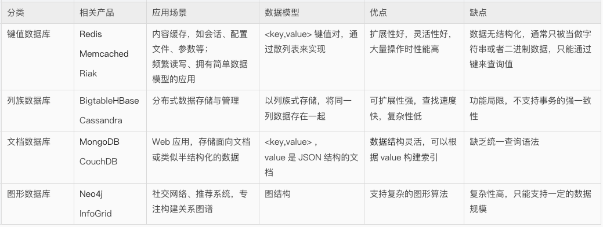

NoSQL 数据库并没有一个统一的架构，两种不同的 NoSQL 数据库之间的差异程度，远远超过两种关系型数据库之间的不同。

可以说，NoSQL 数据库各有所长，一个优秀的 NoSQL 数据库必然特别适用于某些场合或者某些应用，在这些场合中会远远胜过关系型数据库和其他的 NoSQL 数据库。

### 1.3.1 键值数据库

这一类数据库主要会使用到一个散列表，这个表中有一个特定的键和一个指针指向特定的数据。

键值模型的优势在于简单、易部署。键值数据库可以按照键对数据进行定位，还可以通过对键进行排序和分区，以实现更快速的数据定位。

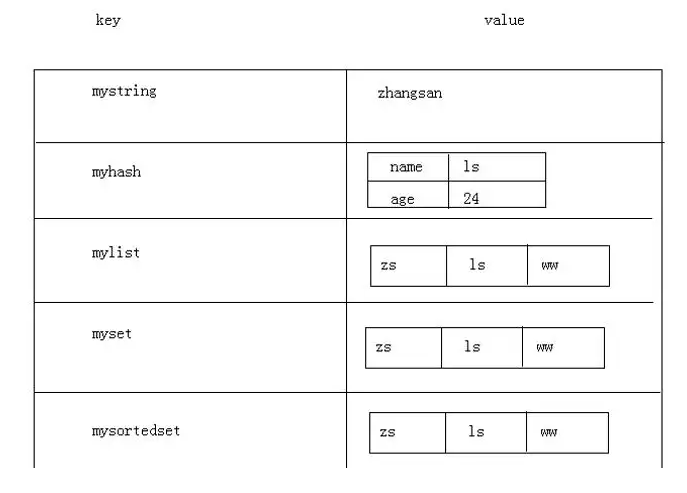


### 1.3.2 列族数据库

列族数据库通常用来应对分布式存储的海量数据。键仍然存在，但是它们的特点是指向了多个列，如图所示。

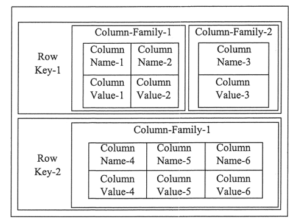


### 1.3.3 文档数据库

文档数据库与键值数据库类似。该类型的数据模型是版本化的文档，文档以特定的格式存储，如JSON。

文档数据库可以看作键值数据库的升级版，允许之间嵌套键值。

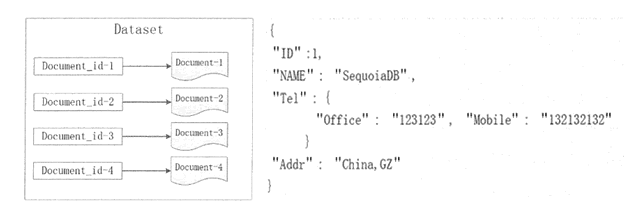

文档数据库比键值数据库的查询效率更高， 因为文档数据库不仅可以根据键创建索引，同时还可以根据文档内容创建索引。


### 1.3.4 图形数据库

图形数据库来源于图论中的拓扑学，以节点、边及节点之间的关系来存储复杂网络中的数据。

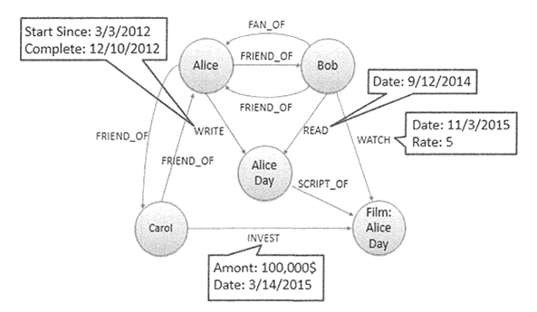

这种拓扑结构类似 E-R 图，但在图形模式中，关系和节点本身就是数据，而在 E-R 图中，关系描述的是一种结构。

# 2、MongoDB是什么

MongoDB是流行的NoSQL解决方案之一，是一种开源的**面向文档**的数据存储系统。

MongoDB 的原名一开始来自于英文单词`Humongous**`, 中文含义是指"庞大"，即命名者的意图是可以处理大规模的数据。

[DB-Engines](https://db-engines.com/en/ranking) 是全球知名的数据库流行度排行榜网站，排名每月更新一次。
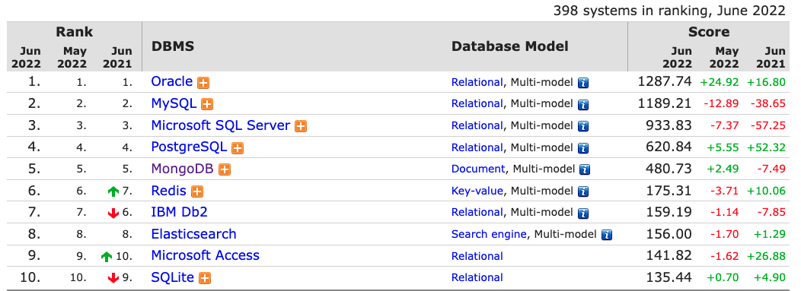

可以看到，MongoDB常年霸榜前五名，而前四名是Oracle、MySQL、SQL Server、PostgreSQL这些传统的关系型数据库。也就是说，MongoDB是全球范围内最受欢迎的NoSQL数据库，连Redis都不可与其争锋。

另外，MongoDB 的社区一直比较活跃，加上商业上的驱动(MongoDB于2017年在纳斯达克上市)，这些因素都推动了该开源数据库的发展。


# 3、MongoDB的数据模型

MongoDB 在概念模型上参考了 SQL数据库，但并非完全相同。关于这点，也有人说，**MongoDB 是 NoSQL中最像SQL的数据库**。

在传统的关系型数据库中，存储方式是以表的形式存放，而在MongoDB中，以文档的形式存在。
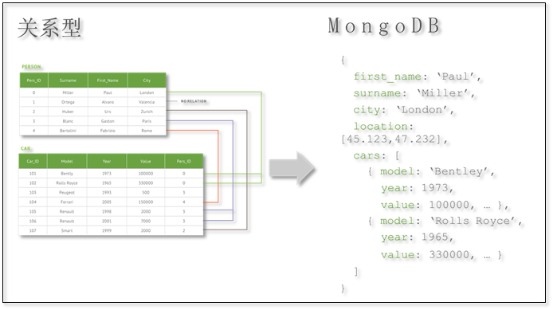

MongoDB与关系型数据库的模型对应关系如下：
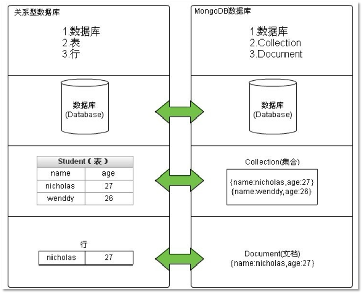

* **Database**：与SQL的数据库(database)概念相同，一个数据库包含多个集合(表)
* **Collection**：相当于SQL中的表(table)，一个集合可以存放多个文档(行)。 不同之处就在于集合的结构(schema)是动态的，不需要预先声明一个严格的表结构。更重要的是，默认情况下 MongoDB 并不会对写入的数据做任何schema的校验。
* **Document**：相当于SQL中的行(row)，一个文档由多个字段(列)组成，并采用bson(json)格式表示。
* **Field**：相当于SQL中的列(column)，差别在于field的类型可以更加灵活，比如支持嵌套的文档、数组。

此外，MongoDB中字段的类型是固定的、区分大小写、并且文档中的字段也是有序的。

另外，SQL 还有一些其他的概念，对应关系如下：

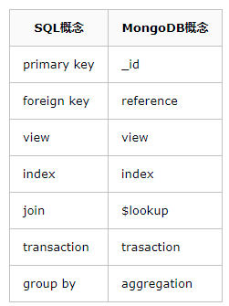

* **_id**：MongoDB 默认使用一个_id 字段来保证文档的唯一性。
* **reference**：勉强可以对应于 外键(foreign key) 的概念，之所以是勉强是因为 reference 并没有实现任何外键的约束，而只是由客户端(driver)自动进行关联查询、转换的一个特殊类型。
* **view：MongoDB** 3.4 开始支持视图，和 SQL 的视图没有什么差异，视图是基于表/集合之上进行动态查询的一层对象，可以是虚拟的，也可以是物理的(物化视图)。
* **index**：与SQL 的索引相同。
* **$lookup**：这是一个聚合操作符，可以用于实现类似 SQL-join 连接的功能
* **transaction**：从 MongoDB 4.0 版本开始，提供了对于事务的支持
* **aggregation：MongoDB** 提供了强大的聚合计算框架，group by 是其中的一类聚合操作。

从底层存储来讲，每个 Document 都是一个类 JSON 结构的 **BSON**（Binary JSON)。

BSON是MongoDB首创的一种二进制存储格式，数据组织和访问方式完全和 JSON 一样。支持动态的添加字段、支持内嵌对象和数组对象。同时它也对 JSON 做了一些扩充，如支持 Date 和 BinData 数据类型。

因此， **BSON 实际上使用的是一种扩展式的JSON**。

除了文档模型本身，对于数据的操作命令也是基于JSON/BSON 格式的语法。

比如插入文档的操作：

```
db.book.insert(
{
  title: "My first blog post",
  published: new Date(),
  tags: [ "NoSQL", "MongoDB" ],
  type: "Work",
  author : "James",
  viewCount: 25,
  commentCount: 2
}
)
```

执行文档查找：

```
db.book.find({author : "James"})
```

更新文档的命令：

```
db.book.update(
   {"_id" : ObjectId("5c61301c15338f68639e6802")},
   {"$inc": {"viewCount": 3} }
)
```

删除文档的命令：

```
db.book.remove({"_id":
     ObjectId("5c612b2f15338f68639e67d5")})
```     
     
在传统的SQL语法中，可以限定返回的字段，MongoDB可以使用Projection来表示：

```
db.book.find({"author": "James"}, 
    {"_id": 1, "title": 1, "author": 1})
```

实现简单的分页查询：

```
db.book.find({})
    .sort({"viewCount" : -1})
    .skip(10).limit(5)
```
    
这种基于BSON/JSON 的语法格式并不复杂，它的表达能力或许要比SQL更加强大。与 MongoDB 做法类似的还有 ElasticSearch，后者是搜索数据库的佼佼者。

# 4、MongoDB的特性

MongoDB 的三大核心特性是：
* **No Schema**：MongoDB没有固定的Schema，少了很多约束条件，可以让数据的存储数据结构更灵活，存储速度更加快。
* **高可用**：MongoDB能将数据分布在多台机器上实现冗余，同时检测主节点是否存活，当失活时能自动提升从节点为主节点，达到自动故障转移的目的。
* **分布式**（可平行扩展）：MongoDB使用分片技术对数据进行扩展，能自动分片、自动转移分片里面的数据块，让每一个服务器里面存储的数据都是一样大小。

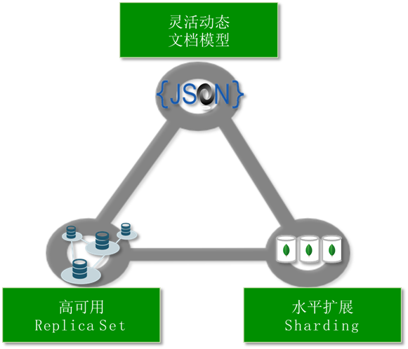

除了上图所示，MongoDB 还支持数据压缩、二级索引、全文搜索、地理分布等一系列的强大功能。

# 5、MongoDB的适用场景

从目前阿里云 MongoDB 云数据库上的用户看，MongoDB 的应用已经渗透到各个领域，比如游戏、物流、电商、内容管理、社交、物联网、视频直播等，以下是几个实际的应用案例。

* **游戏场景**：使用 MongoDB 存储游戏用户信息，用户的装备、积分等直接以内嵌文档的形式存储，方便查询、更新
* **物流场景**：使用 MongoDB 存储订单信息，订单状态在运送过程中会不断更新，以 MongoDB 内嵌数组的形式来存储，一次查询就能将订单所有的变更读取出来。
* **社交场景**：使用 MongoDB 存储存储用户信息，以及用户发表的朋友圈信息，通过地理位置索引实现附近的人、地点等功能
* **物联网场景**：使用 MongoDB 存储所有接入的智能设备信息，以及设备汇报的日志信息，并对这些信息进行多维度的分析。
* **视频直播**：使用 MongoDB 存储用户信息、礼物信息等

到底该不该使用MongoDB，下面的几道选择题可以辅助决策（来自MongoDB 公司的技术分享）：
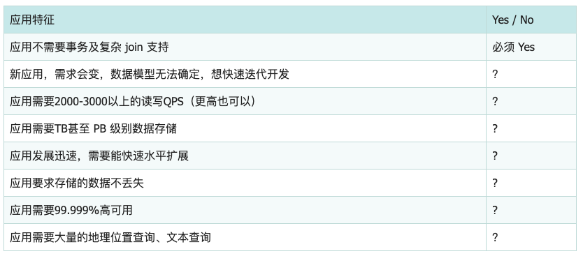

如果上述有1个 Yes，可以考虑 MongoDB，2个及以上的 Yes，选择MongoDB绝不会后悔。

当然，MongoDB也有自身的局限性，以下是MongoDB不适用的场景：

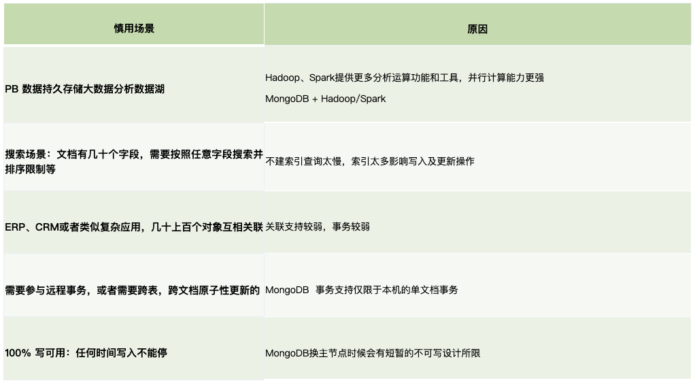


