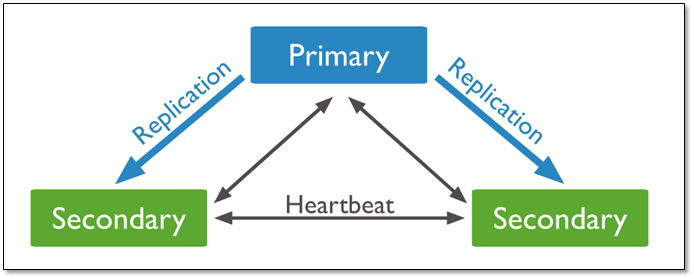
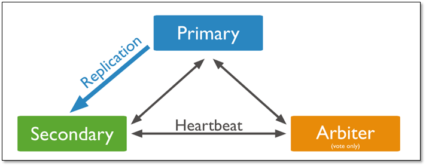
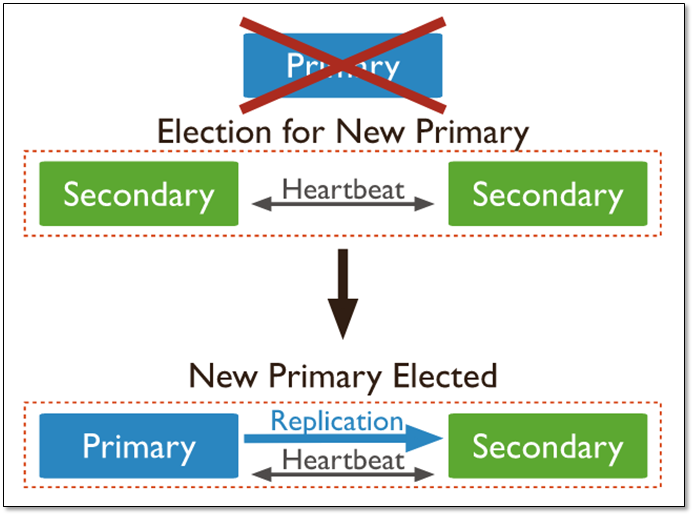
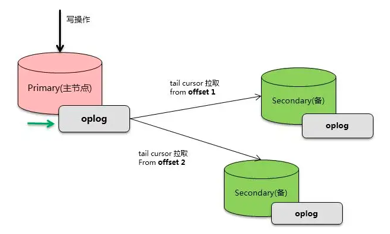
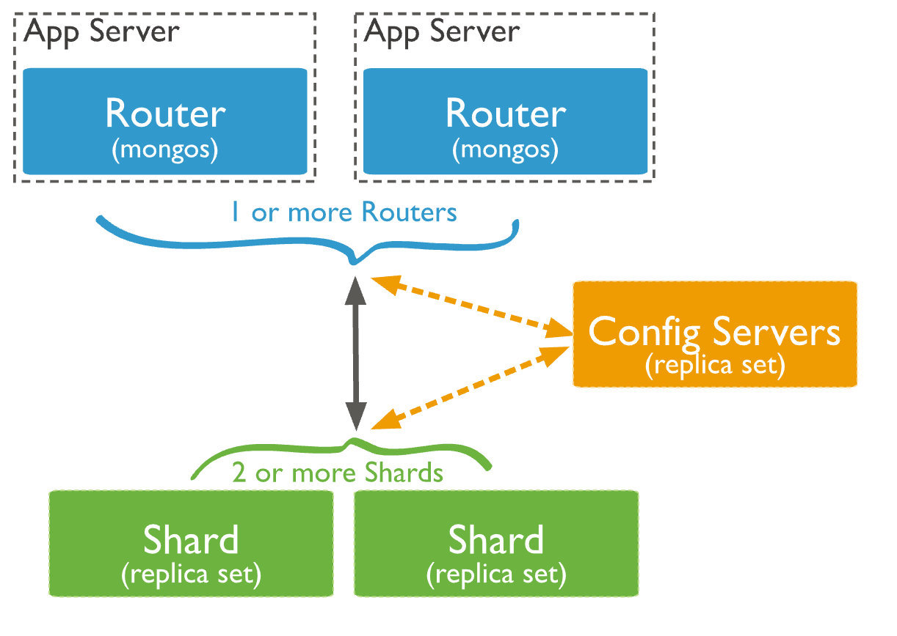
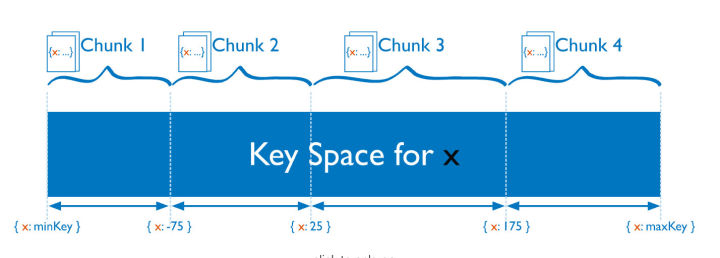
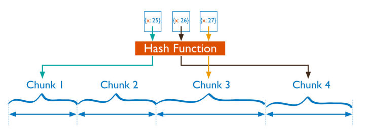
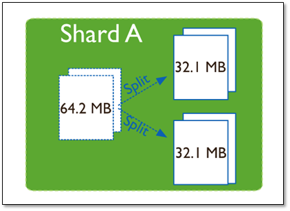
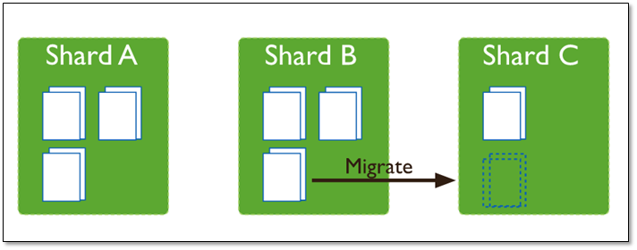

# 1、副本集

## 1.1 典型架构

MongoDB 高可用的基础是**副本集**，**副本集本质来说就是一份数据存多份**，**保证数据在生产部署时的冗余和可靠性**。

利用副本集可以实现：：

* **高可用**：通过在不同的机器上保存副本来保证数据的不会因为单点损坏而丢失，主节点宕机后，由备节点自动选举成为新的主节点
* **读写分离**：读请求可以分流到备节点，减轻主节点的单点压力。而且，由不同的服务器为不同的用户提供服务，提高整个系统的负载。

副本集的典型架构有以下三种角色：

* **至少一个主节点（Primary）**：负责整个集群的写操作入口，主节点挂掉之后会自动选出新的主节点。
* **一个或多个从节点（Secondary**）：一般是 2 个或以上，从主节点同步数据，在主节点挂掉之后选举新节点。
* **零个或 1 个仲裁节点（Arbiter）**：这个是为了节约资源或者多机房容灾用，只负责主节点选举时投票不存数据，保证能有节点获得多数赞成票。

从上面的节点类型可以看出，一个三节点的复制集群可能是 PSS 或者 PSA 结构。

PSS架构：

PSA架构：

PSA 结构优点是节约成本，但是缺点是 Primary 挂掉之后，一些依赖 majority（多数）特性的写功能出问题，因此一般不建议使用。

在PSS架构中，当主库宕机后，两个从库都会进行竞选，其中一个变为主库，当原主库恢复后，作为从库加入当前的复制集群即可。

副本集中的每个节点上都会定时向其他节点发送**心跳**(heartbeat)，以此来感知其他节点的变化，比如是否失效、或者角色发生了变化。

默认情况下，节点会每2秒向其他节点发出心跳，这其中包括了主节点。 如果备节点在10秒内没有收到主节点的响应就会主动发起选举。

MongoDB 副本集通过 **Raft 算法**来完成主节点的选举。 整个过程对于上层是透明的，应用并不需要感知，因为 Mongos 会自动发现这些变化。

## 1.2 主从同步

### 1.2.1 Oplog

MongoDB 的主从同步机制是确保数据一致性和可靠性的重要机制。其同步的基础是 **Oplog**，类似 MySQL 的 Binlog。

在每一个副本集的节点中，都会存在一个名为`local.oplog.rs`的特殊集合。 当 Primary 上的写操作完成后，会向该集合中写入一条Oplog，而 Secondary 则持续从 Primary 拉取新的 Oplog 并在本地进行回放以达到同步的目的。

MongoDB 对于 Oplog 的设计是比较仔细的，比如：

* Oplog 必须保证有序，通过 optime 来保证。
* Oplog 必须包含能够进行数据回放的完整信息。
* Oplog 必须是幂等的，即多次回放同一条日志产生的结果相同。
* Oplog 集合是固定大小的，为了避免对空间占用太大，旧的 oplog 记录会被滚动式的清理。

主从同步的本质实际上就是，Primary 节点接收客户端请求，将更新操作写到 Oplog，然后 Secondary 从同步源拉取 Oplog 并本地回放，实现数据的同步。

### 1.2.2 Checkpoint

上面提到了 MongoDB 的写只写了内存和 Oplog ，并没有做数据持久化，**Checkpoint 就是将内存变更刷新到磁盘持久化的过程**。MongoDB 会每 60s 一次将内存中的变更刷盘，并记录当前持久化点（checkpoint），以便数据库在重启后能快速恢复数据。

MongoDB宕机重启之后可以通过 checkpoint 快速恢复上一个 60s 之前的数据。

MongoDB最后一个 checkpoint 到宕机期间的数据可以通过 Oplog 回放恢复。

Oplog因为是 100ms 刷盘一次，**因此至多会丢失 100ms 的数据**（这个可以通过 WriteConcern 的参数控制不丢失，只是性能会受影响，适合可靠性要求非常严格的场景）

如果在写数据开启了**多数写**，那么就算 Primary 宕机了也是至多丢失 100ms 数据（可避免，同上）

# 2、分片

水平扩展是 MongoDB 的另一个核心特性，它是 MongoDB 支持海量数据存储的基础。MongoDB 天然的分布式特性使得它几乎可无限的横向扩展。

尽管分片起源于关系型数据库分区，但MongoDB分片完全又是另一回事。和MySQL分区方案相比，MongoDB的最大区别在于它几乎能自动完成所有事情，只要告诉MongoDB要分配数据，它就能自动维护数据在不同服务器之间的均衡。

## 2.1 分片集群

MongoDB 的分片集群由如下三个部分组成：

　　
**Mongos** ：路由服务，不存具体数据，从 Config 获取集群配置讲请求转发到特定的分片，并且整合分片结果返回给客户端。

**Config Server**：保存集群的元数据（metadata），包含各个Shard的路由规则，配置服务器由一个副本集(ReplicaSet)组成。

**Shard**：用于存储真正的集群数据，可以是一个单独的 Mongod实例，也可以是一个副本集。 生产环境下Shard一般是一个 Replica Set，以防止该数据片的单点故障。

## 2.2 分片算法

**分片集群上数据管理单元叫chunk**，一个 chunk 默认 64M。

Mongos 在操作分片集合时，会自动根据分片键找到对应的 chunk，并向该 chunk 所在的分片发起操作请求。

数据是根据分片策略来进行切分的，而分片策略则由 **分片键**(ShardKey)+**分片算法**(ShardStrategy)组成。

分片键就是在集合中选一个键，用该键的值作为数据拆分的依据。所以一个好的片键对分片至关重要。**分片键必须是一个索引**。

MongoDB支持两种分片算法：区间分片与哈希分片。

### 2.2.1 区间分片

如上图所示，假设集合根据x字段来分片，x的取值范围为`[minKey, maxKey]`（x为整型，这里的minKey、maxKey为整型的最小值和最大值），将整个取值范围划分为多个chunk，每个chunk包含其中一小段的数据：

如Chunk1包含x的取值在`[minKey, -75)`的所有文档，而Chunk2包含x取值在`[-75, 25)`之间的所有文档...

范围分片能很好的满足范围查询的需求，比如想查询x的值在`[-30, 10]`之间的所有文档，这时 Mongos 直接能将请求路由到 Chunk2，就能查询出所有符合条件的文档。 范围分片的缺点在于，如果 ShardKey 有明显递增（或者递减）趋势，则新插入的文档多会分布到同一个chunk，无法扩展写的能力，比如使用_id作为 ShardKey，而MongoDB自动生成的id高位是时间戳，是持续递增的。

### 2.2.2 哈希分片

Hash分片是根据用户的 ShardKey 先计算出hash值（64bit整型），再根据hash值按照范围分片的策略将文档分布到不同的 chunk。

由于 hash值的计算是随机的，因此 Hash 分片具有很好的离散性，可以将数据随机分发到不同的 chunk 上。 Hash 分片可以充分的扩展写能力，弥补了范围分片的不足，但不能高效的服务范围查询，所有的范围查询要查询多个 chunk 才能找出满足条件的文档。

## 2.3 自动均衡

MongoDB 的分片集群有个非常重要的特性是其它数据库没有的，这个特性就是数据的**自动均衡**。

当一个chunk的大小超过配置中的chunk size时，MongoDB的后台进程会把这个chunk切分成更小的chunk。

MongoDB 在运行时会自定检测不同分片上的 chunk 数，当发现最多和最少的差异超过阈值就会启动 **rebalance**，使得每个分片上的 chunk 数差不多。

MongoDB 的数据均衡器运行于 Primary Config Server(配置服务器的主节点)上，而该节点也同时会控制 Chunk 数据的搬迁流程。

