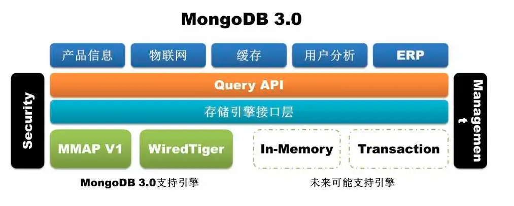
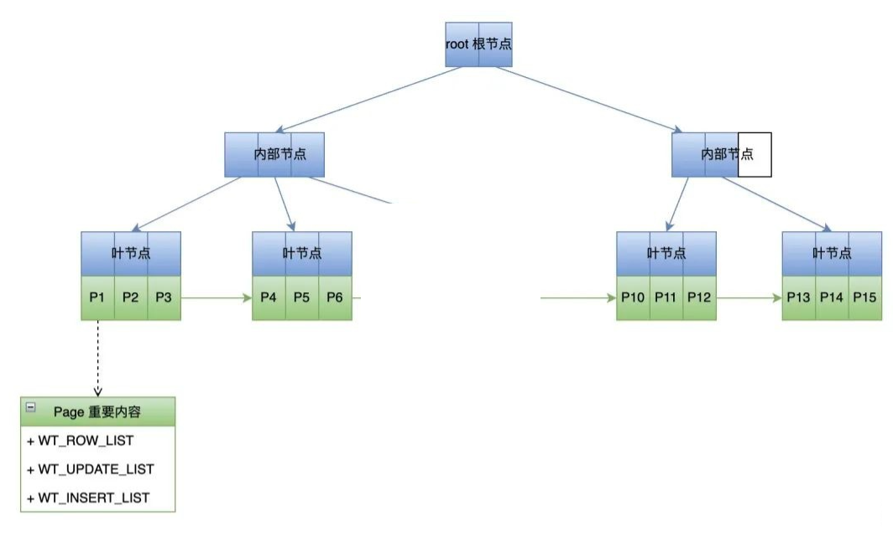
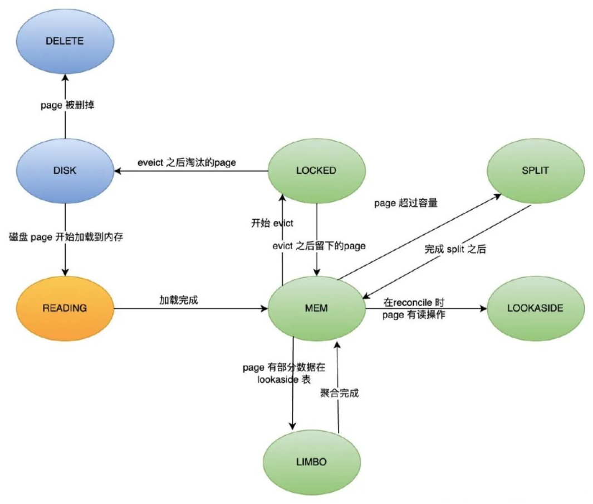
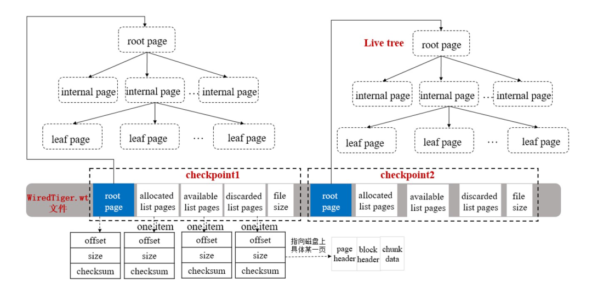
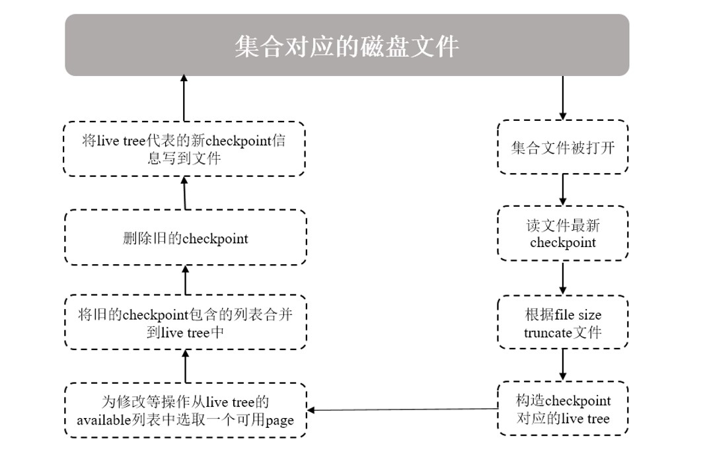
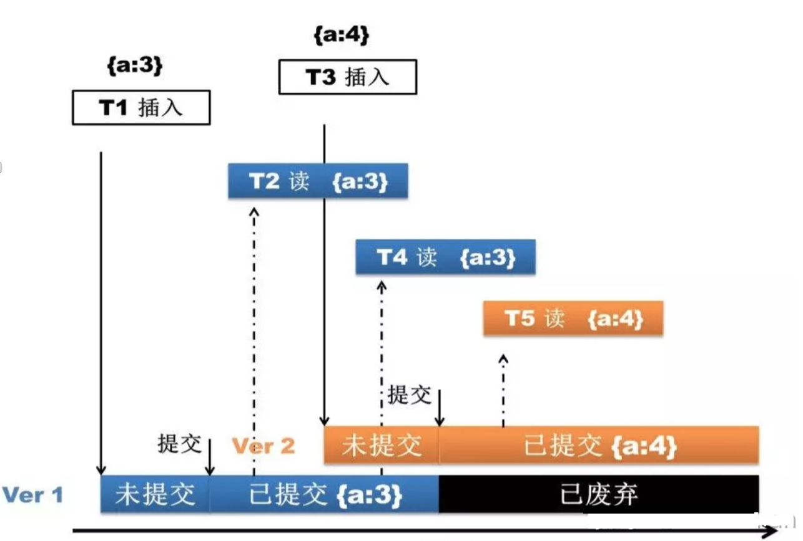

从MongoDB 3.2 版本开始，**WiredTiger**成为MongDB默认存储引擎。

存储引擎要做的事情无外乎是将磁盘上的数据读到内存并返回给应用，或者将应用修改的数据由内存写到磁盘上。如何设计一种高效的数据结构和算法是所有存储引擎要考虑的根本问题，目前大多数流行的存储引擎是基于**B+Tree**或**LSM**(Log Structured Merge) Tree这两种数据结构来设计的。

像Oracle、SQL Server、DB2、MySQL (InnoDB)和PostgreSQL这些传统的关系数据库依赖的底层存储引擎是基于B+Tree开发的；而像Cassandra、Elasticsearch (Lucene)、Google Bigtable、Apache HBase、LevelDB和RocksDB这些当前比较流行的NoSQL数据库存储引擎是基于LSM开发的。当然有些数据库采用了插件式的存储引擎架构，实现了Server层和存储引擎层的解耦，可以支持多种存储引擎，如MySQL既可以支持B+Tree结构的InnoDB存储引擎，还可以支持LSM结构的RocksDB存储引擎。

# 1、数据结构

Wired Tiger在内存和磁盘上的数据结构都B+Tree，B+的特点是中间节点只有索引，数据都是存在叶节点。**Wired Tiger管理数据结构的基本单元Page**。

上图是Page在内存中的数据结构，是一个典型的B+ Tree，从上往下依次为**Root结点**、**内部结点**和**叶子结点**，每个结点就是一个Page，数据以Page为单位在内存和磁盘间进行调度，每个Page的大小决定了相应结点的分支数量，每条索引记录会包含一个数据指针，指向一条数据记录所在文件的偏移量。

如上图，假设每个结点100个分支，那么所有叶子结点合起来可以包含100万个键值（等于`100*100*100`）。通常情况下Root结点和内部结点的Page会驻留在内存中，所以查找一条数据可能只需2次磁盘I/O。但随着数据不断的插入、删除，会涉及到B-Tree结点的分裂、位置提升及合并等操作，因此维护一个B+Tree的平衡也是比较耗时的。

叶子Page上有3个重要的列表：

* **WT_ROW**：是从磁盘加载进来的数据数组。

* **WT_UPDATE**：是记录数据加载之后到下个checkpoint之间被修改的数据。

* **WT_INSERT**：是记录数据加载之后到下个checkpoint之间新增的数据。

上面说了Page的基本结构，接下来再看下Page的生命周期和状态流转，这个生命周期和Wired Tiger的缓存息息相关。

Page在磁盘和内存中的整个生命周期状态机如上图：

* **DIST**：初始状态，page在磁盘上的状态，必须被读到内存后才能使用，当page被evict后，状态也会被设置为这个。

* **DELETE**：page在磁盘上，但是已经从内存B-Tree上删除，当我们不在需要读某个leaf page时，可以将其删除。

* **READING**：page正在被某个线程从磁盘读到内存，其它的读线程等待它被读完，不需要重复去读。

* **MEM**：Page在内存中，且能正常读写。

* **LOCKED**：当page被evict时，会将page锁住，其它线程不可访问。

* **LOOKASIDE**：在执行reconcile的时候，如果page正在被其他线程读取被修改的部分，这个时候会把数据存储在lookasidetable里面。当页面再次被读时可以通过lookasidetable重构出内存Page。

* **LIMBO**：在执行完reconcile之后，Page会被刷到磁盘。这个时候如果page有lookasidetable数据，并且还没合并过来之前就又被加载到内存了，就会是这个状态，需要先从lookasidetable重构内存Page才能正常访问。
* **SPLIT**：当page变得过大时，会被split，原来指向的page不再被使用。

其中两个比较重要的过程是**reconcile**和**evict**。

其中reconcile发生在checkpoint的时候，将内存中Page的修改转换成磁盘需要的B+Tree结构。前面说了Page的WT_UPDATE和WT_UPDATE列表存储了数据被加载到内存之后的修改，类似一个内存级的oplog，而数据在磁盘中时显然不可能是这样的结构。因此reconcile会新建一个Page来将修改了的数据做整合，然后原Page就会被discarded，新page会被刷新到磁盘，同时加入LRU队列。

evict是内存不够用了或者脏数据过多的时候触发的，根据LRU规则淘汰内存 Page到磁盘。

# 2、Checkpoint

MongoDB的读写都是操作的内存，因此必须要有一定的机制将内存数据持久化到磁盘，这个功能就是Wired Tiger的Checkpoint来实现的。

总的来说，Checkpoint主要有两个目的：

* 将内存里面发生修改的数据写到数据文件进行持久化保存，确保数据一致性

* 实现数据库在某个时刻意外发生故障，再次启动时，缩短数据库的恢复时间

本质上来说，Checkpoint相当于一个日志，记录了上次Checkpoint后相关数据文件的变化。

一个Checkpoint包含关键信息如下图所示：

一个checkpoint 就是一个内存B+Tree，其结构就是前面提到的Page组成的树，它有几个重要的字段：

* **root page**：就是指向B+Tree的根节点。

* **allocated list pages**：上个checkpoint结束之后到本checkpoint结束前新分配的 page 列表

* **available list pages**：Wired Tiger分配了但是没有使用的page，新建 page 时直接从这里取。

* **discarded list pages**：上个checkpoint结束之后到本checkpoint结束前被删掉的page列表。

Checkpoint是数据库中一个比较耗资源的操作，一个checkpoint典型执行流程如下图所述：

1. 查询集合数据时，会打开集合对应的数据文件并读取其最新checkpoint数据；
2. 集合文件会按checkponit信息指定的大小（file size）被truncate掉，所以系统发生意外故障，恢复时可能会丢失checkponit之后的数据（如果没有开启Journal）；
3. 在内存构造一棵包含root page的live tree，表示这是当前可以修改的checkpoint结构，用来跟踪后面写操作引起的文件变化；其它历史的checkpoint信息只能读，可以被删除；
4. 内存里面的page随着增删改查被修改后，写入并需分配新的磁盘page时，将会从live tree中的available列表中选取可用的page供其使用。随后，这个新的page被加入到checkpoint的allocated列表中；
5. 如果一个checkpoint被删除时，它所包含的allocated和discarded两个列表信息将被合并到最新checkpoint的对应列表上；任何不再需要的磁盘pages，也会将其引用添加到live tree的available列表中；
6. 当新的checkpoint生成时，会重新刷新其allocated、available、discard三个列表中的信息，并计算此时集合文件的大小以及root page的位置、大小、checksum等信息，将这些信息作为checkpoint元信息写入文件；
7. 生成的checkpoint默认名称为WiredTigerCheckpoint，如果不明确指定其它名称，则新的checkpoint将自动取代上一次生成的checkpoint。

触发checkpoint执行，通常有如下几种情况：

* 按一定时间周期：默认**60s**，执行一次checkpoint；
* 按一定日志文件大小：当Journal日志文件大小达到2GB（如果已开启），执行一次checkpoint；
* 任何打开的数据文件被修改，关闭时将自动执行一次checkpoint。

Checkpoint是一个相当重量级的操作，当对集合文件执行checkpoint时，会在文件上获得一个排它锁，其它需要等待此锁的操作，可能会出现EBUSY的错误。

# 3、预写日志

WT采用预写日志的机制，在数据更新的时候，向将数据写入到日志文件，然后在创建Checkpoint开始时，将日志文件中的记录操作，刷新到数据文件，就是说通过，预写日志和Checkpoint，将数据更新持久化到数据文件中，实现数据的一致性，WT日志文件会记录从上一次Checkpoint操作的之后发生的所有数据更新，在Mongo系统奔溃时通过日志文件能够还原到上次Checkpoint操作之后发生的数据更新。

Journal 是顺序写入的日志文件，用于记录上一个Checkpoint之后发生的数据更新，能够将数据库从系统异常终止事件中还原到一个有效的状态。在数据更新时，先将数据更新写入到journal文件。

WiredTiger创建Checkpoint，能够将MongoDB数据库还原到上一个CheckPoint创建时的一致性状态，如果MongoDB在上一个Checkpoint之后异常终止，必须使用Journal日志文件，重做从上一个Checkpoint之后发生的数据更新操作，将数据还原到Journal记录的一致性状态，使用Journal日志还原的过程是：

1 获取上一个Checkpoint创建的标识值：从数据文件（Data Files）中查找上一个Checkpoint发生的标识值（Identifier）；
2 根据标识值匹配日志记录：从Journal Files 中搜索日志记录（Record），查找匹配上一个Checkpoint的标识值的日志记录；
3 重做日志记录：重做从上一个Checkpoint之后，记录在Journal Files中的所有日志记录；

# 4、多版本并发控制

WiredTiger为写操作使用**文档级别的并发控制**。因此，多个客户端可以同时修改集合的不同文档。对于大多数读写操作，WiredTiger使用乐观锁并发控制。

WT乐观锁机制与其它乐观锁实现机制大同小异，WT会在更新Document前记住即将被更新的所有Document当前版本号，并在更新前再次验证当前的版本号，若当前版本号没有发生改变，则说明该document在该原子事件中没有被其它请求更新，可以顺利写入，并且修改版本号；如果版本号发生改变，则说明该document在更新发生之前已经被其它的请求更新，由此触发一次写冲突，不过在遇到写冲突之后，WT会重试自动更新。

但是这不代表WT对所有操作都采用如此宽松的的乐观锁机制，对于某些全局的操作，WT依然会在Collection级，Database级甚至是Instance级的互斥锁机制，但是这样的全局操作实际上很少发生，通常只在DBA维护的时候才触发。
