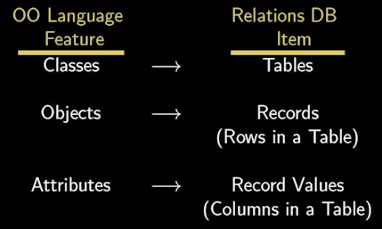
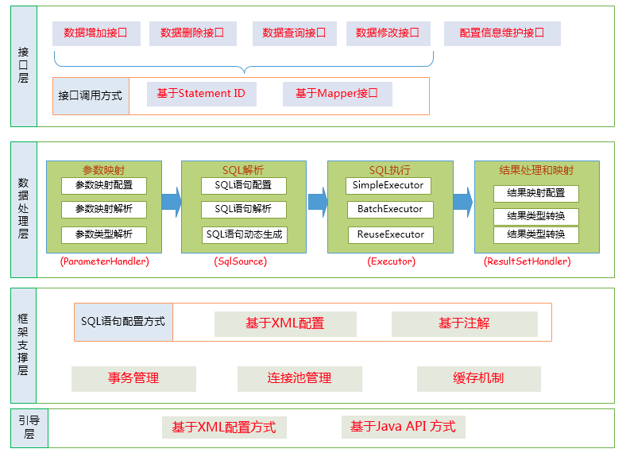
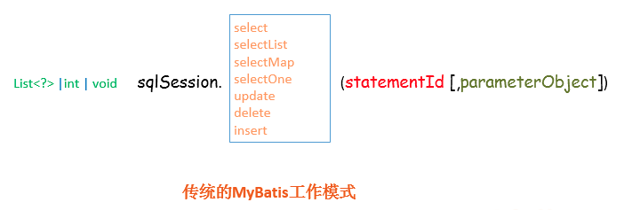
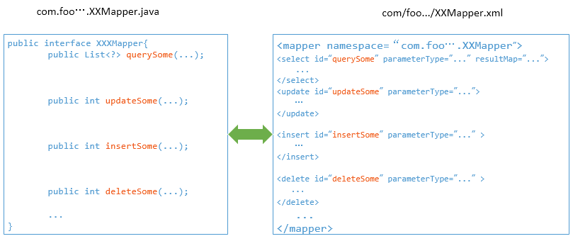
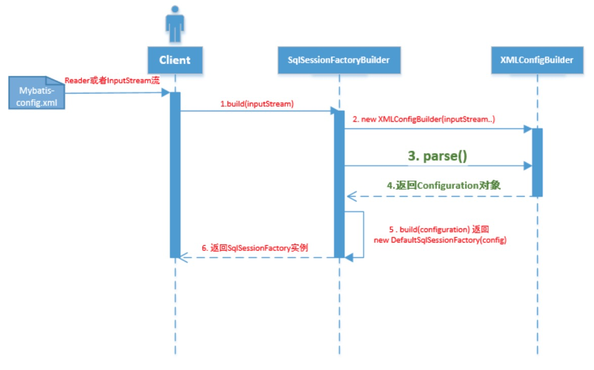
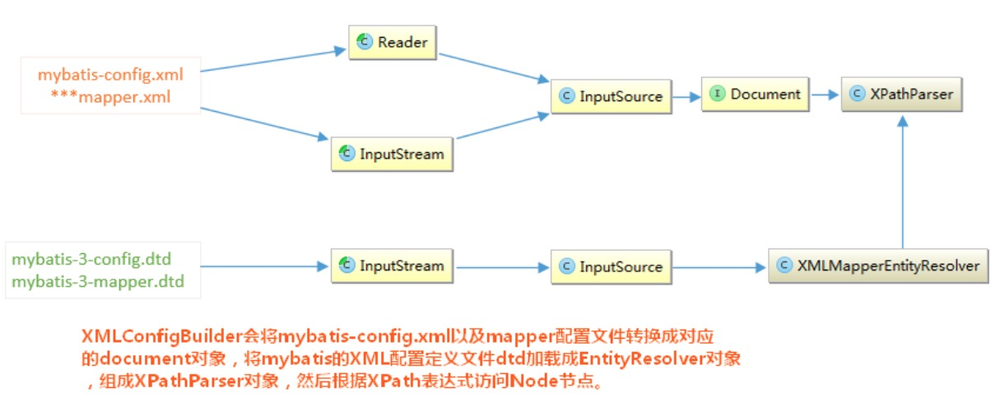
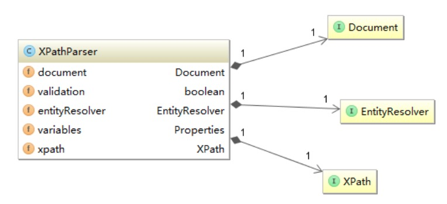
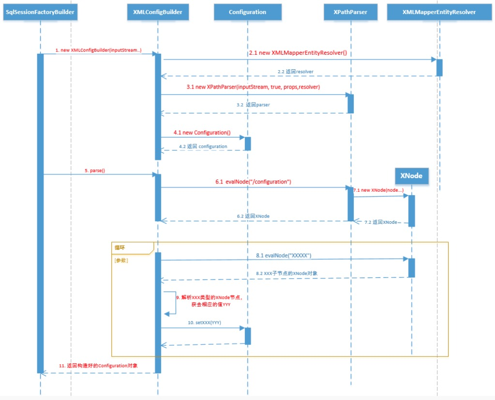
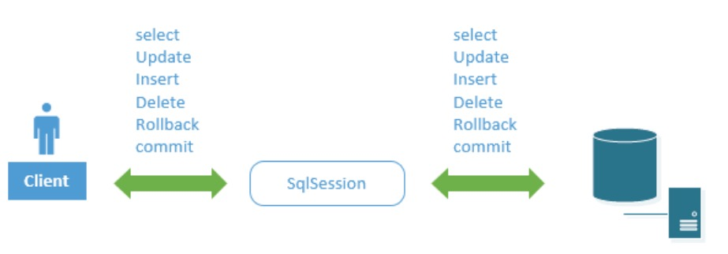

# 1、ORM

## 1.1 概述

面向对象编程把所有实体看成**对象**（object），关系型数据库则是采用实体之间的**关系**（relation）连接数据，两者的设计哲学是不一样的。这就导致一种困境：当使用面向对象的编程语言来进行应用开发时，从项目一开始就采用的是面向对象的思想（分析、设计、编程等），但到了持久层数据库访问时，又必须重返关系数据库的数据模型。

为了跨越面向对象程序设计语言和关系数据库之间的鸿沟，产生了ORM框架。

简单说，ORM 就是通过实例对象的语法，完成关系型数据库的操作的技术，是"对象-关系映射"（**Object/Relational Mapping**） 的缩写。

ORM 把数据库映射成对象：



基于此，应用程序不再直接访问底层数据库，而是以面向对象的方式来操作持久化对象，而ORM框架则将这些面向对象的操作转换成底层的SQL操作。开发者只使用面向对象编程，与数据对象直接交互，不用关心底层数据库。


## 1.2 JPA & Hibernate & MyBatis

JPA本身是一种ORM规范，并不是ORM产品。若应用程序是面向JPA编程，那么应用程序就可以在各种ORM框架之间切换。

MyBatis没有实现JPA，它和ORM框架的设计思路不完全一样。MyBatis是拥抱SQL，而ORM则更靠近面向对象，不建议写SQL，实在要写，则推荐你用框架自带的类SQL代替。MyBatis是SQL映射框架而不是ORM框架，当然ORM和MyBatis都是持久层框架。

最典型的ORM 框架是Hibernate，它是全自动ORM框架，而MyBatis是半自动的。ORM是Object和Relation之间的映射，包括Object->Relation和Relation->Object两方面。Hibernate是个完整的ORM框架，而MyBatis完成的是Relation->Object，也就是其所说的Data Mapper Framework。

但是近些年来，Hibernat在国内的IT界已经慢慢没落，Mybatis则后来居上，如日中天。造成这种局面的原因自然跟阿里、腾讯、网易等大厂的推广有很大关系，不过个人认为，根本原因还是在于两者的设计哲学不一样。一言以蔽之：Hibernate什么都想管，JDBC什么都不想管，一个管的太多，一个管的太少，最终，反倒让Mybatis这个管的不多不少的中庸者胜出了。

# 2、架构分析

Mybatis虽然体量不大，实现简单，但是骨骼清奇，代码优雅，很适合作为入门的开源框架来研究。

总体架构如下：



## 2.1 接口层

MyBatis和数据库的交互有两种方式。

第一种是基于使用传统的API方式。传递Statement Id 和查询参数给 SqlSession 对象，使用 SqlSession对象完成和数据库的交互。MyBatis 提供了非常方便和简单的API，供用户实现对数据库的增删改查数据操作，以及对数据库连接信息和MyBatis 自身配置信息的维护操作。



第二种是使用Mapper接口。 MyBatis 将配置文件中的每一个`<mapper>` 节点抽象为一个 Mapper 接口，而这个接口中声明的方法和跟`<mapper>` 节点中的`<select|update|delete|insert>` 节点项对应，即`<select|update|delete|insert>` 节点的id值为Mapper 接口中的方法名称，`parameterType` 值表示Mapper 对应方法的入参类型，而`resultMap` 值则对应了Mapper 接口表示的返回值类型或者返回结果集的元素类型。


 根据MyBatis 的配置规范配置好后，通过`SqlSession.getMapper(XXXMapper.class)` 方法，MyBatis 会根据相应的接口声明的方法信息，通过动态代理机制生成一个Mapper 实例，我们使用Mapper 接口的某一个方法时，MyBatis 会根据这个方法的方法名和参数类型，确定Statement Id，底层还是通过`SqlSession.select("statementId",parameterObject);`或者`SqlSession.update("statementId",parameterObject); `等等来实现对数据库的操作。

MyBatis 引用Mapper 接口这种调用方式，纯粹是为了满足面向接口编程的需要。（其实还有一个原因是在于，面向接口的编程，使得用户在接口上可以使用注解来配置SQL语句，这样就可以脱离XML配置文件，实现“0配置”）。

## 2.2 数据处理层

数据处理层可以说是MyBatis 的核心，从大的方面上讲，它要完成三个功能：

- 通过传入参数构建动态SQL语句

- SQL语句的执行
- 封装查询结果集成List<E>

动态语句生成可以说是MyBatis框架非常优雅的一个设计，MyBatis 通过传入的参数值，使用 Ognl 来动态地构造SQL语句，使得MyBatis 有很强的灵活性和扩展性。

参数映射指的是对于java 数据类型和jdbc数据类型之间的转换：这里有包括两个过程：查询阶段，我们要将java类型的数据，转换成jdbc类型的数据，通过 `preparedStatement.setXXX()` 来设值；另一个就是对resultset查询结果集的jdbcType 数据转换成java 数据类型。

动态SQL语句生成之后，MyBatis 将执行SQL语句，并将可能返回的结果集转换成List<E> 列表。MyBatis 在对结果集的处理中，支持结果集关系一对多和多对一的转换，并且有两种支持方式，一种为嵌套查询语句的查询，还有一种是嵌套结果集的查询。

## 2.3 框架支撑层

负责最基础的功能支撑，包括连接管理、事务管理、配置加载和缓存处理，这些都是共用的东西，将他们抽取出来作为最基础的组件。为上层的数据处理层提供最基础的支撑。

## 2.4 引导层

引导层是配置和启动MyBatis 配置信息的方式。MyBatis 提供两种方式来引导MyBatis ：基于XML配置文件的方式和基于Java API 的方式。

# 3、主要组件

![[]](5.png)

从MyBatis代码实现的角度来看，MyBatis的主要的核心组件有以下几个：

- SqlSession：作为MyBatis工作的主要顶层API，表示和数据库交互的会话，完成必要数据库增删改查功能
- Executor：MyBatis执行器，是MyBatis 调度的核心，负责SQL语句的生成和查询缓存的维护
- StatementHandler：封装了JDBC Statement操作，负责对JDBC statement 的操作，如设置参数、将Statement结果集转换成List集合
- ParameterHandler：负责对用户传递的参数转换成JDBC Statement 所需要的参数
- ResultSetHandler：负责将JDBC返回的ResultSet结果集对象转换成List类型的集合
- TypeHandler：负责java数据类型和jdbc数据类型之间的映射和转换
- MappedStatement：MappedStatement维护了一条<select|update|delete|insert>节点的封装
- SqlSource：负责根据用户传递的parameterObject，动态地生成SQL语句，将信息封装到BoundSql对象中，并返回
- BoundSql：表示动态生成的SQL语句以及相应的参数信息
- Configuration：MyBatis所有的配置信息都维持在Configuration对象之中

# 4、源码解读

下面深入源码细节，来看看Mybatis的各个组件如何相互协作，将上面架构图落地实现。

## 4.1 初始化过程

任何框架的初始化，无非是加载自己运行时所需要的配置信息。

MyBatis使用 `org.apache.ibatis.session.Configuration` 对象作为一个所有配置信息的容器，`Configuration`对象的组织结构和XML配置文件的组织结构几乎完全一样（当然，Configuration对象的功能并不限于此，它还负责创建一些MyBatis内部使用的对象，如Executor等）。

现在就从使用MyBatis的简单例子入手，深入分析一下MyBatis是怎样完成初始化的，都初始化了什么。

```java
String resource = "mybatis-config.xml";
InputStream inputStream = Resources.getResourceAsStream(resource);
SqlSessionFactory sqlSessionFactory = new SqlSessionFactoryBuilder().build(inputStream);
SqlSession sqlSession = sqlSessionFactory.openSession();
List list = sqlSession.selectList("com.foo.bean.BlogMapper.queryAllBlogInfo");
```

上述语句的作用是执行`com.foo.bean.BlogMapper.queryAllBlogInfo` 定义的SQL语句，返回一个List结果集。总的来说，上述代码经历了mybatis初始化 -->创建SqlSession -->执行SQL语句并返回结果三个过程。

初始化的基本过程如下图所示：



SqlSessionFactoryBuilder相关的代码如下所示：

```java
public SqlSessionFactory build(InputStream inputStream, String environment, Properties properties)
{
    try
    {
        //1. 创建XMLConfigBuilder对象用来解析XML配置文件，生成Configuration对象
        XMLConfigBuilder parser = new XMLConfigBuilder(inputStream, environment, properties);
      
        //2. 将XML配置文件内的信息解析成Java对象Configuration对象
        Configuration config = parser.parse();
      
        //3. 根据Configuration对象创建出SqlSessionFactory对象
        return build(config);
      
    } catch (Exception e) {
        throw ExceptionFactory.wrapException("Error building SqlSession.", e);
    } finally {
        //...
    }
}
//从此处可以看出，MyBatis内部通过Configuration对象来创建SqlSessionFactory,
//用户也可以自己通过API构造好Configuration对象，调用此方法创建SqlSessionFactory
public SqlSessionFactory build(Configuration config)
{
    return new DefaultSqlSessionFactory(config);
}
```

上述的初始化过程中，涉及到了以下几个对象：

- SqlSessionFactoryBuilder ： SqlSessionFactory的构造器，用于创建SqlSessionFactory，采用了Builder设计模式
- Configuration ：该对象是mybatis-config.xml文件中所有mybatis配置信息
- SqlSessionFactory：SqlSession工厂类，以工厂形式创建SqlSession对象，采用了Factory工厂设计模式
- XmlConfigParser ：负责将mybatis-config.xml配置文件解析成Configuration对象，共SqlSessonFactoryBuilder使用，创建SqlSessionFactory

XMLConfigBuilder的`parse()`方法返回了Configuration对象。那么`parse()`方法是如何处理XML文件，生成Configuration对象的呢？

XMLConfigBuilder会将XML配置文件的信息转换为Document对象，而XML配置定义文件DTD转换成XMLMapperEntityResolver对象，然后将二者封装到XpathParser对象中，XpathParser的作用是提供根据Xpath表达式获取基本的DOM节点Node信息的操作。如下图所示：





之后XMLConfigBuilder调用`parse()`方法：会从XPathParser中取出 `<configuration>`节点对应的Node对象，然后解析此Node节点的子Node：

```java
  private void parseConfiguration(XNode root) {
    try {
      //1.首先处理properties 节点	
      propertiesElement(root.evalNode("properties")); //issue #117 read properties first
      //2.处理typeAliases
      typeAliasesElement(root.evalNode("typeAliases"));
      //3.处理插件
      pluginElement(root.evalNode("plugins"));
      //4.处理objectFactory
      objectFactoryElement(root.evalNode("objectFactory"));
      //5.objectWrapperFactory
      objectWrapperFactoryElement(root.evalNode("objectWrapperFactory"));
      //6.settings
      settingsElement(root.evalNode("settings"));
      //7.处理environments
      environmentsElement(root.evalNode("environments")); // read it after objectFactory and objectWrapperFactory issue #631
      //8.database
      databaseIdProviderElement(root.evalNode("databaseIdProvider"));
      //9. typeHandlers
      typeHandlerElement(root.evalNode("typeHandlers"));
      //10 mappers
      mapperElement(root.evalNode("mappers"));
    } catch (Exception e) {
      throw new BuilderException("Error parsing SQL Mapper Configuration. Cause: " + e, e);
    }
  }
```

在上述代码中，还有一个非常重要的地方，就是解析XML配置文件子节点`<mappers>`的方法`mapperElements(root.evalNode("mappers"))`, 它将解析我们配置的Mapper.xml配置文件，Mapper配置文件是MyBatis的核心，MyBatis的特性和理念都体现在此Mapper的配置和设计上。

以上述的`environmentsElement(root.evalNode("environments")); `，看看XML的子节点是如何解析出来，设置到Configuration对象中的：

```java
/*
   解析environments节点，并将结果设置到Configuration对象中
   注意：创建envronment时，如果SqlSessionFactoryBuilder指定了特定的环境（即数据源）；
         则返回指定环境（数据源）的Environment对象，否则返回默认的Environment对象；
         这种方式实现了MyBatis可以连接多数据源
*/
private void environmentsElement(XNode context) throws Exception
{
    if (context != null)
    {
        if (environment == null)
        {
            environment = context.getStringAttribute("default");
        }
        for (XNode child : context.getChildren())
        {
            String id = child.getStringAttribute("id");
            if (isSpecifiedEnvironment(id))
            {
                //1.创建事务工厂 TransactionFactory
                TransactionFactory txFactory = transactionManagerElement(child.evalNode("transactionManager"));
                DataSourceFactory dsFactory = dataSourceElement(child.evalNode("dataSource"));
                //2.创建数据源DataSource
                DataSource dataSource = dsFactory.getDataSource();
                //3. 构造Environment对象
                Environment.Builder environmentBuilder = new Environment.Builder(id)
                .transactionFactory(txFactory)
                .dataSource(dataSource);
                //4. 将创建的Envronment对象设置到configuration 对象中
                configuration.setEnvironment(environmentBuilder.build());
            }
        }
    }
}
```

至此，Mybatis的初始化流程有了一个比较清晰的脉络，时序图如下：




## 4.2 从一次select 查询语句说起

下面用一个查询的实例，来分析系Mybatis的架构设计。

```java
//1.加载mybatis的配置文件，初始化mybatis，创建出SqlSessionFactory，是创建SqlSession的工厂
InputStream inputStream = Resources.getResourceAsStream("mybatisConfig.xml");
SqlSessionFactoryBuilder builder = new SqlSessionFactoryBuilder();
SqlSessionFactory factory = builder.build(inputStream);

//2. 从SqlSession工厂 SqlSessionFactory中创建一个SqlSession，进行数据库操作
SqlSession sqlSession = factory.openSession();

//3.使用SqlSession查询
Map<String,Object> params = new HashMap<String,Object>();

params.put("min_salary",10000);
//4.查询工资低于10000的员工
List<Employee> result = sqlSession.selectList("test.EmployeesMapper.selectByMinSalary",params);
```

### 4.2.1 SqlSession

`SqlSession sqlSession = factory.openSession();`

 MyBatis使用SqlSession来封装一次数据库的会话访问，通过SqlSession实现事务控制与数据查询。



`List<Employee> result = sqlSession.selectList("test.EmployeesMapper.selectByMinSalary",params);`

上述的`test.EmployeesMapper.selectByMinSalary`是配置在Mapper.xml 的Statement ID，params 是传递的查询参数。来看一下`sqlSession.selectList()`方法的定义： 

```java
  public <E> List<E> selectList(String statement, Object parameter) {
    return this.selectList(statement, parameter, RowBounds.DEFAULT);
  }
 
  public <E> List<E> selectList(String statement, Object parameter, RowBounds rowBounds) {
    try {
      //1.根据Statement Id，在mybatis 配置对象Configuration中查找和配置文件相对应的MappedStatement	
      MappedStatement ms = configuration.getMappedStatement(statement);
      //2. 将查询任务委托给MyBatis 的执行器 Executor
      List<E> result = executor.query(ms, wrapCollection(parameter), rowBounds, Executor.NO_RESULT_HANDLER);
      return result;
    } catch (Exception e) {
      throw ExceptionFactory.wrapException("Error querying database.  Cause: " + e, e);
    } finally {
      ErrorContext.instance().reset();
    }
  }
```

MyBatis在初始化的时候，会将MyBatis的配置信息全部加载到内存中，使用`org.apache.ibatis.session.Configuration`实例来维护。使用者可以使用`sqlSession.getConfiguration()`方法来获取。MyBatis的配置文件中配置信息的组织格式和内存中对象的组织格式几乎完全对应的。假设上述例子中的sql配置如下：

```xml
  <select id="selectByMinSalary" resultMap="BaseResultMap" parameterType="java.util.Map" >
    select 
    	EMPLOYEE_ID, FIRST_NAME, LAST_NAME, EMAIL, SALARY
    	from LOUIS.EMPLOYEES
    	<if test="min_salary != null">
    		where SALARY < #{min_salary,jdbcType=DECIMAL}
    	</if>
  </select>
```

加载到内存中会生成一个对应的MappedStatement对象，然后会以key=`test.EmployeesMapper.selectByMinSalary` ，value为MappedStatement对象的形式维护到Configuration的一个Map中。当以后需要使用的时候，只需要通过Id值来获取就可以了。

从上述的代码中我们可以看到SqlSession的职能：

- 根据Statement ID, 在mybatis配置对象Configuration中获取到对应的MappedStatement对象
- 然后调用mybatis执行器来执行具体的操作

### 4.2.2 Executor

```java
/**
* BaseExecutor 类部分代码
*/
public <E> List<E> query(MappedStatement ms, Object parameter, RowBounds rowBounds, ResultHandler resultHandler) throws SQLException {
	  
	// 1.根据具体传入的参数，动态地生成需要执行的SQL语句，用BoundSql对象表示  
    BoundSql boundSql = ms.getBoundSql(parameter);
    // 2.为当前的查询创建一个缓存Key
    CacheKey key = createCacheKey(ms, parameter, rowBounds, boundSql);
    return query(ms, parameter, rowBounds, resultHandler, key, boundSql);
 }
 
  @SuppressWarnings("unchecked")
  public <E> List<E> query(MappedStatement ms, Object parameter, RowBounds rowBounds, ResultHandler resultHandler, CacheKey key, BoundSql boundSql) throws SQLException {
    ErrorContext.instance().resource(ms.getResource()).activity("executing a query").object(ms.getId());
    if (closed) throw new ExecutorException("Executor was closed.");
    if (queryStack == 0 && ms.isFlushCacheRequired()) {
      clearLocalCache();
    }
    List<E> list;
    try {
      queryStack++;
      list = resultHandler == null ? (List<E>) localCache.getObject(key) : null;
      if (list != null) {
        handleLocallyCachedOutputParameters(ms, key, parameter, boundSql);
      } else {
    	// 3.缓存中没有值，直接从数据库中读取数据  
        list = queryFromDatabase(ms, parameter, rowBounds, resultHandler, key, boundSql);
      }
    } finally {
      queryStack--;
    }
    if (queryStack == 0) {
      for (DeferredLoad deferredLoad : deferredLoads) {
        deferredLoad.load();
      }
      deferredLoads.clear(); 
      if (configuration.getLocalCacheScope() == LocalCacheScope.STATEMENT) {
        clearLocalCache(); 
      }
    }
    return list;
  }

private <E> List<E> queryFromDatabase(MappedStatement ms, Object parameter, RowBounds rowBounds, ResultHandler resultHandler, CacheKey key, BoundSql boundSql) throws SQLException {
    List<E> list;
    localCache.putObject(key, EXECUTION_PLACEHOLDER);
    try {
    	
      //4. 执行查询，返回List 结果，然后	将查询的结果放入缓存之中
      list = doQuery(ms, parameter, rowBounds, resultHandler, boundSql);
    } finally {
      localCache.removeObject(key);
    }
    localCache.putObject(key, list);
    if (ms.getStatementType() == StatementType.CALLABLE) {
      localOutputParameterCache.putObject(key, parameter);
    }
    return list;
  }
```

```java
/**
*SimpleExecutor类的doQuery()方法实现
*/
  public <E> List<E> doQuery(MappedStatement ms, Object parameter, RowBounds rowBounds, ResultHandler resultHandler, BoundSql boundSql) throws SQLException {
    Statement stmt = null;
    try {
      Configuration configuration = ms.getConfiguration();
      //5. 根据既有的参数，创建StatementHandler对象来执行查询操作
      StatementHandler handler = configuration.newStatementHandler(wrapper, ms, parameter, rowBounds, resultHandler, boundSql);
      //6. 创建java.Sql.Statement对象，传递给StatementHandler对象
      stmt = prepareStatement(handler, ms.getStatementLog());
      //7. 调用StatementHandler.query()方法，返回List结果集
      return handler.<E>query(stmt, resultHandler);
    } finally {
      closeStatement(stmt);
    }
  }
```

上述的`Executor.query()`方法几经转折，最后会创建一个StatementHandler对象，然后将必要的参数传递给StatementHandler，使用StatementHandler来完成对数据库的查询，最终返回List结果集。

从上面的代码中我们可以看出，Executor的功能和作用是：

- 根据传递的参数，完成SQL语句的动态解析，生成BoundSql对象，供StatementHandler使用；

- 为查询创建缓存，以提高性能；

- 创建JDBC的Statement连接对象，传递给StatementHandler对象，返回List查询结果。
  

### 4.2.3 StatementHandler

接着上面的Executor第六步，看下prepareStatement() 方法的实现：

```java
	/**
	 * SimpleExecutor类的doQuery()方法实现
	 */
	public <E> List<E> doQuery (MappedStatement ms, Object parameter, RowBounds rowBounds, ResultHandler resultHandler
			, BoundSql boundSql) throws SQLException {
		Statement stmt = null;
		try {
			Configuration configuration = ms.getConfiguration();
			StatementHandler handler = configuration.newStatementHandler(wrapper, ms, parameter, rowBounds,
					resultHandler, boundSql);
			// 1.准备Statement对象，并设置Statement对象的参数
			stmt = prepareStatement(handler, ms.getStatementLog());

			// 2. StatementHandler执行query()方法，返回List结果
			return handler.<E>query(stmt, resultHandler);

		} finally {
			closeStatement(stmt);
		}
	}

private Statement prepareStatement (StatementHandler handler, Log statementLog) throws SQLException {
		Statement stmt;
		Connection connection = getConnection(statementLog);
		stmt = handler.prepare(connection);

		//对创建的Statement对象设置参数，即设置SQL 语句中 ? 设置为指定的参数
		handler.parameterize(stmt);

		return stmt;
	}
```

StatementHandler 的`parameterize(statement)` 方法的实现：

```java
  /**
   *ParameterHandler类的setParameters(PreparedStatement ps) 实现
   * 对某一个Statement进行设置参数
   */
  public void setParameters(PreparedStatement ps) throws SQLException {
    ErrorContext.instance().activity("setting parameters").object(mappedStatement.getParameterMap().getId());
    List<ParameterMapping> parameterMappings = boundSql.getParameterMappings();
    if (parameterMappings != null) {
      for (int i = 0; i < parameterMappings.size(); i++) {
        ParameterMapping parameterMapping = parameterMappings.get(i);
        if (parameterMapping.getMode() != ParameterMode.OUT) {
          Object value;
          String propertyName = parameterMapping.getProperty();
          if (boundSql.hasAdditionalParameter(propertyName)) {
            value = boundSql.getAdditionalParameter(propertyName);
          } else if (parameterObject == null) {
            value = null;
          } else if (typeHandlerRegistry.hasTypeHandler(parameterObject.getClass())) {
            value = parameterObject;
          } else {
            MetaObject metaObject = configuration.newMetaObject(parameterObject);
            value = metaObject.getValue(propertyName);
          }
          
          // 每一个Mapping都有一个TypeHandler，根据TypeHandler来对preparedStatement进行设置参数
          TypeHandler typeHandler = parameterMapping.getTypeHandler();
          JdbcType jdbcType = parameterMapping.getJdbcType();
          if (value == null && jdbcType == null) jdbcType = configuration.getJdbcTypeForNull();
          // 设置参数
          typeHandler.setParameter(ps, i + 1, value, jdbcType);
        }
      }
    }
  }
```

从上述的代码可以看到,StatementHandler 的`parameterize(Statement)` 方法调用了 ParameterHandler的`setParameters(statement)` 方法，根据我们输入的参数，对statement对象的 `?` 占位符进行赋值。


StatementHandler 的`List<E> query(Statement statement, ResultHandler resultHandler)`方法的实现：

```java
  /**
   * PreParedStatement类的query方法实现
   */
  public <E> List<E> query(Statement statement, ResultHandler resultHandler) throws SQLException {
	// 1.调用preparedStatemnt。execute()方法，然后将resultSet交给ResultSetHandler处理  
    PreparedStatement ps = (PreparedStatement) statement;
    ps.execute();
    //2. 使用ResultHandler来处理ResultSet
    return resultSetHandler.<E> handleResultSets(ps);
  }
```

```java
/**  
*ResultSetHandler类的handleResultSets()方法实现
*/
public List<Object> handleResultSets(Statement stmt) throws SQLException {
    final List<Object> multipleResults = new ArrayList<Object>();
 
    int resultSetCount = 0;
    ResultSetWrapper rsw = getFirstResultSet(stmt);
 
    List<ResultMap> resultMaps = mappedStatement.getResultMaps();
    int resultMapCount = resultMaps.size();
    validateResultMapsCount(rsw, resultMapCount);
    
    while (rsw != null && resultMapCount > resultSetCount) {
      ResultMap resultMap = resultMaps.get(resultSetCount);
      
      //将resultSet
      handleResultSet(rsw, resultMap, multipleResults, null);
      rsw = getNextResultSet(stmt);
      cleanUpAfterHandlingResultSet();
      resultSetCount++;
    }
 
    String[] resultSets = mappedStatement.getResulSets();
    if (resultSets != null) {
      while (rsw != null && resultSetCount < resultSets.length) {
        ResultMapping parentMapping = nextResultMaps.get(resultSets[resultSetCount]);
        if (parentMapping != null) {
          String nestedResultMapId = parentMapping.getNestedResultMapId();
          ResultMap resultMap = configuration.getResultMap(nestedResultMapId);
          handleResultSet(rsw, resultMap, null, parentMapping);
        }
        rsw = getNextResultSet(stmt);
        cleanUpAfterHandlingResultSet();
        resultSetCount++;
      }
    }
 
    return collapseSingleResultList(multipleResults);
  }
```

从上述代码我们可以看出，StatementHandler 的`List<E> query(Statement statement, ResultHandler resultHandler)`方法的实现，是调用了ResultSetHandler的`handleResultSets(Statement)` 方法。ResultSetHandler的`handleResultSets(Statement) `方法会将Statement语句执行后生成的resultSet 结果集转换成List<E> 结果集：

以上我们可以总结StatementHandler对象主要完成三个工作：

- 对预编译SQL语句中的占位符赋值
- 执行SQL
- 将数据库返回的resultSet封装成List

