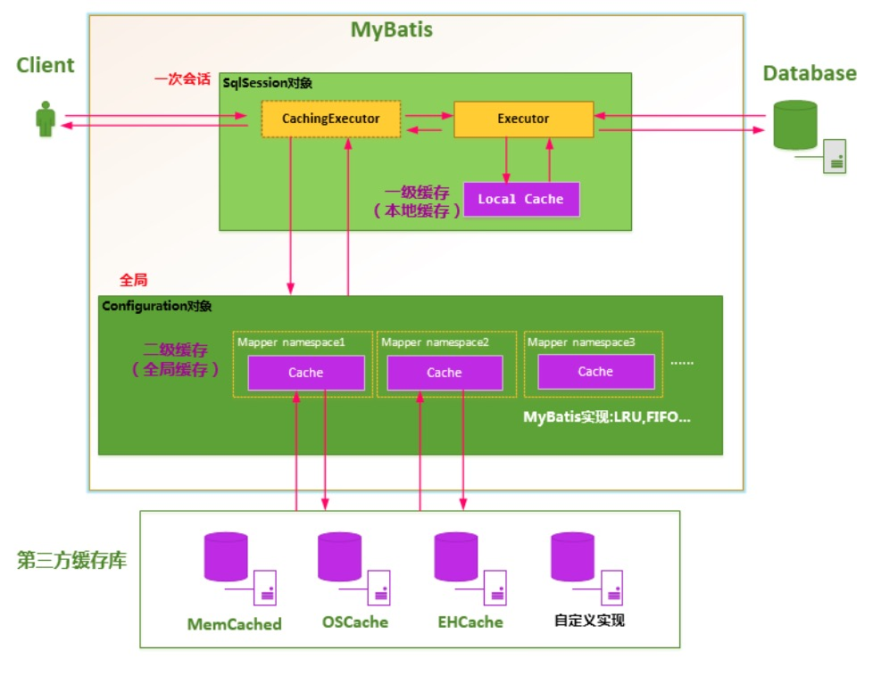
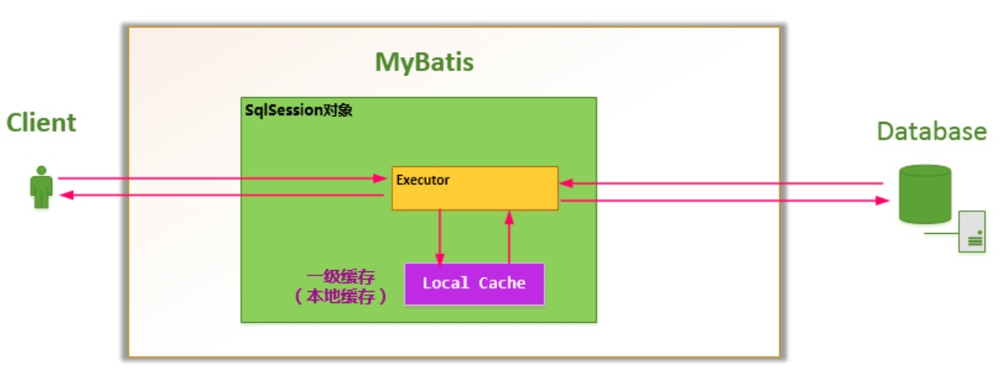
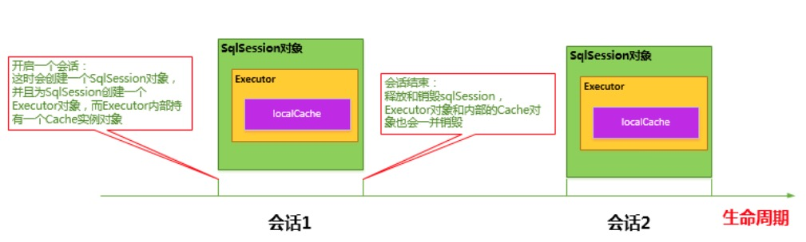
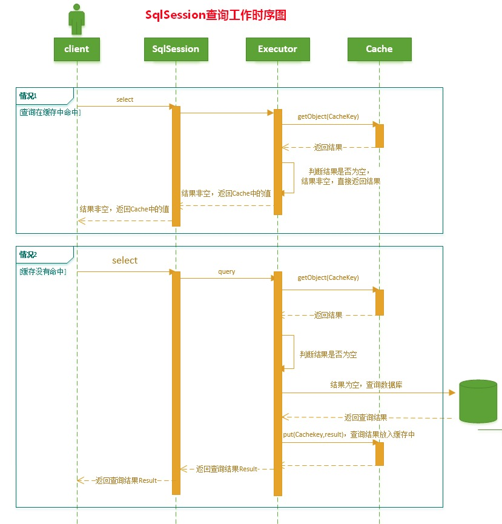
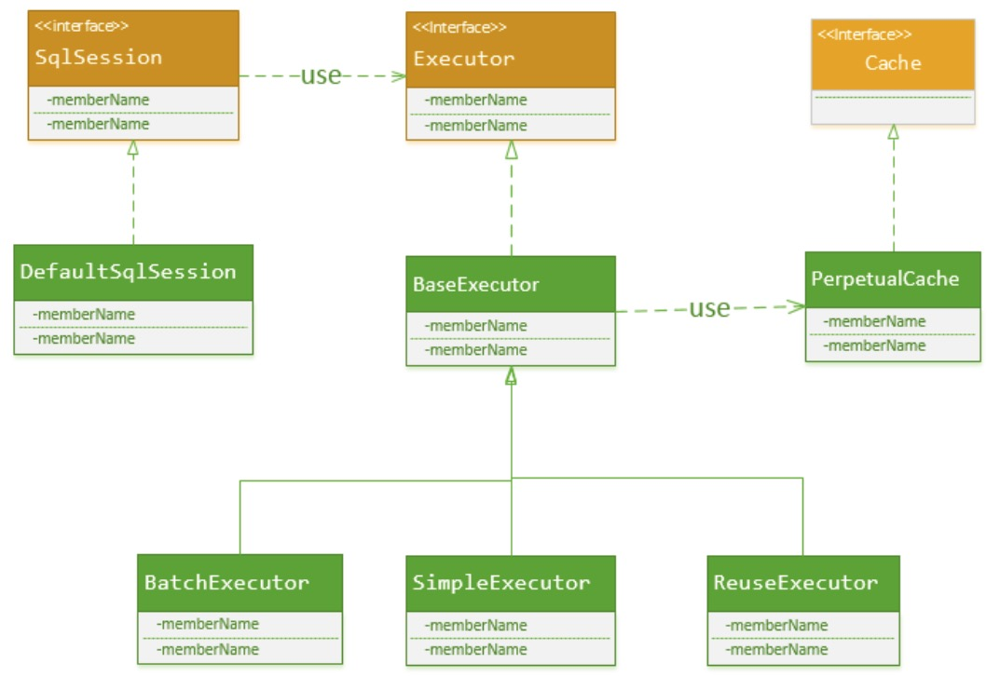
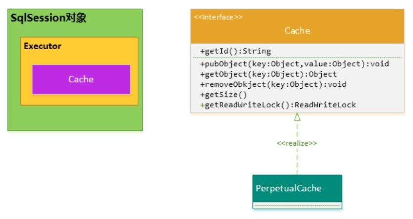
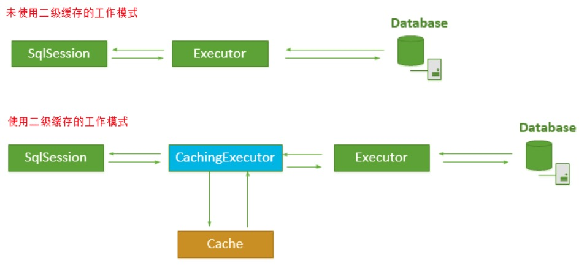
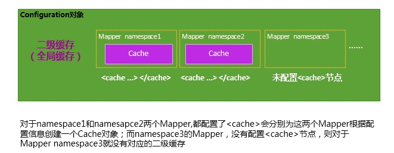
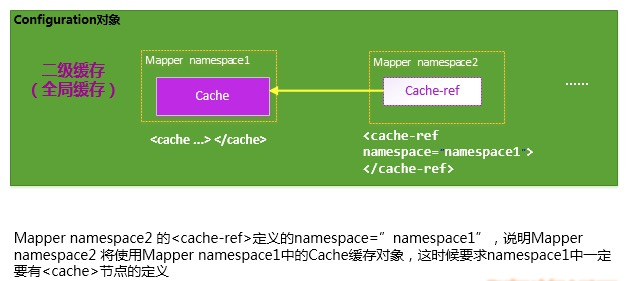

# 1、概述

MyBatis将数据缓存设计成两级结构：

- **一级缓存是Session会话级别的缓存**，位于表示一次数据库会话的SqlSession对象之中，又被称之为本地缓存。一级缓存是MyBatis内部实现的一个特性，用户不能配置，默认情况下自动支持的缓存，用户没有定制它的权利（不过这也不是绝对的，可以通过开发插件对它进行修改）
- **二级缓存是Application应用级别的缓存**，它的是生命周期很长，跟Application的声明周期一样，也就是说它的作用范围是整个Application应用



# 2、一级缓存

## 2.1 作用范围

每当我们使用MyBatis开启一次和数据库的会话，MyBatis会创建出一个SqlSession对象表示一次数据库会话。

在对数据库的一次会话中，我们有可能会反复地执行完全相同的查询语句，如果不采取一些措施的话，每一次查询都会查询一次数据库,而我们在极短的时间内做了完全相同的查询，那么它们的结果极有可能完全相同，由于查询一次数据库的代价很大，这有可能造成很大的资源浪费。

为了解决这一问题，MyBatis会在表示会话的SqlSession对象中建立一个简单的缓存，将每次查询到的结果结果缓存起来，当下次查询的时候，如果判断先前有个完全一样的查询，会直接从缓存中直接将结果取出，返回给用户，不需要再进行一次数据库查询了。



## 2.2 生命周期

- MyBatis在开启一个数据库会话时，会 创建一个新的SqlSession对象，SqlSession对象中会有一个新的Executor对象，Executor对象中持有一个新的PerpetualCache对象；当会话结束时，SqlSession对象及其内部的Executor对象还有PerpetualCache对象也一并释放掉。

- 如果SqlSession调用了close()方法，会释放掉一级缓存PerpetualCache对象，一级缓存将不可用；

- 如果SqlSession调用了clearCache()，会清空PerpetualCache对象中的数据，但是该对象仍可使用；

- SqlSession中执行了任何一个update操作(update()、delete()、insert()) ，都会清空PerpetualCache对象的数据，但是该对象可以继续使用
  



## 2.3 工作流程

1.对于某个查询，根据statementId,params,rowBounds来构建一个key值，根据这个key值去缓存Cache中取出对应的key值存储的缓存结果；

2. 判断从Cache中根据特定的key值取的数据数据是否为空，即是否命中；

3. 如果命中，则直接将缓存结果返回；

4. 如果没命中

    4.1  去数据库中查询数据，得到查询结果；

    4.2  将key和查询到的结果分别作为KV对存储到Cache中；

    4.3. 将查询结果返回；

5. 结束。




## 2.4 实现细节

实际上, SqlSession只是一个MyBatis对外的接口，SqlSession将它的工作交给了Executor执行器这个角色来完成，负责完成对数据库的各种操作。当创建了一个SqlSession对象时，MyBatis会为这个SqlSession对象创建一个新的Executor执行器，而缓存信息就被维护在这个Executor执行器中，MyBatis将缓存和对缓存相关的操作封装成了Cache接口中。

SqlSession、Executor、Cache之间的关系如下列类图所示：



如上述的类图所示，Executor接口的实现类BaseExecutor中拥有一个Cache接口的实现类PerpetualCache，则对于BaseExecutor对象而言，它将使用PerpetualCache对象维护缓存。

SqlSession对象、Executor对象、Cache对象之间的关系如下图所示：



PerpetualCache实现原理其实很简单，其内部就是通过一个简单的HashMap<k,v> 来实现的，没有其他的任何限制。如下是PerpetualCache的实现代码：

```java
public class PerpetualCache implements Cache {

  private String id;

  private Map<Object, Object> cache = new HashMap<Object, Object>();

  public PerpetualCache(String id) {
    this.id = id;
  }

  public String getId() {
    return id;
  }

  public int getSize() {
    return cache.size();
  }

  public void putObject(Object key, Object value) {
    cache.put(key, value);
  }

  public Object getObject(Object key) {
    return cache.get(key);
  }

  public Object removeObject(Object key) {
    return cache.remove(key);
  }

  public void clear() {
    cache.clear();
  }

  public ReadWriteLock getReadWriteLock() {
    return null;
  }

  public boolean equals(Object o) {
    if (getId() == null) throw new CacheException("Cache instances require an ID.");
    if (this == o) return true;
    if (!(o instanceof Cache)) return false;

    Cache otherCache = (Cache) o;
    return getId().equals(otherCache.getId());

  }

  public int hashCode() {
    if (getId() == null) throw new CacheException("Cache instances require an ID.");
    return getId().hashCode();
  }

}
```

Cache将本次查询使用的特征值作为key，将查询结果作为value存储到Map中，那么问题来了：怎样来确定一次查询的特征值？

MyBatis认为，对于两次查询，如果以下条件都完全一样，那么就认为它们是完全相同的两次查询：

1. 传入的 statementId，它代表着你将执行什么样的sql
2. 查询时要求的结果集中的结果范围 （结果的范围通过rowBounds.offset和rowBounds.limit表示），MyBatis自身提供的分页功能是通过RowBounds来实现的，它通过rowBounds.offset和rowBounds.limit来过滤查询出来的结果集，这种分页功能是基于查询结果的再过滤，而不是进行数据库的物理分页
3. 这次查询所产生的最终要传递给JDBC java.sql.Preparedstatement的Sql语句字符串（boundSql.getSql() ）
4. 传递给java.sql.Statement要设置的参数值

综上所述,CacheKey由以下条件决定：

> 缓存key = statementId  + rowBounds  + 传递给JDBC的SQL  + 传递给JDBC的参数值
>

CacheKey的构建被放置到了Executor接口的实现类BaseExecutor中，定义如下：

```java
  /**
   * org.apache.ibatis.executor.BaseExecutor
   */
  public CacheKey createCacheKey(MappedStatement ms, Object parameterObject, RowBounds rowBounds, BoundSql boundSql) {
    if (closed) throw new ExecutorException("Executor was closed.");
    CacheKey cacheKey = new CacheKey();
    //1.statementId
    cacheKey.update(ms.getId());
    //2. rowBounds.offset
    cacheKey.update(rowBounds.getOffset());
    //3. rowBounds.limit
    cacheKey.update(rowBounds.getLimit());
    //4. SQL语句
    cacheKey.update(boundSql.getSql());
    //5. 将每一个要传递给JDBC的参数值也更新到CacheKey中
    List<ParameterMapping> parameterMappings = boundSql.getParameterMappings();
    TypeHandlerRegistry typeHandlerRegistry = ms.getConfiguration().getTypeHandlerRegistry();
    for (int i = 0; i < parameterMappings.size(); i++) { // mimic DefaultParameterHandler logic
      ParameterMapping parameterMapping = parameterMappings.get(i);
      if (parameterMapping.getMode() != ParameterMode.OUT) {
        Object value;
        String propertyName = parameterMapping.getProperty();
        if (boundSql.hasAdditionalParameter(propertyName)) {
          value = boundSql.getAdditionalParameter(propertyName);
        } else if (parameterObject == null) {
          value = null;
        } else if (typeHandlerRegistry.hasTypeHandler(parameterObject.getClass())) {
          value = parameterObject;
        } else {
          MetaObject metaObject = configuration.newMetaObject(parameterObject);
          value = metaObject.getValue(propertyName);
        }
        //将每一个要传递给JDBC的参数值也更新到CacheKey中
        cacheKey.update(value);
      }
    }
    return cacheKey;
  }    
```

刚才已经提到，Cache接口的实现，本质上是使用的HashMap<k,v>,而构建CacheKey的目的就是为了作为HashMap<k,v>中的key值。而HashMap是通过key值的hashcode 来组织和存储的，那么，构建CacheKey的过程实际上就是构造其hashCode的过程。下面的代码就是CacheKey的核心hashcode生成算法：

```java
  public void update(Object object) {
    if (object != null && object.getClass().isArray()) {
      int length = Array.getLength(object);
      for (int i = 0; i < length; i++) {
        Object element = Array.get(object, i);
        doUpdate(element);
      }
    } else {
      doUpdate(object);
    }
  }
 
  private void doUpdate(Object object) {
	
	  //1. 得到对象的hashcode;  
    int baseHashCode = object == null ? 1 : object.hashCode();
    //对象计数递增
    count++;
    checksum += baseHashCode;
    //2. 对象的hashcode 扩大count倍
    baseHashCode *= count;
    //3. hashCode * 拓展因子（默认37）+拓展扩大后的对象hashCode值
    hashcode = multiplier * hashcode + baseHashCode;
    updateList.add(object);
  }
```

## 2.5 性能分析

MyBatis并没有对HashMap的容量和大小进行限制，难道不会有隐患吗？如果我一直使用某一个SqlSession对象查询数据，这样会不会导致HashMap太大，而导致 OutOfMemoryError错误啊？ 

MyBatis这样设计也有它自己的理由：

- 一般而言SqlSession的生存时间很短，使用一个SqlSession对象执行的操作不会太多，执行完就会消亡；

- 对于某一个SqlSession对象而言，只要执行update操作（update、insert、delete），都会将这个SqlSession对象中对应的一级缓存清空掉，所以一般情况下不会出现缓存过大，影响JVM内存空间的问题；

- 可以手动地释放掉SqlSession对象中的缓存。

还有个问题，一级缓存是一种粗粒度的缓存，没有更新缓存和缓存过期的概念。MyBatis只负责将查询数据库的结果存储到缓存中去， 不会去判断缓存存放的时间是否过长、是否过期，因此也就没有对缓存的结果进行更新这一说了。


根据一级缓存的特性，在使用的过程中应该注意：

- 对于数据变化频率很大，并且需要高时效准确性的数据要求，我们使用SqlSession查询的时候，要控制好SqlSession的生存时间，SqlSession的生存时间越长，它其中缓存的数据有可能就越旧，从而造成和真实数据库的误差；同时对于这种情况，用户也可以手动地适时清空SqlSession中的缓存；
- 对于只执行、并且频繁执行大范围的select操作的SqlSession对象，SqlSession对象的生存时间不应过长。

# 3、二级缓存

## 3.1 作用范围

MyBatis的二级缓存是Application级别的缓存，它可以提高对数据库查询的效率，以提高应用的性能。

一个SqlSession对象会使用一个Executor对象来完成会话操作，MyBatis的二级缓存机制的关键就是对这个Executor对象做文章。如果用户配置了`cacheEnabled=true`，MyBatis在为SqlSession对象创建Executor对象时，会对Executor对象加上一个装饰者：CachingExecutor，这时SqlSession使用CachingExecutor对象来完成操作请求。CachingExecutor对于查询请求，会先判断该查询请求在Application级别的二级缓存中是否有缓存结果，如果有查询结果，则直接返回缓存结果；如果缓存中没有，再交给真正的Executor对象来完成查询操作，之后CachingExecutor会将真正Executor返回的查询结果放置到缓存中，然后在返回给用户。



## 3.2 配置方式

MyBatis并不是简单地对整个Application就只有一个Cache缓存对象，它将缓存划分的更细，即是Mapper级别的。

对于每一个Mapper.xml,如果在其中使用了`<cache>` 节点，则MyBatis会为这个Mapper创建一个Cache缓存对象，如下图所示：



如果你想让多个Mapper公用一个Cache的话，你可以使用`<cache-ref namespace="">`节点，来指定你的这个Mapper使用到了哪一个Mapper的Cache缓存：



MyBatis对二级缓存的支持粒度很细，它会指定某一条查询语句是否使用二级缓存。

虽然在Mapper中配置了`<cache>`，并且为此Mapper分配了Cache对象，这并不表示我们使用Mapper中定义的查询语句查到的结果都会放置到Cache对象之中，我们必须指定Mapper中的某条选择语句是否支持缓存，即如下所示，在`<select>` 节点中配置`useCache="true"`，Mapper才会对此Select的查询支持缓存特性，如下所示：

```xml
<select id="selectByMinSalary" resultMap="BaseResultMap" parameterType="java.util.Map" useCache="true">
```

总之，要想使某条Select查询支持二级缓存，需要保证：

      1.  MyBatis支持二级缓存的总开关：全局配置变量参数   `cacheEnabled=true`
      2.  该select语句所在的Mapper，配置了`<cache>` 或`<cached-ref>`节点，并且有效
      3.  该select语句的参数 `useCache="true"`

## 3.3 缓存策略

MyBatis对二级缓存的设计非常灵活，它自己内部实现了一系列的Cache缓存实现类，并提供了各种缓存刷新策略如LRU，FIFO等等；另外，MyBatis还允许用户自定义Cache接口实现，用户是需要实现`org.apache.ibatis.cache.Cache`接口，然后将Cache实现类配置在`<cache  type="">`节点的type属性上即可。

对于每个Cache而言，都有一个容量限制，MyBatis各供了各种策略来对Cache缓存的容量进行控制，以及对Cache中的数据进行刷新和置换。MyBatis主要提供了以下几个刷新和置换策略：

-  **LRU**：（Least Recently Used）：最近最少使用算法，即如果缓存中容量已经满了，会将缓存中最近做少被使用的缓存记录清除掉，然后添加新的记录

-  **FIFO**：（First in first out）：先进先出算法，如果缓存中的容量已经满了，那么会将最先进入缓存中的数据清除掉

-  **Scheduled**：指定时间间隔清空算法，该算法会以指定的某一个时间间隔将Cache缓存中的数据清空


