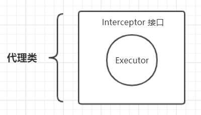
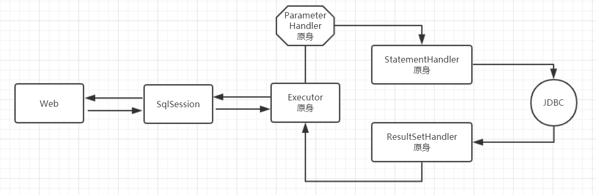
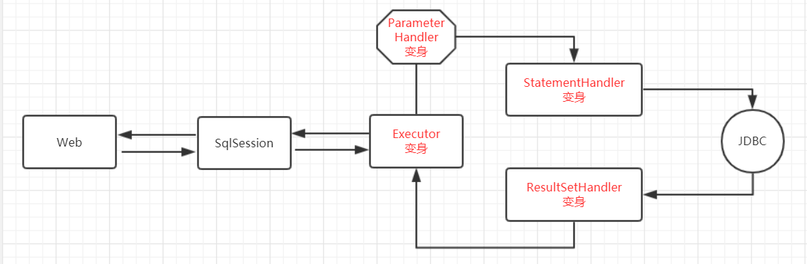
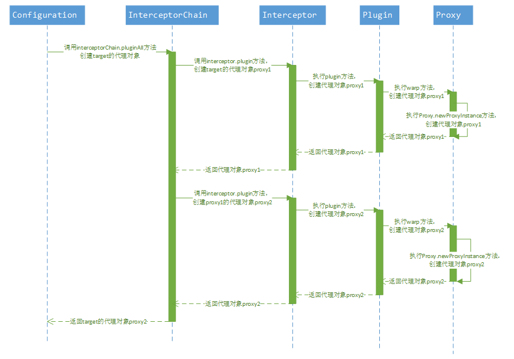
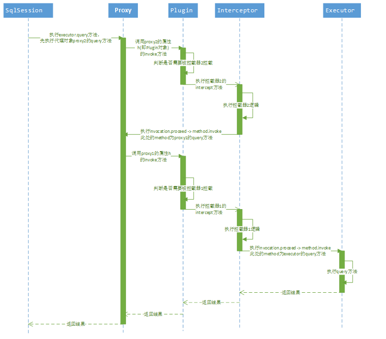

# 1、概述

我们知道，MyBatis有四大核心对象：

- ParameterHandler：处理SQL的参数对象
- ResultSetHandler：处理SQL的返回结果集
- StatementHandler：数据库的处理对象，用于执行SQL语句
- Executor：MyBatis的执行器，用于执行增删改查操作

MyBatis拦截器针对的对象就是上面“四大金刚”。我们想拦截某个对象，需要把这个对象包装一下，也就是重新生成一个代理对象：



这样在每次调用Executor类的方法的时候，总是要经过Interceptor接口的拦截。

借助插件，MyBatis允许用户在SQL执行过程中的某一点进行拦截。常见的应用场景如下：

- **分页查询**：MyBatis的分页默认是基于内存分页的（查出所有，再截取），数据量大的情况下效率较低，不过使用MyBatis插件可以改变该行为，只需要拦截StatementHandler类的prepare方法，改变要执行的SQL语句为分页语句即可；
- **参数赋值**：一般业务系统都会有创建者、创建时间、修改者、修改时间等字段，对于这四个字段的赋值可以在DAO层统一拦截处理，可以用mybatis插件拦截Executor类的update方法，对相关参数进行统一赋值即可；
- **性能监控**：对于SQL语句执行的性能监控，可以通过拦截Executor类的update, query等方法，用日志记录每个方法执行的时间；
- **其它**：基于插件机制，可以控制SQL执行的执行阶段、参数处理阶段、语法构建阶段以及结果集处理阶段，具体可以根据项目业务来实现对应业务逻辑。


配了插件的“四大金刚”会发生变身，这个变身的过程是这样的，以ParameterHandler为例：

第一步：根据插件配置，利用反射技术，创建interceptor拦截器

`Interceptor interceptor = (Interceptor) MyInterceptor.class.newInstance();`

第二步：创建原身

`ParameterHandler parameterHandler = createParameterHandler();`

第三步：原身+拦截器---->变身

`parameterHandler = (ParameterHandler) Plugin.wrap(parameterHandler, interceptor);`

在这一步，将parameterHandler和interceptor包装到一起，生成了变身，并重新赋值给parameterHandler变量。

没有插件的运行过程：



有插件的运行过程：



# 2、代理对象的生成

Mybatis插件主要是基于动态代理实现的，其中最为关键的就是代理对象的生成。

观察源码，发现这些可拦截的类对应的对象生成都是通过InterceptorChain的pluginAll方法来创建的，进一步观察pluginAll方法：

```java
  public Object pluginAll(Object target) {
    for (Interceptor interceptor : interceptors) {
      target = interceptor.plugin(target);
    }
    return target;
  }
```

遍历所有拦截器，调用拦截器的plugin方法生成代理对象，注意生成代理对象重新赋值给target，所以如果有多个拦截器的话，生成的代理对象会被另一个代理对象代理，从而形成一个代理链条，执行的时候，依次执行所有拦截器的拦截逻辑代码。

编写拦截器的时候，一个典型的plugin方法实现方式如下：

```java
@Override
public Object plugin(Object target) {
  return Plugin.wrap(target, this);
}
```

再进一步查看wrap方法：

```java
public static Object wrap(Object target, Interceptor interceptor) {
  Map<Class<?>, Set<Method>> signatureMap = getSignatureMap(interceptor);
  Class<?> type = target.getClass();
  Class<?>[] interfaces = getAllInterfaces(type, signatureMap);
  if (interfaces.length > 0) {
    return Proxy.newProxyInstance(
      type.getClassLoader(),
      interfaces,
      new Plugin(target, interceptor, signatureMap));
  }
  return target;
}
```

典型的**JDK动态代理实现**，调用的是`Proxy.newProxyInstance`方法来生成代理对象。

以上逻辑对应的时序图如下，这里我们假设声明了两个拦截器，那么在创建target代理对象的时候，最终返回的代理对象proxy2，实际上代理了proxy1，而proxy1又代理了target：



# 3、拦截逻辑的执行

由于真正去执行Executor、ParameterHandler、ResultSetHandler和StatementHandler类中的方法的对象是代理对象，所以在执行方法时，首先调用的是Plugin类（实现了InvocationHandler接口）的invoke方法。

首先根据执行方法所属类获取拦截器中声明需要拦截的方法集合；判断当前方法需不需要执行拦截逻辑，需要的话，执行拦截逻辑方法（即Interceptor接口的intercept方法实现），不需要则直接执行原方法：

```java
    @Override
    public Object invoke(Object proxy, Method method, Object[] args) throws Throwable {
        try {
            // 获得目标方法是否被拦截
            Set<Method> methods = signatureMap.get(method.getDeclaringClass());
            if (methods != null && methods.contains(method)) {
                // 如果是，则拦截处理该方法
                return interceptor.intercept(new Invocation(target, method, args));
            }
            // 如果不是，则调用原方法
            return method.invoke(target, args);
        } catch (Exception e) {
            throw ExceptionUtil.unwrapThrowable(e);
        }
    }
```

可以关注下Interceptor接口的intercept方法实现，一般需要用户自定义实现逻辑，其中有一个重要参数，即Invocation类，通过改参数我们可以获取执行对象，执行方法，以及执行方法上的参数，从而进行各种业务逻辑实现，一般在该方法的最后一句代码都是invocation.proceed()（内部执行method.invoke方法），否则将无法执行下一个拦截器的intercept方法。

以上逻辑对应的时序图如下，这里我们以执行executor对象的query方法为例，且假设有两个拦截器存在：



# 4、代码实例

通过 MyBatis 提供的强大机制，使用插件是非常简单的，只需实现 Interceptor 接口，并指定想要拦截的方法签名即可。

Interceptor 接口的定义如下所示：

```java
public interface Interceptor {

    /**
     * 拦截方法
     *
     * @param invocation 调用信息
     * @return 调用结果
     * @throws Throwable 若发生异常
     */
    Object intercept(Invocation invocation) throws Throwable;

    /**
     * 应用插件。如应用成功，则会创建目标对象的代理对象
     *
     * @param target 目标对象
     * @return 应用的结果对象，可以是代理对象，也可以是 target 对象，也可以是任意对象。具体的，看代码实现
     */
    Object plugin(Object target);

    /**
     * 设置拦截器属性
     *
     * @param properties 属性
     */
    void setProperties(Properties properties);

}
```

对于实现自己的Interceptor而言，有两个很重要的注解：

`@Intercepts`用于表明当前的对象是一个Interceptor。其值是一个`@Signature`数组。代码如下所示：

```java
@Documented
@Retention(RetentionPolicy.RUNTIME)
@Target(ElementType.TYPE)
public @interface Intercepts
{
    Signature[] value();
}
```

`@Signature`则表明要拦截的接口、方法以及对应的参数类型。代码如下所示：

```java
@Retention(RetentionPolicy.RUNTIME)
@Target({})
public @interface Signature {
  Class<?> type();

  String method();

  Class<?>[] args();
}
```

下面来看一个自定义的简单Interceptor，出自MyBatis官方教程：

```java
看一个自定义的简单Interceptor，出自MyBatis官方教程：

// ExamplePlugin.java
@Intercepts({@Signature(
  type= Executor.class,
  method = "update",
  args = {MappedStatement.class,Object.class})})
public class ExamplePlugin implements Interceptor {
  private Properties properties = new Properties();
  public Object intercept(Invocation invocation) throws Throwable {
    // implement pre processing if need
    Object returnObject = invocation.proceed();
    // implement post processing if need
    return returnObject;
  }
  public Object plugin(Object target) {
    return Plugin.wrap(target, this);
  }
  public void setProperties(Properties properties) {
    this.properties = properties;
  }
}
```

在上面的源码中`Plugin.wrap()`，是当前拦截器（ExamplePlugin）的代理类。MyBatis通过这个代理类来实现拦截的功能。

```xml
<!-- mybatis-config.xml -->
<plugins>
  <plugin interceptor="org.mybatis.example.ExamplePlugin">
    <property name="someProperty" value="100"/>
  </plugin>
</plugins>
```

Mybatis在注册自定义的拦截器时，会先把对应拦截器下面的所有property通过Interceptor的setProperties方法注入给对应的拦截器。然后这个插件将会拦截在 Executor 实例中所有的 “update” 方法调用，这里的 Executor 是负责执行低层映射语句的内部对象。